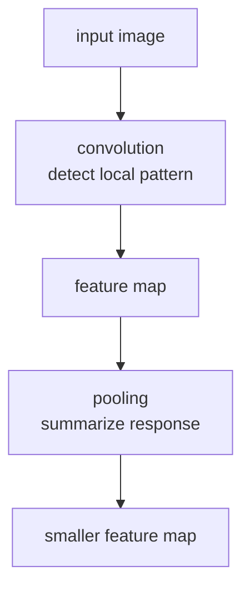

# P4-11.2 합성곱(convolution)과 풀링(pooling)

P4-11.1에서는 CNN을 `이미지의 지역 패턴을 반복해서 읽는 신경망`으로 설명했습니다. 이제 다음 질문이 남습니다.

그 지역 패턴을 실제로 계산하는 핵심 연산은 무엇이며, 풀링(pooling)은 왜 자주 함께 등장하는가?

이 절은 그 질문에 답합니다.

합성곱(convolution)은 작은 필터로 지역 패턴 점수를 계산하는 연산이고, 풀링(pooling)은 그 결과를 더 작고 요약된 형태로 정리하는 연산이다.

## 이 절의 범위

이 절은 다음 질문에 답합니다.

- convolution은 무엇을 계산하는가?
- 필터(filter)와 feature map은 무엇을 뜻하는가?
- pooling은 왜 쓰이며, 무엇을 줄이는가?
- 두 연산이 함께 있을 때 CNN의 표현 흐름은 어떻게 읽히는가?

이 절에서는 다음 내용을 깊게 다루지 않습니다.

- padding/stride/dilation의 상세 공식
- 다양한 pooling 변형과 최신 대체 구조
- FFT convolution 같은 고급 구현

padding, stride, dilation은 이 절에서 `필터가 입력을 읽는 방식`을 이해하는 데 필요한 만큼만 다룹니다. 다양한 pooling 변형은 이 절의 범위 밖에 두고, CNN 이후의 vision 구조 비교는 보충학습 P4-11.3에서 `CNN과 Vision Transformer(ViT)` 중심으로 회수합니다. FFT convolution 같은 고급 구현은 이 책의 현재 본편 범위 밖에 둡니다.

즉, 이 절에서는 convolution 수식을 엄밀히 증명하기보다, `CNN이 지역 패턴을 점수화하고 그 반응을 요약하는 흐름`을 읽는 데 집중합니다.

## 이 절의 목표

- convolution을 `작은 필터가 지역 패턴 점수를 계산하는 연산`으로 설명할 수 있습니다.
- feature map을 `필터 반응의 공간적 기록`으로 설명할 수 있습니다.
- pooling이 왜 공간 크기를 줄이고 중요한 반응을 요약하는 데 쓰이는지 말할 수 있습니다.
- 실행 가능한 Python 예제로 합성곱과 최대 풀링(max pooling)의 직관을 확인할 수 있습니다.

## 이 절을 읽는 순서

이 절은 다음 순서로 읽으면 흐름이 자연스럽습니다.

1. `padding`, `stride`, `dilation`이 필터의 읽는 방식을 어떻게 바꾸는지 먼저 잡습니다.
2. convolution이 지역 패턴 점수를 어떻게 계산하는지 봅니다.
3. 그 결과가 feature map이라는 반응 지도로 남는다는 점을 봅니다.
4. pooling이 그 반응을 어떻게 더 작고 요약된 형태로 넘기는지 봅니다.
5. 마지막에 convolution과 pooling을 한 흐름으로 다시 읽습니다.

## padding, stride, dilation은 무엇을 뜻하나

이 절의 중심은 convolution과 pooling이지만, 바로 앞에서 이름이 나온 `padding`, `stride`, `dilation`도 최소한의 뜻은 여기서 잡고 가는 편이 좋습니다.

세 용어는 모두 `필터가 입력 위를 어떻게 읽는가`를 조정합니다.

| 용어 | 무엇을 바꾸나 | 입문용 직관 |
| --- | --- | --- |
| padding | 입력 가장자리에 값을 덧붙인다 | 가장자리도 덜 놓치고 출력 크기도 너무 빨리 줄지 않게 한다 |
| stride | 필터를 몇 칸씩 건너뛰며 움직일지 정한다 | 한 칸씩 촘촘히 볼지, 두 칸씩 더 크게 건너뛸지 정한다 |
| dilation | 필터 칸 사이 간격을 벌린다 | 필터 크기를 크게 늘리지 않고도 더 넓은 범위를 본다 |

세 선택의 차이는 다음과 같습니다.

- `padding`은 가장자리 바깥에 여백을 더하는 선택입니다.
- `stride`는 필터의 이동 보폭을 정하는 선택입니다.
- `dilation`은 필터 내부 칸 사이 간격을 벌려 보는 선택입니다.

이 절에서는 세 용어를 공식으로 전개하지는 않지만, 뒤의 convolution 설명을 읽을 때는 `필터의 내용`, `필터의 이동 방식`, `필터가 덮는 범위`를 조정하는 장치로 먼저 잡아 두면 됩니다. 아래 작은 장면은 그 차이를 바로 보여 줍니다.

먼저 같은 1차원 줄을 읽는다고 상상해 보겠습니다.

```text
input = [A B C D E]
filter size = 3
```

이때 세 용어는 각각 다른 질문에 답합니다.

- padding: `양끝에 여백을 둘까?`
- stride: `몇 칸씩 움직일까?`
- dilation: `필터 칸 사이를 붙여 읽을까, 띄워 읽을까?`

즉, 셋 모두 convolution 자체를 바꾸기보다 `어떻게 훑을 것인가`를 바꾸는 선택입니다.

### padding은 왜 필요한가

padding이 없으면 필터는 입력 가장자리 바깥으로 나갈 수 없기 때문에, 가장자리 근처 정보는 상대적으로 덜 읽히기 쉽습니다.

예를 들어 3x3 필터를 5x5 이미지에 그대로 움직이면, 필터 중심은 바깥 테두리보다 안쪽에서만 안정적으로 움직입니다. 이때 바깥 가장자리의 작은 선이나 모서리는 덜 반영될 수 있습니다.

padding은 이 바깥에 여백을 한 겹 더 두는 방식입니다.

- 여백이 없으면 가장자리에서 바로 끝납니다.
- 여백이 있으면 가장자리 근처도 한 번 더 읽을 자리가 생깁니다.

즉, padding은 가장자리 근처도 한 번 더 읽을 자리를 만들어, 가장자리 정보를 너무 빨리 잃지 않게 하는 장치입니다.

아주 짧은 줄 예시로 쓰면 다음과 같습니다.

```text
padding 없음:   [A B C] [B C D] [C D E]
padding 있음: [0 A B] [A B C] [B C D] [C D E] [D E 0]
```

여기서 핵심은 `가장자리도 계산 기회가 생긴다`는 점입니다.

### stride는 무엇을 바꾸나

stride는 필터가 한 번에 몇 칸씩 움직일지를 정합니다.

아주 단순하게 보면:

- stride가 1이면 `한 칸씩` 움직이며 촘촘히 읽습니다.
- stride가 2면 `두 칸씩` 건너뛰며 더 성기게 읽습니다.

예를 들어 4칸짜리 줄 위를 2칸 크기 필터가 읽는다고 할 때:

- stride 1이면 `[1-2]`, `[2-3]`, `[3-4]`처럼 겹치며 읽습니다.
- stride 2면 `[1-2]`, `[3-4]`처럼 크게 건너뛰며 읽습니다.

즉, stride는 `얼마나 촘촘하게 훑을 것인가`를 정하는 선택입니다. stride가 커질수록 출력 크기는 더 빨리 줄고, 계산도 더 거칠게 요약됩니다.

이미지에서 이 말을 다시 읽으면 다음과 같습니다.

- stride 1: 거의 모든 위치를 빠짐없이 본다
- stride 2: 한 칸씩 보지 않고 더 성기게 본다

즉, stride를 키우면 `출력은 빨리 줄어들지만 세부 위치 차이는 덜 보게 됩니다.`

### dilation은 왜 따로 이름이 붙나

dilation은 필터 칸 사이 간격을 벌려, 필터 크기를 크게 키우지 않고도 더 넓은 범위를 보게 합니다.

예를 들어 3칸 필터를 그대로 붙여 보면 바로 옆 칸끼리 읽습니다. 하지만 dilation을 주면 `첫 칸`, `한 칸 건너뛴 칸`, `또 한 칸 건너뛴 칸`처럼 더 멀리 떨어진 위치를 함께 읽을 수 있습니다.

즉, dilation은:

- 파라미터 수를 크게 늘리지 않고
- 더 넓은 receptive field를 보고 싶을 때
- 필터 내부 간격을 벌리는 선택

즉, dilation은 파라미터 수를 크게 늘리지 않고 필터 내부 간격을 벌려 더 넓은 receptive field를 보게 하는 선택입니다.

1차원 줄 예시로 보면 차이는 더 단순합니다.

```text
dilation 없음: [A B C]
dilation 있음: [A _ C _ E]처럼 떨어진 위치를 함께 읽음
```

즉, 필터 칸 수는 그대로 두되, `한 번에 보는 범위`만 넓히는 방식입니다.

세 용어를 다시 한 줄로 묶으면 다음과 같습니다.

| 용어 | 입문용 한 문장 |
| --- | --- |
| padding | 가장자리 바깥에 여백을 둬서 가장자리 정보가 너무 빨리 사라지지 않게 한다 |
| stride | 필터를 한 칸씩 볼지, 더 크게 건너뛸지 정한다 |
| dilation | 필터 칸 사이 간격을 벌려 더 넓은 범위를 함께 본다 |

입문 단계에서는 다음 질문으로 다시 확인하면 충분합니다.

- padding: `가장자리도 더 읽게 만들고 싶은가?`
- stride: `더 촘촘히 볼까, 더 크게 건너뛸까?`
- dilation: `필터 크기를 키우지 않고 더 넓게 보고 싶은가?`

### 작은 숫자 예제로 세 차이를 같이 보면

말로만 보면 세 용어가 비슷하게 느껴질 수 있으니, 아주 작은 5x5 입력 위에서 같은 3x3 필터를 읽는 장면으로 다시 묶어 보겠습니다.

```text
input
1 0 0 0 1
0 1 0 1 0
0 0 1 0 0
0 1 0 1 0
1 0 0 0 1

filter
1 0 1
0 1 0
1 0 1
```

이때 독자가 먼저 볼 것은 `필터 값` 자체보다 `어느 위치 묶음을 한 번에 읽는가`입니다.

| 설정 | 필터가 실제로 읽는 장면 변화 | 먼저 생기는 차이 |
| --- | --- | --- |
| padding 0, stride 1, dilation 1 | 입력 안쪽만 촘촘히 읽음 | 가장자리는 읽을 기회가 적고 출력은 3x3이 됨 |
| padding 1, stride 1, dilation 1 | 바깥에 0 여백을 두고 읽음 | 가장자리도 한 번 더 읽고 출력은 5x5로 유지됨 |
| padding 0, stride 2, dilation 1 | 두 칸씩 건너뛰며 읽음 | 읽는 위치 수가 줄어 출력이 더 작아짐 |
| padding 0, stride 1, dilation 2 | 필터 칸 사이를 띄워 더 넓게 읽음 | 같은 3x3 필터라도 더 큰 범위를 한 번에 덮음 |

즉, 세 설정은 모두 `필터가 무엇을 찾는가`보다 `필터를 어떤 간격과 범위로 움직일 것인가`를 바꾸는 장치입니다.

## 실행 가능한 Python 예제로 먼저 보기

이번 작은 예제의 목표는 `padding`, `stride`, `dilation`이 출력 크기와 읽는 위치를 어떻게 바꾸는지 눈으로 확인하는 것입니다. 합성곱 값 전체를 외우는 것이 아니라, `같은 필터라도 스캔 방식이 달라지면 출력 모양과 읽는 패치가 함께 바뀐다`는 점을 잡는 데 목적이 있습니다.

코드를 읽기 전에 아래 세 값부터 순서대로 보면 이 절의 구조 차이가 덜 흩어집니다.

| 먼저 볼 값 | 왜 먼저 보아야 하는가 |
| --- | --- |
| `shape` | 설정이 바뀌었을 때 출력 크기가 먼저 어떻게 달라지는지 한눈에 보이기 때문에 |
| `first_patch` | 필터가 첫 위치에서 실제로 어떤 범위를 읽는지 바로 비교할 수 있기 때문에 |
| `result` | 앞의 두 차이가 최종 반응 지도 전체를 어떻게 바꾸는지 마지막에 묶어 볼 수 있어서 |

입력:

- 5x5 장난감 이미지
- 3x3 필터
- 서로 다른 `padding`, `stride`, `dilation` 설정

출력:

- 설정별 출력 행렬 shape
- 첫 번째 위치에서 실제로 읽은 patch
- 설정별 convolution 결과

문제 상황:

- `padding`, `stride`, `dilation`은 이름은 비슷해 보여도 필터가 이미지를 읽는 범위를 다르게 만든다

확인할 개념:

- convolution 설정은 결과 shape와 실제 patch 범위를 함께 바꾼다
- 첫 위치 patch와 최종 결과를 같이 보면 각 설정 차이가 더 잘 드러난다

입력(input):

위에 정리한 입력 이미지, 필터, 여러 `padding`·`stride`·`dilation` 설정을 사용합니다.

```python
import numpy as np

image = np.array([
    [1, 0, 0, 0, 1],
    [0, 1, 0, 1, 0],
    [0, 0, 1, 0, 0],
    [0, 1, 0, 1, 0],
    [1, 0, 0, 0, 1],
], dtype=float)

kernel = np.array([
    [1, 0, 1],
    [0, 1, 0],
    [1, 0, 1],
], dtype=float)


def conv2d(image, kernel, padding=0, stride=1, dilation=1):
    padded = np.pad(image, padding, mode="constant", constant_values=0)
    kernel_h, kernel_w = kernel.shape
    effective_h = kernel_h + (kernel_h - 1) * (dilation - 1)
    effective_w = kernel_w + (kernel_w - 1) * (dilation - 1)
    out_h = ((padded.shape[0] - effective_h) // stride) + 1
    out_w = ((padded.shape[1] - effective_w) // stride) + 1
    output = np.zeros((out_h, out_w))

    first_patch = None
    for out_i in range(out_h):
        for out_j in range(out_w):
            row = out_i * stride
            col = out_j * stride
            sampled = padded[
                row:row + effective_h:dilation,
                col:col + effective_w:dilation,
            ]
            if first_patch is None:
                first_patch = sampled.copy()
            output[out_i, out_j] = np.sum(sampled * kernel)

    return output, first_patch


settings = [
    ("base", 0, 1, 1),
    ("padding=1", 1, 1, 1),
    ("stride=2", 0, 2, 1),
    ("dilation=2", 0, 1, 2),
]

for name, padding, stride, dilation in settings:
    result, first_patch = conv2d(
        image=image,
        kernel=kernel,
        padding=padding,
        stride=stride,
        dilation=dilation,
    )
    print(f"[{name}]")
    print("shape =", result.shape)
    print("first_patch =")
    print(first_patch)
    print("result =")
    print(result)
```

출력에서는 result의 shape, 첫 patch, 그리고 최종 result 값이 어떻게 연결되는지 순서대로 보면 됩니다.

```text
[base]
shape = (3, 3)
first_patch =
[[1. 0. 0.]
 [0. 1. 0.]
 [0. 0. 1.]]
result =
[[3. 0. 3.]
 [0. 5. 0.]
 [3. 0. 3.]]
[padding=1]
shape = (5, 5)
first_patch =
[[0. 0. 0.]
 [0. 1. 0.]
 [0. 0. 1.]]
result =
[[2. 0. 2. 0. 2.]
 [0. 3. 0. 3. 0.]
 [2. 0. 5. 0. 2.]
 [0. 3. 0. 3. 0.]
 [2. 0. 2. 0. 2.]]
[stride=2]
shape = (2, 2)
first_patch =
[[1. 0. 0.]
 [0. 1. 0.]
 [0. 0. 1.]]
result =
[[3. 3.]
 [3. 3.]]
[dilation=2]
shape = (1, 1)
first_patch =
[[1. 0. 1.]
 [0. 1. 0.]
 [1. 0. 1.]]
result =
[[5.]]
```

| 먼저 볼 출력 | 이 출력이 뜻하는 것 | 바꿔 보면 달라지는 것 |
| --- | --- | --- |
| `padding=1`에서 `shape = (5, 5)`가 된다 | 가장자리를 0으로 둘러 출력 크기를 더 오래 유지한다는 뜻 | padding 값을 더 키우거나 없애면 출력 크기와 가장자리 반응이 어떻게 달라지는지 바로 보입니다 |
| `stride=2`에서 `shape = (2, 2)`로 줄어든다 | 필터가 두 칸씩 건너뛰며 읽어 공간 해상도를 더 빨리 줄인다는 뜻 | stride를 다시 1로 바꾸면 얼마나 더 촘촘히 읽는지 비교할 수 있습니다 |
| `dilation=2`에서 `first_patch`가 띄엄띄엄 값들을 잡고 `result = [[5.]]`가 된다 | 같은 3x3 필터라도 더 넓은 범위를 간격을 두고 읽는다는 뜻 | dilation을 1과 2로 바꾸면 같은 커널이 실제로 어떤 범위를 읽는지 직접 달라집니다 |

즉, 이 출력은 `padding=1`이 가장자리와 출력 크기를 더 오래 유지하고, `stride=2`가 읽는 위치 수를 줄이며, `dilation=2`가 같은 커널로 더 넓은 범위를 띄엄띄엄 읽게 만든다는 점을 함께 보여 줍니다. 세 용어는 convolution을 `다른 연산`으로 바꾸는 것이 아니라, 같은 convolution이 `어떤 범위와 간격으로 입력을 읽을지`를 바꾸는 선택입니다.

이 예제도 결과를 한 번 읽고 끝내기보다, 어떤 값을 바꿔 보면 `읽는 범위와 간격` 차이가 더 선명해지는지 바로 이어서 확인하는 편이 좋습니다.

| 먼저 보인 출력 신호 | 지금 바로 해 볼 변화 | 아직 이 예제만으로 서두르지 않을 결론 |
| --- | --- | --- |
| padding을 주면 shape가 커진다 | padding을 0, 1, 2로 바꿔 가장자리와 출력 크기가 어떻게 변하는지 본다 | 출력이 커졌다고 해서 곧바로 더 좋은 특징 추출이라고 단정하지 않는다 |
| stride를 키우면 result가 더 작아진다 | stride를 1과 2로 바꿔 얼마나 많은 위치를 건너뛰는지 비교한다 | 작은 feature map이 항상 더 좋은 요약이라고 단정하지 않는다 |
| dilation을 키우면 first_patch 범위가 넓어진다 | dilation을 1과 2로 바꿔 같은 커널이 실제로 어떤 좌표를 읽는지 본다 | dilation 하나만으로 receptive field 전체 개념을 다 설명했다고 단정하지 않는다 |

## convolution은 무엇을 하나

합성곱(convolution)은 작은 필터(filter)를 이미지 여러 위치에 움직이며, 그 위치가 특정 패턴과 얼마나 잘 맞는지 점수화합니다.

핵심은 필터가 찾고 싶은 작은 패턴을 들고 이미지 각 위치를 훑으며 반응 점수를 만드는 데 있습니다.

- 필터는 `찾고 싶은 작은 패턴 템플릿`처럼 볼 수 있고
- 이미지의 각 지역 패치와 곱셈/덧셈을 해
- 그 위치의 반응 점수를 만듭니다

즉, convolution은 이미지 전체를 한 번에 판단하지 않고, `작은 패턴 탐지기`를 전체 위치에 반복 적용하는 방식입니다.

## 필터(filter)는 무엇을 뜻하나

필터는 보통 작은 숫자 배열입니다. 예를 들어 3x3 필터는 3x3 지역 패치를 볼 수 있습니다.

`필터는 edge, 방향, 질감, 작은 모양 같은 패턴에 반응하도록 학습되는 작은 가중치 묶음이다.`

CNN이 학습되면 이런 필터 값들도 데이터에 맞게 바뀝니다. 즉, 사람이 직접 모든 필터를 설계하는 것이 아니라, 모델이 어떤 필터가 유용한지를 함께 학습합니다.

## feature map은 무엇인가

필터 하나를 이미지 전체에 적용하면, 각 위치에서 얼마나 강하게 반응했는지를 담은 새로운 2차원 배열이 나옵니다. 이것을 feature map이라고 부릅니다.

즉:

- 입력 이미지 위에서
- 필터를 위치마다 적용하고
- 그 반응값을 기록한 결과가

feature map입니다.

핵심은 feature map이 특정 필터의 반응이 이미지 어디에서 얼마나 강했는지를 위치별로 기록한 결과라는 점입니다.

`feature map은 특정 필터가 이미지의 어디에서 얼마나 강하게 반응했는지를 기록한 지도(map)이다.`

독자는 여기서 다음 구분을 같이 잡으면 좋습니다.

| 이름 | 무엇을 뜻하나 |
| --- | --- |
| filter | 찾고 싶은 작은 패턴 템플릿 |
| convolution result | 각 위치에서 계산된 패턴 점수 |
| feature map | 그 점수들을 위치별로 모아 놓은 결과 지도 |

## pooling은 왜 필요한가

convolution 결과를 그대로 계속 쌓기만 하면 공간 크기가 계속 크고 계산량도 많아질 수 있습니다. 또, 모든 세부 위치 정보를 끝까지 그대로 들고 가는 것이 항상 좋은 것도 아닙니다.

pooling은 이런 정보를 더 요약된 형태로 줄이는 역할을 합니다.

예를 들어 max pooling은 작은 구역 안에서 가장 큰 반응만 남깁니다.

`pooling은 세부 위치 정보를 조금 줄이는 대신, 중요한 반응을 더 압축해서 다음 층으로 넘기는 방식이다.`

## 왜 max pooling이 직관적인가

max pooling은 작은 창 안에서 가장 큰 값 하나를 고릅니다. 이 방식은 독자에게 다음 직관을 줍니다.

- 그 구역에서 가장 강한 패턴 반응이 무엇인지 남긴다
- 작은 위치 변화에는 덜 민감해질 수 있다
- 공간 크기를 줄여 계산을 압축한다

즉, max pooling은 `가장 눈에 띄는 신호를 남기는 요약`으로 읽으면 좋습니다.

이 차이를 더 짧게 비교하면 다음과 같습니다.

| 단계 | 주로 하는 일 |
| --- | --- |
| convolution | 패턴을 찾는다 |
| pooling | 찾은 반응을 요약한다 |

같은 이미지 장면을 두 단계로 나눠 보면 차이가 더 직접 보입니다.

| 같은 장면 | convolution이 먼저 하는 일 | pooling이 바로 이어서 하는 일 |
| --- | --- | --- |
| 검은 선이 있는 흰 배경 | 어디에서 경계 반응이 강한지 점수화한다 | 그 구역에서 가장 강한 경계 반응만 남겨 더 작게 넘긴다 |
| 얼굴 사진의 눈 주변 | 눈썹 선, 눈 경계 같은 작은 구조에 먼저 반응한다 | 강한 반응을 압축해 다음 층이 더 큰 얼굴 부분을 읽기 쉽게 만든다 |
| 표면 결함 이미지 | 작은 스크래치나 깨짐 위치에서 반응을 키운다 | 결함 후보 신호를 요약해 불량 판단에 남기기 쉽게 만든다 |

## convolution과 pooling은 함께 어떻게 읽히나

둘을 아주 단순하게 이어 보면 다음과 같습니다.



이 도식은 `찾는다 -> 기록한다 -> 요약한다`라는 세 동작을 보여 줍니다.

1. convolution이 먼저 지역 패턴을 찾습니다.
2. feature map이 그 반응을 위치별로 기록합니다.
3. pooling이 그 기록을 더 작고 요약된 형태로 넘깁니다.

이 흐름은 실제 이미지 조각과 숫자 배열을 함께 놓고 보면 더 쉽게 읽힙니다. 아래 예시는 `밝은 세로선이 가운데에 있는 작은 이미지`를 0과 1로 단순화한 것입니다.

| 장면 | 값 표현 |
| --- | --- |
| 작은 이미지 샘플 | 가운데 밝은 세로선이 보이는 4x4 흑백 패치 |
| 입력 행렬 샘플 | `[[0, 1, 1, 0], [0, 1, 1, 0], [0, 1, 1, 0], [0, 1, 1, 0]]` |

이 입력 위에 `세로선에 반응하는 2x2 필터`를 얹는다고 생각해 보겠습니다.

| 항목 | 값 |
| --- | --- |
| filter | `[[1, -1], [1, -1]]` |
| 읽는 방식 | 왼쪽 열과 오른쪽 열의 차이를 비교해 세로 경계를 찾음 |

필터를 한 칸씩 움직이며 계산하면 다음처럼 `feature map`이 생깁니다.

| 단계 | 행렬 샘플 |
| --- | --- |
| input image | `[[0, 1, 1, 0], [0, 1, 1, 0], [0, 1, 1, 0], [0, 1, 1, 0]]` |
| convolution result | `[[-2, 0, 2], [-2, 0, 2], [-2, 0, 2]]` |
| 2x2 max pooling result | `[[0, 2]]` |

이 숫자를 읽을 때 핵심은 다음과 같습니다.

- `-2`는 필터 방향과 반대인 경계 반응으로 읽을 수 있습니다.
- `0`은 필터가 기대한 세로 변화가 거의 없는 위치입니다.
- `2`는 필터가 찾던 세로 경계가 강하게 잡힌 위치입니다.
- max pooling 뒤의 `[[0, 2]]`는 세부 위치를 줄이더라도 `강한 세로 경계가 오른쪽 쪽에 있었다`는 요점을 남깁니다.

즉, 작은 이미지 샘플은 사람이 보는 장면을 붙잡아 주고, 행렬 샘플은 convolution과 pooling이 실제로 어떤 숫자 요약을 만드는지 보여 줍니다.

이 흐름은 CNN이:

- 먼저 패턴을 찾고
- 그 반응을 기록한 뒤
- 더 압축된 형태로 다음 층에 넘긴다는 점

을 보여 줍니다.

즉, `convolution은 지역 패턴을 점수화하고, pooling은 그 점수를 다음 층이 읽기 쉬운 형태로 더 작게 넘깁니다.`

CNN을 Part 5나 Transformer 이전의 과거 구조로만 읽으면 `이미지용 옛 모델 이름`처럼 보이기 쉽습니다. 하지만 Part 4에서 CNN이 맡는 책임은 이미 여기서 닫힙니다. 즉, CNN은 `이미지에서 지역 패턴을 어떻게 탐지하고 요약할 것인가`에 대한 자체 답을 가진 구조이며, 뒤 Part는 이 답을 대체하는 자리가 아니라 다른 데이터 구조 문제를 다루는 자리로만 이어지면 충분합니다.

## 사례로 보기

### 사례 1. edge detection 직관

흰 배경 위에 검은 선이 지나가는 이미지를 생각해 보겠습니다. 사람은 이런 장면을 볼 때 `선이 어디에 있나`를 먼저 눈으로 찾습니다. 하지만 컴퓨터가 원본 픽셀 숫자만 그대로 보면, 어느 값 변화가 선이고 어느 값 변화가 단순 잡음인지 바로 구분하기 어렵습니다. 예를 들어 선이 한 픽셀 옆으로 조금만 이동해도, 원본 숫자 배열만 보면 완전히 다른 값처럼 보일 수 있습니다. 필터는 바로 이런 밝기 변화가 큰 위치에서 강하게 반응하도록 만들 수 있습니다. 그러면 feature map에는 선이나 경계가 있는 자리가 더 큰 값으로 나타나고, 모델은 `어디에 구조가 있는가`를 숫자로 읽기 시작합니다.

### 사례 2. 얼굴 이미지

얼굴 사진에서 초기 필터는 눈썹 선, 눈 주변 contrast, 입 경계 같은 작은 구조에 먼저 반응할 수 있습니다. 사람도 얼굴을 볼 때 처음에는 이런 부분 단서를 보고 전체 인상으로 묶어 갑니다. 하지만 뒤층으로 갈수록 모든 위치의 세부 값을 그대로 들고 가면 계산이 무거워지고, 핵심 구조도 흐려질 수 있습니다. 예를 들어 눈 주변에서 이미 강한 반응이 나왔는데도 그 주변의 비슷한 값들을 모두 그대로 다음 층에 넘기면, 중요한 단서보다 중복 정보가 더 많아질 수 있습니다. pooling은 강하게 반응한 부분을 더 요약된 형태로 넘겨, 중요한 지역 단서를 압축해 다음 층이 더 큰 패턴을 읽게 돕습니다.

### 사례 3. 의료 이미지나 산업 비전

의료 이미지에서는 병변 경계가 흐릿하게 나타나고, 산업 비전에서는 미세한 결함 표면이 작은 영역에만 나타날 수 있습니다. 사람은 전체 이미지를 멀리서 보면 대체로 정상처럼 느끼고 지나가기 쉽지만, 실제로는 아주 작은 영역의 미세한 경계 변화가 핵심일 수 있습니다. 예를 들어 금속 표면의 금 간 부분이 이미지 전체에서는 매우 작아도, 그 작은 경계 반응 하나가 불량 판정의 출발점일 수 있습니다. 이런 경우 전체 이미지를 한 번에 평균내면 중요한 이상이 묻혀 버리기 쉽습니다. convolution은 국소 구조를 먼저 점수화하고, pooling은 그 반응을 요약해 다음 단계로 넘기므로 이런 장면을 설명하기 좋습니다.

세 사례에서 공통으로 확인해야 할 결과는 convolution이 먼저 국소 반응을 세우고, pooling이 그 반응을 더 작은 다음 단계 입력으로 요약한다는 점입니다. edge detection에서는 경계 위치 반응이 살아나는지, 얼굴 이미지에서는 핵심 부분 반응이 남는지, 의료·산업 비전에서는 작은 이상 신호가 요약 뒤에도 불량 후보 판단에 남는지를 보면 충분합니다.

세 사례를 한 줄로 다시 묶으면 다음과 같습니다.

| 상황 | convolution이 중요한 이유 | pooling이 중요한 이유 |
| --- | --- | --- |
| edge detection | 밝기 변화 위치를 점수화하기 위해 | 강한 edge 반응을 요약하기 위해 |
| 얼굴 이미지 | 눈, 입 경계 같은 국소 구조를 찾기 위해 | 부분 반응을 더 압축해 다음 층으로 넘기기 위해 |
| 의료/산업 비전 | 미세 결함이나 경계를 찾기 위해 | 중요한 이상 신호를 더 작게 요약하기 위해 |

## 실행 가능한 Python 예제로 보기

이번 예제의 목표는 2x2 필터를 이용한 단순 convolution과, 그 결과에 대한 2x2 max pooling 직관을 확인하는 것입니다. 단순 결과만 보는 대신, 어느 위치에서 강한 반응이 생겼고 pooling이 무엇을 남기는지도 같이 읽습니다.

입력:

- 4x4 작은 이미지
- 2x2 필터

출력:

- convolution 결과
- max pooling 결과

문제 상황:

- pooling은 convolution 다음에 정보량을 줄이면서도 강한 반응을 남기는 역할이라는 점을 직접 비교해 볼 필요가 있다

확인할 개념:

- convolution과 pooling은 같은 이미지에서도 서로 다른 축약 결과를 만든다
- max pooling은 지역 내 가장 강한 반응을 남겨 크기를 줄인다

입력(input):

위에 정리한 4x4 이미지와 2x2 필터를 사용합니다.

```python
import numpy as np

image = np.array([
    [1, 2, 0, 1],
    [3, 1, 2, 2],
    [0, 1, 3, 1],
    [2, 2, 1, 0],
], dtype=float)

kernel = np.array([
    [1, 0],
    [0, -1],
], dtype=float)

conv = np.zeros((3, 3))
for i in range(3):
    for j in range(3):
        patch = image[i:i+2, j:j+2]
        conv[i, j] = np.sum(patch * kernel)

pool = np.zeros((1, 1))
pool[0, 0] = np.max(conv[0:2, 0:2])

print("image =")
print(image)
print("kernel =")
print(kernel)
print("convolution result =")
print(conv)
print("max pooling on top-left 2x2 region =", pool[0, 0])
```

출력에서는 `convolution result`에서 큰 반응이 어디 있었는지와 `max pooling` 값이 무엇을 남겼는지 순서대로 보면 됩니다.

```text
image =
[[1. 2. 0. 1.]
 [3. 1. 2. 2.]
 [0. 1. 3. 1.]
 [2. 2. 1. 0.]]
kernel =
[[ 1.  0.]
 [ 0. -1.]]
convolution result =
[[ 0.  0. -2.]
 [ 2. -2.  1.]
 [-2.  0.  3.]]
max pooling on top-left 2x2 region = 2.0
```

| 먼저 볼 출력 | 이 출력이 뜻하는 것 | 바꿔 보면 달라지는 것 |
| --- | --- | --- |
| `convolution result`의 오른쪽 아래 값 `3`이 가장 크다 | 필터가 이미지 모든 위치에 같은 방식으로 적용되더라도 특정 지역이 더 강하게 반응할 수 있다는 뜻 | 이미지 값이나 커널 값을 바꾸면 strongest response가 어느 위치로 이동하는지 달라집니다 |
| `convolution result` 안에 `-2`, `0`, `1`, `2`, `3`처럼 값 차이가 있다 | feature map은 단순 통과가 아니라 위치별 패턴 일치 정도 차이를 기록한다는 뜻 | 커널 부호나 크기를 바꾸면 어떤 패턴이 양수 반응, 음수 반응을 만드는지 비교할 수 있습니다 |
| `max pooling on top-left 2x2 region = 2.0`만 남는다 | pooling은 작은 구역 안의 여러 반응 중 가장 강한 값만 요약해 넘긴다는 뜻 | pooling 창 위치나 크기를 바꾸면 어떤 반응이 살아남는지 바로 달라집니다 |

즉, 이 출력은 convolution이 지역 패턴 점수를 위치별로 만들고, pooling이 그 반응 중 강한 신호를 더 작은 형태로 넘긴다는 흐름을 함께 보여 주며, 어떤 값을 바꿔 보면 `패턴 탐지와 요약` 차이가 어떻게 달라지는지도 바로 다시 확인할 수 있습니다.

| 먼저 보인 출력 신호 | 지금 바로 해 볼 변화 | 아직 이 예제만으로 서두르지 않을 결론 |
| --- | --- | --- |
| strongest response가 오른쪽 아래에 있다 | 이미지 특정 구역 값을 바꿔 strongest response 위치가 어떻게 이동하는지 본다 | 큰 반응 위치 하나만으로 전체 이미지 의미를 곧바로 안다고 단정하지 않는다 |
| feature map 값이 양수와 음수로 갈린다 | 커널 값을 바꿔 어떤 패턴 차이가 양수 반응과 음수 반응을 만드는지 본다 | 이 작은 커널 하나로 실제 CNN 필터 학습 전체를 대체하지 않는다 |
| pooling은 `2.0` 하나만 남긴다 | pooling 창 크기나 위치를 바꿔 어떤 반응이 살아남고 어떤 세부 정보가 사라지는지 본다 | pooling이 항상 무조건 좋은 요약만 만든다고 단정하지 않는다 |

CNN 교육에서 convolution과 pooling은 거의 항상 함께 소개됩니다. 이유는 이 둘이 CNN의 핵심 계산 흐름을 가장 압축적으로 보여 주기 때문입니다.

역사적으로도 LeNet, AlexNet 같은 구조를 통해 convolution 기반 지역 패턴 탐지와 pooling 기반 요약이 이미지 인식의 기본 직관으로 널리 퍼졌습니다. 이후 구조는 더 다양해졌지만, 입문 단계에서는 여전히 가장 중요한 기본 축입니다.

## 다음 절과의 연결

여기까지 오면 다음 질문이 남습니다.

- 이미지처럼 공간 구조가 아니라 시간 순서(sequence)가 중요한 데이터는 어떻게 다루는가?
- 앞에서 본 패턴을 기억해야 하는 문제에서는 왜 CNN만으로는 부족하다고 느껴졌는가?

이 질문은 바로 P4-12.1 RNN, LSTM, GRU의 필요성으로 이어집니다.

## 이 절에서 기억할 관점

- convolution은 작은 필터로 지역 패턴 점수를 계산하는 연산입니다.
- feature map은 필터 반응이 공간적으로 기록된 결과입니다.
- pooling은 중요한 반응을 더 작은 형태로 요약합니다.
- CNN은 지역 패턴 탐지와 요약을 반복하며 표현을 쌓아 갑니다.

## 체크리스트

- convolution을 입문 수준에서 한 문장으로 설명할 수 있는가?
- 필터와 feature map의 관계를 설명할 수 있는가?
- pooling이 왜 필요한지 말할 수 있는가?
- 다음 절의 순차 데이터 구조로 왜 자연스럽게 넘어가는지 연결할 수 있는가?

## 출처와 참고 자료

- Yann LeCun et al., `Gradient-Based Learning Applied to Document Recognition`, Proceedings of the IEEE, 1998, 확인 날짜: 2026-06-29.
- Ian Goodfellow, Yoshua Bengio, Aaron Courville, `Deep Learning`, MIT Press, 2016, 확인 날짜: 2026-06-29. [https://www.deeplearningbook.org/](https://www.deeplearningbook.org/){: target="_blank" rel="noopener noreferrer" }
- Alex Krizhevsky, Ilya Sutskever, Geoffrey E. Hinton, `ImageNet Classification with Deep Convolutional Neural Networks`, NeurIPS 2012, 확인 날짜: 2026-06-29.
