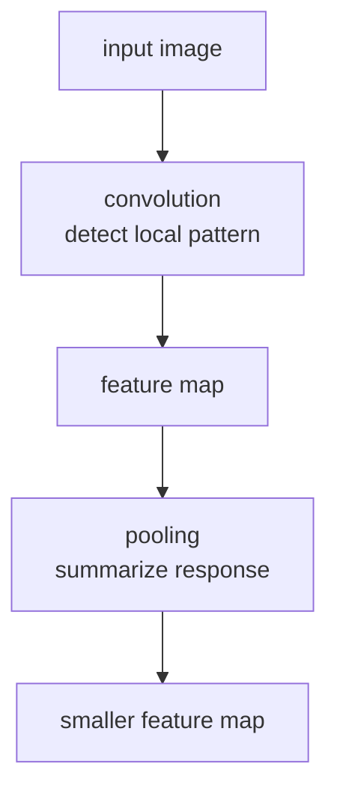

# P4-11.2 합성곱(convolution)과 풀링(pooling)

P4-11.1에서는 CNN을 `이미지의 지역 패턴을 반복해서 읽는 신경망`으로 설명했습니다. 이제 다음 질문이 남습니다.

그 지역 패턴을 실제로 계산하는 핵심 연산은 무엇이며, 풀링(pooling)은 왜 자주 함께 등장하는가?

이 절은 그 질문에 답합니다.

합성곱(convolution)은 작은 필터로 지역 패턴 점수를 계산하는 연산이고, 풀링(pooling)은 그 결과를 더 작고 요약된 형태로 정리하는 연산이다.

## 이 절의 범위

이 절은 다음 질문에 답합니다.

- convolution은 무엇을 계산하는가?
- 필터(filter)와 feature map은 무엇을 뜻하는가?
- pooling은 왜 쓰이며, 무엇을 줄이는가?
- 두 연산이 함께 있을 때 CNN의 표현 흐름은 어떻게 읽히는가?

이 절에서는 다음 내용을 깊게 다루지 않습니다.

- padding/stride/dilation의 상세 공식
- 다양한 pooling 변형과 최신 대체 구조
- FFT convolution 같은 고급 구현

padding, stride, dilation은 이 절에서 이름과 역할 수준까지만 언급하고, 상세 공식과 구현 차이는 본격적으로 전개하지 않습니다. 지역 패턴에서 계층적 표현으로 이어지는 큰 그림은 앞의 P4-10.2와 P4-11.1에서 이미 잡았고, 이 절에서는 그 위에 convolution과 pooling 직관을 얹습니다. 다양한 pooling 변형, 최신 vision 구조, FFT convolution 같은 고급 구현은 이 책의 현재 본편 범위 밖에 둡니다.

이 절에서는 convolution 수식을 엄밀히 증명하기보다, `CNN이 지역 패턴을 점수화하고 요약하는 흐름`을 설명합니다. 앞 절에서 본 계층적 표현 흐름을 바탕으로, 여기서는 convolution과 pooling이 그 흐름 안에서 어떤 계산 역할을 하는지 읽는 데 집중합니다. 최신 vision 구조와 고급 구현 세부는 이 책의 현재 본편 범위 밖에 둡니다.

## 이 절의 목표

- convolution을 `작은 필터가 지역 패턴 점수를 계산하는 연산`으로 설명할 수 있습니다.
- feature map을 `필터 반응의 공간적 기록`으로 설명할 수 있습니다.
- pooling이 왜 공간 크기를 줄이고 중요한 반응을 요약하는 데 쓰이는지 말할 수 있습니다.
- 작은 Python 예제로 합성곱과 최대 풀링(max pooling)의 직관을 확인할 수 있습니다.

## convolution은 무엇을 하나

합성곱(convolution)은 작은 필터(filter)를 이미지 여러 위치에 움직이며, 그 위치가 특정 패턴과 얼마나 잘 맞는지 점수화합니다.

다음처럼 이해하면 충분합니다.

- 필터는 `찾고 싶은 작은 패턴 템플릿`처럼 볼 수 있고
- 이미지의 각 지역 패치와 곱셈/덧셈을 해
- 그 위치의 반응 점수를 만듭니다

즉, convolution은 이미지 전체를 한 번에 판단하지 않고, `작은 패턴 탐지기`를 전체 위치에 반복 적용하는 방식입니다.

## 필터(filter)는 무엇을 뜻하나

필터는 보통 작은 숫자 배열입니다. 예를 들어 3x3 필터는 3x3 지역 패치를 볼 수 있습니다.

다음처럼 기억하면 충분합니다.

`필터는 edge, 방향, 질감, 작은 모양 같은 패턴에 반응하도록 학습되는 작은 가중치 묶음이다.`

CNN이 학습되면 이런 필터 값들도 데이터에 맞게 바뀝니다. 즉, 사람이 직접 모든 필터를 설계하는 것이 아니라, 모델이 어떤 필터가 유용한지를 함께 학습합니다.

## feature map은 무엇인가

필터 하나를 이미지 전체에 적용하면, 각 위치에서 얼마나 강하게 반응했는지를 담은 새로운 2차원 배열이 나옵니다. 이것을 feature map이라고 부릅니다.

즉:

- 입력 이미지 위에서
- 필터를 위치마다 적용하고
- 그 반응값을 기록한 결과가

feature map입니다.

다음처럼 이해하면 충분합니다.

`feature map은 특정 필터가 이미지의 어디에서 얼마나 강하게 반응했는지를 기록한 지도(map)이다.`

독자는 여기서 다음 구분을 같이 잡으면 좋습니다.

| 이름 | 무엇을 뜻하나 |
| --- | --- |
| filter | 찾고 싶은 작은 패턴 템플릿 |
| convolution result | 각 위치에서 계산된 패턴 점수 |
| feature map | 그 점수들을 위치별로 모아 놓은 결과 지도 |

## pooling은 왜 필요한가

convolution 결과를 그대로 계속 쌓기만 하면 공간 크기가 계속 크고 계산량도 많아질 수 있습니다. 또, 모든 세부 위치 정보를 끝까지 그대로 들고 가는 것이 항상 좋은 것도 아닙니다.

pooling은 이런 정보를 더 요약된 형태로 줄이는 역할을 합니다.

예를 들어 max pooling은 작은 구역 안에서 가장 큰 반응만 남깁니다.

다음처럼 기억하면 충분합니다.

`pooling은 세부 위치 정보를 조금 줄이는 대신, 중요한 반응을 더 압축해서 다음 층으로 넘기는 방식이다.`

## 왜 max pooling이 직관적인가

max pooling은 작은 창 안에서 가장 큰 값 하나를 고릅니다. 이 방식은 독자에게 다음 직관을 줍니다.

- 그 구역에서 가장 강한 패턴 반응이 무엇인지 남긴다
- 작은 위치 변화에는 덜 민감해질 수 있다
- 공간 크기를 줄여 계산을 압축한다

즉, max pooling은 `가장 눈에 띄는 신호를 남기는 요약`으로 읽으면 좋습니다.

이 차이를 더 짧게 비교하면 다음과 같습니다.

| 단계 | 주로 하는 일 |
| --- | --- |
| convolution | 패턴을 찾는다 |
| pooling | 찾은 반응을 요약한다 |

## convolution과 pooling은 함께 어떻게 읽히나

둘을 아주 단순하게 이어 보면 다음과 같습니다.



이 흐름은 실제 이미지 조각과 숫자 배열을 함께 놓고 보면 더 쉽게 읽힙니다. 아래 예시는 `밝은 세로선이 가운데에 있는 작은 이미지`를 0과 1로 단순화한 것입니다.

| 장면 | 값 표현 |
| --- | --- |
| 작은 이미지 샘플 | 가운데 밝은 세로선이 보이는 4x4 흑백 패치 |
| 입력 행렬 샘플 | `[[0, 1, 1, 0], [0, 1, 1, 0], [0, 1, 1, 0], [0, 1, 1, 0]]` |

이 입력 위에 `세로선에 반응하는 2x2 필터`를 얹는다고 생각해 보겠습니다.

| 항목 | 값 |
| --- | --- |
| filter | `[[1, -1], [1, -1]]` |
| 읽는 방식 | 왼쪽 열과 오른쪽 열의 차이를 비교해 세로 경계를 찾음 |

필터를 한 칸씩 움직이며 계산하면 다음처럼 `feature map`이 생깁니다.

| 단계 | 행렬 샘플 |
| --- | --- |
| input image | `[[0, 1, 1, 0], [0, 1, 1, 0], [0, 1, 1, 0], [0, 1, 1, 0]]` |
| convolution result | `[[-2, 0, 2], [-2, 0, 2], [-2, 0, 2]]` |
| 2x2 max pooling result | `[[0, 2]]` |

이 숫자를 읽을 때 핵심은 다음과 같습니다.

- `-2`는 필터 방향과 반대인 경계 반응으로 읽을 수 있습니다.
- `0`은 필터가 기대한 세로 변화가 거의 없는 위치입니다.
- `2`는 필터가 찾던 세로 경계가 강하게 잡힌 위치입니다.
- max pooling 뒤의 `[[0, 2]]`는 세부 위치를 줄이더라도 `강한 세로 경계가 오른쪽 쪽에 있었다`는 요점을 남깁니다.

즉, 작은 이미지 샘플은 사람이 보는 장면을 붙잡아 주고, 행렬 샘플은 convolution과 pooling이 실제로 어떤 숫자 요약을 만드는지 보여 줍니다.

이 흐름은 CNN이:

- 먼저 패턴을 찾고
- 그 반응을 기록한 뒤
- 더 압축된 형태로 다음 층에 넘긴다는 점

을 보여 줍니다.

## 사례로 보기

### 사례 1. edge detection 직관

흰 배경 위에 검은 선이 지나가는 이미지를 생각해 보겠습니다. 사람은 이런 장면을 볼 때 `선이 어디에 있나`를 먼저 눈으로 찾습니다. 하지만 컴퓨터가 원본 픽셀 숫자만 그대로 보면, 어느 값 변화가 선이고 어느 값 변화가 단순 잡음인지 바로 구분하기 어렵습니다. 예를 들어 선이 한 픽셀 옆으로 조금만 이동해도, 원본 숫자 배열만 보면 완전히 다른 값처럼 보일 수 있습니다. 필터는 바로 이런 밝기 변화가 큰 위치에서 강하게 반응하도록 만들 수 있습니다. 그러면 feature map에는 선이나 경계가 있는 자리가 더 큰 값으로 나타나고, 모델은 `어디에 구조가 있는가`를 숫자로 읽기 시작합니다. 그래서 이 사례에서 확인해야 할 결과는 원본 픽셀 전체를 보지 않아도 경계가 있는 위치에서 반응값이 더 커지는가입니다.

### 사례 2. 얼굴 이미지

얼굴 사진에서 초기 필터는 눈썹 선, 눈 주변 contrast, 입 경계 같은 작은 구조에 먼저 반응할 수 있습니다. 사람도 얼굴을 볼 때 처음에는 이런 부분 단서를 보고 전체 인상으로 묶어 갑니다. 하지만 뒤층으로 갈수록 모든 위치의 세부 값을 그대로 들고 가면 계산이 무거워지고, 핵심 구조도 흐려질 수 있습니다. 예를 들어 눈 주변에서 이미 강한 반응이 나왔는데도 그 주변의 비슷한 값들을 모두 그대로 다음 층에 넘기면, 중요한 단서보다 중복 정보가 더 많아질 수 있습니다. pooling은 강하게 반응한 부분을 더 요약된 형태로 넘겨, 중요한 지역 단서를 압축해 다음 층이 더 큰 패턴을 읽게 돕습니다. 그래서 이 사례에서 확인해야 할 결과는 세부 픽셀 수는 줄어들어도 눈, 입 경계 같은 핵심 반응은 남고 다음 층이 더 큰 얼굴 구조를 읽기 쉬워지는가입니다.

### 사례 3. 의료 이미지나 산업 비전

의료 이미지에서는 병변 경계가 흐릿하게 나타나고, 산업 비전에서는 미세한 결함 표면이 작은 영역에만 나타날 수 있습니다. 사람은 전체 이미지를 멀리서 보면 대체로 정상처럼 느끼고 지나가기 쉽지만, 실제로는 아주 작은 영역의 미세한 경계 변화가 핵심일 수 있습니다. 예를 들어 금속 표면의 금 간 부분이 이미지 전체에서는 매우 작아도, 그 작은 경계 반응 하나가 불량 판정의 출발점일 수 있습니다. 이런 경우 전체 이미지를 한 번에 평균내면 중요한 이상이 묻혀 버리기 쉽습니다. convolution은 국소 구조를 먼저 점수화하고, pooling은 그 반응을 요약해 다음 단계로 넘기므로 이런 장면을 설명하기 좋습니다. 그래서 이 사례에서 확인해야 할 결과는 작은 이상 위치에서 먼저 반응이 커지고, 그 신호가 요약된 뒤에도 불량 후보 판단에 남는가입니다.

세 사례를 한 줄로 다시 묶으면 다음과 같습니다.

| 상황 | convolution이 중요한 이유 | pooling이 중요한 이유 |
| --- | --- | --- |
| edge detection | 밝기 변화 위치를 점수화하기 위해 | 강한 edge 반응을 요약하기 위해 |
| 얼굴 이미지 | 눈, 입 경계 같은 국소 구조를 찾기 위해 | 부분 반응을 더 압축해 다음 층으로 넘기기 위해 |
| 의료/산업 비전 | 미세 결함이나 경계를 찾기 위해 | 중요한 이상 신호를 더 작게 요약하기 위해 |

## 작은 Python 예제로 보기

이번 예제의 목표는 2x2 필터를 이용한 단순 convolution과, 그 결과에 대한 2x2 max pooling 직관을 확인하는 것입니다.

입력:

- 4x4 작은 이미지
- 2x2 필터

출력:

- convolution 결과
- max pooling 결과

```python
import numpy as np

image = np.array([
    [1, 2, 0, 1],
    [3, 1, 2, 2],
    [0, 1, 3, 1],
    [2, 2, 1, 0],
], dtype=float)

kernel = np.array([
    [1, 0],
    [0, -1],
], dtype=float)

conv = np.zeros((3, 3))
for i in range(3):
    for j in range(3):
        patch = image[i:i+2, j:j+2]
        conv[i, j] = np.sum(patch * kernel)

pool = np.zeros((1, 1))
pool[0, 0] = np.max(conv[0:2, 0:2])

print("image =")
print(image)
print("kernel =")
print(kernel)
print("convolution result =")
print(conv)
print("max pooling on top-left 2x2 region =", pool[0, 0])
```

실행 결과 예시는 다음처럼 읽을 수 있습니다.

```text
image =
[[1. 2. 0. 1.]
 [3. 1. 2. 2.]
 [0. 1. 3. 1.]
 [2. 2. 1. 0.]]
kernel =
[[ 1.  0.]
 [ 0. -1.]]
convolution result =
[[ 0.  0. -2.]
 [ 2. -2.  1.]
 [-2.  0.  3.]]
max pooling on top-left 2x2 region = 2.0
```

이 결과에서 읽어야 할 핵심은 다음입니다.

- 필터는 위치마다 작은 패치를 읽어 점수를 만듭니다
- 그 점수들이 모이면 feature map처럼 볼 수 있습니다
- pooling은 그중 강한 반응을 더 작은 크기로 요약합니다

## 역사와 커리큘럼 관점

CNN 교육에서 convolution과 pooling은 거의 항상 함께 소개됩니다. 이유는 이 둘이 CNN의 핵심 계산 흐름을 가장 압축적으로 보여 주기 때문입니다.

역사적으로도 LeNet, AlexNet 같은 구조를 통해 convolution 기반 지역 패턴 탐지와 pooling 기반 요약이 이미지 인식의 기본 직관으로 널리 퍼졌습니다. 이후 구조는 더 다양해졌지만, 입문 단계에서는 여전히 가장 중요한 기본 축입니다.

즉, 이 절은 CNN을 `이미지용 블랙박스`가 아니라 `지역 패턴 탐지 + 요약 구조`로 읽게 만드는 절입니다.

## 다음 절과의 연결

여기까지 오면 다음 질문이 남습니다.

- 이미지처럼 공간 구조가 아니라 시간 순서(sequence)가 중요한 데이터는 어떻게 다루는가?
- 앞에서 본 패턴을 기억해야 하는 문제에서는 왜 CNN만으로는 부족하다고 느껴졌는가?

이 질문은 바로 P4-12.1 RNN, LSTM, GRU의 필요성으로 이어집니다.

## 이 절에서 기억할 관점

- convolution은 작은 필터로 지역 패턴 점수를 계산하는 연산입니다.
- feature map은 필터 반응이 공간적으로 기록된 결과입니다.
- pooling은 중요한 반응을 더 작은 형태로 요약합니다.
- CNN은 지역 패턴 탐지와 요약을 반복하며 표현을 쌓아 갑니다.

## 체크리스트

- convolution을 입문 수준에서 한 문장으로 설명할 수 있는가?
- 필터와 feature map의 관계를 설명할 수 있는가?
- pooling이 왜 필요한지 말할 수 있는가?
- 다음 절의 순차 데이터 구조로 왜 자연스럽게 넘어가는지 연결할 수 있는가?

## 출처와 참고 자료

- Yann LeCun et al., `Gradient-Based Learning Applied to Document Recognition`, Proceedings of the IEEE, 1998, 확인 날짜: 2026-06-29.
- Ian Goodfellow, Yoshua Bengio, Aaron Courville, `Deep Learning`, MIT Press, 2016, 확인 날짜: 2026-06-29. [https://www.deeplearningbook.org/](https://www.deeplearningbook.org/){: target="_blank" rel="noopener noreferrer" }
- Alex Krizhevsky, Ilya Sutskever, Geoffrey E. Hinton, `ImageNet Classification with Deep Convolutional Neural Networks`, NeurIPS 2012, 확인 날짜: 2026-06-29.
