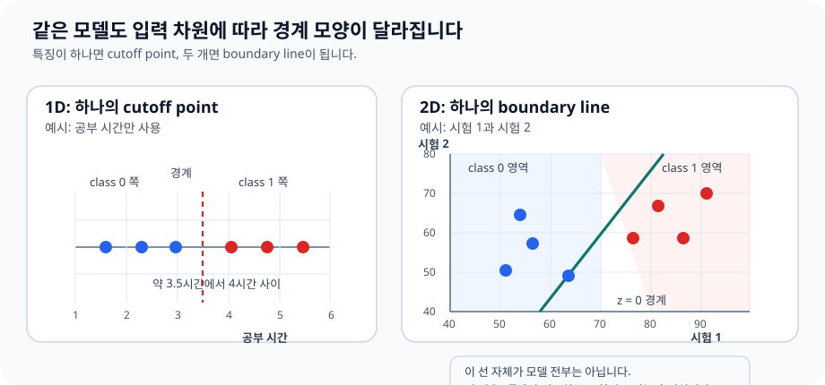
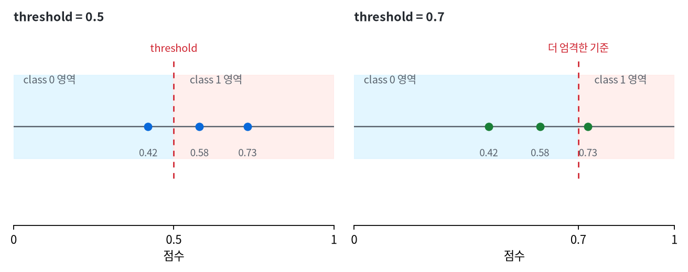

# P4-11.2 결정 경계(decision boundary)

> Section ID: `P4-11.2`
> Version: `v2026.07.17`

P4-11.1에서는 로지스틱 회귀(logistic regression)를 `확률처럼 읽히는 점수를 만드는 선형 모델`로 보았습니다. 이제 질문을 한 단계 바꿉니다.

그 점수는 왜 어떤 입력을 class 0으로, 다른 입력을 class 1로 나누는가?

이 질문에 답하려면 단지 `확률이 얼마인가`만 보는 것으로는 부족합니다. `어디까지는 class 0으로 읽고, 어디부터는 class 1로 읽는가`라는 기준이 함께 보여야 합니다. 그 기준을 입력 공간(input space)에서 읽는 관점이 결정 경계(decision boundary)입니다.

그래서 `입력 공간에서 어디에 선을 긋는가`라는 표현은 본질이 아니라 결과에 가깝습니다. 더 본질적인 질문은 다음입니다.

모델은 어떤 기준으로 입력들을 둘로 갈라 읽는가?

11.1이 출력(output)을 읽는 절이었다면, 11.2는 입력(input)을 바라보는 절입니다.

결정 경계는 모델이 class 0과 class 1을 나누는 기준선 또는 기준면이다.

이 절은 로지스틱 회귀의 기본 정의를 다시 길게 반복하지 않습니다. `확률처럼 읽히는 점수를 만드는 선형 분류기`라는 핵심 직관은 P4-11.1과 [개념사전](../../../reference/concept-glossary.md)을 기준으로 다시 연결하고, 여기서는 그 점수가 입력 공간을 어떻게 가르는지에 집중합니다.

결정 경계까지 읽고 나면 `왜 확률을 이런 형태로 바꿔 읽는가`, `왜 학습 설명에 log-odds와 MLE가 따라붙는가`, `이 감각이 여러 클래스와 설정 비교로는 어떻게 넓어지는가`가 다음 질문으로 남습니다. 그 회수는 P4-11.3, P4-11.4, P4-11.5 보충학습에서 이어집니다.

## 이 절의 범위

이 절은 다음 질문에 답합니다.

- 결정 경계(decision boundary)는 무엇인가?
- 1차원 입력에서는 경계가 어떻게 보이는가?
- 2차원 입력에서는 경계가 왜 선(line)처럼 보이는가?
- 로지스틱 회귀의 계수(coefficient)는 경계의 방향과 어떤 관련이 있는가?
- threshold가 바뀌면 경계는 어떻게 달라지는가?

이 절은 결정 경계를 `입력 공간을 나누는 기준`으로 먼저 닫고, 출력 점수에서 보이던 threshold가 입력 공간에서 어떤 경계로 읽히는지를 붙잡는 데 집중합니다.

대신 이번 절에서 바로 더 넓혀 볼 질문도 분명합니다. 초평면(hyperplane) 직관은 P4-1.2에서 다시 연결하고, kernel 방법과 비선형 경계는 P4-13.1, P4-13.2에서 다시 다룹니다. `C`, `gamma`, threshold 조정 같은 설정과 계산 비용은 P4-9.1, P4-9.2에서 다시 연결하며, 다중 클래스 확장은 P4-11.4에서 이어집니다.

## 이 절의 목표

- 결정 경계를 `출력 점수`가 아니라 `입력 공간을 나누는 기준`으로 설명할 수 있습니다.
- 1차원에서는 경계가 `한 점`, 2차원에서는 보통 `한 선`으로 보인다는 점을 이해할 수 있습니다.
- 로지스틱 회귀의 계수가 경계의 방향을 바꾸는 데 관여한다는 점을 설명할 수 있습니다.
- threshold를 바꾸면 경계 자체도 움직일 수 있다는 점을 설명할 수 있습니다.
- 11.1의 확률 출력과 11.2의 경계 관점이 같은 모델의 두 표현이라는 점을 연결할 수 있습니다.

## 학습 배경

### 왜 결정 경계를 따로 봐야 하는가

11.1에서는 `0.58`, `0.73` 같은 점수를 읽었습니다. 그런데 실무나 학습에서는 종종 이런 질문이 더 중요해집니다.

- 어떤 입력은 왜 class 0이 되었는가?
- 어떤 입력은 왜 class 1이 되었는가?
- 두 class 사이의 기준은 어디에 있는가?

이 질문에 답하려면 출력표만 봐서는 부족합니다. 출력표는 `결과`를 보여 주지만, `왜 그런 결과가 나왔는가`는 충분히 설명하지 못합니다.

결정 경계를 보는 이유는 바로 여기에 있습니다.

- 어떤 입력이 class 0이 된 이유를 설명하기 위해
- 어떤 입력이 class 1이 된 이유를 설명하기 위해
- 두 class를 가르는 기준이 어디에 있는지 말하기 위해
- 경계 근처의 애매한 사례를 따로 식별하기 위해

즉, 결정 경계는 단순한 시각화 장치가 아니라 `분류 이유를 읽기 위한 해석 도구`입니다.

입력 공간에서 `어디를 기준으로 둘로 나누었는가`를 봐야 할 때 등장하는 관점이 결정 경계입니다.

결정 경계도 다음 네 가지를 같이 놓고 봐야 합니다.

| 같이 볼 것 | 왜 필요한가 |
| --- | --- |
| baseline 분류 결과 | 선형 경계가 단순 기준보다 실제로 나아졌는지 알아야 해서 |
| threshold 위치 | 같은 점수라도 어디서 class가 갈리는지 기준을 알아야 해서 |
| confusion matrix의 문제 칸 | 경계가 어떤 종류의 오분류를 더 만들었는지 봐야 해서 |
| 경계 근처 대표 사례 | 애매한 입력이 왜 반대 class로 넘어갔는지 설명해야 해서 |

즉, 결정 경계는 선 하나를 그려 보는 절이 아니라, `무엇과 비교해 나아졌는가`, `어디서 class가 갈리는가`, `그 결과 어떤 오분류가 생겼는가`를 함께 읽는 절입니다.

여기에 한 가지를 더 붙이면 결정 경계 절이 운영 해석과 더 직접적으로 이어집니다. 경계 근처 사례는 단순히 `애매한 점`이 아니라, 다음 검토 대상으로 우선 남겨야 할 사례입니다. 즉, 결정 경계는 시각화 결과가 아니라 `어떤 입력을 사람이 다시 볼 것인가`를 정하는 비교 프레임으로도 읽을 수 있습니다. 이때 경계 근처라는 사실은 우선 변화 신호와 검토 우선순위를 보여 주는 것이지, 왜 그 사례가 넘어갔는지 원인을 자동으로 설명하는 문장은 아닙니다.

이 비교도 가능하면 같은 기준을 유지해야 합니다. 같은 baseline 분류 결과, 같은 점수 구간, 같은 대표 실패 사례를 두고 경계 전후를 봐야 `모델 점수의 변화`, `threshold 정책의 변화`, `특징 표현의 부족`을 서로 덜 섞고 읽을 수 있습니다.

| 경계를 볼 때 같이 남길 것 | 왜 필요한가 |
| --- | --- |
| 경계 근처 사례 ID | review 대상을 다시 찾기 위해서입니다. |
| baseline 대비 달라진 분류 | 단순 기준보다 실제로 어떤 사례가 새로 갈렸는지 보기 위해서입니다. |
| threshold 변경 시 이동한 사례 | 정책 변화가 어떤 입력을 반대편으로 넘겼는지 보기 위해서입니다. |
| 다음 검토 질문 | 특징을 더 추가할지, threshold를 조정할지 정하기 위해서입니다. |

이 기록이 있으면 `경계가 움직였다`, `경고가 늘었다`, `새로 갈린 사례가 생겼다`를 따로따로 보지 않고, 같은 비교 프레임 안에서 다시 읽을 수 있습니다.

## 주요 학습내용

### 결정 경계는 무엇인가

분류 모델은 보통 내부에서 점수(score)를 계산하고, 그 점수를 기준으로 class를 나눕니다. 결정 경계는 바로 `그 점수가 기준값과 같아지는 자리`입니다.

11.1이 `출력 점수 축에서 threshold를 읽는 절`이었다면, 여기서는 그 threshold를 `입력 공간에서 어떤 경계로 보게 되는가`만 따로 떼어 봅니다.

로지스틱 회귀를 입문 수준으로 단순화하면 다음처럼 생각할 수 있습니다.

\[
z = w_1x_1 + w_2x_2 + \cdots + w_nx_n + b
\]

이 선형 점수 \(z\)를 sigmoid에 넣으면 0과 1 사이 값이 나옵니다. 그리고 보통 threshold 0.5를 쓰면, sigmoid 출력이 0.5가 되는 자리가 class의 경계가 됩니다.

sigmoid 출력이 0.5라는 것은 선형 점수 \(z\)가 0이라는 뜻과 연결됩니다. 그래서 로지스틱 회귀의 결정 경계는 보통 `선형 점수 = 0이 되는 자리`로 이해할 수 있습니다.

`결정 경계는 확률이 애매해지는 자리이면서, 동시에 class가 갈리는 자리다.`

### 1차원에서는 경계가 한 점처럼 보인다

입력이 하나뿐이면 경계는 선이 아니라 `한 점`처럼 보입니다.

예를 들어 입력이 공부 시간(`study_hours`) 하나뿐이라면, 모델은 어떤 시간을 기준으로 불합격과 합격을 가를 수 있습니다.

| 공부 시간 | class 1 점수 | 예측 |
| ---: | ---: | --- |
| 3 | 0.17 | 불합격 |
| 4 | 0.31 | 불합격 |
| 5 | 0.55 | 합격 |
| 6 | 0.76 | 합격 |

이 경우 경계는 `4시간과 5시간 사이 어딘가`에 있다고 읽을 수 있습니다. 즉, 1차원 결정 경계는 `하나의 cutoff point`에 가깝습니다.

한 변수일 때의 cutoff point와 두 변수일 때의 boundary line을 같은 그림에서 비교하면 다음처럼 읽을 수 있습니다.



간단히 그리면 다음과 같습니다. 이번에는 `공부 시간 축 위에서 점수가 어떻게 커지고, 어디서 class가 바뀌는가`가 같이 보이도록 읽으면 됩니다.

```mermaid
--8<-- "assets/part-04/chapter-11/p4-11-2-mermaid-01-ko.mmd"
```

이 도식에서 핵심은 입력값이 커질수록 점수가 올라가고, `score 0.50` 경계점에서 `class 0 쪽`과 `class 1 쪽`이 갈린다는 점입니다. 즉, 1차원에서는 복잡한 면이나 영역이 아니라 `축 위의 한 점`만 찾으면 경계를 읽을 수 있습니다.

이 관점은 threshold를 점검할 때 매우 중요합니다. 11.1에서는 점수표로 보였던 것이, 11.2에서는 `입력축 위의 경계점`으로 다시 보이기 시작합니다.

### 2차원에서는 경계가 선처럼 보인다

입력이 두 개가 되면, 예를 들어 `exam_1`, `exam_2` 두 점수로 합격 여부를 분류한다고 해 보겠습니다. 이제 입력 공간은 표가 아니라 평면(plane)처럼 생각할 수 있습니다.

- 한 축은 `exam_1`
- 다른 축은 `exam_2`
- 각 학생은 이 평면 위의 한 점(point)

이때 로지스틱 회귀는 그 점들을 둘로 나누는 기준선을 찾으려 합니다. 그래서 2차원에서는 결정 경계가 보통 `직선(line)`처럼 보입니다.

```mermaid
--8<-- "assets/part-04/chapter-11/p4-11-2-mermaid-02-ko.mmd"
```

이 도식은 로지스틱 회귀의 결정 경계를 `입력 공간 안에서 점수 z를 0과 비교하는 규칙이 남긴 흔적`으로 보여 줍니다. 여기서 선을 그리는 것이 아니라, 선형 점수가 어느 쪽 부호를 가지는지에 따라 class가 갈린다는 점을 읽으면 됩니다.

`입력이 하나 늘어나면 경계도 한 점에서 한 선으로 바뀐다.`

여기서 중요한 것은 `선이 먼저 있고 class가 나뉘는 것`이 아니라, `점수 z를 0과 비교하는 규칙` 때문에 결과적으로 평면 위에 경계선이 생긴다는 점입니다.

즉, 2차원에서 다음 세 질문에 답하는 가장 직접적인 방법은 같습니다.

- 어떤 입력은 왜 class 0이 되었는가? `그 입력의 z가 0보다 작기 때문`
- 어떤 입력은 왜 class 1이 되었는가? `그 입력의 z가 0보다 크기 때문`
- 두 class 사이의 기준은 어디에 있는가? `z = 0이 되는 모든 점의 집합`

그래서 결정 경계는 단순한 그림이 아니라, `분류 규칙이 평면에 남긴 흔적`으로 읽어야 합니다.

### 계수(coefficient)는 경계의 방향과 어떤 관련이 있는가

로지스틱 회귀의 계수는 단지 점수를 계산하는 데만 쓰이지 않습니다. 입력 공간에서 보면, 이 값들은 경계가 어느 방향으로 놓일지에도 영향을 줍니다.

예를 들어 두 특징이 있을 때

\[
z = w_1x_1 + w_2x_2 + b
\]

라고 쓰면, \(w_1\)과 \(w_2\)의 상대적 크기와 부호에 따라 경계선의 기울기와 방향이 달라집니다.

수식 유도보다 다음 감각이 더 중요합니다.

- 어떤 특징의 계수가 커지면 그 축의 영향력이 더 커질 수 있습니다.
- 두 계수의 조합이 바뀌면 class를 나누는 경계의 기울기도 달라집니다.
- 절편(intercept)은 경계를 평행 이동시키는 역할을 합니다.

즉, 11.1에서 계수는 `점수를 만드는 숫자`였고, 11.2에서는 `경계를 정하는 숫자`로도 읽힙니다.

### threshold가 바뀌면 경계도 움직일 수 있다

11.1에서는 threshold가 바뀌면 같은 점수도 다른 행동으로 넘어간다고 보았습니다. 11.2에서는 그 말을 입력 공간 관점으로 다시 읽어야 합니다.

threshold가 0.5일 때의 경계와 0.7일 때의 경계는 같은 자리에 있지 않을 수 있습니다. 이유는 단순합니다.

- threshold 0.5: 점수가 이 기준을 넘는 자리부터 class 1
- threshold 0.7: 더 높은 점수를 요구하는 자리부터 class 1

즉, threshold를 올리면 class 1로 분류되는 영역이 줄어들고, 경계는 더 보수적인 방향으로 이동할 수 있습니다.

`모델의 계수는 경계의 방향을 만들고, threshold는 그 경계를 어디에 둘지 다시 조정할 수 있다.`

같은 점수 배열을 두고 threshold만 바꿨을 때, 점수 축의 cutoff 변화가 입력 공간에서는 class 1 영역 축소로 읽힌다는 점을 좌표형 비교로 보면 다음과 같습니다.



이 움직임을 개념적으로 그리면 다음과 같습니다.

```mermaid
--8<-- "assets/part-04/chapter-11/p4-11-2-mermaid-03-ko.mmd"
```

이 도식에서 핵심은 `모델 자체를 새로 학습하지 않아도`, threshold를 더 엄격하게 잡으면 같은 점수 축 위에서 경계가 더 오른쪽으로 밀리고 class 1 영역을 더 좁게 읽게 된다는 점입니다. 따라서 경계 이동은 `어떤 사례가 반대편으로 넘어갔는가`를 다시 읽게 만드는 정책 변화로 보아야 하고, 그 이동만으로 특징의 원인 설명까지 끝난 것으로 읽으면 안 됩니다.

결정 경계 기록에는 다음 세 문장을 같이 남깁니다.

- 경계 근처 사례는 자동 확정보다 검토 우선순위를 올리는 신호입니다.
- threshold를 바꾸면 같은 입력도 다른 행동으로 넘어갈 수 있습니다.
- 경계 이동은 관찰되지만, 그 자체가 원인 설명을 완성해 주는 것은 아닙니다.

### 언제 결정 경계 관점이 특히 중요한가

결정 경계는 단순한 시각화 장면이 아니라, `왜 이 입력이 반대 class로 넘어갔는가`를 읽어야 할 때 특히 중요해집니다.

| 현재 보고 싶은 것 | 결정 경계 관점이 필요한 이유 | 같이 확인할 것 |
| --- | --- | --- |
| 경계 근처 애매한 사례 | 점수만으로는 왜 갈렸는지 설명이 약하기 때문 | threshold와 review 대상 구간 |
| 특정 유형의 오분류가 반복된다 | 경계가 어느 쪽으로 기울어져 있는지 봐야 하기 때문 | confusion matrix의 문제 칸 |
| threshold를 바꿀지 고민 중이다 | 정책 변화가 어떤 입력을 넘기는지 공간 관점으로 읽어야 하기 때문 | threshold 전후 사례 변화 |
| 특징 추가가 필요한지 의심된다 | 현재 경계가 너무 단순한지 확인해야 하기 때문 | baseline 대비 새로 갈린 사례 |
| 사람 검토 대상을 뽑아야 한다 | 경계 근처 사례가 검토 우선순위를 주기 때문 | 사례 ID와 점수 구간 기록 |

이 표의 목적은 경계를 예쁜 그림으로 보는 데 있지 않고, `분류 규칙이 실제로 어디서 갈리고 무엇을 놓치는가`를 추적하게 하는 데 있습니다.

## 세부 학습내용

### 학술적 배경과 역사

결정 경계라는 말은 처음 보면 시각화용 표현처럼 보일 수 있습니다. 하지만 핵심은 그림이 아니라 `분류 판단이 어디서 뒤집히는가`를 읽는 관점입니다.

초기의 회귀 전통이 `값을 얼마나 잘 설명하는가`에 가까웠다면, 분류에서는 질문이 `어느 class로 갈리는가`로 바뀝니다. 이때 모델은 단순히 점수를 내는 함수가 아니라, 입력 공간을 둘로 나누는 장치로도 읽히기 시작합니다.

Fisher의 판별 전통, Bayes 분류기, LDA/QDA 같은 설명도 결국 `어디서 class가 바뀌는가`를 다루는 언어로 이어집니다. 그래서 결정 경계는 `공간에 선을 긋는 기술`보다 `분류 판단이 뒤집히는 기준을 표현하는 방법`으로 이해하는 편이 더 정확합니다.

로지스틱 회귀를 이 관점에서 보면 다음과 같이 정리할 수 있습니다.

- 11.1의 관점: 로지스틱 회귀는 확률처럼 읽히는 점수를 만든다.
- 11.2의 관점: 로지스틱 회귀는 입력 공간에 경계를 그어 class를 나눈다.

이 두 관점은 서로 다른 모델이 아니라, 같은 모델을 두 방향에서 읽는 방법입니다.

현대 머신러닝에서 결정 경계 관점이 중요한 이유는 더 분명합니다. 뒤에서 보게 될 SVM(support vector machine), 결정트리(decision tree), 신경망(neural network)도 결국 `입력을 어떻게 나눌 것인가`라는 질문으로 다시 읽을 수 있기 때문입니다.

따라서 결정 경계의 역사적 의미를 입문 수준에서 정리하면 다음과 같습니다.

`분류는 점수 계산 문제이기도 하지만, 동시에 입력 공간을 어떻게 나눌 것인가의 문제이기도 하다.`

이 문장이 잡히면 로지스틱 회귀 다음에 왜 다른 분류 알고리즘이 이어지는지도 더 분명하게 이해할 수 있습니다.

## 사례 및 예시

사례를 읽기 전에 이번 절의 공통 비교 프레임을 먼저 잡으면 다음과 같습니다.

| 장면 | 사람이 먼저 쓰기 쉬운 기준 | 그 기준의 한계 | 결정 경계 관점이 바꾸는 점 | 확인할 결과 |
| --- | --- | --- | --- | --- |
| 합격 예측 | 점수 하나에 합격선 하나를 둔다 | 여러 특징이 함께 작동할 때 설명이 약하다 | 조합형 기준선으로 본다 | 한 점이 아니라 선이나 면으로 읽게 된다 |
| 고객 이탈 | 변수 하나만 보고 위험을 판단한다 | 조합 패턴을 놓친다 | 여러 특징의 조합이 위험 영역을 만드는지 본다 | 어떤 조합이 경계 너머인지 설명할 수 있다 |
| 의료 위험 | 수치 하나로 위험 여부를 본다 | 애매한 조합 사례를 놓친다 | 경계 근처 사례를 따로 본다 | review 우선순위 대상을 식별할 수 있다 |
| 대출 / 스팸 | 단일 규칙으로 승인과 차단을 설명한다 | 복합 특징과 선형 경계의 한계를 놓친다 | 경계가 어떤 조합을 나누는지 본다 | 선형 경계의 장점과 한계를 함께 읽는다 |

```mermaid
--8<-- "assets/part-04/chapter-11/p4-11-2-mermaid-04-ko.mmd"
```

### 사례 1. 합격 예측

점수 하나만 보면 cutoff point 하나가 경계가 됩니다. 하지만 과목이 두 개가 되면, `수학 점수는 높지만 영어 점수는 낮은 경우`처럼 상쇄 관계가 생길 수 있습니다. 이때는 `어느 한 점수만의 기준`보다 `두 점수를 함께 보는 경계선`이 더 잘 맞습니다.

작은 표로 놓고 보면 다음처럼 읽을 수 있습니다.

| 학생 | 수학 점수 | 영어 점수 | 경계 해석 |
| --- | ---: | ---: | --- |
| A | 92 | 38 | 한 과목은 높지만 다른 과목이 낮아 경계 근처에 머물 수 있습니다. |
| B | 71 | 68 | 두 점수가 함께 중간 이상이라 합격 쪽으로 넘어가기 쉽습니다. |
| C | 45 | 44 | 두 점수 모두 낮아 불합격 쪽에 머물 가능성이 큽니다. |

이 표의 핵심은 `수학 한 과목만 90점 넘었는가` 같은 단일 기준으로는 A와 B의 차이를 충분히 설명하기 어렵다는 점입니다. 결정 경계 관점은 `두 점수의 조합이 어느 쪽 영역에 놓이는가`를 보게 만듭니다.

이 사례가 중요한 이유는, 독자가 분류를 자꾸 `점수 하나의 합격선`처럼만 이해하기 쉽기 때문입니다. 결정 경계 관점은 `여러 특징이 함께 작동하면 기준도 조합으로 바뀐다`는 점을 보여 줍니다.

### 사례 2. 고객 이탈 예측

입력이 `최근 접속일`, `결제 빈도`, `고객센터 문의 횟수`처럼 여러 개가 되면, 특정 변수 하나만으로는 이탈을 설명하기 어렵습니다. 결정 경계 관점은 `여러 특징이 함께 있을 때 어느 조합이 위험 영역으로 들어가는가`를 보게 해 줍니다.

예를 들어 다음 세 고객을 비교해 봅시다.

| 고객 | 최근 30일 접속일수 | 최근 30일 결제 횟수 | 문의 횟수 | 경계 해석 |
| --- | ---: | ---: | ---: | --- |
| A | 22 | 3 | 0 | 유지 영역에 머물 가능성이 큽니다. |
| B | 11 | 1 | 2 | 경계 근처에서 review 대상으로 읽기 쉽습니다. |
| C | 4 | 0 | 4 | 위험 영역 쪽으로 넘어갔다고 읽기 쉽습니다. |

여기서 B가 중요합니다. 접속일수만 보면 아직 아주 낮지는 않지만, 결제 빈도 감소와 문의 증가가 같이 나타나면 경계 근처 사례가 될 수 있습니다.

예를 들어 접속이 조금 줄었더라도 결제 빈도가 안정적이면 아직 유지 고객으로 볼 수 있고, 접속 감소와 결제 중단이 동시에 나타나면 위험 영역으로 넘어갈 수 있습니다. 즉, 경계는 `값 하나`보다 `조합의 패턴`을 읽게 합니다.

### 사례 3. 의료 위험 분류

검사 수치 하나만으로는 애매하지만, `혈압`, `혈당`, `연령`을 함께 보면 위험 영역이 더 분명해질 수 있습니다. 이때 결정 경계는 `어떤 조합이 위험 class로 넘어가는가`를 시각적으로 상상하는 데 도움을 줍니다.

간단히 놓으면 다음과 같습니다.

| 환자 | 혈압 | 혈당 | 연령 | 경계 해석 |
| --- | ---: | ---: | ---: | --- |
| P1 | 정상 | 정상 | 34 | 위험 영역과 거리가 있습니다. |
| P2 | 약간 높음 | 경계값 근처 | 58 | 경계 근처 사례로 추가 검토가 필요할 수 있습니다. |
| P3 | 높음 | 높음 | 67 | 위험 영역 쪽으로 넘어갔다고 읽기 쉽습니다. |

이 장면에서는 P2가 핵심입니다. 수치 하나만 보면 애매하지만, 여러 값이 동시에 경계 근처에 있으면 실제 의사결정에서는 더 조심해서 봐야 합니다.

이 사례에서는 특히 `경계 근처 환자`가 중요합니다. 점수가 아주 높은 환자보다, 여러 수치가 애매하게 겹쳐 경계 부근에 있는 환자가 실제 의사결정에서는 더 어렵기 때문입니다. 그래서 결정 경계는 단순 분류를 넘어서 `어떤 사례가 애매한가`를 읽는 데도 도움을 줍니다.

### 사례 4. 대출 심사

대출 심사에서는 `소득`, `부채 비율`, `연체 기록`, `재직 기간` 같은 특징이 함께 작동합니다. 이때 결정 경계 관점은 `어떤 신청자가 승인 영역에 있고, 어떤 신청자가 거절 영역에 있는가`를 설명하는 데 유용합니다.

작은 예시를 보면 다음과 같습니다.

| 신청자 | 소득 | 부채 비율 | 연체 기록 | 경계 해석 |
| --- | --- | --- | --- | --- |
| D1 | 높음 | 낮음 | 없음 | 승인 영역 쪽으로 읽기 쉽습니다. |
| D2 | 중간 | 높음 | 없음 | 경계 근처에서 추가 서류 검토가 필요할 수 있습니다. |
| D3 | 낮음 | 높음 | 있음 | 거절 영역 쪽으로 넘어갔다고 읽기 쉽습니다. |

여기서 D2는 단일 규칙으로 설명하기 어렵습니다. 소득만 보면 아주 나쁘지 않지만, 부채 비율이 높으면 경계가 달라질 수 있습니다.

중요한 점은, 단 하나의 기준으로 설명하기 어려운 신청자들이 존재한다는 것입니다. 소득은 높지만 부채 비율도 높을 수 있고, 재직 기간은 짧지만 연체 기록은 없을 수 있습니다. 이런 조합형 판단은 결정 경계 관점이 아니면 설명하기 어렵습니다.

### 사례 5. 스팸과 정상 메일의 분리

이메일 분류에서는 `특정 단어의 빈도`, `발신자 패턴`, `링크 수`, `제목 표현` 등이 함께 작동할 수 있습니다. 이때 경계는 `어떤 메일이 정상 메일 영역을 벗어나 스팸 영역으로 넘어가는가`를 생각하게 합니다.

작게 쓰면 다음처럼 읽을 수 있습니다.

| 메일 | 링크 수 | 발신자 이상 여부 | 제목 표현 | 경계 해석 |
| --- | ---: | --- | --- | --- |
| M1 | 0 | 없음 | 일반 업무 제목 | 정상 영역에 가깝습니다. |
| M2 | 2 | 없음 | 과장 표현 있음 | 경계 근처 사례로 사람 검토가 필요할 수 있습니다. |
| M3 | 5 | 있음 | 과장 표현 반복 | 스팸 영역으로 넘어갔다고 읽기 쉽습니다. |

이 표에서 M2가 중요한 이유는 `링크가 많다` 하나만으로는 결론을 닫기 어렵기 때문입니다. 다른 특징과 함께 놓였을 때만 경계 근처 사례인지 더 분명해집니다.

이 사례는 선형 경계의 장점과 한계를 같이 보여 줍니다. 단순한 분리는 빠르고 설명하기 쉽지만, 실제 스팸은 매우 다양한 형태로 섞여 있기 때문에 직선 하나로 충분하지 않을 수 있습니다.

## 연습 및 예제

### Python 예제로 2차원 결정 경계 읽기

이번 예제는 두 시험 점수(`exam_1`, `exam_2`)로 합격 여부(`passed`)를 분류하는 아주 작은 이진 분류 실습입니다.

- 문제 상황: 두 점수가 함께 높을수록 합격 가능성이 높다고 가정합니다.
- 입력(input): 두 과목 점수
- 정답(label): 합격(1) / 불합격(0)
- 확인할 개념:
  - 로지스틱 회귀는 두 특징을 함께 써서 점수를 계산합니다.
  - 계수 두 개와 절편 하나가 결정 경계의 위치와 방향에 관여합니다.
  - 같은 입력 공간에서도 경계 양쪽의 class가 나뉩니다.

입력은 다음처럼 읽으면 됩니다.

| 입력 묶음 | 뜻 |
| --- | --- |
| `X` | 두 과목 점수로 이뤄진 2차원 입력 |
| `y` | 합격 / 불합격 정답 |
| `samples` | 경계 아래, 경계 근처, 경계 위를 확인하기 위한 샘플 |

```python
import numpy as np
from sklearn.linear_model import LogisticRegression

X = np.array([
    [35, 40],
    [40, 45],
    [45, 35],
    [55, 60],
    [60, 55],
    [65, 70],
    [50, 52],
    [48, 46],
])
y = np.array([0, 0, 0, 1, 1, 1, 1, 0])

model = LogisticRegression()
model.fit(X, y)

samples = np.array([
    [42, 42],
    [50, 50],
    [62, 60],
])

print("coef            :", np.round(model.coef_[0], 3))
print("intercept       :", round(model.intercept_[0], 3))
print("decision score  :", np.round(model.decision_function(samples), 3))
print("predict_proba   :", np.round(model.predict_proba(samples), 3))
print("prediction      :", model.predict(samples))
```

실행 결과 예시는 다음과 같습니다.

```text
coef            : [0.518 0.471]
intercept       : -48.263
decision score  : [-4.102  0.187  12.979]
predict_proba   : [[0.984 0.016]
                   [0.453 0.547]
                   [0.    1.   ]]
prediction      : [0 1 1]
```

이 출력은 다음처럼 읽으면 됩니다.

- 두 계수 모두 양수이므로, 두 점수가 함께 높아질수록 class 1 쪽으로 점수가 이동합니다.
- `[42, 42]`는 경계의 class 0 쪽에 있습니다.
- `[50, 50]`은 경계 근처에 있어 확률처럼 읽히는 값도 0.5 근처로 나옵니다.
- `[62, 60]`은 class 1 쪽으로 충분히 멀리 들어간 점입니다.

특히 `decision score`가 0 근처라는 것은 경계 근처에 있다는 뜻으로 읽을 수 있습니다. 이 점은 11.1에서 본 `predict_proba가 0.5 근처일 때 애매하다`는 설명과 정확히 연결됩니다.

같은 내용을 표로 다시 읽으면 더 분명합니다.

| 샘플 | 입력 | decision score \(z\) | 경계 \(z = 0\)와의 관계 | 예측 |
| --- | --- | ---: | --- | --- |
| A | `[42, 42]` | -4.102 | 경계보다 낮음 | class 0 |
| B | `[50, 50]` | 0.187 | 경계 바로 위 | class 1 |
| C | `[62, 60]` | 12.979 | 경계보다 충분히 높음 | class 1 |

실제 운영에서는 이런 읽기가 그대로 이어집니다.

- 경계에서 멀리 떨어진 샘플은 자동 처리 후보가 되기 쉽습니다.
- 경계에 매우 가까운 샘플은 검토(review) 대상으로 분리하기 쉽습니다.
- 따라서 결정 경계는 단순한 시각화가 아니라, `애매한 사례를 찾는 운영 기준`으로도 연결됩니다.

직접 값을 바꿔 보면 더 잘 보이는 지점도 있습니다.

- `samples`를 `[48, 49]`, `[50, 50]`, `[52, 51]`처럼 더 촘촘히 바꾸면 경계 근처 점수 이동을 더 자세히 볼 수 있습니다.
- `X`의 한두 점을 움직이면 계수와 절편이 달라지면서 경계 해석도 함께 달라집니다.
- 같은 모델이라도 threshold를 다르게 두면, 경계 근처 샘플의 최종 행동이 바뀐다는 점은 다음 예제와 연결됩니다.

### threshold 변화도 작은 코드로 확인하기

이번에는 이미 계산된 class 1 점수를 가지고, threshold가 바뀌면 경계 해석도 어떻게 달라지는지 확인해 보겠습니다.

문제 상황:

- 같은 확률 점수라도 threshold를 어디에 두느냐에 따라 최종 class 판단이 달라진다

입력(input):

- 세 샘플의 class 1 점수 `proba_class_1`

기대 출력(output):

- threshold 0.5에서의 분류 결과
- threshold 0.7에서의 분류 결과

확인할 개념:

- threshold 변화는 class 영역의 크기를 바꾼다
- 경계는 단지 수학식이 아니라 운영 규칙과도 연결된다

```python
import numpy as np

proba_class_1 = np.array([0.48, 0.62, 0.81])

pred_05 = (proba_class_1 >= 0.5).astype(int)
pred_07 = (proba_class_1 >= 0.7).astype(int)

print("class 1 scores  :", proba_class_1)
print("threshold 0.5   :", pred_05)
print("threshold 0.7   :", pred_07)
```

실행 결과 예시는 다음과 같습니다.

```text
class 1 scores  : [0.48 0.62 0.81]
threshold 0.5   : [0 1 1]
threshold 0.7   : [0 0 1]
```

이 결과는 0.62 같은 점이 `모델 기준으로는 꽤 긍정적`일 수 있어도, 더 엄격한 threshold에서는 아직 class 1 영역으로 받아들여지지 않을 수 있음을 보여 줍니다.

### 값 하나 더 바꿔 보기: threshold를 더 올리면 무엇이 유지되고 무엇이 달라지는가

이번에는 같은 점수 배열을 유지한 채 threshold를 `0.9`까지 올려 봅니다.

```python
import numpy as np

proba_class_1 = np.array([0.48, 0.62, 0.81])

pred_07 = (proba_class_1 >= 0.7).astype(int)
pred_09 = (proba_class_1 >= 0.9).astype(int)

print("class 1 scores  :", proba_class_1)
print("threshold 0.7   :", pred_07)
print("threshold 0.9   :", pred_09)
```

실행 결과 예시는 다음과 같습니다.

```text
class 1 scores  : [0.48 0.62 0.81]
threshold 0.7   : [0 0 1]
threshold 0.9   : [0 0 0]
```

### 무엇이 유지되고 무엇이 바뀌었는가

- 유지된 점: 점수의 상대적 순서는 그대로입니다. `0.81`이 여전히 가장 class 1에 가깝고 `0.48`이 가장 멉니다.
- 바뀐 점: threshold를 더 올리자 기존에 자동 처리 후보였던 `0.81`도 이제 class 1로 확정되지 못합니다.
- 먼저 남길 판단: 점수 자체와 최종 행동은 같은 단계가 아닙니다. 경계 근처 사례만이 아니라, 원래는 확실해 보이던 사례도 운영 기준이 바뀌면 다시 검토 대상으로 돌아올 수 있습니다.

이 비교를 통해 분류 모델은 `확률 계산기`가 아니라 `운영 경계 조정 장치`로 읽힙니다. 중요한 것은 점수 하나를 더 높게 만드는 일이 아니라, threshold를 바꿨을 때 어떤 사례가 자동 처리에서 review로 이동하고 어떤 오류 비용이 함께 바뀌는지 읽는 일입니다. 같은 점수 배열을 두고 경계만 바꾸어 보는 반복 실습은 `모델 출력`과 `적용 판단`을 분리해 보는 훈련이 됩니다.

| 공통 기록 언어 | 이번 연습에서 바로 남길 내용 |
| --- | --- |
| 보인 구조 | 같은 점수라도 threshold를 올리자 class 1 영역이 줄고 자동 확정 사례가 review 후보로 돌아왔다 |
| 해석 경계 | 더 보수적인 threshold가 항상 더 좋은 서비스 정책을 뜻하지는 않으며, FN 증가 비용을 같이 봐야 한다 |
| 다음 질문 | 지금 줄인 FP가 실제로 더 중요한지, 늘어난 FN과 검토량이 더 큰 비용인지부터 다시 비교할 것인가 |

## 세부 학습내용 보충

### 주요 논의점은 어디에서 생기는가

결정 경계는 그림으로 보면 단순해 보여도, 독자가 자주 오해하는 지점이 있습니다.

### 1. 경계선은 벽인가

결정 경계는 현실 세계의 벽이 아니라 `모델이 편의상 그은 분리 기준`입니다. 경계 근처의 샘플은 작은 변화에도 반대편 class로 넘어갈 수 있습니다.

### 2. 경계에서 멀수록 더 확실한가

로지스틱 회귀에서는 보통 경계에서 멀수록 점수는 더 강하게 한쪽 class로 기울어집니다. 하지만 그 점수가 곧 현실의 확실성을 완벽히 보장하는 것은 아닙니다. 데이터 품질과 분포가 여전히 중요합니다.

### 3. 선형 경계면 항상 충분한가

아닙니다. 데이터가 곡선형으로 섞여 있거나, class를 나누는 구조가 매우 복잡하면 직선 하나로는 충분하지 않을 수 있습니다. 이 한계 때문에 뒤에서 더 복잡한 모델들이 등장합니다.

### 4. 경계는 데이터가 바뀌어도 고정되는가

아닙니다. 학습 데이터가 달라지면 계수와 절편이 달라질 수 있고, 그에 따라 경계의 위치와 방향도 달라질 수 있습니다. 즉, 결정 경계는 자연에 원래 존재하던 선을 `발견`하는 것이라기보다, 현재 데이터와 모델이 만든 `학습 결과`에 가깝습니다.

이 논의점은 데이터 분할(train/test split), 표본 편향(sample bias), 데이터셋 갱신이 왜 중요한지와도 연결됩니다.

### 5. 경계 근처 샘플은 왜 중요하게 다뤄야 하는가

경계에서 멀리 떨어진 샘플은 보통 모델이 안정적으로 분류합니다. 반대로 경계 근처 샘플은 작은 변화에도 class가 바뀔 수 있습니다.

이 때문에 실무에서는 종종 다음과 같은 정책이 붙습니다.

- 경계에서 멀면 자동 처리
- 경계 근처면 사람 검토(review)
- 경계 근처 사례를 따로 모아 품질 점검

즉, 결정 경계는 단순히 class를 나누는 도구가 아니라, `어떤 사례가 애매하고 운영 위험이 큰가`를 찾는 데도 쓰일 수 있습니다.

### 6. 좋은 경계와 좋은 서비스는 항상 같은가

모델 관점에서 분류가 깔끔해 보여도, 서비스 관점에서는 그 경계가 적절하지 않을 수 있습니다. 예를 들어 잘못 분류했을 때의 비용이 class마다 다르면, 수학적으로 보기 좋은 경계보다 운영적으로 더 안전한 경계가 필요할 수 있습니다.

이 논의점은 11.1의 threshold, Part 4 앞부분의 평가 지표(metric), 뒤의 모델 선택(model selection)과 연결됩니다.

이 절은 선을 그리는 법을 배우는 절이 아니라, 경계를 평가 흐름 안에서 읽는 절입니다.

| 같이 봐야 할 것 | 이 절에서 먼저 읽는 질문 | 뒤에서 다시 이어질 곳 |
| --- | --- | --- |
| threshold 위치 | 어디서 class가 갈리고, 경계가 얼마나 보수적인가 | P4-6 분류 지표, P4-15.3 threshold 조정 |
| confusion matrix의 문제 칸 | 이 경계가 FP와 FN 중 어떤 실수를 더 만들고 있는가 | P4-6 평가 지표 |
| 경계 근처 대표 사례와 baseline 비교 | 애매한 입력이 왜 반대 class로 넘어가고, 단순 기준보다 실제로 나은가 | P4-8 baseline, 뒤 분류 알고리즘 비교 |

## 체크리스트

- 출력 점수만이 아니라 입력 공간에서 어디가 갈리는지 함께 보고 있는가?
- 결정 경계를 class를 나누는 기준선 또는 기준면으로 설명할 수 있는가?
- 1차원에서는 경계가 한 점처럼, 2차원에서는 보통 한 선처럼 보인다는 점을 이해했는가?
- 결정 경계를 모델이 계산한 결과를 입력 공간에서 읽는 방식으로 설명할 수 있는가?
- 로지스틱 회귀의 계수와 절편이 경계의 방향과 위치에 관여한다는 점을 알고 있는가?
- threshold 변경으로 넘어간 사례와 특징 표현 부족 때문에 틀린 사례를 구분하고 있는가?
- threshold를 바꾸면 class 영역과 경계 해석도 달라질 수 있다는 점을 이해했는가?
- 경계 근처 사례를 자동 확정이 아니라 검토 우선순위 신호로 남기고 있는가?
- 선형 모델이 답답하게 느껴질 때, 직선 경계 자체의 한계인지 표현 부족인지 구분해 설명할 수 있는가?

## 출처와 참고 자료

- Ronald A. Fisher, `The Use of Multiple Measurements in Taxonomic Problems`, *Annals of Eugenics*, 1936, DOI: [https://doi.org/10.1111/j.1469-1809.1936.tb02137.x](https://doi.org/10.1111/j.1469-1809.1936.tb02137.x){: target="_blank" rel="noopener noreferrer" }, 확인 날짜: 2026-06-29.
- Benyamin Ghojogh, Mark Crowley, `Linear and Quadratic Discriminant Analysis: Tutorial`, arXiv, 2019, [https://arxiv.org/abs/1906.02590](https://arxiv.org/abs/1906.02590){: target="_blank" rel="noopener noreferrer" }, 확인 날짜: 2026-06-29.
- scikit-learn, `1.1.11. Logistic regression`, scikit-learn User Guide, 확인 날짜: 2026-06-26. [https://scikit-learn.org/stable/modules/linear_model.html#logistic-regression](https://scikit-learn.org/stable/modules/linear_model.html#logistic-regression){: target="_blank" rel="noopener noreferrer" }
- scikit-learn, `LogisticRegression`, scikit-learn API Reference, 확인 날짜: 2026-06-26. [https://scikit-learn.org/stable/modules/generated/sklearn.linear_model.LogisticRegression.html](https://scikit-learn.org/stable/modules/generated/sklearn.linear_model.LogisticRegression.html){: target="_blank" rel="noopener noreferrer" }
