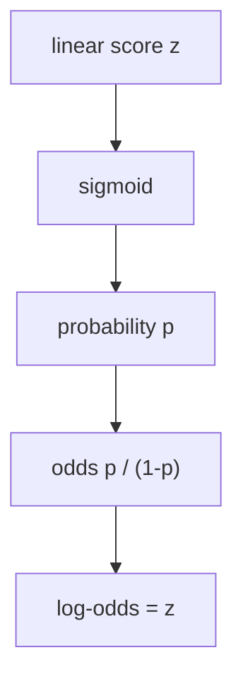
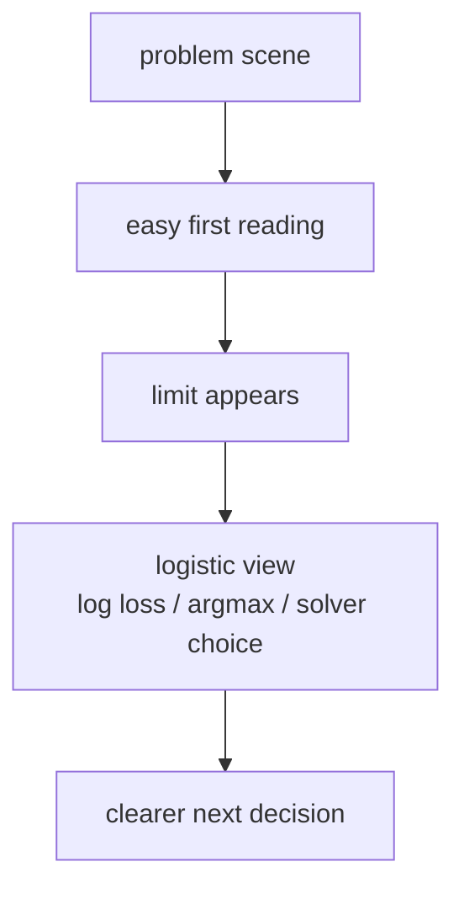

# P4-11.3 보충학습: 로지스틱 회귀를 한 단계 더 이해하는 법

> Section ID: `P4-11.3`
> Version: `v2026.07.09`

P4-11.1에서는 로지스틱 회귀(logistic regression)를 `확률처럼 읽히는 점수를 만드는 선형 분류 모델`로 보았고, P4-11.2에서는 그 점수가 입력 공간을 어떻게 가르는지 결정 경계(decision boundary) 관점으로 읽었습니다. 여기까지 오면 자연스럽게 다음 질문이 남습니다.

왜 확률을 그대로 선형식으로 다루지 않고, 왜 log-odds와 최대우도추정(maximum likelihood estimation, MLE) 같은 말이 따라붙는가?

이 절은 그 질문을 회수하는 보충학습입니다. 목적은 증명을 끝까지 밀어붙이는 데 있지 않습니다. `왜 이런 개념 이름이 등장하는가`, `어디까지 이해하면 다음 학습으로 넘어갈 수 있는가`, `어떤 구현 설정이 어떤 이론 배경과 연결되는가`를 초심자 기준으로 다시 묶어 주는 데 있습니다.

## 이 절의 범위

이 절은 다음 질문에 답합니다.

- log-odds는 왜 등장하는가?
- 로지스틱 회귀는 왜 최대우도추정(MLE)으로 학습한다고 말하는가?
- 이진 분류(binary classification)와 다중 클래스(multinomial classification)는 어떤 점이 같고 다른가?
- solver와 regularization은 왜 구현 설정처럼 보이지만 이론 배경과 연결되는가?

이 절은 다음 내용은 깊게 다루지 않습니다.

- log-odds의 엄밀한 전체 유도
- 음의 로그우도(negative log-likelihood)의 미분 전개와 convex optimization 일반론
- 다중 클래스(multinomial) 로지스틱 회귀의 세부 행렬 수식
- 각 solver의 내부 최적화 알고리즘 비교

보다 깊은 최적화 이론과 규제항(regularization term)의 수학적 전개, 고급 모델 선택은 P4-9.1, P4-9.2, P5-8.1에서 다시 연결합니다. 이 절은 `왜 이 이름들이 Chapter 11에 등장해야 하는가`를 닫는 데 집중합니다.

## 이 절의 목표

- 확률, odds, log-odds의 관계를 입문 수준에서 설명할 수 있습니다.
- 로지스틱 회귀가 제곱 오차 대신 우도(likelihood)를 중심으로 읽힌다는 점을 설명할 수 있습니다.
- 이진 분류에서 다중 클래스 확장으로 넘어갈 때 무엇이 유지되고 무엇이 늘어나는지 설명할 수 있습니다.
- solver와 regularization을 `라이브러리 옵션`이 아니라 `학습을 실제로 계산하고 조절하는 손잡이`로 읽을 수 있습니다.

## 학습 배경

로지스틱 회귀는 입문 절에서 보통 `sigmoid를 붙여서 0과 1 사이 값으로 읽는다`는 설명으로 시작합니다. 이 설명은 첫 이해에는 충분하지만, 조금만 더 가면 곧바로 다음 용어들을 만나게 됩니다.

- logit 또는 log-odds
- likelihood 또는 log-likelihood
- multinomial
- solver
- regularization

초심자가 여기서 막히는 이유는 용어가 갑자기 수학 교재처럼 바뀌기 때문입니다. 하지만 이 용어들은 서로 따로 놀지 않습니다.

1. 확률을 바로 선형식으로 다루기 어려우니 log-odds라는 변환이 등장합니다.
2. 분류 문제에서 정답에 높은 확률을 주는 방향으로 학습시키려다 보니 likelihood가 등장합니다.
3. 둘 중 하나를 고르는 문제를 여러 클래스 중 하나를 고르는 문제로 넓히다 보니 multinomial이 등장합니다.
4. 이 학습을 실제 컴퓨터에서 계산하고, 과하게 흔들리지 않게 조절하려다 보니 solver와 regularization이 등장합니다.

즉, 이 절의 핵심은 새로운 알고리즘을 추가로 외우는 일이 아니라, `로지스틱 회귀의 직관 뒤에 붙는 이름들이 왜 한 묶음으로 따라오는가`를 이해하는 데 있습니다.

이 흐름을 먼저 한 표로 잡으면 다음과 같습니다.

| 뒤에서 마주치는 이름 | 왜 등장하는가 | 지금 절에서 먼저 잡을 뜻 |
| --- | --- | --- |
| log-odds | 확률을 선형식과 연결해야 해서 | 확률 해석과 선형 점수 사이의 다리 |
| MLE | 정답에 높은 확률을 주는 방향으로 학습해야 해서 | 학습이 `얼마나 그럴듯한가`를 따지는 방식 |
| multinomial | 둘 중 하나가 아니라 여러 클래스 중 하나를 골라야 해서 | 이진 분류 감각을 여러 클래스로 넓힌 구조 |
| solver / regularization | 이 학습을 실제로 계산하고 흔들림을 조절해야 해서 | 계산 절차와 일반화 조절의 손잡이 |

## 주요 학습내용

### 확률을 선형식으로 바로 다루기 어려워서 log-odds가 등장한다

P4-11.1에서 본 것처럼, 로지스틱 회귀는 선형 점수 \(z\)를 만든 뒤 sigmoid에 통과시켜 0과 1 사이 값으로 읽습니다.

\\[
p = \frac{1}{1 + e^{-z}}
\\]

이 식을 `확률 p를 z로 다시 푼다`는 느낌으로 한 단계씩 뒤집으면 다음 흐름이 나옵니다.

\\[
p = \frac{1}{1 + e^{-z}}
\\]

\\[
\frac{1}{p} = 1 + e^{-z}
\\]

\\[
\frac{1-p}{p} = e^{-z}
\\]

\\[
\frac{p}{1-p} = e^z
\\]

그래서 마지막에 로그를 취하면 다음 관계가 나옵니다.

\\[
\log \frac{p}{1-p} = z
\\]

왼쪽의 \(\frac{p}{1-p}\)는 odds이고, 그 로그가 log-odds 또는 logit입니다. 이 식이 중요한 이유는 간단합니다.

- 확률 \(p\)는 0과 1 사이에 갇혀 있습니다.
- 반면 선형식 \(z\)는 음수와 양수를 자유롭게 오갈 수 있습니다.
- 그래서 `선형식으로 다루기 좋은 스케일`과 `확률처럼 읽기 좋은 스케일`을 연결하려면 중간에 log-odds 같은 변환이 필요합니다.

즉, log-odds는 괜히 어려운 말을 붙인 것이 아니라, `확률을 선형식과 연결하기 위한 다리`입니다.

여기서 중요한 점은 `sigmoid가 z를 p로 보내는 함수`라면, `log-odds는 p를 다시 z 쪽으로 읽게 하는 함수`라는 점입니다. 그래서 로지스틱 회귀를 수식으로 설명할 때는 sigmoid와 log-odds가 서로 반대 방향의 문처럼 같이 등장합니다.

즉, 엄밀한 유도의 최소 뼈대는 다음 한 줄로 다시 요약할 수 있습니다.

\\[
\text{probability } p \longleftrightarrow \text{odds } \frac{p}{1-p} \longleftrightarrow \text{log-odds } \log\frac{p}{1-p} = z
\\]

이 줄이 잡히면 `왜 확률을 그대로 선형식에 넣지 않고, log-odds라는 이름을 따로 쓰는가`가 구조적으로 닫힙니다.

간단한 표로 보면 감각이 더 분명해집니다.

| 확률 \(p\) | odds \(p / (1-p)\) | log-odds |
| ---: | ---: | ---: |
| 0.10 | 0.111 | -2.197 |
| 0.50 | 1.000 | 0.000 |
| 0.80 | 4.000 | 1.386 |
| 0.90 | 9.000 | 2.197 |

이 표가 말하는 핵심은 다음과 같습니다.

- 확률 0.5는 log-odds 0과 대응합니다.
- class 1 쪽으로 더 확신할수록 log-odds는 양수로 커집니다.
- class 0 쪽으로 더 확신할수록 log-odds는 음수로 작아집니다.

즉, P4-11.2에서 `결정 경계는 선형 점수 \(z = 0\)인 자리`라고 했던 설명도, 결국 `확률 0.5`, `odds 1`, `log-odds 0`이 같은 자리를 가리킨다는 뜻으로 다시 읽을 수 있습니다.

### 최대우도추정(MLE)은 정답에 높은 확률을 주는 방향을 찾는 말이다

선형회귀(linear regression)에서는 오차(error)를 제곱해 줄이는 사고가 자연스럽습니다. 하지만 분류에서는 정답이 0 또는 1이라서, `얼마나 가까운 연속값이냐`보다 `정답 class에 얼마나 높은 확률을 주었느냐`가 더 중요합니다.

그래서 로지스틱 회귀는 보통 우도(likelihood), 더 자주 말하면 로그우도(log-likelihood)를 최대화하는 방식으로 설명됩니다.

이때 이진 분류 한 샘플의 정답 \(y_i\)가 0 또는 1이고, 모델이 class 1 확률을 \(p_i\)라고 두면 한 샘플의 확률은 다음처럼 한 줄로 쓸 수 있습니다.

\\[
P(y_i \mid x_i) = p_i^{y_i}(1-p_i)^{1-y_i}
\\]

이 식은 처음 보면 낯설지만, 사실은 `정답이 1이면 p_i를 쓰고, 정답이 0이면 1-p_i를 쓴다`는 뜻을 압축한 형태입니다.

- \(y_i = 1\)이면 \(p_i^{1}(1-p_i)^0 = p_i\)
- \(y_i = 0\)이면 \(p_i^{0}(1-p_i)^1 = 1-p_i\)

전체 데이터 \(n\)개를 한꺼번에 보면 우도는 곱으로 묶입니다.

\\[
L(w, b) = \prod_{i=1}^{n} p_i^{y_i}(1-p_i)^{1-y_i}
\\]

곱은 다루기 불편하니 보통 로그를 취해 로그우도로 바꿉니다.

\\[
\log L(w, b) = \sum_{i=1}^{n} \left(y_i \log p_i + (1-y_i)\log(1-p_i)\right)
\\]

그리고 구현에서는 이 값을 최대화하는 대신, 앞에 마이너스를 붙인 음의 로그우도(negative log-likelihood)를 최소화하는 형태로 자주 씁니다.

\\[
-\log L(w, b) = - \sum_{i=1}^{n} \left(y_i \log p_i + (1-y_i)\log(1-p_i)\right)
\\]

이 식이 바로 이진 로지스틱 회귀에서 자주 보게 되는 log loss의 핵심 형태입니다.

이 전개를 한 줄씩 읽으면 다음 뜻입니다.

1. 샘플 하나는 `정답에 해당하는 확률`로 읽습니다.
2. 전체 데이터는 `모든 샘플 확률을 곱한 값`으로 읽습니다.
3. 계산을 쉽게 하려고 곱을 합으로 바꾸기 위해 로그를 취합니다.
4. 구현에서는 `크게 만들기`보다 `작게 만들기`가 편해서 앞에 마이너스를 붙여 최소화 문제로 바꿉니다.

입문 수준에서는 다음 한 문장으로 먼저 잡으면 충분합니다.

`최대우도추정은 현재 모델이 관찰된 정답들을 가장 그럴듯하게 설명하도록 파라미터를 찾는 방식이다.`

이 말이 추상적으로 들리면 두 예측을 비교해 보면 됩니다.

| 샘플 | 실제 정답 | 모델 A의 class 1 확률 | 모델 B의 class 1 확률 |
| --- | ---: | ---: | ---: |
| 1 | 1 | 0.55 | 0.90 |
| 2 | 0 | 0.45 | 0.10 |

두 모델 모두 0.5 기준으로는 정답을 맞힙니다. 하지만 모델 B가 정답 class에 훨씬 더 높은 확률을 주고 있습니다. 분류 모델을 학습할 때 이런 차이를 반영하려면, 단순 정확도(accuracy)만 보는 것으로는 부족합니다.

이때 등장하는 생각이 `정답에 높은 확률을 준 모델을 더 좋게 보자`입니다. 로지스틱 회귀에서 MLE는 바로 그 생각을 수학적으로 정리한 표현입니다.

이 때문에 학습 과정에서 자주 함께 보게 되는 것이 log loss입니다. log loss는 `정답에 낮은 확률을 준 경우를 더 크게 벌주는 값`으로 읽을 수 있습니다. 즉, MLE와 log loss는 서로 반대 방향에서 같은 학습 목적을 말하는 셈입니다.

즉, `MLE는 무엇을 가장 그럴듯하게 설명할 것인가`를 묻는 말이고, `log loss 최소화는 그 질문을 실제 계산 형태로 바꾼 표현`이라고 보면 됩니다.

### 다중 클래스(multinomial)는 문제를 여러 클래스 쪽으로 넓히는 방식이다

P4-11.1의 기본 설명은 이진 분류(binary classification)를 기준으로 잡았습니다. 하지만 현실의 분류 문제는 둘 중 하나가 아니라 셋 이상 중 하나를 고르는 경우도 많습니다.

예를 들면 다음과 같습니다.

| 문제 | 클래스 예 |
| --- | --- |
| 뉴스 분류 | 정치 / 경제 / 스포츠 |
| 고객 문의 분류 | 환불 / 배송 / 계정 |
| 이미지 분류 | 고양이 / 강아지 / 새 |

이때 독자가 먼저 잡아야 할 것은 `무엇이 유지되는가`입니다.

- 여전히 입력 특징(features)을 보고 점수를 계산합니다.
- 여전히 각 클래스가 얼마나 그럴듯한지 비교합니다.
- 여전히 가장 그럴듯한 클래스를 고르는 문제가 중심입니다.

달라지는 것은 `하나의 확률`만 보는 대신 `클래스별 점수와 확률 분포`를 함께 봐야 한다는 점입니다.

다중 클래스에서는 각 클래스 \(k\)마다 점수 \(z_k\)를 만든다고 생각할 수 있습니다.

\\[
z_k = w_k^\top x + b_k
\\]

그리고 이 점수들을 확률 분포로 바꾸기 위해 보통 softmax를 씁니다.

\\[
P(y = k \mid x) = \frac{e^{z_k}}{\sum_{j=1}^{K} e^{z_j}}
\\]

이 식이 말하는 핵심은 단순합니다.

- 분자는 `현재 클래스 k의 점수`
- 분모는 `모든 클래스 점수의 합`
- 따라서 한 클래스 확률은 항상 `전체 클래스들 사이의 상대 비교`로 정해집니다.

세부 수식이라고 할 때 초심자가 최소한 눈에 익혀 둘 모양은 두 가지입니다.

\\[
\text{score for class } k: \quad z_k = w_k^\top x + b_k
\\]

\\[
\text{probability for class } k: \quad P(y = k \mid x) = \frac{e^{z_k}}{\sum_{j=1}^{K} e^{z_j}}
\\]

즉, 다중 클래스 로지스틱 회귀의 최소 수식 구조는 `클래스마다 점수를 만들고`, `그 점수들을 함께 정규화해 확률 분포로 바꾼다`는 두 줄입니다.

아주 작은 표로 보면 다음처럼 읽을 수 있습니다.

| 샘플 | class A | class B | class C | 최종 선택 |
| --- | ---: | ---: | ---: | --- |
| X | 0.62 | 0.28 | 0.10 | A |
| Y | 0.20 | 0.51 | 0.29 | B |
| Z | 0.31 | 0.33 | 0.36 | C |

이 표에서 중요한 것은 `확률이 가장 큰 클래스를 고른다`는 기본 감각이 유지된다는 점입니다. 다만 이진 분류처럼 `0.5를 넘었는가`만 묻는 구조는 아닙니다.

입문 단계에서는 one-vs-rest와 multinomial의 차이도 다음 정도로 잡으면 충분합니다.

- one-vs-rest: 각 클래스를 `이 클래스냐 아니냐`로 따로 본 뒤 비교합니다.
- multinomial: 클래스들을 한 번에 놓고 상대 비교하는 구조로 봅니다.

아주 작은 문의 분류 장면으로 바꾸면 차이가 더 쉽게 읽힙니다.

| 읽는 방식 | 같은 문의를 어떻게 보나 |
| --- | --- |
| one-vs-rest | `환불 문의인가?`, `배송 문의인가?`, `계정 문의인가?`를 각각 따로 묻고 나중에 비교합니다. |
| multinomial | `환불 / 배송 / 계정`을 한 번에 놓고 어느 쪽이 가장 그럴듯한지 바로 비교합니다. |

세부 행렬 수식과 softmax 전개까지 현재 절에서 길게 밀어붙일 필요는 없습니다. 중요한 것은 `이진 분류에서 익힌 점수와 확률 비교 감각이 여러 클래스에도 이어진다`는 연결입니다.

손으로 읽을 때는 다음처럼 보면 충분합니다.

- 이진 분류: `class 1 확률` 하나를 보고 threshold와 비교
- 다중 클래스: `클래스별 확률들`을 보고 가장 큰 값을 선택

즉, 수식은 늘어나지만 읽기 원리는 `점수를 확률 분포로 바꾸고, 그중 가장 그럴듯한 쪽을 고른다`로 이어집니다.

우도 쪽 모양도 이진 분류와 같은 생각으로 확장됩니다. 정답 클래스가 one-hot 벡터처럼 주어졌다고 생각하면, 다중 클래스의 로그우도는 보통 다음과 같은 합 형태로 읽습니다.

\\[
\log L = \sum_{i=1}^{n}\sum_{k=1}^{K} y_{ik} \log P(y=k \mid x_i)
\\]

여기서 \(y_{ik}\)는 `샘플 i의 실제 정답이 클래스 k이면 1, 아니면 0`을 뜻합니다. 이 식도 결국 `실제 정답 클래스에 높은 확률을 준 쪽을 더 좋게 본다`는 생각을 다중 클래스 버전으로 적은 것입니다.

### solver와 regularization은 학습을 실제로 계산하고 조절하는 손잡이다

로지스틱 회귀를 라이브러리로 써 보면 곧 solver, penalty, `C` 같은 인자를 만나게 됩니다. 초심자는 이 지점에서 `갑자기 구현 세부로 넘어갔다`고 느끼기 쉽습니다. 하지만 이 설정들은 이론과 완전히 분리된 잡음이 아닙니다.

먼저 solver는 `이 모델의 파라미터를 실제로 어떻게 찾을 것인가`와 연결됩니다. 로지스틱 회귀는 보통 닫힌 해(closed-form solution)를 바로 적기보다, 반복 계산을 통해 좋은 파라미터를 찾는 쪽으로 구현됩니다. 그래서 어떤 데이터 크기인지, 희소 행렬(sparse matrix)인지, 어떤 규제항을 쓰는지에 따라 solver 선택이 중요해집니다.

regularization은 `학습 데이터에 너무 바짝 맞추지 않게 조절하는 장치`로 먼저 읽으면 됩니다. 같은 로지스틱 회귀라도 데이터가 적거나 특징이 많으면, 계수가 불안정하게 커지거나 특정 특징에 과하게 기대는 문제가 생길 수 있습니다. 이때 regularization이 계수를 더 보수적으로 잡게 도와줍니다.

간단히 표로 정리하면 다음과 같습니다.

| 설정 | 지금 절에서 먼저 이해할 뜻 | 뒤에서 더 깊게 볼 질문 |
| --- | --- | --- |
| solver | 파라미터를 실제로 찾는 계산 절차 | 데이터 크기와 희소성에 따라 무엇이 유리한가 |
| penalty | 계수를 얼마나 보수적으로 잡을지 정하는 규제 방식 | L1, L2가 어떤 차이를 만드는가 |
| `C` | 규제 강도의 반대 방향 조절값 | 과적합과 과소적합 사이를 어떻게 읽는가 |

즉, solver와 regularization은 `나중에 외워야 할 옵션`이 아니라, `왜 같은 로지스틱 회귀라도 학습 결과가 달라질 수 있는가`를 이해하게 하는 손잡이입니다.

scikit-learn 문서 기준으로 초심자가 먼저 읽어둘 차이는 다음 정도면 충분합니다.

| solver | 다중 클래스(multinomial) | penalty / regularization | 먼저 읽을 특징 |
| --- | --- | --- | --- |
| `lbfgs` | 지원 | L2 또는 규제 없음 | 기본값으로 넓게 무난한 편 |
| `liblinear` | 직접적인 multinomial은 미지원 | L1, L2 | 작은 데이터와 이진 분류에서 자주 언급 |
| `newton-cg` | 지원 | L2 또는 규제 없음 | 2차 정보 기반 최적화 계열 |
| `newton-cholesky` | 지원 | L2 또는 규제 없음 | `n_samples`가 매우 크고 one-hot 특징이 많을 때 후보 |
| `sag` | 지원 | L2 또는 규제 없음 | 큰 데이터에서 빠른 편, 스케일 민감 |
| `saga` | 지원 | L1, L2, Elastic-Net | 희소 입력과 Elastic-Net까지 다루기 쉬움 |

이 표를 읽을 때 먼저 잡아야 할 판단은 다음 정도입니다.

- `multinomial을 직접 쓰려는가`를 먼저 봅니다. 이 경우 `liblinear`는 바로 후보에서 빠집니다.
- `L1`이나 `Elastic-Net`이 필요한가를 봅니다. 이 경우 후보는 크게 `liblinear` 또는 `saga` 쪽으로 좁아집니다.
- 데이터가 크고 특징도 많다면 `sag`나 `saga`처럼 큰 데이터에서 유리한 계열을 먼저 떠올립니다.
- 기본 출발점이 필요하면 `lbfgs`가 무난한 첫 후보가 됩니다.

regularization 쪽도 최소한 다음 감각은 눈에 보여야 합니다.

| 설정 | 수식에서 보는 모습 | 입문적으로 읽을 뜻 |
| --- | --- | --- |
| L2 | \(\lambda \sum_j w_j^2\) | 계수를 전반적으로 작게 눌러 과도한 흔들림을 줄임 |
| L1 | \(\lambda \sum_j |w_j|\) | 일부 계수를 0 쪽으로 강하게 밀어 희소성을 만들 수 있음 |
| Elastic-Net | \(\lambda_1 \sum_j |w_j| + \lambda_2 \sum_j w_j^2\) | L1과 L2의 성격을 섞음 |
| `C` | 규제 강도의 역수 | `C`가 작을수록 규제가 더 강해짐 |

이 수식들을 해석 문장으로 바로 바꾸면 다음과 같습니다.

- L2는 `큰 계수를 전체적으로 덜 선호한다`는 뜻이라, 경계가 특정 특징 하나에 과하게 끌리는 일을 줄이는 쪽으로 읽을 수 있습니다.
- L1은 `덜 중요한 특징의 계수를 0으로 밀 수 있다`는 뜻이라, 특징 선택 효과와 더 직접 연결됩니다.
- Elastic-Net은 `전반적으로 줄이되 일부는 0으로 만들고 싶다`는 절충으로 읽을 수 있습니다.
- `C`는 scikit-learn에서 자주 보는 조절 손잡이인데, `작을수록 규제가 더 강하다`는 방향을 꼭 반대로 외우지 않도록 주의해야 합니다.

이를 아주 작은 비교 장면으로 다시 쓰면 다음과 같습니다.

| 현재 데이터 장면 | 먼저 떠올릴 읽기 |
| --- | --- |
| 특징 수가 많고 희소한 텍스트 분류 | 어떤 solver가 이런 입력 형식과 계산량에 더 맞는지 확인합니다. |
| 데이터 수가 적고 특징이 많아 계수가 불안정해 보임 | regularization을 더 강하게 걸었을 때 경계와 계수가 어떻게 달라지는지 봅니다. |
| 성능 차이가 작지만 설정만 바뀜 | 모델 구조 차이인지, solver나 규제 설정 차이인지 기록을 나눠 봅니다. |

## 세부 학습내용

### log-odds를 다시 보면 11.1과 11.2가 연결된다

P4-11.1에서는 `sigmoid를 붙여 0과 1 사이 값으로 읽는다`고 했고, P4-11.2에서는 `경계는 보통 선형 점수 \(z = 0\)인 자리`라고 했습니다. log-odds를 알면 이 둘이 한 줄로 연결됩니다.



이 도식의 뜻은 `직선적 계산`, `확률처럼 읽히는 값`, `경계 해석`이 서로 다른 설명이 아니라는 점입니다. 로지스틱 회귀는 선형 점수를 만들고, 그 점수를 확률처럼 바꿔 읽게 하고, 다시 그 점수 0 근처를 경계로 해석하게 합니다.

### MLE를 보면 왜 accuracy만으로 학습을 설명할 수 없는지 보인다

입문 단계에서 자주 생기는 오해는 `분류 문제니까 맞춘 개수만 세면 되는 것 아닌가`입니다. 평가 단계에서는 accuracy가 중요할 수 있지만, 학습 과정은 더 세밀한 차이를 구분해야 합니다.

예를 들어 실제 정답이 1인 샘플에서

- 모델 A가 0.51을 줬다면 겨우 맞췄습니다.
- 모델 B가 0.99를 줬다면 훨씬 강하게 맞췄습니다.

정확도만 보면 둘 다 `맞음`입니다. 하지만 학습은 이 둘을 같은 것으로 보면 안 됩니다. MLE는 바로 이런 차이를 반영하게 해 줍니다. 그래서 로지스틱 회귀를 이해할 때 `평가 지표`와 `학습 목적 함수`를 구분하는 감각이 중요합니다.

### 다중 클래스에서 threshold 감각은 argmax 감각으로 바뀐다

이진 분류에서는 `0.5를 넘는가`가 핵심 감각이었다면, 다중 클래스에서는 보통 `어느 클래스 확률이 가장 큰가`가 핵심 감각이 됩니다. 즉, threshold 감각이 완전히 사라지는 것은 아니지만, 기본 읽기 프레임은 argmax 쪽으로 옮겨갑니다.

이 변화는 P4-11.1과 직접 연결됩니다.

- 이진 분류: class 1 확률이 기준보다 큰가
- 다중 클래스: 클래스들 중 가장 큰 확률은 무엇인가

초심자는 여기서 `확률을 여러 개 내면 더 복잡한 완전히 다른 모델인가`라고 오해하기 쉽지만, 핵심 구조는 여전히 `입력 -> 점수 -> 확률 비교 -> class 선택`입니다.

### solver와 regularization은 구현 옵션이 아니라 비교 조건이다

P4-8에서 baseline을 비교할 때 `같은 분할, 같은 지표, 같은 실패 사례` 위에 올려놓아야 비교가 된다고 보았습니다. solver와 regularization도 비슷하게 읽어야 합니다.

- solver를 바꾸면 계산 과정과 수렴 특성이 달라질 수 있습니다.
- regularization 강도를 바꾸면 계수 크기와 경계의 보수성이 달라질 수 있습니다.

즉, `같은 로지스틱 회귀`라고 말해도 실제 비교에서는 어떤 solver와 어떤 규제를 썼는지 기록해야 합니다. 그래야 성능 차이가 `모델 구조 때문인지`, `설정 차이 때문인지`를 구분할 수 있습니다.

## 사례 및 예시

사례를 읽기 전에 이번 절의 비교 프레임을 먼저 한 표로 잡으면 다음과 같습니다.

| 장면 | 사람이 먼저 쓰기 쉬운 기준 | 그 기준의 한계 | 로지스틱 회귀가 바꾸는 점 | 확인할 결과 |
| --- | --- | --- | --- | --- |
| 이진 분류 확률 비교 | 맞혔는가만 본다 | 같은 accuracy 안의 확신 차이를 놓친다 | log loss와 우도 관점으로 확신 차이를 읽게 한다 | 같은 accuracy라도 학습 평가는 달라질 수 있음 |
| 다중 클래스 선택 | 0.5 기준을 그대로 떠올린다 | 여러 클래스 비교 문제를 잘못 읽는다 | softmax와 argmax 관점으로 상대 비교하게 한다 | 가장 큰 확률의 클래스를 선택 |
| solver / regularization 설정 | 기본값만 쓰면 된다고 본다 | 데이터 구조와 설정 차이를 놓친다 | 계산 절차와 규제 강도를 비교 조건으로 읽게 한다 | 같은 모델명이라도 결과 해석이 달라질 수 있음 |

### 사례 1. 확률표만으로는 왜 부족한가

고객 이탈 예측에서 두 모델이 모두 100명 중 86명을 맞혔다고 해 보겠습니다. 그런데 한 모델은 경계 근처 사례에 0.51, 0.52 같은 점수만 주고, 다른 모델은 같은 정답 사례에 0.80, 0.88 같은 점수를 줍니다. 두 모델의 accuracy는 같아도, `정답에 얼마나 강한 확신을 주는가`는 다릅니다.

이 장면이 MLE와 log loss가 필요한 이유를 보여 줍니다. 분류 모델은 단순히 `맞췄는가`만이 아니라 `정답을 얼마나 그럴듯하게 설명했는가`도 구분해야 하기 때문입니다.

### 사례 2. 다중 클래스에서는 0.5보다 상대 비교가 중요하다

고객 문의 분류에서 세 클래스가 `환불`, `배송`, `계정`이라고 해 보겠습니다. 어떤 문의에 대해 확률이 `[0.41, 0.39, 0.20]`으로 나왔다면, 0.5를 넘는 값은 없습니다. 하지만 모델은 여전히 `환불`을 가장 그럴듯하게 보고 있습니다.

이 장면은 다중 클래스에서 `0.5를 넘는가`보다 `무엇이 가장 큰가`가 더 중요해진다는 점을 보여 줍니다.

### 사례 3. solver와 regularization은 서비스별로 왜 다르게 보이는가

단어 수가 많은 스팸 분류에서는 특징 수가 많고 희소한 입력이 흔합니다. 반면 고객 이탈 예측처럼 정형 표 데이터에서는 특징 수가 비교적 적고 해석 가능성이 중요할 수 있습니다. 이때 solver와 regularization은 같은 값으로 고정되는 보편 상수가 아니라, 데이터 구조와 운영 목적에 따라 다시 읽어야 하는 손잡이가 됩니다.

즉, solver와 regularization을 이해한다는 것은 `옵션 이름을 외운다`가 아니라 `어떤 문제 구조에서 어떤 계산과 제약이 필요한가`를 다시 묻는다는 뜻입니다.



## 연습 및 예제

### Python 예제로 log loss와 다중 클래스 읽기

아래 예제는 두 가지를 함께 확인합니다.

- 같은 정답을 맞혀도 확률의 확신 정도에 따라 log loss가 달라집니다.
- 다중 클래스에서는 0.5 기준보다 `가장 큰 확률`을 고르는 읽기가 중요합니다.

입력은 다음처럼 읽으면 됩니다.

| 입력 묶음 | 뜻 |
| --- | --- |
| `true_binary` | 이진 분류의 실제 정답 |
| `proba_model_a`, `proba_model_b` | 같은 정답에 대해 확신 정도가 다른 두 확률 예시 |
| `multi_proba` | 세 클래스 중 무엇을 고를지 비교하기 위한 다중 클래스 확률 예시 |

```python
import numpy as np
from sklearn.metrics import log_loss

true_binary = np.array([1, 0, 1, 0])
proba_model_a = np.array([0.55, 0.45, 0.60, 0.40])
proba_model_b = np.array([0.90, 0.10, 0.85, 0.15])

pred_a = (proba_model_a >= 0.5).astype(int)
pred_b = (proba_model_b >= 0.5).astype(int)

print("binary accuracy A :", (pred_a == true_binary).mean())
print("binary accuracy B :", (pred_b == true_binary).mean())
print("log loss A        :", round(log_loss(true_binary, proba_model_a), 4))
print("log loss B        :", round(log_loss(true_binary, proba_model_b), 4))

class_names = ["refund", "shipping", "account"]
multi_proba = np.array([
    [0.41, 0.39, 0.20],
    [0.18, 0.63, 0.19],
    [0.22, 0.28, 0.50],
])

print()
print("multiclass predictions")
for row in multi_proba:
    best_idx = int(np.argmax(row))
    print(
        "  probs =",
        np.round(row, 2),
        "->",
        class_names[best_idx],
    )
```

실행 결과 예시는 다음과 같습니다.

```text
binary accuracy A : 1.0
binary accuracy B : 1.0
log loss A        : 0.5543
log loss B        : 0.1446

multiclass predictions
  probs = [0.41 0.39 0.2 ] -> refund
  probs = [0.18 0.63 0.19] -> shipping
  probs = [0.22 0.28 0.5 ] -> account
```

이 출력은 다음처럼 읽으면 됩니다.

- 두 이진 분류 모델은 accuracy가 같아도 log loss는 다릅니다.
- 즉, MLE와 연결되는 학습 관점에서는 `정답을 얼마나 강하게 지지했는가`가 구분됩니다.
- 다중 클래스에서는 0.5를 넘지 않아도 가장 큰 확률의 클래스를 고를 수 있습니다.
- `multi_proba`의 각 행은 softmax 같은 정규화 뒤에 얻는 `클래스별 확률 분포`를 장난감 예시로 흉내 낸 것입니다.

같은 내용을 질문으로 다시 묶으면 더 분명합니다.

| 바로 확인할 질문 | 이 예제에서 읽을 답 |
| --- | --- |
| 왜 accuracy만으로는 두 이진 분류 모델을 구분하기 어려운가? | 둘 다 정답은 맞히지만, 정답에 준 확률의 강도가 다르기 때문입니다. |
| 왜 log loss가 같이 필요한가? | `겨우 맞힌 모델`과 `강하게 맞힌 모델`을 다르게 벌주거나 보상하기 위해서입니다. |
| 왜 다중 클래스에서는 0.5 기준이 핵심이 아닌가? | 여러 클래스 중 가장 큰 확률을 고르는 비교가 중심이기 때문입니다. |
| 왜 solver와 regularization 기록이 필요한가? | 같은 로지스틱 회귀라도 설정 차이가 결과 해석을 바꿀 수 있기 때문입니다. |
| 이 예제 뒤에 이어서 무엇을 더 확인해야 하는가? | 다중 클래스라면 softmax 확률 비교를, 실제 학습 설정이라면 어떤 solver와 어떤 규제를 썼는지 함께 기록해야 합니다. |

직접 값을 바꿔 보면 더 잘 보이는 지점도 있습니다.

- `proba_model_a`와 `proba_model_b`를 더 비슷하게 바꾸면 log loss 차이도 줄어듭니다.
- `multi_proba`의 한 행에서 가장 큰 값을 다른 열로 옮기면 최종 선택 클래스가 바로 바뀝니다.
- 실제 학습 코드로 확장한다면, 같은 데이터에 solver나 `C`만 바꿔 두고 어떤 출력 차이가 생기는지 비교하는 다음 예제로 이어질 수 있습니다.

## 이 절에서 기억할 관점

- log-odds는 확률을 선형식과 연결하기 위한 변환입니다.
- 최대우도추정(MLE)은 `정답에 높은 확률을 주는 방향`으로 파라미터를 찾는 말입니다.
- 다중 클래스는 완전히 다른 세계가 아니라, `점수와 확률 비교`를 여러 클래스에 넓힌 구조입니다.
- solver와 regularization은 구현 옵션처럼 보여도, 실제로는 계산 방식과 일반화 조절을 다루는 손잡이입니다.

## 체크리스트

- 확률 0.5, odds 1, log-odds 0이 같은 기준 자리라는 점을 설명할 수 있는가?
- sigmoid 식에서 log-odds 식으로 넘어가는 유도 흐름을 한 줄씩 다시 말할 수 있는가?
- accuracy가 같아도 log loss가 달라질 수 있는 이유를 말할 수 있는가?
- 한 샘플 우도, 전체 우도, 로그우도, 음의 로그우도의 관계를 구분할 수 있는가?
- 이진 분류의 threshold 읽기와 다중 클래스의 argmax 읽기 차이를 구분할 수 있는가?
- 다중 클래스에서 `클래스별 점수 z_k -> softmax 확률 -> 가장 큰 클래스 선택` 흐름을 설명할 수 있는가?
- solver와 regularization을 `옵션 이름`이 아니라 `학습 계산과 조절의 손잡이`로 설명할 수 있는가?
- `multinomial을 직접 쓰는가`, `L1이나 Elastic-Net이 필요한가`, `C가 작아질수록 규제가 강해지는가`를 구분할 수 있는가?

## 출처와 참고 자료

- Gareth James, Daniela Witten, Trevor Hastie, Robert Tibshirani, [*An Introduction to Statistical Learning*](https://www.statlearning.com/){: target="_blank" rel="noopener noreferrer" }, 확인 날짜: 2026-07-09.
- Trevor Hastie, Robert Tibshirani, Jerome Friedman, [*The Elements of Statistical Learning*](https://hastie.su.domains/ElemStatLearn/){: target="_blank" rel="noopener noreferrer" }, 확인 날짜: 2026-07-09.
- scikit-learn, `1.1.11. Logistic regression`, scikit-learn User Guide, 확인 날짜: 2026-07-09. [https://scikit-learn.org/stable/modules/linear_model.html#logistic-regression](https://scikit-learn.org/stable/modules/linear_model.html#logistic-regression){: target="_blank" rel="noopener noreferrer" }
- scikit-learn, `LogisticRegression`, scikit-learn API Reference, 확인 날짜: 2026-07-09. [https://scikit-learn.org/stable/modules/generated/sklearn.linear_model.LogisticRegression.html](https://scikit-learn.org/stable/modules/generated/sklearn.linear_model.LogisticRegression.html){: target="_blank" rel="noopener noreferrer" }
- scikit-learn, `log_loss`, scikit-learn API Reference, 확인 날짜: 2026-07-09. [https://scikit-learn.org/stable/modules/generated/sklearn.metrics.log_loss.html](https://scikit-learn.org/stable/modules/generated/sklearn.metrics.log_loss.html){: target="_blank" rel="noopener noreferrer" }
