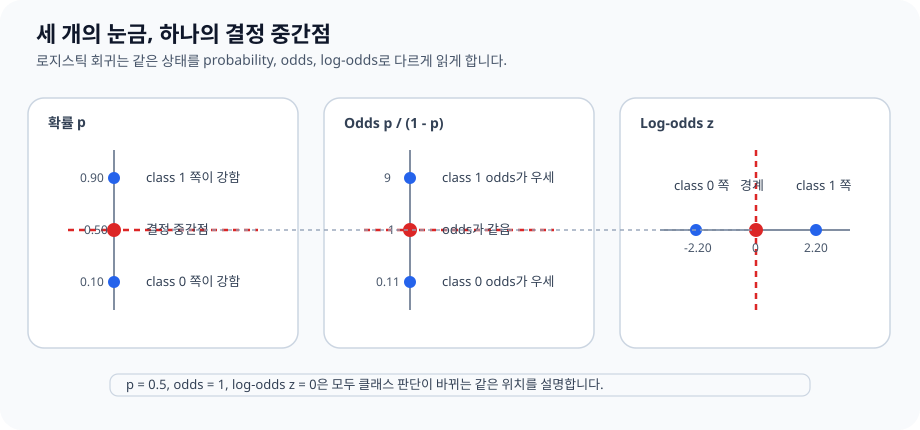

# P4-11.3 보충학습: log-odds와 MLE를 처음 읽는 법

> Section ID: `P4-11.3`
> Version: `v2026.07.31`

P4-11.1에서는 [로지스틱 회귀(logistic regression)](../../../reference/concept-glossary-parts/04-rieul.md#logistic-regression)를 `확률처럼 읽히는 점수를 만드는 선형 분류 모델`로 보았고, P4-11.2에서는 그 점수가 입력 공간을 어떻게 가르는지 [결정 경계(decision boundary)](../../../reference/concept-glossary-parts/01-giyeok.md#decision-boundary) 관점으로 읽었습니다. 여기까지 오면 자연스럽게 다음 질문이 남습니다.

왜 확률을 그대로 선형식으로 다루지 않고, 왜 [log-odds](../../../reference/concept-glossary-parts/04-rieul.md#logistic-regression)와 [최대우도추정(maximum likelihood estimation, MLE)](../../../reference/concept-glossary-parts/11-chieut.md#maximum-likelihood-estimation-mle) 같은 말이 따라붙는가?

이 절은 그 질문을 회수하는 보충학습입니다. 중심은 `로지스틱 회귀의 확률 해석`과 `학습 목적`입니다. 다중 클래스(multinomial) 확장과 solver, regularization은 뒤의 P4-11.4와 P4-11.5에서 나누어 다룹니다.

## log-odds와 MLE를 처음 읽을 때 닫을 질문

이 절은 다음 질문에 답합니다.

- log-odds는 왜 등장하는가?
- 로지스틱 회귀는 왜 최대우도추정(MLE)으로 학습한다고 말하는가?
- [log loss](../../../reference/concept-glossary-parts/04-rieul.md#log-loss)는 MLE와 어떻게 연결되는가?

이 절은 log-odds와 MLE를 `확률 해석`과 `학습 목적`을 잇는 기준으로 먼저 닫고, 같은 모델을 왜 이런 수학 언어로 다시 읽는지 붙잡는 데 집중합니다.

대신 이번 절에서 바로 더 넓혀 볼 질문도 분명합니다. 다중 클래스(multinomial) 확장은 P4-11.4에서, solver와 regularization은 P4-11.5에서 이어서 다룹니다.

## log-odds와 MLE에서 남길 판단 기준

- 확률, odds, log-odds의 관계를 입문 수준에서 설명할 수 있습니다.
- `z = 0`, `확률 0.5`, `odds 1`이 같은 자리를 가리킨다는 점을 설명할 수 있습니다.
- 로지스틱 회귀가 `정답에 높은 확률을 주는 방향`으로 학습된다는 점을 설명할 수 있습니다.
- MLE와 log loss를 같은 학습 목적의 두 표현으로 읽을 수 있습니다.

## 학습 배경

로지스틱 회귀는 보통 `sigmoid를 붙여 0과 1 사이 값으로 읽는다`는 설명으로 시작합니다. 이 설명은 첫 이해에는 충분하지만, 조금만 더 가면 곧바로 다음 용어들을 만나게 됩니다.

- logit 또는 log-odds
- likelihood 또는 log-likelihood
- MLE
- log loss

초심자가 여기서 막히는 이유는 용어가 갑자기 수학 교재처럼 바뀌기 때문입니다. 하지만 이 이름들은 따로 노는 것이 아니라, 같은 질문을 다른 방향에서 읽은 결과입니다.

1. 확률은 0과 1 사이에 묶여 있으니 선형식과 바로 연결하기 어렵습니다.
2. 그래서 확률을 선형 점수와 연결하는 log-odds가 등장합니다.
3. 분류 학습에서는 `정답에 얼마나 높은 확률을 주었는가`를 따져야 합니다.
4. 그래서 likelihood, MLE, log loss가 함께 등장합니다.

즉, 이 절의 핵심은 새로운 알고리즘을 외우는 일이 아니라, `확률 해석`과 `학습 목적`이 왜 같은 장에서 이어지는가를 이해하는 데 있습니다.

## 확률을 선형식으로 바로 다루기 어려워서 log-odds가 등장한다

P4-11.1에서 본 것처럼, 로지스틱 회귀는 선형 점수 \(z\)를 만든 뒤 sigmoid에 통과시켜 0과 1 사이 값으로 읽습니다.

\[
p = \frac{1}{1 + e^{-z}}
\]

이 식을 `확률 p를 z로 다시 푼다`는 느낌으로 한 단계씩 뒤집으면 다음 흐름이 나옵니다.

\[
p = \frac{1}{1 + e^{-z}}
\]

\[
\frac{1}{p} = 1 + e^{-z}
\]

\[
\frac{1-p}{p} = e^{-z}
\]

\[
\frac{p}{1-p} = e^z
\]

그래서 마지막에 로그를 취하면 다음 관계가 나옵니다.

\[
\log \frac{p}{1-p} = z
\]

왼쪽의 \(\frac{p}{1-p}\)는 odds이고, 그 로그가 log-odds 또는 logit입니다. 이 식이 중요한 이유는 간단합니다.

- 확률 \(p\)는 0과 1 사이에 갇혀 있습니다.
- 반면 선형식 \(z\)는 음수와 양수를 자유롭게 오갈 수 있습니다.
- 그래서 `선형식으로 다루기 좋은 스케일`과 `확률처럼 읽기 좋은 스케일`을 연결하려면 중간에 log-odds 같은 변환이 필요합니다.

즉, log-odds는 괜히 어려운 말을 붙인 것이 아니라, `확률을 선형식과 연결하기 위한 다리`입니다.

간단한 표로 보면 감각이 더 분명해집니다.

| 확률 \(p\) | odds \(p / (1-p)\) | log-odds |
| ---: | ---: | ---: |
| 0.10 | 0.111 | -2.197 |
| 0.50 | 1.000 | 0.000 |
| 0.80 | 4.000 | 1.386 |
| 0.90 | 9.000 | 2.197 |

이 표가 말하는 핵심은 다음과 같습니다.

- 확률 0.5는 log-odds 0과 대응합니다.
- class 1 쪽으로 더 확신할수록 log-odds는 양수로 커집니다.
- class 0 쪽으로 더 확신할수록 log-odds는 음수로 작아집니다.

즉, P4-11.2에서 `결정 경계는 선형 점수 \(z = 0\)인 자리`라고 했던 설명도, 결국 `확률 0.5`, `odds 1`, `log-odds 0`이 같은 자리를 가리킨다는 뜻으로 다시 읽을 수 있습니다.

이 대응은 표로 외우기보다 `같은 상태를 서로 다른 눈금으로 읽는 것`이라고 붙잡는 편이 더 낫습니다.



```mermaid
--8<-- "assets/part-04/chapter-11/p4-11-3-mermaid-01-ko.mmd"
```

### 최대우도추정(MLE)은 정답에 높은 확률을 주는 방향을 찾는 말이다

선형회귀(linear regression)에서는 오차(error)를 제곱해 줄이는 사고가 자연스럽습니다. 하지만 분류에서는 정답이 0 또는 1이라서, `얼마나 가까운 연속값이냐`보다 `정답 class에 얼마나 높은 확률을 주었느냐`가 더 중요합니다.

그래서 로지스틱 회귀는 보통 우도(likelihood), 더 자주 말하면 로그우도(log-likelihood)를 최대화하는 방식으로 설명됩니다.

이때 이진 분류 한 샘플의 정답 \(y_i\)가 0 또는 1이고, 모델이 class 1 확률을 \(p_i\)라고 두면 한 샘플의 확률은 다음처럼 한 줄로 쓸 수 있습니다.

\[
P(y_i \mid x_i) = p_i^{y_i}(1-p_i)^{1-y_i}
\]

이 식은 처음 보면 낯설지만, 사실은 `정답이 1이면 p_i를 쓰고, 정답이 0이면 1-p_i를 쓴다`는 뜻을 압축한 형태입니다.

- \(y_i = 1\)이면 \(p_i^{1}(1-p_i)^0 = p_i\)
- \(y_i = 0\)이면 \(p_i^{0}(1-p_i)^1 = 1-p_i\)

전체 데이터 \(n\)개를 한꺼번에 보면 우도는 곱으로 묶입니다.

\[
L(w, b) = \prod_{i=1}^{n} p_i^{y_i}(1-p_i)^{1-y_i}
\]

곱은 다루기 불편하니 보통 로그를 취해 로그우도로 바꿉니다.

\[
\log L(w, b) = \sum_{i=1}^{n} \left(y_i \log p_i + (1-y_i)\log(1-p_i)\right)
\]

그리고 구현에서는 이 값을 최대화하는 대신, 앞에 마이너스를 붙인 음의 로그우도(negative log-likelihood)를 최소화하는 형태로 자주 씁니다.

\[
-\log L(w, b) = - \sum_{i=1}^{n} \left(y_i \log p_i + (1-y_i)\log(1-p_i)\right)
\]

이 식이 바로 이진 로지스틱 회귀에서 자주 보게 되는 log loss의 핵심 형태입니다.

이 전개를 한 줄씩 읽으면 다음 뜻입니다.

1. 샘플 하나는 `정답에 해당하는 확률`로 읽습니다.
2. 전체 데이터는 `모든 샘플 확률을 곱한 값`으로 읽습니다.
3. 계산을 쉽게 하려고 곱을 합으로 바꾸기 위해 로그를 취합니다.
4. 구현에서는 `크게 만들기`보다 `작게 만들기`가 편해서 앞에 마이너스를 붙여 최소화 문제로 바꿉니다.

입문 수준에서는 다음 한 문장으로 먼저 잡으면 충분합니다.

`최대우도추정은 현재 모델이 관찰된 정답들을 가장 그럴듯하게 설명하도록 파라미터를 찾는 방식이다.`

### MLE를 보면 왜 accuracy만으로 학습을 설명할 수 없는지 보인다

입문 단계에서 자주 생기는 오해는 `분류 문제니까 맞춘 개수만 세면 되는 것 아닌가`입니다. 평가 단계에서는 accuracy가 중요할 수 있지만, 학습 과정은 더 세밀한 차이를 구분해야 합니다.

예를 들어 실제 정답이 1인 샘플에서

- 모델 A가 0.51을 줬다면 겨우 맞췄습니다.
- 모델 B가 0.99를 줬다면 훨씬 강하게 맞췄습니다.

정확도만 보면 둘 다 `맞음`입니다. 하지만 학습은 이 둘을 같은 것으로 보면 안 됩니다. MLE는 바로 이런 차이를 반영하게 해 줍니다.

| 샘플 | 실제 정답 | 모델 A의 class 1 확률 | 모델 B의 class 1 확률 |
| --- | ---: | ---: | ---: |
| 1 | 1 | 0.55 | 0.90 |
| 2 | 0 | 0.45 | 0.10 |

두 모델 모두 0.5 기준으로는 정답을 맞힙니다. 하지만 모델 B가 정답 class에 훨씬 더 높은 확률을 주고 있습니다. 이때 등장하는 생각이 `정답에 높은 확률을 준 모델을 더 좋게 보자`입니다. 로지스틱 회귀에서 MLE는 바로 그 생각을 수학적으로 정리한 표현입니다.

이 때문에 학습 과정에서 자주 함께 보게 되는 것이 log loss입니다. log loss는 `정답에 낮은 확률을 준 경우를 더 크게 벌주는 값`으로 읽을 수 있습니다. 즉, MLE와 log loss는 서로 반대 방향에서 같은 학습 목적을 말하는 셈입니다.

## log-odds와 MLE를 처음 읽는 법: 확인할 판단 기준

이 사례에서는 log-odds와 MLE를 처음 읽는 법을 보충하는지 확인한다.

사례를 읽기 전에 이번 절의 비교 프레임을 먼저 한 표로 잡으면 다음과 같습니다.

| 장면 | 사람이 먼저 쓰기 쉬운 기준 | 그 기준의 한계 | 로지스틱 회귀가 바꾸는 점 | 확인할 결과 |
| --- | --- | --- | --- | --- |
| 확률 해석 | 0과 1 사이 값만 본다 | 선형 점수와의 연결이 보이지 않는다 | log-odds로 확률과 선형 점수를 잇는다 | \(z = 0\), \(p = 0.5\), odds 1이 연결됨 |
| 학습 목적 | 맞혔는가만 본다 | 같은 accuracy 안의 확신 차이를 놓친다 | MLE와 log loss로 확신 차이를 읽게 한다 | 같은 accuracy라도 학습 평가는 달라질 수 있음 |

### 사례 1. 경계 근처 점수는 왜 애매하게 느껴지는가

시험 합격 예측에서 어떤 학생의 class 1 확률이 0.51이라면 모델은 합격 쪽으로 봅니다. 하지만 이 값은 강한 확신이 아니라 경계 근처 판단입니다. 이때 log-odds를 떠올리면 `확률이 0.5를 조금 넘었다`는 말이 곧 `선형 점수 \(z\)가 0을 조금 넘었다`는 말과 연결됩니다.

즉, 확률표만 보면 막연했던 애매함이 `경계 근처 점수`라는 구조로 다시 읽힙니다.

### 사례 2. 같은 accuracy인데 왜 학습 평가는 다를 수 있는가

고객 이탈 예측에서 두 모델이 모두 100명 중 86명을 맞혔다고 해 보겠습니다. 그런데 한 모델은 경계 근처 사례에 0.51, 0.52 같은 점수만 주고, 다른 모델은 같은 정답 사례에 0.80, 0.88 같은 점수를 줍니다. 두 모델의 accuracy는 같아도, `정답에 얼마나 강한 확신을 주는가`는 다릅니다.

이 장면이 MLE와 log loss가 필요한 이유를 보여 줍니다. 분류 모델은 단순히 `맞췄는가`만이 아니라 `정답을 얼마나 그럴듯하게 설명했는가`도 구분해야 하기 때문입니다.

```mermaid
--8<-- "assets/part-04/chapter-11/p4-11-3-mermaid-02-ko.mmd"
```

## 연습 및 예제

### Python 예제로 accuracy와 log loss를 함께 읽기

아래 예제는 `같은 정답을 맞혀도 확률의 확신 정도에 따라 log loss가 달라진다`는 점을 보여 줍니다.

| 입력 묶음 | 뜻 |
| --- | --- |
| `true_binary` | 이진 분류의 실제 정답 |
| `proba_model_a`, `proba_model_b` | 같은 정답에 대해 확신 정도가 다른 두 확률 예시 |

조작해 볼 값:

- `proba_model_a`를 `0.51`, `0.49`처럼 더 경계에 가깝게 바꾸면 accuracy가 같아도 log loss가 커지는지 볼 수 있습니다.
- `proba_model_b`에 정답과 반대인 높은 확률을 하나 넣으면, 자신 있게 틀린 예측이 log loss를 얼마나 키우는지 확인할 수 있습니다.

```python
# log-odds, likelihood, MLE가 로지스틱 회귀 학습과 어떻게 연결되는지 계산하는 예제입니다.
import numpy as np
from sklearn.metrics import log_loss

true_binary = np.array([1, 0, 1, 0])
proba_model_a = np.array([0.55, 0.45, 0.60, 0.40])
proba_model_b = np.array([0.90, 0.10, 0.85, 0.15])

pred_a = (proba_model_a >= 0.5).astype(int)
pred_b = (proba_model_b >= 0.5).astype(int)

print("binary accuracy A :", (pred_a == true_binary).mean())
print("binary accuracy B :", (pred_b == true_binary).mean())
print("log loss A        :", round(log_loss(true_binary, proba_model_a), 4))
print("log loss B        :", round(log_loss(true_binary, proba_model_b), 4))
```

실행 결과 예시는 다음과 같습니다.

```text
binary accuracy A : 1.0
binary accuracy B : 1.0
log loss A        : 0.5543
log loss B        : 0.1446
```

이 출력은 다음처럼 읽으면 됩니다.

- 두 모델은 accuracy가 같아도 log loss는 다릅니다.
- 즉, MLE와 연결되는 학습 관점에서는 `정답을 얼마나 강하게 지지했는가`가 구분됩니다.
- 그래서 로지스틱 회귀를 이해할 때 `평가 지표`와 `학습 목적 함수`를 구분하는 감각이 중요합니다.

## 출처와 참고 자료

- C. M. Bishop, *Pattern Recognition and Machine Learning*, Springer, 2006. 확인 날짜: 2026-07-26. [https://link.springer.com/book/9780387310732](https://link.springer.com/book/9780387310732){: target="_blank" rel="noopener noreferrer" }
- scikit-learn, `log_loss` API documentation, [https://scikit-learn.org/stable/modules/generated/sklearn.metrics.log_loss.html](https://scikit-learn.org/stable/modules/generated/sklearn.metrics.log_loss.html){: target="_blank" rel="noopener noreferrer" }, 확인 날짜: 2026-07-26
- scikit-learn, `LogisticRegression` API documentation, [https://scikit-learn.org/stable/modules/generated/sklearn.linear_model.LogisticRegression.html](https://scikit-learn.org/stable/modules/generated/sklearn.linear_model.LogisticRegression.html){: target="_blank" rel="noopener noreferrer" }, 확인 날짜: 2026-07-26
