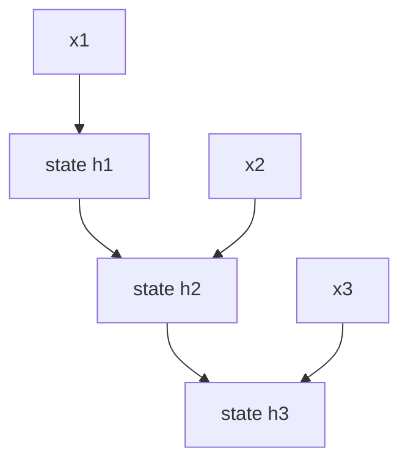

# P4-12.1 RNN, LSTM, GRU의 필요성

P4-11장에서는 CNN이 이미지처럼 공간 구조가 있는 데이터에서 지역 패턴을 잘 다룬다는 점을 보았습니다. 여기서 데이터 유형을 바꾸면 다음 질문이 생깁니다.

문장, 음성, 시계열처럼 순서(order)가 중요한 데이터는 어떻게 다루는가?

이 질문에 답하려는 구조가 RNN(recurrent neural network), LSTM(long short-term memory), GRU(gated recurrent unit)입니다.

RNN 계열 구조는 현재 입력만 보지 않고, 앞에서 본 정보를 어느 정도 이어받아 순차 데이터(sequence data)를 처리하려는 신경망이다.

## 이 절의 범위

이 절은 다음 질문에 답합니다.

- 왜 순차 데이터에는 순서 개념이 중요한가?
- 일반적인 feed-forward 구조만으로는 어떤 답답함이 생기는가?
- RNN은 어떤 아이디어를 도입했는가?
- LSTM과 GRU는 왜 추가로 필요해졌는가?

이 절에서 먼저 닫아야 하는 핵심은 `순차 데이터는 마지막 입력 하나가 아니라 앞에서 누적된 상태가 현재 판단을 바꾼다`는 점입니다.

이 절에서는 다음 내용을 깊게 다루지 않습니다.

- RNN/LSTM/GRU의 세부 게이트 수식
- backpropagation through time(BPTT)의 상세 전개
- attention 이후 구조와의 정밀 비교

장기 의존성(long-term dependency) 문제는 P4-12.2에서 이어서 더 집중해서 다루고, attention 이후 구조와의 연결은 그다음 장에서 짧게 이어집니다. 세부 게이트 수식과 BPTT의 상세 전개는 이 책의 현재 본편 범위 밖에 둡니다.

지금 읽는 층위는 `순차 상태 구조 층위`입니다. 앞 장의 CNN이 `공간 구조를 가진 입력을 어떻게 읽을까`를 다뤘다면, 여기서는 순서가 있는 데이터를 다룰 때 `이전 입력의 흔적을 어떻게 다음 step으로 넘길까`를 읽습니다. 바로 다음 절의 장기 의존성과 attention 장에서는 이 상태 전달 구조가 어디서 흔들리고, 어떤 새 구조 전환이 나오는지로 질문이 더 커집니다.

처음 읽을 때는 RNN, LSTM, GRU를 Part 4 본류의 `순차 상태 손잡이`로만 잡고, 그 다음에 장기 의존성과 attention이 어떤 한계와 전환을 보여 주는지 같이 보면 흐름이 덜 끊깁니다.

| 지금 단계의 손잡이 | 바로 다음에 이어질 질문 | 뒤에서 본격적으로 다시 읽는 위치 |
| --- | --- | --- |
| RNN / LSTM / GRU | 이전 입력의 흔적을 어떻게 상태로 넘기고 관리할 것인가? | P4-12.1 |
| 장기 의존성 | 그 상태 전달이 왜 먼 단서 앞에서 약해지기 쉬운가? | P4-12.2 |
| attention | 상태를 넘기는 대신 필요한 위치를 직접 다시 참고할 수 있는가? | P4-13.1 |

앞뒤 장의 최소 차이는 다음 표처럼 다시 고정할 수 있습니다.

| 바로 앞 장 | 지금 장 | 바로 다음에 더 붙는 장 |
| --- | --- | --- |
| CNN: 공간 구조를 가진 입력을 어떻게 읽을까 | RNN 계열: 순차 상태를 어떻게 이어받고 관리할까 | 장기 의존성과 attention: 그 상태 전달은 어디서 흔들리고 무엇으로 바뀌는가 |
| 공간 패턴 처리 | 순차 상태 처리 | 상태 한계와 직접 참조 전환 |

즉, 지금 장의 핵심은 `공간 구조를 어떻게 읽을까`에서 `순차 상태를 어떻게 이어받고 관리할까`로 손잡이가 바뀐다는 점입니다.

## 이 절의 목표

- 순차 데이터 문제에서 `순서`와 `문맥(context)`이 왜 중요한지 설명할 수 있습니다.
- RNN을 `이전 상태를 이어받는 구조`로 설명할 수 있습니다.
- LSTM과 GRU가 등장한 이유를 장기 기억 유지 문제와 연결할 수 있습니다.
- 실행 가능한 Python 예제로 순차 누적 상태가 실제 판단을 어떻게 바꾸는지 확인할 수 있습니다.

## 이 절을 읽는 순서

이 절은 다음 순서로 읽으면 흐름이 자연스럽습니다.

1. 왜 순차 데이터에서는 순서와 앞뒤 문맥이 중요한지 먼저 봅니다.
2. feed-forward 구조가 왜 답답한지 보고, RNN의 기본 아이디어가 어디서 나오는지 봅니다.
3. RNN이 상태를 다음 step으로 넘긴다는 핵심 직관을 잡습니다.
4. 왜 기본 RNN만으로는 오래 기억하기 어려웠는지 보고, LSTM과 GRU가 왜 나왔는지 연결합니다.
5. 마지막에 이 흐름이 다음 절의 장기 의존성 문제로 어떻게 이어지는지 정리합니다.

## 왜 순차 데이터는 특별한가

순차 데이터(sequence data)는 항목의 순서가 바뀌면 의미가 달라질 수 있습니다.

예를 들어:

- 문장: 단어 순서가 의미를 바꿉니다
- 음성: 시간 흐름이 발음 구조를 만듭니다
- 주가/센서 데이터: 이전 값과 이후 값의 순서가 중요합니다

즉, 순차 데이터는 단순한 집합(set)이나 표 한 줄과 다르게 `앞뒤 관계`를 포함합니다.

`순차 데이터에서는 무엇이 있는가뿐 아니라, 어떤 순서로 나타나는가가 중요하다.`

## 일반적인 feed-forward 구조만으로는 왜 답답한가

일반적인 feed-forward network는 입력을 한 번에 받아 출력으로 보내는 데에는 자연스럽습니다. 하지만 순차 데이터에서는 다음 같은 답답함이 생깁니다.

- 현재 입력을 볼 때 앞의 정보를 함께 기억하고 싶고
- 문장 끝에서 앞 단어의 영향을 반영하고 싶으며
- 음성의 현재 조각을 이전 조각 맥락과 함께 보고 싶습니다

즉, 순차 데이터에서는 `지금 보는 입력`과 `이전에 본 입력`을 함께 연결해야 할 때가 많습니다.

여기서 RNN의 기본 아이디어가 등장합니다.

같은 차이를 아주 짧게 비교하면 다음과 같습니다.

| 구조 | 입력을 보는 감각 |
| --- | --- |
| feed-forward | 한 번에 받은 입력을 바로 출력으로 보낸다 |
| RNN | 현재 입력을 보면서 이전 상태도 함께 들고 간다 |

같은 장면을 두 구조로 나눠 보면 차이가 더 직접 보입니다.

| 같은 장면 | feed-forward로 먼저 읽을 때 남기 쉬운 것 | RNN으로 먼저 읽을 때 더 붙잡는 것 |
| --- | --- | --- |
| 문장 끝의 부정 표현 | 현재 단어 자체의 즉시 신호 | 앞 단어부터 누적된 문장 흐름 |
| 짧은 음성 조각 해석 | 지금 들리는 소리 조각의 모양 | 직전 소리와 이어지는 시간 맥락 |
| 마지막 센서 값 판단 | 현재 숫자 크기 하나 | 직전 여러 step의 상승·하락 흐름 |

## RNN은 무엇을 도입했나

RNN의 핵심 발상은 매우 단순하게 요약할 수 있습니다.

`현재 입력을 처리할 때, 이전 step에서 만들어 둔 상태(state)도 함께 사용하자.`

즉, RNN은 각 시점(time step)마다:

- 현재 입력 \(x_t\)
- 이전 상태 \(h_{t-1}\)

를 받아 새로운 상태 \(h_t\)를 만듭니다.

핵심은 RNN이 이전에 본 정보를 상태처럼 들고, 다음 단계 계산에 함께 넘기려는 구조라는 점입니다.

`RNN은 한 번 계산하고 끝나는 것이 아니라, 이전에 본 정보를 상태처럼 들고 다음 단계로 넘기려는 구조다.`

즉, 이 절에서 RNN을 읽을 때는 `현재 입력을 본다`보다 `현재 입력을 이전 상태와 함께 본다`는 차이를 먼저 붙잡는 편이 좋습니다.

이를 아주 단순하게 그리면 다음과 같습니다.



이 도식에서 확인해야 할 결과는 현재 출력이 지금 입력만으로 정해지는 것이 아니라, 이전 시점의 상태가 다음 시점으로 계속 전달되며 함께 영향을 준다는 점입니다.

## RNN만으로 충분하지 않았던 이유

기본 RNN은 중요한 아이디어를 제공했지만, 깊은 시간 흐름을 다루다 보면 어려움이 생깁니다.

예를 들어:

- 오래전 정보가 뒤로 갈수록 약해지거나
- 학습이 불안정해지거나
- 앞의 중요한 맥락을 끝까지 잘 유지하지 못할 수 있습니다

즉, `기억하고 싶다`는 아이디어는 좋았지만, 실제로 오래 기억하는 것은 쉽지 않았습니다.

이 문제의 대표적 설명이 다음 절의 장기 의존성(long-term dependency)입니다.

## 그래서 LSTM과 GRU가 나왔다

LSTM과 GRU는 기본 RNN의 기억 문제를 더 잘 다루려는 구조입니다.

핵심은 LSTM과 GRU가 무엇을 더 오래 남기고 무엇을 버릴지, 그리고 현재 입력을 얼마나 반영할지를 조절하는 구조라는 점입니다.

- 무엇을 더 오래 유지할지
- 무엇을 버릴지
- 현재 입력을 얼마나 반영할지

를 더 정교하게 조절하는 구조가 LSTM과 GRU입니다.

즉, 이들은 단순히 `더 복잡한 RNN`이 아니라, `기억을 더 잘 관리하려는 RNN`이라고 볼 수 있습니다.

이 차이를 입문 단계에서는 다음처럼 읽으면 충분합니다.

- basic RNN은 `상태를 이어간다`는 아이디어를 보여 줍니다.
- LSTM과 GRU는 `그 상태를 어떻게 더 오래, 더 안정적으로 유지할지`를 보강합니다.

## LSTM과 GRU는 왜 둘 다 배우나

입문 단계에서는 이름이 많아 혼란스러울 수 있습니다. 하지만 다음처럼 구분하면 충분합니다.

- RNN: 순차 상태를 이어가는 가장 기본 아이디어
- LSTM: 기억 유지 문제를 더 강하게 다루는 대표 구조
- GRU: 비슷한 목적을 조금 더 간결하게 구현한 구조

즉, 셋은 서로 무관한 경쟁자라기보다, `순차 기억 문제를 다루는 같은 계열의 발전 흐름`으로 보는 편이 좋습니다.

입문 단계에서는 다음 정도로만 구분해도 충분합니다.

| 이름 | 먼저 잡아야 할 직관 |
| --- | --- |
| RNN | 상태를 다음 step으로 넘긴다 |
| LSTM | 오래 남길 정보와 버릴 정보를 더 세밀하게 조절한다 |
| GRU | 비슷한 목적을 더 간결한 구조로 구현한다 |

모델 이름을 따로 외우기보다, 작은 순차 장면에서 무엇을 먼저 떠올릴지 같이 붙여 두면 흐름이 더 안정적입니다.

| 작은 순차 장면 | 먼저 떠올릴 구조 | 그 구조가 출발점이 되는 이유 |
| --- | --- | --- |
| 짧은 문장 감정 분류처럼 앞뒤 몇 단어 흐름만 이어도 되는 경우 | RNN | `현재 입력 + 이전 상태`라는 가장 기본 순차 상태 아이디어를 바로 보기 좋기 때문입니다. |
| 문장 끝 부정 표현이나 앞 주어처럼 조금 더 먼 단서를 오래 붙잡아야 하는 경우 | LSTM | 무엇을 남기고 무엇을 버릴지 더 세밀하게 조절해 장기 기억 유지 문제를 더 직접 다루기 때문입니다. |
| LSTM과 비슷한 목적이지만 구조를 조금 더 간결하게 가져가고 싶은 경우 | GRU | 순차 기억 보강 감각은 유지하면서 상태 조절 구조를 비교적 단순하게 읽기 좋기 때문입니다. |

이 표의 목적은 `언제나 어느 모델이 더 우월한가`를 정하는 데 있지 않습니다. 현재 절에서는 `순차 상태를 처음 도입할 때는 RNN`, `기억 유지 문제가 더 중요해지면 LSTM/GRU`라는 문제 장면 중심 손잡이를 잡는 정도면 충분합니다.

## 사례로 보기

### 사례 1. 문장 분류

문장 분류에서 `이 영화는 끝까지 지루하지 않았다` 같은 문장을 생각해 볼 수 있습니다. 사람은 문장을 읽다가 중간에 `지루` 같은 단어를 보면 먼저 부정 감정을 떠올리기 쉽습니다. 하지만 끝에 나오는 `않았다`가 앞에서 쌓인 의미를 다시 뒤집기 때문에, 마지막 몇 단어만 보거나 단어를 따로 떼어 보면 쉽게 오해할 수 있습니다. 즉, 현재 위치 의미를 읽을 때도 앞 단어와 중간 문맥이 함께 중요합니다. 순차 상태를 이어가는 구조는 바로 이런 `앞에서 본 내용이 뒤 해석에 남아 있어야 하는 상황`에서 필요해집니다.

### 사례 2. 음성 인식

음성 인식에서 한 순간의 짧은 파형만 잘라 보면, 그 소리가 정확히 어떤 음절인지 분명하지 않을 수 있습니다. 사람도 아주 짧은 소리 조각만 따로 들으면 비슷한 발음을 헷갈리기 쉽고, 앞소리와 뒷소리를 함께 들어야 단어가 또렷해지는 경우가 많습니다. 예를 들어 짧은 `가` 비슷한 소리도 앞뒤 연결에 따라 다른 단어 일부일 수 있습니다. 즉, 현재 시점 소리 하나만으로는 부족하고 앞뒤 시간 맥락이 같이 필요합니다. 순차 상태 구조는 이전에 들은 신호를 이어받아 현재 해석에 반영하는 데 자연스럽습니다.

### 사례 3. 시계열 예측

센서 값이 갑자기 높아졌다고 해 봅시다. 사람은 경고 숫자 하나만 보면 먼저 `이상 발생`으로 단정하거나, 반대로 `잠깐 튄 값이겠지`라고 넘기기 쉽습니다. 하지만 직전 몇 초, 몇 분의 흐름을 같이 보면 서서히 올라온 변화인지 순간 튐인지가 더 잘 보입니다. 예를 들어 온도가 80으로 올라간 사실 자체보다, 60에서 65, 72, 80으로 계속 올라왔는지가 더 중요한 경고 신호일 수 있습니다. 순차 상태를 이어받는 구조는 이런 과거 흐름을 현재 판단 안에 남겨 두는 데 유리합니다.

세 사례에서 공통으로 확인해야 할 결과는 현재 입력 하나보다 앞 흐름이 함께 남아 있어야 한다는 점입니다. 문장 분류에서는 부정이 뒤에서 뒤집히는 흐름을 놓치지 않는지, 음성 인식에서는 짧은 소리 조각이 앞뒤 연결 속에서 더 안정적으로 해석되는지, 시계열 예측에서는 같은 마지막 값도 직전 추세에 따라 다른 경보로 나뉘는지를 보면 충분합니다.

| 사례 | 지금 입력만 보면 놓치기 쉬운 것 | 순차 상태가 추가하는 맥락 | 이 절에서 확인할 결과 |
| --- | --- | --- | --- |
| 문장 분류 | `지루` 같은 중간 단어의 즉시 감정 | 뒤의 `않았다`가 앞 의미를 뒤집는 흐름 | 최종 판단이 단어 하나가 아니라 문장 흐름을 반영하는가 |
| 음성 인식 | 짧은 파형 조각 하나의 모호함 | 앞뒤 발음이 이어지는 시간 맥락 | 같은 소리 조각이 앞뒤 연결에 따라 더 안정적으로 해석되는가 |
| 시계열 예측 | 마지막 숫자 하나의 크기 | 직전 여러 step의 상승·하락 추세 | 같은 마지막 값도 이전 흐름에 따라 다른 경보가 나오는가 |

## 실행 가능한 Python 예제로 상태 직관 보기

이번 예제의 목표는 `이전 상태를 다음 step으로 넘긴다`는 말이 실제 판단에서 어떤 차이를 만드는지 확인하는 것입니다. 이번에는 순차 상태가 없는 아주 단순한 기준과, 순차 상태를 이어받는 기준을 나란히 두고 비교합니다. 즉, `마지막 입력만 보는 판단`과 `앞의 흐름까지 남기는 판단`이 어디서 갈라지는지 실제 출력으로 확인합니다.

예제를 읽기 전에, 이번 절에서 실제로 확인해야 할 최소 포인트를 먼저 고정하면 다음과 같습니다.

| 확인 포인트 | 예제에서 바로 볼 값 | 왜 중요한가 |
| --- | --- | --- |
| baseline과 상태 기반 판단이 어디서 갈라지는가 | `baseline_last_word_label`, `baseline_last_value_alert`와 최종 `label`, `alert` | 순차 모델이 마지막 입력 하나보다 누적 상태를 본다는 점을 보여 준다 |
| 상태가 step마다 어떻게 누적되는가 | 각 줄의 `state=` 출력 | RNN류 구조의 핵심이 현재 입력 즉시 판단이 아니라 상태 갱신이라는 점을 보여 준다 |
| 같은 마지막 입력도 왜 다른 결론이 나오는가 | `gradual_rise`와 `temporary_spike`의 마지막 step 비교 | 직전 흐름이 다르면 현재 판단도 달라진다는 순차 문맥 감각을 눈으로 확인하게 한다 |

입력:

- 부정 표현이 문장 끝에 오는 짧은 문장 두 개
- 같은 마지막 온도 `80`을 가진 두 시계열

출력:

- 마지막 입력만 보는 baseline 판단
- 각 step에서 갱신되는 문장 상태값
- 최종 문장 라벨
- 마지막 값만 보는 baseline 경보 여부
- 각 step에서 갱신되는 센서 상태값
- 마지막 step에서의 경보 여부

문제 상황:

- 순차 데이터는 마지막 값만 보는 방식과 중간 상태를 계속 갱신하는 방식의 차이를 직접 비교해 볼 필요가 있다

확인할 개념:

- RNN류 구조는 입력을 한 번에 보지 않고 step마다 상태를 갱신한다
- 마지막 값만 보는 baseline과 비교하면 순차 상태 업데이트의 의미가 더 분명해진다

입력(input):

위에 정리한 단어 신호, 센서 신호, 초기 상태값을 사용합니다.

```python
word_signal = {
    "끝까지": 0.3,
    "지루": -0.8,
    "하지": 0.1,
    "않았다": 1.4,
    "정말": 0.2,
    "좋았다": 0.9,
}


def classify_with_last_word(words):
    last_signal = word_signal.get(words[-1], 0.0)
    return "positive" if last_signal > 0 else "negative"


def run_sentence(name, words, alpha=0.7):
    state = 0.0
    print(f"[sentence: {name}]")
    print("baseline_last_word_label =", classify_with_last_word(words))
    for step, word in enumerate(words, start=1):
        signal = word_signal.get(word, 0.0)
        state = alpha * state + signal
        print(f"step {step}: word={word:>6}, signal={signal:>4}, state={state:>5.2f}")
    label = "positive" if state > 0 else "negative"
    print("final_label =", label)
    print()


def alert_with_last_value(sequence, threshold):
    return sequence[-1] >= threshold


def run_sequence(name, sequence, alpha=0.6, threshold=63):
    state = 0.0
    print(f"[sensor: {name}]")
    print("baseline_last_value_alert =", alert_with_last_value(sequence, threshold))
    for step, x in enumerate(sequence, start=1):
        state = alpha * state + (1 - alpha) * x
        alert = state >= threshold
        print(f"step {step}: input={x:>3}, state={state:>6.2f}, alert={alert}")
    print()


gradual_rise = [60, 65, 72, 80]
temporary_spike = [80, 60, 60, 80]

run_sentence("not_boring", ["끝까지", "지루", "하지", "않았다"])
run_sentence("really_good", ["정말", "좋았다"])
run_sequence("gradual_rise", gradual_rise)
run_sequence("temporary_spike", temporary_spike)
```

실행 결과 예시는 다음처럼 읽을 수 있습니다.

```text
[sentence: not_boring]
baseline_last_word_label = positive
step 1: word=   끝까지, signal= 0.3, state= 0.30
step 2: word=    지루, signal=-0.8, state=-0.59
step 3: word=    하지, signal= 0.1, state=-0.31
step 4: word=  않았다, signal= 1.4, state= 1.18
final_label = positive

[sentence: really_good]
baseline_last_word_label = positive
step 1: word=    정말, signal= 0.2, state= 0.20
step 2: word=   좋았다, signal= 0.9, state= 1.04
final_label = positive

[sensor: gradual_rise]
baseline_last_value_alert = True
step 1: input= 60, state= 24.00, alert=False
step 2: input= 65, state= 40.40, alert=False
step 3: input= 72, state= 53.04, alert=False
step 4: input= 80, state= 63.82, alert=True

[sensor: temporary_spike]
baseline_last_value_alert = True
step 1: input= 80, state= 32.00, alert=False
step 2: input= 60, state= 43.20, alert=False
step 3: input= 60, state= 49.92, alert=False
step 4: input= 80, state= 61.95, alert=False
```

위 결과는 세 가지를 함께 보여 줍니다. 첫째, 문장 예제에서는 baseline이 마지막 단어 `않았다`만 보고도 우연히 맞을 수 있지만, 실제 순차 모델이 필요한 이유는 그 단어가 왜 중요한지 앞의 `지루`, `하지` 흐름을 상태 안에 붙여 둔다는 데 있습니다. 둘째, 센서 예제에서는 baseline이 마지막 값 `80`만 보고 두 시계열 모두 경보라고 판단하지만, 상태를 쓰는 쪽은 `지속 상승`과 `일시적 튐`을 다르게 남길 수 있습니다. 셋째, 마지막 입력이 둘 다 `80`이어도 상태값이 같지 않은 이유는 현재 step의 판단이 `지금 입력 80` 하나로 정해지는 것이 아니라, 이전 step들에서 누적된 상태를 함께 참고하기 때문입니다.

문장 쪽도 같은 기준으로 읽으면 핵심이 더 분명해집니다. baseline은 마지막 단어가 주는 즉시 신호에 쉽게 끌리지만, 순차 상태 쪽은 `끝까지`, `지루`, `하지`, `않았다`가 차례로 남긴 흔적을 누적해 마지막 결론을 만듭니다. 실제 LSTM과 GRU는 바로 이 상태 관리를 더 오래, 더 안정적으로 하려는 방향으로 이해하면 됩니다.

이 예제는 진짜 RNN 전체를 구현한 것은 아닙니다. 하지만 실제로 읽어야 할 핵심은 더 분명합니다.

- 같은 현재 입력도 이전 흐름에 따라 다른 상태를 만든다
- 상태가 없으면 마지막 단어나 마지막 숫자 같은 아주 거친 기준으로 쉽게 무너진다
- 문장에서는 뒤 단어가 앞 단어의 의미를 바꾸려면 중간 상태가 살아 있어야 한다
- 상태가 다르면 마지막 판단도 달라질 수 있다
- 순차 구조의 핵심은 `현재 값`만이 아니라 `이전까지 쌓인 흔적`을 함께 본다는 데 있다

즉, RNN의 기본 직관은 `현재 입력을 바로 분류한다`보다 `이전 상태를 들고 와 현재 입력과 함께 새 상태를 만든다`에 더 가깝습니다. LSTM과 GRU는 바로 이 상태를 `무엇을 더 오래 남길지`, `무엇을 잊을지` 더 잘 조절하려고 나온 구조라고 읽으면 됩니다.

RNN 계열은 딥러닝이 이미지 바깥의 순차 데이터 문제로 확장되는 과정에서 매우 중요한 위치를 차지했습니다. 번역, 음성 인식, 언어 모델링 같은 분야에서 RNN, LSTM, GRU는 오랫동안 핵심 구조였습니다.

비록 이후 attention과 Transformer가 더 강한 대안으로 부상했지만, RNN 계열을 배우는 이유는 여전히 분명합니다.

- 바로 앞의 P4-11.2 CNN이 `공간 구조`를 다뤘다면, 이제는 `시간 순서와 누적 문맥`이 중요한 데이터를 어떻게 다루는지 봐야 하고
- 순차 모델이 왜 필요한지 가장 직관적으로 보여 주고
- 장기 의존성 문제가 왜 중요한지 설명하며
- Transformer가 무엇을 대체하고 무엇을 개선했는지 비교 기준을 제공하기 때문입니다

## 다음 절과의 연결

여기까지 오면 다음 질문이 남습니다.

- 왜 오래전 정보는 쉽게 사라지는가?
- 장기 의존성(long-term dependency)이 실제로는 어떤 문제를 뜻하는가?

이 질문은 바로 P4-12.2 장기 의존성(long-term dependency)으로 이어집니다.

## 이 절에서 기억할 관점

- 순차 데이터를 읽을 때는 같은 항목이라도 앞뒤 순서와 누적 문맥에 따라 해석이 달라지는지를 먼저 봐야 합니다.
- RNN은 이전 상태를 이어받아 현재 입력을 처리하려는 구조입니다.
- LSTM과 GRU는 오래 기억하기 어려운 문제를 더 잘 다루려는 발전 구조입니다.
- RNN 계열은 Transformer 이전 순차 모델링의 핵심 기준점입니다.

## 체크리스트

- 순차 데이터에서 순서가 왜 중요한지 설명할 수 있는가?
- RNN을 `이전 상태를 이어받는 구조`로 설명할 수 있는가?
- LSTM과 GRU가 왜 등장했는지 말할 수 있는가?
- 다음 절의 장기 의존성 문제로 왜 자연스럽게 이어지는지 설명할 수 있는가?

## 출처와 참고 자료

- David E. Rumelhart, Geoffrey E. Hinton, Ronald J. Williams, `Learning representations by back-propagating errors`, Nature, 1986, 확인 날짜: 2026-06-29.
- Sepp Hochreiter, Jürgen Schmidhuber, `Long Short-Term Memory`, Neural Computation, 1997, 확인 날짜: 2026-06-29.
- Kyunghyun Cho et al., `Learning Phrase Representations using RNN Encoder-Decoder for Statistical Machine Translation`, arXiv, 2014, 확인 날짜: 2026-06-29.
