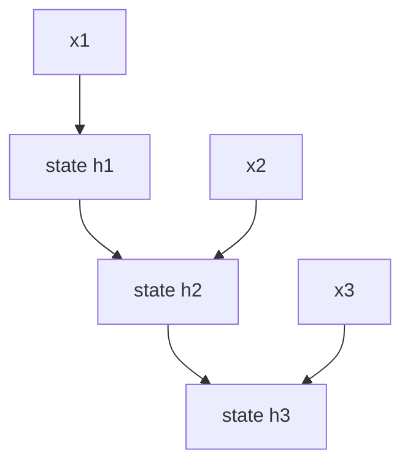

# P4-12.1 RNN, LSTM, GRU의 필요성

P4-11장에서는 CNN이 이미지처럼 공간 구조가 있는 데이터에서 지역 패턴을 잘 다룬다는 점을 보았습니다. 여기서 데이터 유형을 바꾸면 다음 질문이 생깁니다.

문장, 음성, 시계열처럼 순서(order)가 중요한 데이터는 어떻게 다루는가?

이 질문에 답하려는 구조가 RNN(recurrent neural network), LSTM(long short-term memory), GRU(gated recurrent unit)입니다.

RNN 계열 구조는 현재 입력만 보지 않고, 앞에서 본 정보를 어느 정도 이어받아 순차 데이터(sequence data)를 처리하려는 신경망이다.

## 이 절의 범위

이 절은 다음 질문에 답합니다.

- 왜 순차 데이터에는 순서 개념이 중요한가?
- 일반적인 feed-forward 구조만으로는 어떤 답답함이 생기는가?
- RNN은 어떤 아이디어를 도입했는가?
- LSTM과 GRU는 왜 추가로 필요해졌는가?

이 절에서는 다음 내용을 깊게 다루지 않습니다.

- RNN/LSTM/GRU의 세부 게이트 수식
- backpropagation through time(BPTT)의 상세 전개
- attention 이후 구조와의 정밀 비교

장기 의존성(long-term dependency) 문제는 P4-12.2에서 이어서 더 집중해서 다루고, attention 이후 구조와의 연결은 P4-13.1, P4-13.2에서 다시 이어집니다. 세부 게이트 수식과 BPTT의 상세 전개는 이 책의 현재 본편 범위 밖에 둡니다.

## 이 절의 목표

- 순차 데이터 문제에서 `순서`와 `문맥(context)`이 왜 중요한지 설명할 수 있습니다.
- RNN을 `이전 상태를 이어받는 구조`로 설명할 수 있습니다.
- LSTM과 GRU가 등장한 이유를 장기 기억 유지 문제와 연결할 수 있습니다.
- 작은 Python 예제로 순차 누적 상태의 직관을 확인할 수 있습니다.

## 왜 순차 데이터는 특별한가

순차 데이터(sequence data)는 항목의 순서가 바뀌면 의미가 달라질 수 있습니다.

예를 들어:

- 문장: 단어 순서가 의미를 바꿉니다
- 음성: 시간 흐름이 발음 구조를 만듭니다
- 주가/센서 데이터: 이전 값과 이후 값의 순서가 중요합니다

즉, 순차 데이터는 단순한 집합(set)이나 표 한 줄과 다르게 `앞뒤 관계`를 포함합니다.

다음처럼 기억하면 충분합니다.

`순차 데이터에서는 무엇이 있는가뿐 아니라, 어떤 순서로 나타나는가가 중요하다.`

## 일반적인 feed-forward 구조만으로는 왜 답답한가

일반적인 feed-forward network는 입력을 한 번에 받아 출력으로 보내는 데에는 자연스럽습니다. 하지만 순차 데이터에서는 다음 같은 답답함이 생깁니다.

- 현재 입력을 볼 때 앞의 정보를 함께 기억하고 싶고
- 문장 끝에서 앞 단어의 영향을 반영하고 싶으며
- 음성의 현재 조각을 이전 조각 맥락과 함께 보고 싶습니다

즉, 순차 데이터에서는 `지금 보는 입력`과 `이전에 본 입력`을 함께 연결해야 할 때가 많습니다.

여기서 RNN의 기본 아이디어가 등장합니다.

같은 차이를 아주 짧게 비교하면 다음과 같습니다.

| 구조 | 입력을 보는 감각 |
| --- | --- |
| feed-forward | 한 번에 받은 입력을 바로 출력으로 보낸다 |
| RNN | 현재 입력을 보면서 이전 상태도 함께 들고 간다 |

## RNN은 무엇을 도입했나

RNN의 핵심 발상은 매우 단순하게 요약할 수 있습니다.

`현재 입력을 처리할 때, 이전 step에서 만들어 둔 상태(state)도 함께 사용하자.`

즉, RNN은 각 시점(time step)마다:

- 현재 입력 \(x_t\)
- 이전 상태 \(h_{t-1}\)

를 받아 새로운 상태 \(h_t\)를 만듭니다.

다음처럼 이해하면 충분합니다.

`RNN은 한 번 계산하고 끝나는 것이 아니라, 이전에 본 정보를 상태처럼 들고 다음 단계로 넘기려는 구조다.`

이를 아주 단순하게 그리면 다음과 같습니다.



이 도식에서 확인해야 할 결과는 현재 출력이 지금 입력만으로 정해지는 것이 아니라, 이전 시점의 상태가 다음 시점으로 계속 전달되며 함께 영향을 준다는 점입니다.

## RNN만으로 충분하지 않았던 이유

기본 RNN은 중요한 아이디어를 제공했지만, 깊은 시간 흐름을 다루다 보면 어려움이 생깁니다.

예를 들어:

- 오래전 정보가 뒤로 갈수록 약해지거나
- 학습이 불안정해지거나
- 앞의 중요한 맥락을 끝까지 잘 유지하지 못할 수 있습니다

즉, `기억하고 싶다`는 아이디어는 좋았지만, 실제로 오래 기억하는 것은 쉽지 않았습니다.

이 문제의 대표적 설명이 다음 절의 장기 의존성(long-term dependency)입니다.

## 그래서 LSTM과 GRU가 나왔다

LSTM과 GRU는 기본 RNN의 기억 문제를 더 잘 다루려는 구조입니다.

세부 수식보다 다음 정도로 이해하면 충분합니다.

- 무엇을 더 오래 유지할지
- 무엇을 버릴지
- 현재 입력을 얼마나 반영할지

를 더 정교하게 조절하는 구조가 LSTM과 GRU입니다.

즉, 이들은 단순히 `더 복잡한 RNN`이 아니라, `기억을 더 잘 관리하려는 RNN`이라고 볼 수 있습니다.

## LSTM과 GRU는 왜 둘 다 배우나

입문 단계에서는 이름이 많아 혼란스러울 수 있습니다. 하지만 다음처럼 구분하면 충분합니다.

- RNN: 순차 상태를 이어가는 가장 기본 아이디어
- LSTM: 기억 유지 문제를 더 강하게 다루는 대표 구조
- GRU: 비슷한 목적을 조금 더 간결하게 구현한 구조

즉, 셋은 서로 무관한 경쟁자라기보다, `순차 기억 문제를 다루는 같은 계열의 발전 흐름`으로 보는 편이 좋습니다.

입문 단계에서는 다음 정도로만 구분해도 충분합니다.

| 이름 | 먼저 잡아야 할 직관 |
| --- | --- |
| RNN | 상태를 다음 step으로 넘긴다 |
| LSTM | 오래 남길 정보와 버릴 정보를 더 세밀하게 조절한다 |
| GRU | 비슷한 목적을 더 간결한 구조로 구현한다 |

## 사례로 보기

### 사례 1. 문장 분류

문장 분류에서 `이 영화는 끝까지 지루하지 않았다` 같은 문장을 생각해 볼 수 있습니다. 사람은 문장을 읽다가 중간에 `지루` 같은 단어를 보면 먼저 부정 감정을 떠올리기 쉽습니다. 하지만 끝에 나오는 `않았다`가 앞에서 쌓인 의미를 다시 뒤집기 때문에, 마지막 몇 단어만 보거나 단어를 따로 떼어 보면 쉽게 오해할 수 있습니다. 즉, 현재 위치 의미를 읽을 때도 앞 단어와 중간 문맥이 함께 중요합니다. 순차 상태를 이어가는 구조는 바로 이런 `앞에서 본 내용이 뒤 해석에 남아 있어야 하는 상황`에서 필요해집니다. 그래서 이 사례에서 확인해야 할 결과는 `지루`라는 단어 하나보다 문장 전체 흐름을 반영해 부정이 아니라 긍정 쪽으로 다시 판단이 바뀌는가입니다.

### 사례 2. 음성 인식

음성 인식에서 한 순간의 짧은 파형만 잘라 보면, 그 소리가 정확히 어떤 음절인지 분명하지 않을 수 있습니다. 사람도 아주 짧은 소리 조각만 따로 들으면 비슷한 발음을 헷갈리기 쉽고, 앞소리와 뒷소리를 함께 들어야 단어가 또렷해지는 경우가 많습니다. 예를 들어 짧은 `가` 비슷한 소리도 앞뒤 연결에 따라 다른 단어 일부일 수 있습니다. 즉, 현재 시점 소리 하나만으로는 부족하고 앞뒤 시간 맥락이 같이 필요합니다. 순차 상태 구조는 이전에 들은 신호를 이어받아 현재 해석에 반영하는 데 자연스럽습니다. 그래서 이 사례에서 확인해야 할 결과는 짧은 순간만 보면 모호하던 소리가 앞뒤 문맥을 함께 볼 때 더 안정적으로 같은 음절이나 단어로 해석되는가입니다.

### 사례 3. 시계열 예측

센서 값이 갑자기 높아졌다고 해 봅시다. 사람은 경고 숫자 하나만 보면 먼저 `이상 발생`으로 단정하거나, 반대로 `잠깐 튄 값이겠지`라고 넘기기 쉽습니다. 하지만 직전 몇 초, 몇 분의 흐름을 같이 보면 서서히 올라온 변화인지 순간 튐인지가 더 잘 보입니다. 예를 들어 온도가 80으로 올라간 사실 자체보다, 60에서 65, 72, 80으로 계속 올라왔는지가 더 중요한 경고 신호일 수 있습니다. 순차 상태를 이어받는 구조는 이런 과거 흐름을 현재 판단 안에 남겨 두는 데 유리합니다. 그래서 이 사례에서 확인해야 할 결과는 같은 80이라도 직전 흐름을 함께 봤을 때 `일시적 튐`과 `지속 상승`이 다른 경보로 분리되는가입니다.

세 사례를 한 줄로 묶으면 다음과 같습니다.

| 상황 | 순차 상태가 필요한 이유 |
| --- | --- |
| 문장 분류 | 앞 단어와 뒤 단어가 함께 의미를 바꿔서 |
| 음성 인식 | 현재 파형만으로는 발음 구조를 읽기 어려워서 |
| 시계열 예측 | 현재 값이 이전 흐름과 연결되어서 |

## 작은 Python 예제로 상태 직관 보기

이번 예제의 목표는 `이전 상태를 다음 step으로 넘긴다`는 RNN의 핵심 직관을 아주 단순한 누적 상태 예시로 확인하는 것입니다.

입력:

- 시간 순서 데이터 세 개

출력:

- 각 step에서 갱신되는 상태값

```python
sequence = [1.0, 2.0, 3.0]
state = 0.0

print("initial state =", state)
for step, x in enumerate(sequence, start=1):
    state = 0.5 * state + x
    print(f"step {step}: input = {x}, new_state = {round(state, 3)}")
```

실행 결과 예시는 다음처럼 읽을 수 있습니다.

```text
initial state = 0.0
step 1: input = 1.0, new_state = 1.0
step 2: input = 2.0, new_state = 2.5
step 3: input = 3.0, new_state = 4.25
```

이 예제는 진짜 RNN 전체를 구현한 것은 아닙니다. 여기서 읽어야 할 핵심은 다음입니다.

- 현재 상태는 현재 입력만으로 결정되지 않고
- 이전 상태 일부를 이어받으며
- 순서가 바뀌면 결과도 달라질 수 있다는 점입니다

즉, 순차 구조의 핵심은 `지금`과 `이전`을 함께 본다는 데 있습니다.

## 역사와 커리큘럼 관점

RNN 계열은 딥러닝이 이미지 바깥의 순차 데이터 문제로 확장되는 과정에서 매우 중요한 위치를 차지했습니다. 번역, 음성 인식, 언어 모델링 같은 분야에서 RNN, LSTM, GRU는 오랫동안 핵심 구조였습니다.

비록 이후 attention과 Transformer가 더 강한 대안으로 부상했지만, RNN 계열을 배우는 이유는 여전히 분명합니다.

- 순차 모델이 왜 필요한지 가장 직관적으로 보여 주고
- 장기 의존성 문제가 왜 중요한지 설명하며
- Transformer가 무엇을 대체하고 무엇을 개선했는지 비교 기준을 제공하기 때문입니다

즉, RNN 계열은 단순한 과거 기술이 아니라, 순차 모델링의 핵심 질문을 드러내는 역사적 기준점입니다.

## 다음 절과의 연결

여기까지 오면 다음 질문이 남습니다.

- 왜 오래전 정보는 쉽게 사라지는가?
- 장기 의존성(long-term dependency)이 실제로는 어떤 문제를 뜻하는가?

이 질문은 바로 P4-12.2 장기 의존성(long-term dependency)으로 이어집니다.

## 이 절에서 기억할 관점

- 순차 데이터를 읽을 때는 같은 항목이라도 앞뒤 순서와 누적 문맥에 따라 해석이 달라지는지를 먼저 봐야 합니다.
- RNN은 이전 상태를 이어받아 현재 입력을 처리하려는 구조입니다.
- LSTM과 GRU는 오래 기억하기 어려운 문제를 더 잘 다루려는 발전 구조입니다.
- RNN 계열은 Transformer 이전 순차 모델링의 핵심 기준점입니다.

## 체크리스트

- 순차 데이터에서 순서가 왜 중요한지 설명할 수 있는가?
- RNN을 `이전 상태를 이어받는 구조`로 설명할 수 있는가?
- LSTM과 GRU가 왜 등장했는지 말할 수 있는가?
- 다음 절의 장기 의존성 문제로 왜 자연스럽게 이어지는지 설명할 수 있는가?

## 출처와 참고 자료

- David E. Rumelhart, Geoffrey E. Hinton, Ronald J. Williams, `Learning representations by back-propagating errors`, Nature, 1986, 확인 날짜: 2026-06-29.
- Sepp Hochreiter, Jürgen Schmidhuber, `Long Short-Term Memory`, Neural Computation, 1997, 확인 날짜: 2026-06-29.
- Kyunghyun Cho et al., `Learning Phrase Representations using RNN Encoder-Decoder for Statistical Machine Translation`, arXiv, 2014, 확인 날짜: 2026-06-29.
