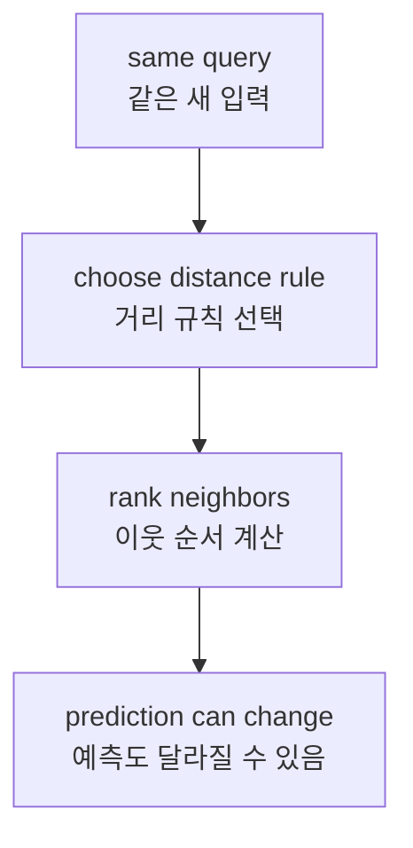
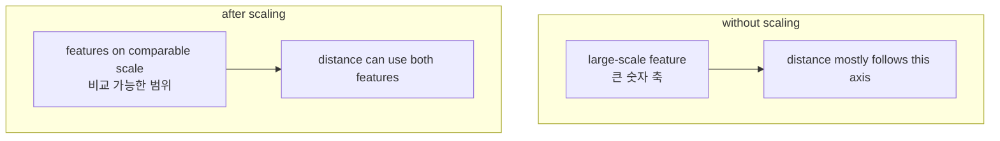
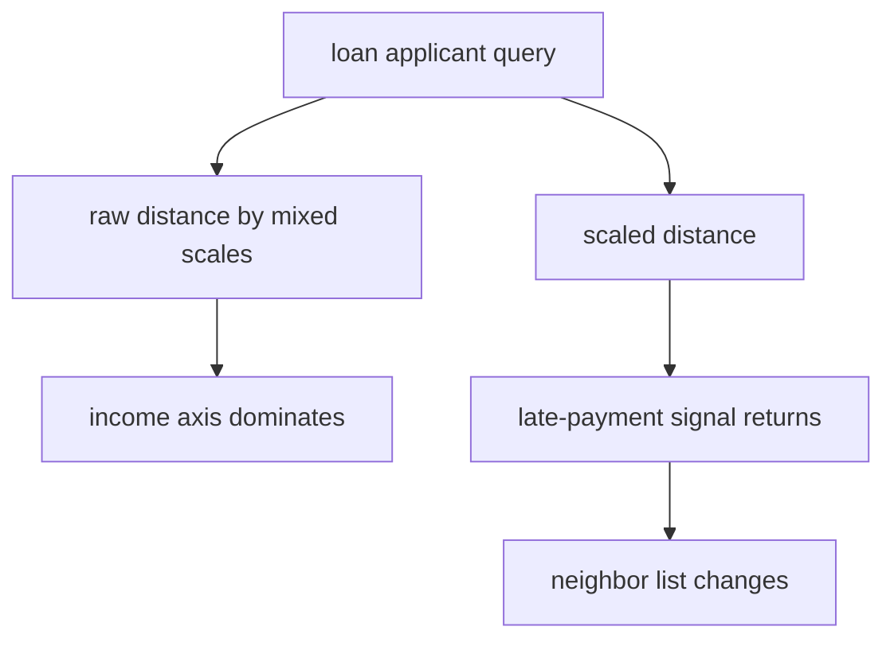

# P4-12.2 거리(distance)와 스케일(scale)

> Section ID: `P4-12.2`
> Version: `v2026.07.10`

P4-12.1에서 k-NN(k-nearest neighbors)은 `가까운 사례를 보고 판단하는 모델`이라고 했습니다. 그런데 여기서 가장 중요한 단어는 사실 `가깝다`입니다.

가까움은 정확히 무엇을 뜻하는가?

이 질문을 빼고 k-NN을 이해하면, 모델을 이해한 것이 아니라 결과만 본 셈이 됩니다. k-NN에서는 `무엇을 기준으로 가까움을 계산하는가`가 모델의 일부이기 때문입니다.

## 이 절의 범위

이 절은 다음 질문에 답합니다.

- 거리(distance)는 k-NN에서 어떤 역할을 하는가?
- 거리 함수가 바뀌면 이웃 순서와 예측이 달라질 수 있는가?
- 스케일(scale)은 왜 거리 계산을 왜곡할 수 있는가?
- 표준화(standardization)는 k-NN 해석에서 무엇을 바꾸는가?

이 절은 다음 내용은 깊게 다루지 않습니다.

- 모든 거리 함수(metric)의 수학적 성질 비교
- 전처리(preprocessing)의 전체 체계
- 고차원 공간의 거리 집중 이론

전처리 자체의 목적과 종류는 `P4-7.2 전처리(preprocessing)`를 기준 설명 위치로 유지합니다. 여기서는 `왜 k-NN에서 거리와 스케일이 판단을 바꾸는가`에만 집중합니다.

## 이 절의 목표

- 거리 함수가 `모델 바깥 설정`이 아니라 `판단 규칙 일부`라는 점을 설명할 수 있습니다.
- 거리 함수가 바뀌면 이웃 순서와 예측이 달라질 수 있음을 설명할 수 있습니다.
- 특징의 단위(scale)가 다르면 큰 축이 거리를 지배할 수 있다는 점을 설명할 수 있습니다.
- 표준화가 `숫자를 보기 좋게 만드는 일`이 아니라 `비교 기준을 다시 맞추는 일`이라는 점을 설명할 수 있습니다.

## 주요 학습내용

### 거리(distance)는 모델의 판단 규칙이다

k-NN은 새 입력과 기존 데이터 사이의 거리를 계산한 뒤, 가장 가까운 이웃을 찾습니다. 따라서 거리 함수는 단순 계산 도구가 아니라, `누가 이웃으로 뽑힐지`를 정하는 규칙입니다.

- 유클리드 거리(Euclidean distance): 직선거리처럼 읽는 방법
- 맨해튼 거리(Manhattan distance): 축 방향 이동량을 더하는 방법

같은 query라도 거리 규칙이 바뀌면, 이웃 순서가 달라지고 예측도 달라질 수 있습니다.



핵심은 이 문장입니다.

`거리 함수는 입력을 해석하는 관점의 일부다.`

### 거리 함수가 달라지면 이웃 순서가 달라질 수 있다

예를 들어 query와 두 후보 점이 다음과 같다고 해 봅시다.

| 대상 | 좌표 |
| --- | --- |
| query | (0, 0) |
| 점 A | (3, 0) |
| 점 B | (2, 2) |

유클리드 거리로 보면:

- query와 A의 거리 = 3
- query와 B의 거리 = 약 2.83

즉, B가 더 가깝습니다.

하지만 맨해튼 거리로 보면:

- query와 A의 거리 = 3
- query와 B의 거리 = 4

이번에는 A가 더 가깝습니다.

이 예시는 `거리 규칙 변화 -> 이웃 순서 변화`를 보여 줍니다. 실제 k-NN에서는 이웃 순서가 바뀌면 다수결에 들어오는 label도 달라질 수 있고, 그러면 최종 예측도 달라질 수 있습니다.

### 스케일(scale)은 왜 거리 계산을 왜곡하는가

거리 함수만큼 중요한 것이 스케일입니다. 두 특징이 모두 숫자라고 해서 거리 계산에서 같은 무게로 읽히는 것은 아닙니다.

예를 들어 두 특징이 다음과 같다고 합시다.

- 연 소득(annual income): 수백만에서 수천만
- 연체 횟수(late payments): 0회, 1회, 2회, 7회

둘 다 중요한 정보일 수 있습니다. 하지만 숫자 범위를 그대로 두면 연 소득 쪽 차이가 훨씬 크게 보입니다. 그러면 거리 계산은 `누가 연체가 비슷한가`보다 `누가 소득 숫자가 비슷한가`를 더 강하게 묻게 됩니다.

이때 구분해서 볼 것이 두 가지입니다.

- 단위 차이: 원, 초, 회수처럼 애초에 숫자 크기 체계가 다를 수 있습니다.
- 분산 차이: 같은 숫자형 특징이라도 어떤 축은 값 퍼짐이 훨씬 클 수 있습니다.

둘 다 결국 `큰 축이 거리를 지배한다`는 비슷한 문제로 이어질 수 있습니다.



### 표준화(standardization)는 무엇을 바꾸는가

표준화는 숫자를 예쁘게 만드는 장식이 아닙니다. 더 정확히 말하면, `각 특징이 거리 계산에 끼치는 영향의 균형`을 다시 맞추는 일입니다.

대표적으로는 다음 순서로 이해하면 충분합니다.

- 각 특징에서 평균(mean)을 뺍니다.
- 각 특징을 표준편차(standard deviation)로 나눕니다.
- 그러면 큰 단위와 작은 단위를 더 비교 가능한 범위로 옮길 수 있습니다.

즉, 표준화는 `무시되던 특징을 다시 비교에 올리는 일`이라고 볼 수 있습니다.

다만 이것이 `항상 성능을 올린다`는 뜻은 아닙니다. 다시 반영된 특징이 유익한 정보일 수도 있지만, 반대로 잡음(noise)일 수도 있기 때문입니다.

## 사례 및 예시

### 사례 1. 소득이 큰 숫자라서 연체 기록이 가려지는 대출 위험 분류

대출 심사 보조 모델이 새 신청자를 `안전`과 `위험`으로 나누려 합니다. 사람이 먼저 보던 기준은 `연 소득`, `연체 횟수`, `기존 대출 규모`, `상환 기록` 같은 신호였습니다.

문제는 이 칼럼들의 단위가 크게 다르다는 점입니다. 연 소득은 수백만에서 수천만 단위 숫자이고, 연체 횟수는 0회에서 몇 회 수준입니다. 이 상태로 k-NN 거리를 계산하면, 연체 횟수는 실제로 중요해도 소득 차이에 묻혀 버릴 수 있습니다.



이 사례가 보여 주는 핵심은 다음과 같습니다.

- 거리와 스케일은 전처리 바깥의 사소한 선택이 아니라 판단 규칙 일부입니다.
- 데이터가 그대로여도 표현 방식이 바뀌면 `가까운 사람` 자체가 달라질 수 있습니다.
- 따라서 스케일 조정 전후를 비교할 때는 `점수`보다 `어떤 이웃이 들어오고 나갔는가`를 먼저 읽어야 합니다.

## 연습 및 예제

### Python 예제로 원본 거리와 스케일 조정 후 거리를 비교해 보기

- 문제 상황: 새 고객이 `안전(safe)` 쪽에 가까운지, `위험(risky)` 쪽에 가까운지 봅니다.
- 입력(input): 연 소득, 연체 횟수
- 정답(label): `safe` / `risky`
- 확인할 개념:
  - 원본 숫자에서는 큰 단위의 소득이 거리를 지배할 수 있습니다.
  - 표준화 후에는 작은 축의 정보가 다시 살아날 수 있습니다.
  - 따라서 같은 query라도 가까운 이웃 순서가 바뀔 수 있습니다.

읽는 순서는 다음처럼 잡으면 됩니다.

1. 원본 거리에서 어떤 그룹이 더 가깝게 보이는지 본다.
2. 표준화 후 어떤 이웃이 새로 가까워졌는지 본다.
3. 차이가 생겼다면 `모델이 바뀐 것`이 아니라 `가까움의 계산 기준`이 바뀐 것인지 먼저 해석한다.

```python
from math import sqrt
from collections import Counter

train = [
    ((1800000, 1), "safe"),
    ((2200000, 0), "safe"),
    ((9000000, 7), "risky"),
    ((9500000, 8), "risky"),
]

query = (6000000, 0)

def euclidean(a, b):
    return sqrt(sum((x - y) ** 2 for x, y in zip(a, b)))

def zscore_from_train(train_points):
    cols = list(zip(*train_points))
    means = [sum(col) / len(col) for col in cols]
    stds = []
    for i, col in enumerate(cols):
        m = means[i]
        var = sum((x - m) ** 2 for x in col) / len(col)
        stds.append(var ** 0.5)
    return means, stds

def scale(point, means, stds):
    return tuple((x - m) / s for x, m, s in zip(point, means, stds))

def ranked_neighbors(points_with_labels, query_point):
    ranked = []
    for point, label in points_with_labels:
        ranked.append((euclidean(point, query_point), point, label))
    return sorted(ranked, key=lambda x: x[0])

def majority_vote(labels):
    return Counter(labels).most_common(1)[0][0]

train_points = [point for point, _ in train]
means, stds = zscore_from_train(train_points)

print("raw distances")
raw_ranked = ranked_neighbors(train, query)
for distance, point, label in raw_ranked:
    print(point, label, round(distance, 3))

print()

scaled_query = scale(query, means, stds)
print("scaled distances")
scaled_ranked = []
for point, label in train:
    scaled_point = scale(point, means, stds)
    scaled_ranked.append((euclidean(scaled_point, scaled_query), point, label, scaled_point))
scaled_ranked.sort(key=lambda x: x[0])

for distance, point, label, scaled_point in scaled_ranked:
    print(
        point,
        label,
        "scaled =", tuple(round(v, 3) for v in scaled_point),
        "distance =", round(distance, 3),
    )

print()
print("top-2 neighbors before scaling =", [(point, label) for _, point, label in raw_ranked[:2]])
print("top-2 neighbors after scaling =", [(point, label) for _, point, label, _ in scaled_ranked[:2]])
raw_top3_labels = [label for _, _, label in raw_ranked[:3]]
scaled_top3_labels = [label for _, _, label, _ in scaled_ranked[:3]]
print("k=3 labels before scaling =", raw_top3_labels)
print("k=3 labels after scaling =", scaled_top3_labels)
print("k=3 prediction before scaling =", majority_vote(raw_top3_labels))
print("k=3 prediction after scaling =", majority_vote(scaled_top3_labels))
```

실행 결과 예시는 다음과 같습니다.

```text
raw distances
(9000000, 7) risky 3000000.0
(9500000, 8) risky 3500000.0
(2200000, 0) safe 3800000.0
(1800000, 1) safe 4200000.0

scaled distances
(2200000, 0) safe scaled = (-0.943, -1.131) distance = 1.046
(1800000, 1) safe scaled = (-1.053, -0.849) distance = 1.305
(9000000, 7) risky scaled = (0.929, 0.849) distance = 1.897
(9500000, 8) risky scaled = (1.067, 1.131) distance = 2.179

top-2 neighbors before scaling = [((9000000, 7), 'risky'), ((9500000, 8), 'risky')]
top-2 neighbors after scaling = [((2200000, 0), 'safe'), ((1800000, 1), 'safe')]
k=3 labels before scaling = ['risky', 'risky', 'safe']
k=3 labels after scaling = ['safe', 'safe', 'risky']
k=3 prediction before scaling = risky
k=3 prediction after scaling = safe
```

이 출력에서 먼저 잡아야 할 문장은 다음입니다.

`k-NN의 결과는 데이터만이 아니라, 데이터 표현 방식에도 의존한다.`

원본 거리에서는 `risky` 그룹이 먼저 올라오지만, 표준화 뒤에는 `safe` 그룹이 먼저 올라옵니다. 그리고 `k=3`으로 읽어 보면, 원본 거리에서는 `risky, risky, safe`라서 최종 예측도 `risky`가 되고, 표준화 뒤에는 `safe, safe, risky`라서 최종 예측이 `safe`로 바뀝니다. 따라서 이 예제는 단순 점수보다 `이웃 순서 자체가 바뀌었고, 그 변화가 k-NN 판단까지 바꿀 수 있다`는 사실을 먼저 읽게 해야 합니다.

### 값 하나 더 바꿔 보기: 같은 스케일에서 연체 횟수만 늘리면 이웃 순서는 어떻게 다시 섞이는가

이번에는 표준화 방식은 그대로 두고, query의 연체 횟수만 `0`에서 `2`로 바꿔 봅니다.

```python
from math import sqrt

train = [
    ((1800000, 1), "safe"),
    ((2200000, 0), "safe"),
    ((9000000, 7), "risky"),
    ((9500000, 8), "risky"),
]

def euclidean(a, b):
    return sqrt(sum((x - y) ** 2 for x, y in zip(a, b)))

def zscore_from_train(train_points):
    cols = list(zip(*train_points))
    means = [sum(col) / len(col) for col in cols]
    stds = []
    for i, col in enumerate(cols):
        m = means[i]
        var = sum((x - m) ** 2 for x in col) / len(col)
        stds.append(var ** 0.5)
    return means, stds

def scale(point, means, stds):
    return tuple((x - m) / s for x, m, s in zip(point, means, stds))

def ranked_neighbors(points_with_labels, query_point):
    ranked = []
    for point, label in points_with_labels:
        ranked.append((euclidean(point, query_point), point, label))
    return sorted(ranked, key=lambda x: x[0])

train_points = [point for point, _ in train]
means, stds = zscore_from_train(train_points)

scaled_query_0 = scale((6000000, 0), means, stds)
scaled_query_2 = scale((6000000, 2), means, stds)

ranked_0 = ranked_neighbors([(scale(point, means, stds), label) for point, label in train], scaled_query_0)
ranked_2 = ranked_neighbors([(scale(point, means, stds), label) for point, label in train], scaled_query_2)

print("top-2 after scaling, late_payment=0 :", [(label, round(distance, 3)) for distance, _, label in ranked_0[:2]])
print("top-2 after scaling, late_payment=2 :", [(label, round(distance, 3)) for distance, _, label in ranked_2[:2]])
```

실행 결과 예시는 다음과 같습니다.

```text
top-2 after scaling, late_payment=0 : [('safe', 1.046), ('safe', 1.305)]
top-2 after scaling, late_payment=2 : [('safe', 0.975), ('risky', 1.184)]
```

### 무엇이 유지되고 무엇이 바뀌었는가

- 유지된 점: 스케일 조정 뒤에는 여전히 소득 하나만이 아니라 `연체 횟수` 축도 실제 거리 계산에 참여합니다.
- 바뀐 점: query의 연체 횟수를 조금만 올려도 두 번째 이웃이 `safe`에서 `risky`로 바뀌기 시작합니다.
- 먼저 남길 판단: 표준화는 한 번 하고 끝나는 기술 체크가 아니라, `어떤 특징 변화가 이웃 구성과 예측을 얼마나 민감하게 흔드는가`를 다시 보는 출발점입니다.

### 이 연습이 Part 4 목표를 어떻게 회수하는가

이 연습은 k-NN을 `가까운 사례를 가져오는 모델`에서 `표현과 입력 변화에 민감한 비교 규칙`으로 다시 읽게 만듭니다. Part 4의 목표는 k 값을 외우는 것이 아니라, 같은 query라도 표현 방식과 특징값이 조금 달라지면 어떤 이웃이 들어오고 빠지는지 설명할 수 있게 되는 데 있습니다. 즉, 반복 변화 실습의 학습효과는 `예측이 바뀌었다`보다 `무엇을 바꾸자 비교 기준이 다시 섞였는가`를 말할 수 있을 때 생깁니다.

| 공통 기록 언어 | 이번 연습에서 바로 남길 내용 |
| --- | --- |
| 보인 구조 | 스케일을 맞춘 뒤에는 작은 특징 변화도 이웃 구성과 최종 판단을 다시 섞을 수 있었다 |
| 해석 경계 | 한 query에서 이웃이 바뀌었다는 사실만으로 특정 특징이 항상 더 중요하다고 단정할 수는 없다 |
| 다음 질문 | k 값을 바꾸면 이웃 교체가 최종 다수결까지 이어지는지, 다른 query에서도 같은 민감도가 반복되는지 다시 볼 것인가 |

## 이 절에서 기억할 관점

- 거리 함수는 모델 바깥의 장식이 아니라 이웃 순서를 정하는 규칙입니다.
- 거리 함수가 바뀌면 이웃 순서와 예측이 달라질 수 있습니다.
- 큰 축이 거리를 지배하면 중요한 작은 축의 정보가 묻힐 수 있습니다.
- 표준화는 비교 기준의 균형을 다시 맞추는 일입니다.

## 짧은 점검

- 거리 함수가 왜 판단 규칙 일부인지 설명할 수 있는가?
- 스케일 조정 전후에 어떤 이웃이 들어오고 나갔는지 같은 query 기준으로 비교하고 있는가?
- 표준화 후 차이가 보여도 그것만으로 원인을 확정하지 않고 있는가?

## 출처와 참고 자료

- scikit-learn, *Nearest Neighbors*, scikit-learn User Guide, 확인 날짜: 2026-06-27. <https://scikit-learn.org/stable/modules/neighbors.html>{: target="_blank" rel="noopener noreferrer" }
- scikit-learn, *Importance of Feature Scaling*, scikit-learn Examples, 확인 날짜: 2026-06-27. <https://scikit-learn.org/stable/auto_examples/preprocessing/plot_scaling_importance.html>{: target="_blank" rel="noopener noreferrer" }
