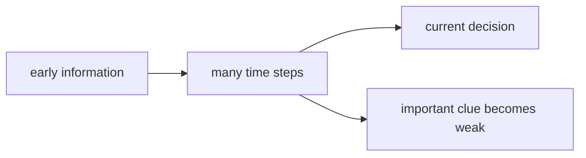

# P4-12.2 장기 의존성(long-term dependency)

P4-12.1에서는 RNN, LSTM, GRU가 순차 데이터(sequence data)를 다루기 위해 등장한 구조라고 설명했습니다. 여기서 바로 다음 질문이 생깁니다.

왜 순차 모델은 오래전 정보를 끝까지 유지하기 어려웠고, 그것이 왜 큰 문제였는가?

이 질문에 답하는 개념이 장기 의존성(long-term dependency)입니다.

장기 의존성은 현재 판단에 오래전 정보가 중요한데도, 모델이 그 정보를 충분히 오래 유지하거나 전달하지 못하는 문제를 뜻한다.

## 이 절의 범위

이 절은 다음 질문에 답합니다.

- 장기 의존성은 무엇을 뜻하는가?
- 왜 기본 RNN에서는 오래전 정보가 약해지기 쉬운가?
- 이 문제가 실제 문장, 음성, 시계열에서 어떻게 드러나는가?
- LSTM, GRU, 그리고 나중의 attention이 왜 이 문제와 연결되는가?

이 절은 다음 내용은 깊게 다루지 않습니다.

- vanishing gradient 수식의 엄밀한 전개
- BPTT(backpropagation through time)의 상세 유도
- attention 메커니즘의 구현 세부

attention 자체는 P4-13.1, P4-13.2에서 이어서 다루고, Transformer로의 확장은 P4-14.1, P4-14.2에서 다시 연결합니다. vanishing gradient 수식과 BPTT의 상세 유도는 이 책의 현재 본편 범위 밖에 둡니다.

## 이 절의 목표

- 장기 의존성을 `오래전 정보가 필요한데 잘 유지되지 않는 문제`로 설명할 수 있습니다.
- 기본 RNN이 긴 문맥을 다루기 어려운 이유를 입문 수준에서 말할 수 있습니다.
- LSTM과 GRU가 왜 등장했는지 더 분명히 연결할 수 있습니다.
- attention이 왜 자연스러운 다음 주제가 되는지 설명할 수 있습니다.

## 장기 의존성은 무엇을 뜻하나

순차 데이터에서는 현재 위치의 의미가 훨씬 앞에 있던 정보에 달려 있을 수 있습니다.

예를 들어 문장에서:

- 주어가 앞에 나오고
- 동사가 한참 뒤에 나오며
- 부정 표현이 뒤 의미를 바꿀 수도 있습니다

이때 현재 단어를 해석하려면, 오래전 단서를 기억하고 있어야 할 수 있습니다.

다음처럼 이해하면 충분합니다.

`가까운 정보만으로는 부족하고, 한참 앞의 정보까지 이어서 봐야 하는 상황이 장기 의존성 문제를 만든다.`

## 왜 기본 RNN은 오래전 정보를 놓치기 쉬운가

RNN은 각 step에서 이전 상태를 이어받지만, 그 상태는 계속 새 입력과 섞이며 갱신됩니다. 시점이 길어질수록 오래전 정보는 점점 희미해질 수 있습니다.

다음 비유가 도움이 됩니다.

- 메모를 계속 새로 덧쓰는 작은 칠판이 있다고 생각해 봅니다
- 짧은 정보는 남기기 쉽지만
- 오래전 중요한 문장을 계속 보존하기는 어렵습니다

즉, RNN의 핵심 아이디어는 좋지만, 긴 시퀀스에서는 `무엇을 오래 남길지`를 정교하게 관리하기 어렵다는 한계가 있었습니다.

## 이 문제가 실제로는 어떤 식으로 보이나

### 사례 1. 긴 문장 해석

문장의 앞부분에 나온 단서가 뒤쪽 의미를 결정할 수 있습니다. 그런데 모델이 그 앞 단서를 뒤까지 잘 유지하지 못하면, 현재 단어를 잘못 해석할 수 있습니다.

### 사례 2. 번역

번역에서는 문장 초반의 주어, 시제, 문맥 단서가 문장 후반 번역에 영향을 줄 수 있습니다. 오래전 정보를 유지하는 능력이 부족하면 번역 품질이 흔들릴 수 있습니다.

### 사례 3. 시계열 이상 탐지

현재 센서 상태가 몇 초 전이 아니라, 더 오래전 흐름과 연결될 수도 있습니다. 모델이 긴 시간 범위의 단서를 유지하지 못하면 이상 징후를 놓칠 수 있습니다.

## 왜 이것이 단순한 성능 문제가 아닌가

장기 의존성은 단순히 `조금 덜 정확하다` 정도의 문제가 아니라, 순차 구조를 해석하는 방식 자체를 바꿉니다.

왜냐하면:

- 어떤 문제는 가까운 정보만 보면 충분하지만
- 어떤 문제는 오래전 정보가 핵심 단서이기 때문입니다

즉, 장기 의존성 문제는 모델이 `얼마나 멀리까지 문맥을 유지할 수 있는가`에 대한 질문입니다.

## 그래서 LSTM과 GRU는 무엇을 하려 했나

P4-12.1에서 본 것처럼 LSTM과 GRU는 기본 RNN보다 더 잘 기억을 관리하려는 구조입니다.

다음 정도로 이해하면 충분합니다.

- 어떤 정보는 남기고
- 어떤 정보는 버리고
- 현재 입력을 얼마나 반영할지

를 더 세밀하게 조절해, 장기 의존성을 더 잘 다루려는 시도입니다.

즉, LSTM과 GRU는 `오래 기억하고 싶은 정보를 더 오래 살아남게 하려는 구조`라고 볼 수 있습니다.

## 그런데 왜 attention이 다시 등장했나

LSTM과 GRU는 장기 의존성 문제를 완화했지만, 여전히 순차 상태를 차례대로 전달하는 구조의 한계가 남아 있었습니다. 바로 이 지점에서 attention이 중요해집니다.

attention의 핵심 직관은 다음과 같이 연결할 수 있습니다.

`굳이 오래전 정보를 상태에만 희미하게 담아 두지 말고, 현재 위치가 필요할 때 과거의 중요한 위치를 더 직접적으로 참고하자.`

즉, attention은 장기 의존성 문제에 대한 더 직접적인 응답처럼 읽을 수 있습니다.

## 이를 아주 단순하게 그리면



이 도식은 긴 시간 흐름 속에서 중요한 단서가 약해질 수 있다는 점을 상징적으로 보여 줍니다.

## 작은 Python 예제로 상태 희석 직관 보기

이번 예제의 목표는 순차 상태가 반복적으로 갱신되며 오래전 정보가 점점 약해질 수 있다는 감각을 보는 것입니다.

입력:

- 짧은 시퀀스 하나
- 이전 상태를 일부만 남기고 현재 입력을 더하는 단순 상태 업데이트

출력:

- 각 step에서 상태값

```python
sequence = [10.0, 0.0, 0.0, 0.0, 1.0]
state = 0.0

print("initial state =", state)
for step, x in enumerate(sequence, start=1):
    state = 0.5 * state + x
    print(f"step {step}: input = {x}, state = {round(state, 3)}")
```

실행 결과 예시는 다음처럼 읽을 수 있습니다.

```text
initial state = 0.0
step 1: input = 10.0, state = 10.0
step 2: input = 0.0, state = 5.0
step 3: input = 0.0, state = 2.5
step 4: input = 0.0, state = 1.25
step 5: input = 1.0, state = 1.625
```

이 예제에서 읽어야 할 핵심은 다음입니다.

- step 1의 큰 정보 `10.0`이 뒤로 갈수록 점점 약해지고
- 마지막 단계에서는 최근 입력 `1.0`과 섞여 더 희미해질 수 있습니다

이것이 실제 RNN 전체를 수학적으로 설명한 것은 아니지만, 장기 의존성 문제의 직관은 잘 보여 줍니다.

## 역사와 커리큘럼 관점

장기 의존성 문제는 순차 모델링 역사에서 매우 중요한 전환점입니다. 왜냐하면 이 문제를 이해해야:

- 왜 basic RNN만으로는 부족했는지
- 왜 LSTM과 GRU가 강한 영향력을 가졌는지
- 왜 결국 attention과 Transformer가 큰 전환을 만들었는지

를 하나의 흐름으로 설명할 수 있기 때문입니다.

커리큘럼 관점에서도 이 절은 RNN 장의 핵심 마무리입니다. 단순히 구조 이름을 외우는 대신, `무엇이 문제였기 때문에 다음 구조가 나왔는가`를 보여 주어야 이후 Part 5의 LLM 설명이 매끄럽습니다.

## 다음 절과의 연결

여기까지 오면 다음 질문이 남습니다.

- 그렇다면 현재 위치가 과거의 어떤 정보를 더 강하게 참고해야 하는지는 어떻게 정할 수 있는가?
- 필요한 위치를 더 직접적으로 보는 방식은 무엇인가?

이 질문은 바로 P4-13.1 Attention의 직관으로 이어집니다.

## 이 절에서 기억할 관점

- 장기 의존성은 오래전 정보가 중요한데도 충분히 유지되지 않는 문제입니다.
- 기본 RNN에서는 시간이 길어질수록 오래전 단서가 약해지기 쉽습니다.
- LSTM과 GRU는 이 문제를 더 잘 다루려는 구조입니다.
- attention은 장기 의존성 문제에 더 직접적으로 응답하는 다음 발상입니다.

## 체크리스트

- 장기 의존성을 입문 수준에서 설명할 수 있는가?
- 왜 basic RNN에서 오래전 정보가 약해질 수 있는지 말할 수 있는가?
- LSTM/GRU와 attention이 왜 이 문제와 연결되는지 설명할 수 있는가?
- 다음 절의 attention으로 왜 자연스럽게 이어지는지 말할 수 있는가?

## 출처와 참고 자료

- Sepp Hochreiter, Jürgen Schmidhuber, `Long Short-Term Memory`, Neural Computation, 1997, 확인 날짜: 2026-06-29.
- Yoshua Bengio, Patrice Simard, Paolo Frasconi, `Learning Long-Term Dependencies with Gradient Descent is Difficult`, IEEE Transactions on Neural Networks, 1994, 확인 날짜: 2026-06-29.
- Ian Goodfellow, Yoshua Bengio, Aaron Courville, `Deep Learning`, MIT Press, 2016, 확인 날짜: 2026-06-29. [https://www.deeplearningbook.org/](https://www.deeplearningbook.org/){: target="_blank" rel="noopener noreferrer" }
