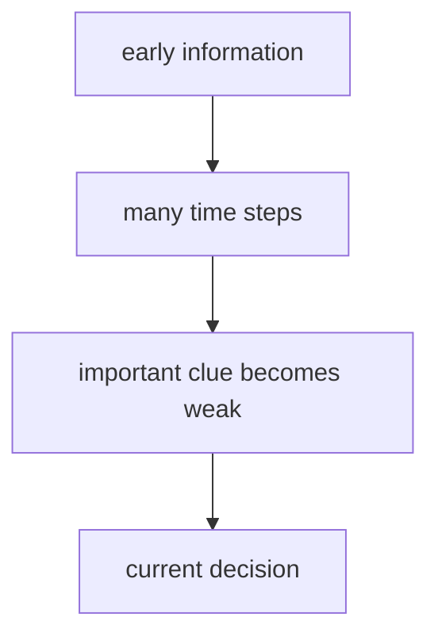

# P4-12.2 장기 의존성(long-term dependency)

P4-12.1에서는 RNN, LSTM, GRU가 순차 데이터(sequence data)를 다루기 위해 등장한 구조라고 설명했습니다. 여기서 바로 다음 질문이 생깁니다.

왜 순차 모델은 오래전 정보를 끝까지 유지하기 어려웠고, 그것이 왜 큰 문제였는가?

이 질문에 답하는 개념이 장기 의존성(long-term dependency)입니다.

장기 의존성은 현재 판단에 오래전 정보가 중요한데도, 모델이 그 정보를 충분히 오래 유지하거나 전달하지 못하는 문제를 뜻한다.

## 이 절의 범위

이 절은 다음 질문에 답합니다.

- 장기 의존성은 무엇을 뜻하는가?
- 왜 기본 RNN에서는 오래전 정보가 약해지기 쉬운가?
- 이 문제가 실제 문장, 음성, 시계열에서 어떻게 드러나는가?
- LSTM, GRU, 그리고 나중의 attention이 왜 이 문제와 연결되는가?

이 절에서는 다음 내용을 깊게 다루지 않습니다.

- vanishing gradient 수식의 엄밀한 전개
- BPTT(backpropagation through time)의 상세 유도
- attention 메커니즘의 구현 세부

attention 자체는 P4-13.1, P4-13.2에서 이어서 다루고, Transformer로의 확장은 P4-14.1, P4-14.2에서 다시 연결합니다. vanishing gradient 수식과 BPTT의 상세 유도는 이 책의 현재 본편 범위 밖에 둡니다.

## 이 절의 목표

- 장기 의존성을 `오래전 정보가 필요한데 잘 유지되지 않는 문제`로 설명할 수 있습니다.
- 기본 RNN이 긴 문맥을 다루기 어려운 이유를 입문 수준에서 말할 수 있습니다.
- LSTM과 GRU가 왜 등장했는지 더 분명히 연결할 수 있습니다.
- attention이 왜 자연스러운 다음 주제가 되는지 설명할 수 있습니다.

## 장기 의존성은 무엇을 뜻하나

순차 데이터에서는 현재 위치의 의미가 훨씬 앞에 있던 정보에 달려 있을 수 있습니다.

예를 들어 문장에서:

- 주어가 앞에 나오고
- 동사가 한참 뒤에 나오며
- 부정 표현이 뒤 의미를 바꿀 수도 있습니다

이때 현재 단어를 해석하려면, 오래전 단서를 기억하고 있어야 할 수 있습니다.

다음처럼 이해하면 충분합니다.

`가까운 정보만으로는 부족하고, 한참 앞의 정보까지 이어서 봐야 하는 상황이 장기 의존성 문제를 만든다.`

## 왜 기본 RNN은 오래전 정보를 놓치기 쉬운가

RNN은 각 step에서 이전 상태를 이어받지만, 그 상태는 계속 새 입력과 섞이며 갱신됩니다. 시점이 길어질수록 오래전 정보는 점점 희미해질 수 있습니다.

다음 비유가 도움이 됩니다.

- 메모를 계속 새로 덧쓰는 작은 칠판이 있다고 생각해 봅니다
- 짧은 정보는 남기기 쉽지만
- 오래전 중요한 문장을 계속 보존하기는 어렵습니다

즉, RNN의 핵심 아이디어는 좋지만, 긴 시퀀스에서는 `무엇을 오래 남길지`를 정교하게 관리하기 어렵다는 한계가 있었습니다.

## 왜 이것이 단순한 성능 문제가 아닌가

장기 의존성은 단순히 `조금 덜 정확하다` 정도의 문제가 아니라, 순차 구조를 해석하는 방식 자체를 바꿉니다.

왜냐하면:

- 어떤 문제는 가까운 정보만 보면 충분하지만
- 어떤 문제는 오래전 정보가 핵심 단서이기 때문입니다

즉, 장기 의존성 문제는 모델이 `얼마나 멀리까지 문맥을 유지할 수 있는가`에 대한 질문입니다.

독자는 여기서 `가까운 단서`와 `먼 단서`를 나눠 보면 이해가 빨라집니다.

| 단서 유형 | 예 |
| --- | --- |
| 가까운 단서 | 바로 앞 단어, 직전 몇 초의 센서 변화 |
| 먼 단서 | 문장 맨 앞 주어, 오래전 시제 정보, 훨씬 앞쪽 이상 징후 |

장기 의존성은 주로 두 번째 유형이 중요할 때 드러납니다.

## 그래서 LSTM과 GRU는 무엇을 하려 했나

P4-12.1에서 본 것처럼 LSTM과 GRU는 기본 RNN보다 더 잘 기억을 관리하려는 구조입니다.

다음 정도로 이해하면 충분합니다.

- 어떤 정보는 남기고
- 어떤 정보는 버리고
- 현재 입력을 얼마나 반영할지

를 더 세밀하게 조절해, 장기 의존성을 더 잘 다루려는 시도입니다.

즉, LSTM과 GRU는 `오래 기억하고 싶은 정보를 더 오래 살아남게 하려는 구조`라고 볼 수 있습니다.

## 그런데 왜 attention이 다시 등장했나

LSTM과 GRU는 장기 의존성 문제를 완화했지만, 여전히 순차 상태를 차례대로 전달하는 구조의 한계가 남아 있었습니다. 바로 이 지점에서 attention이 중요해집니다.

attention의 핵심 직관은 다음과 같이 연결할 수 있습니다.

`굳이 오래전 정보를 상태에만 희미하게 담아 두지 말고, 현재 위치가 필요할 때 과거의 중요한 위치를 더 직접적으로 참고하자.`

즉, attention은 장기 의존성 문제에 대한 더 직접적인 응답처럼 읽을 수 있습니다.

이 연결을 더 짧게 정리하면 다음과 같습니다.

| 구조 | 오래전 정보를 다루는 기본 감각 |
| --- | --- |
| basic RNN | 상태를 계속 넘기며 유지하려 한다 |
| LSTM / GRU | 무엇을 남길지 더 잘 조절한다 |
| attention | 필요한 위치를 더 직접 다시 참고한다 |

## 사례로 보기

### 사례 1. 긴 문장 해석

고객센터 문서에 `환불은 가능하지만 배송비는 제외된다`라는 문장이 앞부분에 있고, 뒤쪽 FAQ에서 `최종 환불 금액은?`을 다시 묻는 상황을 생각해 보겠습니다. 사람이 문서를 대충 읽을 때는 보통 질문 바로 근처 문장만 다시 보고 `환불 가능`만 기억한 채 답을 정리하기 쉽습니다. 그런데 실제로는 앞쪽의 `배송비는 제외` 조건이 핵심이라, 그 문장을 놓치면 환불 금액을 과하게 안내하는 오답이 나올 수 있습니다. basic RNN은 긴 문장을 따라가며 이런 앞쪽 조건을 상태 안에 계속 보존해야 하므로, 뒤로 갈수록 중요한 단서가 흐려질 수 있습니다. attention 관점에서는 현재 답을 만들 때 앞부분의 `배송비는 제외` 위치를 더 직접 참고할 수 있어, 오래전 단서를 다시 끌어오기 쉬워집니다. 그래서 독자가 확인해야 할 결과는 최종 답변에 `환불 가능`만 남는 것이 아니라, `배송비 제외` 조건까지 함께 반영되는가입니다.

### 사례 2. 번역

긴 번역 문장에서 주어가 앞에 있고 동사가 한참 뒤에 나오면, 중간에 수식어가 많이 끼어들 수 있습니다. 사람이 손으로 번역할 때도 보통은 `지금 보고 있는 단어 주변`을 먼저 읽다가, 주어와 동사의 연결이 멀어지면 문장 앞을 다시 확인하게 됩니다. 예를 들어 문장 초반의 인물 주어가 뒤쪽 동사의 시제와 수를 결정하는데, 중간 설명이 길어지면 그 연결이 쉽게 흐려질 수 있습니다. 순차 상태에만 의존하면 모델은 이 `앞으로 다시 돌아가 확인하는 행동`을 직접 하기가 어렵고, 앞의 핵심 단서를 뒤 시점까지 안정적으로 유지하지 못할 수 있습니다. attention은 현재 번역 중인 위치가 문장 앞의 중요한 단어를 다시 바라보게 만들어, 멀리 떨어진 대응 관계를 더 직접 다루는 데 도움을 줍니다. 그래서 확인 가능한 결과는 번역 끝부분에서도 앞 주어의 수, 시제, 역할이 어긋나지 않고 유지되는가입니다.

### 사례 3. 시계열 이상 탐지

설비 센서 데이터에서 평소에는 안정적이던 값이 한참 뒤에 급격히 흔들렸는데, 그 원인이 초반 설정 단계의 작은 이상 신호에 있을 수 있습니다. 사람이 단순 규칙으로 보려 하면 보통 `최근 10초 평균`이나 `현재 임계치 초과 여부`처럼 가까운 구간만 먼저 확인합니다. 하지만 실제 고장은 초반의 작은 흔들림과 뒤쪽의 큰 이상이 이어진 결과일 수 있어, 최근 값만 보면 원인을 놓치기 쉽습니다. 예를 들어 초반의 작은 진동 증가가 한동안 누적되다가 뒤늦게 큰 온도 상승으로 이어졌다면, 마지막 구간만 봐서는 왜 고장이 났는지 설명하기 어렵습니다. 상태가 여러 step을 지나며 희석되면 모델도 초반 신호를 뒤 판단에 약하게 반영할 수 있습니다. 이때 필요한 시점끼리 더 직접 연결해 보는 관점은, 왜 장기 의존성과 attention 문제가 함께 언급되는지 이해하는 데 도움이 됩니다. 그래서 이 장면에서 확인해야 할 결과는 마지막 온도 상승만 보는 경보와, 초반 이상 신호까지 함께 반영한 경보가 서로 다른 판단을 내릴 수 있다는 점입니다.

## 이를 아주 단순하게 그리면



이 도식에서 확인해야 할 결과는 오래전 입력의 중요한 단서가 상태 갱신을 거치며 현재 결정 단계에 도달할수록 점점 약해질 수 있다는 점입니다.

## 작은 Python 예제로 상태 희석 직관 보기

이번 예제의 목표는 순차 상태가 반복적으로 갱신되며 오래전 정보가 점점 약해질 수 있다는 감각을 보는 것입니다.

입력:

- 짧은 시퀀스 하나
- 이전 상태를 일부만 남기고 현재 입력을 더하는 단순 상태 업데이트

출력:

- 각 step에서 상태값

```python
sequence = [10.0, 0.0, 0.0, 0.0, 1.0]
state = 0.0

print("initial state =", state)
for step, x in enumerate(sequence, start=1):
    state = 0.5 * state + x
    print(f"step {step}: input = {x}, state = {round(state, 3)}")
```

실행 결과 예시는 다음처럼 읽을 수 있습니다.

```text
initial state = 0.0
step 1: input = 10.0, state = 10.0
step 2: input = 0.0, state = 5.0
step 3: input = 0.0, state = 2.5
step 4: input = 0.0, state = 1.25
step 5: input = 1.0, state = 1.625
```

이 예제에서 읽어야 할 핵심은 다음입니다.

- step 1의 큰 정보 `10.0`이 뒤로 갈수록 점점 약해지고
- 마지막 단계에서는 최근 입력 `1.0`과 섞여 더 희미해질 수 있습니다

그래서 이 예제에서 확인해야 할 결과는 초반의 큰 정보가 step이 지날수록 실제로 약해지고, 뒤 입력과 섞이면서 오래된 단서를 끝까지 안정적으로 유지하기 어려워지는가입니다.

## 역사와 커리큘럼 관점

장기 의존성 문제는 순차 모델링 역사에서 매우 중요한 전환점입니다. 왜냐하면 이 문제를 이해해야:

- 왜 basic RNN만으로는 부족했는지
- 왜 LSTM과 GRU가 강한 영향력을 가졌는지
- 왜 결국 attention과 Transformer가 큰 전환을 만들었는지

를 하나의 흐름으로 설명할 수 있기 때문입니다.

커리큘럼 관점에서도 이 절은 RNN 장의 핵심 마무리입니다. 단순히 구조 이름을 외우는 대신, `무엇이 문제였기 때문에 다음 구조가 나왔는가`를 보여 주어야 바로 뒤의 P4-13 attention, P4-14 Transformer, 그리고 Part 5의 P5-3 LLM 구조 설명이 매끄럽습니다.

## 다음 절과의 연결

여기까지 오면 다음 질문이 남습니다.

- 그렇다면 현재 위치가 과거의 어떤 정보를 더 강하게 참고해야 하는지는 어떻게 정할 수 있는가?
- 필요한 위치를 더 직접적으로 보는 방식은 무엇인가?

이 질문은 바로 P4-13.1 Attention의 직관으로 이어집니다.

## 이 절에서 기억할 관점

- 장기 의존성은 오래전 정보가 중요한데도 충분히 유지되지 않는 문제입니다.
- 기본 RNN에서는 시간이 길어질수록 오래전 단서가 약해지기 쉽습니다.
- LSTM과 GRU는 이 문제를 더 잘 다루려는 구조입니다.
- attention은 장기 의존성 문제에 더 직접적으로 응답하는 다음 발상입니다.

## 체크리스트

- 장기 의존성을 입문 수준에서 설명할 수 있는가?
- 왜 basic RNN에서 오래전 정보가 약해질 수 있는지 말할 수 있는가?
- LSTM/GRU와 attention이 왜 이 문제와 연결되는지 설명할 수 있는가?
- 다음 절의 attention으로 왜 자연스럽게 이어지는지 말할 수 있는가?

## 출처와 참고 자료

- Sepp Hochreiter, Jürgen Schmidhuber, `Long Short-Term Memory`, Neural Computation, 1997, 확인 날짜: 2026-06-29.
- Yoshua Bengio, Patrice Simard, Paolo Frasconi, `Learning Long-Term Dependencies with Gradient Descent is Difficult`, IEEE Transactions on Neural Networks, 1994, 확인 날짜: 2026-06-29.
- Ian Goodfellow, Yoshua Bengio, Aaron Courville, `Deep Learning`, MIT Press, 2016, 확인 날짜: 2026-06-29. [https://www.deeplearningbook.org/](https://www.deeplearningbook.org/){: target="_blank" rel="noopener noreferrer" }
