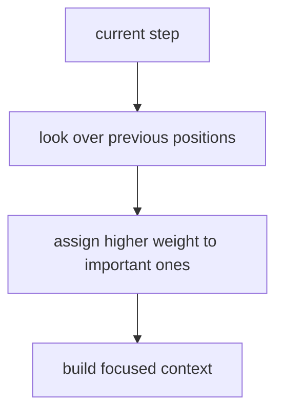

# P4-13.1 Attention의 직관

P4-12.2에서는 장기 의존성(long-term dependency) 때문에 순차 모델이 오래전 정보를 충분히 유지하기 어려울 수 있다는 점을 보았습니다. 여기서 다음 질문이 생깁니다.

현재 위치가 필요한 과거 정보를 더 직접적으로 참고하게 만들 수는 없는가?

이 질문에 대한 대표적 답이 attention입니다.

attention은 현재 계산에 정말 중요한 위치나 토큰(token)에 더 큰 비중을 두어, 필요한 정보를 더 직접적으로 참고하게 만드는 방식이다.

## 이 절의 범위

이 절은 다음 질문에 답합니다.

- attention은 어떤 문제를 해결하려는가?
- `필요한 위치를 더 강하게 본다`는 말은 무엇을 뜻하는가?
- attention은 RNN 계열과 어떻게 연결되는가?
- 왜 attention이 큰 전환점처럼 느껴졌는가?

이 절에서 먼저 닫아야 하는 핵심은 `오래 기억하려고만 애쓰기보다, 지금 필요한 위치를 다시 찾아보는 방식이 필요했다`는 점입니다.

이 절에서는 다음 내용을 깊게 다루지 않습니다.

- query, key, value 공식 전개
- multi-head attention 세부 구현
- Transformer block 내부 전체 구조

self-attention과 Transformer 연결은 다음 절과 다음 장에서 이어서 다룹니다. query, key, value와 multi-head attention의 입문적 설명은 보충학습 P4-13.3에서 회수하고, 더 깊은 수식 전개와 구현 최적화는 이 책의 현재 본편 범위 밖에 둡니다.

지금 읽는 층위는 `직접 참조 구조 층위`입니다. 앞 절의 장기 의존성이 `오래전 정보를 왜 끝까지 들고 가기 어려웠는가`를 다뤘다면, 여기서는 그 문제를 `지금 필요한 위치를 다시 찾아보는 방식`으로 어떻게 풀기 시작했는지 읽습니다. 바로 다음의 self-attention과 Transformer 절에서는 이 직접 참조 발상이 문장 전체 토큰 관계 계산으로 어떻게 확장되는지 질문이 더 커집니다.

처음 읽을 때는 attention을 Part 4 본류의 `직접 참조 손잡이`로만 잡고, 그 다음에 self-attention과 Transformer가 어떤 범위까지 이 발상을 넓히는지 같이 보면 흐름이 덜 끊깁니다.

| 지금 단계의 손잡이 | 바로 다음에 이어질 질문 | 뒤에서 본격적으로 다시 읽는 위치 |
| --- | --- | --- |
| 장기 의존성 문제 | 왜 상태 보존만으로는 먼 단서를 안정적으로 다루기 어려웠는가? | P4-12.2 |
| attention | 지금 필요한 위치를 다시 찾아 더 직접적으로 참고할 수 있는가? | P4-13.1 |
| self-attention / Transformer | 이 참조 방식을 문장 전체 토큰 관계 계산으로 넓히면 무엇이 달라지는가? | P4-13.2, P4-14.1 |

앞뒤 장의 최소 차이는 다음 표처럼 다시 고정할 수 있습니다.

| 바로 앞 장 | 지금 장 | 바로 다음에 더 붙는 장 |
| --- | --- | --- |
| 장기 의존성: 상태를 넘기다 보면 무엇이 희미해지는가 | attention: 필요한 위치를 지금 다시 찾아볼 수 있는가 | self-attention과 Transformer: 이 참조 계산을 전체 토큰 관계로 넓히면 무엇이 되는가 |
| 상태 보존의 한계 | 직접 참조의 시작 | 전체 관계 계산으로의 확장 |

즉, 지금 장의 핵심은 `상태를 더 잘 보존할까`에서 `필요한 위치를 직접 다시 참고할까`로 손잡이가 바뀐다는 점입니다.

## 이 절의 목표

- attention을 `중요한 위치를 더 직접적으로 참고하는 방식`으로 설명할 수 있습니다.
- 장기 의존성 문제와 attention의 연결을 말할 수 있습니다.
- sequence-to-sequence와 번역 맥락에서 왜 attention이 중요했는지 설명할 수 있습니다.
- 실행 가능한 Python 예제로 가중 평균 형태의 attention 직관을 확인할 수 있습니다.

## 이 절을 읽는 순서

이 절은 다음 순서로 읽으면 흐름이 잘 잡힙니다.

1. 먼저 P4-12.2에서 본 장기 의존성 문제가 왜 `현재 필요한 정보를 다시 찾는 방식`을 요구하는지 확인합니다.
2. 그 다음 attention을 `중요한 위치에 더 큰 비중을 두는 방식`으로 읽습니다.
3. 이어서 번역, 요약, 질의응답 사례로 attention이 왜 자연스러운지 확인합니다.
4. 마지막에 이 발상이 self-attention과 Transformer로 어떻게 확장되는지 정리합니다.

## attention은 왜 등장했나

기본 RNN이나 encoder-decoder 구조에서는 긴 입력 전체를 하나의 압축된 상태(state)에 담으려는 경향이 있었습니다. 입력이 짧을 때는 괜찮아 보여도, 문장이 길어지면 중요한 정보가 충분히 보존되지 않기 어려웠습니다.

attention은 이 문제를 다르게 봅니다.

`현재 출력을 만들 때, 입력 전체 중 어디를 더 참고해야 하는지를 직접 계산하자.`

즉, 오래전 정보를 무조건 상태 안에만 눌러 담아 두는 대신, 필요할 때 다시 꺼내 보려는 발상입니다.

## `더 강하게 본다`는 말은 무엇인가

attention의 핵심은 현재 과업과 더 관련 있는 위치에 더 큰 가중치를 두고 정보를 다시 모으는 데 있습니다.

- 현재 위치에서
- 과거 입력이나 다른 위치들을 훑어보고
- 그중 더 중요한 위치에 더 큰 점수를 주고
- 그 점수를 바탕으로 정보를 모읍니다

즉, 모든 위치를 똑같이 보는 것이 아니라, `현재 과업과 더 관련 있는 위치를 더 크게 참고하는 방식`입니다.

이 흐름을 아주 짧게 표로 보면 다음과 같습니다.

| 단계 | 지금 일어나는 일 |
| --- | --- |
| 1 | 현재 위치가 다른 위치들을 훑는다 |
| 2 | 관련 있는 위치에 더 큰 점수를 준다 |
| 3 | 그 점수를 반영해 문맥 정보를 모은다 |

아래 짧은 문장 예시는 `훑기 -> 점수 주기 -> 문맥 모으기`가 실제 해석에서 어떻게 이어지는지 보여 줍니다.

```text
회의는 연기되었다. 이유는 서버 장애였다.
```

만약 지금 모델이 `이유는 무엇인가?`에 답하려 한다면, 모든 단어를 같은 비중으로 보는 것이 아니라 `서버`, `장애`, `이유` 같은 위치에 더 큰 비중을 둘 것입니다. 즉, attention에서 `더 강하게 본다`는 말은 `현재 질문과 더 직접 연결된 위치가 계산에 더 크게 반영된다`는 뜻입니다.

## 번역 예시로 보면 왜 직관적인가

attention은 번역(sequence-to-sequence translation) 맥락에서 설명하면 가장 직관적입니다.

예를 들어 번역기의 현재 출력이 어떤 단어를 만들고 있을 때:

- 입력 문장 전체 중 어떤 단어가 지금 가장 관련 있는지
- 그 위치를 더 강하게 참고할 수 있습니다

즉, 출력 단어 하나를 만들 때마다 입력 전체를 훑되, 필요한 위치에 더 무게를 두는 방식입니다.

`attention은 지금 번역하는 단어에 맞는 입력 위치를 찾아 더 많이 참고하게 하는 장치다.`

## attention은 장기 의존성 문제에 어떻게 답하나

장기 의존성 문제는 오래전 정보가 현재까지 약해지거나 사라질 수 있다는 것이었습니다. attention은 이 문제에 대해 다음처럼 답합니다.

- 굳이 오래전 정보를 상태 안에 희미하게만 남겨 두지 말고
- 현재 step에서 과거 위치 전체를 다시 훑어보며
- 중요한 곳을 직접 선택해서 참고하자

즉, attention은 `기억을 더 오래 보존하는 것`보다, `필요한 정보를 더 잘 찾아오는 것`에 가까운 발상입니다.

P4-12.2를 `상태가 멀리 갈수록 정보가 희미해질 수 있다`는 절로 읽었다면, 이 절은 그 문제를 `그러면 지금 필요한 위치를 다시 보자`로 뒤집는 절입니다.

## 이를 아주 단순하게 그리면



이 도식은 attention을 `필요한 위치 탐색 -> 가중치 부여 -> 집중된 문맥 형성`으로 압축합니다.

## GPT류 에이전트의 컨텍스트 압축과 어떻게 연결해 볼 수 있나

LLM이나 GPT류 에이전트를 쓰다 보면, 긴 대화나 긴 문서를 모두 다시 읽지 않아도 모델이 `지금 필요한 부분만 잡아 쓰는 것처럼` 보일 때가 있습니다. 이 때문에 attention을 `컨텍스트 압축`과 연결해 이해하고 싶어지는 것은 자연스럽습니다.

이 연결은 어느 정도 맞지만, 정확히는 다음처럼 구분해 두는 편이 좋습니다.

- attention은 모든 토큰을 똑같이 보지 않고 현재 계산에 더 중요한 토큰에 더 큰 비중을 둡니다
- 그래서 현재 step 입장에서는 긴 문맥 전체가 `지금 필요한 정보가 더 강조된 집중 문맥`으로 다시 읽힙니다
- 이 점 때문에 attention은 `기능적으로 압축처럼 보이는 효과`를 만듭니다

하지만 attention 자체가 문장을 짧게 요약해 토큰 수를 실제로 줄이는 것은 아닙니다.

다음 표처럼 구분하면 더 정확합니다.

| 관점 | attention | 요약/메모/RAG 같은 바깥쪽 압축 |
| --- | --- | --- |
| 무엇을 하나 | 중요한 위치에 더 큰 비중을 둔다 | 문맥 일부를 줄이거나 다시 뽑아 넣는다 |
| 토큰 수 자체 | 그대로일 수 있다 | 실제로 줄어들거나 교체된다 |
| 현재 계산의 효과 | 집중된 문맥을 만든다 | 사용할 문맥 범위를 관리한다 |

즉, attention은 `현재 질문에 맞춰 중요한 부분이 더 크게 반영되도록 만드는 내부 읽기 방식`이고, 에이전트가 긴 기록을 요약 메모로 남기거나 검색으로 일부만 다시 가져오는 일은 `바깥쪽 문맥 관리 방식`에 더 가깝습니다.

이 차이는 다음 질문으로 다시 보면 더 분명합니다.

| 질문 | attention | 요약/메모/RAG |
| --- | --- | --- |
| 지금 창(window) 안에 있는 내용 중 무엇이 더 중요한가? | 직접 답한다 | 간접적으로만 도움을 준다 |
| 창 밖으로 밀린 내용을 다시 가져와야 하는가? | 직접 해결하지 못한다 | 직접 해결하려고 한다 |

즉, attention은 `이미 들어와 있는 문맥 안에서의 강조 방식`이고, 에이전트의 문맥 관리는 `무엇을 창 안에 다시 넣을 것인가`를 다루는 방식입니다.

예를 들어 에이전트가 긴 회의 기록을 다루는 장면을 생각해 보겠습니다. 사람은 처음에는 앞부분, 중간, 끝부분을 모두 고르게 기억해야 한다고 느끼기 쉽습니다. 하지만 실제로 `이번 주 결정 사항만 정리해 줘`라는 요청에 답할 때는 일정 논의, 보류 항목, 최종 결정 문장이 같은 비중으로 중요하지 않습니다. attention 관점에서는 현재 답변을 만들 때 결정과 직접 연결된 문장에 더 큰 비중이 실리고, 그래서 모델이 `전체를 다 본 것 같으면서도 핵심만 끌어오는` 느낌을 줄 수 있습니다. 다만 대화가 너무 길어 창(window) 바깥으로 밀려난 내용은 attention만으로 다시 불러올 수 없고, 그때는 요약 메모나 검색 같은 별도 장치가 필요합니다.

이 차이를 한 문장으로 줄이면 다음과 같습니다.

`attention은 문맥 안에서 중요한 부분을 더 크게 읽게 하고, 에이전트의 컨텍스트 관리 기법은 문맥 바깥으로 밀릴 내용을 다시 줄이거나 되가져오게 한다.`

## 왜 큰 전환점처럼 보였나

attention은 단순히 성능을 조금 올린 보조 기법이 아니라, sequence modeling의 관점을 바꾸는 효과가 있었습니다.

이전에는:

- 긴 문장을 압축 상태에 넣는 방식이 중심이었다면

attention 이후에는:

- 입력 전체를 두고 필요한 위치를 선택적으로 참고하는 방식이 더 강조되었습니다

이 변화는 이후 self-attention과 Transformer로 이어지며, RNN 중심 흐름에서 큰 전환을 만들어 냈습니다.

## 사례로 보기

### 사례 1. 기계 번역

영어 문장을 한국어로 번역할 때를 생각해 보겠습니다. 사람은 처음에는 왼쪽에서 오른쪽으로 차례로 읽으며 바로 옮기면 된다고 느끼기 쉽습니다. 하지만 실제로는 지금 만들고 있는 한국어 단어가 입력 문장 전체 중 어느 위치와 가장 직접 연결되는지 다시 확인해야 할 때가 많습니다. 예를 들어 문장 앞쪽의 주어와 뒤쪽 동사 관계를 놓치면, 번역은 문법상 맞아 보여도 누가 무엇을 했는지가 어색해질 수 있습니다. 사람이 번역할 때도 보통 현재 쓰는 단어에 맞는 입력 위치를 다시 눈으로 찾아봅니다. attention은 바로 이 `지금 출력할 단어에 가장 관련 있는 입력 위치를 더 강하게 본다`는 직관과 잘 맞고, 긴 문장에서 멀리 떨어진 핵심 단어를 놓치는 문제를 줄이는 방향으로 이해할 수 있습니다.

### 사례 2. 문서 요약

긴 문서를 요약할 때 사람은 제목, 첫 문단, 마지막 문장만 보면 핵심이 다 잡힐 것이라고 느끼기 쉽습니다. 하지만 실제로는 지금 작성 중인 요약 문장에 따라 다시 봐야 할 부분이 달라집니다. 예를 들어 `무엇을 결정했는가`를 쓰는 문장에서는 결론 단락이 중요하고, `왜 그렇게 했는가`를 쓰는 문장에서는 배경 설명과 근거 문단이 더 중요할 수 있습니다. 예를 들어 배포 연기 이유를 요약하는 문장에서는 중간의 리스크 설명 문단이 가장 중요할 수 있어, 제목과 마지막 문장만으로는 충분하지 않을 수 있습니다. 모든 문장을 같은 비중으로 보면 핵심 정보가 섞여 버리고, 반대로 현재 필요한 부분을 다시 골라 보면 더 정확한 요약이 나옵니다. attention은 이런 `지금 필요한 부분에 더 큰 비중을 둔다`는 감각으로 이해할 수 있고, 요약 문장마다 참고 위치가 달라질 수 있다는 점을 보여 줍니다.

### 사례 3. 질의응답

사용자가 매뉴얼을 함께 넣고 `반품 가능한 기간은 며칠인가`라고 물었다고 가정해 보겠습니다. 사람은 문서가 길더라도 한 번 훑은 전체 인상만으로 답을 만들 수 있다고 느끼기 쉽습니다. 하지만 실제로는 반품 규정이 적힌 문장, 숫자가 들어 있는 표, 예외 조건이 붙은 각주 중 어디가 지금 질문과 직접 관련 있는지 다시 좁혀야 정확한 답에 가까워집니다. 전체 문서 인상만으로 답하면 `14일` 같은 숫자는 맞아도 `개봉 상품 제외` 같은 조건을 놓치기 쉽습니다. 예를 들어 숫자 표만 보고 답하면 조건 각주가 빠질 수 있고, 각주만 보면 핵심 기간 숫자가 빠질 수 있습니다. attention은 질문에 답할 때 관련 문장과 단어에 더 큰 비중을 두는 방식과 직접 이어집니다.

세 사례에서 공통으로 확인해야 할 결과는 입력 전체를 똑같이 보는 대신, 현재 출력이나 질문에 직접 관련된 위치에 더 큰 비중을 둘 수 있다는 점입니다. 번역에서는 앞 주어와 뒤 동사 연결이 유지되는지, 요약에서는 현재 목적에 따라 결론·근거·조건의 강조 위치가 달라지는지, 질의응답에서는 기간과 예외 조건이 함께 남는지를 보면 충분합니다.

## 실행 가능한 Python 예제로 보기

이번 예제의 목표는 여러 위치 중 중요한 곳에 더 큰 비중을 주고 가중 평균을 만드는 attention 직관을 확인하는 것입니다. 단순 숫자 평균이 아니라, `질문`과 `문장 후보`가 있을 때 어디를 더 보게 되는지를 작은 질의응답 장면으로 바꿔 보겠습니다.

문제 상황:

- 모든 입력 위치를 똑같이 평균내면 현재 질문과 직접 관련된 정보가 흐려질 수 있다

입력:

- 질문 하나
- 세 개의 문장 후보 값
- 각 후보에 대한 관련도 점수

출력:

- 모든 후보를 똑같이 평균낸 baseline 문맥값
- 정규화된 비중
- 비중을 반영한 문맥값
- 어떤 후보가 가장 크게 반영되는지에 대한 요약

문제 상황:

- attention은 단순 평균과 달리 현재 질문에 더 관련된 위치에 더 큰 비중을 준다는 점을 직접 계산해 볼 필요가 있다

확인할 개념:

- attention은 모든 후보를 같은 비중으로 보는 대신 현재 질문에 더 관련된 위치를 더 크게 본다
- baseline 평균과 attention 가중 평균을 비교해야 왜 중요한 위치 선택이 필요한지 보인다
- 질의응답 장면으로 바꾸면 attention이 `어디를 더 볼 것인가`의 문제라는 점이 분명해진다

입력(input):

위에 정리한 질문과 문장별 점수 후보를 사용합니다.

```python
import math

question = "반품 가능한 기간은?"
sentences = {
    "return_period": 14.0,
    "shipping_fee": 3.0,
    "coupon_policy": 1.0,
}
scores = {
    "return_period": 2.5,
    "shipping_fee": 0.9,
    "coupon_policy": 0.3,
}

ordered_names = list(sentences.keys())
values = [sentences[name] for name in ordered_names]
raw_scores = [scores[name] for name in ordered_names]

uniform_weight = 1 / len(values)
baseline_context = sum(uniform_weight * v for v in values)

exp_scores = [math.exp(s) for s in raw_scores]
total = sum(exp_scores)
weights = [s / total for s in exp_scores]
context = sum(w * v for w, v in zip(weights, values))

print("question =", question)
print("baseline_uniform_context =", round(baseline_context, 3))
for name, weight in zip(ordered_names, weights):
    print(name, "weight =", round(weight, 3), "value =", sentences[name])
print("weights =", [round(w, 3) for w in weights])
print("context =", round(context, 3))
print("lift_from_baseline =", round(context - baseline_context, 3))
```

실행 결과 예시는 다음처럼 읽을 수 있습니다.

```text
question = 반품 가능한 기간은?
baseline_uniform_context = 6.0
return_period weight = 0.762 value = 14.0
shipping_fee weight = 0.154 value = 3.0
coupon_policy weight = 0.084 value = 1.0
weights = [0.762, 0.154, 0.084]
context = 11.211
lift_from_baseline = 5.211
```

이 결과에서 읽어야 할 핵심은 다음입니다.

- baseline처럼 모든 후보를 똑같이 평균내면 문맥값은 `6.0`이 되어, 질문과 직접 관련 없는 `shipping_fee`, `coupon_policy` 값도 같은 비중으로 섞입니다
- `return_period` 문장이 가장 큰 weight를 받습니다
- 그래서 최종 context는 반품 기간 문장의 영향을 가장 크게 받습니다
- `lift_from_baseline`이 양수라는 점은 질문과 직접 관련된 후보에 더 큰 비중이 실리면서, 문맥 표현이 `반품 기간` 쪽으로 더 끌려갔다는 뜻입니다
- 즉, attention은 모든 위치를 똑같이 평균내지 않고, 현재 질문과 더 관련 있는 위치를 더 크게 반영합니다

## 이 예제를 질문-후보 비교 관점으로 다시 보면

앞의 숫자는 실제 단어 임베딩 전체를 계산한 것은 아니지만, 직관은 분명합니다.

- baseline 평균은 `문장들이 그냥 같이 있었다`는 사실만 반영합니다.
- attention 가중 평균은 `지금 질문이 무엇이냐`를 기준으로, 후보들 사이 비중을 다시 나눕니다.

즉, attention은 단순히 정보를 더 많이 모으는 방식이 아니라, `현재 질문에 맞게 어떤 정보를 더 크게 섞을지 다시 정하는 방식`입니다.

attention은 sequence-to-sequence 번역 연구에서 큰 영향력을 얻었고, 이후 self-attention과 Transformer로 이어지면서 현대 딥러닝의 핵심 문맥 참조 방식으로 자리 잡았습니다.

- 바로 앞의 P4-12.2 장기 의존성 문제를 `왜 다음 구조가 필요했는가`라는 질문으로 다시 읽게 하고
- RNN의 한계를 단순한 실패가 아니라 다음 구조의 문제 제기로 읽게 하고
- sequence modeling의 관점이 `상태 유지`에서 `선택적 참조`로 이동하는 전환을 설명하며
- attention 자체를 하나의 구조적 답으로 닫은 뒤 self-attention과 Transformer로 확장할 준비를 만들기 때문입니다

## 다음 절과의 연결

여기까지 오면 다음 질문이 남습니다.

- attention을 다른 토큰들 사이의 일반 계산 방식으로 확장하면 무엇이 되나?
- self-attention은 왜 Transformer의 핵심이 되었는가?

이 질문은 바로 P4-13.2 self-attention으로 이어지는 흐름으로 연결됩니다.

## 이 절에서 기억할 관점

| 지금 이 절에서 정리한 것 | 바로 다음에 붙는 질문 | 아직 여기서 하지 않는 일 |
| --- | --- | --- |
| 필요한 위치를 다시 찾아보는 attention의 기본 직관 | 이 참조 계산을 문장 안 모든 토큰 사이로 넓히면 무엇이 되는가 | self-attention과 Transformer 블록 전체를 설명하는 일 |

- attention은 현재 계산에 중요한 위치를 더 크게 참고하는 방식입니다.
- 이는 장기 의존성 문제에 대한 더 직접적인 응답입니다.
- 번역, 요약, 질의응답 같은 순차 문제에서 직관적으로 설명하기 좋습니다.
- attention은 `상태를 오래 들고 가기`보다 `필요한 위치를 다시 찾아본다`는 구조 전환을 보여 줍니다.

## 체크리스트

- attention을 입문 수준에서 한 문장으로 설명할 수 있는가?
- 장기 의존성 문제와 attention의 연결을 말할 수 있는가?
- 가중 평균 비유로 attention 직관을 설명할 수 있는가?
- 다음 절의 self-attention으로 왜 자연스럽게 이어지는지 설명할 수 있는가?

## 출처와 참고 자료

- Dzmitry Bahdanau, Kyunghyun Cho, Yoshua Bengio, `Neural Machine Translation by Jointly Learning to Align and Translate`, ICLR 2015, 확인 날짜: 2026-06-29.
- Ian Goodfellow, Yoshua Bengio, Aaron Courville, `Deep Learning`, MIT Press, 2016, 확인 날짜: 2026-06-29. [https://www.deeplearningbook.org/](https://www.deeplearningbook.org/){: target="_blank" rel="noopener noreferrer" }
- Kyunghyun Cho et al., `Learning Phrase Representations using RNN Encoder-Decoder for Statistical Machine Translation`, arXiv, 2014, 확인 날짜: 2026-06-29.
