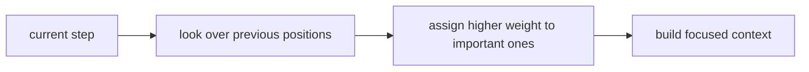

# P4-13.1 Attention의 직관

P4-12.2에서는 장기 의존성(long-term dependency) 때문에 순차 모델이 오래전 정보를 충분히 유지하기 어려울 수 있다는 점을 보았습니다. 여기서 다음 질문이 생깁니다.

현재 위치가 필요한 과거 정보를 더 직접적으로 참고하게 만들 수는 없는가?

이 질문에 대한 대표적 답이 attention입니다.

attention은 현재 계산에 정말 중요한 위치나 토큰(token)에 더 큰 비중을 두어, 필요한 정보를 더 직접적으로 참고하게 만드는 방식이다.

## 이 절의 범위

이 절은 다음 질문에 답합니다.

- attention은 어떤 문제를 해결하려는가?
- `필요한 위치를 더 강하게 본다`는 말은 무엇을 뜻하는가?
- attention은 RNN 계열과 어떻게 연결되는가?
- 왜 attention이 큰 전환점처럼 느껴졌는가?

이 절에서는 다음 내용을 깊게 다루지 않습니다.

- query, key, value 공식 전개
- multi-head attention 세부 구현
- Transformer block 내부 전체 구조

self-attention과 Transformer 연결은 P4-13.2와 P4-14.1, P4-14.2에서 이어서 다룹니다. query, key, value 공식 전개와 multi-head attention 세부 구현은 이 책의 현재 본편 범위 밖에 둡니다.

## 이 절의 목표

- attention을 `중요한 위치를 더 직접적으로 참고하는 방식`으로 설명할 수 있습니다.
- 장기 의존성 문제와 attention의 연결을 말할 수 있습니다.
- sequence-to-sequence와 번역 맥락에서 왜 attention이 중요했는지 설명할 수 있습니다.
- 작은 Python 예제로 가중 평균 형태의 attention 직관을 확인할 수 있습니다.

## attention은 왜 등장했나

기본 RNN이나 encoder-decoder 구조에서는 긴 입력 전체를 하나의 압축된 상태(state)에 담으려는 경향이 있었습니다. 입력이 짧을 때는 괜찮아 보여도, 문장이 길어지면 중요한 정보가 충분히 보존되지 않기 어려웠습니다.

attention은 이 문제를 다르게 봅니다.

`현재 출력을 만들 때, 입력 전체 중 어디를 더 참고해야 하는지를 직접 계산하자.`

즉, 오래전 정보를 무조건 상태 안에만 눌러 담아 두는 대신, 필요할 때 다시 꺼내 보려는 발상입니다.

## `더 강하게 본다`는 말은 무엇인가

attention의 직관은 독자에게 다음처럼 설명하면 충분합니다.

- 현재 위치에서
- 과거 입력이나 다른 위치들을 훑어보고
- 그중 더 중요한 위치에 더 큰 점수를 주고
- 그 점수를 바탕으로 정보를 모읍니다

즉, 모든 위치를 똑같이 보는 것이 아니라, `현재 과업과 더 관련 있는 위치를 더 크게 참고하는 방식`입니다.

이 흐름을 아주 짧게 표로 보면 다음과 같습니다.

| 단계 | 지금 일어나는 일 |
| --- | --- |
| 1 | 현재 위치가 다른 위치들을 훑는다 |
| 2 | 관련 있는 위치에 더 큰 점수를 준다 |
| 3 | 그 점수를 반영해 문맥 정보를 모은다 |

## 번역 예시로 보면 왜 직관적인가

attention은 번역(sequence-to-sequence translation) 맥락에서 설명하면 가장 직관적입니다.

예를 들어 번역기의 현재 출력이 어떤 단어를 만들고 있을 때:

- 입력 문장 전체 중 어떤 단어가 지금 가장 관련 있는지
- 그 위치를 더 강하게 참고할 수 있습니다

즉, 출력 단어 하나를 만들 때마다 입력 전체를 훑되, 필요한 위치에 더 무게를 두는 방식입니다.

다음처럼 기억하면 좋습니다.

`attention은 지금 번역하는 단어에 맞는 입력 위치를 찾아 더 많이 참고하게 하는 장치다.`

## attention은 장기 의존성 문제에 어떻게 답하나

장기 의존성 문제는 오래전 정보가 현재까지 약해지거나 사라질 수 있다는 것이었습니다. attention은 이 문제에 대해 다음처럼 답합니다.

- 굳이 오래전 정보를 상태 안에 희미하게만 남겨 두지 말고
- 현재 step에서 과거 위치 전체를 다시 훑어보며
- 중요한 곳을 직접 선택해서 참고하자

즉, attention은 `기억을 더 오래 보존하는 것`보다, `필요한 정보를 더 잘 찾아오는 것`에 가까운 발상입니다.

## 이를 아주 단순하게 그리면



이 도식은 attention을 `필요한 위치 탐색 -> 가중치 부여 -> 집중된 문맥 형성`으로 압축합니다.

## 왜 큰 전환점처럼 보였나

attention은 단순히 성능을 조금 올린 보조 기법이 아니라, sequence modeling의 관점을 바꾸는 효과가 있었습니다.

이전에는:

- 긴 문장을 압축 상태에 넣는 방식이 중심이었다면

attention 이후에는:

- 입력 전체를 두고 필요한 위치를 선택적으로 참고하는 방식이 더 강조되었습니다

이 변화는 이후 self-attention과 Transformer로 이어지며, RNN 중심 흐름에서 큰 전환을 만들어 냈습니다.

## 사례로 보기

### 사례 1. 기계 번역

영어 문장을 한국어로 번역할 때를 생각해 보겠습니다. 사람은 처음에는 왼쪽에서 오른쪽으로 차례로 읽으며 바로 옮기면 된다고 느끼기 쉽습니다. 하지만 실제로는 지금 만들고 있는 한국어 단어가 입력 문장 전체 중 어느 위치와 가장 직접 연결되는지 다시 확인해야 할 때가 많습니다. 예를 들어 문장 앞쪽의 주어와 뒤쪽 동사 관계를 놓치면, 번역은 문법상 맞아 보여도 누가 무엇을 했는지가 어색해질 수 있습니다. 사람이 번역할 때도 보통 현재 쓰는 단어에 맞는 입력 위치를 다시 눈으로 찾아봅니다. attention은 바로 이 `지금 출력할 단어에 가장 관련 있는 입력 위치를 더 강하게 본다`는 직관과 잘 맞습니다.

### 사례 2. 문서 요약

긴 문서를 요약할 때 사람은 제목, 첫 문단, 마지막 문장만 보면 핵심이 다 잡힐 것이라고 느끼기 쉽습니다. 하지만 실제로는 지금 작성 중인 요약 문장에 따라 다시 봐야 할 부분이 달라집니다. 예를 들어 `무엇을 결정했는가`를 쓰는 문장에서는 결론 단락이 중요하고, `왜 그렇게 했는가`를 쓰는 문장에서는 배경 설명과 근거 문단이 더 중요할 수 있습니다. 예를 들어 배포 연기 이유를 요약하는 문장에서는 중간의 리스크 설명 문단이 가장 중요할 수 있어, 제목과 마지막 문장만으로는 충분하지 않을 수 있습니다. 모든 문장을 같은 비중으로 보면 핵심 정보가 섞여 버리고, 반대로 현재 필요한 부분을 다시 골라 보면 더 정확한 요약이 나옵니다. attention은 이런 `지금 필요한 부분에 더 큰 비중을 둔다`는 감각으로 이해할 수 있습니다.

### 사례 3. 질의응답

사용자가 매뉴얼을 함께 넣고 `반품 가능한 기간은 며칠인가`라고 물었다고 가정해 보겠습니다. 사람은 문서가 길더라도 한 번 훑은 전체 인상만으로 답을 만들 수 있다고 느끼기 쉽습니다. 하지만 실제로는 반품 규정이 적힌 문장, 숫자가 들어 있는 표, 예외 조건이 붙은 각주 중 어디가 지금 질문과 직접 관련 있는지 다시 좁혀야 정확한 답에 가까워집니다. 전체 문서 인상만으로 답하면 `14일` 같은 숫자는 맞아도 `개봉 상품 제외` 같은 조건을 놓치기 쉽습니다. 예를 들어 숫자 표만 보고 답하면 조건 각주가 빠질 수 있고, 각주만 보면 핵심 기간 숫자가 빠질 수 있습니다. attention은 질문에 답할 때 관련 문장과 단어에 더 큰 비중을 두는 방식과 직접 이어집니다. 이 사례는 왜 `모든 입력을 똑같이 보지 않고, 현재 출력에 중요한 위치를 더 본다`는 발상이 필요한지 보여 줍니다.

세 사례를 한 줄로 묶으면 다음과 같습니다.

| 상황 | attention이 유용한 이유 |
| --- | --- |
| 번역 | 현재 출력에 맞는 입력 위치를 더 강하게 볼 수 있어서 |
| 문서 요약 | 지금 요약에 중요한 문장을 골라 참고할 수 있어서 |
| 질의응답 | 질문과 직접 관련된 문장에 더 큰 비중을 둘 수 있어서 |

## 작은 Python 예제로 보기

이번 예제의 목표는 여러 위치 중 중요한 곳에 더 큰 비중을 주고 가중 평균을 만드는 attention 직관을 확인하는 것입니다.

입력:

- 세 개의 값
- 각 값에 대한 중요도 점수

출력:

- 정규화된 비중
- 비중을 반영한 가중 평균

```python
import math

values = [2.0, 5.0, 9.0]
scores = [1.0, 2.0, 0.5]

exp_scores = [math.exp(s) for s in scores]
total = sum(exp_scores)
weights = [s / total for s in exp_scores]
context = sum(w * v for w, v in zip(weights, values))

print("weights =", [round(w, 3) for w in weights])
print("context =", round(context, 3))
```

실행 결과 예시는 다음처럼 읽을 수 있습니다.

```text
weights = [0.231, 0.629, 0.14]
context = 4.816
```

이 결과에서 읽어야 할 핵심은 다음입니다.

- 두 번째 값이 가장 큰 weight를 받습니다
- 그래서 최종 context는 두 번째 값의 영향을 더 크게 받습니다
- 즉, attention은 모든 위치를 똑같이 평균내지 않고, 중요한 위치를 더 크게 반영합니다

## 역사와 커리큘럼 관점

attention은 sequence-to-sequence 번역 연구에서 큰 영향력을 얻었고, 이후 self-attention과 Transformer로 이어지면서 현대 딥러닝과 LLM 설명의 핵심으로 자리 잡았습니다.

커리큘럼 관점에서 이 절이 중요한 이유는 다음과 같습니다.

- RNN의 한계를 단순한 실패가 아니라 다음 구조의 문제 제기로 읽게 하고
- sequence modeling의 관점이 `상태 유지`에서 `선택적 참조`로 이동하는 전환을 설명하며
- Part 5의 LLM 설명으로 넘어가기 전 핵심 다리를 제공하기 때문입니다

즉, attention은 Part 4 후반부에서 가장 중요한 전환 개념 중 하나입니다.

## 다음 절과의 연결

여기까지 오면 다음 질문이 남습니다.

- attention을 다른 토큰들 사이의 일반 계산 방식으로 확장하면 무엇이 되나?
- self-attention은 왜 Transformer의 핵심이 되었는가?

이 질문은 바로 P4-13.2 self-attention으로 이어지는 흐름으로 연결됩니다.

## 이 절에서 기억할 관점

- attention은 현재 계산에 중요한 위치를 더 크게 참고하는 방식입니다.
- 이는 장기 의존성 문제에 대한 더 직접적인 응답입니다.
- 번역, 요약, 질의응답 같은 순차 문제에서 직관적으로 설명하기 좋습니다.
- attention은 self-attention과 Transformer로 이어지는 전환 개념입니다.

## 체크리스트

- attention을 입문 수준에서 한 문장으로 설명할 수 있는가?
- 장기 의존성 문제와 attention의 연결을 말할 수 있는가?
- 가중 평균 비유로 attention 직관을 설명할 수 있는가?
- 다음 절의 self-attention으로 왜 자연스럽게 이어지는지 설명할 수 있는가?

## 출처와 참고 자료

- Dzmitry Bahdanau, Kyunghyun Cho, Yoshua Bengio, `Neural Machine Translation by Jointly Learning to Align and Translate`, ICLR 2015, 확인 날짜: 2026-06-29.
- Ian Goodfellow, Yoshua Bengio, Aaron Courville, `Deep Learning`, MIT Press, 2016, 확인 날짜: 2026-06-29. [https://www.deeplearningbook.org/](https://www.deeplearningbook.org/){: target="_blank" rel="noopener noreferrer" }
- Kyunghyun Cho et al., `Learning Phrase Representations using RNN Encoder-Decoder for Statistical Machine Translation`, arXiv, 2014, 확인 날짜: 2026-06-29.
