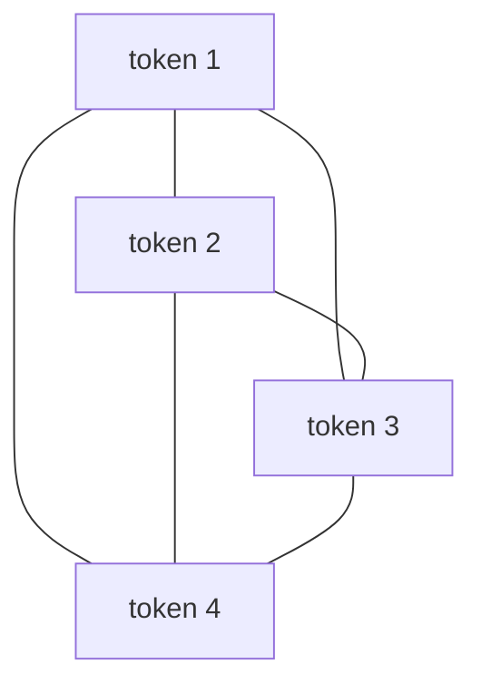

# P4-13.2 self-attention으로 이어지는 흐름

P4-13.1에서는 attention을 `현재 계산에 중요한 위치를 더 크게 참고하는 방식`으로 설명했습니다. 이제 다음 질문이 바로 이어집니다.

그렇다면 입력과 출력이 따로 있는 번역 상황만이 아니라, 입력 안의 각 위치가 서로를 직접 참고하게 만들면 무엇이 달라지는가?

이 질문에 대한 핵심 답이 self-attention입니다.

self-attention은 시퀀스 안의 각 토큰이 같은 시퀀스의 다른 토큰들을 서로 참고하며, 현재 표현을 다시 계산하는 방식이다.

## 이 절의 범위

이 절은 다음 질문에 답합니다.

- self-attention은 attention과 무엇이 다른가?
- 왜 `자기 시퀀스 안에서 서로 참조한다`는 발상이 중요한가?
- self-attention은 RNN과 어떤 점에서 계산 관점이 다른가?
- 왜 Transformer의 핵심으로 이어지는가?

이 절에서 먼저 닫아야 하는 핵심은 `토큰이 상태를 차례로 넘겨받는 대신, 같은 시퀀스 안 다른 토큰을 직접 다시 참고해 자기 표현을 새로 만든다`는 점입니다. 즉, self-attention은 뒤 설명으로 건너가기 위한 다리만이 아니라, sequence modeling의 계산 감각 자체를 바꾸는 현재 장의 핵심 전환으로 읽어야 합니다.

이 절에서는 다음 내용을 깊게 다루지 않습니다.

- query, key, value의 공식 유도
- multi-head attention의 구현 세부
- positional encoding의 수식 상세

Transformer 전체 구성은 P4-14.1, P4-14.2에서 이어서 다루고, query, key, value와 multi-head attention의 입문적 설명은 보충학습 P4-13.3에서 회수합니다. 더 깊은 공식 유도와 구현 최적화는 이 책의 현재 본편 범위 밖에 둡니다.

여기서 실제로 끝내야 하는 설명은 분명합니다. 이 절은 `토큰이 순차 상태를 전달받는가`보다 `토큰들이 서로를 다시 참고해 자기 표현을 갱신하는가`라는 계산 감각 전환을 현재 장 안에서 닫습니다. 따라서 Transformer 전체 이름은 다음 장으로 넘기더라도, self-attention 자체의 구조적 의미는 이 절에서 끝내 이해할 수 있어야 합니다.

## 이 절의 목표

- self-attention을 `시퀀스 내부 토큰들 사이의 상호 참조`로 설명할 수 있습니다.
- self-attention이 RNN식 순차 전달과 다른 계산 감각을 준다는 점을 말할 수 있습니다.
- self-attention이 병렬 처리와 긴 문맥 문제에 어떤 장점을 주는지 말할 수 있습니다.
- 실행 가능한 Python 예제로 토큰 간 중요도 참조 직관을 확인할 수 있습니다.

## 이 절을 읽는 순서

이 절은 다음 순서로 읽으면 충분합니다.

1. 먼저 P4-13.1의 attention을 떠올리며 `참조 대상이 같은 시퀀스 내부로 들어오면 무엇이 달라지는가`를 봅니다.
2. 그 다음 self-attention을 `토큰들이 서로를 참고해 표현을 다시 계산하는 방식`으로 읽습니다.
3. 이어서 RNN과의 계산 감각 차이, 병렬 처리 장점을 확인합니다.
4. 마지막에 왜 이것이 Transformer의 핵심으로 이어지는지 정리합니다.

## attention과 self-attention은 무엇이 다른가

attention은 넓게 보면 `현재 계산이 어떤 위치를 더 강하게 참고할지 정하는 방식`입니다. self-attention은 그 참조 대상이 같은 시퀀스 내부라는 점이 핵심입니다.

예를 들어 문장 안에서:

- 각 단어는 다른 단어들을 참고할 수 있고
- 현재 단어 표현은 전체 문장 안의 관련 토큰 정보를 다시 모아 계산할 수 있습니다

즉, self-attention은 `문장 바깥 정보를 가져오는 것`이 아니라, `문장 내부 관계를 다시 읽는 방식`입니다.

P4-13.1이 `현재 출력이 입력 어디를 더 참고할까`를 묻는 절이었다면, 여기서는 그 질문이 `현재 토큰이 같은 문장 안 다른 토큰을 어떻게 다시 참고할까`로 바뀐다고 읽으면 됩니다.

## 왜 이것이 중요한가

RNN은 보통 앞에서 뒤로, 혹은 양방향이라 해도 시간 흐름을 따라 상태를 전달하는 감각이 강합니다. self-attention은 이와 다르게, 현재 토큰이 필요할 때 멀리 떨어진 토큰도 비교적 직접 참고할 수 있게 합니다.

다음처럼 이해하면 충분합니다.

`RNN은 기억을 이어서 전달하는 방식에 가깝고, self-attention은 필요한 단어를 다시 찾아보는 방식에 가깝다.`

즉, 오래전 정보가 희미해지는 문제에 대해, self-attention은 더 직접적인 참조 경로를 만듭니다.

이 차이는 다음 표로 더 짧게 잡을 수 있습니다.

| 관점 | RNN 계열 | self-attention |
| --- | --- | --- |
| 기본 감각 | 상태를 다음 step으로 넘긴다 | 모든 토큰 사이 관련도를 다시 계산한다 |
| 먼 정보 접근 | 여러 step을 거쳐 전달된다 | 더 직접 참고할 수 있다 |
| 계산 느낌 | 순차 전달 | 관계 계산 |

여기서 독자가 꼭 잡아야 할 핵심은 `self-attention은 기억을 넘기는 구조라기보다, 관계를 다시 계산하는 구조`라는 점입니다.

## 문장 안에서 어떤 일이 일어나나

예를 들어 문장:

`The animal didn't cross the road because it was tired.`

에서 `it`이 무엇을 가리키는지 이해하려면, 문장 안 다른 단어와의 관계를 봐야 합니다. self-attention은 이런 관계를 설명하는 입문적 직관에 매우 잘 맞습니다.

각 토큰은:

- 자기 자신만 보는 것이 아니라
- 다른 토큰과의 관련도를 계산하고
- 더 중요한 토큰 정보를 더 많이 반영해
- 새로운 표현을 만듭니다

즉, self-attention은 토큰 표현을 문맥적으로 다시 쓰는 방식입니다.

이 말을 아주 짧은 예시로 다시 보면 다음과 같습니다.

```text
고양이는 소파 위에서 잠들었다. 그것은 매우 조용했다.
```

여기서 `그것`을 읽을 때, 바로 앞 단어 하나만 보는 것으로는 `소파`를 가리키는지 `고양이`를 가리키는지 충분히 안정적으로 판단하기 어렵습니다. self-attention 관점에서는 `그것` 위치가 문장 안 다른 단어들을 다시 참고하면서, 현재 문맥에 더 맞는 후보 쪽에 더 큰 비중을 둘 수 있습니다. 즉, `현재 토큰 하나를 이해하려고 문장 전체를 다시 섞어 읽는다`는 감각이 핵심입니다.

## 왜 Transformer의 핵심이 되었나

self-attention이 중요한 이유는 단순히 `더 똑똑해 보여서`가 아닙니다. 계산 구조 자체를 바꾸기 때문입니다.

특히 독자 기준에서 중요한 차이는 다음 두 가지입니다.

1. 먼 위치를 더 직접 참고할 수 있습니다
2. 순차적으로만 상태를 전달하지 않아도 되어 병렬 계산과 잘 맞습니다

즉, self-attention은 장기 의존성 문제와 병렬 처리 요구를 동시에 더 잘 만족시키는 방향으로 보였습니다. 이것이 Transformer의 핵심이 된 이유 중 하나입니다.

이 문장을 더 짧게 줄이면, `멀리 있는 단서를 다시 찾기 쉽고, 계산도 한 번에 다루기 쉬웠기 때문에` self-attention이 구조의 중심으로 올라왔다고 보면 됩니다.

여기서 독자가 한 번 더 붙잡아야 할 점은, self-attention이 단지 `좋은 기능 하나`가 아니라 `블록 중심 계산`이 되었다는 사실입니다. 즉, Transformer는 `먼저 self-attention으로 관계를 다시 읽고, 그 결과를 다음 계산으로 넘기는 구조`를 반복 기본 단위로 삼습니다. 이 연결이 바로 다음 절 P4-14.1의 출발점입니다.

즉, 이 절의 책임은 `Transformer에서 자세히 다룬다`로 미루는 데 있지 않습니다. 현재 절 안에서 이미 `순차 전달 중심 계산`에서 `관계 재계산 중심 구조`로 감각이 바뀌어야 하고, 다음 장은 그 계산을 어떤 블록이 반복하는지 설명하는 단계로만 이어지면 충분합니다.

## 이를 아주 단순하게 그리면



이 도식은 각 토큰이 다른 토큰들을 서로 참고할 수 있다는 직관을 압축합니다. 실제 구현은 더 정교하지만, 여기서 먼저 확인해야 할 점은 토큰이 앞에서 뒤로만 정보를 넘기는 것이 아니라 서로의 관련도를 함께 계산한다는 구조입니다.

이 도식을 한 문장으로 다시 읽으면 다음과 같습니다.

`한 토큰은 앞 토큰만 받는 것이 아니라, 문장 안 다른 토큰들을 함께 참고해 자기 표현을 다시 만든다.`

## self-attention은 왜 병렬 처리와 잘 맞나

RNN은 시점 순서대로 상태를 넘기므로, 계산 흐름이 순차적이라는 감각이 강합니다. self-attention은 각 토큰의 관련도 계산을 더 행렬적인 방식으로 다루기 쉬워, GPU 병렬 처리와 잘 맞습니다.

다음처럼 기억하면 충분합니다.

`self-attention은 토큰들을 순서대로만 밀어내기보다, 한 번에 서로의 관계를 계산하는 방향에 더 가깝다.`

이 점은 Part 4의 GPU/배치/텐서 계산과도 자연스럽게 연결됩니다.

## 사례로 보기

### 사례 1. 문장 안 지시어 해석

고객 문의 문장에 `상품은 반품했지만 박스는 버리지 않았습니다. 그것이 문제인가요?` 같은 표현이 있다고 해 보겠습니다. 사람이 대충 읽을 때는 보통 `그것` 바로 근처 단어만 먼저 보고 뜻을 짐작하기 쉽습니다. 하지만 실제로는 `그것`이 박스를 가리키는지, 반품 사실을 가리키는지에 따라 답변 내용이 달라질 수 있습니다. 가까운 단어만 따라가면 이런 참조 관계를 놓치기 쉽습니다. 여기서 바뀌는 점은 `바로 앞 단어만 보는 읽기`에서 `문장 전체 관계를 함께 보는 읽기`로 기준이 이동한다는 것입니다. self-attention은 현재 토큰이 문장 안 다른 위치를 다시 참고해 `무엇을 가리키는가`를 더 직접 계산한다는 직관을 줍니다. 그래서 이 사례에서 확인해야 할 결과는 바로 앞 단어만 보는 대신, 문장 전체 관계를 반영해 `그것`이 어느 명사를 가리키는지가 실제로 더 안정적으로 정해지는가입니다.

### 사례 2. 문서 요약

긴 회의록을 요약할 때를 생각해 보겠습니다. 사람은 요약을 빨리 만들려 하면 보통 마지막 결론 문단이나 굵은 제목만 먼저 보고 핵심을 정리하려고 합니다. 하지만 실제로는 문서 앞부분의 전제 조건과 뒷부분의 최종 결정이 함께 있어야 정확한 요약이 됩니다. 앞뒤를 따로 읽으면 `무엇을 하기로 했는가`는 남아도 `왜 그렇게 했는가`나 `어떤 예외가 붙었는가`를 놓치기 쉽습니다. 예를 들어 마지막에 `배포를 연기한다`고 적혀 있어도, 중간의 장애 위험 설명과 앞부분의 고객 공지 조건을 함께 봐야 제대로 요약할 수 있습니다. 여기서 바뀌는 점은 `눈에 띄는 일부 위치만 잡는 읽기`에서 `문서 여러 위치를 함께 묶는 읽기`로 기준이 이동한다는 것입니다. self-attention은 현재 요약 표현을 만들 때 문서 앞뒤의 관련 표현을 함께 다시 참고하는 전역 참조(global reference) 직관과 잘 맞습니다. 그래서 이 사례에서 확인해야 할 결과는 결론 문장만 남는 것이 아니라, 연기 이유와 적용 조건까지 함께 보존된 요약이 실제로 만들어지는가입니다.

### 사례 3. 코드 이해

긴 함수 안에서 위쪽에 `discount_rate`가 정의되고, 아래쪽 여러 조건문과 최종 반환식에서 다시 쓰인다고 해 보겠습니다. 사람이 코드를 읽을 때도 보통 현재 줄 주변만 먼저 보다가 계산식이 헷갈리면 위로 다시 올라가 변수 정의를 확인합니다. 그런데 순차적으로만 읽는 감각으로는 중간에 예외 처리와 다른 변수들이 많이 끼어들 때, 처음 정의가 어떤 역할을 했는지 흐려지기 쉽습니다. 예를 들어 마지막 반환식에서 할인값이 왜 음수가 아닌지 이해하려면, 위쪽의 초기화와 중간 조건문 두세 곳을 함께 다시 봐야 할 수 있습니다. 여기서 바뀌는 점은 `현재 줄 주변만 읽는 방식`에서 `멀리 떨어진 정의와 사용을 함께 보는 방식`으로 기준이 이동한다는 것입니다. self-attention은 현재 토큰이 멀리 떨어진 변수 정의, 함수 호출, 조건 분기와의 관계를 더 직접 참고한다는 설명에 잘 맞습니다. 그래서 이 사례에서 확인해야 할 결과는 최종 반환식 해석이 위쪽 정의와 일관되게 연결되고, 정의-사용 관계를 놓쳐 생기는 오해가 실제로 줄어드는가입니다.

세 사례를 한 줄로 묶으면 다음과 같습니다.

| 상황 | self-attention이 잘 맞는 이유 |
| --- | --- |
| 대명사 해석 | 문장 안 관련 단어를 다시 찾아볼 수 있어서 |
| 문서 요약 | 앞뒤 핵심 표현을 함께 참조할 수 있어서 |
| 코드 이해 | 멀리 떨어진 정의와 사용 관계를 더 직접 볼 수 있어서 |

세 사례를 같은 기준으로 다시 정리하면, self-attention이 `현재 위치가 무엇을 다시 참고해야 하는가`를 정하는 구조라는 점이 더 또렷해집니다.

| 사례 | 현재 위치가 다시 봐야 하는 대상 | 가까운 위치만 보면 생기는 문제 | self-attention으로 확인할 결과 |
| --- | --- | --- | --- |
| 대명사 해석 | 대명사가 가리키는 앞 명사 | 바로 옆 단어만 보고 잘못 연결할 수 있다 | 문장 전체 관계를 반영해 더 그럴듯한 지시어를 고르는가 |
| 문서 요약 | 앞 조건, 중간 이유, 뒤 결론 | 마지막 문장만 보고 이유나 예외를 놓칠 수 있다 | 여러 위치를 함께 참고해 요약 핵심을 다시 묶는가 |
| 코드 이해 | 멀리 떨어진 변수 정의와 사용 위치 | 현재 줄 근처만 보고 정의-사용 관계를 놓칠 수 있다 | 반환식과 위쪽 정의가 실제로 연결되는가 |

## 실행 가능한 Python 예제로 보기

이번 예제의 목표는 `그것` 같은 현재 토큰이 문장 안 여러 후보 중 무엇을 더 크게 참고하는지, 그리고 그 결과 현재 표현이 어떻게 달라지는지를 직접 확인하는 것입니다. 즉, self-attention을 단순 숫자 평균이 아니라 `현재 토큰이 문장 안 관련 단서를 다시 읽는 과정`으로 실험해 봅니다.

문제 상황:

- 현재 토큰 해석은 바로 옆 단어만이 아니라 문장 안 여러 위치를 다시 참고해야 달라질 수 있다

입력:

- `상품은 반품했지만 박스는 버리지 않았습니다. 그것이 문제인가요?`라는 짧은 문장
- 현재 토큰 `그것`이 문장 안 각 토큰을 얼마나 참고할지에 대한 점수
- 각 토큰의 간단한 의미 벡터

출력:

- 모든 토큰을 똑같이 평균낸 baseline 표현
- `그것` 위치에서 계산된 attention 비중
- self-attention 이후 `그것`의 새 표현
- 어떤 토큰 묶음이 가장 크게 반영됐는지에 대한 요약

문제 상황:

- self-attention은 현재 토큰이 문장 안 다른 토큰을 얼마나 다시 참고하는지로 이해하는 편이 더 직관적이다

확인할 개념:

- self-attention은 현재 토큰이 문장 안 다른 토큰을 다시 읽어 자기 표현을 바꾸는 구조다
- 지시어 해석처럼 멀리 떨어진 단서가 중요할 때 단순 평균보다 위치별 비중이 필요하다
- baseline 표현과 새 표현을 비교해야 self-attention의 역할이 눈에 들어온다

입력(input):

위에 정리한 토큰 목록과 토큰별 벡터 표현을 사용합니다.

```python
import math

tokens = ["상품", "반품", "박스", "버리지", "그것"]
token_vectors = {
    "상품": [0.8, 0.1, 0.0],
    "반품": [0.9, 0.3, 0.1],
    "박스": [0.1, 0.9, 0.2],
    "버리지": [0.0, 0.6, 0.8],
    "그것": [0.3, 0.3, 0.3],
}

# current token "그것" assigns larger raw scores to tokens
# that help resolve what it refers to in this sentence
raw_scores = {
    "상품": 0.2,
    "반품": 0.6,
    "박스": 2.1,
    "버리지": 1.2,
    "그것": 0.7,
}

ordered_scores = [raw_scores[token] for token in tokens]
exp_scores = [math.exp(score) for score in ordered_scores]
total = sum(exp_scores)
weights = [s / total for s in exp_scores]

baseline_representation = [0.0, 0.0, 0.0]
uniform_weight = 1 / len(tokens)
for token in tokens:
    vector = token_vectors[token]
    for idx in range(len(vector)):
        baseline_representation[idx] += uniform_weight * vector[idx]

new_representation = [0.0, 0.0, 0.0]
for weight, token in zip(weights, tokens):
    vector = token_vectors[token]
    for idx in range(len(vector)):
        new_representation[idx] += weight * vector[idx]

print("baseline_representation =", [round(value, 3) for value in baseline_representation])
for token, weight in zip(tokens, weights):
    print(token, "weight =", round(weight, 3), "vector =", token_vectors[token])
print("weights =", [round(w, 3) for w in weights])
print("new_representation =", [round(value, 3) for value in new_representation])
print(
    "representation_shift =",
    [round(new - base, 3) for new, base in zip(new_representation, baseline_representation)],
)

top_token = tokens[weights.index(max(weights))]
top_pair_weight = round(weights[tokens.index("박스")] + weights[tokens.index("버리지")], 3)
print("top_token =", top_token)
print("box_plus_not_discarded_weight =", top_pair_weight)
```

실행 결과 예시는 다음처럼 읽을 수 있습니다.

```text
baseline_representation = [0.42, 0.44, 0.28]
상품 weight = 0.074 vector = [0.8, 0.1, 0.0]
반품 weight = 0.11 vector = [0.9, 0.3, 0.1]
박스 weight = 0.494 vector = [0.1, 0.9, 0.2]
버리지 weight = 0.201 vector = [0.0, 0.6, 0.8]
그것 weight = 0.122 vector = [0.3, 0.3, 0.3]
weights = [0.074, 0.11, 0.494, 0.201, 0.122]
new_representation = [0.244, 0.642, 0.307]
representation_shift = [-0.176, 0.202, 0.027]
top_token = 박스
box_plus_not_discarded_weight = 0.694
```

이 결과에서 읽어야 할 핵심은 다음입니다.

- baseline 평균에서는 `상품`, `반품`, `박스`, `버리지`가 모두 같은 비중으로 섞여, 현재 토큰 `그것`이 무엇을 가리키는지에 대한 강조가 없습니다
- 현재 토큰 표현은 자기 자신만으로 정해지지 않고, 문장 안 다른 토큰들을 다시 참고해 새로 계산됩니다
- 이 예제에서는 `그것`이 `반품`보다 `박스`와 `버리지` 쪽 단서를 훨씬 더 크게 참고하므로, 대명사 해석이 `박스` 쪽으로 기웁니다
- `박스`와 `버리지`의 합 비중이 0.694라는 점은, self-attention이 단어 하나만 보는 것이 아니라 관련 단서 묶음을 함께 반영한다는 점을 보여 줍니다
- `representation_shift`에서 두 번째 축 값이 크게 늘어난다는 점은, 현재 토큰 표현이 `박스/버리지` 쪽 문맥으로 다시 당겨졌다는 직관을 줍니다
- 즉, self-attention은 `지금 이 토큰을 이해하려면 문장 안 어디를 다시 봐야 하는가`를 수치로 정하는 방식으로 읽을 수 있습니다

즉, self-attention은 `문맥을 보고 표현을 다시 계산하는 방식`입니다.

## 이 예제를 현재 토큰 재해석 관점으로 다시 보면

앞의 숫자는 실제 대규모 self-attention 전체를 구현한 것은 아니지만, 비교 기준은 분명합니다.

- baseline 평균은 `문장 전체 정보를 그냥 뭉뚱그려 섞은 표현`에 가깝습니다.
- self-attention 결과는 `현재 토큰 그것이 지금 누구를 더 참고해야 하는가`를 다시 계산한 표현에 가깝습니다.

즉, self-attention은 단순히 문장 전체를 보는 기능이 아니라, `각 토큰이 자기 입장에서 문장 전체를 다시 읽고 새 표현을 만드는 계산`입니다. 이 감각이 잡혀야 다음 절 P4-13.3의 QKV와 multi-head attention도 `무슨 이름을 외우는 절`이 아니라 `이 재참조 계산을 더 구조적으로 설명하는 절`로 읽을 수 있습니다.

self-attention에서 확인해야 할 역사적 전환은 attention이 번역 분야의 보조 메커니즘에 머무르지 않고, sequence modeling의 중심 계산 방식으로 이동했다는 점입니다. 그리고 바로 그 이동이 Transformer의 핵심입니다.

커리큘럼 관점에서 이 절에서 확인해야 할 결과는 바로 앞의 P4-13.1 attention 직관을 단순 보조 장치가 아니라, self-attention을 통해 구조 자체를 바꾸는 계산 발상으로 확장해 읽을 수 있는가입니다.

- attention을 단순한 보조 장치로 끝내지 않고
- 왜 self-attention이 구조 자체를 바꾸는 발상이었는지 설명하며
- Transformer 블록의 핵심 계산을 미리 닫아 주기 때문입니다

즉, self-attention은 Part 4 후반부에서 sequence modeling의 계산 감각을 바꾸는 가장 중요한 전환 개념 중 하나입니다.

따라서 이 절에서 확인해야 할 최종 결과는 `attention`과 `Transformer` 사이에 끼어 있는 중간 단계가 아니라, Transformer를 이해하기 위해 반드시 지나가야 하는 핵심 전환점으로 self-attention을 읽을 수 있는가입니다.

## 다음 절과의 연결

여기까지 오면 다음 질문이 남습니다.

- self-attention만으로 모델이 완성되는가?
- Transformer는 attention 외에 어떤 구성 요소를 함께 사용하며, 왜 RNN과 달랐는가?

이 질문은 바로 P4-14.1 Transformer의 기본 구성으로 이어집니다.

## 이 절에서 기억할 관점

- self-attention은 같은 시퀀스 안의 토큰들이 서로를 참고해 표현을 다시 계산하는 방식입니다.
- 이는 RNN식 순차 상태 전달과 다른 계산 감각을 제공합니다.
- self-attention은 먼 위치 단서를 다시 참조하면서도 토큰 계산을 병렬로 처리할 수 있다는 점에서 RNN과 다른 계산 장점을 줍니다.
- Transformer는 이 self-attention을 핵심 계산 장치로 삼습니다.

## 체크리스트

- self-attention을 입문 수준에서 설명할 수 있는가?
- attention과 self-attention의 차이를 말할 수 있는가?
- self-attention이 RNN보다 어떤 계산 감각 차이를 주는지 설명할 수 있는가?
- 다음 절의 Transformer 구성으로 왜 자연스럽게 이어지는지 말할 수 있는가?

## 출처와 참고 자료

- Ashish Vaswani et al., `Attention Is All You Need`, NeurIPS 2017, 확인 날짜: 2026-06-29.
- Dzmitry Bahdanau, Kyunghyun Cho, Yoshua Bengio, `Neural Machine Translation by Jointly Learning to Align and Translate`, ICLR 2015, 확인 날짜: 2026-06-29.
- Ian Goodfellow, Yoshua Bengio, Aaron Courville, `Deep Learning`, MIT Press, 2016, 확인 날짜: 2026-06-29. [https://www.deeplearningbook.org/](https://www.deeplearningbook.org/){: target="_blank" rel="noopener noreferrer" }
