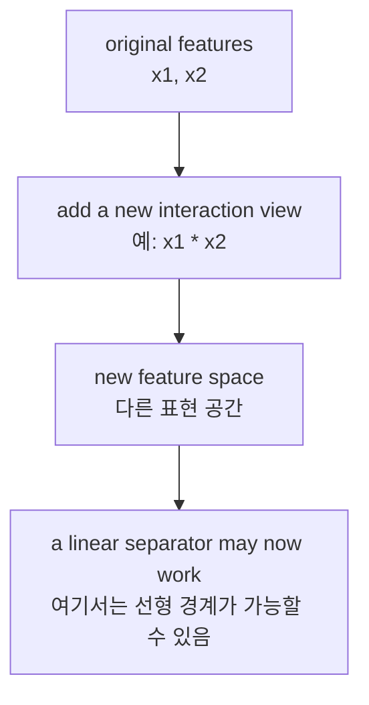
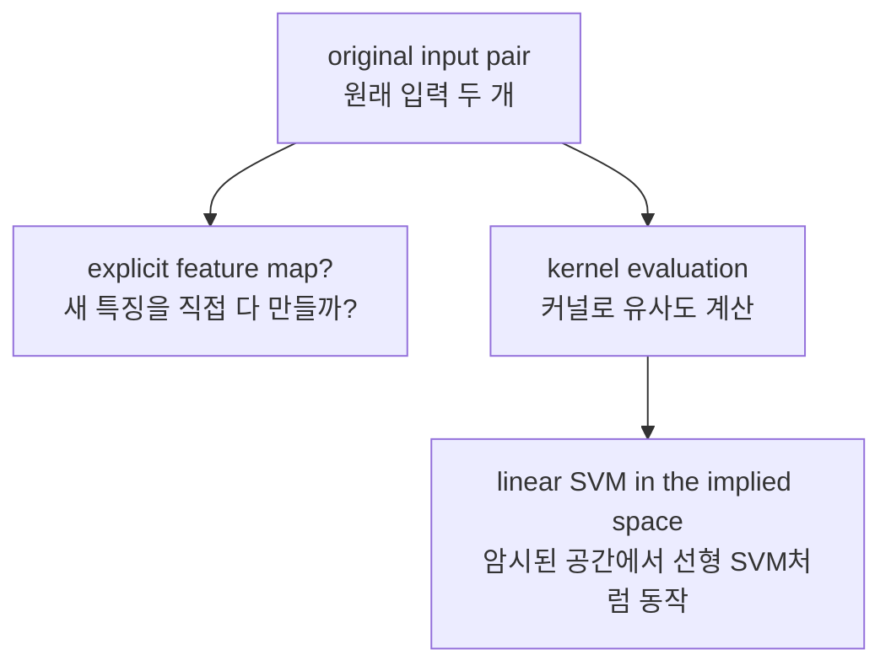
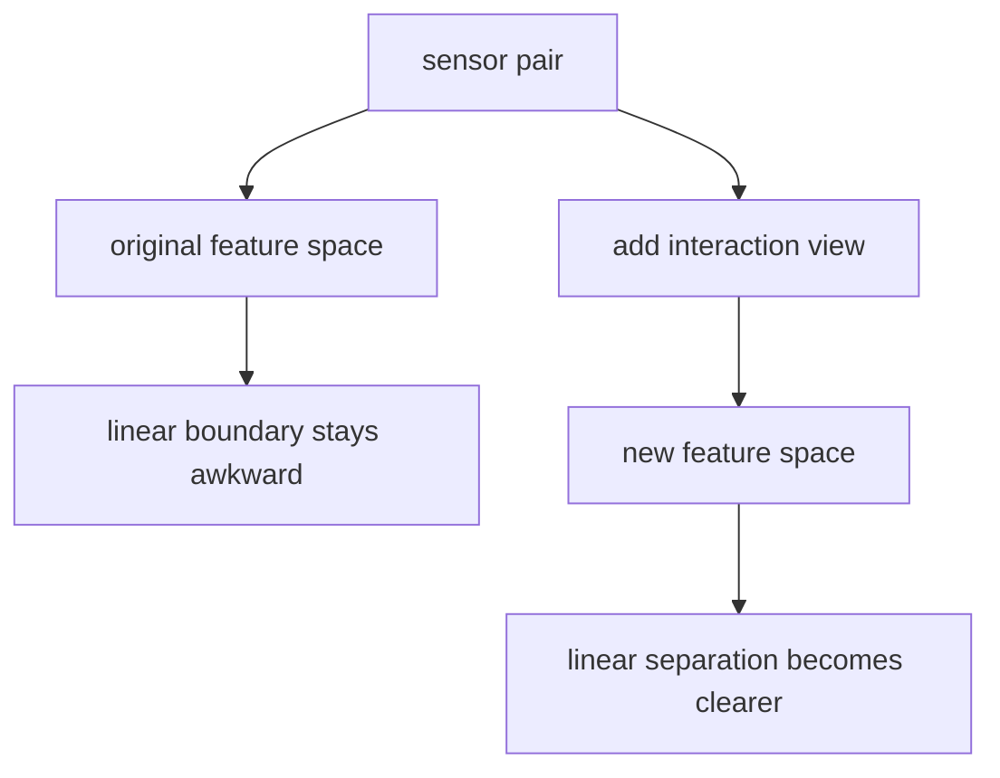

# P4-13.2 커널(kernel)의 입문적 의미

> Section ID: `P4-13.2`
> Version: `v2026.07.11`

P4-13.1에서는 SVM(support vector machine)을 `margin이 큰 경계를 찾는 분류기`로 보았습니다. 그런데 거기서 다음 질문이 생깁니다.

그 경계가 직선(line)이어야만 한다면, 직선으로는 잘 나눌 수 없는 데이터는 어떻게 해야 할까?

이 질문이 바로 커널(kernel)을 소개해야 하는 이유입니다.

커널은 데이터를 다른 표현 공간에서 비교하게 해, 원래는 선형으로 나누기 어려운 문제를 더 다룰 수 있게 해 주는 발상이다.

즉, 13.2의 핵심은 `새로운 마법 함수`가 아니라, `표현을 바꾸면 선형 경계도 다른 의미를 가질 수 있다`는 관점입니다.

이 절은 SVM의 기본 정의를 다시 길게 반복하지 않습니다. `margin이 큰 경계를 찾는다`는 핵심 직관은 P4-13.1과 [개념사전](../../../reference/concept-glossary.md)을 기준으로 다시 연결하고, 여기서는 왜 표현 공간을 바꾸는 발상이 필요한지에만 집중합니다.

## 이 절의 범위

이 절은 다음 질문에 답합니다.

- 왜 어떤 데이터는 선형 경계만으로 잘 나뉘지 않는가?
- 표현(feature space)을 바꾼다는 말은 무엇을 뜻하는가?
- 커널은 왜 `직접 새 특징을 만들지 않고도` 도움이 된다고 말하는가?
- 다항식(polynomial), RBF 같은 커널 이름은 무엇을 암시하는가?
- 커널 기반 SVM을 언제 후보로 떠올릴 수 있는가?

이 절은 다음 내용은 깊게 다루지 않습니다.

- 커널 함수의 엄밀한 양의 정부호(positive semidefinite) 조건
- RKHS(reproducing kernel Hilbert space)의 수학
- 듀얼 최적화에서 커널이 들어가는 식의 전개
- `gamma`, `degree`, `coef0`의 세부 튜닝 전략

`gamma`, `degree`, `coef0` 같은 설정값을 읽는 기준과 검증 비용은 P4-9.1, P4-9.2에서 다시 연결합니다. 양의 정부호 조건, RKHS, 듀얼 최적화의 수학 전개는 이 책의 현재 본편 범위 밖에 두고, 필요하면 더 심화된 수학 문서에서 따로 보는 편이 맞습니다.

## 이 절의 목표

- 선형 경계가 잘 작동하지 않는 문제를 예시로 설명할 수 있습니다.
- 표현 공간(feature space)을 바꾸면 같은 데이터가 다르게 읽힐 수 있음을 설명할 수 있습니다.
- 커널을 `유사도를 계산하는 방식이자, 새 표현 공간을 우회해서 쓰는 아이디어`로 입문 수준에서 설명할 수 있습니다.
- 다항식 커널과 RBF 커널이 각각 어떤 종류의 비선형성을 의식하는지 감각적으로 말할 수 있습니다.
- 커널 기반 방법을 `항상 쓰는 기본값`이 아니라 `선형 경계가 부족해 보일 때 떠올리는 후보`로 위치 지을 수 있습니다.

## 이 절을 읽는 순서

이 절은 새 용어가 한 번에 몰려 보이기 쉬우므로, 처음 읽을 때는 다음 네 질문만 순서대로 붙잡는 편이 좋습니다.

1. 왜 어떤 문제는 `더 좋은 직선`을 찾는 일만으로는 부족한가?
2. 표현 공간(feature space)을 바꾼다는 말은 구체적으로 무엇을 더 보는가?
3. 새 특징을 직접 만드는 것과 kernel로 비교 효과를 우회하는 것은 어떻게 이어지는가?
4. polynomial과 RBF는 각각 어떤 구조를 더 의식하게 만드는가?

이 순서가 잡히면 커널을 `새 모델 이름`이 아니라 `표현을 다시 읽는 네 번째 질문`으로 붙잡기 쉬워집니다.

## 학습 배경

13.1에서 SVM은 `좋은 선형 경계`를 찾는 모델로 읽혔습니다. 하지만 현실 데이터는 종종 다음처럼 보입니다.

- class가 곡선처럼 얽혀 있습니다.
- 중앙과 바깥쪽처럼 원형 구조를 가집니다.
- 두 특징의 곱이나 상호작용이 중요해 보입니다.

이때 질문은 `더 좋은 직선이 있나?`에서 멈추지 않습니다. 오히려 `직선으로 읽는 방식 자체가 부족한가?`로 이동합니다.

| 앞 절 | 지금 절에서 바뀌는 질문 |
| --- | --- |
| P4-13.1 SVM의 직관 | 좋은 직선 경계는 무엇인가? |
| P4-13.2 커널의 입문적 의미 | 직선으로 읽는 공간 자체를 바꿔야 하는가? |

즉, 13.2는 13.1을 뒤집는 절이 아니라, `선형 경계의 힘`을 인정하되 `표현을 바꾸면 선형의 의미도 달라진다`는 점을 보강하는 절입니다.

## 주요 학습내용

### 앞 절에서 이미 본 것과 지금 절에서 새로 바뀌는 것은 무엇인가

이 절이 갑자기 새로운 이야기를 꺼내는 것처럼 보이면, 앞에서 이미 본 세 가지를 먼저 다시 붙잡는 편이 좋습니다.

- P4-11.2에서는 `선형 점수와 결정 경계`를 보았습니다.
- P4-12.2에서는 `표현과 계산 기준이 바뀌면 같은 데이터도 다르게 읽힌다`는 점을 보았습니다.
- P4-13.1에서는 `같은 좌표 공간 안에서 더 좋은 선형 경계`를 찾는 기준을 보았습니다.

P4-13.2는 이 셋을 버리는 절이 아닙니다. 오히려 그 셋이 충분히 작동하지 않을 때 무엇을 더 물어야 하는지를 다루는 절입니다.

`13.1이 같은 공간 안에서 더 좋은 경계를 찾는 절이었다면, 13.2는 그 공간 자체가 문제를 단순하게 드러내는지 다시 묻는 절이다.`

### 왜 어떤 데이터는 직선으로 잘 나뉘지 않는가

가장 유명한 예시는 XOR처럼 생긴 분류 문제입니다. 2차원 평면에 점이 네 개 있다고 해 봅시다.

- 왼아래와 오른위는 class 0
- 왼위와 오른아래는 class 1

이 경우 하나의 직선으로는 두 class를 깔끔하게 나누기 어렵습니다. 어떤 직선을 그어도 대각선 방향의 두 점이 같은 쪽에 남기 쉽기 때문입니다.

`문제가 어려운 것이 아니라, 지금 쓰는 좌표와 특징 표현이 직선 분리에 불리할 수 있다.`

핵심은 데이터가 `어렵다`기보다, 지금 쓰는 표현 방식이 선형 분리에 불리할 수 있다는 점입니다. 즉, 원래 좌표 공간에서 직선 경계가 답답하게 보인다면 경계보다 먼저 표현을 바꿔 볼 이유가 생깁니다.

여기서 중요한 것은 `좋은 직선을 더 찾으면 되나?`와 `직선을 읽는 공간 자체를 바꿔야 하나?`를 구분하는 일입니다.

- P4-13.1의 질문: 같은 좌표 공간 안에서 더 좋은 경계를 찾을 수 있는가?
- P4-13.2의 질문: 그 좌표 공간 자체가 문제를 단순하게 드러내고 있는가?

즉, soft margin이나 `C`를 다시 보는 일은 `같은 공간 안에서 경계를 더 잘 고르는 일`에 가깝고, kernel은 `경계가 놓일 공간 자체를 다시 읽는 일`에 가깝습니다.

### 표현을 바꾼다는 말은 무엇인가

표현을 바꾼다는 말은 `원래 특징을 버린다`는 뜻이 아닙니다. 보통은 다음에 가깝습니다.

- 기존 특징을 조합한다.
- 새 상호작용 특징을 만든다.
- 다른 관점에서 같은 데이터를 다시 본다.

예를 들어 \(x_1\)과 \(x_2\) 두 특징이 있을 때, 여기에 `x1 * x2` 같은 새 특징을 더 만들 수 있습니다. 그러면 원래 2차원에서 분리하기 어려웠던 패턴이, 새 특징이 추가된 공간에서는 더 단순하게 보일 수 있습니다.

이 흐름을 간단히 그리면 다음과 같습니다.



이 도식은 커널 발상의 출발점을 보여 줍니다. 경계를 먼저 복잡하게 만들기보다, 특징 표현을 바꾸면 같은 데이터도 더 단순한 선형 경계로 읽힐 수 있다는 점이 중요합니다.

핵심은 다음 문장입니다.

`커널의 출발점은 경계를 바꾸기 전에 표현을 바꿔 보는 것이다.`

여기서 독자가 특히 잡아야 하는 점은 다음입니다.

- class가 복잡해서 `모델이 약하다`고 단정할 필요는 없습니다.
- 오히려 `지금 보는 좌표축과 특징 조합이 문제를 단순하게 드러내지 못하는가?`를 물어야 합니다.
- 커널은 이 질문에 대한 대표적인 답 중 하나입니다.

즉, 커널은 모델을 복잡하게 만드는 기술이라기보다, `문제를 읽는 좌표계를 다시 잡아 보는 기술`에 가깝습니다.

### 직접 특징 추가와 kernel은 무엇이 같고 무엇이 다른가

여기서 속도가 빨라지기 쉬우므로, 먼저 같은 점과 다른 점을 나눠 잡는 편이 좋습니다.

| 비교 질문 | 직접 특징 추가 | kernel 발상 |
| --- | --- | --- |
| 공통 목표 | 더 풍부한 표현 공간에서 구조를 다시 본다 | 더 풍부한 표현 공간에서 구조를 다시 본다 |
| 사람이 직접 하는 일 | `x1 * x2`, `x1^2` 같은 새 특징을 명시적으로 만든다 | 새 공간의 비교 효과를 원래 공간 계산으로 우회한다 |
| 독자가 먼저 읽을 핵심 | 어떤 조합 특징이 필요해 보이는가 | 어떤 유사도 구조를 강조하고 싶은가 |

즉, kernel은 `직접 특징 추가`와 경쟁하는 완전히 다른 마법이 아니라, `표현을 더 풍부하게 보는 발상`을 계산 쪽에서 더 일반화한 방향으로 읽는 편이 자연스럽습니다.

### kernel이라는 이름은 무엇을 가리키는가

이 절에서는 수학적 엄밀성보다, 이 이름이 실제로 무엇을 가리키는지 먼저 잡습니다.

`kernel은 두 입력을 받아, 그 둘이 새 표현 공간에서 얼마나 가깝거나 비슷하게 읽히는지를 계산하는 중심 계산이다.`

즉, kernel이라는 말은 `모든 새 특징 전체`가 아니라, 그 공간에서 비교를 수행하는 핵심 계산으로 읽으면 됩니다. 그래서 독자가 먼저 붙잡아야 할 질문도 많지 않습니다.

- 이 커널은 두 샘플의 어떤 유사도를 강조하는가?
- 상호작용을 더 보게 하는가?
- 가까운 주변 구조를 더 민감하게 보게 하는가?

이 세 질문이 잡히면 `kernel 이름 외우기`보다 `kernel이 어떤 비교 방식을 밀어 주는가`를 읽게 됩니다.

### 왜 `새 특징을 다 만들지 않아도 된다`고 말하는가

입문 수준에서는 다음 한 문장으로 먼저 잡으면 충분합니다.

`커널은 새 표현 공간에서의 내적(inner product)이나 유사도를, 원래 공간 계산만으로 대신 구하게 해 주는 아이디어다.`

즉, 모든 고차원 특징을 명시적으로 펼쳐 쓰지 않고도, `그 공간에서 서로 얼마나 비슷한가`를 계산하는 길을 준다는 뜻입니다.

이를 흐름으로 그리면 다음과 같습니다.



이 도식은 커널이 왜 `새 특징을 전부 명시적으로 만들지 않고도` 도움이 된다고 말하는지 보여 줍니다. 원래 입력쌍에서 바로 유사도를 계산해, 암시된 고차원 공간에서 선형 SVM처럼 동작하게 만드는 우회 경로가 핵심입니다.

여기서 독자가 바로 남겨야 할 판단은 단순합니다.

- `새 조합 특징을 내가 직접 설계할 수 있는가?`
- `아니면 어떤 유사도 구조를 강조할지만 먼저 정하고 싶은가?`

커널은 이 둘 중 뒤쪽 질문에 더 가까운 선택지입니다.

## 세부 학습내용

### 다항식(polynomial)과 RBF 커널은 무엇을 암시하는가

13.2에서 모든 커널을 다 외울 필요는 없습니다. 대신 대표적인 두 이름이 무엇을 시도하는지만 잡으면 됩니다.

#### 다항식 커널(polynomial kernel)

- 특징들 사이의 곱, 제곱, 상호작용을 더 의식합니다.
- `x1`, `x2`만 보는 대신 `x1^2`, `x1*x2`, `x2^2` 같은 조합이 중요할 때 떠올리기 쉽습니다.
- 입문적으로는 `명시적 상호작용 특징을 많이 늘린 것과 닮은 발상`으로 읽을 수 있습니다.

#### RBF 커널(radial basis function kernel)

- 점 주변의 지역성(locality)과 거리 기반 유사도를 더 강하게 의식합니다.
- 멀면 유사도가 빨리 줄고, 가까우면 크게 반응하는 식의 감각을 줍니다.
- 입문적으로는 `복잡한 곡선 경계를 더 유연하게 만들 수 있는 대표 커널`로 많이 소개됩니다.

이 둘을 아주 간단히 비교하면 다음과 같습니다.

| 커널 | 독자용 감각 |
| --- | --- |
| polynomial | 상호작용 특징을 더 본다 |
| RBF | 가까운 주변 구조를 더 민감하게 본다 |

같은 차이를 조금 더 실무 감각으로 풀면 다음처럼 읽을 수 있습니다.

| 커널 | 데이터가 암시하는 구조 | 독자용 질문 |
| --- | --- | --- |
| polynomial | 특징 간 곱, 제곱, 조합이 중요해 보임 | `값 하나보다 조합이 더 중요해 보이는가?` |
| RBF | 가까운 점들끼리 지역적으로 뭉치고, 경계가 곡선적임 | `가까운 주변의 모양이 class를 가르는가?` |

즉, 커널 이름은 단순한 옵션이 아니라 `데이터를 어떤 렌즈로 다시 보려 하는가`를 암시합니다.

### 원형 구조를 어떻게 다시 읽는가

XOR는 상호작용 특징의 감각을 보여 주는 대표 예시입니다. 반면 RBF를 떠올릴 때는 `중앙과 바깥쪽`처럼 원형 구조를 상상하는 편이 더 선명합니다.

예를 들어 다음 같은 상황을 생각할 수 있습니다.

- 중심 근처 점들은 class 0
- 반지름이 커질수록 class 1

이 경우 `x1`만 보거나 `x2`만 보는 직선 경계는 답답할 수 있습니다. 하지만 `원점에서 얼마나 떨어졌는가`라는 거리 감각을 더 강하게 쓰면, 문제는 더 분명하게 읽힙니다.

이를 입문 수준으로 정리하면 다음과 같습니다.

- polynomial 계열은 `특징 조합`을 더 보는 발상과 잘 연결됩니다.
- RBF 계열은 `거리 기반의 지역 구조`를 더 보는 발상과 잘 연결됩니다.

즉, 두 커널은 모두 비선형 문제를 다루지만, 같은 방식으로 비선형을 읽는 것은 아닙니다.

이 차이를 프로젝트 메모 형식으로 옮기면 다음처럼 적을 수 있습니다.

| 비교 항목 | 원래 공간 | 새 표현 또는 kernel 관점 | 읽기 |
| --- | --- | --- | --- |
| 애매한 사례 | class가 섞여 보임 | 더 또렷하게 갈릴 수 있음 | 표현이 바뀌면 같은 사례도 다르게 읽힌다 |
| review 필요 여부 | 높음 | 줄어들거나 성격이 바뀔 수 있음 | 검토 질문도 함께 바뀐다 |
| 다음 질문 | 선형 기준이 부족한가 | 어떤 kernel이 더 맞는가 | 표현과 경계 질문을 분리하지 않는다 |

즉, kernel 절은 `수식이 복잡해진다`보다 `사례가 다른 공간에서 다시 배치된다`는 관점으로 읽습니다. 같은 분류 결과처럼 보여도 어떤 사례가 계속 애매하게 남는지, 어떤 사례는 더 또렷하게 갈리는지는 따로 확인해야 합니다.

### 로지스틱 회귀, 선형 SVM, 커널 SVM은 어떻게 이어지는가

세 방법은 서로 완전히 다른 세계가 아니라, 경계를 읽는 수준이 조금씩 달라집니다.

| 모델 | 중심 아이디어 |
| --- | --- |
| 로지스틱 회귀 | 선형 점수와 확률처럼 읽히는 출력 |
| 선형 SVM | margin이 큰 선형 경계 |
| 커널 SVM | 표현 공간을 바꾸어 비선형처럼 보이는 구조까지 선형 SVM 발상으로 읽기 |

즉, 커널 SVM은 `선형 SVM을 버리는 방법`이라기보다 `선형 SVM이 읽는 공간을 더 풍부하게 바꾸는 방법`으로 이해하는 편이 정확합니다.

같은 흐름을 커리큘럼 언어로 더 압축하면 다음과 같습니다.

- P4-11의 로지스틱 회귀: 선형 점수와 결정 경계를 배운다.
- P4-13.1의 SVM: 그 선형 경계 중 더 안정적인 경계를 고른다.
- P4-13.2의 커널: 선형 경계가 작동하는 공간 자체를 다시 설계한다.

이 정리가 잡히면 뒤에서 더 다양한 모델이 나와도, 독자는 `이 모델은 경계를 바꾸는가, 비교 방식을 바꾸는가, 표현을 바꾸는가`라는 질문으로 다시 정리할 수 있습니다.

### 무엇이 경계 조정이고 무엇이 표현 변경인가

이 절에서 특히 헷갈리기 쉬운 것은 `경계를 더 잘 조정하는 일`과 `표현 공간을 바꾸는 일`을 같은 것으로 읽는 경우입니다.

| 질문 | 더 가까운 절 | 지금 읽는 해석 |
| --- | --- | --- |
| 같은 좌표 공간 안에서 더 여유 있는 경계를 찾을 수 있는가 | P4-13.1 | margin, support vector, soft margin 쪽 질문 |
| 지금 좌표 공간 자체가 class 구조를 단순하게 드러내는가 | P4-13.2 | kernel, 명시적 특징 추가, 표현 공간 쪽 질문 |

이 구분이 중요한 이유는, 직선 경계가 답답할 때 곧바로 `더 복잡한 모델`을 찾는 것이 아니라 먼저 `무엇이 부족한가`를 나누어 읽어야 하기 때문입니다.

- 경계가 부족한가
- threshold가 부족한가
- 거리 규칙이 부족한가
- 표현 공간이 부족한가

커널은 이 네 질문 중 마지막에 더 가깝습니다.

## 사례 및 예시

### 사례 1. 직선으로는 나뉘지 않는데 조합 특징을 보면 갈리는 불량 패턴

제조 팀이 센서 두 개로 불량 여부를 분류하려고 합니다. 사람이 먼저 보던 기준은 `온도만 높다`거나 `압력만 높다`보다, `두 값이 특정 조합으로 함께 나타날 때` 불량이 많다는 관찰이었습니다.

선형 모델과 선형 SVM을 먼저 써 보지만 경계가 계속 어색합니다. 한 축만 보면 정상과 불량이 섞여 있고, 직선 하나로는 네 구역이 대각선처럼 엇갈린 패턴을 깔끔하게 나누기 어렵습니다. 이때 문제를 `더 좋은 직선이 없나`로만 읽으면 계속 답답합니다.



이 장면에서 커널의 발상은 `경계를 더 복잡하게 그리자`보다 `표현을 바꿔 보자`에 가깝습니다. 예를 들어 두 센서 값의 곱이나 제곱처럼 상호작용 특징을 의식하면, 원래 공간에서는 얽혀 있던 패턴이 새 표현 공간에서는 더 단순한 선형 경계로 보일 수 있습니다. 즉, 데이터가 바뀐 것이 아니라 데이터를 읽는 좌표계가 바뀐 것입니다.

확인 가능한 결과는 원래 특징만 썼을 때와 상호작용을 의식한 표현을 썼을 때의 분리 정도를 비교하면 드러납니다. 원래 공간에서는 직선 경계가 계속 애매한데, 새 표현에서는 class가 더 또렷하게 갈린다면, 커널이 `마법 함수`가 아니라 `표현 공간을 다시 잡는 발상`이라는 점을 설명할 수 있습니다.

### 사례 2. 실무에서 언제 커널 기반 SVM을 후보로 떠올릴 수 있는가

여기서도 기록 구조를 같이 고정해 둘 수 있습니다. kernel 절은 단순히 `다른 함수 이름`을 배우는 절이 아니라, `같은 사례가 다른 표현 공간에서 어떻게 다시 읽히는가`를 기록하는 절이기 때문입니다. 따라서 어떤 사례가 원래 공간에서는 애매했는지, 새 표현에서는 어떻게 재배치되었는지, 그 결과 review 대상이 줄었는지 또는 새로 생겼는지를 함께 적어 둡니다. 이 변화는 우선 `같은 점수를 주더라도 어떤 실패 양상을 더 잘 가르는가`를 보여 주는 신호로 읽고, 표현 하나만으로 원인 설명까지 끝난 것으로 보지는 않습니다.

| 같이 남길 기록 | 왜 필요한가 |
| --- | --- |
| 원래 공간의 애매한 사례 | 선형 분리가 왜 답답했는지 다시 보기 위해서입니다. |
| 새 표현 공간에서의 재배치 | 어떤 사례가 더 또렷하게 갈렸는지 확인하기 위해서입니다. |
| review 상태 변화 | 표현 변경이 실제 검토 대상을 줄였는지 보기 위해서입니다. |
| 다음 질문 | polynomial, RBF, 명시적 특징 추가 중 무엇을 더 볼지 정하기 위해서입니다. |

이제 커널의 위치를 다시 실무 질문으로 가져오면, 커널 기반 SVM은 모든 문제의 기본 선택지는 아닙니다. 다만 다음 같은 상황에서는 후보로 떠올릴 수 있습니다.

| 장면 | 왜 후보가 되는가 |
| --- | --- |
| 선형 모델 성능이 계속 애매하다 | 직선 경계만으로는 패턴이 부족할 수 있음 |
| 특징 상호작용이 중요해 보인다 | polynomial 계열 발상이 맞을 수 있음 |
| 데이터 수가 아주 대규모는 아니고, 경계의 형태가 중요하다 | 커널 기반 경계가 더 유연할 수 있음 |
| 차원은 많지 않지만 패턴이 곡선적이다 | 선형 SVM보다 확장된 표현이 필요할 수 있음 |

반대로, 데이터가 매우 크거나 실시간 예측 비용이 특히 중요하면 커널 기반 방법은 부담이 될 수 있습니다. 이 점은 P4-9의 하이퍼파라미터와 계산 비용 절에서도 다시 이어집니다.

여기서 독자가 자주 하는 오해도 함께 정리할 필요가 있습니다.

- `비선형처럼 보이면 무조건 커널 SVM으로 가야 하나?` 그렇지 않습니다.
- `선형 모델이 약해 보이면 바로 더 복잡한 커널로 가야 하나?` 그것도 아닙니다.

보통은 다음 순서로 읽어야 해석이 덜 흔들립니다.

1. 특징 스케일과 전처리가 적절한가 확인한다.
2. 선형 기준선이 정말 부족한지 확인한다.
3. 명시적 특징 추가나 단순한 비선형 기준도 검토한다.
4. 그다음 커널 기반 SVM을 후보로 올린다.

이 순서를 지키는 이유는, 커널이 강력한 만큼 `무엇이 실제로 좋아졌는가`를 흐리게 만들 수 있기 때문입니다. 여기서 중요한 것은 커널을 빨리 쓰는 것이 아니라, `왜 선형이 부족했고 왜 커널이 그 부족함을 메웠는가`를 말할 수 있게 되는 것입니다.

### 학술적 배경과 역사

커널 발상은 SVM이 널리 알려지는 과정에서 함께 중요해졌습니다. Boser, Guyon, Vapnik의 *A Training Algorithm for Optimal Margin Classifiers*와 이어지는 커널 방법 연구들은 `최적 마진 분류기`를 더 유연한 데이터 구조에도 적용하는 길을 열었습니다.

이 절에서 독자가 남겨야 할 역사적 핵심은 하나입니다. `선형 경계의 장점을 버리지 않고도, 더 풍부한 표현 공간에서 그 장점을 다시 쓰려는 계산적 우회가 커널`이라는 점입니다.

## 연습 및 예제

### Python 예제로 XOR 형태를 다시 읽어 보기

지금까지의 설명을 가장 간단히 확인하는 방법은 XOR형 예시를 다시 읽어 보는 것입니다. 이 예시는 `왜 표현을 바꾸려 하는가`를 눈으로 확인하게 해 줍니다.

- 문제 상황: 점 네 개가 대각선 방향으로 class가 엇갈려 있다.
- 입력(input): `x1`, `x2`
- 정답(label): class 0 / class 1
- 확인할 개념:
  - 원래 좌표에서는 `x1 + x2` 같은 단순 선형 읽기가 자연스럽지 않다.
  - `x1 * x2`라는 새 특징을 보면 class가 더 단순하게 나뉜다.

```python
points = [
    ((-1, -1), 0),
    ((-1,  1), 1),
    (( 1, -1), 1),
    (( 1,  1), 0),
]

print("original space")
for (x1, x2), label in points:
    print((x1, x2), "label=", label, "x1+x2=", x1 + x2)

print()
print("transformed space with z = x1 * x2")
for (x1, x2), label in points:
    z = x1 * x2
    print((x1, x2), "label=", label, "z=", z)
```

실행 결과 예시는 다음과 같습니다.

```text
original space
(-1, -1) label= 0 x1+x2= -2
(-1, 1) label= 1 x1+x2= 0
(1, -1) label= 1 x1+x2= 0
(1, 1) label= 0 x1+x2= 2

transformed space with z = x1 * x2
(-1, -1) label= 0 z= 1
(-1, 1) label= 1 z= -1
(1, -1) label= 1 z= -1
(1, 1) label= 0 z= 1
```

이 결과에서 읽어야 할 핵심은 분명합니다.

- 원래 공간에서는 네 점이 대각선으로 엇갈려 있어 직선 하나로 읽기 답답합니다.
- 하지만 `z = x1 * x2`를 보면 class 0은 `z = 1`, class 1은 `z = -1`로 갈립니다.

즉, 데이터가 바뀐 것이 아니라 `표현 방식`이 바뀐 것입니다.

이 예제가 중요한 이유는, 커널을 단순히 `비선형 모델을 만드는 트릭`으로만 오해하지 않게 해 주기 때문입니다. 실제로는 다음 흐름으로 읽어야 더 정확합니다.

1. 원래 좌표에서는 class가 엇갈려 보인다.
2. 새 특징을 하나 더 보니 구조가 단순해진다.
3. 그 단순해진 공간에서는 다시 선형 경계 발상이 살아난다.

즉, 커널은 `비선형 문제를 직접 붙잡는 기술`이기보다, `선형적으로 읽히는 표현을 다시 확보하는 기술`로 소개해야 오해가 덜 생깁니다.

## 같은 작은 데이터 장면으로 Module 4를 다시 비교하면

Module 4를 한 번에 다시 읽을 때는 알고리즘 이름보다 `같은 문제 장면에서 무엇을 먼저 비교하게 만드는가`를 묶어 보는 편이 좋습니다. 아래 표는 커널을 너무 빨리 `고급 모델`로 읽지 않게 하기 위한 재정리입니다.

| 같은 장면 | 먼저 떠올릴 모델 | 먼저 보는 비교축 | 바로 남길 다음 질문 |
| --- | --- | --- | --- |
| 광고비, 계절, 방문 수로 매출 같은 연속값을 예측한다 | 선형회귀 | baseline보다 평균 오차가 실제로 줄었는가 | 직선이 놓친 큰 오차 구간은 어디인가 |
| 고객 이탈을 0/1로 나누되 점수와 정책을 같이 읽고 싶다 | 로지스틱 회귀 | 점수, threshold, 경계 근처 사례 | threshold를 바꿀지 특징을 더 볼지 |
| 새 고객을 비슷한 기존 고객 사례로 먼저 판단하고 싶다 | k-NN | 어떤 이웃이 들어왔는가, `k`가 바뀌면 결과가 어떻게 흔들리는가 | 거리 규칙과 스케일을 다시 맞출 것인가 |
| 같은 분류 문제에서 더 여유 있는 경계가 필요한가 | 선형 SVM | margin 근처 사례와 support vector처럼 읽히는 점 | `C`를 조정할지 soft margin을 더 볼지 |
| 직선 경계가 계속 답답하고 특징 조합이나 곡선 구조가 중요해 보이는가 | 커널 SVM | 표현 공간을 바꾸면 같은 사례가 어떻게 재배치되는가 | polynomial, RBF, 명시적 특징 추가 중 무엇을 먼저 볼까 |

이 비교의 핵심은 `누가 더 고급 모델인가`가 아닙니다. 같은 문제 장면에서도 모델마다 먼저 보게 만드는 질문이 다르다는 점을 다시 고정하는 데 목적이 있습니다.

| 공통 기록 언어 | Module 4 비교에서 바로 남길 내용 |
| --- | --- |
| 보인 구조 | 같은 분류 문제도 점수, 이웃, margin, 표현 공간이라는 서로 다른 질문으로 읽혔다 |
| 해석 경계 | 더 복잡한 후보가 항상 더 좋은 출발점이나 더 쉬운 설명을 뜻하지는 않는다 |
| 다음 질문 | 지금 부족한 것이 평균 오차 해석인지, threshold 정책인지, 거리 기준인지, 경계 여유인지, 표현 공간인지부터 먼저 가를 것인가 |

## 이 절에서 기억할 관점

- 선형 경계가 부족해 보인다고 해서 곧바로 선형 사고를 버리는 것은 아닙니다.
- `표현 공간을 바꾸면 선형 경계가 다시 의미를 가질 수 있는가`를 묻습니다.
- 커널은 새 공간의 유사도를 원래 공간 계산으로 대신 다루는 아이디어입니다.
- polynomial은 상호작용 특징을, RBF는 지역적 유사도 구조를 더 강하게 의식하게 합니다.
- 커널 기반 SVM은 비선형 패턴을 다루는 유력한 후보이지만, 항상 기본 선택지는 아닙니다.

## 짧은 점검

- 지금 어려운 것이 직선 경계의 부족인지, 특징 표현의 부족인지 구분하고 있는가?
- kernel을 새 마법 함수가 아니라 다른 표현 공간을 보는 렌즈로 설명할 수 있는가?
- 같은 사례가 새 표현 공간에서 어떻게 재배치되는지 기록하고 있는가?

## 언제 이 관점을 먼저 떠올려야 하는가

- 직선 경계가 계속 답답해 보이는데 입력 자체를 다시 표현할 여지가 있을 때, 커널보다 먼저 표현 공간 변화 관점을 떠올립니다.
- XOR처럼 원래 좌표에서는 뒤엉켜 보이던 사례를 다시 설명해야 할 때, 새 특징 하나가 구조를 단순하게 만들 수 있다는 점을 꺼냅니다.
- polynomial과 RBF를 이름만 비교하지 말고 어떤 유사도 구조를 강조하는지 구분해야 할 때, 커널을 표현 렌즈로 다시 읽습니다.

## 출처와 참고 자료

- scikit-learn, *Support Vector Machines*, scikit-learn User Guide, 확인 날짜: 2026-06-27. <https://scikit-learn.org/stable/modules/svm.html>{: target="_blank" rel="noopener noreferrer" }
- B. E. Boser, I. M. Guyon, V. N. Vapnik, *A Training Algorithm for Optimal Margin Classifiers*, COLT 1992, 확인 날짜: 2026-06-27.
