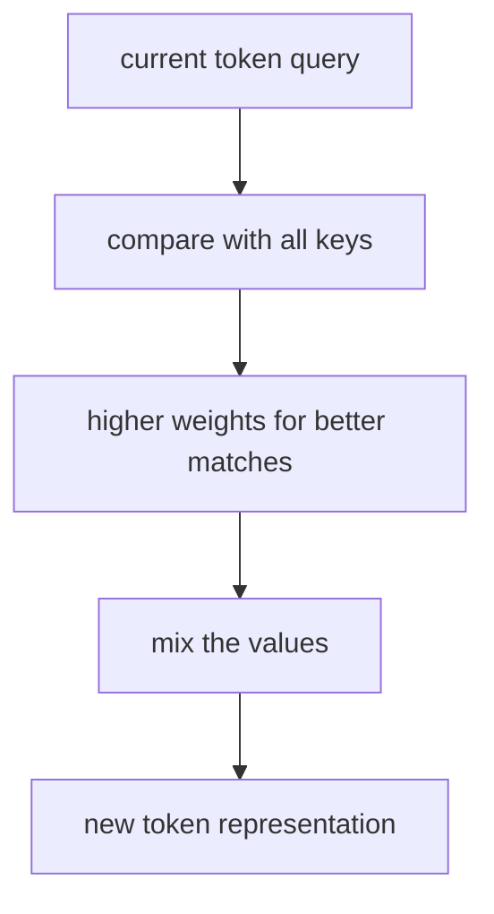
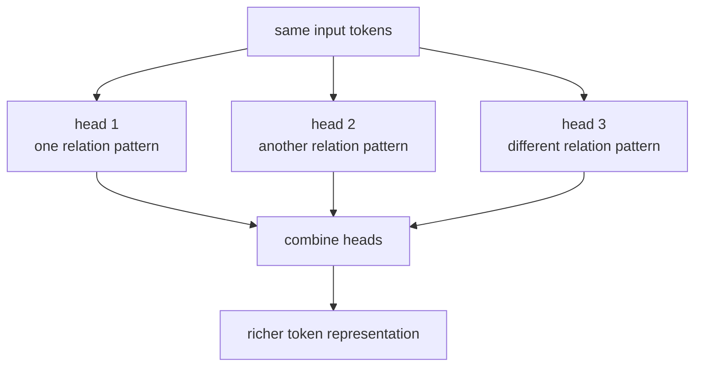

# P4-13.3 보충학습: query, key, value와 multi-head attention

P4-13.1과 P4-13.2에서는 attention과 self-attention의 직관을 먼저 잡았습니다. 그런데 여기까지 읽으면 자연스럽게 다음 질문이 생깁니다.

그렇다면 attention이 실제 계산에서는 `query`, `key`, `value`로 왜 설명되며, `multi-head attention`은 왜 따로 이름이 붙는가?

이 보충학습은 그 질문에 입문 수준으로 답합니다.

## 이 보충학습의 범위

이 보충학습은 다음 질문에 답합니다.

- query, key, value는 무엇을 뜻하나?
- 왜 self-attention 계산을 이 세 이름으로 나누어 설명하나?
- multi-head attention은 무엇을 여러 번 본다는 뜻인가?
- Transformer를 읽을 때 이 개념을 어느 정도까지 이해하면 충분한가?

이 보충학습에서는 다음 내용을 깊게 다루지 않습니다.

- 행렬 차원 변화의 엄밀한 전개
- scaled dot-product attention의 수식 유도 전체
- 구현 최적화와 성능 튜닝 세부

차원 전개와 구현 최적화는 이 책의 현재 본편 범위 밖에 둡니다. 대신 여기서는 `왜 이런 이름을 쓰는가`, `한 head와 여러 head의 차이를 어떻게 직관적으로 읽는가`를 붙잡는 데 집중합니다.

지금 읽는 층위는 `참조 계산 이름의 보강 층위`입니다. 앞 절의 attention과 self-attention이 `필요한 위치를 다시 찾아본다`는 구조 직관을 다뤘다면, 여기서는 그 직관이 왜 query, key, value와 multi-head라는 이름으로 다시 설명되는지 보강합니다. 바로 다음 Transformer 절에서는 이 이름들이 실제 블록 구조 안에서 어떻게 반복 등장하는지로 질문이 더 구체화됩니다.

처음 읽을 때는 이 보충학습을 `attention 직관`과 `Transformer에서 반복 나오는 이름`을 연결하는 손잡이로만 잡고, 수식 전개와 구현 최적화는 본편 바깥으로 넘겨 두는 편이 가장 안전합니다.

| 지금 단계의 손잡이 | 바로 다음에 이어질 질문 | 뒤에서 본격적으로 다시 읽는 위치 |
| --- | --- | --- |
| attention / self-attention 직관 | 필요한 위치를 어떻게 다시 찾아 참고하는가? | P4-13.1, P4-13.2 |
| QKV / multi-head 이름 | 그 참조 계산을 왜 query, key, value와 여러 head로 설명하는가? | P4-13.3 |
| Transformer 블록 연결 | 이 이름들이 실제 블록 구조 안에서 어떤 핵심 부품으로 반복되는가? | P4-14.1 |

이 보충학습의 핵심은 `새 수식을 더 외우는가`가 아니라, 이미 잡은 attention 직관을 `QKV`와 `multi-head`라는 반복 이름으로 다시 읽게 만드는 데 있습니다.

## 이 보충학습의 목표

- query, key, value를 입문 수준에서 설명할 수 있습니다.
- self-attention을 `질문하고, 맞는 위치를 찾고, 그 정보를 가져오는 계산`으로 읽을 수 있습니다.
- multi-head attention을 `관계를 한 종류로만 보지 않고 여러 관점으로 나누어 본다`는 뜻으로 설명할 수 있습니다.
- Transformer 절을 다시 읽을 때 QKV와 multi-head가 어디에 놓이는지 떠올릴 수 있습니다.

## 이 보충학습을 읽는 순서

이 보충학습은 다음 순서로 읽으면 충분합니다.

1. 먼저 query, key, value를 일상적인 `질문-색인-내용` 비유로 읽습니다.
2. 그 다음 self-attention 안에서 각 토큰이 이 세 역할을 어떻게 갖는지 봅니다.
3. 이어서 왜 한 번만 보지 않고 여러 head로 나누는지 읽습니다.
4. 마지막에 Transformer 본문과 어떻게 연결되는지 정리합니다.

## 먼저 아주 짧은 비유로 보면

query, key, value는 다음처럼 비유할 수 있습니다.

| 이름 | 입문용 직관 |
| --- | --- |
| query | 지금 무엇을 찾고 싶은가 |
| key | 각 위치가 어떤 정보인지 붙어 있는 표지 |
| value | 실제로 가져올 내용 |

도서관 비유로 다시 쓰면 다음과 같습니다.

- query: `나는 지금 역사 책을 찾고 싶다`
- key: `각 책 카드에는 역사, 과학, 소설 같은 표지가 붙어 있다`
- value: `실제로 읽어 가져갈 책 내용`

즉, attention은 `지금 필요한 질문(query)`에 맞춰 `어울리는 표지(key)`를 가진 위치를 찾고, 거기서 `실제 내용(value)`을 더 많이 가져오는 계산이라고 보면 됩니다.

## self-attention 안에서는 무엇이 달라지나

P4-13.2에서는 self-attention을 `같은 시퀀스 안 토큰들이 서로를 참고해 표현을 다시 계산하는 방식`이라고 설명했습니다. 여기서 QKV를 붙이면 같은 말을 조금 더 계산 친화적으로 다시 쓰게 됩니다.

- 현재 토큰은 `나는 지금 무엇이 필요한가`라는 query를 냅니다.
- 모든 토큰은 `나는 어떤 정보인가`라는 key를 가집니다.
- 모든 토큰은 `내가 실제로 줄 수 있는 내용은 무엇인가`라는 value를 가집니다.

즉, 현재 토큰은 자기 query와 다른 토큰들의 key를 비교해 `누구를 더 참고할지`를 정하고, 그다음 그 토큰들의 value를 가중 평균해 새 표현을 만듭니다.

이 흐름을 아주 단순하게 그리면 다음과 같습니다.



이 도식은 다음처럼 읽으면 충분합니다.

1. 현재 토큰이 질문을 던집니다.
2. 그 질문이 어떤 토큰 표지와 더 잘 맞는지 비교합니다.
3. 잘 맞는 위치에 더 큰 비중을 줍니다.
4. 그 위치들의 실제 내용(value)을 더 많이 섞어 새 표현을 만듭니다.

## 왜 굳이 key와 value를 나누나

입문 독자는 여기서 `어차피 토큰 하나인데 왜 key와 value를 따로 부르지?`라는 질문이 자연스럽습니다.

핵심은 `찾는 기준`과 `가져올 내용`의 역할이 다를 수 있기 때문입니다.

예를 들어 회의록에서 `이번 주 결정`을 찾는다고 해 보겠습니다.

- `결정`, `승인`, `보류` 같은 단어는 지금 찾는 기준에 가까운 표지 역할을 합니다.
- 실제로 모델이 가져와야 하는 것은 그 문장 전체가 담고 있는 의미 표현입니다.

즉, key는 `이 위치를 얼마나 참고할지 정하는 데 쓰이는 표지`에 가깝고, value는 `정말 섞어 와서 새 표현을 만들 내용`에 가깝습니다.

이 구분을 한 문장으로 줄이면 다음과 같습니다.

`key는 어디를 볼지 정하는 데 더 가깝고, value는 실제로 무엇을 가져올지에 더 가깝다.`

## 작은 문장으로 다시 보면

```text
고객은 환불을 요청했다. 그러나 주문은 이미 배송되었다.
```

만약 현재 토큰이 `그러나` 뒤 문맥을 이해하려 한다면, query는 `무엇이 지금 대비를 이루는가`를 찾는 질문처럼 작동할 수 있습니다. 이때 `환불 요청`과 `이미 배송`이라는 두 표현이 각각 다른 key를 내고, 현재 query와 더 잘 맞는 위치가 더 큰 비중을 받습니다. 그리고 그 위치의 value가 더 많이 섞여 현재 표현이 업데이트됩니다.

즉, self-attention에서 토큰 하나는 `문장 전체를 다시 훑으며 지금 내 해석에 필요한 단서를 골라 섞는다`고 읽으면 됩니다.

## multi-head attention은 무엇을 여러 번 본다는 뜻인가

이제 다음 질문이 생깁니다.

한 번의 attention이면 충분한데, 왜 `multi-head`가 필요한가?

입문 수준에서는 다음처럼 이해하면 충분합니다.

`한 종류의 관계만 보지 말고, 서로 다른 관점으로 여러 번 관계를 읽어 보자.`

예를 들어 문장에서는 같은 토큰이라도 여러 관계가 함께 중요할 수 있습니다.

- 어떤 head는 주어-동사 관계를 더 잘 볼 수 있습니다.
- 어떤 head는 수식 대상이나 지시어 관계를 더 잘 볼 수 있습니다.
- 어떤 head는 가까운 토큰 결합을, 다른 head는 더 먼 토큰 연결을 더 잘 볼 수 있습니다.

즉, multi-head attention은 `하나의 정답 관계만 보는 대신, 여러 종류의 관련성을 나누어 읽는 장치`라고 생각하면 됩니다.

같은 장면을 한 번만 읽을 때와 여러 관점으로 나눠 읽을 때의 차이를 바로 붙여 두면 더 읽기 쉽습니다.

| 같은 장면 | single-head처럼 한 번만 읽을 때 먼저 남는 것 | multi-head처럼 여러 관점으로 읽을 때 먼저 남는 것 |
| --- | --- | --- |
| 번역 | 가장 눈에 띄는 한 관계만 남고 수식 범위나 예외 조건이 약해질 수 있다 | 주어-동사, 수식 범위, 대비 관계를 나눠 함께 볼 수 있다 |
| 문서 요약 | 결론 한 줄은 남아도 근거나 조건이 함께 약해질 수 있다 | 결론, 근거, 조건을 서로 다른 관련성으로 나눠 보존하기 쉽다 |
| 코드 이해 | 변수명 반복 같은 한 종류 신호에 치우치기 쉽다 | 정의-사용, 조건-결과, 호출 흐름을 다른 관점으로 함께 읽기 쉽다 |

즉, 여기서 핵심은 `attention을 여러 번 반복한다`보다 `서로 다른 관계를 한 번에 잃지 않게 들고 가는가`에 더 가깝습니다.

## 도식으로 보면



이 도식에서 핵심은 `입력이 여러 개로 쪼개진다`가 아니라, `같은 입력을 여러 관점으로 읽은 결과를 다시 합친다`는 점입니다.

## 사례로 보기

### 사례 1. 번역

긴 문장을 번역할 때 사람은 보통 단어 뜻 하나만 맞추면 된다고 느끼기 쉽습니다. 하지만 실제로는 주어-동사 관계, 수식 범위, 부정 표현, 예외 조건이 동시에 중요할 수 있습니다. 예를 들어 한 표현이 `무엇을 꾸미는가`와 `어디에 대비되는가`를 동시에 봐야 제대로 번역되는 장면이 있습니다. 이때 한 번의 attention만으로 모든 관계를 한 종류로만 읽으면 중요한 차이가 섞일 수 있습니다. multi-head attention은 서로 다른 관계를 나누어 읽는다는 직관을 주므로, 번역에서 여러 문법 단서를 함께 반영하는 장면을 설명하기 좋습니다. 그래서 이 사례에서 확인해야 할 결과는 단어 뜻뿐 아니라 수식 범위와 문장 관계까지 함께 반영되는가입니다.

### 사례 2. 문서 요약

긴 보고서를 요약할 때 사람은 결론 문장만 잡으면 충분하다고 느끼기 쉽습니다. 하지만 실제로는 결론, 근거, 조건, 예외가 서로 다른 방식으로 중요할 수 있습니다. 예를 들어 어떤 문장은 `최종 결정`과 직접 연결되고, 다른 문장은 `왜 그런 결정을 했는가`와 더 직접 연결됩니다. 이런 경우 한 종류의 관련성만 보면 결론은 남아도 근거나 조건이 빠질 수 있습니다. multi-head attention은 서로 다른 head가 서로 다른 관련성 패턴을 읽는다고 설명할 수 있어서, 문서 요약에서 결론과 근거가 함께 남는 구조를 이해하는 데 도움이 됩니다. 그래서 이 사례에서 확인해야 할 결과는 결론 문장만 남는 것이 아니라, 그 결론을 지탱하는 근거와 조건도 함께 보존되는가입니다.

### 사례 3. 코드 이해

코드를 읽을 때 사람은 보통 변수명만 맞으면 된다고 느끼기 쉽습니다. 하지만 실제로는 변수 정의-사용 관계, 타입 힌트, 조건 분기, 함수 호출 흐름처럼 여러 종류의 연결이 동시에 중요합니다. 예를 들어 어떤 head는 `같은 변수명 반복`을 더 잘 잡고, 다른 head는 `if 조건과 return 값의 연결`을 더 잘 잡는다고 생각하면 직관이 쉽습니다. 즉, multi-head attention은 코드에서 하나의 선형 읽기보다 여러 관계 패턴을 동시에 참고하는 계산으로 이해할 수 있습니다. 그래서 이 사례에서 확인해야 할 결과는 이름 일치만이 아니라 정의-사용, 조건-결과, 함수-인자 관계까지 함께 유지되는가입니다.

## 실행 가능한 Python 예제로 보기

이번 예제의 목표는 같은 토큰열을 보더라도 head마다 서로 다른 관계를 읽고, 그 결과가 합쳐질 수 있다는 점을 확인하는 것입니다.

입력:

- 세 개의 토큰 표현
- 두 개의 서로 다른 attention 가중치

출력:

- 한 번만 읽은 single-head 문맥
- head 1이 읽은 문맥
- head 2가 읽은 문맥
- 두 head를 합친 최종 표현

문제 상황:

- multi-head attention은 말로만 들으면 추상적이므로, 한 번만 읽은 경우와 여러 관점으로 읽은 경우를 직접 비교해 볼 필요가 있다

확인할 개념:

- 서로 다른 head는 같은 토큰열에서도 다른 관계를 강조할 수 있다
- 여러 head 결과를 합치면 single-head보다 더 풍부한 표현을 만들 수 있다

입력(input):

위에 정리한 세 개의 토큰 표현과 두 종류의 attention 가중치를 사용합니다.

```python
import numpy as np

tokens = np.array([
    [1.0, 0.0],   # token 1
    [0.0, 2.0],   # token 2
    [3.0, 1.0],   # token 3
])

head1_weights = np.array([0.7, 0.2, 0.1])  # 앞쪽 관계를 더 강조
head2_weights = np.array([0.1, 0.3, 0.6])  # 뒤쪽 관계를 더 강조
single_head_weights = np.array([0.4, 0.3, 0.3])  # 하나의 절충된 읽기

single_head_context = single_head_weights @ tokens
head1_context = head1_weights @ tokens
head2_context = head2_weights @ tokens
combined = np.concatenate([head1_context, head2_context])

print("tokens =")
print(tokens)
print()
print("single_head_context =", np.round(single_head_context, 3).tolist())
print("head1_context =", np.round(head1_context, 3).tolist())
print("head2_context =", np.round(head2_context, 3).tolist())
print("combined =", np.round(combined, 3).tolist())
print(
    "difference_from_single =",
    np.round(combined - np.concatenate([single_head_context, single_head_context]), 3).tolist(),
)
```

실행 결과 예시는 다음처럼 읽을 수 있습니다.

```text
tokens =
[[1. 0.]
 [0. 2.]
 [3. 1.]]

single_head_context = [1.3, 0.9]
head1_context = [1.0, 0.5]
head2_context = [1.9, 1.2]
combined = [1.0, 0.5, 1.9, 1.2]
difference_from_single = [-0.3, -0.4, 0.6, 0.3]
```

이 결과에서 읽어야 할 핵심은 다음입니다.

- single-head는 앞쪽 관계와 뒤쪽 관계를 한 번에 절충해 `[1.3, 0.9]` 하나로만 남깁니다
- head1은 앞쪽 토큰 영향이 큰 문맥을 읽습니다
- head2는 뒤쪽 토큰 영향이 큰 문맥을 읽습니다
- 최종 표현은 한 번의 attention 결과가 아니라, 여러 관점으로 읽은 문맥을 함께 들고 갈 수 있습니다
- `difference_from_single`은 multi-head 결과가 단일 절충 표현 하나로는 살리기 어려운 차이를 양쪽 방향으로 따로 보존하고 있음을 보여 줍니다

실제 multi-head attention은 이후 선형 변환까지 포함해 더 정교하게 결합되지만, 입문 단계에서는 `서로 다른 관계 읽기 결과를 나란히 유지한다`는 감각을 잡으면 충분합니다.

## 이 예제를 여러 관계 보존 관점으로 다시 보면

앞의 숫자는 실제 대규모 multi-head attention 전체를 구현한 것은 아니지만, 비교 기준은 분명합니다.

- single-head는 여러 관계를 한 번에 평균내며 하나의 절충된 문맥으로 남깁니다.
- multi-head는 서로 다른 관계 읽기 결과를 나란히 유지한 뒤 나중에 함께 씁니다.

즉, multi-head attention은 단순히 `attention을 여러 번 반복한다`는 뜻이 아니라, `서로 다른 종류의 관련성 패턴을 동시에 잃지 않게 들고 간다`는 뜻에 더 가깝습니다. 이 감각이 잡혀야 다음 `P4-14.1 Transformer`에서 multi-head attention이 왜 핵심 부품으로 반복 등장하는지도 자연스럽게 읽을 수 있습니다.

## Part 4 흐름에서 왜 중요한가

이 보충학습은 attention 절과 Transformer 절 사이에 끼어 있는 세부 구현 메모가 아닙니다. 오히려 본편에서 이미 잡은 직관을 `왜 이런 이름과 구조가 붙는가`로 연결해 주는 회수 위치입니다.

- P4-13.1의 attention 직관을 QKV라는 계산 언어로 다시 읽게 하고
- P4-13.2의 self-attention을 `질문-비교-가져오기` 구조로 더 구체화하며
- P4-14.1의 Transformer 블록에서 multi-head attention이 왜 핵심 부품으로 등장하는지 이해하게 합니다

즉, 이 보충학습은 `수식을 다 아는가`보다 `이름이 왜 그렇게 붙었는가`를 설명하는 자리입니다.

Part 4 기준에서는 이 보충학습을 유지하는 이유도 여기 있습니다. attention과 self-attention의 핵심 직관은 이미 본문에서 닫았지만, QKV와 multi-head라는 이름이 Transformer 본문에서 반복 등장하므로, 이 절은 본문을 대신하는 수식 메모가 아니라 `이름을 다시 읽어 주는 입문 회수 위치`로 남겨 두는 편이 더 적절합니다.

## 이 보충학습에서 기억할 관점

- query는 지금 무엇을 찾고 싶은지에 가깝습니다.
- key는 각 위치가 어떤 정보인지 알려 주는 표지에 가깝습니다.
- value는 실제로 가져와 섞을 내용에 가깝습니다.
- multi-head attention은 한 종류의 관계만 보지 않고 여러 관점의 관련성을 함께 읽는 방식입니다.

## 체크리스트

- query, key, value를 입문 수준에서 설명할 수 있는가?
- self-attention을 `질문 -> 비교 -> 가져오기` 흐름으로 읽을 수 있는가?
- key와 value를 왜 굳이 나누는지 설명할 수 있는가?
- multi-head attention을 `여러 관계 관점`으로 설명할 수 있는가?

## 출처와 참고 자료

- Ashish Vaswani et al., `Attention Is All You Need`, NeurIPS 2017, 확인 날짜: 2026-06-30.
- Jay Alammar, `The Illustrated Transformer`, 확인 날짜: 2026-06-30. [https://jalammar.github.io/illustrated-transformer/](https://jalammar.github.io/illustrated-transformer/){: target="_blank" rel="noopener noreferrer" }
- Ian Goodfellow, Yoshua Bengio, Aaron Courville, `Deep Learning`, MIT Press, 2016, 확인 날짜: 2026-06-30. [https://www.deeplearningbook.org/](https://www.deeplearningbook.org/){: target="_blank" rel="noopener noreferrer" }
