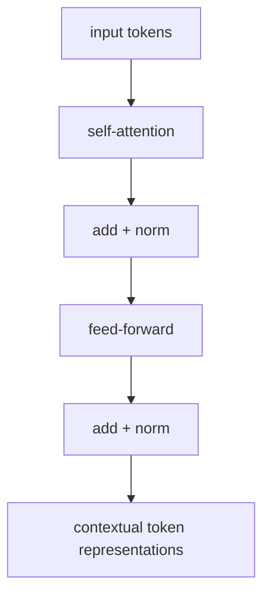

# P4-14.1 Transformer의 기본 구성

P4-13.2에서는 self-attention이 같은 시퀀스 내부 토큰들이 서로를 직접 참고하는 방식이며, Transformer의 핵심 발상으로 이어진다고 설명했습니다. 여기서 다음 질문이 생깁니다.

그렇다면 Transformer는 self-attention 하나만 있는 구조인가, 아니면 그 주변에 어떤 기본 구성 요소들이 함께 있는가?

이 절은 그 질문에 답합니다.

Transformer는 self-attention으로 문맥 관계를 읽고, feed-forward 네트워크로 각 위치 표현을 다시 가공하며, residual connection과 layer normalization으로 학습을 안정화하는 구조로 이해할 수 있다.

## 이 절의 범위

이 절은 다음 질문에 답합니다.

- Transformer의 핵심 블록은 무엇으로 이루어지는가?
- self-attention, feed-forward, residual connection, layer normalization은 각각 어떤 역할을 하나?
- 왜 이 구조가 RNN 이후 큰 전환점처럼 보였는가?
- encoder/decoder 세부 이전에 어떤 큰 지도를 먼저 잡아야 하는가?

이 절에서는 다음 내용을 깊게 다루지 않습니다.

- multi-head attention의 수식 전개
- positional encoding의 상세 수학
- encoder-only, decoder-only, encoder-decoder 계열의 세부 아키텍처 분화

multi-head attention의 수식 전개와 positional encoding의 상세 수학은 여기서 다루지 않습니다. 대신 병렬 처리와 긴 문맥의 장점은 P4-14.2에서 이어서 다루고, encoder-only, decoder-only, encoder-decoder의 실제 분화는 Part 5의 P5-3.1, P5-19.1, P5-4.1에서 다시 회수합니다. 세부 아키텍처 분화와 수식 전개는 이 책의 현재 본편 범위 밖에 둡니다.

여기서는 Transformer 논문 전체를 따라가기보다, 블록 수준에서 무엇이 결합되어 있는지 먼저 잡습니다.

## 이 절의 목표

- Transformer를 self-attention 하나가 아니라 여러 핵심 부품의 조합으로 설명할 수 있습니다.
- 각 부품이 문맥 읽기, 표현 가공, 학습 안정화 중 어떤 역할을 하는지 말할 수 있습니다.
- 이후 Part 5의 P5-3.1, P5-19.1, P5-4.1에서 LLM 구조를 다시 볼 때 기본 블록을 떠올릴 수 있습니다.
- 작은 Python 예제로 토큰 표현이 여러 단계를 거쳐 바뀌는 흐름을 직관적으로 확인할 수 있습니다.

## Transformer를 아주 큰 그림으로 보면

먼저 다음 네 요소만 확실히 잡아도 충분합니다.

1. self-attention
2. feed-forward network
3. residual connection
4. layer normalization

이 네 가지를 간단히 말하면:

- self-attention: 서로 어떤 토큰을 참고할지 정한다
- feed-forward: 각 위치 표현을 더 가공한다
- residual connection: 원래 정보 흐름을 함께 남긴다
- layer normalization: 값의 스케일을 다루며 학습을 안정화한다

즉, Transformer는 `문맥 관계를 읽고 -> 표현을 가공하고 -> 정보 흐름을 안정적으로 유지하는 블록`의 반복 구조라고 볼 수 있습니다.

먼저 독자가 잡아야 할 역할 분담을 표로 다시 보면 다음과 같습니다.

| 구성 요소 | 먼저 잡아야 할 역할 |
| --- | --- |
| self-attention | 다른 토큰과의 관계를 읽는다 |
| feed-forward | 각 위치 표현을 다시 가공한다 |
| residual connection | 원래 정보 흐름을 함께 남긴다 |
| layer normalization | 값 범위를 정리해 학습을 덜 흔들리게 한다 |

## self-attention은 무엇을 담당하나

P4-13장에서 본 것처럼 self-attention은 각 토큰이 다른 토큰들을 서로 참고해 문맥적 표현을 다시 계산하는 역할을 합니다.

다음처럼 기억하면 좋습니다.

`self-attention은 지금 이 토큰을 이해하기 위해 문장 안의 어디를 더 봐야 하는지 정하는 장치다.`

즉, Transformer의 첫 핵심은 `관계 읽기`입니다.

## feed-forward network는 왜 필요한가

self-attention만으로는 토큰 간 관계를 읽을 수 있지만, 각 위치 표현을 더 비선형적으로 가공하는 과정도 필요합니다. 여기서 feed-forward network가 등장합니다.

다음처럼 설명하면 충분합니다.

`attention이 다른 토큰과의 관계를 반영해 문맥을 섞는다면, feed-forward는 각 위치의 표현을 더 풍부하게 다시 가공하는 작은 MLP처럼 볼 수 있다.`

즉, Transformer는 관계를 읽는 것과, 그 결과를 각 위치에서 다시 변환하는 것을 분리해 놓았습니다.

## residual connection은 왜 필요한가

딥러닝에서 층이 깊어질수록 정보가 지나치게 바뀌거나 학습이 불안정해질 수 있습니다. residual connection은 이전 표현을 다음 단계로 함께 흘려 보내는 장치로 볼 수 있습니다.

다음처럼 이해하면 충분합니다.

`완전히 새 계산만 믿지 말고, 원래 입력 표현도 함께 남겨 다음 단계로 보내는 안전장치`

즉, residual connection은 정보 손실을 줄이고 학습을 더 안정적으로 만드는 데 도움이 됩니다.

## layer normalization은 왜 등장하나

여러 층과 큰 행렬 연산을 반복하면 값의 스케일과 분포가 학습 안정성에 영향을 줄 수 있습니다. layer normalization은 각 위치 표현을 더 다루기 쉬운 범위로 정리해 학습을 돕는 장치로 이해하면 좋습니다.

다음 정도로 설명하면 충분합니다.

`layer normalization은 표현값의 크기와 분포를 정리해, 다음 계산이 덜 흔들리도록 돕는 장치다.`

즉, Transformer는 단지 `강한 attention`만이 아니라, `깊은 학습을 견디게 하는 안정화 장치들`도 함께 갖추고 있습니다.

## 이를 아주 단순하게 그리면



이 도식은 Transformer 블록 하나를 입문 수준에서 압축한 것입니다.

## 왜 이 구성이 중요했나

Transformer가 큰 전환점처럼 보인 이유는 단순히 새로운 층 하나를 추가했기 때문이 아닙니다. 핵심은 다음이 함께 결합되었다는 점입니다.

- attention 중심의 문맥 참조
- 병렬 계산과 잘 맞는 구조
- 깊은 네트워크를 안정적으로 반복할 수 있는 블록 설계

즉, Transformer는 `sequence modeling의 핵심 계산 방식`과 `대규모 학습 구조`를 동시에 바꾼 아키텍처였습니다.

## 사례로 보기

### 사례 1. 번역

긴 문장을 번역할 때를 생각해 볼 수 있습니다. 사람은 단순히 왼쪽에서 오른쪽으로 읽으며 바로 옮기면 된다고 느끼기 쉽지만, 문장 뒤에 나온 조건절이나 목적어 때문에 앞부분 해석을 다시 바꿔야 하는 경우가 자주 생깁니다. 예전 순차 구조에서는 이런 먼 문맥을 끝까지 안정적으로 끌고 가는 일이 특히 어려웠습니다. Transformer 블록은 각 위치가 문장 전체 다른 위치를 함께 참조하며 표현을 다시 만들 수 있게 해, 앞 단어와 뒤 단어의 관계를 한 번에 더 넓게 반영합니다. 그래서 긴 문장에서 번역 방향을 뒤늦게 수정해야 하던 부담을 줄이는 데 중요한 전환점이 되었습니다. 이 사례에서 확인해야 할 결과는 문장 끝에 나온 조건이나 목적어가 앞부분 번역 해석까지 실제로 반영되는가입니다.

### 사례 2. 문서 요약

긴 회의록을 요약한다고 해 봅시다. 사람이 급하게 요약할 때는 제목, 첫 문단, 마지막 문장 같은 일부 위치에 더 크게 기대기 쉽습니다. 하지만 실제 핵심 결정은 중간 문단의 짧은 발언이나 앞뒤에 흩어진 조건 문장에 숨어 있을 수 있습니다. 예를 들어 결론은 마지막에 적혀 있어도, 그 결론이 유효한 조건은 앞쪽 논의에 들어 있을 수 있습니다. Transformer 블록은 문서 전체 여러 위치를 함께 참고하며 각 위치 표현을 반복적으로 갱신할 수 있어서, 멀리 떨어진 관련 문장을 더 쉽게 같은 요약 판단 안에 묶습니다. 그래서 이 사례에서 확인해야 할 결과는 제목과 마지막 문장만 남는 것이 아니라, 중간 조건 문장까지 함께 반영된 요약이 나오는가입니다.

### 사례 3. 코드 생성과 LLM

코드 생성에서 함수 시작부의 인자 이름과 아래쪽 반환 로직이 멀리 떨어져 있는 장면을 떠올려 볼 수 있습니다. 사람은 바로 앞 몇 줄만 보며 이어 써도 될 것처럼 느끼기 쉽지만, 그렇게 쓰면 위에서 쓴 변수 이름과 아래에서 참조하는 이름이 어긋나거나, 열어 둔 조건 분기와 닫는 구조가 맞지 않기 쉽습니다. 예를 들어 함수 초반에 `user_id`를 받았는데 뒤쪽에서 갑자기 `account_id`로 바꿔 쓰면, 앞뒤 맥락이 연결되지 않아 코드가 어색해집니다. 긴 자연어 생성도 마찬가지로, 앞에서 세운 제약과 뒤 문장에서 이어질 설명이 멀리 떨어져 연결됩니다. Transformer 블록은 이런 멀리 떨어진 토큰 관계를 반복적으로 반영하며 각 위치의 표현을 갱신합니다. 그래서 이 사례에서 확인해야 할 결과는 변수명 일관성, 조건 분기 연결, 함수 정의와 호출부 대응이 실제 출력 코드에서 끝까지 유지되는가입니다.

세 사례를 한 줄로 묶으면 다음과 같습니다.

| 상황 | Transformer 블록이 중요한 이유 |
| --- | --- |
| 번역 | 문장 전체 관계를 반복적으로 반영할 수 있어서 |
| 문서 요약 | 관련 위치를 넓게 참조하고 표현을 다시 가공할 수 있어서 |
| 코드/LLM | 멀리 떨어진 토큰 관계를 여러 블록에 걸쳐 갱신할 수 있어서 |

## 작은 Python 예제로 보기

이번 예제의 목표는 Transformer 블록의 전체 수식을 구현하는 것이 아니라, `토큰 표현이 관계 반영 -> 위치별 가공`의 두 단계를 거친다는 감각을 확인하는 것입니다.

입력:

- 세 개의 토큰 표현
- 간단한 attention-style 가중치
- 위치별 선형 변환

출력:

- 문맥 반영 후 표현
- feed-forward 후 표현

```python
import numpy as np

tokens = np.array([
    [1.0, 0.0],
    [0.5, 1.0],
    [0.0, 1.5],
])

attention_weights = np.array([
    [0.6, 0.3, 0.1],
    [0.2, 0.5, 0.3],
    [0.1, 0.3, 0.6],
])

contextual = attention_weights @ tokens

ff_weights = np.array([
    [1.2, 0.2],
    [0.1, 1.1],
])

ff_output = contextual @ ff_weights

print("contextual =")
print(np.round(contextual, 3))
print("ff_output =")
print(np.round(ff_output, 3))
```

실행 결과 예시는 다음처럼 읽을 수 있습니다.

```text
contextual =
[[0.75 0.45]
 [0.45 0.95]
 [0.25 1.2 ]]
ff_output =
[[0.945 0.645]
 [0.635 1.135]
 [0.42  1.37 ]]
```

이 예제에서 읽어야 할 핵심은 다음입니다.

- attention 단계는 여러 토큰 정보를 섞어 문맥적 표현을 만들고
- feed-forward 단계는 그 표현을 위치별로 다시 가공합니다

실제 Transformer는 이보다 훨씬 복잡하지만, 큰 흐름은 이 두 단계와 안정화 장치들의 반복으로 이해할 수 있습니다.

## 역사와 커리큘럼 관점

Transformer는 attention이 보조 장치에서 핵심 블록으로 승격된 사례입니다. 그리고 이 블록 설계가 이후 LLM, 멀티모달 모델, 대규모 생성형 AI 구조의 사실상 기본 언어가 되었습니다.

커리큘럼 관점에서 이 절은 매우 중요합니다.

- 바로 앞의 P4-13.1, P4-13.2에서 본 attention과 self-attention을 실제 모델 블록 구조로 묶어 읽게 하고
- Part 4의 딥러닝 구조를 현대 아키텍처로 연결하고
- Part 5의 LLM 구조 설명을 위한 최소 공통 블록을 제공하며
- self-attention을 실제 시스템 블록으로 재해석하게 만들기 때문입니다

즉, 이 절은 `Transformer를 공식 집합이 아니라 블록 구조로 읽게 만드는 절`입니다.

## 다음 절과의 연결

여기까지 오면 다음 질문이 남습니다.

- Transformer는 왜 RNN보다 병렬 처리에 더 잘 맞는가?
- 긴 문맥(long context)을 다룰 때 어떤 차이가 크게 드러나는가?

이 질문은 바로 P4-14.2 병렬 처리와 긴 문맥으로 이어집니다.

## 이 절에서 기억할 관점

- Transformer를 읽을 때는 self-attention이 문맥 관계를 모으고, feed-forward가 표현을 가공하며, residual과 normalization이 깊은 계산을 안정화하는 블록 조합으로 구분해 보면 됩니다.
- self-attention은 문맥 관계를 읽고, feed-forward는 표현을 다시 가공합니다.
- residual과 normalization은 깊은 학습을 안정화하는 역할을 합니다.
- 이 블록 구조를 이해하면 이후 LLM 설명에서도 어떤 부분이 문맥 읽기이고 어떤 부분이 표현 가공과 안정화인지 구분할 수 있습니다.

## 체크리스트

- Transformer의 기본 구성 요소를 말할 수 있는가?
- 각 구성 요소의 역할을 한 문장씩 설명할 수 있는가?
- self-attention과 feed-forward의 차이를 설명할 수 있는가?
- 다음 절의 병렬 처리와 긴 문맥으로 왜 자연스럽게 이어지는지 설명할 수 있는가?

## 출처와 참고 자료

- Ashish Vaswani et al., `Attention Is All You Need`, NeurIPS 2017, 확인 날짜: 2026-06-29.
- Ian Goodfellow, Yoshua Bengio, Aaron Courville, `Deep Learning`, MIT Press, 2016, 확인 날짜: 2026-06-29. [https://www.deeplearningbook.org/](https://www.deeplearningbook.org/){: target="_blank" rel="noopener noreferrer" }
- Jay Alammar, `The Illustrated Transformer`, 확인 날짜: 2026-06-29. [https://jalammar.github.io/illustrated-transformer/](https://jalammar.github.io/illustrated-transformer/){: target="_blank" rel="noopener noreferrer" }
