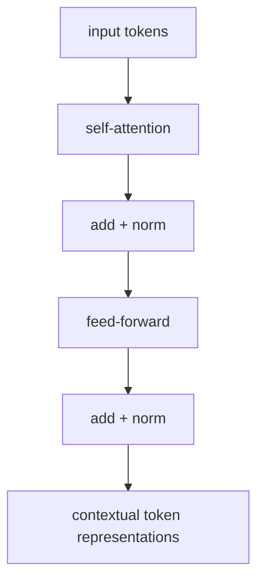
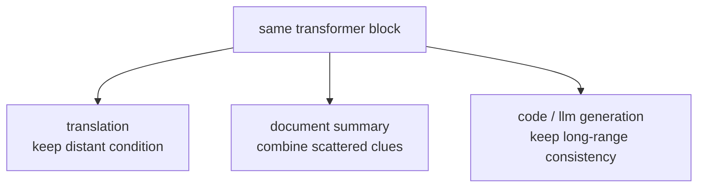

# P4-14.1 Transformer의 기본 구성

P4-13.2에서는 self-attention이 같은 시퀀스 내부 토큰들이 서로를 직접 참고하는 방식이며, Transformer의 핵심 발상으로 이어진다고 설명했습니다. 여기서 다음 질문이 생깁니다.

그렇다면 Transformer는 self-attention 하나만 있는 구조인가, 아니면 그 주변에 어떤 기본 구성 요소들이 함께 있는가?

이 절은 그 질문에 답합니다.

Transformer는 self-attention으로 문맥 관계를 읽고, feed-forward 네트워크로 각 위치 표현을 다시 가공하며, residual connection과 layer normalization으로 그 계산 블록을 무너지지 않게 이어 가는 구조로 이해할 수 있다.

## 이 절의 범위

이 절은 다음 질문에 답합니다.

- Transformer의 핵심 블록은 무엇으로 이루어지는가?
- self-attention, feed-forward, residual connection, layer normalization은 각각 어떤 역할을 하나?
- 왜 이 구조가 RNN 이후 큰 전환점처럼 보였는가?
- encoder/decoder 세부 이전에 어떤 큰 지도를 먼저 잡아야 하는가?

이 절에서 먼저 닫아야 하는 핵심은 `Transformer는 self-attention이라는 한 아이디어가 아니라, 문맥 읽기와 표현 가공, 블록 유지 장치를 한 묶음으로 가진 구조`라는 점입니다.

처음 읽을 때는 이 절을 `구조 축`으로만 고정해 두면 덜 흔들립니다.

| 지금 이 절에서 읽는 것 | 아직 다음 절로 넘기는 것 |
| --- | --- |
| self-attention, feed-forward, residual, normalization이 한 블록 안에서 어떻게 역할을 나누는가 | 그 블록이 병렬 처리, 긴 문맥 비용, 계산 규모에서 무엇을 바꾸는가 |
| 블록 내부의 관계 읽기와 표현 가공 | 대규모 학습 절차와 long-context 최적화 |

이 절에서는 다음 내용을 깊게 다루지 않습니다.

- multi-head attention의 수식 전개
- positional encoding의 상세 수학
- encoder-only, decoder-only, encoder-decoder 계열의 세부 아키텍처 분화

multi-head attention과 query, key, value의 입문적 설명은 보충학습 P4-13.3에서 회수합니다. 대신 병렬 처리와 긴 문맥의 장점은 P4-14.2에서 이어서 다루고, encoder-only, decoder-only, encoder-decoder의 세부 분화는 뒤 Part에서 다시 비교합니다. 더 깊은 세부 아키텍처 분화와 수식 전개는 이 책의 현재 본편 범위 밖에 둡니다.

여기서는 Transformer 논문 전체를 따라가기보다, 블록 수준에서 무엇이 결합되어 있는지 먼저 잡습니다.

## 이 절의 목표

- Transformer를 self-attention 하나가 아니라 여러 핵심 부품의 조합으로 설명할 수 있습니다.
- 각 부품이 문맥 읽기, 표현 가공, 학습 안정화 중 어떤 역할을 하는지 말할 수 있습니다.
- 이후 다른 모델 계열을 볼 때도 Transformer의 기본 블록을 떠올릴 수 있습니다.
- 실행 가능한 Python 예제로 토큰 표현이 여러 단계를 거쳐 바뀌는 흐름을 직관적으로 확인할 수 있습니다.

## 이 절을 읽는 순서

이 절은 다음 순서로 읽으면 흐름이 잘 잡힙니다.

1. 먼저 P4-13.2에서 본 self-attention이 Transformer 안에서 어느 자리에 놓이는지 확인합니다.
2. 그 다음 self-attention, feed-forward, residual, layer normalization의 역할을 나눠 읽습니다.
3. 이어서 이 부품들이 왜 하나의 반복 블록으로 묶였는지 봅니다.
4. 마지막에 왜 이 블록 구조가 이후 생성 모델의 기본 단위가 되었는지 정리합니다.

## Transformer를 아주 큰 그림으로 보면

먼저 다음 네 요소만 확실히 잡아도 충분합니다.

1. self-attention
2. feed-forward network
3. residual connection
4. layer normalization

이 네 가지를 간단히 말하면:

- self-attention: 서로 어떤 토큰을 참고할지 정한다
- feed-forward: 각 위치 표현을 더 가공한다
- residual connection: 원래 정보 흐름을 함께 남긴다
- layer normalization: 값의 스케일을 다루며 학습을 안정화한다

즉, Transformer는 `문맥 관계를 읽고 -> 표현을 가공하고 -> 정보 흐름을 안정적으로 유지하는 블록`의 반복 구조라고 볼 수 있습니다.

이 절에서는 아래 세 줄만 먼저 구분하면 됩니다.

| 지금 이 절에서 먼저 못 박을 것 | 아직 여기서 끝내지 않는 것 | 바로 다음 절로 넘길 것 |
| --- | --- | --- |
| self-attention, feed-forward, residual, normalization이 한 블록을 이룬다 | GPU 규모, 긴 문맥 비용, long-context 최적화를 다 설명하지 않는다 | 그 블록이 실제 계산 규모에서 무엇을 바꾸는지 |
| 블록 내부 역할 분담을 읽는다 | 대규모 학습과 서비스 확장 문제를 닫지 않는다 | P4-14.2의 병렬 처리와 긴 문맥 |

역할 분담을 표로 다시 보면 다음과 같습니다.

| 구성 요소 | 먼저 잡아야 할 역할 |
| --- | --- |
| self-attention | 다른 토큰과의 관계를 읽는다 |
| feed-forward | 각 위치 표현을 다시 가공한다 |
| residual connection | 원래 정보 흐름을 함께 남긴다 |
| layer normalization | 값 범위를 정리해 학습을 덜 흔들리게 한다 |

여기서 초심자가 가장 자주 섞어 읽는 두 질문을 바로 갈라 두면 다음 절과의 경계가 더 선명해집니다.

| 지금 이 절에서 답하는 질문 | 아직 다음 절로 넘기는 질문 |
| --- | --- |
| `한 블록 안에서 attention, feed-forward, residual, normalization이 어떻게 역할을 나누는가` | `그 블록을 많이 반복할 때 왜 GPU 병렬 처리와 긴 문맥 계산에서 유리해지는가` |
| `표현이 어떤 순서로 읽히고 가공되는가` | `계산량, 처리 속도, 긴 문맥 비용이 어떻게 달라지는가` |

같은 토큰 표현 하나를 따라가며 보면, 각 부품의 역할 차이가 더 직접 보입니다.

| 같은 장면 | 먼저 봐야 할 부품 | 그 부품이 바로 하는 일 |
| --- | --- | --- |
| 현재 토큰이 문장 안 어디를 더 참고할지 정할 때 | self-attention | 다른 위치와의 관계를 읽어 필요한 문맥을 모은다 |
| 모아 온 문맥이 섞인 현재 표현을 더 다듬을 때 | feed-forward | 현재 위치 표현을 한 번 더 가공해 특징을 풍부하게 만든다 |
| 새 계산이 원래 입력 흐름을 너무 덮어쓰지 않게 할 때 | residual connection | 이전 표현을 함께 남겨 정보 흐름을 이어 준다 |
| 다음 계산으로 넘기기 전에 값 범위를 정리할 때 | layer normalization | 표현 크기와 분포를 정리해 계산을 덜 흔들리게 한다 |

P4-13.2를 `토큰들이 서로를 참고하는 계산`의 절로 읽었다면, 이 절은 그 계산이 실제 모델 안에서 `어떤 보조 부품들과 함께 한 블록을 이루는가`를 보여 주는 절이라고 보면 됩니다.

여기서 독자가 특히 붙잡아야 할 것은 `부품이 따로따로 흩어져 있는 구조`가 아니라는 점입니다. Transformer는 보통 다음 질문 순서로 한 블록을 읽으면 가장 이해가 쉽습니다.

1. 지금 토큰이 다른 토큰 중 어디를 더 참고할까?
2. 그렇게 모인 문맥을 현재 위치 표현에 어떻게 다시 반영할까?
3. 그 표현을 각 위치에서 한 번 더 가공할까?
4. 이 과정에서 원래 정보와 안정성을 어떻게 유지할까?

즉, Transformer 블록은 `관계 읽기 -> 위치별 가공 -> 안정적 전달`의 묶음으로 읽는 편이 초심자에게 더 자연스럽습니다.

## self-attention은 무엇을 담당하나

P4-13장에서 본 것처럼 self-attention은 각 토큰이 다른 토큰들을 서로 참고해 문맥적 표현을 다시 계산하는 역할을 합니다.

`self-attention은 지금 이 토큰을 이해하기 위해 문장 안의 어디를 더 봐야 하는지 정하는 장치다.`

핵심은 `관계 읽기`입니다.

## feed-forward network는 왜 필요한가

self-attention만으로는 토큰 간 관계를 읽을 수 있지만, 각 위치 표현을 더 비선형적으로 가공하는 과정도 필요합니다. 여기서 feed-forward network가 등장합니다.

다음처럼 설명하면 충분합니다.

`attention이 다른 토큰과의 관계를 반영해 문맥을 섞는다면, feed-forward는 각 위치의 표현을 더 풍부하게 다시 가공하는 작은 MLP처럼 볼 수 있다.`

이 차이는 한 토큰만 놓고 봐도 읽을 수 있습니다. self-attention 단계는 `이 토큰이 다른 토큰에게서 무엇을 받아올까?`를, feed-forward 단계는 `받아온 문맥이 섞인 현재 표현을 이 위치에서 어떻게 다시 다듬을까?`를 묻습니다. 즉, attention은 `바깥과의 관계`, feed-forward는 `현재 위치 안에서의 가공`에 더 가깝다고 이해하면 됩니다.

## residual connection은 왜 필요한가

딥러닝에서 층이 깊어질수록 정보가 지나치게 바뀌거나 학습이 불안정해질 수 있습니다. residual connection은 이전 표현을 다음 단계로 함께 흘려 보내는 장치로 볼 수 있습니다.

다음처럼 이해하면 충분합니다.

`완전히 새 계산만 믿지 말고, 원래 입력 표현도 함께 남겨 다음 단계로 보내는 안전장치`

residual connection은 정보 손실을 줄이고 학습을 더 안정적으로 만드는 데 도움이 됩니다.

## layer normalization은 왜 등장하나

여러 층과 큰 행렬 연산을 반복하면 값의 스케일과 분포가 학습 안정성에 영향을 줄 수 있습니다. layer normalization은 각 위치 표현을 더 다루기 쉬운 범위로 정리해 학습을 돕는 장치로 이해하면 좋습니다.

다음 정도로 설명하면 충분합니다.

`layer normalization은 표현값의 크기와 분포를 정리해, 다음 계산이 덜 흔들리도록 돕는 장치다.`

즉, Transformer는 `강한 attention`만이 아니라, `깊은 학습을 견디게 하는 안정화 장치들`도 함께 갖추고 있습니다.

## 이를 아주 단순하게 그리면



이 도식은 Transformer 블록 하나를 입문 수준에서 압축한 것입니다.

이 흐름을 한 줄씩 다시 읽으면 다음과 같습니다.

- `self-attention`: 다른 토큰과의 관계를 반영한다
- `add + norm`: 원래 정보 흐름을 너무 잃지 않게 정리한다
- `feed-forward`: 각 위치 표현을 한 번 더 가공한다
- `add + norm`: 다시 안정적으로 다음 블록으로 넘긴다

즉, Transformer 블록은 `문맥을 섞고 끝나는 구조`가 아니라, `문맥을 섞은 뒤 그 표현을 다시 다듬고 안정적으로 전달하는 구조`입니다.

## 왜 이 구성이 중요했나

Transformer가 큰 전환점처럼 보인 이유는 단순히 새로운 층 하나를 추가했기 때문이 아닙니다. 이 절 범위에서 먼저 봐야 할 핵심은 다음 부품들이 `반복 가능한 한 블록`으로 결합되었다는 점입니다.

- attention 중심의 문맥 참조
- 위치별 표현을 다시 가공하는 feed-forward
- 원래 흐름과 값 범위를 유지하는 residual, normalization

즉, Transformer는 `sequence modeling의 핵심 계산 방식`을 새 블록 단위로 다시 묶은 아키텍처였습니다.

## 사례로 보기

사례에 들어가기 전에, 이 절에서 같은 Transformer 블록이 과업마다 어떻게 다르게 읽히는지만 먼저 짧게 고정하면 뒤 설명이 덜 길게 느껴집니다.

| 상황 | 먼저 봐야 할 관계 문제 | Transformer 블록이 도와주는 방식 |
| --- | --- | --- |
| 번역 | 문장 뒤 조건이 앞 해석을 바꿀 수 있다 | 문장 전체 위치 관계를 함께 반영해 앞뒤 해석을 다시 묶는다 |
| 문서 요약 | 핵심 근거가 여러 문단에 흩어져 있다 | 떨어진 단서들을 함께 참고하며 표현을 갱신한다 |
| 코드/LLM | 멀리 떨어진 이름과 제약을 끝까지 맞춰야 한다 | 앞쪽 제약과 현재 위치를 반복적으로 연결한다 |

아래 도식은 같은 Transformer 블록이 서로 다른 과업에서 어떻게 읽히는지를 아주 거칠게 묶어 보여 줍니다.



이 도식에서 봐야 할 점은 과업이 달라도 블록 자체가 바뀌는 것이 아니라, `문맥 관계를 읽고 표현을 다시 가공하는 같은 기본 구조`가 번역, 요약, 코드 생성에 공통으로 쓰인다는 점입니다.

### 사례 1. 번역

긴 문장을 번역할 때를 생각해 볼 수 있습니다. 사람은 단순히 왼쪽에서 오른쪽으로 읽으며 바로 옮기면 된다고 느끼기 쉽지만, 문장 뒤에 나온 조건절이나 목적어 때문에 앞부분 해석을 다시 바꿔야 하는 경우가 자주 생깁니다. 예전 순차 구조에서는 이런 먼 문맥을 끝까지 안정적으로 끌고 가는 일이 특히 어려웠습니다. 여기서 바뀌는 점은 `앞에서 뒤로 밀어 가며 읽는 방식`에서 `문장 전체 관계를 함께 반영하며 읽는 방식`으로 기준이 이동한다는 것입니다. Transformer 블록은 각 위치가 문장 전체 다른 위치를 함께 참조하며 표현을 다시 만들 수 있게 해, 앞 단어와 뒤 단어의 관계를 한 번에 더 넓게 반영합니다. 그래서 긴 문장에서 번역 방향을 뒤늦게 수정해야 하던 부담을 줄이는 데 중요한 전환점이 되었습니다.

### 사례 2. 문서 요약

긴 회의록을 요약한다고 해 봅시다. 사람이 급하게 요약할 때는 제목, 첫 문단, 마지막 문장 같은 일부 위치에 더 크게 기대기 쉽습니다. 하지만 실제 핵심 결정은 중간 문단의 짧은 발언이나 앞뒤에 흩어진 조건 문장에 숨어 있을 수 있습니다. 예를 들어 결론은 마지막에 적혀 있어도, 그 결론이 유효한 조건은 앞쪽 논의에 들어 있을 수 있습니다. 여기서 바뀌는 점은 `눈에 띄는 위치 몇 군데만 붙잡는 읽기`에서 `흩어진 관련 문장을 반복적으로 묶는 읽기`로 기준이 이동한다는 것입니다. Transformer 블록은 문서 전체 여러 위치를 함께 참고하며 각 위치 표현을 반복적으로 갱신할 수 있어서, 멀리 떨어진 관련 문장을 더 쉽게 같은 요약 판단 안에 묶습니다.

### 사례 3. 코드 생성과 LLM

코드 생성에서 함수 시작부의 인자 이름과 아래쪽 반환 로직이 멀리 떨어져 있는 장면을 떠올려 볼 수 있습니다. 사람은 바로 앞 몇 줄만 보며 이어 써도 될 것처럼 느끼기 쉽지만, 그렇게 쓰면 위에서 쓴 변수 이름과 아래에서 참조하는 이름이 어긋나거나, 열어 둔 조건 분기와 닫는 구조가 맞지 않기 쉽습니다. 예를 들어 함수 초반에 `user_id`를 받았는데 뒤쪽에서 갑자기 `account_id`로 바꿔 쓰면, 앞뒤 맥락이 연결되지 않아 코드가 어색해집니다. 긴 자연어 생성도 마찬가지로, 앞에서 세운 제약과 뒤 문장에서 이어질 설명이 멀리 떨어져 연결됩니다. 여기서 바뀌는 점은 `바로 앞 토큰만 따라 쓰는 방식`에서 `먼 앞쪽 제약과 현재 위치를 함께 묶는 방식`으로 기준이 이동한다는 것입니다. Transformer 블록은 이런 멀리 떨어진 토큰 관계를 반복적으로 반영하며 각 위치의 표현을 갱신합니다.

세 사례에서 공통으로 확인해야 할 결과는 먼 위치의 단서를 현재 표현 안에 함께 반영할 수 있다는 점입니다. 번역에서는 뒤쪽 조건과 목적어가 앞 해석까지 이어지는지, 요약에서는 흩어진 조건 문장이 결론과 함께 묶이는지, 코드와 자연어 생성에서는 변수명과 분기 구조 같은 앞 제약이 끝까지 유지되는지를 보면 충분합니다.

## 실행 가능한 Python 예제로 보기

이번 예제의 목표는 Transformer 블록을 구성하는 두 핵심 단계, 즉 `문맥을 섞는 단계`와 `각 위치 표현을 다시 가공하는 단계`를 실제 숫자 변화로 보는 것입니다.

코드를 읽기 전에 아래 네 값부터 순서대로 보면 이 절의 구조 축이 덜 흩어집니다.

| 먼저 볼 값 | 왜 먼저 보아야 하는가 |
| --- | --- |
| `contextual tokens` | self-attention이 다른 토큰 정보를 먼저 어떻게 섞는지 바로 보이기 때문에 |
| `feed-forward output` | attention으로 섞인 표현이 각 위치에서 다시 어떻게 가공되는지 이어서 볼 수 있어서 |
| `after residual` | 새 계산 결과만 쓰지 않고 원래 입력 표현도 함께 남긴다는 점을 확인할 수 있어서 |
| `after simple layer norm` | 다음 블록으로 넘기기 전에 값 범위를 다시 정리하는 감각을 마지막에 붙잡을 수 있어서 |

입력:

- 세 개 토큰의 초기 표현
- 토큰별 attention 가중치
- feed-forward 가중치

출력:

- attention 적용 전후의 토큰 표현
- feed-forward 적용 후 표현
- residual을 더한 뒤의 표현
- 간단한 layer normalization 뒤 표현
- 각 토큰이 어느 방향으로 더 강조되었는지

문제 상황:

- Transformer 블록은 attention 하나로 끝나지 않고 residual, normalization, feed-forward가 묶여 돌아가므로 단계별 변화를 나눠 볼 필요가 있다

확인할 개념:

- Transformer 블록은 attention과 feed-forward가 한 묶음으로 반복된다
- residual과 normalization까지 봐야 표현이 어떻게 안정적으로 갱신되는지 이해할 수 있다
- 단계별 표현 변화를 나란히 봐야 블록 내부 역할 분담이 선명해진다

입력(input):

위에 정리한 세 토큰의 초기 표현, attention 가중치, feed-forward 가중치를 사용합니다.

```python
import numpy as np

tokens = np.array([
    [1.0, 0.0],   # token 1
    [0.5, 1.0],   # token 2
    [0.0, 1.5],   # token 3
])

attention_weights = np.array([
    [0.7, 0.2, 0.1],  # token 1 mainly reads itself
    [0.2, 0.5, 0.3],  # token 2 mixes neighbors
    [0.1, 0.3, 0.6],  # token 3 reads later context more
])

contextual = attention_weights @ tokens

ff_weights = np.array([
    [1.1, 0.4],
    [0.2, 1.0],
])

ff_output = contextual @ ff_weights
delta_from_input = ff_output - tokens
residual_added = ff_output + tokens


def simple_layer_norm(row):
    mean = np.mean(row)
    std = np.std(row)
    return (row - mean) / (std + 1e-6)


normalized = np.vstack([simple_layer_norm(row) for row in residual_added])

print("original tokens =")
print(np.round(tokens, 3))
print()
print("contextual tokens =")
print(np.round(contextual, 3))
print()
print("feed-forward output =")
print(np.round(ff_output, 3))
print()
print("change from input =")
print(np.round(delta_from_input, 3))
print()
print("after residual =")
print(np.round(residual_added, 3))
print()
print("after simple layer norm =")
print(np.round(normalized, 3))
```

실행 결과 예시는 다음처럼 읽을 수 있습니다.

```text
original tokens =
[[1.  0. ]
 [0.5 1. ]
 [0.  1.5]]

contextual tokens =
[[0.8  0.35]
 [0.45 0.95]
 [0.25 1.2 ]]

feed-forward output =
[[0.95 0.67]
 [0.685 1.13 ]
 [0.515 1.3  ]]

change from input =
[[-0.05   0.67 ]
 [ 0.185  0.13 ]
 [ 0.515 -0.2  ]]

after residual =
[[1.95 0.67 ]
 [1.185 2.13 ]
 [0.515 2.8  ]]

after simple layer norm =
[[ 1.    -1.   ]
 [-1.     1.   ]
 [-1.     1.   ]]
```

이 결과에서 읽어야 할 핵심은 다음입니다.

- attention 단계에서는 각 토큰이 다른 토큰 정보를 받아 원래 표현이 바뀝니다
- feed-forward 단계에서는 문맥이 섞인 표현을 위치별로 다시 변형합니다
- `after residual`은 새 계산 결과만 쓰지 않고 원래 토큰 표현을 함께 남긴다는 점을 보여 줍니다
- `after simple layer norm`은 각 위치 표현이 다음 단계로 넘어가기 전에 값 범위가 다시 정리될 수 있음을 보여 줍니다
- 마지막 `change from input`은 Transformer 블록이 단순 복사가 아니라 토큰 표현을 계속 재구성한다는 점을 보여 줍니다

실제 Transformer는 잔차 연결(residual connection), layer normalization, multi-head attention을 함께 쓰지만, 큰 흐름은 이런 블록 반복으로 읽는 것이 좋습니다.

## 이 예제를 블록 조합 관점으로 다시 보면

앞의 숫자는 Transformer 전체를 구현한 것은 아니지만, 각 부품의 역할 차이는 분명하게 드러납니다.

- `contextual tokens`는 self-attention이 다른 위치 정보를 먼저 섞는 단계입니다.
- `feed-forward output`은 섞인 표현을 각 위치에서 한 번 더 가공한 결과입니다.
- `after residual`은 새 계산만 믿지 않고 원래 표현도 함께 들고 가는 안전장치 역할을 보여 줍니다.
- `after simple layer norm`은 다음 블록으로 넘기기 전에 값 범위를 다시 정리하는 감각을 줍니다.

즉, Transformer 블록은 `attention 하나`가 아니라, `문맥 섞기 + 위치별 가공 + 원래 정보 보존 + 안정화`가 한 묶음으로 반복되는 구조입니다. 이 감각이 잡혀야 다음 절 P4-14.2에서 병렬 처리와 긴 문맥을 설명할 때도, 왜 이 블록이 대규모로 반복되기 쉬웠는지 더 자연스럽게 읽을 수 있습니다.

Transformer는 attention이 보조 장치에서 핵심 블록으로 승격된 사례입니다. 그리고 이 블록 설계는 이후 다양한 대규모 언어·멀티모달 모델에서 공통 기본 단위처럼 재사용되었습니다.

## 다음 절과의 연결

여기까지 오면 다음 질문이 남습니다.

- Transformer는 왜 RNN보다 병렬 처리에 더 잘 맞는가?
- 긴 문맥(long context)을 다룰 때 어떤 차이가 크게 드러나는가?

이 질문은 바로 P4-14.2 병렬 처리와 긴 문맥으로 이어집니다.

## 이 절에서 기억할 관점

| 지금 이 절에서 정리한 것 | 바로 다음에 붙는 질문 | 아직 여기서 하지 않는 일 |
| --- | --- | --- |
| Transformer는 attention, feed-forward, residual, normalization을 블록으로 묶는다 | 이 블록이 왜 긴 문맥과 대규모 병렬 처리에 유리했는가 | 사전학습과 LLM 운영 구조 전체를 설명하는 일 |

- Transformer를 읽을 때는 self-attention이 문맥 관계를 모으고, feed-forward가 표현을 가공하며, residual과 normalization이 깊은 계산을 안정화하는 블록 조합으로 구분해 보면 됩니다.
- self-attention은 문맥 관계를 읽고, feed-forward는 표현을 다시 가공합니다.
- residual과 normalization은 깊은 학습을 안정화하는 역할을 합니다.
- 이 블록 구조를 이해하면 이후 다른 생성 모델 설명에서도 어떤 부분이 문맥 읽기이고 어떤 부분이 표현 가공과 안정화인지 구분할 수 있습니다.

## 체크리스트

- Transformer의 기본 구성 요소를 말할 수 있는가?
- 각 구성 요소의 역할을 한 문장씩 설명할 수 있는가?
- self-attention과 feed-forward의 차이를 설명할 수 있는가?
- 다음 절의 병렬 처리와 긴 문맥으로 왜 자연스럽게 이어지는지 설명할 수 있는가?

## 출처와 참고 자료

- Ashish Vaswani et al., `Attention Is All You Need`, NeurIPS 2017, 확인 날짜: 2026-06-29.
- Ian Goodfellow, Yoshua Bengio, Aaron Courville, `Deep Learning`, MIT Press, 2016, 확인 날짜: 2026-06-29. [https://www.deeplearningbook.org/](https://www.deeplearningbook.org/){: target="_blank" rel="noopener noreferrer" }
- Jay Alammar, `The Illustrated Transformer`, 확인 날짜: 2026-06-29. [https://jalammar.github.io/illustrated-transformer/](https://jalammar.github.io/illustrated-transformer/){: target="_blank" rel="noopener noreferrer" }
