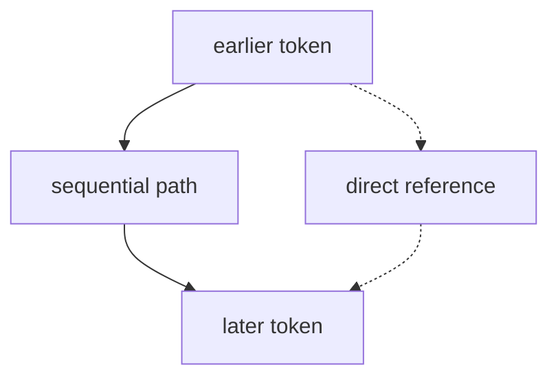
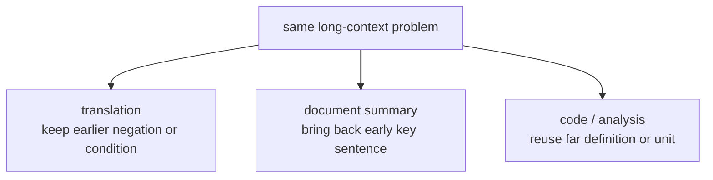

# P4-14.2 병렬 처리와 긴 문맥

P4-14.1에서는 Transformer를 self-attention, feed-forward, residual connection, layer normalization의 조합으로 설명했습니다. 이제 다음 질문이 남습니다.

왜 Transformer는 RNN보다 병렬 처리에 더 잘 맞고, 긴 문맥(long context) 문제에서도 더 강한 전환점처럼 보였는가?

이 절은 그 질문에 답합니다.

Transformer는 토큰을 순서대로만 상태 전달하지 않고 서로의 관계를 한 번에 계산하는 구조에 더 가까워, 병렬 처리와 긴 문맥 참조에서 큰 장점을 드러냈다.

## 이 절의 범위

이 절은 다음 질문에 답합니다.

- RNN과 Transformer의 계산 흐름은 왜 다르게 느껴지는가?
- 병렬 처리 관점에서 Transformer가 왜 유리했는가?
- 긴 문맥을 다룰 때 self-attention은 어떤 직관적 장점을 주는가?
- 이 차이가 왜 대규모 생성 모델 시대로 연결되는가?

이 절에서 먼저 닫아야 하는 핵심은 `Transformer는 더 좋은 이름의 모델이 아니라, 순차 전달을 관계 계산으로 바꿔 GPU 병렬 처리와 긴 문맥 재참조를 동시에 밀어 올린 구조`라는 점입니다. 즉, P4-14.1이 블록 안쪽 부품을 설명했다면, 이 절은 그 블록이 `실제 계산 규모`에서 무엇을 바꾸었는지 설명해야 합니다.

이 절에서는 다음 내용을 깊게 다루지 않습니다.

- attention complexity의 상세 빅오 비교
- long-context optimization의 최신 기법
- KV cache나 sparse attention 구현 상세

attention complexity의 상세 빅오 비교는 여기서 전개하지 않습니다. KV cache, sparse attention, long-context를 처음 읽는 법은 뒤 Part의 보충학습에서 다시 설명하고, long-context optimization의 최신 벤치마크 경쟁과 구현 세부 비교는 이 책의 현재 본편 범위 밖에 둡니다.

여기서 실제로 끝내야 하는 설명도 분명합니다. 이 절은 `Transformer가 빠르다`는 인상만 남기는 자리가 아니라, 왜 `순차 상태 전달`보다 `토큰 관계를 한꺼번에 계산하는 구조`가 병렬 처리와 먼 문맥 재참조에 유리했는지를 현재 장 안에서 닫아야 합니다. 따라서 최신 최적화 기법은 뒤로 넘겨도, 계산 감각의 차이 자체는 이 절에서 끝내 이해할 수 있어야 합니다. 반대로 residual, normalization 같은 블록 내부 부품 설명은 앞 절 범위로 두고, 여기서는 그 부품을 다시 세세히 해설하지 않습니다.

이 절에서는 `RNN 대 Transformer`를 수학적으로 완전히 비교하기보다, 큰 구조 차이를 먼저 이해합니다.

## 이 절의 목표

- RNN과 Transformer의 계산 흐름 차이를 설명할 수 있습니다.
- Transformer가 왜 병렬 처리와 더 잘 맞는지 말할 수 있습니다.
- 긴 문맥 참조에서 self-attention의 장점을 직관적으로 설명할 수 있습니다.
- 이 차이가 왜 대규모 생성 모델 학습과 이어지는지 연결할 수 있습니다.

## 이 절을 읽는 순서

이 절은 다음 순서로 읽으면 충분합니다.

1. 먼저 RNN의 순차 전달과 Transformer의 관계 계산을 나란히 놓고 봅니다.
2. 그 다음 왜 이 차이가 GPU 병렬 처리와 연결되는지 읽습니다.
3. 이어서 긴 문맥에서 먼 위치를 다시 참고하는 감각 차이를 확인합니다.
4. 마지막에 왜 이 구조 차이가 현대 생성 모델의 기반이 되었는지 정리합니다.

## RNN은 왜 순차적 느낌이 강한가

RNN 계열은 각 step가 이전 상태를 이어받아 다음 상태를 만드는 구조였습니다. 따라서 계산 감각이 자연스럽게 다음처럼 보입니다.

- 첫 토큰을 보고 상태를 만듭니다
- 그 상태를 가지고 두 번째 토큰을 봅니다
- 다시 그 상태를 세 번째 토큰으로 넘깁니다

즉, 토큰을 차례대로 밀어 가는 흐름에 가깝습니다.

다음처럼 이해하면 충분합니다.

`RNN은 앞에서 만든 상태를 뒤로 넘겨 가며 순차적으로 계산하는 구조다.`

## Transformer는 왜 다르게 보이나

Transformer의 self-attention은 각 토큰이 같은 시퀀스 안 다른 토큰들을 함께 참고하게 만듭니다. 이 구조는 토큰 간 관련도를 더 행렬적인 계산으로 다루기 쉽습니다.

즉:

- 꼭 한 토큰씩 순서대로만 상태를 넘기지 않아도 되고
- 토큰들 사이 관계를 한 번에 계산하는 감각이 더 강합니다

다음처럼 기억하면 좋습니다.

`RNN은 순서대로 상태를 전달하고, Transformer는 토큰들 사이의 관계를 더 한꺼번에 계산한다.`

P4-14.1이 `Transformer 블록 안에 무엇이 들어 있나`를 설명하는 절이었다면, 이 절은 `그 블록 구조가 실제 계산 방식과 학습 규모에서 무엇을 바꾸었나`를 설명하는 절이라고 보면 됩니다.

## 왜 이것이 병렬 처리에 유리했나

Part 4에서 이미 본 것처럼 GPU는 비슷한 계산을 많이 동시에 처리할 때 강합니다. Transformer의 self-attention과 큰 행렬 연산은 이런 구조와 잘 맞습니다.

즉, Transformer는:

- 토큰 간 관련도 계산을 텐서 연산으로 묶기 쉽고
- 배치(batch) 단위로도 잘 확장되며
- 대규모 병렬 학습에 잘 맞는 방향을 보여 주었습니다

다음 정도로 이해하면 충분합니다.

`Transformer는 토큰 간 관계를 병렬 행렬 연산으로 바꾸기 쉬워서, 대규모 GPU 학습과 잘 맞았다.`

여기서 독자가 꼭 잡아야 할 핵심은 `Transformer가 더 똑똑한 규칙을 하나 더 붙였다`가 아니라, `계산 자체를 GPU가 잘하는 형태로 재구성했다`는 점입니다. 즉, 이 절의 질문은 `블록 안에 무슨 부품이 있나`가 아니라 `그 블록을 반복할 때 계산 흐름이 왜 달라졌나`입니다.

이 차이를 입문용으로 더 짧게 보면 다음과 같습니다.

| 관점 | RNN 계열 | Transformer |
| --- | --- | --- |
| 계산 흐름 | 앞 step 결과가 다음 step에 필요하다 | 토큰 관계를 더 한꺼번에 계산한다 |
| GPU와의 궁합 | 순차 의존성이 강하다 | 큰 행렬 연산으로 묶기 쉽다 |
| 먼 문맥 참조 | 상태 전달에 크게 의존한다 | 필요한 위치를 더 직접 본다 |

## 긴 문맥에서는 왜 유리했나

RNN에서는 아주 먼 정보가 현재까지 오려면 상태를 여러 step 거쳐 전달해야 합니다. 반면 self-attention에서는 현재 토큰이 멀리 떨어진 토큰도 더 직접 참고할 수 있습니다.

즉, 긴 문맥에서의 장점은 다음처럼 설명할 수 있습니다.

- 먼 위치 정보를 중간 상태에만 희미하게 보관하지 않아도 되고
- 현재 위치가 필요할 때 관련 위치를 더 직접 참고할 수 있습니다

이 때문에 긴 문맥을 읽는 문제에서 Transformer는 강한 전환점을 만들었습니다.

즉, 이 절에서 읽어야 할 변화는 `먼 정보를 오래 기억해야 한다`에서 `먼 정보를 지금 다시 찾아올 수 있다`로 계산 감각이 옮겨 갔다는 점입니다.

## 이를 아주 단순하게 그리면



이 도식은 RNN식 순차 전달과, self-attention이 주는 더 직접적인 참조 감각을 함께 상징합니다.

## 사례로 보기

아래 도식은 이 절의 세 사례를 `순차 전달 중심 읽기`와 `직접 참조 중심 읽기`의 차이로 다시 묶은 것입니다.



이 도식에서 확인해야 할 점은 과업이 달라도 문제의 핵심이 비슷하다는 것입니다. 모두 `먼 앞쪽 단서를 현재 위치에서 다시 끌어와야 한다`는 문제를 갖고 있고, Transformer는 그 문제를 더 직접 참조하는 방식으로 다룹니다.

### 사례 1. 긴 문장 번역

법률 문장이나 제품 안내 문장을 번역할 때, 앞부분의 주어, 부정 표현, 시제 단서가 뒤쪽 번역에 끝까지 영향을 주는 장면을 떠올려 볼 수 있습니다. 사람은 처음에는 가까운 단어부터 순서대로 옮기면 충분하다고 느끼기 쉽습니다. 하지만 실제 문장은 중간 설명이 길어질수록 앞의 핵심 조건을 다시 확인해야 하고, 이때 순차 전달에만 기대면 중요한 단서가 약해질 수 있습니다. 예를 들어 앞부분의 `not`이나 `except`를 놓치면, 뒤 문장은 문법상 자연스러워 보여도 뜻은 정반대로 번역될 수 있습니다. 여기서 바뀌는 점은 `가까운 단어 위주로 읽는 방식`에서 `멀리 떨어진 핵심 단서를 현재 위치에서 다시 참조하는 방식`으로 기준이 이동한다는 것입니다. Transformer의 긴 문맥 참조 구조는 현재 번역 위치가 문장 앞쪽 단서를 더 직접 다시 참고하는 쪽으로 이해할 수 있습니다. 그래서 이 사례에서 확인해야 할 결과는 앞부분 단서가 길게 떨어져 있어도, 최종 번역에서 부정 여부, 예외 조건, 주어-동사 대응이 실제로 끝까지 유지되는가입니다.

### 사례 2. 긴 문서 요약

긴 회의록이나 사업 보고서를 요약할 때, 초반 핵심 문장이 뒤쪽 요약 문장 생성에 그대로 남아 있어야 하는 경우가 많습니다. 사람은 요약을 쓰기 시작하면 이미 읽은 앞부분 내용이 머릿속에 충분히 남아 있을 것이라고 느끼기 쉽습니다. 하지만 실제로는 중간 논의와 부연 설명이 길어질수록 앞부분의 핵심 판단을 다시 집어 오지 않으면 요약 방향이 쉽게 틀어집니다. 예를 들어 서론에 `이번 분기 매출은 늘었지만 이익은 감소했다`가 적혀 있는데, 뒤 요약에서 `성과가 좋아졌다`만 남기면 보고 판단이 왜곡됩니다. 여기서 바뀌는 점은 `앞에서 읽은 내용이 저절로 남아 있을 것`이라는 기대에서 벗어나, `현재 요약 위치가 필요한 앞 문장을 다시 불러와야 한다`는 기준으로 읽게 된다는 것입니다. Transformer는 문서 여러 위치를 함께 참조하며 현재 요약 표현을 갱신하는 구조라, 이런 초반 핵심 문장을 뒤 단계에서 다시 끌어오기에 더 자연스럽습니다. 그래서 이 사례에서 확인해야 할 결과는 `증가`와 `감소` 같은 상반된 핵심이 함께 보존되는가, 그리고 최종 요약이 원문 판단 방향을 뒤집지 않는가입니다.

### 사례 3. 코드 생성과 분석

긴 함수나 모듈을 읽거나 생성할 때는 먼 앞쪽의 함수 정의, 타입 선언, 상수 의미가 뒤쪽 토큰 해석에 계속 영향을 줍니다. 사람은 바로 앞 몇 줄만 보면 충분하다고 느끼기 쉽지만, 실제로는 아래 줄을 읽다가 위에서 선언한 이름과 타입을 다시 확인해야 하는 경우가 자주 생깁니다. 예를 들어 파일 아래쪽에서 `timeout` 값을 넘길 때, 위에서 그것이 초 단위인지 밀리초 단위인지 다시 확인하지 않으면 코드는 실행돼도 동작 시간이 완전히 달라질 수 있습니다. 여기서 바뀌는 점은 `현재 줄 근처만 보면 된다`는 읽기에서 `먼 앞쪽 정의를 현재 해석에 다시 끌어오는 읽기`로 기준이 이동한다는 것입니다. Transformer 계열은 이런 장면에서 현재 위치가 먼 앞쪽 정의를 더 직접 참조하는 구조로 이해할 수 있습니다. 그래서 이 사례에서 확인해야 할 결과는 변수명 일관성, 단위 해석 일치, 함수 정의와 호출부 연결이 먼 거리에서도 실제로 유지되는가입니다.

세 사례를 한 줄로 묶으면 다음과 같습니다.

| 상황 | 긴 문맥 참조가 중요한 이유 |
| --- | --- |
| 긴 문장 번역 | 앞쪽 주어와 시제 단서가 뒤 번역에 남아야 해서 |
| 긴 문서 요약 | 문서 초반 핵심 문장이 뒤 요약에도 중요해서 |
| 코드 생성/분석 | 먼 앞쪽 정의가 뒤쪽 해석에 영향을 줘서 |

즉, 이 절의 마무리는 `나중에 long context를 다시 본다`가 아닙니다. 현재 절 안에서 이미 `먼 앞 단서를 상태에만 남겨 두는 방식`과 `현재 위치가 그 단서를 다시 직접 참조하는 방식`의 차이를 독자가 말할 수 있어야 하고, 다음 Part는 그 구조가 생성 모델 본문에서 어떻게 쓰이는지로만 이어지면 충분합니다.

## 실행 가능한 Python 예제로 보기

이번 예제의 목표는 긴 입력에서 `앞 규칙을 순차 상태 하나에 압축해 들고 가는 방식`과 `현재 질문이 필요한 앞 문장을 다시 직접 참고하는 방식`이 어떻게 다르게 보이는지 확인하는 것입니다.

입력:

- 앞쪽 규칙 문장, 중간 운영 로그, 마지막 사용자 요청이 섞인 긴 문맥
- 규칙 단서를 점점 잊어 가는 단순 sequential 상태
- 마지막 질문이 관련 문장을 다시 찾는 direct reference 점수

출력:

- 각 줄을 읽을 때 갱신되는 sequential 상태
- 마지막 요청 시점의 핵심 단서 최소값
- 마지막 요청이 어떤 앞 문장을 다시 참고했는지
- 두 방식이 내리는 최종 판단

문제 상황:

- 긴 문맥 처리에서는 순차 상태만으로 충분한지, 아니면 앞 단서를 직접 다시 찾는 구조가 필요한지 비교해 볼 필요가 있다

확인할 개념:

- Transformer식 직접 참조는 먼 위치 단서를 다시 읽는 데 강점을 보일 수 있다
- 순차 상태와 직접 참조 판단을 나란히 보면 구조 차이가 더 명확해진다

입력(input):

위에 정리한 문맥 줄 목록 `context`를 사용합니다.

```python
context = [
    "Rule: hazardous items must not be shipped by air.",
    "Log: warehouse scan completed for aisle 3.",
    "Log: packaging material restocked this morning.",
    "Item: lithium battery pack is hazardous.",
    "Log: driver schedule updated for tomorrow.",
    "Request: ship the battery pack by air today.",
]


def sequential_reader(lines, decay=0.55):
    state = {"hazardous": 0.0, "air": 0.0, "block": 0.0}
    history = []
    for idx, line in enumerate(lines, start=1):
        lowered = line.lower()
        for key in state:
            state[key] *= decay
        if "hazardous" in lowered:
            state["hazardous"] += 1.0
        if "air" in lowered:
            state["air"] += 1.0
        if "must not" in lowered:
            state["block"] += 1.0
        snapshot = {key: round(value, 3) for key, value in state.items()}
        history.append((idx, line, snapshot))
    support = round(min(state.values()), 3)
    decision = "block_air_shipping" if support >= 0.8 else "uncertain"
    return history, {key: round(value, 3) for key, value in state.items()}, support, decision


def direct_reference_reader(lines):
    request = lines[-1].lower()
    keywords = {"battery", "pack", "air", "hazardous", "must", "not"}
    scored = []
    for idx, line in enumerate(lines[:-1], start=1):
        words = set(line.lower().replace(".", "").replace(":", "").split())
        score = len(words & keywords)
        scored.append((score, idx, line))
    top_matches = sorted(scored, reverse=True)[:2]
    matched_lines = [line.lower() for _, _, line in top_matches]
    decision = (
        "block_air_shipping"
        if any("must not be shipped by air" in line for line in matched_lines)
        and any("hazardous" in line for line in matched_lines)
        and "air" in request
        else "allow"
    )
    return top_matches, decision


history, final_state, sequential_support, sequential_decision = sequential_reader(context)
top_matches, direct_decision = direct_reference_reader(context)

print("[sequential reader]")
for idx, line, snapshot in history:
    print(f"{idx}. {line}")
    print("   state =", snapshot)
print("final_state =", final_state)
print("sequential_support =", sequential_support)
print("sequential_decision =", sequential_decision)
print()

print("[direct reference reader]")
for score, idx, line in top_matches:
    print(f"matched line {idx} (score={score}): {line}")
print("direct_decision =", direct_decision)
```

실행 결과 예시는 다음처럼 읽을 수 있습니다.

```text
[sequential reader]
1. Rule: hazardous items must not be shipped by air.
   state = {'hazardous': 1.0, 'air': 1.0, 'block': 1.0}
2. Log: warehouse scan completed for aisle 3.
   state = {'hazardous': 0.55, 'air': 0.55, 'block': 0.55}
3. Log: packaging material restocked this morning.
   state = {'hazardous': 0.303, 'air': 0.303, 'block': 0.303}
4. Item: lithium battery pack is hazardous.
   state = {'hazardous': 1.166, 'air': 0.166, 'block': 0.166}
5. Log: driver schedule updated for tomorrow.
   state = {'hazardous': 0.642, 'air': 0.092, 'block': 0.092}
6. Request: ship the battery pack by air today.
   state = {'hazardous': 0.353, 'air': 1.05, 'block': 0.05}
final_state = {'hazardous': 0.353, 'air': 1.05, 'block': 0.05}
sequential_support = 0.05
sequential_decision = uncertain

[direct reference reader]
matched line 1 (score=4): Rule: hazardous items must not be shipped by air.
matched line 4 (score=3): Item: lithium battery pack is hazardous.
direct_decision = block_air_shipping
```

이 결과에서 읽어야 할 핵심은 다음입니다.

- sequential 방식에서는 앞 규칙이 중간 로그를 지나는 동안 점차 약해져, 마지막 요청 시점에는 `위험물`, `항공`, `금지` 세 단서를 동시에 강하게 유지하지 못합니다
- `sequential_support`는 마지막 요청 시점에 세 핵심 단서 중 가장 약한 축이 얼마나 남았는지를 보여 주며, 여기서는 `block` 축이 거의 사라졌음을 확인할 수 있습니다
- direct reference 방식에서는 마지막 요청이 관련된 앞 규칙과 대상 정보가 있는 줄을 다시 바로 찾습니다
- 긴 문맥에서 중요한 것은 `앞 문장을 한 번 읽고 버티는가`보다 `현재 위치에서 필요한 앞 문장을 다시 끌어올 수 있는가`라는 점입니다

이 예제는 RNN과 Transformer 전체를 구현한 것은 아니지만, 긴 문맥에서 `상태에 압축해 유지하는 감각`과 `필요한 앞 위치를 다시 참조하는 감각` 차이를 실제로 실험해 보는 데 도움이 됩니다. `decay` 값을 바꾸거나 중간 로그 줄 수를 늘려 보면 순차 압축이 왜 더 어려워지는지도 직접 확인할 수 있습니다.

## 이 예제를 긴 문맥 재참조 관점으로 다시 보면

앞의 장난감 코드는 Transformer 전체를 구현한 것은 아니지만, 비교 기준은 분명합니다.

- sequential 쪽은 `앞 규칙을 상태 하나에 압축해 오래 버틸 수 있는가`를 보여 줍니다.
- direct reference 쪽은 `현재 요청이 필요할 때 앞 규칙과 대상 정보를 다시 집어 올 수 있는가`를 보여 줍니다.

즉, 긴 문맥 문제를 `기억 유지`로만 보면 순차 상태의 한계가 먼저 보이고, `필요한 앞 위치 재참조`로 보면 Transformer 계열의 장점이 더 직접적으로 보입니다. 이 감각이 있어야 뒤에서 긴 문맥 제약을 읽을 때도 `무조건 더 오래 기억한다`가 아니라 `필요한 문맥을 다시 창 안으로 가져와 읽는다`는 관점으로 자연스럽게 이해할 수 있습니다.

Transformer가 attention 중심 구조와 병렬 계산의 장점을 결합하면서, 자연어 처리의 기본 계산 구조가 크게 바뀌었습니다. 이후 대규모 사전학습(pretraining), 긴 문맥 처리, 다양한 생성 모델 확장은 모두 이 구조적 전환과 깊게 연결됩니다.

커리큘럼 관점에서 이 절에서 확인해야 할 결과는 Transformer를 단순 또 하나의 순차 모델이 아니라, 바로 앞의 P4-13.1, P4-13.2 attention 설명과 P4-14.1 블록 구조 설명을 실제 계산 장점으로 묶는 구조적 전환점으로 읽게 되는가입니다.

- 왜 Transformer가 단순한 또 하나의 순차 모델이 아니었는지
- 왜 GPU 시대와 맞물려 대규모 언어 모델이 가능해졌는지
- 왜 긴 문맥과 대규모 학습의 기준이 함께 바뀌었는지

를 한 절에서 묶어 주기 때문입니다.

따라서 이 절에서 확인해야 할 최종 결과는 Transformer를 `attention이 들어간 또 하나의 모델`이 아니라, 병렬 처리와 긴 문맥 참조를 동시에 밀어 올린 구조적 전환으로 읽을 수 있는가입니다.

## 다음 절과의 연결

여기까지 오면 다음 질문이 남습니다.

- 이렇게 강한 문맥 모델이 생겼을 때, 이제 모델은 분류만이 아니라 무엇을 생성할 수 있게 되었는가?
- 생성 모델(generative model)은 분류 모델과 어떤 점에서 다른가?

이 질문은 바로 P4-15.1 생성 모델(generative model)은 무엇을 배우는가로 이어집니다.

## 이 절에서 기억할 관점

- Transformer는 토큰을 순차 상태로만 전달하지 않고, 관계를 더 병렬적으로 계산합니다.
- 이 구조는 GPU 병렬 처리와 잘 맞습니다.
- self-attention은 먼 위치를 더 직접 참조하는 감각을 줍니다.
- 이 차이가 대규모 생성 모델 확산의 핵심 기반이 됩니다.

## 체크리스트

- RNN과 Transformer의 계산 감각 차이를 설명할 수 있는가?
- Transformer가 병렬 처리와 왜 잘 맞는지 말할 수 있는가?
- 긴 문맥에서 self-attention의 장점을 입문 수준에서 말할 수 있는가?
- 다음 절의 생성 모델 주제로 왜 자연스럽게 이어지는지 설명할 수 있는가?

## 출처와 참고 자료

- Ashish Vaswani et al., `Attention Is All You Need`, NeurIPS 2017, 확인 날짜: 2026-06-29.
- Colin Raffel et al., `Exploring the Limits of Transfer Learning with a Unified Text-to-Text Transformer`, JMLR, 2020, 확인 날짜: 2026-06-29.
- Ian Goodfellow, Yoshua Bengio, Aaron Courville, `Deep Learning`, MIT Press, 2016, 확인 날짜: 2026-06-29. [https://www.deeplearningbook.org/](https://www.deeplearningbook.org/){: target="_blank" rel="noopener noreferrer" }
