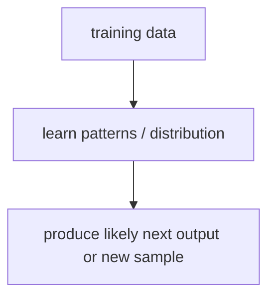
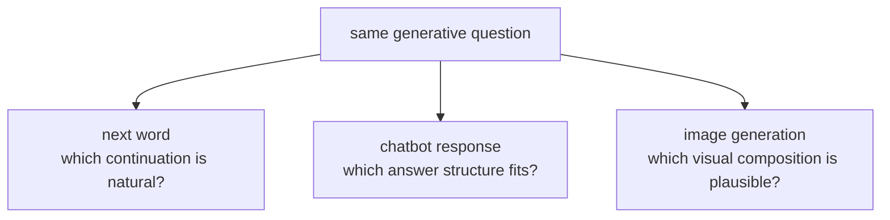

# P4-15.1 생성 모델(generative model)은 무엇을 배우는가

P4-14.2에서는 Transformer가 병렬 처리와 긴 문맥 처리에서 큰 전환점이 되었고, 이 구조가 결국 LLM과 생성형 AI 확산의 기반이 되었다는 점을 보았습니다. 이제 다음 질문이 생깁니다.

그렇다면 생성 모델(generative model)은 분류 모델과 무엇이 다르며, 도대체 무엇을 배우는가?

이 절은 그 질문에 답합니다.

생성 모델은 입력을 어느 클래스에 넣을지만 배우는 것이 아니라, 데이터가 어떤 패턴으로 나타나는지와 다음에 무엇이 그럴듯하게 이어질지를 함께 학습하려는 모델이다.

## 이 절의 범위

이 절은 다음 질문에 답합니다.

- 생성 모델은 분류 모델과 무엇이 다른가?
- `데이터 분포(data distribution)를 배운다`는 말은 독자에게 어떻게 설명할 수 있는가?
- 생성은 왜 확률적 출력(probabilistic output)과 자주 연결되는가?
- 이 관점이 LLM과 이미지 생성 모델로 어떻게 이어지는가?

이 절에서 먼저 닫아야 하는 핵심은 `생성 모델은 정답 라벨을 고르는 데서 멈추지 않고, 어떤 출력이 자연스러운지 자체를 배운다`는 점입니다.

처음 읽을 때는 이 절을 `후보 분포 학습 축`으로만 고정해 두면 덜 흔들립니다.

즉, 지금 장의 핵심은 `입력을 어느 라벨로 고를까`에서 `가능한 다음 출력 분포를 어떻게 배울까`로 손잡이가 바뀐다는 점입니다.

| 지금 이 절에서 읽는 것 | 바로 다음 절이나 뒤 Part로 넘기는 것 |
| --- | --- |
| 생성 모델이 어떤 패턴과 후보 분포를 학습하는가 | 학습된 후보 중 실제 출력을 어떤 규칙으로 꺼내는가 |
| 분류 문제와 생성 문제가 던지는 질문의 차이 | 토큰 단위 생성 설정과 서비스 품질 조정이 어떻게 달라지는가 |

이 절에서는 다음 내용을 깊게 다루지 않습니다.

- diffusion, GAN, VAE의 세부 알고리즘 비교
- likelihood 수식의 엄밀한 전개
- 샘플링 전략의 상세 수학

샘플링(sampling)과 출력 품질 변동은 바로 다음 P4-15.2에서 더 구체적으로 다루고, 텍스트 생성의 다음 토큰 예측은 뒤 Part에서 다시 연결합니다. diffusion, GAN, VAE의 세부 알고리즘 비교와 likelihood 수식 전개는 이 책의 현재 본편 범위 밖에 둡니다.

## 이 절의 목표

- 생성 모델을 `데이터 패턴을 배워 새로운 샘플이나 다음 출력을 만드는 모델`로 설명할 수 있습니다.
- 분류 모델과 생성 모델의 차이를 입문 수준에서 비교할 수 있습니다.
- `다음 토큰 예측`과 `이미지 생성`을 같은 생성 관점에서 묶어 설명할 수 있습니다.
- 실행 가능한 Python 예제로 분포 기반 생성 직관을 확인할 수 있습니다.

## 이 절을 읽는 순서

이 절은 다음 순서로 읽으면 흐름이 잘 잡힙니다.

1. 먼저 분류 모델과 생성 모델이 던지는 질문이 어떻게 다른지 비교합니다.
2. 그 다음 `데이터 분포를 배운다`는 말을 입문 수준에서 풀어 읽습니다.
3. 이어서 텍스트 생성과 이미지 생성을 같은 생성 관점으로 묶어 봅니다.
4. 마지막에 왜 생성 문제가 `무엇을 배웠는가` 다음에 `무엇을 실제로 꺼내는가`로 이어지는지 정리합니다.

## 분류 모델과 생성 모델은 무엇이 다른가

분류 모델(classification model)은 보통 다음 질문에 답합니다.

- 이 입력은 어떤 클래스인가?
- 스팸인가 아닌가?
- 고양이인가 강아지인가?

즉, 입력을 어떤 범주로 매핑할지를 중심에 둡니다.

반면 생성 모델은 다음과 같은 질문에 더 가깝습니다.

- 이 데이터는 어떤 패턴으로 나타나는가?
- 이 문장 다음에는 어떤 토큰이 그럴듯한가?
- 이 그림 스타일에서는 어떤 픽셀 패턴이 자연스러운가?

즉, 생성 모델은 `새로운 출력 자체를 만들어 내는 문제`와 더 직접적으로 연결됩니다.

이 차이를 먼저 표로 보면 다음과 같습니다.

| 관점 | 분류 모델 | 생성 모델 |
| --- | --- | --- |
| 중심 질문 | 어떤 클래스인가 | 어떤 출력이 자연스러운가 |
| 대표 출력 | 라벨, 점수 | 다음 토큰, 새 문장, 새 이미지 |
| 대표 예 | 스팸 분류, 질병 분류 | 문장 생성, 요약, 이미지 생성 |

같은 장면을 두 방식으로 나눠 보면 차이가 더 직접 보입니다.

| 같은 입력 장면 | 분류 모델이 먼저 내놓는 것 | 생성 모델이 먼저 내놓는 것 |
| --- | --- | --- |
| 고객 문의 `비밀번호를 바꾸고 싶어요` | `계정 관리 문의` 같은 문의 유형 라벨 | `설정 > 보안 > 비밀번호 변경으로 이동하세요` 같은 실제 응답 문장 |
| 리뷰 문장 `배송은 빨랐지만 포장이 아쉬웠다` | `긍정` 또는 `혼합` 같은 감성 라벨 | 장점과 불만을 함께 담은 요약 문장 |
| 상품 사진 | `운동화` 같은 품목 라벨 | 상품 설명 문구나 대체 텍스트 초안 |

즉, 분류는 `무엇으로 볼 것인가`를 먼저 고르고, 생성은 `무엇을 실제로 말하거나 만들어 낼 것인가`를 바로 다룹니다.

P4-14.2를 `강한 문맥 구조가 왜 중요했는가`를 설명하는 절로 읽었다면, 이 절은 그 구조가 이제 `무엇을 분류하나`를 넘어 `무엇을 만들어 낼 수 있나`라는 질문으로 확장되는 절입니다.

## `데이터 분포를 배운다`는 말은 무엇을 뜻하나

독자는 `분포(distribution)`라는 말에서 바로 어려움을 느낄 수 있습니다. 여기서는 이를 `자주 함께 나타나는 패턴과 자연스러운 조합에 대한 통계적 감각`으로 먼저 잡습니다.

`데이터 분포를 배운다는 것은, 어떤 패턴이 자주 나타나고 어떤 조합이 자연스러운지에 대한 통계적 감각을 모델이 익힌다는 뜻이다.`

예를 들어 텍스트라면:

- 어떤 단어 뒤에 어떤 단어가 자주 오는지
- 어떤 문장 구조가 자연스러운지

를 배웁니다.

이미지라면:

- 어떤 색과 모양 조합이 함께 나타나는지
- 어떤 부분 구조가 자연스러운 객체를 이루는지

를 배울 수 있습니다.

이 말을 독자가 실제 장면으로 다시 붙잡으려면, `무엇을 많이 보고`, `무엇이 자연스럽게 함께 나오는지`, `무엇을 결과에서 확인해야 하는지`를 최소한으로 나눠 보는 편이 좋습니다.

| 데이터 종류 | 모델이 많이 보게 되는 패턴 | 결과에서 먼저 확인할 것 |
| --- | --- | --- |
| 텍스트 | 어떤 단어가 자주 이어지고 어떤 문장 구조가 반복되는가 | 다음 단어와 문장 톤이 문맥에 맞게 이어지는가 |
| 이미지 | 어떤 색, 윤곽, 배치가 자주 함께 나타나는가 | 구도와 형태가 어색하게 깨지지 않고 자연스러운가 |
| 챗봇 답변 | 질문 유형마다 어떤 설명 길이와 답 구조가 자주 쓰이는가 | 답 순서와 예시 유무가 상황에 맞게 달라지는가 |

즉, 생성 모델은 `정답 라벨만 맞추는 모델`보다 더 넓게 데이터 패턴 자체를 학습하려는 쪽에 가깝습니다.

## 왜 생성은 확률적 출력과 자주 연결되나

생성은 종종 하나의 정답만 있는 문제가 아닙니다.

예를 들어:

- 문장 다음 단어는 하나만 가능하지 않을 수 있고
- 그림을 그리는 방식도 여러 개가 자연스러울 수 있으며
- 요약 문장도 여러 표현이 가능할 수 있습니다

따라서 생성 모델은 `가능한 여러 출력 중 어떤 것이 더 그럴듯한가`를 다루는 경우가 많습니다. 이 때문에 확률(probability), 샘플링(sampling), temperature 같은 개념이 자연스럽게 따라옵니다.

`생성은 정답 하나를 찍는 일이 아니라, 그럴듯한 후보들 중 무엇을 낼지를 다루는 경우가 많다.`

## LLM과 이미지 생성은 어떻게 같은 관점으로 묶이나

표면적으로는 텍스트 생성과 이미지 생성이 매우 달라 보입니다. 하지만 생성 모델 관점에서는 공통점이 있습니다.

- 둘 다 데이터 패턴을 배웁니다
- 둘 다 새로운 출력을 만듭니다
- 둘 다 확률적 선택이나 샘플링과 연결될 수 있습니다

즉, 생성형 AI는 다양한 데이터 도메인에서 그럴듯한 새 출력을 만드는 모델들을 가리킵니다.

### 텍스트 생성

다음 토큰(next token)을 예측하며 문장을 이어 갑니다.

### 이미지 생성

픽셀이나 잠재 표현(latent representation)을 점차 구성하며 이미지를 만듭니다.

도메인은 달라도, `패턴을 학습해 새로운 결과를 만든다`는 공통 관점이 있습니다.

## 이를 아주 단순하게 그리면



이 도식은 생성 모델을 가장 넓은 수준에서 압축합니다.

## 사례로 보기

사례에 들어가기 전에, 이 절에서는 `무엇이 자연스러운 출력인가`라는 질문이 데이터 종류마다 어떻게 바뀌는지만 먼저 짧게 묶어 두는 편이 좋습니다.

| 상황 | 생성 모델이 바로 다루는 질문 | 실제로 달라질 수 있는 출력 |
| --- | --- | --- |
| 다음 단어 예측 | 지금 뒤에 어떤 표현이 더 자연스러운가 | 단어 선택과 이어질 문장 톤 |
| 챗봇 응답 | 현재 맥락에 맞는 답 구조는 무엇인가 | 설명 순서, 길이, 경고 문구 배치 |
| 이미지 생성 | 어떤 시각 조합이 그럴듯한가 | 구도, 색감, 배치, 강조 대상 |

아래 도식은 이 절의 세 사례를 `하나의 라벨을 고르는 문제`가 아니라 `여러 후보 중 자연스러운 출력을 만드는 문제`로 다시 묶은 것입니다.



이 도식은 과업이 달라도 질문 구조가 비슷하다는 점을 보여 줍니다. 모두 `정답 하나만 고르는가`보다 `여러 가능한 출력 중 어떤 것이 더 자연스러운가`를 다룬다는 점에서 생성 문제로 읽힙니다.

### 사례 1. 다음 단어 예측

문장 `The weather is` 뒤를 이어 쓰는 장면을 생각해 보겠습니다. 사람도 `good`, `nice`, `sunny`처럼 여러 단어를 떠올릴 수 있지만, 처음에는 하나의 정답이 있을 것처럼 느끼기 쉽습니다. 그런데 실제 언어 사용에서는 문맥, 말투, 이어질 문장에 따라 자연스러운 다음 단어가 달라집니다. 예를 들어 일기라면 `sunny`가 더 어울리고, 짧은 감상문이라면 `good`이 더 자연스러울 수 있습니다. 분류처럼 정답 라벨 하나만 고르는 방식으로는 이 차이를 잘 담기 어렵습니다. 생성 모델은 바로 이 여러 후보의 상대적 가능성을 함께 배우고, 현재 문맥에서 더 자연스러운 쪽을 출력 후보로 올립니다.

### 사례 2. 챗봇 응답

사용자가 `비밀번호를 바꾸려면 어떻게 하나요?`라고 묻는 고객 지원 장면을 생각해 볼 수 있습니다. 사람은 이런 질문에 FAQ처럼 `정답 문장 하나`가 있을 것이라고 먼저 기대하기 쉽습니다. 하지만 실제 서비스에서는 사용 채널, 사용자 숙련도, 보안 주의사항에 따라 자연스러운 답 형태가 달라집니다. 예를 들어 모바일 앱 사용자는 `설정 > 보안 > 비밀번호 변경` 같은 짧은 단계 안내가 먼저 필요할 수 있고, 웹 사용자는 로그인 후 계정 메뉴 경로를 먼저 보여 주는 편이 더 자연스러울 수 있습니다. 또 보안상 `공용 PC에서는 변경 후 다시 로그인하세요` 같은 경고 문구를 앞에 둘지 뒤에 둘지도 답변 구성에 영향을 줍니다. 즉, 이 장면에서는 하나의 라벨보다 여러 그럴듯한 응답 구성이 존재합니다. 생성 모델은 이런 후보 분포를 다루며, 현재 문맥에서 더 자연스러운 길이, 말투, 순서를 가진 답을 이어 가는 쪽에 가깝습니다.

### 사례 3. 이미지 생성

`a red house near a lake` 같은 프롬프트로 이미지를 만든다고 해 보겠습니다. 사람은 머릿속에 한 장면을 먼저 떠올리며 그것이 정답처럼 느껴질 수 있습니다. 하지만 실제 시각 장면에서는 집의 각도, 호수 위치, 하늘 색, 나무 배치가 달라도 모두 자연스러울 수 있습니다. 예를 들어 어떤 결과는 호수가 화면 앞쪽에 넓게 보이고, 다른 결과는 집이 더 크게 나오며 배경 산이 강조될 수 있습니다. 사람이 단일 정답 그림만 기대하면 이런 차이를 오류로 읽기 쉽지만, 생성 모델 관점에서는 이것이 오히려 자연스러운 결과 공간입니다. 모델은 시각 패턴 분포를 학습해 여러 장면 조합을 출력 후보로 만들고, 그중 하나를 실제 결과로 냅니다.

세 사례에서 공통으로 확인해야 할 결과는 하나의 고정 답이 아니라 후보 분포가 실제 출력으로 펼쳐진다는 점입니다. 텍스트에서는 어떤 단어가 더 자주 선택되는지, 챗봇 응답에서는 핵심 절차를 유지한 채 답 구조가 달라지는지, 이미지에서는 구도와 색감이 달라져도 핵심 장면이 유지되는지를 보면 충분합니다.

## 실행 가능한 Python 예제로 보기

이번 예제의 목표는 생성 모델이 후보 하나만 고정해서 내는 것이 아니라, 더 그럴듯한 후보를 더 자주 선택하되 여러 후보를 실제로 만들 수 있다는 점을 확인하는 것입니다.

코드를 읽기 전에 아래 세 값부터 같이 보면 이 절의 질문이 덜 흩어집니다.

| 먼저 볼 값 | 왜 먼저 보아야 하는가 |
| --- | --- |
| `samples` | 출력이 한 번에 하나로 고정되지 않고 실제로 여러 후보로 펼쳐지는지 보여 줘서 |
| `counts` | 더 그럴듯한 후보가 정말 더 자주 선택되는지 한눈에 비교할 수 있어서 |
| `good`, `nice`, `sunny`의 동시 등장 | 생성이 `정답 하나 선택`이 아니라 `후보 분포에서 실제 출력을 뽑는 일`임을 바로 확인할 수 있어서 |

입력:

- 세 개의 가능한 다음 토큰 후보
- 각 후보의 상대적 비중

출력:

- 반복 샘플링 결과
- 후보별 등장 횟수

문제 상황:

- 생성 모델은 분류처럼 하나의 답만 고르는 것이 아니라 후보 분포에서 실제 토큰을 샘플링한다는 점을 직접 확인할 필요가 있다

확인할 개념:

- 생성 모델은 후보 하나만 결정하는 대신 후보 분포를 바탕으로 출력을 고른다
- 상대적 비중이 큰 후보가 더 자주 나오더라도 다른 후보도 실제로 생성될 수 있다
- 반복 샘플링 결과를 봐야 분류와 생성의 출력 구조 차이를 눈으로 확인할 수 있다

입력(input):

위에 정리한 후보 토큰 목록과 상대 가중치 `weights`를 사용합니다.

```python
import random

candidates = ["good", "nice", "sunny"]
weights = [0.5, 0.3, 0.2]

random.seed(21)
samples = [random.choices(candidates, weights=weights, k=1)[0] for _ in range(20)]

counts = {candidate: samples.count(candidate) for candidate in candidates}

print("samples =", samples)
print("counts =", counts)
```

출력에서는 각 후보의 counts가 확률 가중치를 대체로 따라가는지부터 보면 됩니다.

```text
samples = ['good', 'sunny', 'good', 'nice', 'good', 'good', 'nice', 'good', 'sunny', 'good', 'good', 'good', 'nice', 'nice', 'good', 'good', 'sunny', 'good', 'good', 'nice']
counts = {'good': 11, 'nice': 5, 'sunny': 4}
```

- 생성 모델은 항상 하나의 결과만 기계적으로 내지 않을 수 있습니다
- 더 그럴듯한 후보가 실제로 더 자주 나오지만
- 확률이 낮은 후보도 완전히 사라지지 않고 등장할 수 있습니다

생성 모델에서 확인해야 할 흐름은 딥러닝의 중심 질문이 `라벨을 얼마나 잘 맞히는가`에서 `데이터 패턴을 바탕으로 새 출력을 얼마나 자연스럽게 만들 수 있는가`로 넓어졌다는 점입니다. GAN, VAE, autoregressive language model, diffusion model 같은 다양한 구조가 등장했지만, 공통 질문은 비슷합니다.

`데이터 패턴을 얼마나 잘 배우고, 그 패턴을 바탕으로 얼마나 자연스러운 새 출력을 만들 수 있는가?`

## 다음 절과의 연결

여기까지 오면 다음 질문이 남습니다.

- 생성 모델이 확률적이라면, 실제 출력은 어떻게 고르는가?
- 왜 같은 모델도 샘플링 방식에 따라 품질과 다양성이 달라지는가?

이 질문은 바로 P4-15.2 생성과 샘플링(sampling)으로 이어집니다.

## 이 절에서 기억할 관점

| 지금 이 절에서 정리한 것 | 바로 다음에 붙는 질문 | 아직 여기서 하지 않는 일 |
| --- | --- | --- |
| 생성 모델은 후보 분포를 만들고 새 출력을 구성한다 | 실제 한 번의 출력에서는 어떤 후보를 어떻게 고를 것인가 | 샘플링 세부 규칙과 LLM 서비스 품질 문제를 모두 다루는 일 |

- 생성 모델은 데이터 패턴을 학습해 새로운 샘플이나 다음 출력을 만드는 모델입니다.
- 분류 모델은 범주를 고르고, 생성 모델은 출력 자체를 만듭니다.
- 생성 문제는 여러 그럴듯한 답이 가능하므로 확률적 출력과 자주 연결됩니다.
- 생성 문제의 핵심은 `맞는 라벨 선택`이 아니라 `자연스러운 후보 분포 구성`이라는 점입니다.

## 체크리스트

- 생성 모델을 입문 수준에서 설명할 수 있는가?
- 분류 모델과 생성 모델의 차이를 말할 수 있는가?
- 왜 생성이 확률과 샘플링과 연결되는지 설명할 수 있는가?
- 다음 절의 샘플링 주제로 왜 자연스럽게 이어지는지 말할 수 있는가?

## 출처와 참고 자료

- Ian Goodfellow, Yoshua Bengio, Aaron Courville, `Deep Learning`, MIT Press, 2016, 확인 날짜: 2026-06-29. [https://www.deeplearningbook.org/](https://www.deeplearningbook.org/){: target="_blank" rel="noopener noreferrer" }
- Diederik P. Kingma, Max Welling, `Auto-Encoding Variational Bayes`, ICLR 2014, 확인 날짜: 2026-06-29.
- Ian J. Goodfellow et al., `Generative Adversarial Nets`, NeurIPS 2014, 확인 날짜: 2026-06-29.
