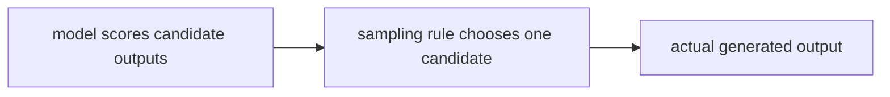

# P4-15.2 생성과 샘플링(sampling)

P4-15.1에서는 생성 모델(generative model)이 분류 모델과 달리 데이터 패턴을 학습해 새로운 출력 자체를 만들려는 모델이라는 점을 보았습니다. 그러면 다음 질문이 자연스럽게 따라옵니다.

생성 모델이 여러 그럴듯한 답을 만들 수 있다면, 실제로 어떤 답을 고르는가?

이 절은 그 질문에 답합니다.

샘플링(sampling)은 모델이 그럴듯하다고 본 여러 후보 중 실제 출력을 하나씩 꺼내는 과정이며, 이 방식이 결과의 다양성과 안정성에 직접 영향을 준다.

## 이 절의 범위

이 절은 다음 질문에 답합니다.

- 생성 모델의 출력이 왜 하나로 고정되지 않을 수 있는가?
- 샘플링(sampling)은 무엇을 한다고 설명할 수 있는가?
- 확률 분포와 출력 다양성은 어떤 관계가 있는가?
- 왜 같은 모델도 샘플링 방식에 따라 결과 느낌이 달라지는가?

이 절은 다음 내용은 깊게 다루지 않습니다.

- beam search의 상세 구현
- top-k, top-p의 수학적 비교
- temperature 공식의 엄밀한 전개
- diffusion model의 역과정 샘플링 세부 구현

이 절의 목적은 생성형 AI를 사용할 때 `모델이 답을 아는가`라는 질문을 넘어, `모델이 답을 어떤 방식으로 꺼내는가`를 설명할 수 있게 하는 데 있습니다. 토큰 단위 샘플링, temperature, top-k, top-p의 실사용 감각은 Part 5의 P5-1.2와 P5-2.1, P5-2.2에서 다시 연결합니다. beam search와 diffusion 샘플링의 세부 구현은 이 책의 현재 본편 범위 밖에 둡니다.

## 이 절의 목표

- 샘플링을 `후보들 중 실제 출력을 선택하는 절차`로 설명할 수 있습니다.
- 생성 결과가 늘 같지 않을 수 있는 이유를 말할 수 있습니다.
- 다양성과 안정성의 균형이라는 관점으로 생성 결과를 읽을 수 있습니다.
- Part 5에서 나올 토큰(token), 다음 토큰 예측(next-token prediction), temperature 같은 개념의 필요성을 미리 이해할 수 있습니다.

## 왜 생성 출력은 하나로 고정되지 않을 수 있나

분류(classification) 문제에서는 보통 가장 높은 점수를 받은 클래스 하나를 선택하는 상황이 많습니다. 하지만 생성(generation) 문제는 다릅니다.

예를 들어 다음 문장을 생각해 볼 수 있습니다.

- `오늘 날씨가`

이 뒤에는 `좋다`, `맑다`, `화창하다`, `괜찮다` 같은 여러 표현이 자연스럽게 이어질 수 있습니다.

즉, 생성 문제는 처음부터 `정답이 하나만 있는 문제`가 아닐 수 있습니다.

그래서 생성 모델은 보통 여러 후보에 대해 상대적인 그럴듯함을 계산하고, 그 가운데 실제 출력을 선택하는 단계가 필요합니다.

## 샘플링(sampling)은 무엇을 하나

샘플링을 다음처럼 설명하면 충분합니다.

`샘플링은 모델이 더 그럴듯하다고 본 후보를 더 자주 고르되, 경우에 따라 다른 후보도 실제 출력으로 선택할 수 있게 하는 절차다.`

즉, 샘플링은 다음 두 극단 사이의 문제를 다룹니다.

- 항상 가장 높은 후보만 고르는 방식
- 가능한 후보를 너무 무작위로 섞어 버리는 방식

생성형 AI에서는 이 사이의 균형이 중요합니다.

입문 단계에서는 다음 세 방식만 구분해도 충분합니다.

| 방식 | 먼저 잡아야 할 감각 |
| --- | --- |
| argmax | 항상 가장 높은 후보만 고른다 |
| sampling | 높은 후보를 더 자주 고르되 다른 후보도 허용한다 |
| temperature 조정 | 후보 분포를 더 보수적이거나 더 다양하게 읽게 만든다 |

## 다양성과 안정성은 왜 함께 보아야 하나

샘플링을 전혀 하지 않고 가장 높은 후보만 반복해서 선택하면, 출력은 안정적으로 보일 수 있습니다. 하지만 결과가 지나치게 단조롭거나 반복적으로 느껴질 수 있습니다.

반대로 후보를 너무 넓게 허용하면 출력 다양성은 커질 수 있지만, 문장이 갑자기 부자연스러워지거나 의미가 흐트러질 수 있습니다.

이 절의 핵심을 다음처럼 기억하면 좋습니다.

`생성 품질은 정답 여부만이 아니라, 다양성과 안정성의 균형 문제이기도 하다.`

## 같은 모델도 결과가 달라질 수 있는 이유

같은 모델이어도 다음 조건이 달라지면 결과가 달라질 수 있습니다.

- 어떤 후보까지만 남길지
- 확률 분포를 얼마나 날카롭게 읽을지
- 가장 높은 후보만 고를지, 여러 후보를 허용할지

이 때문에 사용자는 종종 `모델이 바뀌었다`고 느끼지만, 실제로는 출력 선택 전략이 바뀐 경우도 있습니다.

이 관점은 Part 5에서 토큰(token) 단위 생성과 프롬프트(prompt) 실험을 설명할 때 매우 중요해집니다.

## 아주 단순한 흐름으로 그리면



이 도식은 `모델 점수`와 `실제 출력 선택`이 같은 단계가 아니라는 점을 보여 줍니다.

## 사례로 보기

### 사례 1. 문장 자동완성

`회의는 내일`

뒤에 `있습니다`, `열립니다`, `진행됩니다` 같은 여러 후보가 가능할 수 있습니다. 샘플링 방식에 따라 더 딱딱한 결과가 나올 수도 있고, 더 다양한 표현이 나올 수도 있습니다.

### 사례 2. 챗봇 답변

같은 질문이라도 한 번은 간결한 답이, 다른 한 번은 더 설명적인 답이 나올 수 있습니다. 이것은 모델 지식만의 차이가 아니라 출력 선택 방식의 차이이기도 합니다.

### 사례 3. 이미지 생성 프롬프트

`a small cafe in the rain` 같은 프롬프트는 가능한 결과가 하나가 아닙니다. 색감, 구도, 조명 같은 요소가 달라질 수 있으며, 이 역시 생성 과정의 확률성과 연결됩니다.

세 사례를 한 줄로 묶으면 다음과 같습니다.

| 상황 | 샘플링 차이가 드러나는 방식 |
| --- | --- |
| 문장 자동완성 | 표현이 더 반복적이거나 더 다양해질 수 있다 |
| 챗봇 답변 | 답이 더 간결하거나 더 서술적으로 달라질 수 있다 |
| 이미지 생성 | 구도, 색감, 세부 묘사가 달라질 수 있다 |

## 작은 Python 예제로 보기

이번 예제의 목표는 `가장 높은 후보만 고를 때`와 `가중치에 따라 여러 후보를 허용할 때`의 차이를 확인하는 것입니다.

입력:

- 네 개의 후보 토큰
- 각 후보의 상대적 비중

출력:

- argmax 방식의 고정 결과
- 샘플링 방식의 반복 결과

```python
import random

candidates = ["good", "nice", "clear", "warm"]
weights = [0.45, 0.30, 0.15, 0.10]

argmax_choice = candidates[weights.index(max(weights))]

random.seed(7)
sampled = [random.choices(candidates, weights=weights, k=1)[0] for _ in range(12)]

print("argmax_choice =", argmax_choice)
print("sampled =", sampled)
```

실행 결과 예시는 다음처럼 읽을 수 있습니다.

```text
argmax_choice = good
sampled = ['good', 'good', 'nice', 'good', 'nice', 'good', 'good', 'clear', 'good', 'nice', 'good', 'good']
```

이 예제에서 읽어야 할 핵심은 다음입니다.

- argmax 방식은 항상 같은 결과를 냅니다.
- sampling 방식은 높은 후보가 더 자주 나오지만, 다른 후보도 실제로 등장할 수 있습니다.
- 생성 결과의 `다양성`은 선택 방식과 직접 연결됩니다.

## 역사와 커리큘럼 관점

생성 모델을 설명할 때 샘플링이 중요한 이유는, 생성형 AI를 `답을 저장해 둔 시스템`처럼 오해하지 않게 해 주기 때문입니다.

언어 모델(language model)은 대개 다음 토큰의 가능성을 계산하고, 이미지 생성 모델은 가능한 시각 패턴을 점차 구성합니다. 이때 실제 출력은 계산된 분포와 선택 전략을 거쳐 나타납니다.

커리큘럼 관점에서 이 절은 다음 연결을 준비합니다.

- Part 5의 토큰(token)과 토큰화(tokenization)
- 다음 토큰 예측(next-token prediction)
- temperature, top-k, top-p 같은 생성 설정
- 프롬프트(prompt)에 따라 출력이 달라지는 이유

즉, 이 절은 Part 4의 딥러닝 구조 설명을 Part 5의 LLM 사용 경험으로 이어 주는 다리 역할을 합니다.

## 다음 Part와의 연결

여기까지 오면 이제 질문이 조금 더 구체화됩니다.

- 생성 모델은 실제로 어떤 입력 단위로 텍스트를 읽는가?
- `다음 토큰`을 예측한다는 말의 토큰(token)은 정확히 무엇인가?
- 같은 문장도 왜 토큰화 방식에 따라 길이와 비용이 달라지는가?

이 질문은 Part 5의 첫 장, P5-1.1 토큰(token)은 무엇인가로 이어집니다.

## 이 절에서 기억할 관점

- 생성 모델은 후보들의 그럴듯함을 계산하고, 샘플링은 그중 실제 출력을 고릅니다.
- 생성 문제는 정답이 하나만 있는 문제가 아닐 수 있습니다.
- 다양성과 안정성의 균형이 생성 품질에 중요합니다.
- 이 관점은 Part 5의 토큰, 다음 토큰 예측, 생성 설정 설명으로 이어집니다.

## 체크리스트

- 샘플링을 입문 수준에서 설명할 수 있는가?
- 왜 같은 모델도 결과가 달라질 수 있는지 말할 수 있는가?
- 다양성과 안정성의 균형을 생성 품질 관점에서 설명할 수 있는가?
- 이 절이 Part 5의 토큰 설명으로 왜 이어지는지 말할 수 있는가?

## 출처와 참고 자료

- Ian Goodfellow, Yoshua Bengio, Aaron Courville, `Deep Learning`, MIT Press, 2016, 확인 날짜: 2026-06-29. [https://www.deeplearningbook.org/](https://www.deeplearningbook.org/){: target="_blank" rel="noopener noreferrer" }
- Christopher D. Manning, Hinrich Schutze, `Foundations of Statistical Natural Language Processing`, MIT Press, 1999, 확인 날짜: 2026-06-29.
- Jurafsky and Martin, `Speech and Language Processing` draft materials, 확인 날짜: 2026-06-29.
