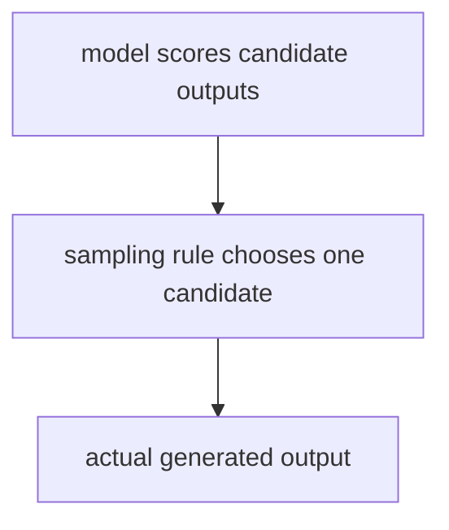
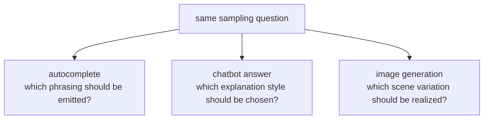

# P4-15.2 생성과 샘플링(sampling)

P4-15.1에서는 생성 모델(generative model)이 분류 모델과 달리 데이터 패턴을 학습해 새로운 출력 자체를 만들려는 모델이라는 점을 보았습니다. 그러면 다음 질문이 자연스럽게 따라옵니다.

생성 모델이 여러 그럴듯한 답을 만들 수 있다면, 실제로 어떤 답을 고르는가?

이 절은 그 질문에 답합니다.

샘플링(sampling)은 모델이 그럴듯하다고 본 여러 후보 중 실제 출력을 하나씩 꺼내는 과정이며, 이 방식이 결과의 다양성과 안정성에 직접 영향을 준다.

## 이 절의 범위

이 절은 다음 질문에 답합니다.

- 생성 모델의 출력이 왜 하나로 고정되지 않을 수 있는가?
- 샘플링(sampling)은 무엇을 한다고 설명할 수 있는가?
- 확률 분포와 출력 다양성은 어떤 관계가 있는가?
- 왜 같은 모델도 샘플링 방식에 따라 결과 느낌이 달라지는가?

이 절에서 먼저 닫아야 하는 핵심은 `생성 모델의 품질은 무엇을 배웠는가뿐 아니라, 후보들 중 무엇을 실제로 꺼내는가에도 크게 달려 있다`는 점입니다. 즉, 샘플링은 뒤의 제품 설정 이름을 예고하는 부가 옵션이 아니라, 생성 문제를 현재 장 안에서 완성시키는 핵심 선택 단계로 읽어야 합니다.

이 절에서는 다음 내용을 깊게 다루지 않습니다.

- beam search의 상세 구현
- top-k, top-p의 수학적 비교
- temperature 공식의 엄밀한 전개
- diffusion model의 역과정 샘플링 세부 구현

beam search, top-k, top-p, temperature의 세부 차이는 여기서 공식을 전개하지 않고 넘깁니다. 토큰 단위 생성에서 이런 선택 규칙이 실제 출력 길이와 다양성에 어떤 차이를 만드는지는 뒤 Part에서 다시 구체화합니다. diffusion model의 역과정 샘플링 세부 구현은 이 책의 현재 본편 범위 밖에 둡니다.

이 절에서는 생성형 AI를 사용할 때 `모델이 답을 아는가`라는 질문을 넘어, `모델이 답을 어떤 방식으로 꺼내는가`를 설명합니다.

여기서 실제로 닫아야 하는 설명은 `샘플링이 단순 옵션이 아니라 생성 문제의 일부`라는 점입니다. 세부 설정 이름은 뒤 Part에서 다시 보더라도, 현재 절 안에서 이미 `후보 분포를 계산하는 단계`와 `실제 출력을 꺼내는 단계`가 다르며, 결과 품질이 이 두 단계 모두에 걸려 있다는 감각을 끝내 잡아야 합니다.

## 이 절의 목표

- 샘플링을 `후보들 중 실제 출력을 선택하는 절차`로 설명할 수 있습니다.
- 생성 결과가 늘 같지 않을 수 있는 이유를 말할 수 있습니다.
- 다양성과 안정성의 균형이라는 관점으로 생성 결과를 읽을 수 있습니다.
- 뒤에서 나올 토큰(token), 다음 토큰 예측(next-token prediction), temperature 같은 개념의 필요성을 미리 이해할 수 있습니다.

## 이 절을 읽는 순서

이 절은 다음 순서로 읽으면 충분합니다.

1. 먼저 생성 출력이 왜 하나로 고정되지 않을 수 있는지 확인합니다.
2. 그 다음 샘플링을 `후보 중 실제 출력을 고르는 절차`로 읽습니다.
3. 이어서 다양성과 안정성의 균형이 왜 중요한지 봅니다.
4. 마지막에 이 개념이 왜 `모델 점수 계산`과 `실제 출력 선택`을 구분하게 만드는지 정리합니다.

## 왜 생성 출력은 하나로 고정되지 않을 수 있나

분류(classification) 문제에서는 보통 가장 높은 점수를 받은 클래스 하나를 선택하는 상황이 많습니다. 하지만 생성(generation) 문제는 다릅니다.

예를 들어 다음 문장을 생각해 볼 수 있습니다.

- `오늘 날씨가`

이 뒤에는 `좋다`, `맑다`, `화창하다`, `괜찮다` 같은 여러 표현이 자연스럽게 이어질 수 있습니다.

즉, 생성 문제는 처음부터 `정답이 하나만 있는 문제`가 아닐 수 있습니다.

그래서 생성 모델은 보통 여러 후보에 대해 상대적인 그럴듯함을 계산하고, 그 가운데 실제 출력을 선택하는 단계가 필요합니다.

P4-15.1이 `생성 모델은 무엇을 배우는가`를 설명하는 절이었다면, 이 절은 그 다음 단계인 `그렇게 계산한 후보들 중 실제 출력은 어떻게 꺼내는가`를 설명하는 절이라고 보면 됩니다.

## 샘플링(sampling)은 무엇을 하나

샘플링을 다음처럼 설명하면 충분합니다.

`샘플링은 모델이 더 그럴듯하다고 본 후보를 더 자주 고르되, 경우에 따라 다른 후보도 실제 출력으로 선택할 수 있게 하는 절차다.`

즉, 샘플링은 다음 두 극단 사이의 문제를 다룹니다.

- 항상 가장 높은 후보만 고르는 방식
- 가능한 후보를 너무 무작위로 섞어 버리는 방식

생성형 AI에서는 이 사이의 균형이 중요합니다.

즉, 이 절에서 꼭 잡아야 할 변화는 `모델이 무엇을 알았는가`에서 `그 알게 된 후보들 중 무엇을 실제로 내보내는가`로 질문이 이동했다는 점입니다.

입문 단계에서는 다음 세 방식만 구분해도 충분합니다.

| 방식 | 먼저 잡아야 할 감각 |
| --- | --- |
| argmax | 항상 가장 높은 후보만 고른다 |
| sampling | 높은 후보를 더 자주 고르되 다른 후보도 허용한다 |
| temperature 조정 | 후보 분포를 더 보수적이거나 더 다양하게 읽게 만든다 |

## 다양성과 안정성은 왜 함께 보아야 하나

샘플링을 전혀 하지 않고 가장 높은 후보만 반복해서 선택하면, 출력은 안정적으로 보일 수 있습니다. 하지만 결과가 지나치게 단조롭거나 반복적으로 느껴질 수 있습니다.

반대로 후보를 너무 넓게 허용하면 출력 다양성은 커질 수 있지만, 문장이 갑자기 부자연스러워지거나 의미가 흐트러질 수 있습니다.

이 절의 핵심을 다음처럼 기억하면 좋습니다.

`생성 품질은 정답 여부만이 아니라, 다양성과 안정성의 균형 문제이기도 하다.`

이 문장을 더 짧게 줄이면, `너무 좁게 고르면 반복되고, 너무 넓게 고르면 흐트러진다`는 감각을 먼저 잡으면 됩니다.

## 어떤 상황에서 어떤 균형을 먼저 보나

샘플링을 읽을 때는 `무조건 다양하게` 또는 `무조건 보수적으로`보다, 지금 무엇을 더 우선할지 먼저 보는 편이 좋습니다.

| 상황 | 먼저 보는 기준 | 더 먼저 떠올릴 선택 감각 |
| --- | --- | --- |
| 공지 문장 자동완성 | 반복 가능성, 흔들림 최소화 | 높은 확률 후보 중심 선택 |
| 설명형 챗봇 답변 | 정확성, 구조 안정성 | 비교적 보수적인 샘플링 |
| 아이디어 초안, 문구 시안 | 후보 폭, 표현 다양성 | 다양한 후보 허용 |
| 이미지 콘셉트 탐색 | 장면 변주, 스타일 폭 | 더 넓은 샘플링 허용 |

즉, 샘플링은 `재미를 늘리는 장치`만이 아니라, 출력의 일관성과 다양성 사이에서 어느 쪽을 더 우선할지 정하는 선택으로 읽는 편이 안전합니다.

## 같은 모델도 결과가 달라질 수 있는 이유

같은 모델이어도 다음 조건이 달라지면 결과가 달라질 수 있습니다.

- 어떤 후보까지만 남길지
- 확률 분포를 얼마나 날카롭게 읽을지
- 가장 높은 후보만 고를지, 여러 후보를 허용할지

이 때문에 사용자는 종종 `모델이 바뀌었다`고 느끼지만, 실제로는 출력 선택 전략이 바뀐 경우도 있습니다.

이 관점은 이후 토큰(token) 단위 생성과 프롬프트(prompt) 실험을 읽을 때 매우 중요해집니다.

## 아주 단순한 흐름으로 그리면



이 도식에서 확인해야 할 결과는 `모델 점수`를 계산하는 단계와 그 후보 중 무엇을 실제 출력으로 꺼낼지 정하는 단계가 서로 다르다는 점입니다.

## 사례로 보기

아래 도식은 이 절의 세 사례를 `무엇이 정답인가`보다 `여러 후보 중 무엇을 실제 출력으로 고를 것인가`라는 공통 질문으로 다시 묶은 것입니다.



이 도식에서 확인해야 할 점은 과업이 달라도 마지막 단계의 질문이 비슷하다는 것입니다. 모두 `후보 점수 계산` 뒤에 `실제로 어떤 출력을 꺼낼 것인가`를 정해야 하므로, 샘플링은 생성 결과를 사용자 경험으로 바꾸는 마지막 선택 단계로 읽어야 합니다.

### 사례 1. 문장 자동완성

`회의는 내일`

사람은 보통 `문맥상 가장 무난한 한 표현`을 먼저 떠올립니다. 그래서 자동완성도 늘 가장 높은 후보 하나만 고르면 된다고 생각하기 쉽습니다. 하지만 실제 문장에서는 `있습니다`, `열립니다`, `진행됩니다`처럼 여러 후보가 모두 자연스러울 수 있고, 문서 종류에 따라 더 어울리는 표현도 달라집니다. 예를 들어 회의 공지 메일에서는 `열립니다`가 자연스럽고, 일정 알림에서는 `진행됩니다`가 더 어울릴 수 있습니다. 항상 가장 높은 후보만 고르면 자동완성 문구가 매번 같은 말투로 굳고, 반대로 후보를 너무 넓게 허용하면 문맥에 덜 맞는 표현까지 튈 수 있습니다. 샘플링은 이 사이에서 어떤 후보를 실제로 꺼낼지 조절하는 단계입니다. 그래서 독자가 확인할 수 있는 결과는 자동완성 문구가 지나치게 반복되는지, 아니면 문맥을 유지한 채 적당한 표현 변주가 생기는지입니다.

### 사례 2. 챗봇 답변

사용자가 `정규화와 표준화의 차이를 설명해 줘`라고 물었을 때, 사람은 답이 하나로 정해져 있다고 느끼기 쉽습니다. 하지만 실제로는 시험 직전 요약이 필요한 사용자와 실무 문맥 예시가 필요한 사용자가 원하는 답 길이와 형식이 다를 수 있습니다. 예를 들어 한쪽은 `정규화는 값 범위를 맞추는 쪽, 표준화는 평균과 분산 기준으로 스케일을 맞추는 쪽` 같은 짧은 대비를 원하고, 다른 쪽은 `이미지 픽셀은 0~1로 정규화하고, 회귀 입력 변수는 평균 0 주변으로 표준화할 수 있다` 같은 예시가 붙는 편이 더 이해하기 쉽습니다. 사람이 먼저 쓰는 기준은 대개 `틀리지 않는가` 하나지만, 실제 사용자 경험에서는 길이, 말투, 예시 유무도 함께 중요합니다. 샘플링이 너무 보수적이면 늘 비슷한 짧은 답만 반복될 수 있고, 너무 넓으면 설명 흐름이 흩어질 수 있습니다. 그래서 이 사례에서 확인해야 할 결과는 핵심 정의는 유지하면서도 상황에 맞는 길이와 설명 방식이 실제로 선택되는가입니다.

### 사례 3. 이미지 생성 프롬프트

`a small cafe in the rain` 같은 프롬프트를 보면 사람은 머릿속에 한 장면을 먼저 떠올리기 쉽습니다. 하지만 모델 입장에서는 창가가 강조된 장면, 골목 구도가 강조된 장면, 따뜻한 색감의 장면처럼 여러 결과가 모두 그럴듯할 수 있습니다. 사람이 `한 장면`을 먼저 상상하는 것과 달리, 모델은 여러 시각 요소 조합을 후보로 둘 수 있습니다. 같은 프롬프트여도 한 번은 창가가 강조되고, 다른 한 번은 골목 구도가 강조될 수 있으며, 색감과 조명도 달라질 수 있습니다. 예를 들어 같은 비 오는 카페라도 한 결과는 실내 조명이 따뜻하고, 다른 결과는 거리 반사광이 강조될 수 있습니다. 샘플링은 이 후보들 중 무엇을 실제 장면으로 꺼낼지 정하는 단계이므로, 너무 좁으면 늘 비슷한 구도만 반복되고 너무 넓으면 프롬프트 중심 장면이 흐려질 수 있습니다. 그래서 이 사례에서 확인해야 할 결과는 같은 프롬프트를 반복했을 때 구도, 색감, 세부 묘사가 실제로 달라지되, `비 오는 작은 카페`라는 핵심 장면은 유지되는가입니다.

세 사례를 한 줄로 묶으면 다음과 같습니다.

| 상황 | 샘플링 차이가 드러나는 방식 |
| --- | --- |
| 문장 자동완성 | 표현이 더 반복적이거나 더 다양해질 수 있다 |
| 챗봇 답변 | 답이 더 간결하거나 더 서술적으로 달라질 수 있다 |
| 이미지 생성 | 구도, 색감, 세부 묘사가 달라질 수 있다 |

세 사례를 같은 기준으로 다시 정리하면, 샘플링을 `정답을 맞히는 문제`가 아니라 `어떤 후보군을 어떤 폭으로 실제 출력으로 꺼낼 것인가`의 문제로 읽기 쉬워집니다.

| 사례 | 모델이 가질 수 있는 후보 | 너무 좁게 고를 때 생기는 일 | 더 넓게 허용할 때 확인할 결과 |
| --- | --- | --- | --- |
| 문장 자동완성 | `열립니다`, `진행됩니다`, `있습니다` 같은 표현 후보 | 늘 같은 말투만 반복된다 | 문맥을 유지한 채 표현 변주가 생기는가 |
| 챗봇 답변 | 짧은 정의형, 예시 포함형, 비교형 답변 후보 | 늘 비슷한 길이와 구조만 나온다 | 핵심은 유지하면서 설명 형식이 달라지는가 |
| 이미지 생성 | 구도, 조명, 색감, 시점 후보 | 결과 장면이 지나치게 비슷해진다 | 핵심 프롬프트는 유지하면서 장면 변주가 생기는가 |

즉, 이 절의 책임은 `sampling 설정은 나중에 본다`로 미루는 데 있지 않습니다. 현재 절 안에서 이미 `생성 모델이 무엇을 배웠는가`와 `그 후보 중 무엇을 실제로 내보내는가`를 구분할 수 있어야 하고, 다음 Part는 이를 토큰 단위 생성과 서비스 설정 언어로 다시 읽는 단계로만 이어지면 충분합니다.

## 실행 가능한 Python 예제로 보기

이번 예제의 목표는 `항상 가장 높은 후보만 고르는 방식`과 `확률에 따라 여러 후보를 실제 문장으로 꺼내는 방식`의 차이를, 입문자가 바로 읽을 수 있는 자동완성 장면으로 확인하는 것입니다.

입력:

- 같은 문장 앞부분
- 뒤에 붙을 수 있는 네 개의 자동완성 후보
- 각 후보의 상대적 비중

출력:

- argmax 방식으로 완성한 문장들
- sampling 방식으로 여러 번 완성한 문장들
- 어떤 표현이 몇 번 선택됐는지에 대한 빈도
- 결과 문장의 평균 길이

문제 상황:

- argmax와 sampling은 같은 후보 집합에서도 서로 다른 문장 다양성을 만들 수 있다

확인할 개념:

- argmax는 가장 높은 후보를 고정적으로 택한다
- sampling은 확률 분포를 따라 여러 표현을 실제로 생성하게 만든다

입력(input):

위에 정리한 문장 prefix, 후보 표현 목록, 상대 가중치를 사용합니다.

```python
import random

prefix = "회의는 내일"
candidates = [
    "열립니다.",
    "진행됩니다.",
    "오전 10시에 시작됩니다.",
    "온라인으로 전환될 수 있습니다.",
]
weights = [0.42, 0.28, 0.18, 0.12]

argmax_choice = candidates[weights.index(max(weights))]
argmax_sentences = [f"{prefix} {argmax_choice}" for _ in range(5)]

random.seed(7)
sampled_choices = [random.choices(candidates, weights=weights, k=1)[0] for _ in range(12)]
sampled_sentences = [f"{prefix} {choice}" for choice in sampled_choices]
counts = {candidate: sampled_choices.count(candidate) for candidate in candidates}
avg_length = round(sum(len(sentence) for sentence in sampled_sentences) / len(sampled_sentences), 1)

print("argmax_sentences =", argmax_sentences)
print("sampled_sentences =", sampled_sentences)
print("counts =", counts)
print("average_sampled_length =", avg_length)
```

실행 결과 예시는 다음처럼 읽을 수 있습니다.

```text
argmax_sentences = ['회의는 내일 열립니다.', '회의는 내일 열립니다.', '회의는 내일 열립니다.', '회의는 내일 열립니다.', '회의는 내일 열립니다.']
sampled_sentences = ['회의는 내일 열립니다.', '회의는 내일 열립니다.', '회의는 내일 진행됩니다.', '회의는 내일 열립니다.', '회의는 내일 진행됩니다.', '회의는 내일 열립니다.', '회의는 내일 열립니다.', '회의는 내일 오전 10시에 시작됩니다.', '회의는 내일 열립니다.', '회의는 내일 진행됩니다.', '회의는 내일 열립니다.', '회의는 내일 열립니다.']
counts = {'열립니다.': 8, '진행됩니다.': 3, '오전 10시에 시작됩니다.': 1, '온라인으로 전환될 수 있습니다.': 0}
average_sampled_length = 13.8
```

이 예제에서 읽어야 할 핵심은 다음입니다.

- argmax 방식은 가장 높은 후보 하나만 반복하므로, 결과 문장이 매우 안정적이지만 말투 변주가 거의 없습니다
- sampling 방식은 `열립니다.`가 가장 자주 나오더라도 `진행됩니다.`나 더 긴 표현도 실제로 등장할 수 있습니다
- 빈도와 평균 길이를 함께 보면, 샘플링은 `어떤 표현이 얼마나 자주 나오나`뿐 아니라 `문장 길이와 설명 밀도`까지 바꾼다는 점이 드러납니다

즉, 샘플링은 단순히 랜덤함을 더하는 기능이 아니라, 사용자가 실제로 보게 되는 출력의 반복성, 표현 폭, 설명 밀도를 조절하는 단계로 읽어야 합니다.

생성 모델을 설명할 때 샘플링이 중요한 이유는, 생성형 AI를 `답을 저장해 둔 시스템`처럼 오해하지 않게 해 주기 때문입니다.

언어 모델(language model)은 대개 다음 토큰의 가능성을 계산하고, 이미지 생성 모델은 가능한 시각 패턴을 점차 구성합니다. 이때 실제 출력은 계산된 분포와 선택 전략을 거쳐 나타납니다.

커리큘럼 관점에서 이 절은 다음 연결을 준비합니다.

- 바로 앞의 P4-15.1 생성 모델을 `출력을 만든다`에서 `실제 출력을 어떤 방식으로 고르는가`로 더 구체화하고
- 토큰(token)과 토큰화(tokenization)
- 다음 토큰 예측(next-token prediction)
- temperature, top-k, top-p 같은 생성 설정
- 프롬프트(prompt)에 따라 출력이 달라지는 이유

즉, 이 절은 Part 4의 생성 모델 설명을 `실제 출력 선택 문제`까지 현재 파트 안에서 닫는 연결 절입니다.

따라서 이 절에서 확인해야 할 최종 결과는 샘플링을 `부가 옵션`이 아니라, 생성 모델이 계산한 후보 분포를 실제 사용자 경험의 출력으로 바꾸는 핵심 선택 단계로 설명할 수 있는가입니다.

## 다음 Part와의 연결

여기까지 오면 이제 질문이 조금 더 구체화됩니다.

- 생성 모델은 실제로 어떤 입력 단위로 텍스트를 읽는가?
- `다음 토큰`을 예측한다는 말의 토큰(token)은 정확히 무엇인가?
- 같은 문장도 왜 토큰화 방식에 따라 길이와 비용이 달라지는가?

이 질문은 다음 Part의 첫 장, P5-1.1 토큰(token)은 무엇인가로 이어집니다. 다만 여기서 이미 잡아야 하는 핵심은 `생성 품질은 후보 분포를 계산하는 단계와 실제 출력을 고르는 단계가 함께 만든다`는 점입니다.

## 이 절에서 기억할 관점

- 생성 모델은 후보들의 그럴듯함을 계산하고, 샘플링은 그중 실제 출력을 고릅니다.
- 생성 문제는 정답이 하나만 있는 문제가 아닐 수 있습니다.
- 다양성과 안정성의 균형이 생성 품질에 중요합니다.
- 이 관점은 뒤의 토큰, 다음 토큰 예측, 생성 설정 설명으로 이어집니다.

## 체크리스트

- 샘플링을 입문 수준에서 설명할 수 있는가?
- 왜 같은 모델도 결과가 달라질 수 있는지 말할 수 있는가?
- 다양성과 안정성의 균형을 생성 품질 관점에서 설명할 수 있는가?
- 이 절이 뒤의 토큰 설명으로 왜 이어지는지 말할 수 있는가?

## 출처와 참고 자료

- Ian Goodfellow, Yoshua Bengio, Aaron Courville, `Deep Learning`, MIT Press, 2016, 확인 날짜: 2026-06-29. [https://www.deeplearningbook.org/](https://www.deeplearningbook.org/){: target="_blank" rel="noopener noreferrer" }
- Christopher D. Manning, Hinrich Schutze, `Foundations of Statistical Natural Language Processing`, MIT Press, 1999, 확인 날짜: 2026-06-29.
- Jurafsky and Martin, `Speech and Language Processing` draft materials, 확인 날짜: 2026-06-29.
