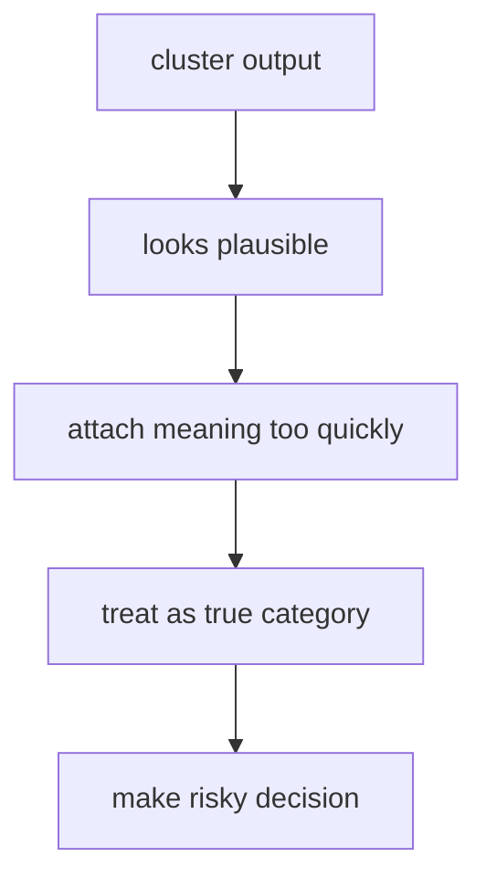
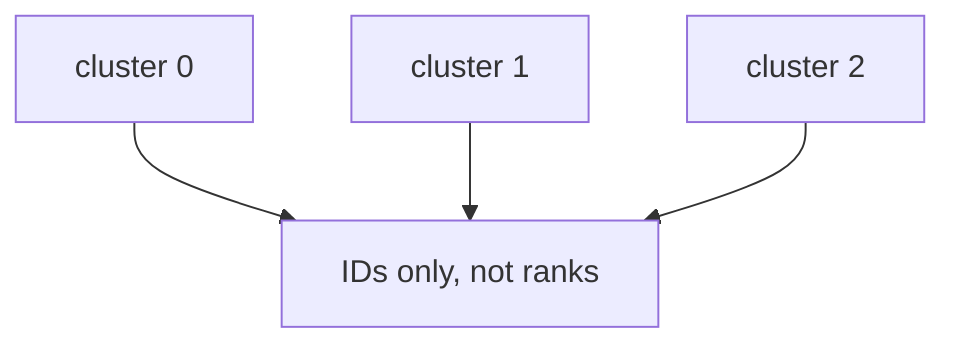
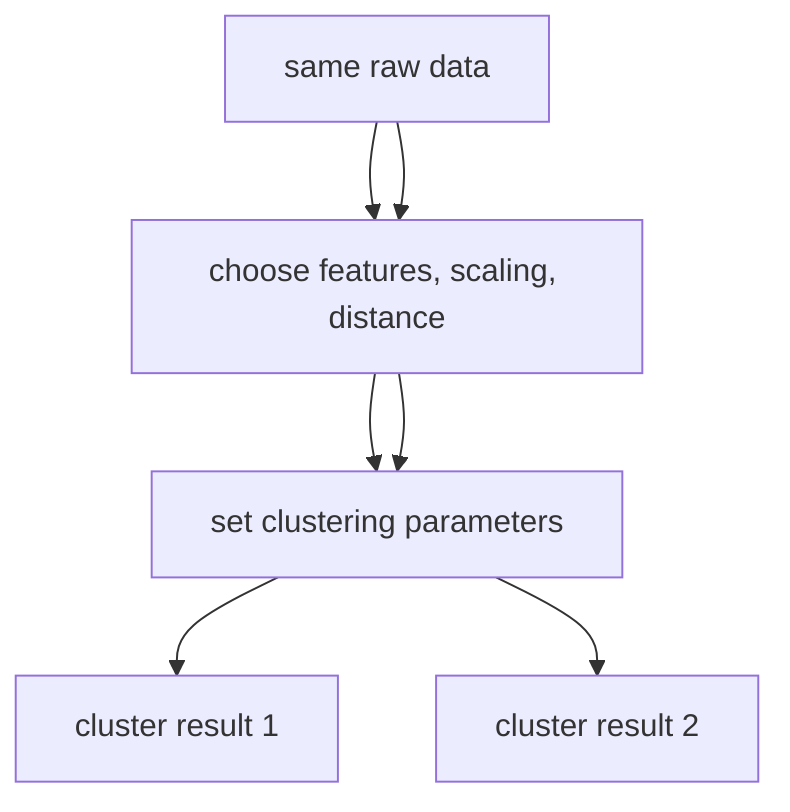
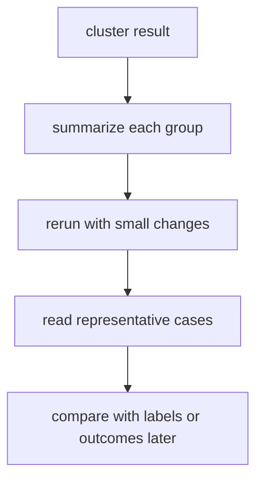
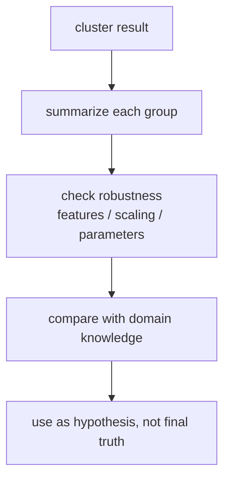
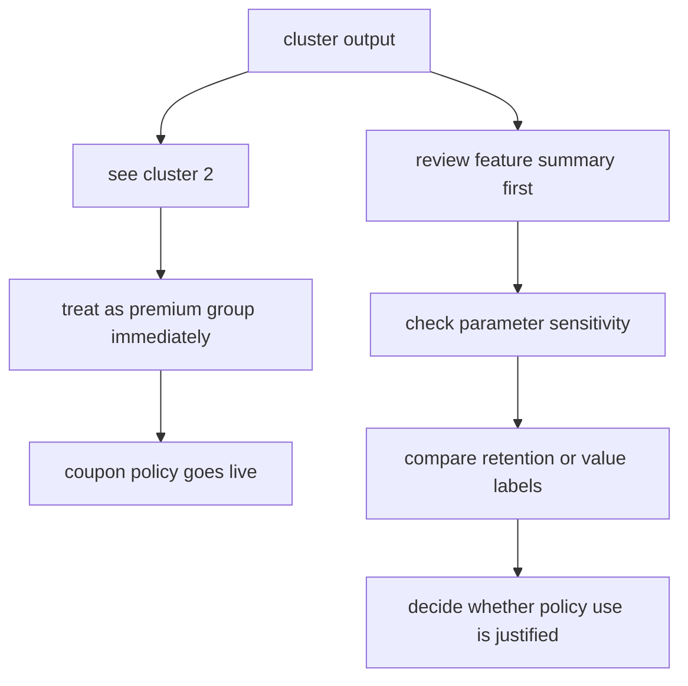

# P4-17.2 군집 결과를 해석할 때의 주의점

> Section ID: `P4-17.2`
> Version: `v2026.07.10`

P4-17.1에서는 클러스터링(clustering)을 라벨 없는 데이터에서 구조를 찾는 비지도학습(unsupervised learning) 문제로 보았습니다. 이제 더 중요한 단계는 해석입니다.

알고리즘이 묶음을 제안했다면, 그 묶음을 우리는 어디까지 믿어도 될까?

군집 결과는 데이터 구조에 대한 제안이지, 자동으로 확정된 정답이나 원인 설명이 아니다.

클러스터링의 위험은 보통 알고리즘 계산 자체보다 `사람이 결과를 과하게 해석하는 일`에서 더 자주 생깁니다.

이 절은 클러스터링의 기본 정의를 다시 길게 반복하지 않습니다. `라벨 없는 구조 탐색`이라는 핵심 직관은 P4-17.1과 [개념사전](../../../reference/concept-glossary.md)을 기준으로 다시 연결하고, 여기서는 그 결과를 어떻게 과신하지 않고 읽을지에만 집중합니다.

## 이 절의 범위

이 절은 다음 질문에 답합니다.

- 왜 군집 결과를 곧바로 정답(label)처럼 읽으면 안 되는가?
- 왜 같은 데이터도 표현 방식과 파라미터에 따라 다른 군집이 나올 수 있는가?
- 군집 번호는 왜 의미가 없는가?
- 군집 결과를 업무 정책이나 사람 평가로 바로 연결하면 왜 위험한가?
- 군집 결과를 어떻게 보수적으로 읽어야 하는가?

이 절은 다음 내용은 깊게 다루지 않습니다.

- 실루엣 점수(silhouette score), Davies-Bouldin index 같은 군집 평가 지표
- 고급 시각화와 임베딩 공간 왜곡
- 반지도학습(semi-supervised learning)의 전체 알고리즘 분류와 구현 절차

이 절은 입문적으로 `군집 결과를 과신하지 않는 태도`를 만드는 데 초점을 둡니다. 군집 평가 지표는 P4-6.4에서 다시 읽고, 시각화와 임베딩 공간 왜곡은 P4-18.2에서 다시 연결합니다. 반지도학습과의 연결은 현재 절 안에서 `군집이 왜 라벨 가설의 출발점은 될 수 있지만, 곧바로 정답 라벨을 대신하지는 못하는가` 수준까지 직접 회수하고, 전체 알고리즘 분류와 구현 절차는 길게 전개하지 않습니다.

## 이 절의 목표

- 군집 결과가 정답 클래스와 다르다는 점을 설명할 수 있습니다.
- 같은 데이터라도 특징 선택과 파라미터에 따라 다른 군집이 나올 수 있다는 점을 말할 수 있습니다.
- 군집 번호 자체에는 고정된 의미가 없다는 점을 설명할 수 있습니다.
- 군집 결과를 업무 판단에 연결할 때 왜 추가 검토가 필요한지 이해할 수 있습니다.

## 왜 이 절이 필요한가

클러스터링은 처음 보면 매우 설득력 있게 보일 수 있습니다.

- 데이터가 몇 묶음으로 나뉜다
- 각 묶음이 꽤 그럴듯해 보인다
- 그러면 이 묶음이 진짜 범주처럼 느껴진다

바로 여기서 오해가 시작됩니다.

클러스터링은 `정답을 맞힌 것`이 아니라 `구조를 제안한 것`입니다. 사람은 이 제안을 보고 의미를 붙이고 싶어 하지만, 그 의미 붙이기가 너무 빠르면 잘못된 결론으로 이어질 수 있습니다.

그래서 17.2는 클러스터링의 계산보다 `해석의 브레이크`를 배우는 절입니다.

### 언제 군집 해석을 특히 멈춰서 다시 봐야 하는가

클러스터링 결과가 그럴듯해 보일수록, 오히려 `지금 구조 제안과 의미 부여를 섞고 있지 않은가`를 더 빨리 점검해야 합니다.

| 보이는 장면 | 먼저 멈춰야 하는 이유 | 같이 확인할 것 |
| --- | --- | --- |
| 군집 번호에 곧바로 등급 의미를 붙이고 싶다 | 번호는 식별자일 뿐이기 때문 | 사람 검토 전 의미 부여 금지 |
| 특징/스케일/파라미터를 바꾸면 군집이 달라진다 | 유일한 진실이 아니라 렌즈 의존 결과일 수 있기 때문 | 어떤 설정에서 결과가 바뀌는지 기록 |
| 군집을 바로 위험군/우수군 정책으로 쓰고 싶다 | 구조 제안과 정책 결정을 섞을 위험이 크기 때문 | 실제 라벨/후속 성과 검증 |
| 군집 하나가 매우 그럴듯해 보여 확신이 생긴다 | 설명 후보를 진짜 범주로 과대해석하기 쉽기 때문 | 대표 사례와 대안 해석 검토 |
| 다른 실행에서 번호나 묶음이 조금 달라진다 | 결과 안정성이 충분하지 않을 수 있기 때문 | 재실행/재표현 비교 |

이 표의 목적은 군집을 못 믿게 만드는 것이 아니라, `어디서부터 탐색 결과를 사실처럼 다루기 시작하는가`를 먼저 멈춰 세우는 데 있습니다.

이 위험 흐름은 다음과 같습니다.



이 도식은 군집 결과를 너무 빠르게 사실처럼 받아들이는 위험한 해석 경로를 보여 줍니다. 묶음이 그럴듯해 보인다는 이유만으로 곧바로 진짜 범주처럼 취급하면, 마지막에는 정책 판단까지 과하게 앞질러 갈 수 있다는 점이 핵심입니다.

## 군집은 정답 라벨이 아니다

17.1에서 본 것처럼, 군집(cluster)은 알고리즘이 데이터 안에서 찾은 묶음입니다. 반면 정답 라벨(label)은 사람이 문제 정의에 따라 미리 정한 범주입니다.

이 둘은 겉보기에는 비슷할 수 있지만 역할이 다릅니다.

| 항목 | 정답 라벨(label) | 군집(cluster) |
| --- | --- | --- |
| 누가 정했는가 | 사람, 도메인 규칙, 데이터 수집 과정 | 알고리즘 |
| 목적 | 예측 대상 정의 | 구조 탐색 |
| 의미 | 보통 미리 정의됨 | 해석을 나중에 붙임 |
| 안정성 | 정의가 바뀌지 않으면 비교적 안정적 | 표현, 거리, 파라미터에 따라 달라질 수 있음 |

가장 중요한 문장은 이것입니다.

`군집은 설명 후보이지, 정답 범주가 아니다.`

## 군집 번호에는 왜 의미가 없는가

클러스터링 결과를 보면 종종 이런 식으로 나옵니다.

- cluster 0
- cluster 1
- cluster 2

여기서 많은 독자가 무의식적으로 다음처럼 읽습니다.

- 0은 낮은 등급
- 2는 높은 등급

하지만 보통 이런 해석은 틀립니다.

군집 번호는 단지 알고리즘이 임시로 붙인 식별자일 뿐입니다. 다음 실행에서는 같은 묶음이 다른 번호를 받을 수도 있습니다.

`cluster 2가 cluster 1보다 크다` 같은 해석은 보통 의미가 없습니다.



이 도식은 군집 번호가 등급이나 순서를 뜻하지 않는다는 점을 시각적으로 못 박습니다. `cluster 0`, `cluster 1`, `cluster 2`는 단지 식별자일 뿐이므로, 번호 크기만 보고 가치 판단을 붙이면 곧바로 잘못 읽게 됩니다.

## 왜 같은 데이터도 다른 군집이 나올 수 있는가

17.1에서 보았듯, 클러스터링은 `무엇을 비슷하다고 볼 것인가`에 크게 의존합니다. 따라서 같은 원본 데이터라도 다음이 달라지면 결과가 달라질 수 있습니다.

- 어떤 특징(feature)을 넣었는가
- 스케일(scale)을 맞췄는가
- 거리(distance)를 어떻게 봤는가
- 군집 수(k)를 몇으로 두었는가
- DBSCAN의 `eps`, `min_samples`를 어떻게 두었는가

클러스터링 결과는 보통 `데이터 그 자체의 유일한 진실`이 아니라 `표현과 기준 위에서 얻은 하나의 해석`입니다.

이 점을 한 번에 그리면 다음과 같습니다.



이 도식은 같은 원본 데이터라도 특징 선택, 스케일, 거리 기준, 파라미터가 바뀌면 서로 다른 군집 결과가 나올 수 있음을 한 번에 보여 줍니다. 즉, 알고리즘이 `유일한 진실`을 꺼낸다기보다, 어떤 렌즈와 기준으로 읽었는가에 따라 서로 다른 묶음을 제안할 수 있다는 뜻입니다.

이 그림의 의미는 단순합니다.

`같은 데이터여도 읽는 렌즈가 달라지면 묶음도 달라질 수 있다.`

## 특징 선택과 스케일이 왜 큰 영향을 주는가

예를 들어 고객 데이터를 군집화한다고 합시다.

- 월 방문 수는 1에서 20 사이
- 평균 구매 금액은 1만 원에서 100만 원 사이

이 두 특징을 그대로 같이 쓰면, 금액 축의 크기가 훨씬 커서 군집이 방문 수보다 금액 쪽에 더 끌릴 수 있습니다.

또 어떤 특징을 빼고 넣느냐에 따라 아예 다른 구조가 드러날 수도 있습니다.

클러스터링은 종종 이렇게 읽어야 합니다.

`군집이 달라졌다`보다 먼저 `무엇을 군집의 기준으로 삼았는가`를 봐야 한다.

## 파라미터가 군집을 만든다는 말의 뜻

k-means에서는 `k`를 몇으로 둘지에 따라 결과가 달라집니다. DBSCAN에서는 `eps`와 `min_samples`에 따라 dense region의 정의가 달라집니다.

여기서 중요한 것은 수식보다 다음 감각입니다.

- 알고리즘이 군집을 `발견`하는 부분이 있다
- 동시에 사람이 군집을 `유도`하는 부분도 있다

파라미터는 숨은 진실의 문을 여는 비밀번호라기보다, 구조를 어떻게 읽을지 정하는 손잡이에 가깝습니다.

바로 앞 도식에서 보았듯, 같은 데이터라도 `k`, `eps`, `min_samples` 같은 값을 바꾸면 묶음 방식이 달라질 수 있습니다. 그래서 군집 결과를 기록할 때는 `어떤 파라미터로 얻은 결과인가`를 함께 남겨야 합니다.

## 군집은 원인을 설명하지 않는다

클러스터링 결과를 보고 자주 나오는 위험한 해석은 다음과 같습니다.

- 이 군집은 충성 고객이다
- 이 군집은 문제 고객이다
- 이 군집은 위험군이다

이런 말은 가능할 수는 있지만, 자동으로 따라오지는 않습니다.

왜냐하면 클러스터링은 보통 다음까지만 말해 주기 때문입니다.

`이 점들은 서로 비슷하게 보인다.`

그 비슷함이 왜 생겼는지, 어떤 원인이 있는지, 어떤 정책을 적용해야 하는지는 별도의 분석이 필요합니다.

군집은 상관된 패턴을 제안할 수는 있어도 인과관계(causality)를 자동으로 주지는 않습니다.

## 반지도학습과는 어떻게 이어지나

클러스터링을 배우고 나면 자연스럽게 이런 생각이 나옵니다.

`라벨이 조금만 있는 상황이라면, 군집을 먼저 만든 뒤 그 묶음을 라벨 학습에 보조로 쓸 수 있지 않을까?`

이 질문은 반지도학습(semi-supervised learning)으로 이어집니다. 반지도학습은 보통 `적은 라벨 데이터`와 `많은 비라벨 데이터`를 함께 활용하려는 문제 설정입니다.

여기서 클러스터링은 다음처럼 연결될 수 있습니다.

| 먼저 보이는 연결 | 왜 바로 정답처럼 쓰면 안 되는가 |
| --- | --- |
| 비슷한 점들이 한 군집에 모이면 같은 라벨일 것 같아 보인다 | 군집은 유사도 구조를 반영할 뿐, 실제 정답 경계와 꼭 일치하지는 않기 때문입니다. |
| 라벨이 적을 때 군집이 라벨 후보를 제안해 줄 수 있다 | 잘못 묶인 군집에 라벨을 퍼뜨리면 오류도 함께 퍼질 수 있기 때문입니다. |
| 군집은 후속 라벨링 우선순위를 정하는 데 도움을 줄 수 있다 | 군집 번호 자체에는 의미가 없으므로 사람 검토 없이 자동 라벨로 넘기면 위험하기 때문입니다. |

즉, 군집은 반지도학습의 출발 보조 신호가 될 수는 있어도, 그 자체가 정답 라벨을 대신하는 장치는 아닙니다.

이 절의 중심 질문으로 다시 말하면 다음과 같습니다.

`군집이 그럴듯해 보여도, 그 묶음을 바로 참 정답처럼 취급하면 안 된다.`

그래서 반지도학습과 연결할 때도 먼저 필요한 태도는 같다. 군집을 `자동 라벨 생성기`로 읽지 않고, `라벨 가설과 검토 우선순위를 제안하는 도구`로 더 보수적으로 읽어야 합니다.

## 업무 정책에 바로 연결하면 왜 위험한가

클러스터링은 탐색적 분석(exploratory analysis)에 유용하지만, 바로 의사결정 규칙으로 옮기면 문제가 생길 수 있습니다.

예를 들어:

- `cluster 2는 이탈 위험군이니 자동으로 할인 쿠폰을 보내자`
- `cluster 1은 충성 고객이니 심사 절차를 줄이자`
- `cluster 0은 비정상 사용자 묶음이니 차단 후보로 두자`

이런 판단은 군집 결과 하나만으로는 너무 빠를 수 있습니다.

왜냐하면:

- 군집은 파라미터와 표현에 따라 달라질 수 있고
- 실제 업무 목표와 연결되는 라벨 검증이 없을 수 있으며
- 노이즈나 데이터 편향이 특정 묶음을 만들었을 가능성도 있기 때문입니다

즉, 군집은 `정책 자동화의 출발 버튼`이 아니라 `추가 검토의 시작 신호`에 더 가깝습니다. 군집 결과가 반복해서 보여도, 실제 라벨이나 후속 성과 지표와 대조하기 전에는 보수적으로 읽는 편이 맞습니다.

업무 연결에서도 같은 원칙이 적용됩니다. 군집이 나왔다고 바로 정책에 쓰는 것이 아니라, 각 그룹을 설명하고 도메인 데이터와 대조하고 후속 결과로 검증한 뒤에야 실제 활용을 검토해야 합니다.

## 그렇다면 무엇으로 극복해야 하는가

클러스터링의 위험을 줄이는 방법은 군집을 버리는 것이 아니라, `군집 결과를 바로 결론으로 쓰지 않도록 읽는 절차`를 갖추는 것입니다.

입문 수준에서는 다음 네 단계를 먼저 고정해 두면 좋습니다.

1. 군집 번호보다 각 군집의 대표 특징을 먼저 요약합니다.
2. 스케일, 특징, 파라미터를 조금 바꿔도 비슷한 구조가 남는지 봅니다.
3. 군집별 대표 사례를 실제 샘플 수준에서 다시 읽습니다.
4. 정책이나 의미 해석으로 넘어가기 전, 실제 라벨이나 후속 성과 지표와 대조합니다.

이 네 단계의 핵심은 `군집 출력 -> 즉시 해석`으로 가지 않고, 중간에 `요약`, `민감도 점검`, `대표 사례`, `후속 검증`을 끼워 넣는 데 있습니다.

| 바로 위험해지는 읽기 | 더 안전한 읽기 |
| --- | --- |
| `cluster 2니까 우수 고객군이다` | `cluster 2 구성원은 어떤 공통 패턴을 보이는가` |
| `이 묶음이 보였으니 정책으로 써도 되겠다` | `이 묶음이 다른 설정과 다른 기간에도 유지되는가` |
| `군집 하나가 그럴듯하니 원인도 설명된 것 같다` | `비슷하게 묶였다는 사실과 원인 설명은 분리한다` |

## 군집 결과를 본 뒤 바로 무엇을 해야 하는가

실무에서는 주의점만 기억하면 오히려 손이 멈춥니다. 그래서 군집 결과를 본 직후에는 아래 순서로 정리하는 편이 좋습니다.

| 순서 | 바로 할 일 | 왜 필요한가 |
| --- | --- | --- |
| 1 | 군집별 크기, 평균값, 대표 샘플을 적는다 | 번호가 아니라 실제 패턴으로 읽기 위해 |
| 2 | 스케일링, 특징 선택, 파라미터를 조금 바꿔 재확인한다 | 우연한 설정 의존 결과인지 보기 위해 |
| 3 | 도메인 관점에서 각 군집에 붙일 수 있는 해석 후보를 1~2개만 적는다 | 해석 후보와 확정 의미를 구분하기 위해 |
| 4 | 실제 라벨, 후속 반응, 운영 지표와 대조할 계획을 적는다 | 탐색 결과를 검증 단계로 넘기기 위해 |

이 절차를 한 줄로 줄이면 다음과 같습니다.

`군집을 봤다 -> 요약한다 -> 흔들어 본다 -> 대표 사례를 읽는다 -> 검증 질문을 남긴다.`



이 도식은 군집 결과를 본 뒤 `해석을 늦추고 검토 단계를 하나씩 넣는 흐름`을 보여 줍니다. 핵심은 알고리즘 출력을 멈춤 없이 정책으로 넘기지 않고, 중간에 사람 검토와 재확인 단계를 반드시 두는 것입니다.

### 작은 검토 메모로 남기면

군집 결과를 처음 본 뒤에는 긴 보고서보다 아래 정도의 짧은 메모가 더 실용적입니다.

| 항목 | 예시 메모 |
| --- | --- |
| 군집 요약 | `cluster 0: 저방문·저지출`, `cluster 1: 고방문·중지출` |
| 민감도 점검 | `표준화 적용 시 cluster 1과 2 경계 일부 재배치` |
| 대표 사례 | `A, C는 자주 방문하지만 구매액은 높지 않음` |
| 다음 검증 | `다음 달 재방문율과 장기 가치로 다시 대조` |

이 정도 메모만 있어도 `번호만 보고 의미를 붙이는 오해`, `한 번 나온 결과를 진실처럼 고정하는 오해`를 크게 줄일 수 있습니다.

## 짧은 점검

- cluster ID를 등급이나 고정 범주처럼 읽고 있지 않은가?
- 표현 방식과 파라미터가 바뀌면 결과도 바뀔 수 있다는 점을 전제로 두고 있는가?
- 군집 결과를 정책으로 옮기기 전에 사람 검토와 후속 검증 단계를 남기고 있는가?

## 연습 및 예제

이번 예제는 고객을 두 군집으로 나누었다고 해서 그 번호가 자동으로 의미를 가지지 않는다는 점을 보여 주는 작은 실습입니다. 여기서는 번호만 바뀌어도 해석 문장이 그대로 유지되어야 한다는 점까지 직접 확인합니다.

- 문제 상황: 알고리즘이 두 그룹을 만들었지만, 번호만 보고 의미를 붙이면 안 된다는 점을 본다
- 입력(input): 고객별 cluster ID와 관찰값
- 기대 출력(output): 번호와 의미를 분리해서 읽는 감각
- 확인할 개념:
  - cluster ID는 식별자이지 등급이 아니다
  - 의미는 나중에 사람이 검토해서 붙인다

```python
customers = [
    {"name": "A", "cluster": 0, "visits": 3, "spend": 20},
    {"name": "B", "cluster": 0, "visits": 2, "spend": 18},
    {"name": "C", "cluster": 1, "visits": 10, "spend": 95},
    {"name": "D", "cluster": 1, "visits": 11, "spend": 88},
]

cluster_0 = [c["name"] for c in customers if c["cluster"] == 0]
cluster_1 = [c["name"] for c in customers if c["cluster"] == 1]

print("cluster 0 members:", cluster_0)
print("cluster 1 members:", cluster_1)
print("note: cluster IDs are labels for groups, not ranks.")
```

실행 결과는 다음과 같습니다.

```text
cluster 0 members: ['A', 'B']
cluster 1 members: ['C', 'D']
note: cluster IDs are labels for groups, not ranks.
```

이 예제에서 읽어야 할 것은:

1. 숫자 0과 1은 단지 묶음을 구분하는 번호입니다.
2. `cluster 1이 더 우수하다` 같은 해석은 데이터 의미를 따로 검토하기 전에는 할 수 없습니다.
3. 군집의 의미를 붙이려면 각 군집의 특징 요약, 업무 맥락, 추가 검증이 필요합니다.

### 값 하나 바꿔 보기: 번호를 뒤집어도 해석은 그대로여야 한다

이번에는 같은 고객 묶음을 유지한 채 cluster 번호만 뒤집어 봅니다.

```python
customers = [
    {"name": "A", "cluster": 1, "visits": 3, "spend": 20},
    {"name": "B", "cluster": 1, "visits": 2, "spend": 18},
    {"name": "C", "cluster": 0, "visits": 10, "spend": 95},
    {"name": "D", "cluster": 0, "visits": 11, "spend": 88},
]

cluster_0 = [c["name"] for c in customers if c["cluster"] == 0]
cluster_1 = [c["name"] for c in customers if c["cluster"] == 1]

print("cluster 0 members:", cluster_0)
print("cluster 1 members:", cluster_1)
print("note: the members changed labels, not their behavior.")
```

```text
cluster 0 members: ['C', 'D']
cluster 1 members: ['A', 'B']
note: the members changed labels, not their behavior.
```

번호를 뒤집었는데 고객 행동은 아무것도 달라지지 않았습니다. 이 비교는 군집 결과를 읽을 때 `번호 -> 의미`로 바로 가면 안 되고, 반드시 `구성원 -> 특징 요약 -> 업무 해석` 순서로 가야 한다는 점을 체감하게 합니다. 따라서 군집 결과가 그럴듯해 보여도 정책 규칙으로 넘기기 전에 번호가 아니라 실제 패턴을 문장으로 다시 써야 합니다.

### 이 연습이 Part 4 목표를 어떻게 회수하는가

Part 4의 목표는 모델 결과를 사실처럼 소비하는 대신, 결과가 무엇을 뜻하고 무엇을 아직 뜻하지 않는지 구분하는 판단력을 만드는 데 있습니다. 이 연습은 `군집 번호는 식별자일 뿐`이라는 가장 작은 변화로 그 판단을 직접 확인하게 합니다. 즉, 학습자는 여기서 클러스터링 결과를 본 뒤에도 `무엇을 바로 말할 수 있고 무엇은 후속 검증이 필요한가`를 분리하는 훈련을 해야 하며, 이 분리가 빠지면 본문 전체가 다시 오버뷰처럼 읽히게 됩니다.

| 공통 기록 언어 | 이번 연습에서 바로 남길 내용 |
| --- | --- |
| 보인 구조 | 군집 번호는 바뀌어도 실제 고객 행동 패턴은 그대로였다 |
| 해석 경계 | `cluster 0`, `cluster 1` 같은 번호 자체에는 등급이나 의미가 없다 |
| 다음 질문 | 각 군집을 대표하는 특징 요약과 후속 지표를 붙이면 어떤 해석이 유지되는가 |

## 군집 결과를 어떻게 보수적으로 읽을 것인가

군집 결과는 다음 질문 순서로 읽습니다.

1. 이 군집은 어떤 특징 기준에서 만들어졌는가?
2. 다른 스케일링이나 파라미터에서도 비슷한 구조가 보이는가?
3. 각 군집을 요약하면 실제로 어떤 차이가 있는가?
4. 이 차이는 업무적으로 해석 가능한가?
5. 정책에 쓰기 전에 별도 라벨이나 후속 분석으로 확인했는가?

이 흐름을 도식으로 보면 다음과 같습니다.



핵심은 마지막 문장입니다.

`군집 결과는 가설(hypothesis)로 쓰고, 최종 진실(final truth)로 쓰지 않는다.`

군집 결과를 검토 메모에 남길 때는 `검토 필요`, `해석 후보`, `다음 확인 질문`으로 분리해 적습니다. 곧바로 정책 이름이나 원인 이름으로 고정하지 않는 것이 핵심입니다.

| 먼저 보인 군집 결과 | 바로 붙일 해석 경계 | 다시 확인할 review 질문 |
| --- | --- | --- |
| 몇 개 군집이 꽤 그럴듯하게 나뉜다 | 지금 보이는 묶음은 정답 범주가 아니라 표현과 파라미터 위의 제안이다 | 다른 특징, 스케일, 파라미터에서도 비슷한가 |
| 특정 군집이 위험군처럼 보인다 | 군집 번호와 묶음 모양만으로 정책 의미를 확정하지 않는다 | 실제 성과 지표나 라벨과 연결해도 같은가 |

## 17.1과 17.2를 함께 보면

17.1이 `어떻게 묶을 수 있는가`를 설명했다면, 17.2는 `그 묶음을 어디까지 믿을 것인가`를 설명합니다.

| 절 | 중심 질문 |
| --- | --- |
| P4-17.1 | 라벨이 없을 때 어떤 구조를 찾아볼 수 있는가 |
| P4-17.2 | 찾은 구조를 어떻게 과신하지 않고 읽을 것인가 |

이 두 절을 함께 이해해야 클러스터링을 실무에서 안전하게 다룰 수 있습니다.

## 사례 및 예시

### 사례 1. 군집 번호를 바로 고객 등급으로 써서 쿠폰 정책을 만들면 왜 위험할까

마케팅 팀이 고객 데이터를 군집화한 뒤 `cluster 2` 고객에게만 큰 할인 쿠폰을 자동 발송하려 한다고 해 보겠습니다. 하지만 이 번호는 단지 알고리즘이 붙인 식별자일 뿐이고, 다른 특징 선택이나 다른 `k` 값으로 다시 돌리면 같은 고객들이 다른 번호를 받을 수도 있습니다. 더구나 현재 군집이 실제 이탈 위험이나 장기 가치와 연결되는지도 검증되지 않았다면, 쿠폰 비용만 늘고 핵심 고객은 놓칠 수 있습니다. 그래서 군집 결과는 바로 정책 규칙으로 쓰기보다, 각 군집의 특성을 요약하고 후속 성과 지표와 대조하는 검토 단계를 거쳐야 합니다.



이 사례를 프로젝트 메모처럼 줄이면 다음처럼 적을 수 있습니다.

| 현재 군집 해석 | 왜 바로 쓰면 위험한가 | 먼저 남길 검토 항목 | 다음 질문 |
| --- | --- | --- | --- |
| `cluster 2`를 우수 고객군처럼 읽고 싶다 | 번호 자체에는 고정 의미가 없고 다른 설정에서 재배치될 수 있다 | 군집별 특징 요약, 스케일/파라미터 민감도, 실제 구매 유지율 | 이 군집 구분이 다른 데이터 구간에서도 유지되는가 |

## 이 절에서 기억할 관점

- 군집은 정답 라벨이 아니라 알고리즘이 제안한 묶음입니다.
- 군집 번호 자체에는 보통 의미나 순위가 없습니다.
- 특징 선택, 스케일, 거리, 파라미터가 바뀌면 군집도 달라질 수 있습니다.
- 군집은 원인을 자동으로 설명하지 않습니다.
- 군집 결과는 정책의 최종 근거가 아니라 추가 분석의 출발점으로 써야 합니다.

| 같이 봐야 할 것 | 이 절에서 먼저 읽는 질문 | 바로 다음에 이어질 곳 |
| --- | --- | --- |
| 해석 경계 | 지금 보인 군집을 어디까지 믿고 어디서 멈출 것인가 | Part 4 summary, Part 6 회고 기록 |
| 대표 검토 항목 | 군집별 요약, 파라미터 민감도, 후속 지표를 무엇부터 볼 것인가 | 차원 축소와 함께 보는 가설 검토 |
| 다음 검증 질문 | 정책이나 의미 해석으로 넘어가기 전에 무엇이 더 필요할까 | 라벨 대조, 후속 성과 분석 |

## 언제 이 관점을 먼저 떠올려야 하는가

- cluster ID를 등급이나 정책 규칙으로 바로 쓰고 싶어질 때, 번호 자체에는 고정 의미가 없다는 점을 먼저 떠올립니다.
- 특징 표현이나 파라미터를 바꿨을 때 군집이 재배치될 수 있음을 설명해야 할 때, 군집의 불안정성 가능성을 다시 봅니다.
- 군집 결과를 원인 설명이나 자동 정책으로 넘기기 전에, 후속 지표와 라벨 대조가 더 필요하다는 경계를 꺼냅니다.

## 출처와 참고 자료

- scikit-learn developers, `2.3. Clustering`, scikit-learn User Guide, 확인 날짜: 2026-06-27. [https://scikit-learn.org/stable/modules/clustering.html](https://scikit-learn.org/stable/modules/clustering.html){: target="_blank" rel="noopener noreferrer" }
- scikit-learn developers, `Common pitfalls and recommended practices`, scikit-learn User Guide, 확인 날짜: 2026-06-27. [https://scikit-learn.org/stable/common_pitfalls.html](https://scikit-learn.org/stable/common_pitfalls.html){: target="_blank" rel="noopener noreferrer" }
