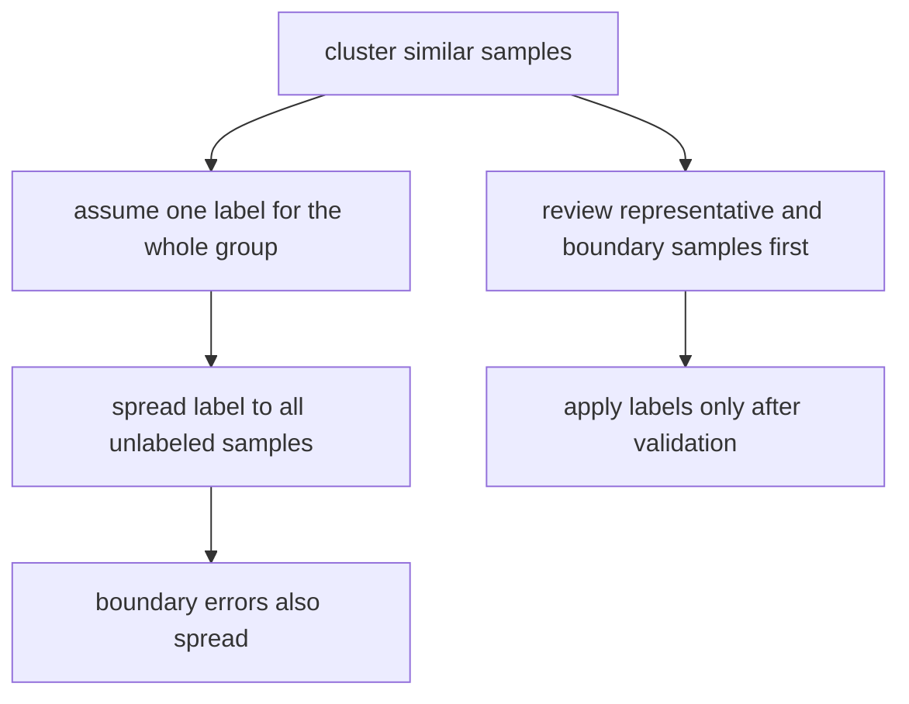

# P4-17.4 보충학습: 군집과 반지도학습을 처음 연결하는 법

> Section ID: `P4-17.4`
> Version: `v2026.07.10`

P4-17.2까지 읽고 나면 이런 질문이 자연스럽게 남습니다.

군집이 라벨 가설을 제안할 수 있다면, 적은 라벨과 많은 비라벨 데이터를 함께 쓰는 반지도학습(semi-supervised learning)과는 어떻게 이어질까?

이 절은 반지도학습의 전체 알고리즘 분류를 길게 나열하기보다, `군집은 어디까지 보조 신호가 될 수 있고 어디서부터 사람 검토와 추가 학습이 필요한가`를 처음 구분하는 보충학습입니다.

## 이 절의 범위

이 절은 다음 질문에 답합니다.

- 반지도학습은 어떤 문제 장면에서 등장하는가?
- 군집은 왜 라벨 가설의 보조 신호가 될 수 있는가?
- 군집을 바로 자동 라벨 생성기로 읽으면 왜 위험한가?
- 반지도학습을 처음 읽을 때 무엇부터 구분하면 좋은가?

이 절은 `적은 라벨`, `많은 비라벨`, `가설`, `검토`라는 네 손잡이로 반지도학습의 출발점을 읽는 데 집중합니다.

## 이 절의 목표

- 반지도학습을 `조금 있는 라벨과 많이 있는 비라벨을 함께 활용하는 문제 설정`으로 설명할 수 있습니다.
- 군집이 라벨 가설의 보조 신호는 될 수 있지만 정답 라벨을 자동으로 대신하지는 못한다는 점을 말할 수 있습니다.
- 군집, 사람 검토, 후속 학습이 어떤 순서로 이어져야 더 안전한지 설명할 수 있습니다.

## 왜 이 절이 필요한가

반지도학습을 처음 들으면 보통 두 가지 오해가 같이 생깁니다.

- 라벨이 적으면 군집으로 묶어서 그대로 라벨을 퍼뜨리면 될 것 같다
- 군집이 그럴듯하면 추가 검토 없이 학습 데이터로 써도 될 것 같다

하지만 실제로는 바로 그 지점이 가장 위험합니다.

군집은 `비슷해 보이는 묶음`을 제안할 수는 있지만, 그 묶음이 실제 정답 경계와 같은지는 별도 검토가 필요합니다.

즉, 이 절의 핵심은 `군집 -> 자동 라벨`이 아니라 `군집 -> 라벨 가설 -> 사람 검토 -> 제한적 반영` 흐름을 처음 붙잡는 데 있습니다.

## 반지도학습은 어떤 장면에서 등장하는가

반지도학습은 보통 라벨을 붙이는 비용이 크지만, 비라벨 데이터는 많이 모이는 장면에서 등장합니다.

예를 들어:

- 기사 문서는 많이 쌓이지만 사람이 주제 라벨을 다 붙이기 어렵다
- 고객 행동 로그는 많지만 이탈 원인 라벨은 일부만 있다
- 이미지 데이터는 많지만 정답 분류 태그는 일부만 검수되어 있다

이런 장면에서는 `이미 있는 적은 라벨`과 `아직 라벨이 없는 많은 데이터`를 함께 활용하려는 발상이 자연스럽게 나옵니다.

이 차이를 더 분명히 적으면 다음처럼 읽을 수 있습니다.

| 문제 장면 | 군집만으로 먼저 하는 일 | 반지도학습으로 더 이어지는 일 |
| --- | --- | --- |
| 기사 문서 정리 | 비슷한 기사 묶음을 먼저 본다 | 일부 주제 라벨을 바탕으로 비라벨 기사 검토를 더 빠르게 돕는다 |
| 고객 문의 분류 | 비슷한 문의 유형을 먼저 묶는다 | 이미 붙은 상담 라벨을 바탕으로 새 문의의 후보 분류를 더 좁힌다 |
| 이미지 묶음 확인 | 비슷한 이미지 덩어리를 먼저 찾는다 | 검수된 소수 라벨을 이용해 비라벨 이미지 분류 학습을 보조한다 |

즉, 군집이 `구조를 먼저 본다`에 더 가깝다면, 반지도학습은 `그 구조와 적은 라벨을 함께 써서 후속 학습을 돕는다`에 더 가깝습니다.

## 군집은 왜 보조 신호가 될 수 있는가

군집이 유용한 이유는 비슷한 샘플이 한 묶음에 모이는 장면을 먼저 제안해 줄 수 있기 때문입니다.

즉, 사람이 다음처럼 생각할 수 있습니다.

- 이 샘플들과 저 샘플들이 비슷하게 모였다
- 그렇다면 일부 라벨 샘플의 정보가 주변 비라벨 샘플 검토에 도움을 줄 수 있겠다

입문적으로는 다음 정도만 붙잡으면 충분합니다.

| 먼저 보이는 연결 | 왜 유용한가 |
| --- | --- |
| 비슷한 샘플이 한 묶음에 모인다 | 라벨 검토 우선순위를 줄이는 데 도움을 줄 수 있기 때문 |
| 군집 안에 이미 라벨이 붙은 샘플이 있다 | 주변 비라벨 샘플의 후보 라벨을 더 빨리 의심해 볼 수 있기 때문 |
| 경계 샘플이 따로 보인다 | 어디를 사람이 먼저 확인해야 하는지 더 잘 드러나기 때문 |

핵심은 군집이 `검토 우선순위`를 제안해 준다는 점입니다.

이를 더 짧게 정리하면 다음과 같습니다.

| 군집이 직접 주는 것 | 사람이 이어서 해야 하는 것 |
| --- | --- |
| 비슷해 보이는 묶음 | 이 묶음이 실제 라벨과도 같은지 검토 |
| 대표 샘플과 경계 샘플 후보 | 어디까지 라벨 후보를 넓혀도 되는지 판단 |
| 검토 순서 단서 | 어떤 샘플은 자동화하지 말고 직접 확인할지 결정 |

## 왜 바로 자동 라벨 생성기로 읽으면 위험한가

군집은 정답 구조가 아니라 유사도 구조를 먼저 반영합니다. 따라서 한 군집 안에 비슷해 보이지만 실제 라벨은 다른 샘플이 섞일 수 있습니다.

예를 들어 기사 군집 안에 다음이 함께 들어올 수 있습니다.

- 반도체 기업 실적 기사
- 정부 산업 정책 기사
- AI 칩 투자 기사

셋은 비슷한 주제권처럼 보일 수 있지만, 실제 편집 라벨이나 학습 라벨은 `기업`, `정책`, `기술`처럼 다를 수 있습니다.

따라서 군집 전체에 라벨을 한 번에 퍼뜨리면, 첫 가설의 오류가 더 넓게 번질 수 있습니다.



이 도식의 핵심은 단순합니다. 군집은 시작점일 수 있지만, 검토 없는 자동 전파는 오류까지 같이 키울 수 있습니다.

이 위험을 조금 더 작업 흐름으로 적으면 다음과 같습니다.

| 너무 빠른 흐름 | 더 안전한 흐름 |
| --- | --- |
| 군집 생성 -> 군집 이름 붙이기 -> 전체 자동 라벨 전파 | 군집 생성 -> 대표/경계 샘플 검토 -> 제한적 라벨 후보 생성 -> 후속 검증 |
| 비슷해 보이니 같은 라벨일 것이라 가정 | 비슷해 보여도 경계 사례는 따로 본다 |
| 검토 비용을 줄이려다 오류 전파를 키움 | 검토 우선순위를 줄이되 오류 전파는 늦춘다 |

## 처음 구분할 때 무엇부터 보면 좋은가

반지도학습을 처음 읽을 때는 알고리즘 이름보다 다음 질문이 더 중요합니다.

| 질문 | 왜 먼저 필요한가 |
| --- | --- |
| 지금 라벨이 적은가, 아니면 아예 없는가 | 지도학습 보강인지 비지도 탐색인지 출발점이 달라지기 때문 |
| 군집은 후보 라벨을 제안하는가, 정답을 확정하는가 | 군집의 역할 경계를 먼저 세워야 하기 때문 |
| 어떤 샘플을 사람이 다시 검토해야 하는가 | 경계 사례를 놓치면 오류 전파가 커질 수 있기 때문 |
| 라벨을 붙인 뒤 무엇으로 다시 검증할 것인가 | 가설과 실제 학습 품질을 구분해야 하기 때문 |

이 질문들을 먼저 적어 두면, 반지도학습을 `자동 라벨링 기계`가 아니라 `사람 검토와 학습 절차를 연결하는 설정`으로 더 안전하게 읽을 수 있습니다.

## 사례 및 예시

### 사례 1. 기사 라벨이 일부만 있을 때 군집을 검토 순서로 쓰고 싶을 때

뉴스 팀이 기사 10만 건을 갖고 있지만, 실제 주제 라벨이 붙은 것은 5천 건뿐이라고 해 보겠습니다. 이때 군집으로 비슷한 기사 묶음을 먼저 만들면, 편집자는 모든 기사를 무작위로 보지 않고 `같은 묶음 안에서 대표 기사와 경계 기사`부터 검토할 수 있습니다. 즉, 군집은 정답 라벨을 대신하는 장치가 아니라 `어디부터 라벨 검토를 시작할지`를 제안하는 정리 도구가 됩니다.

| 먼저 하는 일 | 바로 하지 않는 일 |
| --- | --- |
| 군집별 대표 기사와 경계 기사를 본다 | 군집 전체에 주제 라벨을 자동 전파하지 않는다 |
| 일부 라벨 기사와 비라벨 기사를 함께 대조한다 | 군집 번호를 곧바로 정답 주제명으로 쓰지 않는다 |

### 사례 2. 고객 문의 라벨이 적을 때 상담 분류를 너무 빨리 자동화하고 싶어질 때

고객센터 팀이 문의 로그를 많이 쌓아 두었지만, 실제로는 일부 문의에만 `배송 지연`, `환불 요청`, `기능 오류` 같은 라벨이 붙어 있다고 해 보겠습니다. 이때 비슷한 문의가 한 군집에 모이는 것을 보고 `이 군집 전체를 환불 요청으로 자동 분류하자`고 생각할 수 있습니다. 하지만 같은 군집 안에도 환불을 문의하는 고객, 배송 지연 때문에 불만을 말하는 고객, 제품 불량을 신고하는 고객이 함께 섞일 수 있습니다.

그래서 더 안전한 흐름은 군집을 `자동 분류 완료`의 신호로 쓰는 것이 아니라, `어느 문의 묶음을 먼저 검토하고 어떤 라벨 후보를 우선 비교할 것인가`를 정리하는 신호로 쓰는 것입니다. 즉, 반지도학습의 핵심은 검토를 없애는 것이 아니라, 검토를 더 집중해서 배치하는 데 있습니다.

| 먼저 보인 군집 | 바로 하면 안 되는 일 | 더 안전한 다음 단계 |
| --- | --- | --- |
| 환불/불만 문의가 비슷하게 모인다 | 군집 전체를 하나의 라벨로 고정한다 | 대표 문의와 경계 문의를 나눠 검토한다 |
| 일부 라벨 문의가 군집 안에 섞여 있다 | 그 라벨을 비라벨 문의 전체에 곧바로 전파한다 | 실제 표현 차이와 후속 처리 결과를 다시 본다 |

## 연습 및 예제

이번 예제는 `군집이 라벨 후보를 제안할 수는 있지만, 자동 확정까지는 바로 갈 수 없다`는 점을 아주 작은 표로 확인하는 실습입니다.

- 문제 상황: 일부만 라벨이 붙은 기사 묶음에서 군집을 라벨 후보 검토 순서로 쓸 수 있는지 본다
- 입력(input): 군집 ID, 기사 요약, 일부 라벨
- 기대 출력(output): 같은 군집 안에서도 검토가 더 필요한 경계 샘플이 있다는 감각
- 확인할 개념:
  - 군집은 유사도 구조를 먼저 보여 준다
  - 라벨 후보는 줄일 수 있어도 자동 확정은 위험할 수 있다

```python
articles = [
    {"id": "A", "cluster": 0, "topic_hint": "AI chip investment", "label": "tech"},
    {"id": "B", "cluster": 0, "topic_hint": "semiconductor policy", "label": None},
    {"id": "C", "cluster": 0, "topic_hint": "data center expansion", "label": None},
    {"id": "D", "cluster": 1, "topic_hint": "football match result", "label": "sports"},
]

for article in articles:
    print(article["id"], "cluster=", article["cluster"], "label=", article["label"], "hint=", article["topic_hint"])
```

실행 결과는 다음처럼 읽을 수 있습니다.

```text
A cluster= 0 label= tech hint= AI chip investment
B cluster= 0 label= None hint= semiconductor policy
C cluster= 0 label= None hint= data center expansion
D cluster= 1 label= sports hint= football match result
```

여기서 바로 `cluster 0 전체가 tech`라고 확정하면 위험합니다. `semiconductor policy`는 산업 정책 기사로도 읽힐 수 있고, `data center expansion`은 투자·산업·기술 맥락이 함께 섞일 수 있기 때문입니다. 하지만 이 예제는 동시에 유용한 점도 보여 줍니다. 적어도 `cluster 0` 묶음이 같은 기사 묶음 안에서 먼저 검토해야 할 후보라는 사실은 더 빨리 잡을 수 있습니다.

즉, 반지도학습의 실무 감각은 `군집이 라벨을 대신한다`가 아니라 `군집이 검토 순서를 더 똑똑하게 줄인다`에 가깝습니다.

## 이 절에서 기억할 관점

- 반지도학습은 적은 라벨과 많은 비라벨을 함께 쓰는 문제 설정입니다.
- 군집은 라벨 가설과 검토 우선순위를 제안할 수 있지만, 정답 라벨을 자동으로 대신하지는 못합니다.
- 더 안전한 흐름은 `군집 -> 대표/경계 샘플 검토 -> 제한적 반영 -> 후속 검증`입니다.
