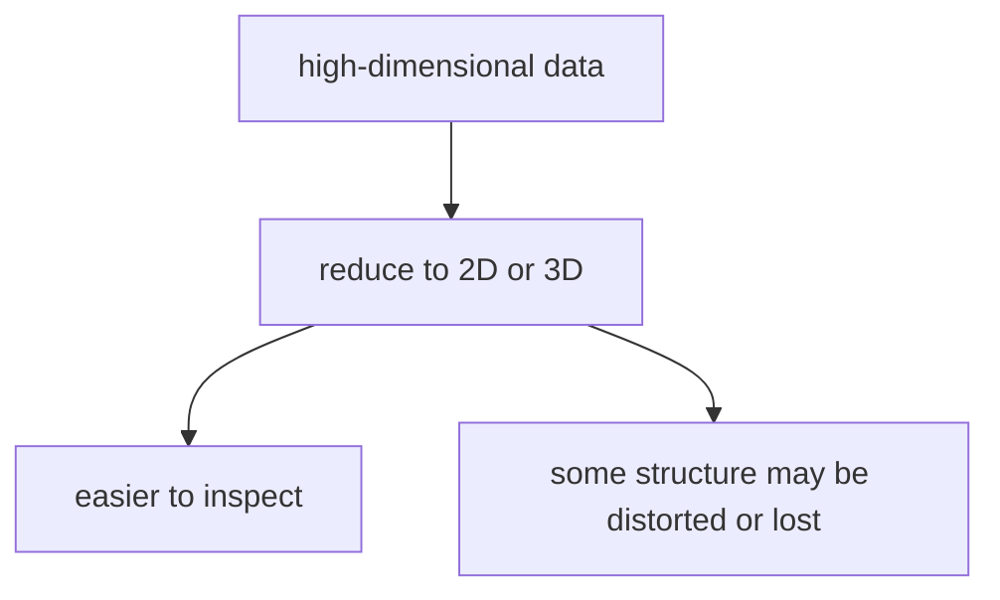
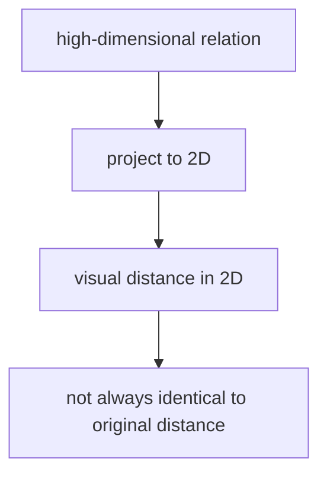
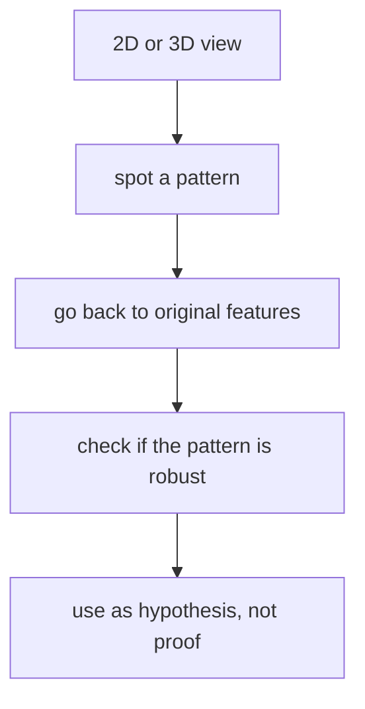
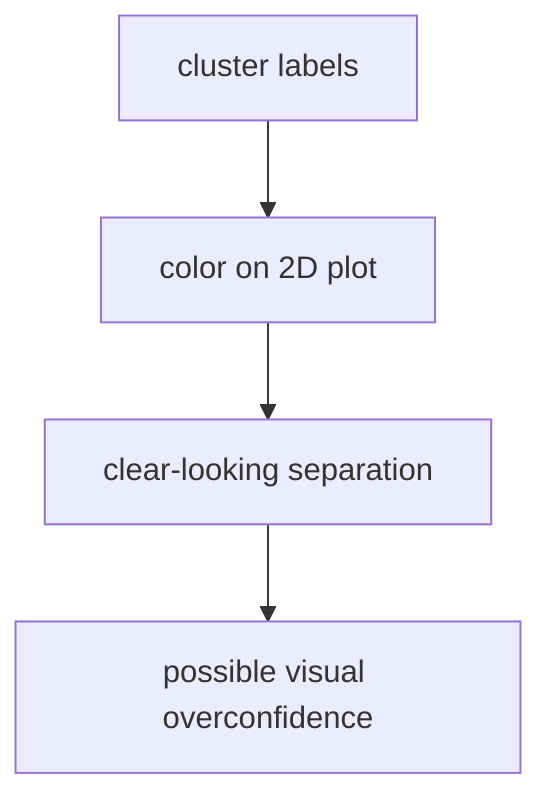

# P4-18.2 시각화와 정보 손실

> Section ID: `P4-18.2`
> Version: `v2026.07.07`

P4-18.1에서는 차원 축소(dimensionality reduction)가 많은 특징을 더 적은 축으로 다시 표현하는 일이라는 점을 보았습니다. 다음 단계에서는 그 그림을 어디까지 믿을지 묻게 됩니다.

차원을 줄여서 그림으로 보기 쉬워졌다면, 그 그림을 어디까지 믿어도 될까?

차원 축소로 만든 2차원 또는 3차원 그림은 구조를 살펴보는 데 유용하지만, 원래 고차원 데이터의 모든 관계를 그대로 보존하지는 않는다.

시각화는 매우 강한 도구이지만, 동시에 강한 착시를 만들 수도 있습니다.

이 절은 차원 축소의 기본 정의를 다시 길게 반복하지 않습니다. `많은 특징을 더 적은 축으로 다시 표현한다`는 핵심 직관은 P4-18.1과 [개념사전](../../../reference/concept-glossary.md)을 기준으로 다시 연결하고, 여기서는 그 그림이 어떤 정보 손실과 해석 위험을 만드는지에만 집중합니다.

## 이 절의 범위

이 절은 다음 질문에 답합니다.

- 왜 차원 축소 결과는 보기 쉽지만 완전한 복사본은 아닌가?
- 어떤 정보가 비교적 잘 남고, 어떤 정보가 사라질 수 있는가?
- 2D 그림에서 가까워 보인다고 해서 원래도 반드시 가깝다고 할 수 없는 이유는 무엇인가?
- 차원 축소 결과를 탐색적 분석(exploratory analysis)에 어떻게 안전하게 써야 하는가?

이 절은 다음 내용은 깊게 다루지 않습니다.

- t-SNE, UMAP의 알고리즘 세부
- 재구성 오차(reconstruction error)의 공식 계산
- trustworthiness 같은 시각화 품질 지표

이 절은 입문적으로 `그림은 유용하지만 과신하면 안 된다`는 해석 원칙을 세우는 데 초점을 둡니다.

## 이 절의 목표

- 차원 축소 시각화가 구조 탐색 도구라는 점을 설명할 수 있습니다.
- 차원을 줄이면 일부 정보 손실이 생긴다는 점을 말할 수 있습니다.
- 2D 그림의 거리와 원래 고차원 거리 사이에 차이가 생길 수 있음을 이해할 수 있습니다.
- 시각화 결과를 최종 결론보다 후속 검토의 출발점으로 읽는 태도를 가질 수 있습니다.

## 왜 이 절이 필요한가

차원 축소를 배우고 나면 보통 이런 기대를 갖습니다.

- 이제 데이터를 2차원으로 볼 수 있다
- 점들이 나뉘어 보인다
- 그러면 구조가 명확해진 것 같다

이 기대는 절반만 맞습니다.

| 맞는 부분 | 조심해야 할 부분 |
| --- | --- |
| 그림으로 구조를 더 쉽게 볼 수 있다 | 그 그림이 원래 구조를 완전히 보존하지는 않는다 |
| 덩어리나 패턴을 탐색하기 좋다 | 덩어리가 과장되거나 압축될 수 있다 |
| 설명과 발표에 유용하다 | 시각 효과가 과도한 확신을 만들 수 있다 |

그래서 18.2는 `그림을 보는 법`을 배우는 절입니다.

### 언제 시각화 해석을 특히 멈춰서 다시 봐야 하는가

차원 축소 그림이 예쁘게 보일수록, 오히려 `지금 보기 쉬운 것과 구조 보존을 혼동하고 있지 않은가`를 더 빨리 점검해야 합니다.

| 보이는 장면 | 먼저 멈춰야 하는 이유 | 같이 확인할 것 |
| --- | --- | --- |
| 2D에서 두 점이 아주 가깝게 보인다 | 원래 고차원 거리와 같지 않을 수 있기 때문 | 원래 특징 공간의 관계 |
| 덩어리가 뚜렷해 보여 바로 군집처럼 읽고 싶다 | 투영이 묶음을 과장했을 수 있기 때문 | 다른 파라미터/방법에서도 비슷한지 |
| 멀리 떨어진 점을 곧바로 이상치로 지우고 싶다 | 시각화 압축 과정에서 왜곡된 것일 수 있기 때문 | 원래 데이터와 다른 검증 방법 |
| 발표용 그림이 너무 설득력 있어 보인다 | 시각 효과가 과도한 확신을 만들 수 있기 때문 | 탐색 결과와 확정 결론 구분 |
| 2D 그림만으로 정책 판단까지 가고 싶다 | 시각화는 탐색 도구이지 최종 판정 도구가 아니기 때문 | 후속 라벨/성과/원래 특징 대조 |

이 표의 목적은 시각화를 못 믿게 하는 것이 아니라, `어디서부터 보기 쉬움이 과도한 확신으로 바뀌는가`를 먼저 멈춰 세우는 데 있습니다.

이 긴장을 그림으로 줄이면 다음과 같습니다.



이 도식은 차원 축소 그림의 장점과 한계를 한 번에 보여 줍니다. 차원을 줄이면 사람이 구조를 훨씬 쉽게 볼 수 있지만, 그 쉬움은 항상 일부 왜곡이나 손실과 함께 온다는 점을 같이 기억해야 합니다.

## 왜 차원을 줄이면 정보 손실이 생기나

18.1에서 본 것처럼, 차원 축소는 많은 축을 더 적은 축으로 요약합니다. 이 말은 곧, 모든 정보를 그대로 남길 수는 없다는 뜻입니다.

예를 들어 50차원 데이터를 2차원으로 줄이면:

- 어떤 큰 변동은 남길 수 있지만
- 어떤 작은 차이나 국소 관계는 약해질 수 있고
- 어떤 방향의 정보는 합쳐지거나 사라질 수 있습니다

차원 축소는 본질적으로 `압축(compression)`에 가깝습니다.

압축에는 항상 선택이 들어갑니다.

- 무엇을 우선 남길 것인가
- 무엇을 덜 중요하다고 보고 줄일 것인가

이 선택 때문에 정보 손실은 자연스럽게 따라옵니다.

압축 과정에는 `무엇을 남기고 무엇을 약하게 만들지`에 대한 선택이 들어갑니다. 강한 전반적 패턴은 남길 수 있지만, 작은 세부 관계는 약해지거나 사라질 수 있다는 뜻입니다.

## 그림이 보기 쉽다는 것과 원래 구조가 같다는 것은 다르다

2차원 산점도(scatter plot)가 예쁘게 보인다고 해서, 원래 고차원 구조가 그대로 2차원 평면에 옮겨졌다고 말할 수는 없습니다.

중요한 구분은 다음입니다.

- 보기 쉬움: 사람이 해석하기 편한 상태
- 구조 보존: 원래 데이터 관계가 충분히 유지된 상태

이 둘은 겹칠 수 있지만, 항상 같은 것은 아닙니다.

시각화는 `사람 친화적 표현`이지, 자동으로 `완전한 구조 복제`는 아닙니다.

## 가까워 보인다고 해서 원래도 가까운가

가장 흔한 오해는 이것입니다.

`2D 그림에서 두 점이 붙어 보이니, 원래 데이터에서도 거의 같은 점이겠구나.`

하지만 차원을 줄이는 과정에서:

- 원래 멀던 점이 그림에서는 가까워질 수 있고
- 원래 가깝던 점이 그림에서는 조금 벌어질 수도 있습니다

이는 고차원 구조를 더 적은 축에 눌러 담는 과정에서 생기는 자연스러운 왜곡입니다.

이 감각을 도식으로 보면 다음과 같습니다.



이 도식은 2D 그림의 거리와 원래 고차원 거리 사이가 항상 같지 않다는 점을 강조합니다. 그림에서 가깝게 보이는 두 점이 원래도 꼭 가깝다고 할 수 없고, 반대로 멀어 보이는 점도 원래 구조에서는 더 비슷할 수 있습니다.

그림의 거리와 원래 거리 사이에는 차이가 생길 수 있습니다.

## 무엇은 비교적 잘 남고 무엇은 약해질 수 있나

PCA 같은 방식은 큰 분산을 설명하는 방향을 우선 남기려 합니다. 그러면 보통 다음과 같은 경향이 생깁니다.

| 비교적 잘 남길 수 있는 것 | 약해질 수 있는 것 |
| --- | --- |
| 큰 전반적 흐름 | 작은 세부 차이 |
| 주된 변동 방향 | 덜 중요한 축의 국소 패턴 |
| 전체적인 퍼짐 구조 | 예외적 소수 샘플의 미세한 관계 |

차원 축소는 보통 `큰 그림(big picture)`에는 도움이 되지만, 세밀한 판단에서는 주의가 필요합니다.

## 군집처럼 보인다고 해서 진짜 군집인가

차원 축소 그림을 보다 보면 점들이 여러 덩어리처럼 보일 수 있습니다. 하지만 여기에는 두 가지 가능성이 있습니다.

1. 원래 고차원 데이터에도 실제로 어느 정도 묶음 구조가 있다.
2. 투영(projection) 과정이 덩어리처럼 보이게 만들었다.

그림 속 군집은 `실제 구조의 힌트`일 수는 있지만, 그 자체로 충분한 증거는 아닙니다.

17장에서 본 클러스터링과 연결하면, 차원 축소 그림은 군집 가설을 떠올리게 할 수 있지만, 그 가설을 확정해 주지는 않습니다.

## 작은 숫자 예제로 압축 감각 보기

이번 예제는 세 특징을 하나의 요약 점수로 줄이면 읽기는 쉬워지지만, 원래 각 특징의 차이는 일부 사라진다는 점을 보여 주는 장난감 실습입니다.

- 문제 상황: 여러 특징을 하나의 축처럼 줄이면 무엇이 편해지고 무엇이 사라지는지 본다
- 입력(input): 세 개 특징으로 표현된 샘플
- 기대 출력(output): 하나의 요약값
- 확인할 개념:
  - 차원 축소는 표현을 단순하게 만든다
  - 단순해진 대신 개별 축의 차이는 줄어든다

```python
samples = [
    {"f1": 2.0, "f2": 2.1, "f3": 2.2},
    {"f1": 4.0, "f2": 4.1, "f3": 3.9},
    {"f1": 6.0, "f2": 5.8, "f3": 6.2},
]

reduced = [
    round((row["f1"] + row["f2"] + row["f3"]) / 3, 2)
    for row in samples
]

print("original samples:", samples)
print("1D summary      :", reduced)
```

실행 결과는 다음과 같습니다.

```text
original samples: [{'f1': 2.0, 'f2': 2.1, 'f3': 2.2}, {'f1': 4.0, 'f2': 4.1, 'f3': 3.9}, {'f1': 6.0, 'f2': 5.8, 'f3': 6.2}]
1D summary      : [2.1, 4.0, 6.0]
```

이 예제에서 독자가 읽어야 할 것은:

1. 세 축을 하나로 줄이면 흐름을 보기 쉬워집니다.
2. 하지만 `f1`, `f2`, `f3` 각각의 세부 차이는 요약값 안으로 눌려 들어갑니다.
3. 즉, 단순화와 정보 손실은 함께 옵니다.

## 시각화는 무엇에 가장 유용한가

차원 축소 그림은 보통 다음 같은 용도로 매우 유용합니다.

| 용도 | 왜 유용한가 |
| --- | --- |
| 데이터 전체 흐름 보기 | 큰 덩어리, 퍼짐, 방향을 한눈에 본다 |
| 이상치(outlier) 탐색 | 유독 멀리 떨어진 점을 찾기 쉽다 |
| 군집 가설 만들기 | 몇 덩어리처럼 보이는지 탐색적으로 본다 |
| 설명과 커뮤니케이션 | 복잡한 고차원 데이터를 직관적으로 공유한다 |

즉, 시각화는 `탐색과 설명`에 매우 유용합니다.

## 하지만 무엇에는 바로 쓰면 안 좋은가

다음 같은 판단을 그림 하나만으로 내리면 위험합니다.

- 이 두 점은 거의 같은 고객이다
- 이 덩어리는 반드시 별도 상품군이다
- 이 점은 이상치이니 바로 제거하자
- 이 군집은 위험군이니 정책을 다르게 적용하자

왜냐하면 그림은 구조를 축약해서 보여 준 것이지, 원래 관계를 완전하게 판정한 것이 아니기 때문입니다.

즉, 차원 축소 그림은 `확정 도구`가 아니라 `탐색 도구`로 읽어야 합니다. 그림에서 강하게 보인 구조도 먼저 검토 필요 신호로 남기고, 원래 특징과 다른 방법 대조 전에는 정책이나 원인 문장으로 바로 넘기지 않는 편이 맞습니다.

즉, 차원 축소 시각화는 패턴을 찾고 설명하는 데는 강하지만, 그림 하나만으로 최종 결론이나 증명을 대신할 수는 없습니다.

## 안전한 읽기 순서

차원 축소 결과는 다음 순서로 읽어야 그림의 착시를 줄일 수 있습니다.

1. 먼저 큰 흐름과 덩어리를 본다.
2. 그 덩어리가 어떤 원래 특징과 연결되는지 확인한다.
3. 다른 파라미터나 다른 방법에서도 비슷한 패턴이 보이는지 본다.
4. 필요하면 원래 고차원 데이터나 후속 모델 성능으로 다시 확인한다.

이를 흐름으로 그리면 다음과 같습니다.



이 도식은 안전한 해석 순서를 정리합니다. 먼저 그림에서 패턴을 발견하더라도, 반드시 원래 특징으로 돌아가고 다른 방법에서도 비슷한지 확인한 뒤에야 그 패턴을 가설 수준에서 사용할 수 있습니다.

이 절의 핵심은 마지막 단계입니다.

`차원 축소 그림은 가설(hypothesis)을 만들게 해 주지만, 그 가설을 혼자 증명하지는 못한다.`

## 클러스터링과 함께 쓰면 무엇을 조심해야 하나

17장과 연결하면, 차원 축소 그림 위에 군집 결과를 색으로 칠해 보는 일이 많습니다. 이것은 매우 유용할 수 있지만, 동시에 위험도 있습니다.

- 군집이 예쁘게 나뉘어 보이면 과하게 확신하기 쉽습니다.
- 색이 칠해진 그림은 실제보다 분리가 더 명확한 것처럼 느껴질 수 있습니다.
- 반대로 그림에서 덩어리가 섞여 보여도, 원래 고차원 공간에서는 구분이 더 잘 될 수도 있습니다.

즉, 군집 결과와 차원 축소 그림은 서로를 돕지만, 둘이 만나면 착시도 더 강해질 수 있습니다.

이 관계를 줄이면 다음과 같습니다.



## 사례로 보기

### 사례 1. 2D 그림에서 두 상품군이 멀리 보여도 원래 특징까지 바로 다르다고 단정하면 왜 위험할까

상품 기획 팀이 수십 개 상품 특징을 차원 축소해 2D 그림으로 봤더니 두 점무리가 멀리 떨어져 보였다고 해 보겠습니다. 그림만 보면 `완전히 다른 상품군`처럼 보일 수 있지만, 실제 원본 특징에서는 가격대와 핵심 기능이 꽤 비슷하고 일부 보조 특징이 투영 과정에서 더 크게 드러난 것일 수도 있습니다. 반대로 그림에서 조금 겹쳐 보이는 상품도 원래 고차원 공간에서는 충분히 구분될 수 있습니다. 그래서 차원 축소 그림은 분리 가설을 만드는 데는 유용하지만, 최종 판단은 원래 특징 요약과 후속 분석으로 다시 확인해야 합니다.

이 장면을 해석 메모로 남기면 다음처럼 정리할 수 있습니다.

| 그림에서 먼저 보인 구조 | 바로 붙여야 할 해석 경계 | 다시 확인할 review 질문 |
| --- | --- | --- |
| 두 점무리가 멀리 떨어져 보인다 | 2D 거리만으로 원래 특징까지 완전히 다르다고 단정하지 않는다 | 원래 특징 요약에서도 같은 분리가 보이는가 |
| 일부 점이 겹쳐 보인다 | 투영 과정 때문에 원래보다 더 섞여 보였을 수 있다 | 다른 축 수나 다른 방법에서도 비슷하게 겹치는가 |

즉, 시각화 절의 핵심은 `보이는 구조 -> 해석 경계 -> 다음 검증 질문`을 붙여 두는 데 있습니다. 같은 그림처럼 보여도 어떤 구조는 원래 특징에서 다시 확인되고, 어떤 구조는 투영 착시로 약해질 수 있으므로 검토 메모를 분리해 남겨야 합니다.

## 이 절에서 기억할 관점

- 차원 축소 시각화는 고차원 구조를 쉽게 보게 해 주는 도구입니다.
- 하지만 더 적은 축으로 압축하는 과정에서 정보 손실과 왜곡이 생길 수 있습니다.
- 2D 그림의 거리와 원래 고차원 거리는 다를 수 있습니다.
- 그림 속 덩어리는 구조 가설을 제안할 수 있지만, 그 자체가 정답이나 증거는 아닙니다.
- 차원 축소 결과는 탐색과 설명의 도구로 읽고, 원래 데이터와 후속 검토로 확인해야 합니다.

| 같이 봐야 할 것 | 이 절에서 먼저 읽는 질문 | 바로 다음에 이어질 곳 |
| --- | --- | --- |
| 보이는 구조 | 그림에서 어떤 분리나 덩어리가 먼저 보였는가 | 군집 가설, 이상치 가설 정리 |
| 해석 경계 | 그 구조를 어디까지 믿고 어디서 멈출 것인가 | 원래 특징 검토, 다른 시각화 방법 비교 |
| 다음 검증 질문 | 어떤 추가 확인이 있어야 가설을 유지하거나 버릴 수 있는가 | 후속 모델 평가, 원본 데이터 재검토 |

## 짧은 점검

- 2D 그림의 거리와 원래 고차원 거리를 같은 것으로 읽고 있지 않은가?
- 덩어리처럼 보이는 구조를 후속 검토 없이 바로 군집이나 정책으로 넘기고 있지 않은가?
- 시각화를 탐색 도구로 쓰고, 원래 특징과 다른 방법으로 다시 대조하고 있는가?

## 언제 이 관점을 먼저 떠올려야 하는가

- 2D 그림이 너무 명확해 보여 바로 결론을 내리고 싶어질 때, 투영 왜곡과 정보 손실 가능성을 먼저 떠올립니다.
- 가까워 보이는 점들이 원래 공간에서도 가까운지 의심해야 할 때, 고차원 거리와 시각화 거리를 다시 구분합니다.
- 군집 그림과 차원 축소 그림을 함께 읽으며 착시가 강해질 수 있을 때, 시각화를 가설 생성 도구로만 두는 경계를 꺼냅니다.

## 출처와 참고 자료

- scikit-learn developers, `2.5. Decomposing signals in components (matrix factorization problems)`, scikit-learn User Guide, 확인 날짜: 2026-06-27. [https://scikit-learn.org/stable/modules/decomposition.html](https://scikit-learn.org/stable/modules/decomposition.html){: target="_blank" rel="noopener noreferrer" }
- scikit-learn developers, `PCA`, scikit-learn API Reference, 확인 날짜: 2026-06-27. [https://scikit-learn.org/stable/modules/generated/sklearn.decomposition.PCA.html](https://scikit-learn.org/stable/modules/generated/sklearn.decomposition.PCA.html){: target="_blank" rel="noopener noreferrer" }
