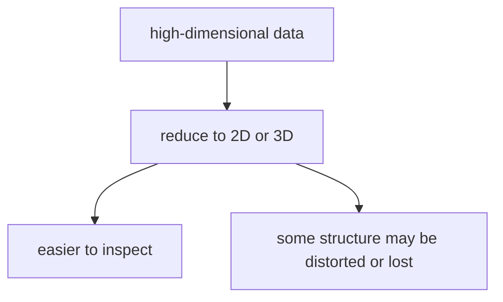
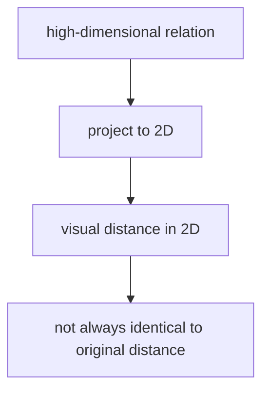
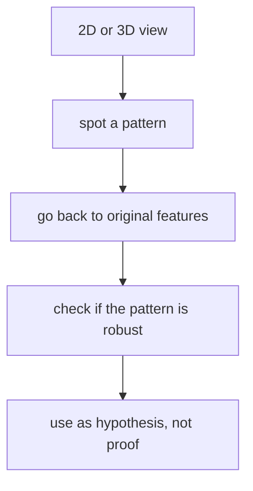
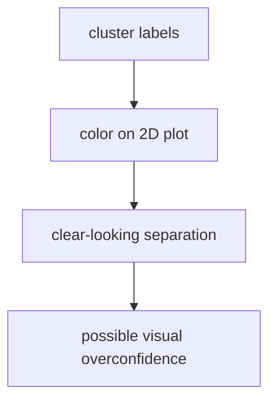
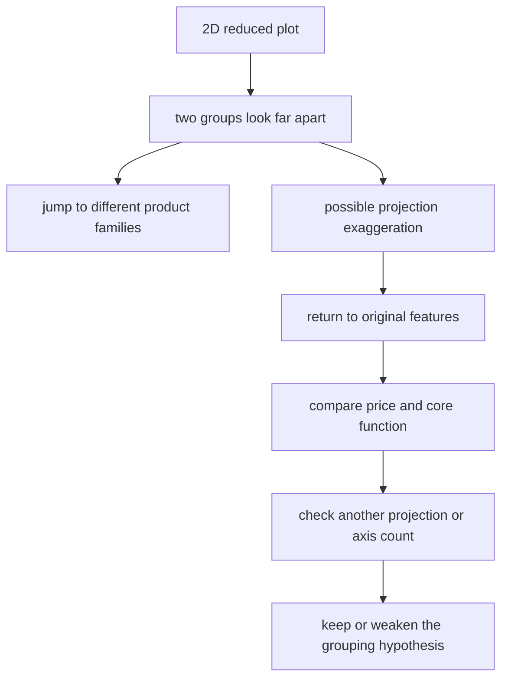

# P4-18.2 시각화와 정보 손실

> Section ID: `P4-18.2`
> Version: `v2026.07.11`

P4-18.1에서는 차원 축소(dimensionality reduction)가 많은 특징을 더 적은 축으로 다시 표현하는 일이라는 점을 보았습니다. 다음 단계에서는 그 그림을 어디까지 믿을지 묻게 됩니다.

차원을 줄여서 그림으로 보기 쉬워졌다면, 그 그림을 어디까지 믿어도 될까?

차원 축소로 만든 2차원 또는 3차원 그림은 구조를 살펴보는 데 유용하지만, 원래 고차원 데이터의 모든 관계를 그대로 보존하지는 않는다.

시각화는 매우 강한 도구이지만, 동시에 강한 착시를 만들 수도 있습니다.

이 절은 차원 축소의 기본 정의를 다시 길게 반복하지 않습니다. `많은 특징을 더 적은 축으로 다시 표현한다`는 핵심 직관은 P4-18.1과 [개념사전](../../../reference/concept-glossary.md)을 기준으로 다시 연결하고, 여기서는 그 그림이 어떤 정보 손실과 해석 위험을 만드는지에만 집중합니다.

## 이 절의 범위

이 절은 다음 질문에 답합니다.

- 왜 차원 축소 결과는 보기 쉽지만 완전한 복사본은 아닌가?
- 어떤 정보가 비교적 잘 남고, 어떤 정보가 사라질 수 있는가?
- 2D 그림에서 가까워 보인다고 해서 원래도 반드시 가깝다고 할 수 없는 이유는 무엇인가?
- 차원 축소 결과를 탐색적 분석(exploratory analysis)에 어떻게 안전하게 써야 하는가?
- t-SNE, UMAP, 재구성 오차, trustworthiness를 해석할 때 최소한 무엇을 알고 있어야 하는가?

이 절은 입문적으로 `차원 축소 그림을 어디까지 믿을 것인가`, `정보 손실을 어떻게 읽을 것인가`를 붙잡는 데 초점을 둡니다. 그래서 t-SNE와 UMAP이 어떤 구조를 더 남기려 하는지, 재구성 오차와 trustworthiness를 어떤 최소 기준으로 읽을지는 현재 절 안에서 직접 다룹니다. 반면 구현 최적화, 세부 튜닝, 품질 지표 확장 비교는 여기서 길게 다루지 않습니다.

## 이 절의 목표

- 차원 축소 시각화가 구조 탐색 도구라는 점을 설명할 수 있습니다.
- 차원을 줄이면 일부 정보 손실이 생긴다는 점을 말할 수 있습니다.
- 2D 그림의 거리와 원래 고차원 거리 사이에 차이가 생길 수 있음을 이해할 수 있습니다.
- 시각화 결과를 최종 결론보다 후속 검토의 출발점으로 읽는 태도를 가질 수 있습니다.

## 이 절을 읽는 순서

이 절은 `그림 해석의 위험`, `방법별 보존 성격`, `품질 지표`가 한 번에 나와 속도가 빨라지기 쉬우므로, 처음 읽을 때는 다음 네 질문만 순서대로 붙잡는 편이 좋습니다.

1. 차원 축소 그림은 왜 보기 쉽지만 완전한 복사본은 아닌가?
2. PCA와 t-SNE, UMAP은 각각 무엇을 더 남기려 하는가?
3. 그래서 `가까워 보이는 점`, `덩어리처럼 보이는 구조`를 어디까지 믿어야 하는가?
4. reconstruction error와 trustworthiness는 그 위험을 어떤 방향에서 다시 점검하게 만드는가?

이 순서가 잡히면 `방법 이름`, `공식`, `시각 효과`가 섞여도 무엇이 해석 질문이고 무엇이 점검 도구인지 덜 헷갈립니다.

## 왜 이 절이 필요한가

차원 축소를 배우고 나면 보통 이런 기대를 갖습니다.

- 이제 데이터를 2차원으로 볼 수 있다
- 점들이 나뉘어 보인다
- 그러면 구조가 명확해진 것 같다

이 기대는 절반만 맞습니다.

| 맞는 부분 | 조심해야 할 부분 |
| --- | --- |
| 그림으로 구조를 더 쉽게 볼 수 있다 | 그 그림이 원래 구조를 완전히 보존하지는 않는다 |
| 덩어리나 패턴을 탐색하기 좋다 | 덩어리가 과장되거나 압축될 수 있다 |
| 설명과 발표에 유용하다 | 시각 효과가 과도한 확신을 만들 수 있다 |

그래서 18.2는 `그림을 보는 법`을 배우는 절입니다.

### 언제 시각화 해석을 특히 멈춰서 다시 봐야 하는가

차원 축소 그림이 예쁘게 보일수록, 오히려 `지금 보기 쉬운 것과 구조 보존을 혼동하고 있지 않은가`를 더 빨리 점검해야 합니다.

| 보이는 장면 | 먼저 멈춰야 하는 이유 | 같이 확인할 것 |
| --- | --- | --- |
| 2D에서 두 점이 아주 가깝게 보인다 | 원래 고차원 거리와 같지 않을 수 있기 때문 | 원래 특징 공간의 관계 |
| 덩어리가 뚜렷해 보여 바로 군집처럼 읽고 싶다 | 투영이 묶음을 과장했을 수 있기 때문 | 다른 파라미터/방법에서도 비슷한지 |
| 멀리 떨어진 점을 곧바로 이상치로 지우고 싶다 | 시각화 압축 과정에서 왜곡된 것일 수 있기 때문 | 원래 데이터와 다른 검증 방법 |
| 발표용 그림이 너무 설득력 있어 보인다 | 시각 효과가 과도한 확신을 만들 수 있기 때문 | 탐색 결과와 확정 결론 구분 |
| 2D 그림만으로 정책 판단까지 가고 싶다 | 시각화는 탐색 도구이지 최종 판정 도구가 아니기 때문 | 후속 라벨/성과/원래 특징 대조 |

이 표의 목적은 시각화를 못 믿게 하는 것이 아니라, `어디서부터 보기 쉬움이 과도한 확신으로 바뀌는가`를 먼저 멈춰 세우는 데 있습니다.

이 긴장을 그림으로 줄이면 다음과 같습니다.



이 도식은 차원 축소 그림의 장점과 한계를 한 번에 보여 줍니다. 차원을 줄이면 사람이 구조를 훨씬 쉽게 볼 수 있지만, 그 쉬움은 항상 일부 왜곡이나 손실과 함께 온다는 점을 같이 기억해야 합니다.

## 왜 차원을 줄이면 정보 손실이 생기나

18.1에서 본 것처럼, 차원 축소는 많은 축을 더 적은 축으로 요약합니다. 이 말은 곧, 모든 정보를 그대로 남길 수는 없다는 뜻입니다.

예를 들어 50차원 데이터를 2차원으로 줄이면:

- 어떤 큰 변동은 남길 수 있지만
- 어떤 작은 차이나 국소 관계는 약해질 수 있고
- 어떤 방향의 정보는 합쳐지거나 사라질 수 있습니다

차원 축소는 본질적으로 `압축(compression)`에 가깝습니다.

압축에는 항상 선택이 들어갑니다.

- 무엇을 우선 남길 것인가
- 무엇을 덜 중요하다고 보고 줄일 것인가

이 선택 때문에 정보 손실은 자연스럽게 따라옵니다.

압축 과정에는 `무엇을 남기고 무엇을 약하게 만들지`에 대한 선택이 들어갑니다. 강한 전반적 패턴은 남길 수 있지만, 작은 세부 관계는 약해지거나 사라질 수 있다는 뜻입니다.

이 지점을 조금 더 실무적으로 읽으면 다음과 같습니다.

| 원래 데이터에서 보던 것 | 축소 뒤에 어떻게 달라질 수 있는가 | 그래서 다시 확인할 것 |
| --- | --- | --- |
| 전체적인 큰 방향 차이 | 비교적 잘 남을 수 있다 | 큰 흐름이 실제 업무 차이와도 연결되는가 |
| 경계 근처의 애매한 샘플 | 더 뭉치거나 더 벌어져 보일 수 있다 | 원래 특징에서 어떤 값이 애매했는가 |
| 소수 샘플의 미세한 차이 | 압축 과정에서 묻힐 수 있다 | 소수 집단을 별도로 다시 볼 필요가 있는가 |
| 여러 축에 흩어진 작은 변화 | 한두 축으로 눌리며 약해질 수 있다 | 어떤 특징이 요약 과정에서 희미해졌는가 |

## 그림이 보기 쉽다는 것과 원래 구조가 같다는 것은 다르다

2차원 산점도(scatter plot)가 예쁘게 보인다고 해서, 원래 고차원 구조가 그대로 2차원 평면에 옮겨졌다고 말할 수는 없습니다.

중요한 구분은 다음입니다.

- 보기 쉬움: 사람이 해석하기 편한 상태
- 구조 보존: 원래 데이터 관계가 충분히 유지된 상태

이 둘은 겹칠 수 있지만, 항상 같은 것은 아닙니다.

시각화는 `사람 친화적 표현`이지, 자동으로 `완전한 구조 복제`는 아닙니다.

## 가까워 보인다고 해서 원래도 가까운가

가장 흔한 오해는 이것입니다.

`2D 그림에서 두 점이 붙어 보이니, 원래 데이터에서도 거의 같은 점이겠구나.`

하지만 차원을 줄이는 과정에서:

- 원래 멀던 점이 그림에서는 가까워질 수 있고
- 원래 가깝던 점이 그림에서는 조금 벌어질 수도 있습니다

이는 고차원 구조를 더 적은 축에 눌러 담는 과정에서 생기는 자연스러운 왜곡입니다.

이 감각을 도식으로 보면 다음과 같습니다.



이 도식은 2D 그림의 거리와 원래 고차원 거리 사이가 항상 같지 않다는 점을 강조합니다. 그림에서 가깝게 보이는 두 점이 원래도 꼭 가깝다고 할 수 없고, 반대로 멀어 보이는 점도 원래 구조에서는 더 비슷할 수 있습니다.

그림의 거리와 원래 거리 사이에는 차이가 생길 수 있습니다.

예를 들어 고객 A와 B가 2D 그림에서는 거의 붙어 보이더라도, 원래 특징에서는 다음처럼 꽤 다른 경우가 있을 수 있습니다.

| 고객 | 방문 수 | 구매 금액 | 최근성 | 2D 그림 인상 |
| --- | --- | --- | --- | --- |
| A | 높음 | 높음 | 중간 | B와 매우 가까워 보임 |
| B | 높음 | 중간 | 높음 | A와 매우 가까워 보임 |

그림에서는 둘 다 `비슷한 활동 고객`처럼 보일 수 있지만, 원래 특징을 보면 A는 구매 규모 쪽이 더 강하고 B는 최근 활동성이 더 강할 수 있습니다. 따라서 2D에서 가깝다는 이유만으로 같은 운영 정책이나 같은 사용자 유형으로 바로 묶으면 정보 손실을 해석 오류로 바꾸게 됩니다.

## 무엇은 비교적 잘 남고 무엇은 약해질 수 있나

PCA 같은 방식은 큰 분산을 설명하는 방향을 우선 남기려 합니다. 그러면 보통 다음과 같은 경향이 생깁니다.

| 비교적 잘 남길 수 있는 것 | 약해질 수 있는 것 |
| --- | --- |
| 큰 전반적 흐름 | 작은 세부 차이 |
| 주된 변동 방향 | 덜 중요한 축의 국소 패턴 |
| 전체적인 퍼짐 구조 | 예외적 소수 샘플의 미세한 관계 |

차원 축소는 보통 `큰 그림(big picture)`에는 도움이 되지만, 세밀한 판단에서는 주의가 필요합니다.

### 방법마다 먼저 남기려는 것이 왜 다른가

여기서부터는 `모든 차원 축소가 같은 종류의 그림을 만드는가`를 구분해야 합니다. 공식 문서 기준으로도 PCA는 `explained variance`를 더 강하게 의식하고, manifold learning 계열은 `non-linear structure`와 `local neighborhoods`를 더 강하게 의식합니다.

| 먼저 묻는 질문 | 더 가까운 방법 | 초심자가 먼저 읽을 핵심 |
| --- | --- | --- |
| 큰 전반적 변동을 최대한 보존하고 싶은가 | PCA | 요약 축을 만들되 큰 분산 방향을 우선 남긴다 |
| 비선형 구조나 가까운 이웃 관계를 더 보고 싶은가 | t-SNE, UMAP, 다른 manifold 계열 | 전체 그림보다 국소 구조 보존 쪽에 더 민감하다 |

이 구분이 먼저 잡혀야 뒤에서 `재구성 오차`와 `trustworthiness`를 서로 다른 질문으로 읽을 수 있습니다.

## t-SNE와 UMAP은 무엇을 더 남기려 하나

PCA처럼 큰 분산 방향을 남기려는 방법만 있는 것은 아닙니다. 시각화에서 자주 언급되는 t-SNE와 UMAP은 `가까운 이웃 관계(local neighborhood)`를 더 중요하게 보려는 쪽에 가깝습니다.

| 방법 | 입문적으로 붙잡을 핵심 | 그래서 그림에서 자주 보이는 특징 |
| --- | --- | --- |
| PCA | 큰 전반적 변동을 우선 남긴다 | 전체 방향과 퍼짐은 읽기 쉽지만 국소 묶음은 약할 수 있다 |
| t-SNE | 가까운 점들의 이웃 관계를 저차원에서도 비슷하게 만들려 한다 | 국소 덩어리가 또렷해 보이기 쉽지만 덩어리 사이 거리 해석은 조심해야 한다 |
| UMAP | 가까운 이웃 그래프 구조를 저차원에서도 유지하려 한다 | 국소 구조를 잘 보여 주면서도 전체 배치를 조금 더 읽기 쉽게 만드는 경우가 많다 |

t-SNE를 아주 짧게 풀면 다음과 같습니다.

- 원래 고차원에서 `누가 누구의 가까운 이웃인가`를 확률처럼 계산한다
- 저차원에서도 비슷한 이웃 관계가 나오도록 점 위치를 조정한다
- 그래서 `가까운 점을 같이 보이게 하는 힘`이 강하다

UMAP을 아주 짧게 풀면 다음과 같습니다.

- 원래 공간에서 가까운 이웃 그래프를 만든다
- 저차원에서도 그 그래프 관계가 최대한 유지되도록 배치한다
- 그래서 `국소 이웃 구조를 유지하면서도 전체 그림을 읽기 쉽게 하려는 경향`이 있다

이 차이를 해석 문장으로 줄이면 다음과 같습니다.

| 그림을 볼 때 먼저 묻는 질문 | t-SNE, UMAP에서 특히 조심할 점 |
| --- | --- |
| 같은 덩어리 안의 가까움은 어느 정도 믿어도 되는가 | 국소 이웃 구조는 비교적 참고할 만하지만 여전히 완전 보존은 아니다 |
| 덩어리와 덩어리 사이 거리는 얼마나 믿어도 되는가 | 방법과 파라미터에 따라 과장되거나 눌릴 수 있어 특히 조심해야 한다 |
| 덩어리 개수가 진짜 구조인가 | 그림상 분리가 실제 구조 힌트일 수는 있지만 바로 확정할 수는 없다 |

즉, t-SNE와 UMAP은 `예쁜 그림을 만드는 도구`가 아니라, `원래 공간의 가까운 이웃 관계를 어떻게든 저차원에 옮겨 보려는 도구`로 읽는 편이 맞습니다. 그래서 이 방법들로 만든 그림은 `국소 구조 힌트`에는 강하지만, `전체 거리와 절대적 분리` 해석에는 더 신중해야 합니다.

## 재구성 오차(reconstruction error)는 무엇을 계산하나

앞에서 `어떤 방법은 큰 전반적 변동을 더 남기고, 어떤 방법은 국소 구조를 더 남긴다`는 차이를 봤다면, 이제 품질 지표도 같은 질문으로 읽지 않는 편이 좋습니다.

| 점검 질문 | 더 가까운 지표 |
| --- | --- |
| 줄인 표현이 원래 정보를 얼마나 다시 만들 수 있는가 | reconstruction error |
| 저차원 그림에서 가까워 보이는 이웃 관계를 얼마나 믿을 수 있는가 | trustworthiness |

즉, reconstruction error는 `복원` 쪽 질문이고, trustworthiness는 `근접 관계 보존` 쪽 질문입니다.

정보 손실을 수치로 읽고 싶을 때 자주 나오는 개념이 재구성 오차(reconstruction error)입니다. 뜻은 단순합니다.

`차원을 줄였다가 다시 원래 차원으로 복원했을 때, 원래 값과 얼마나 차이가 나는가`

가장 기본적인 형태는 다음처럼 쓸 수 있습니다.

\[
\text{Reconstruction Error} = \frac{1}{n}\sum_{i=1}^{n}\lVert x_i - \hat{x}_i \rVert^2
\]

여기서:

- \(x_i\): 원래 데이터
- \(\hat{x}_i\): 축소 뒤 다시 복원한 데이터
- \(\lVert x_i - \hat{x}_i \rVert^2\): 원래와 복원값 사이의 제곱 차이

즉, 각 샘플마다 `원래와 복원값이 얼마나 다른가`를 계산하고, 그것을 평균낸 값으로 읽으면 됩니다.

이 수식은 특히 PCA처럼 `줄인 뒤 다시 복원해 볼 수 있는 방법`에서 자연스럽게 읽힙니다.

| 재구성 오차가 작다 | 재구성 오차가 크다 |
| --- | --- |
| 줄인 축만으로도 원래 정보를 비교적 잘 다시 만들 수 있다 | 줄이는 과정에서 잃은 정보가 더 많다 |
| 큰 구조가 잘 남았을 가능성이 있다 | 중요한 차이가 많이 눌렸을 가능성이 있다 |

다만 여기서도 바로 단정하면 안 됩니다.

| 같이 기억할 점 | 이유 |
| --- | --- |
| 재구성 오차가 작다고 해서 시각화가 자동으로 해석하기 좋은 것은 아니다 | 복원은 잘돼도 2D 그림에서 군집처럼 보이는 모양은 여전히 왜곡될 수 있다 |
| t-SNE, UMAP에는 같은 의미의 재구성 오차를 바로 붙이기 어렵다 | 이 방법들은 원래부터 `복원`보다 `이웃 구조 보존` 쪽에 더 가깝기 때문이다 |

즉, 재구성 오차는 `원래 정보를 얼마나 다시 만들 수 있는가`를 보는 지표이지, `그림이 얼마나 설득력 있게 보이는가`를 직접 재는 지표는 아닙니다.

## trustworthiness는 무엇을 묻는가

시각화 품질 지표 중 trustworthiness는 이름 그대로 `이 저차원 그림의 이웃 관계를 얼마나 믿을 수 있는가`를 묻습니다. 아주 짧게 말하면 다음 질문입니다.

`저차원 그림에서 가까운 이웃으로 새로 보인 점들이, 원래 고차원에서도 정말 가까운 점들이었는가?`

공식은 다음처럼 적습니다.

\[
T(k) = 1 - \frac{2}{nk(2n - 3k - 1)}
\sum_{i=1}^{n}\sum_{j \in U_k(i)}(r(i,j)-k)
\]

여기서:

- \(n\): 샘플 수
- \(k\): 몇 번째 이웃까지 볼 것인가
- \(U_k(i)\): 저차원에서는 가까운 이웃으로 들어왔지만, 원래 고차원에서는 상위 \(k\) 이웃이 아니었던 점들
- \(r(i,j)\): 원래 고차원에서 점 \(j\)가 점 \(i\)의 몇 번째 이웃이었는가

이 식을 말로 풀면 다음과 같습니다.

- 저차원 그림에서 갑자기 가까워 보이게 된 점들을 찾는다
- 그 점들이 원래 공간에서는 얼마나 멀었던 이웃이었는지 벌점을 준다
- 그런 벌점이 작을수록 trustworthiness가 높아진다

따라서 trustworthiness 해석은 이렇게 잡으면 됩니다.

| trustworthiness가 높다 | trustworthiness가 낮다 |
| --- | --- |
| 저차원 그림의 가까운 이웃 관계가 원래 공간과 비교적 잘 맞는다 | 그림에서 가까워 보이는 관계 중 원래는 멀었던 관계가 더 많다 |
| `붙어 보이는 점들` 해석을 조금 더 신뢰할 수 있다 | `붙어 보이니 원래도 비슷하다`는 해석을 더 조심해야 한다 |

이 지표도 만능은 아닙니다.

| 지표가 직접 말해 주는 것 | 지표가 직접 말해 주지 않는 것 |
| --- | --- |
| 가까운 이웃 관계가 얼마나 잘 보존됐는가 | 전체 덩어리 간 거리 해석이 맞는가 |
| 저차원에서 새로 생긴 가짜 근접이 많은가 | 발표용 그림이 얼마나 설득력 있어 보이는가 |

즉, trustworthiness는 `이 그림의 근접 관계를 얼마나 믿을까`를 다시 보는 브레이크 역할을 합니다. scikit-learn 공식 문서도 이를 `local structure`가 얼마나 retained 되었는가를 묻는 값으로 설명합니다. 차원 축소 그림을 본 뒤 `붙어 보이는 점들`을 너무 빨리 같은 유형으로 묶고 싶을 때, 바로 이 지표가 던지는 질문을 떠올리면 좋습니다.

## 군집처럼 보인다고 해서 진짜 군집인가

차원 축소 그림을 보다 보면 점들이 여러 덩어리처럼 보일 수 있습니다. 하지만 여기에는 두 가지 가능성이 있습니다.

1. 원래 고차원 데이터에도 실제로 어느 정도 묶음 구조가 있다.
2. 투영(projection) 과정이 덩어리처럼 보이게 만들었다.

그림 속 군집은 `실제 구조의 힌트`일 수는 있지만, 그 자체로 충분한 증거는 아닙니다.

17장에서 본 클러스터링과 연결하면, 차원 축소 그림은 군집 가설을 떠올리게 할 수 있지만, 그 가설을 확정해 주지는 않습니다.

이때 특히 자주 생기는 착시는 다음과 같습니다.

| 그림에서 먼저 보이는 것 | 실제로는 어떤 경우일 수 있는가 | 바로 다음에 할 일 |
| --- | --- | --- |
| 두 덩어리가 또렷해 보인다 | 투영이 분리를 더 강하게 보이게 했을 수 있다 | 원래 특징 요약과 다른 축 수에서도 같은지 본다 |
| 한 점이 멀리 튄다 | 실제 이상치일 수도 있고 투영 왜곡일 수도 있다 | 원본 데이터, 다른 시각화, 다른 이상치 기준을 함께 본다 |
| 점들이 한곳에 뭉친다 | 원래는 여러 축에서 차이가 있었는데 눌려 보일 수 있다 | 요약 전 특징 분포를 다시 본다 |

## 시각화는 무엇에 가장 유용한가

차원 축소 그림은 보통 다음 같은 용도로 매우 유용합니다.

| 용도 | 왜 유용한가 |
| --- | --- |
| 데이터 전체 흐름 보기 | 큰 덩어리, 퍼짐, 방향을 한눈에 본다 |
| 이상치(outlier) 탐색 | 유독 멀리 떨어진 점을 찾기 쉽다 |
| 군집 가설 만들기 | 몇 덩어리처럼 보이는지 탐색적으로 본다 |
| 설명과 커뮤니케이션 | 복잡한 고차원 데이터를 직관적으로 공유한다 |

즉, 시각화는 `탐색과 설명`에 매우 유용합니다.

이 유용함을 더 구체적으로 정리하면 다음과 같습니다.

| 시각화가 특히 도움 되는 장면 | 왜 도움이 되는가 | 여기서 멈추면 안 되는 이유 |
| --- | --- | --- |
| 데이터 전체 흐름을 처음 훑을 때 | 큰 구조를 빠르게 잡을 수 있기 때문 | 큰 구조가 곧 최종 결론은 아니기 때문 |
| 후속 군집 가설을 세울 때 | 몇 덩어리처럼 보이는지 탐색적으로 볼 수 있기 때문 | 보이는 덩어리가 투영 착시일 수 있기 때문 |
| 대표 사례를 고를 때 | 어떤 샘플이 중심/경계/외곽인지 보기 쉽기 때문 | 원래 특징을 함께 보지 않으면 사례 해석이 과장될 수 있기 때문 |
| 설명 자료를 만들 때 | 복잡한 고차원 구조를 직관적으로 공유하기 쉽기 때문 | 발표용 그림이 실제보다 더 강한 확신을 줄 수 있기 때문 |

## 하지만 무엇에는 바로 쓰면 안 좋은가

다음 같은 판단을 그림 하나만으로 내리면 위험합니다.

- 이 두 점은 거의 같은 고객이다
- 이 덩어리는 반드시 별도 상품군이다
- 이 점은 이상치이니 바로 제거하자
- 이 군집은 위험군이니 정책을 다르게 적용하자

왜냐하면 그림은 구조를 축약해서 보여 준 것이지, 원래 관계를 완전하게 판정한 것이 아니기 때문입니다.

즉, 차원 축소 그림은 `확정 도구`가 아니라 `탐색 도구`로 읽어야 합니다. 그림에서 강하게 보인 구조도 먼저 검토 필요 신호로 남기고, 원래 특징과 다른 방법 대조 전에는 정책이나 원인 문장으로 바로 넘기지 않는 편이 맞습니다.

즉, 차원 축소 시각화는 패턴을 찾고 설명하는 데는 강하지만, 그림 하나만으로 최종 결론이나 증명을 대신할 수는 없습니다.

## 안전한 읽기 순서

차원 축소 결과는 다음 순서로 읽어야 그림의 착시를 줄일 수 있습니다.

1. 먼저 큰 흐름과 덩어리를 본다.
2. 그 덩어리가 어떤 원래 특징과 연결되는지 확인한다.
3. 다른 파라미터나 다른 방법에서도 비슷한 패턴이 보이는지 본다.
4. 필요하면 원래 고차원 데이터나 후속 모델 성능으로 다시 확인한다.

이를 흐름으로 그리면 다음과 같습니다.



이 도식은 안전한 해석 순서를 정리합니다. 먼저 그림에서 패턴을 발견하더라도, 반드시 원래 특징으로 돌아가고 다른 방법에서도 비슷한지 확인한 뒤에야 그 패턴을 가설 수준에서 사용할 수 있습니다.

이 절의 핵심은 마지막 단계입니다.

`차원 축소 그림은 가설(hypothesis)을 만들게 해 주지만, 그 가설을 혼자 증명하지는 못한다.`

여기까지의 판단을 한 표로 다시 묶으면 다음처럼 읽는 편이 가장 안전합니다.

| 지금 보려는 것 | 먼저 떠올릴 질문 | 바로 다음 점검 |
| --- | --- | --- |
| 큰 전반적 퍼짐 | 어떤 방향의 큰 변동이 남았는가 | 원래 특징과 연결되는가 |
| 가까운 이웃 구조 | 붙어 보이는 점들이 원래도 가까웠는가 | trustworthiness, 원래 특징 대조 |
| 복원 가능성 | 줄인 표현이 원래 정보를 얼마나 다시 만들 수 있는가 | reconstruction error, 원래 축별 차이 재확인 |
| 덩어리나 이상치 가설 | 이 구조가 투영 착시 없이도 유지되는가 | 다른 축 수, 다른 방법, 원본 데이터 검토 |

### 그림을 본 직후 바로 남길 메모

시각화 결과를 본 뒤에는 아래 정도의 짧은 메모를 남기면 과한 확신을 줄이는 데 도움이 됩니다.

| 항목 | 예시 메모 |
| --- | --- |
| 먼저 보인 구조 | `왼쪽 아래에 작은 점무리 하나가 따로 보임` |
| 해석 경계 | `2D 분리만으로 별도 상품군이라고 확정하지 않음` |
| 원래 특징 재확인 | `가격, 핵심 기능, 사용 빈도 표로 다시 확인` |
| 다른 방법 대조 | `PCA 2D와 다른 축 수에서 분리 유지 여부 확인` |
| 다음 검증 | `후속 군집화 또는 원본 특징 요약으로 가설 유지 여부 검토` |

이 메모의 목적은 `예쁜 그림을 봤다`에서 끝내지 않고, `무엇을 봤고 무엇을 아직 모르는가`를 분리해 두는 데 있습니다.

## 클러스터링과 함께 쓰면 무엇을 조심해야 하나

17장과 연결하면, 차원 축소 그림 위에 군집 결과를 색으로 칠해 보는 일이 많습니다. 이것은 매우 유용할 수 있지만, 동시에 위험도 있습니다.

- 군집이 예쁘게 나뉘어 보이면 과하게 확신하기 쉽습니다.
- 색이 칠해진 그림은 실제보다 분리가 더 명확한 것처럼 느껴질 수 있습니다.
- 반대로 그림에서 덩어리가 섞여 보여도, 원래 고차원 공간에서는 구분이 더 잘 될 수도 있습니다.

즉, 군집 결과와 차원 축소 그림은 서로를 돕지만, 둘이 만나면 착시도 더 강해질 수 있습니다.

이 관계를 줄이면 다음과 같습니다.



## 사례 및 예시

### 사례 1. 2D 그림에서 두 상품군이 멀리 보여도 원래 특징까지 바로 다르다고 단정하면 왜 위험할까

상품 기획 팀이 수십 개 상품 특징을 차원 축소해 2D 그림으로 봤더니 두 점무리가 멀리 떨어져 보였다고 해 보겠습니다. 그림만 보면 `완전히 다른 상품군`처럼 보일 수 있지만, 실제 원본 특징에서는 가격대와 핵심 기능이 꽤 비슷하고 일부 보조 특징이 투영 과정에서 더 크게 드러난 것일 수도 있습니다. 반대로 그림에서 조금 겹쳐 보이는 상품도 원래 고차원 공간에서는 충분히 구분될 수 있습니다. 그래서 차원 축소 그림은 분리 가설을 만드는 데는 유용하지만, 최종 판단은 원래 특징 요약과 후속 분석으로 다시 확인해야 합니다.



이 장면을 해석 메모로 남기면 다음처럼 정리할 수 있습니다.

| 그림에서 먼저 보인 구조 | 바로 붙여야 할 해석 경계 | 다시 확인할 review 질문 |
| --- | --- | --- |
| 두 점무리가 멀리 떨어져 보인다 | 2D 거리만으로 원래 특징까지 완전히 다르다고 단정하지 않는다 | 원래 특징 요약에서도 같은 분리가 보이는가 |
| 일부 점이 겹쳐 보인다 | 투영 과정 때문에 원래보다 더 섞여 보였을 수 있다 | 다른 축 수나 다른 방법에서도 비슷하게 겹치는가 |

즉, 시각화 절의 핵심은 `보이는 구조 -> 해석 경계 -> 다음 검증 질문`을 붙여 두는 데 있습니다. 같은 그림처럼 보여도 어떤 구조는 원래 특징에서 다시 확인되고, 어떤 구조는 투영 착시로 약해질 수 있으므로 검토 메모를 분리해 남겨야 합니다.

### 사례 2. 한 점이 멀리 튄다고 해서 바로 이상치로 지우면 왜 위험할까

운영 로그를 차원 축소해 본 데이터 분석 팀이 한 점이 다른 점무리에서 멀리 떨어져 있는 것을 발견했다고 해 보겠습니다. 그림만 보면 `비정상 로그 하나`처럼 느껴질 수 있지만, 실제 원본 특징을 보면 그 점은 배포 직후의 정상 트래픽 패턴이거나 특정 캠페인으로 인해 일시적으로 늘어난 사용자 행동일 수도 있습니다. 반대로 정말 문제 로그일 수도 있으므로, 중요한 것은 `멀리 보인다`는 사실 자체보다 `왜 멀리 보이는지`를 다시 확인하는 것입니다.

| 그림에서 먼저 보인 신호 | 곧바로 내리기 쉬운 오해 | 먼저 다시 볼 것 |
| --- | --- | --- |
| 한 점이 유독 멀리 튄다 | 이상치이니 바로 제거해야 한다 | 원본 로그 특징, 시간대, 배포 이력 |
| 작은 점무리가 따로 분리된다 | 오류 사용자 집단이다 | 실제 공통 속성이 있는지, 다른 축 수도 같은지 |

이 사례는 차원 축소 그림이 이상치 후보를 찾는 데는 유용하지만, 제거 결정은 원래 특징과 시간 맥락을 다시 본 뒤에 내려야 한다는 점을 보여 줍니다.

## 연습 및 예제

이번 예제는 세 특징을 하나의 요약 점수로 줄이면 읽기는 쉬워지지만, 원래 각 특징의 차이는 일부 사라진다는 점을 보여 주는 장난감 실습입니다. 여기서는 요약값은 비슷하지만 원래 패턴은 다른 경우를 하나 더 넣어, 그림이나 1차원 요약만으로 결론을 내리면 왜 위험한지도 같이 봅니다.

- 문제 상황: 여러 특징을 하나의 축처럼 줄이면 무엇이 편해지고 무엇이 사라지는지 본다
- 입력(input): 세 개 특징으로 표현된 샘플
- 기대 출력(output): 하나의 요약값
- 확인할 개념:
  - 차원 축소는 표현을 단순하게 만든다
  - 단순해진 대신 개별 축의 차이는 줄어든다

```python
samples = [
    {"f1": 2.0, "f2": 2.1, "f3": 2.2},
    {"f1": 4.0, "f2": 4.1, "f3": 3.9},
    {"f1": 6.0, "f2": 5.8, "f3": 6.2},
]

reduced = [
    round((row["f1"] + row["f2"] + row["f3"]) / 3, 2)
    for row in samples
]

print("original samples:", samples)
print("1D summary      :", reduced)
```

실행 결과는 다음과 같습니다.

```text
original samples: [{'f1': 2.0, 'f2': 2.1, 'f3': 2.2}, {'f1': 4.0, 'f2': 4.1, 'f3': 3.9}, {'f1': 6.0, 'f2': 5.8, 'f3': 6.2}]
1D summary      : [2.1, 4.0, 6.0]
```

이 예제에서 독자가 읽어야 할 것은:

1. 세 축을 하나로 줄이면 흐름을 보기 쉬워집니다.
2. 하지만 `f1`, `f2`, `f3` 각각의 세부 차이는 요약값 안으로 눌려 들어갑니다.
3. 즉, 단순화와 정보 손실은 함께 옵니다.

### 값 하나 바꿔 보기: 요약값이 같아도 원래 패턴은 다를 수 있다

이번에는 세 번째 샘플의 값 배치를 바꿔, 평균은 비슷하지만 축별 모양은 달라지게 만듭니다.

```python
samples = [
    {"f1": 2.0, "f2": 2.1, "f3": 2.2},
    {"f1": 4.0, "f2": 4.1, "f3": 3.9},
    {"f1": 7.0, "f2": 6.8, "f3": 4.2},
]

reduced = [
    round((row["f1"] + row["f2"] + row["f3"]) / 3, 2)
    for row in samples
]

print("original samples:", samples)
print("1D summary      :", reduced)
```

```text
original samples: [{'f1': 2.0, 'f2': 2.1, 'f3': 2.2}, {'f1': 4.0, 'f2': 4.1, 'f3': 3.9}, {'f1': 7.0, 'f2': 6.8, 'f3': 4.2}]
1D summary      : [2.1, 4.0, 6.0]
```

세 번째 샘플의 요약값은 여전히 `6.0`이지만, 이번에는 세 축이 고르게 큰 것이 아니라 `f3`가 상대적으로 낮습니다. 요약값만 보면 이전 예제와 같은 결론처럼 보이지만, 원래 특징을 다시 보면 완전히 같은 샘플은 아닙니다. 이 차이가 바로 차원 축소 시각화나 요약 축을 읽을 때, `보이는 구조`와 `원래 특징`을 반드시 왕복해야 하는 이유입니다.

### 이 연습이 Part 4 목표를 어떻게 회수하는가

Part 4는 모델 출력 하나를 보는 법이 아니라, 표현이 바뀌었을 때 무엇이 보이고 무엇이 가려지는지 판단하는 법을 익히는 단계입니다. 이 연습은 `압축 뒤에 보기 쉬워진 구조`와 `압축 때문에 사라진 축별 차이`를 동시에 남기게 하므로, 차원 축소를 단순 시각화 기법이 아니라 해석 도구로 읽게 만듭니다. 학습자가 목표를 체감하지 못했다면 대개 PCA 수식보다 `요약값이 같아도 원래 패턴은 다를 수 있다`는 실습 장면이 부족했던 쪽에 가깝습니다.

| 공통 기록 언어 | 이번 연습에서 바로 남길 내용 |
| --- | --- |
| 보인 구조 | 1차원 요약값만 보면 서로 다른 샘플이 같은 위치처럼 보일 수 있었다 |
| 해석 경계 | 축소 그림이나 요약 축은 원래 특징의 모든 차이를 보존하지 않는다 |
| 다음 질문 | 원래 특징 공간이나 다른 투영 방법에서도 같은 분리가 유지되는가 |

## 이 절에서 기억할 관점

- 차원 축소 시각화는 고차원 구조를 쉽게 보게 해 주는 도구입니다.
- 하지만 더 적은 축으로 압축하는 과정에서 정보 손실과 왜곡이 생길 수 있습니다.
- 2D 그림의 거리와 원래 고차원 거리는 다를 수 있습니다.
- 그림 속 덩어리는 구조 가설을 제안할 수 있지만, 그 자체가 정답이나 증거는 아닙니다.
- 차원 축소 결과는 탐색과 설명의 도구로 읽고, 원래 데이터와 후속 검토로 확인해야 합니다.

| 같이 봐야 할 것 | 이 절에서 먼저 읽는 질문 | 바로 다음에 이어질 곳 |
| --- | --- | --- |
| 보이는 구조 | 그림에서 어떤 분리나 덩어리가 먼저 보였는가 | 군집 가설, 이상치 가설 정리 |
| 해석 경계 | 그 구조를 어디까지 믿고 어디서 멈출 것인가 | 원래 특징 검토, 다른 시각화 방법 비교 |
| 다음 검증 질문 | 어떤 추가 확인이 있어야 가설을 유지하거나 버릴 수 있는가 | 후속 모델 평가, 원본 데이터 재검토 |

## 짧은 점검

- 2D 그림의 거리와 원래 고차원 거리를 같은 것으로 읽고 있지 않은가?
- 덩어리처럼 보이는 구조를 후속 검토 없이 바로 군집이나 정책으로 넘기고 있지 않은가?
- 시각화를 탐색 도구로 쓰고, 원래 특징과 다른 방법으로 다시 대조하고 있는가?

## 언제 이 관점을 먼저 떠올려야 하는가

- 2D 그림이 너무 명확해 보여 바로 결론을 내리고 싶어질 때, 투영 왜곡과 정보 손실 가능성을 먼저 떠올립니다.
- 가까워 보이는 점들이 원래 공간에서도 가까운지 의심해야 할 때, 고차원 거리와 시각화 거리를 다시 구분합니다.
- 군집 그림과 차원 축소 그림을 함께 읽으며 착시가 강해질 수 있을 때, 시각화를 가설 생성 도구로만 두는 경계를 꺼냅니다.

## 출처와 참고 자료

- scikit-learn developers, `2.5. Decomposing signals in components (matrix factorization problems)`, scikit-learn User Guide, 확인 날짜: 2026-06-27. [https://scikit-learn.org/stable/modules/decomposition.html](https://scikit-learn.org/stable/modules/decomposition.html){: target="_blank" rel="noopener noreferrer" }
- scikit-learn developers, `PCA`, scikit-learn API Reference, 확인 날짜: 2026-06-27. [https://scikit-learn.org/stable/modules/generated/sklearn.decomposition.PCA.html](https://scikit-learn.org/stable/modules/generated/sklearn.decomposition.PCA.html){: target="_blank" rel="noopener noreferrer" }
