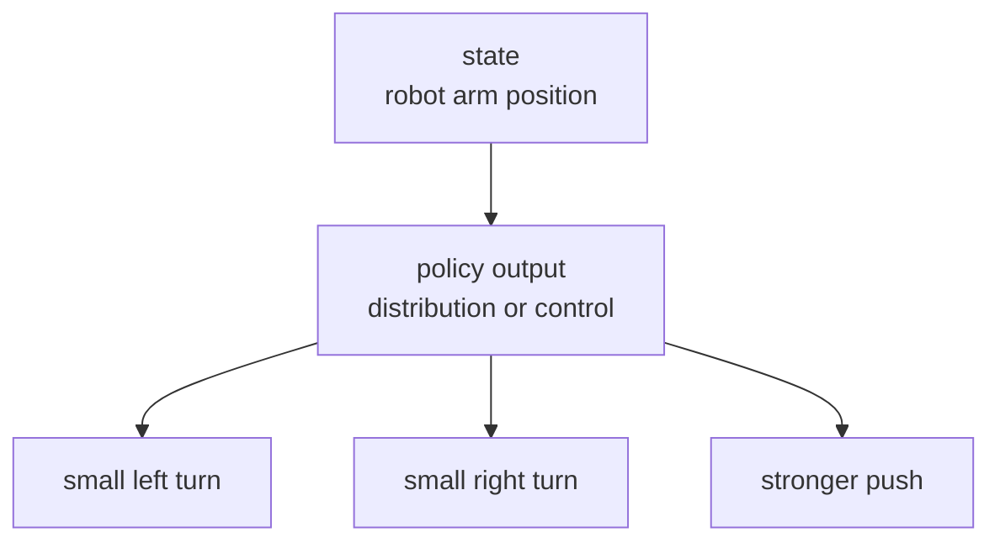
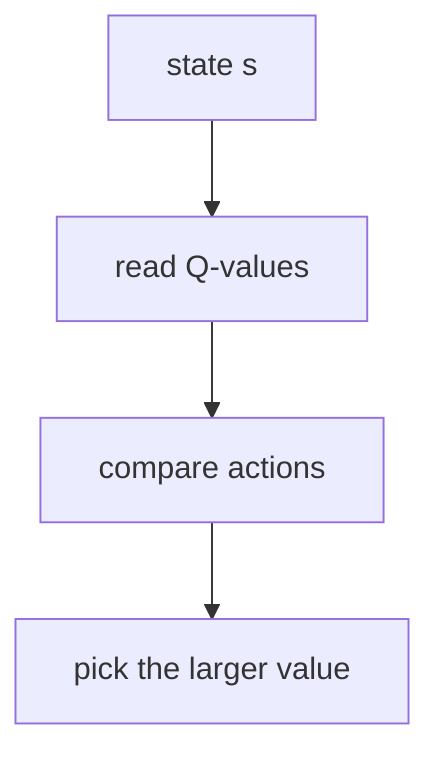
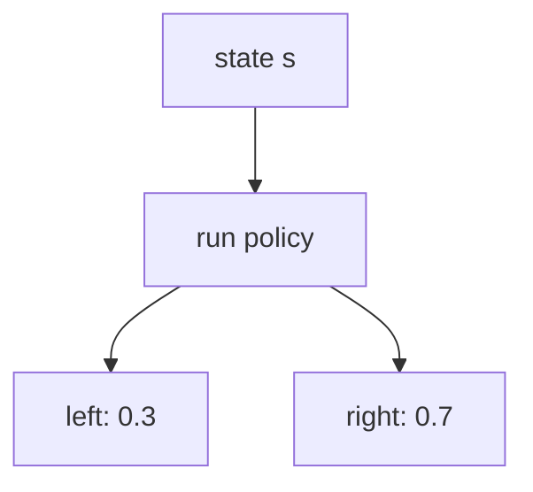
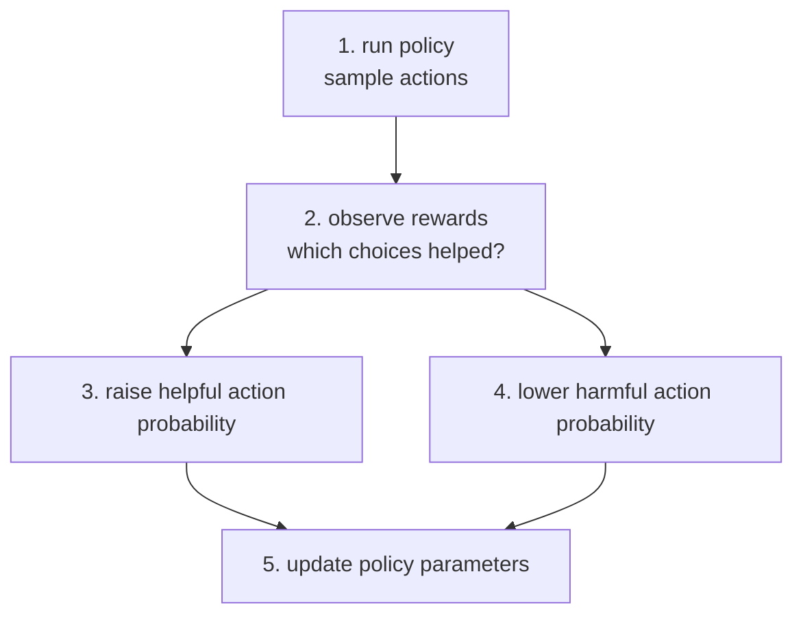
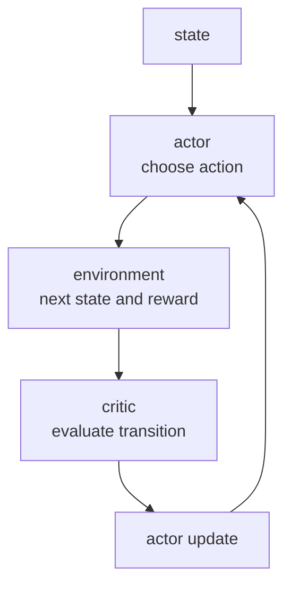
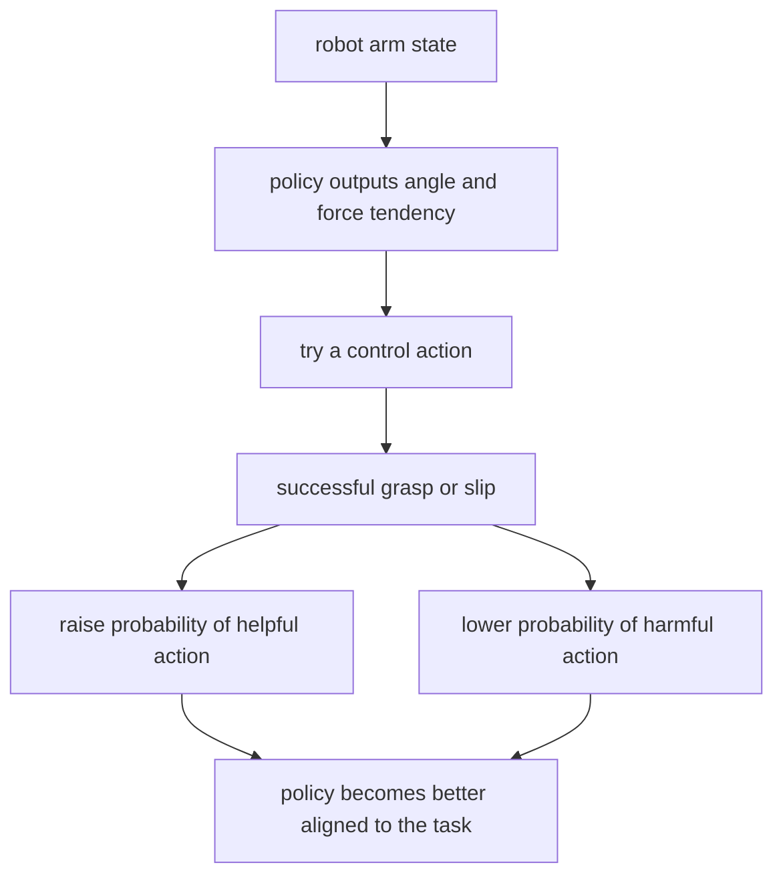

# P4-19.2 정책 기반 강화학습(policy-based reinforcement learning)

> Section ID: `P4-19.2`
> Version: `v2026.07.10`

P4-19.1에서는 가치 기반 강화학습(value-based reinforcement learning)을 통해 `어떤 상태에서 어떤 행동이 얼마나 좋은가`를 값(value)으로 배우는 관점을 보았습니다. 여기서 질문을 한 단계 바꾸면 다음과 같습니다.

값을 거쳐서 행동을 고르는 대신, 행동 방식(policy) 자체를 직접 조정할 수는 없을까?

이 질문에서 출발하는 것이 정책 기반 강화학습(policy-based reinforcement learning)입니다.

정책 기반 강화학습은 행동의 점수표를 먼저 만드는 대신, 어떤 행동을 선택할 확률과 방식을 직접 조정하면서 더 큰 보상을 얻도록 배우는 접근이다.

이 절은 `정책 기반 강화학습(policy-based reinforcement learning)`, `policy gradient`, `actor-critic`의 기본 뜻을 설명합니다. 뒤 절에서는 이 손잡이를 바탕으로 현재 맥락의 판단을 이어 가고, 행동 방식을 직접 조정하는 강화학습의 기본 뜻은 이 절과 [개념사전](../../../reference/concept-glossary.md)을 기준으로 다시 연결합니다.

## 이 절의 범위

이 절은 다음 질문에 답합니다.

- 정책(policy)을 직접 배운다는 말은 무엇을 뜻하는가?
- 가치 기반 강화학습과 정책 기반 강화학습은 어디가 다른가?
- policy gradient는 어떤 생각으로 정책을 조정하는가?
- actor-critic은 왜 등장했는가?
- 정책 기반 강화학습은 어떤 문제에서 더 자연스럽게 읽히는가?

이 절은 다음 내용은 깊게 다루지 않습니다.

- policy gradient 정리의 엄밀한 유도
- likelihood ratio trick의 수학적 증명
- PPO, TRPO, A2C, A3C 세부 구현
- 연속 제어(continuous control)의 심화 수식

이 절은 정책 기반 강화학습이 왜 등장했고, `행동 점수표`를 거치지 않고 `행동 방식 자체`를 직접 조정한다는 말이 무엇인지 이해하는 데 초점을 둡니다. 보상 설계, 탐험 비용, 시뮬레이션과 현실 차이 같은 적용상의 제약은 P4-19.3에서 이어서 다루고, PPO, TRPO, A2C, A3C와 연속 제어의 확장 흐름은 P4-19.4에서 정리합니다.

## 이 절의 목표

- 정책 기반 강화학습을 `행동 확률과 선택 방식을 직접 조정하는 접근`으로 설명할 수 있습니다.
- 가치 기반 접근과 정책 기반 접근의 질문 차이를 구분할 수 있습니다.
- policy gradient를 `보상이 좋았던 행동은 더 자주 나오게, 나빴던 행동은 덜 나오게 조정하는 생각`으로 설명할 수 있습니다.
- actor-critic이 정책과 가치 추정을 함께 쓰는 이유를 말할 수 있습니다.
- 정책 기반 강화학습이 연속 행동(continuous action)이나 복잡한 정책 표현에서 왜 자주 언급되는지 이해할 수 있습니다.

## 왜 정책을 직접 배우려 하는가

가치 기반 강화학습은 매우 강력하지만, 모든 문제를 Q-table처럼 읽기 쉬운 것은 아닙니다.

- 행동 수가 너무 많을 수 있습니다.
- 행동이 연속적인 값일 수 있습니다.
- `최고 점수 행동 하나를 고른다`는 방식이 자연스럽지 않을 수 있습니다.

예를 들어 로봇 팔이 움직이는 각도를 직접 조정한다고 생각해 봅니다.

- 행동이 `왼쪽 / 오른쪽` 두 개가 아니라
- `0.1도`, `0.2도`, `0.3도`처럼 매우 많거나 사실상 연속적일 수 있습니다.

이럴 때는 `각 행동의 값을 모두 적는다`는 관점보다, `현재 상태에서 어떤 행동 분포를 만들지 직접 정한다`는 관점이 더 자연스럽습니다.

이 차이를 조금 더 실무적으로 읽으면 다음과 같습니다.

| 문제 장면 | 점수표 접근이 답답해지는 이유 | 정책 기반이 더 자연스럽게 읽히는 이유 |
| --- | --- | --- |
| 로봇 팔 각도 조정 | 가능한 행동 수가 너무 많다 | 각도와 힘의 경향을 직접 출력하는 편이 낫다 |
| 자율 이동체의 조향 | `왼쪽/오른쪽` 몇 개로 나누기 어렵다 | 연속적인 조향량을 바로 다루는 편이 자연스럽다 |
| 확률적 전술 선택 | 최고 행동 하나만 고르는 표현이 거칠다 | 상황별 행동 비율 자체를 조정할 수 있다 |
| 추천 노출 비율 실험 | 각 노출 비율의 값을 모두 따로 적기 어렵다 | 어떤 선택을 얼마나 자주 보여 줄지 직접 다루기 쉽다 |

즉, 정책 기반 강화학습은 다음 질문에 더 가깝습니다.

`지금 이 상태에서 어떤 행동이 얼마나 자주 나오게 만들 것인가?`

이를 아주 단순하게 그리면 다음과 같습니다.



이 도식은 정책이 `정답 행동 하나`를 내놓는 것이 아니라, 상태를 보고 여러 행동 후보의 경향이나 강도를 직접 만들어 낼 수 있다는 점을 보여 줍니다. 그래서 정책 기반 강화학습은 점수표를 거치지 않고도 행동 분포 자체를 조정하는 관점으로 읽힙니다.

이 그림의 핵심은 정책이 `행동 하나만 고르는 스위치`가 아니라, 여러 행동 후보의 경향이나 분포를 만들어 내는 표현일 수 있다는 점입니다.

## 정책(policy)을 직접 배운다는 뜻

P4-2.3에서 정책(policy)은 `어떤 상태에서 어떤 행동을 할지 정하는 방식`이라고 했습니다. 정책 기반 강화학습에서는 이 정책을 직접 조정 대상이라고 봅니다.

쉽게 말하면:

- 가치 기반 강화학습: 행동 점수판을 만들고, 그 점수판을 보고 행동을 고른다.
- 정책 기반 강화학습: 행동 방식 자체를 조금씩 바꿔 간다.

이를 비교하면 다음과 같습니다.

| 관점 | 중심 질문 | 대표 직관 |
| --- | --- | --- |
| 가치 기반 | 이 행동의 장기 점수는 얼마인가? | 점수표를 보고 고른다 |
| 정책 기반 | 이 상태에서 어떤 행동 확률을 만들 것인가? | 행동 방식을 직접 조정한다 |

정책 기반 접근에서는 정책이 확률 분포(probability distribution)처럼 표현되는 경우가 많습니다.

예를 들어 같은 상태에서:

- 오른쪽으로 갈 확률 0.7
- 위로 갈 확률 0.2
- 왼쪽으로 갈 확률 0.1

처럼 정책이 곧 `행동 선택 경향`을 담는 모델이 됩니다.

이 예시를 조금 더 구체화하면 다음처럼 읽을 수 있습니다.

| 상태 | 행동 후보 | 현재 정책 해석 |
| --- | --- | --- |
| 장애물을 막 지난 주행 상태 | `직진 0.6`, `왼쪽 미세 조향 0.3`, `오른쪽 미세 조향 0.1` | 직진을 주로 택하되, 약간의 왼쪽 보정이 자주 필요하다고 읽는다 |
| 상자와 약간 어긋난 집기 상태 | `약한 집기 0.2`, `중간 집기 0.5`, `강한 집기 0.3` | 중간 강도가 가장 자주 유리하지만, 더 강한 힘도 일부 필요하다고 읽는다 |

이 표의 핵심은 정책이 `하나의 정답 행동`만 말하는 것이 아니라, 현재 상태에서 어떤 행동 성향이 더 자주 나오게 할지를 함께 담는다는 점입니다.

이때 중요한 것은 정책이 `행동 이름 목록`이 아니라 `행동이 나오는 방식`이라는 점입니다.

| 같은 상태를 읽는 질문 | 가치 기반에서 먼저 보는 것 | 정책 기반에서 먼저 보는 것 |
| --- | --- | --- |
| 지금 무엇이 좋은가 | 각 행동의 장기 점수 | 어떤 행동이 얼마나 자주 나오게 할 것인가 |
| 업데이트 뒤 무엇이 바뀌는가 | 특정 행동의 값 | 행동 확률 또는 제어 출력 경향 |
| 실패가 생겼을 때 무엇을 다시 보나 | 점수 추정이 왜 틀렸는가 | 어떤 행동 경향을 얼마나 줄여야 하는가 |

같은 장면을 가치 기반과 정책 기반으로 나누어 보면 차이가 더 잘 보입니다.





첫 번째 도식은 `행동의 값을 비교해 고르는 방식`이고, 두 번째 도식은 `행동이 나올 확률 구조 자체를 표현하는 방식`입니다.

## policy gradient는 무엇을 하려 하나

policy gradient는 정책 파라미터(parameter)를 직접 조정해 기대 보상(expected return)을 늘리려는 대표적 방법입니다.

`보상이 좋았던 행동은 더 잘 나오게 만들고, 보상이 나빴던 행동은 덜 나오게 만드는 방향으로 정책을 조금씩 수정한다.`

즉, policy gradient는 가치 표를 먼저 완성하려 하지 않고, `정책을 움직이는 손잡이`를 직접 조정합니다.

이 감각을 더 짧게 쓰면 다음과 같습니다.

| 먼저 보이는 보상 경험 | 정책 기반 해석 |
| --- | --- |
| 어떤 행동이 반복해서 좋은 결과를 만들었다 | 그 행동이 더 자주 나오도록 정책을 민다 |
| 어떤 행동이 반복해서 실패를 만들었다 | 그 행동이 덜 나오도록 정책을 당긴다 |
| 한 번 좋은 결과가 나왔지만 흔들림이 크다 | 바로 크게 믿기보다 여러 경험을 모아 경향을 조정한다 |

이를 도식으로 줄이면 다음과 같습니다.



이 그림의 핵심은 정책이 `출력 규칙`이 아니라 `조정 가능한 행동 성향`으로 읽힌다는 점입니다.

REINFORCE는 바로 앞 policy gradient 흐름을 가장 직접적으로 보여 주는 예라고 보면 됩니다. 한 에피소드의 행동과 보상을 모아 보고, 결과적으로 도움이 되었던 선택의 확률을 다음 정책에서 더 높이는 쪽으로 조정합니다.

작은 예시로 보면:

- 같은 상태에서 `직진`을 여러 번 시도했는데 장기적으로 목표 도달이 빨라졌다
- 반대로 `급회전`은 몇 번의 성공이 있어도 평균적으로 충돌과 벌점을 더 만들었다

이때 REINFORCE식 직관은 `직진` 쪽 확률을 올리고 `급회전` 쪽 확률을 낮추는 방향으로 정책을 조정한다고 읽으면 됩니다.

## REINFORCE는 왜 자주 함께 등장하나

입문 문헌에서는 policy gradient를 설명할 때 REINFORCE가 자주 함께 등장합니다. REINFORCE는 정책 기반 강화학습의 가장 대표적인 초기 알고리즘 중 하나입니다.

`한 에피소드(episode)를 따라가며, 결과적으로 보상이 좋았던 선택들의 확률을 높이는 쪽으로 정책을 조정하는 방법`

즉, REINFORCE는 정책 기반 접근의 기본 철학을 가장 직접적으로 보여 줍니다.

- 잘된 행동은 더 자주 나오게
- 잘 안 된 행동은 덜 나오게

다만 이렇게만 하면 학습 신호의 흔들림이 커질 수 있습니다. 바로 이 지점에서 actor-critic이 등장합니다.

## actor-critic은 왜 등장했는가

정책을 직접 조정하는 것은 자연스럽지만, 보상 신호만으로 정책을 바로 고치면 변동이 커질 수 있습니다. 어떤 행동이 정말 잘된 것인지, 아니면 우연히 좋았던 것인지 판단이 흔들리기 쉽기 때문입니다.

그래서 `정책을 조정하는 쪽(actor)`과 `현재 선택이 얼마나 괜찮았는지 평가하는 쪽(critic)`을 같이 두는 생각이 나옵니다.

actor-critic은 다음처럼 읽어야 합니다.

- actor: 실제 행동 방식을 조정하는 쪽
- critic: 그 행동이 얼마나 괜찮았는지 평가 신호를 주는 쪽

즉, actor-critic은 정책 기반 접근과 가치 추정 접근을 섞은 구조입니다.

역할을 더 분해하면 다음처럼 읽는 편이 좋습니다.

| 구성 요소 | 하는 일 | 독자가 흔히 하는 오해 | 다시 읽을 기준 |
| --- | --- | --- | --- |
| actor | 실제 행동 분포나 제어 출력을 만든다 | critic이 행동을 대신 골라 준다고 생각함 | actor가 실제 정책을 쥔다 |
| critic | 지금 선택이 얼마나 괜찮았는지 평가 신호를 준다 | critic이 정답 행동을 알려 준다고 생각함 | critic은 평가자이지 직접 선택자가 아니다 |
| actor-critic 결합 | 정책 조정과 평가 신호를 함께 쓴다 | 둘이 독립된 알고리즘 둘을 억지로 붙인 것처럼 생각함 | 변동을 줄이기 위한 역할 분담으로 읽는다 |



이 도식에서 critic은 `행동을 대신 결정하는 존재`가 아니라, actor update가 더 안정적으로 일어나도록 평가 신호를 주는 역할입니다.

## 가치 기반과 정책 기반은 경쟁만 하는가

독자는 두 접근을 `둘 중 하나만 옳은 방식`처럼 읽기 쉽습니다. 하지만 실제로는 서로 다른 문제 감각을 반영합니다.

| 질문 | 가치 기반이 더 자연스러운 경우 | 정책 기반이 더 자연스러운 경우 |
| --- | --- | --- |
| 행동 후보가 적고 분명한가 | 그렇다 | 덜 그렇다 |
| 행동이 연속적이거나 매우 많은가 | 다루기 까다롭다 | 상대적으로 자연스럽다 |
| 점수표를 통해 행동을 고르기 쉬운가 | 쉽다 | 꼭 그럴 필요 없다 |
| 행동 확률 자체를 제어하고 싶은가 | 간접적이다 | 직접적이다 |

즉, 정책 기반 강화학습은 가치 기반 강화학습을 대체한다기보다, 다른 조건에서 더 자연스러운 표현을 제공합니다.

## 어디에서 특히 자주 떠오르는가

정책 기반 강화학습은 다음과 같은 장면에서 자주 언급됩니다.

- 로봇 제어처럼 행동이 연속적인 문제
- 단순히 `최고 행동 하나`보다 행동 분포 전체가 중요한 문제
- 확률적 정책(stochastic policy)을 직접 다루고 싶은 문제
- 큰 상태 공간과 복잡한 함수 근사(function approximation)가 필요한 문제

이를 더 현실적인 사례로 읽으면 다음과 같습니다.

| 문제 장면 | 왜 정책 기반 관점이 잘 맞는가 |
| --- | --- |
| 로봇 팔 제어 | 각도, 힘, 속도처럼 행동이 연속적일 수 있습니다. |
| 자율 이동체의 조향과 가속 | 단순한 이산 행동보다 연속 제어가 자연스럽습니다. |
| 게임에서 확률적 전술 선택 | 한 행동만 고정하기보다 상황에 따라 섞어 쓰는 전략이 필요할 수 있습니다. |
| 광고·추천 실험의 탐색 정책 | 어떤 선택을 어느 정도 비율로 노출할지 직접 다루는 감각이 필요할 수 있습니다. |

예를 들어 서비스 운영 관점의 비유를 들면:

- 가치 기반 접근은 `각 대응 선택지의 점수표`를 만드는 감각과 닮았습니다.
- 정책 기반 접근은 `상황에 따라 어떤 대응 강도를 어느 확률로 쓸지`를 직접 조정하는 감각과 더 닮았습니다.

물론 이런 비유는 직관을 위한 것이고, 실제 서비스 정책 설계와 강화학습 정책을 같은 것으로 섞어 읽어서는 안 됩니다.

로봇 팔 사례가 특히 중요합니다. `왼쪽`과 `오른쪽`처럼 행동 수가 적은 문제에서는 가치 기반 접근이 직관적일 수 있지만, `얼마나`, `어느 속도로`, `어느 각도로`까지 함께 정해야 하면 정책을 직접 출력하는 쪽이 더 자연스럽게 읽힐 수 있습니다.

반대로 모든 문제에 정책 기반 강화학습이 더 낫다고 읽으면 안 됩니다. 행동 후보가 적고, 점수표를 통해 명확히 비교할 수 있는 문제라면 가치 기반 접근이 더 단순하고 설명력이 좋을 수 있습니다.

이 비교를 더 직접적으로 적으면 다음과 같습니다.

| 장면 | 가치 기반을 먼저 떠올리기 쉬운 이유 | 정책 기반을 먼저 떠올리기 쉬운 이유 |
| --- | --- | --- |
| 미로에서 상하좌우 이동 | 행동 후보가 적고 비교가 쉽다 | 확률적 이동 정책을 일부러 다루려면 가능 |
| 로봇 팔의 미세 각도 조정 | 행동 수를 값 표로 다루기 어렵다 | 제어량 자체를 직접 출력하기 쉽다 |
| 게임 전술 선택 | 단순 선택이면 가치 비교가 가능하다 | 상황별 섞어 쓰는 전략이면 더 자연스럽다 |
| 광고 노출 비율 실험 | 노출안 수가 적으면 점수 비교 가능 | 노출 비율 자체를 정책처럼 조정하기 쉽다 |

## 언제 정책 기반 관점을 먼저 잡는가

정책 기반 강화학습은 `값을 매긴 뒤 최고 행동을 고르는 구조`가 불편해질 때 더 자연스럽게 읽힙니다.

| 먼저 보이는 문제 장면 | 정책 기반 관점을 먼저 잡아도 좋은 이유 | 먼저 경계할 점 |
| --- | --- | --- |
| 행동이 연속적이다 | 각 행동의 값을 모두 나열하기보다 정책이 제어값을 직접 내는 편이 자연스럽습니다. | 정책이 바로 좋아 보이더라도 학습 흔들림과 안전 문제를 따로 봐야 합니다. |
| 행동 분포 자체를 설계해야 한다 | 어떤 행동을 어느 정도 확률로 쓰는지가 핵심이기 때문입니다. | 확률을 높인 행동이 부작용을 만들 수 있습니다. |
| 상태가 복잡하고 정책 표현이 중요하다 | `무엇을 할까`보다 `어떻게 행동 경향을 만들까`가 중심이 됩니다. | 가치 추정 없이 정책만 바로 고치면 변동이 커질 수 있습니다. |
| actor-critic 같은 역할 분담이 자연스럽다 | 정책 조정과 평가 신호를 나눠 보는 편이 이해를 돕습니다. | critic이 있다고 해서 현실 적용 위험이 자동으로 사라지지는 않습니다. |

## 연습 및 예제

이번 예제는 `보상이 좋았던 행동의 확률을 높인다`는 정책 기반 강화학습의 핵심 감각을 숫자로 직접 확인하는 데 초점을 둡니다. 여기서도 한 번 확률을 올려 보는 데서 멈추지 않고, 보상 부호가 바뀌면 정책이 어떻게 반대로 움직이는지 같이 확인합니다.

문제 상황:

- 정책 기반 강화학습은 행동의 점수표만 고치는 것이 아니라 행동이 선택될 확률 자체를 바꾼다

입력(input):

- 현재 정책의 행동 점수
- 이번 에피소드에서 선택한 행동
- 그 결과로 받은 보상

기대 출력(output):

- 업데이트 전 행동 점수
- 보상 신호를 반영한 뒤의 행동 점수
- 정규화 후 새 행동 확률

확인할 개념:

- 보상이 좋았던 행동은 다음 정책에서 더 자주 나오도록 조정될 수 있다
- 정책 기반 강화학습은 행동 점수를 확률 분포로 읽는 감각이 중요하다
- 값 추정보다 행동 성향 자체를 바꾸는 쪽에 초점이 있다

```python
import math

action_scores = {
    "left": 0.20,
    "right": 0.40,
}

chosen_action = "right"
reward_signal = 1.5
step_size = 0.3

print("before update:", action_scores)

# 선택한 행동의 점수를 조금 올린다.
updated_scores = action_scores.copy()
updated_scores[chosen_action] += step_size * reward_signal

print("score after reward:", updated_scores)

# 점수를 확률처럼 읽기 위해 softmax로 정규화한다.
exp_left = math.exp(updated_scores["left"])
exp_right = math.exp(updated_scores["right"])
total = exp_left + exp_right

new_policy = {
    "left": round(exp_left / total, 3),
    "right": round(exp_right / total, 3),
}

print("new policy:", new_policy)
```

실행 결과 예시는 다음처럼 읽을 수 있습니다.

```text
before update: {'left': 0.2, 'right': 0.4}
score after reward: {'left': 0.2, 'right': 0.85}
new policy: {'left': 0.343, 'right': 0.657}
```

이 예제는 엄밀한 policy gradient 구현은 아니지만, 정책 기반 강화학습의 중심 생각을 보여 줍니다.

- 보상이 좋았던 행동 `right`의 점수를 올렸고
- 그 결과 새 정책에서 `right`의 확률이 더 커졌습니다.

즉, 정책 기반 강화학습은 이런 방향으로 `행동이 나오기 쉬운 성향` 자체를 조정합니다.

### 값 하나 바꿔 보기: 같은 행동이 나쁜 보상을 받으면 확률은 어떻게 바뀌는가

이번에는 같은 행동 `right`를 골랐지만 보상 신호를 `-1.0`으로 바꿔 봅니다.

```python
import math

action_scores = {
    "left": 0.20,
    "right": 0.40,
}

chosen_action = "right"
reward_signal = -1.0
step_size = 0.3

updated_scores = action_scores.copy()
updated_scores[chosen_action] += step_size * reward_signal

exp_left = math.exp(updated_scores["left"])
exp_right = math.exp(updated_scores["right"])
total = exp_left + exp_right

new_policy = {
    "left": round(exp_left / total, 3),
    "right": round(exp_right / total, 3),
}

print("score after reward:", updated_scores)
print("new policy:", new_policy)
```

```text
score after reward: {'left': 0.2, 'right': 0.1}
new policy: {'left': 0.525, 'right': 0.475}
```

좋은 보상에서는 `right` 확률이 올라갔지만, 나쁜 보상에서는 같은 행동의 확률이 내려갑니다. 이 비교는 정책 기반 강화학습이 `행동 점수표를 읽는 방식`이 아니라 `행동 성향을 밀고 당기는 방식`이라는 점을 분명히 보여 줍니다. 따라서 정책 기반을 배울 때는 값 하나의 크기보다, 어떤 피드백이 어떤 행동 분포 변화를 만들었는지를 먼저 읽어야 합니다.

### 이 연습이 Part 4 목표를 어떻게 회수하는가

이 연습은 Part 4의 목표를 정책 표현 수준에서 회수합니다. 문제는 `무엇을 할지`뿐 아니라 `어떤 행동이 자주 나오게 만들지`를 정의하는 것이고, 평가는 `보상 변화가 실제 행동 분포를 어떻게 바꾸는가`로 이뤄집니다. 즉, 정책 기반 예제를 돌렸는데 목표가 체감되지 않았다면, 정책이라는 말이 추상적이어서라기보다 `확률 분포가 바뀌는 장면`을 전후 비교로 읽을 기회가 적었던 것입니다.

| 공통 기록 언어 | 이번 연습에서 바로 남길 내용 |
| --- | --- |
| 보인 구조 | 같은 행동도 보상 부호가 바뀌면 정책 확률이 반대로 움직였다 |
| 해석 경계 | 확률이 올라간 행동이 곧바로 현실에서 안전하거나 바람직하다는 뜻은 아니다 |
| 다음 질문 | 다른 상태나 제약 조건에서도 이 정책 분포 조정이 유지되는가 |

이 절에서도 정책 설명만 두기보다, 어떤 행동 분포를 제안했고 어떤 실패 비용을 경계해야 하는지 같이 남겨야 합니다. 같은 보상처럼 보여도 어떤 정책은 특정 실패를 더 자주 만들고, 어떤 정책은 더 보수적으로 행동할 수 있으므로 행동 분포와 실패 패턴을 함께 읽어야 합니다.

| 같이 남길 항목 | 이번 절에서 적는 내용 | 왜 필요한가 |
| --- | --- | --- |
| 정책 제안 | 현재 상태에서 어떤 행동이 어느 정도 확률로 나오게 했는가 | 정책이 점수표가 아니라 행동 성향이라는 점을 분명히 하기 위해 |
| 기대 보상 기준 | 어떤 보상 때문에 특정 행동 확률을 높였는가 | 행동 분포 조정과 목표 정의를 연결하기 위해 |
| 실패 비용 경계 | 확률을 높인 행동이 실제 환경에서 만들 수 있는 부작용 | 정책 업데이트가 곧바로 안전함을 뜻하지 않기 때문에 |
| 다음 검증 질문 | 이 분포가 다른 상태나 현실 제약에서도 유지될 만한가 | 정책 기반 선택을 후속 검토로 넘기기 위해 |

## actor-critic을 실무 감각으로 다시 읽기

actor-critic이 자주 쓰이는 이유는 `정책을 직접 조정하는 자유로움`과 `가치 추정이 주는 안정화 신호`를 함께 얻고 싶기 때문입니다.

- actor만 있으면: 정책을 직접 바꾸기 쉽지만 흔들림이 클 수 있다
- critic을 함께 두면: 지금 수정이 괜찮은 방향인지 평가 신호를 더 잘 줄 수 있다

즉, actor-critic은 정책 기반과 가치 기반을 대립시키기보다 `둘의 역할을 나누어 협력시키는 구조`로 이해해야 합니다.

업무적 비유를 아주 조심스럽게 붙이면 다음처럼 읽을 수 있습니다.

- actor는 실제 실행안을 내는 쪽
- critic은 그 실행안이 기대보다 나았는지 못했는지 피드백을 주는 쪽

물론 이는 단지 구조 감각을 돕는 비유입니다. 실제 조직의 사람 역할과 강화학습 구성 요소를 그대로 대응시키면 오해가 생깁니다.

## 사례 및 예시

### 사례 1. 로봇 팔이 집기 각도를 조금씩 조정해야 할 때 정책을 직접 배우는 편이 자연스러운 이유

로봇 팔이 상자를 집을 때는 `왼쪽`이나 `오른쪽`처럼 몇 개 행동만 고르는 것이 아니라, 각도와 힘을 얼마나 줄지 연속적으로 정해야 합니다. 이런 상황에서 모든 가능한 행동의 점수를 표처럼 적어 두기보다는, 현재 상태에서 어떤 각도와 힘이 더 자주 나오게 할지 정책 자체를 조정하는 편이 더 자연스럽습니다. 정책 기반 강화학습은 성공적으로 집은 동작의 확률을 높이고 실패한 동작의 확률을 낮추면서, 행동 분포를 직접 다듬어 갑니다. 그래서 복잡한 연속 제어 문제에서는 `점수표를 만든 뒤 최고값을 고르는 방식`보다 `행동 방식을 바로 수정하는 방식`이 더 잘 맞을 수 있습니다.



이 사례를 project memo처럼 줄이면 다음처럼 적을 수 있습니다.

| 현재 상태 | 정책이 더 자주 내게 한 행동 | 같이 봐야 할 실패 비용 | 다음 질문 |
| --- | --- | --- | --- |
| 상자 위치가 약간 비뚤어진 상태 | 조금 더 큰 회전 각도와 더 강한 집기 힘 | 미끄러짐, 과도한 힘, 장비 마모 | 이 확률 분포가 다른 위치 오차에서도 안정적인가 |
| 연속 제어가 필요한 반복 작업 | 성공 확률이 높았던 제어값 조합 | 드문 실패가 누적될 때 큰 손상으로 이어질 수 있음 | critic 신호나 추가 안전 제약을 더 넣어야 할까 |

### 사례 2. 광고 노출 비율을 하나의 정답 선택보다 분포로 다루어야 할 때

실험 플랫폼이 세 가지 배너 후보를 사용자에게 보여 준다고 해 보겠습니다. 모든 사용자에게 항상 하나의 배너만 고정해서 내보내기보다, 상태에 따라 A를 60%, B를 30%, C를 10%처럼 다른 비율로 노출하는 편이 더 자연스러운 장면이 있습니다. 이때 정책 기반 관점은 `어떤 배너가 최고인가`만 묻지 않고, `어떤 상태에서 어떤 배너가 얼마나 자주 나오게 할 것인가`를 직접 다루게 해 줍니다.

| 사용자 상태 | 정책 기반으로 먼저 읽는 질문 | 같이 경계할 점 |
| --- | --- | --- |
| 신규 사용자 | 어떤 배너 비율이 탐색과 전환의 균형을 만드는가 | 한 번의 높은 클릭률만 믿고 과도하게 쏠리지 않는가 |
| 반복 방문 사용자 | 어떤 배너를 더 자주 보여 주는 편이 장기 전환에 유리한가 | 단기 클릭과 장기 만족을 섞어 보지 않는가 |

이 사례는 정책 기반 강화학습이 `최고 행동 하나를 고르는 문제`보다 `행동 분포 자체를 설계하는 문제`에 더 잘 맞는다는 점을 보여 줍니다.

예를 들어 신규 사용자 상태에서 현재 정책이 아래처럼 움직인다고 생각해 볼 수 있습니다.

| 배너 | 현재 노출 확률 | 관찰 뒤 다시 볼 질문 |
| --- | --- | --- |
| A | 0.5 | 클릭은 높지만 이탈도 같이 오르는가 |
| B | 0.3 | 클릭은 낮아도 구매 전환이 더 안정적인가 |
| C | 0.2 | 탐색용 비율을 더 줄일지 유지할지 |

이 작은 예시는 정책 기반 접근이 `A가 최고인가`만 묻지 않고, `A, B, C를 어떤 비율로 함께 보여 줄 것인가`를 직접 다룬다는 점을 더 분명히 보여 줍니다.

## 이 절에서 기억할 관점

- 정책 기반 강화학습은 정책 자체를 직접 조정하면서 기대 보상을 높이려는 접근입니다.
- 가치 기반 강화학습이 행동 점수표를 만드는 데 강하다면, 정책 기반 강화학습은 행동 확률과 선택 방식을 직접 다루는 데 자연스럽습니다.
- policy gradient는 보상이 좋았던 행동 경향을 강화하는 쪽으로 정책 파라미터를 수정합니다.
- REINFORCE는 정책 기반 강화학습의 기본 철학을 보여 주는 대표 입문 알고리즘입니다.
- actor-critic은 actor와 critic의 역할을 나누어 정책 조정과 평가 신호를 함께 다루는 구조입니다.

이 절의 핵심은 정책 기반 이름을 외우는 일이 아니라, 정책을 직접 바꾼다는 말이 무엇을 뜻하는지 고정하는 데 있습니다.

| 같이 봐야 할 것 | 이 절에서 먼저 읽는 질문 | 바로 다음에 이어질 곳 |
| --- | --- | --- |
| 가치 기반과의 차이 | 점수표를 먼저 배울 것인가, 행동 방식을 바로 바꿀 것인가 | P4-19.1 가치 기반 강화학습 |
| policy gradient와 actor-critic | 어떤 방식으로 정책을 고치고, 누가 평가 신호를 주는가 | P4-19.4 후속 알고리즘 지도 |
| 연속 행동과 큰 상태 공간 | 왜 정책 자체를 다루는 편이 더 자연스러운가 | P4-19.3 현실 적용과 제어 문제 |
| 실패 비용 경계 | 확률을 높인 행동이 실제 장면에서 어떤 부작용을 만들 수 있는가 | safe RL, sim-to-real, 오프라인 검토 |

## 짧은 점검

- 왜 연속 행동 문제에서는 정책 자체를 직접 다루는 편이 더 자연스러운지 말할 수 있는가?
- policy gradient가 점수표가 아니라 행동 성향을 조정한다는 점을 설명할 수 있는가?
- actor-critic의 critic이 정책을 대신 선택하는 존재가 아니라 평가 신호를 주는 쪽이라는 점을 구분할 수 있는가?

## 언제 이 관점을 먼저 떠올려야 하는가

- 연속 행동이나 큰 상태 공간 때문에 점수표보다 행동 성향 자체를 다루는 편이 자연스러울 때, 정책 기반 관점을 먼저 떠올립니다.
- policy gradient를 설명할 때 막연한 최적화 말만 남을 때, 좋은 행동이 더 자주 나오게 정책을 직접 조정한다는 문장으로 다시 잡습니다.
- actor와 critic 역할이 섞일 때, 실행안을 내는 쪽과 평가 신호를 주는 쪽을 분리해 다시 봅니다.

## 출처와 참고 자료

- Richard S. Sutton and Andrew G. Barto, `Reinforcement Learning: An Introduction`, 2nd ed., The MIT Press, 2018, 확인 날짜: 2026-06-27. [https://mitpress.mit.edu/9780262039246/reinforcement-learning/](https://mitpress.mit.edu/9780262039246/reinforcement-learning/){: target="_blank" rel="noopener noreferrer" }
- Ronald J. Williams, `Simple statistical gradient-following algorithms for connectionist reinforcement learning`, Machine Learning, 1992, 확인 날짜: 2026-06-27. [https://link.springer.com/article/10.1007/BF00992696](https://link.springer.com/article/10.1007/BF00992696){: target="_blank" rel="noopener noreferrer" }
- Richard S. Sutton, David McAllester, Satinder Singh, Yishay Mansour, `Policy Gradient Methods for Reinforcement Learning with Function Approximation`, NeurIPS 1999, 확인 날짜: 2026-06-27. [https://papers.nips.cc/paper_files/paper/1999/hash/464d828b85b0bed98e80ade0a5c43b0f-Abstract.html](https://papers.nips.cc/paper_files/paper/1999/hash/464d828b85b0bed98e80ade0a5c43b0f-Abstract.html){: target="_blank" rel="noopener noreferrer" }
- Vijay R. Konda, John N. Tsitsiklis, `On Actor-Critic Algorithms`, SIAM Journal on Control and Optimization, 2003, 확인 날짜: 2026-06-27. [https://doi.org/10.1137/S0363012901385691](https://doi.org/10.1137/S0363012901385691){: target="_blank" rel="noopener noreferrer" }
