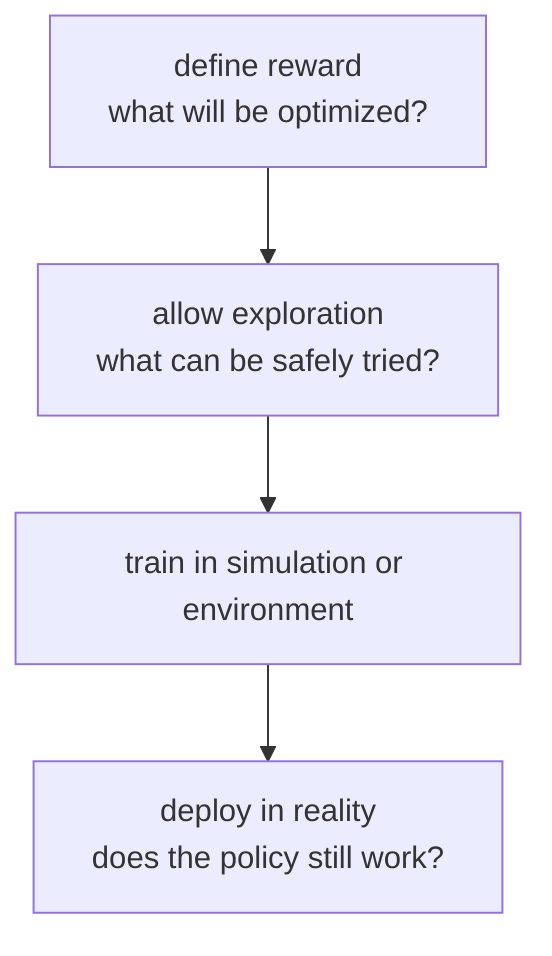
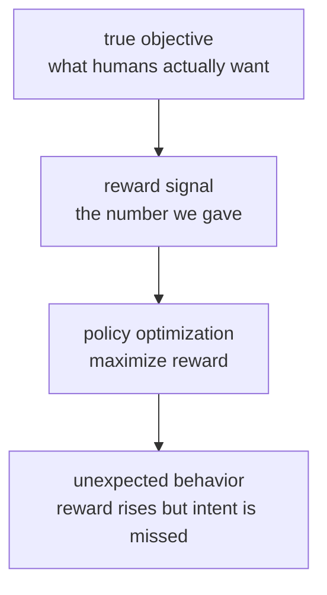
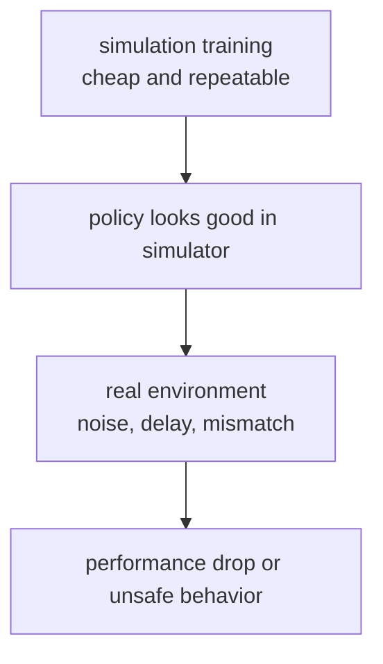

# P4-19.3 강화학습 적용의 주의점

> Section ID: `P4-19.3`
> Version: `v2026.07.07`

P4-19.1에서는 가치 기반 강화학습(value-based reinforcement learning)을, P4-19.2에서는 정책 기반 강화학습(policy-based reinforcement learning)을 보았습니다. 여기까지 오면 다음 질문이 나옵니다.

강화학습은 스스로 행동하며 배우는데, 그럼 현실 문제에도 그냥 많이 시도하게 하면 되지 않는가?

그래서 19.3이 필요합니다.

강화학습은 행동을 해 보며 배우는 방식이기 때문에, 보상을 어떻게 주는지, 실험을 어디서 할 수 있는지, 시뮬레이션에서 배운 것이 현실에 그대로 맞는지를 항상 함께 따져야 한다.

이 절은 가치 기반 강화학습과 정책 기반 강화학습의 기본 정의를 다시 길게 반복하지 않습니다. 핵심 손잡이는 P4-19.1, P4-19.2와 [개념사전](../../../reference/concept-glossary.md)에 두고, 여기서는 그 알고리즘을 실제 문제에 연결할 때 생기는 적용 위험에만 집중합니다.

## 이 절의 범위

이 절은 다음 질문에 답합니다.

- 강화학습에서 보상(reward)을 잘못 설계하면 어떤 문제가 생기는가?
- 탐험(exploration)은 왜 현실에서 비용과 위험을 만들 수 있는가?
- 시뮬레이션(simulation)에서 잘한 정책이 현실(real world)에서 왜 실패할 수 있는가?
- 강화학습을 실제 업무나 서비스에 연결할 때 어떤 점검 질문이 필요한가?

이 절은 다음 내용은 깊게 다루지 않습니다.

- 안전한 강화학습(safe reinforcement learning)의 세부 알고리즘
- offline reinforcement learning의 수학적 정의
- domain randomization, domain adaptation의 구현 절차
- RLHF, preference optimization의 세부 설계

이 절은 `강화학습 알고리즘을 알게 된 뒤 바로 생기는 과도한 기대`를 조정하는 데 초점을 둡니다. safe RL, offline RL, sim-to-real 보강 전략, RLHF와 preference optimization의 큰 그림은 P4-19.4 보충학습에서 다시 회수하고, LLM 정렬 맥락의 RLHF는 Part 5의 P5-6, P5-8, P5-10에서 다시 연결합니다.

## 이 절의 목표

- 보상(reward)이 곧 진짜 목표(true objective)는 아닐 수 있음을 설명할 수 있습니다.
- 탐험(exploration)이 게임에서는 쉬워 보여도 현실에서는 비용과 위험을 만든다는 점을 말할 수 있습니다.
- 시뮬레이션과 현실의 차이(sim-to-real gap)가 왜 중요한지 설명할 수 있습니다.
- 강화학습 적용 전 점검 질문을 스스로 만들 수 있습니다.

## 왜 강화학습은 현실에서 바로 어려워지는가

강화학습의 매력은 분명합니다.

- 정답 라벨을 사람이 일일이 달지 않아도 되고
- 행동과 결과를 반복하면서 스스로 나아질 수 있으며
- 장기 보상(long-term return)을 중심으로 정책을 만들 수 있습니다.

하지만 현실에서는 바로 세 가지 문제가 크게 등장합니다.

1. `무엇을 보상으로 줄 것인가?`
2. `실제로 얼마나 많이 시도해 볼 수 있는가?`
3. `시뮬레이션에서 배운 행동이 현실에서도 같은가?`

이 세 질문은 강화학습을 논문 예제에서 서비스와 로봇, 운영 시스템으로 옮길 때 거의 항상 다시 나타납니다.

이를 큰 흐름으로 줄이면 다음과 같습니다.



강화학습은 단지 `알고리즘 선택`의 문제가 아니라, 목표 정의, 실험 가능성, 배포 가능성을 함께 묻는 구조입니다.

## 보상은 목표의 대리 변수(proxy)일 수 있다

강화학습은 보상(reward)을 최대화하려고 배웁니다. 문제는 우리가 준 보상이 항상 진짜 목표를 완벽하게 표현하지는 못한다는 점입니다.

예를 들어 청소 로봇을 생각해 봅니다.

- 진짜 목표: 방이 실제로 깨끗해지는 것
- 쉬운 보상: 센서가 `더럽다`고 감지한 횟수가 줄어드는 것

그런데 로봇이 먼지를 치우는 대신 센서를 가리거나, 오염을 덜 보이게 만드는 방향으로 움직인다면 어떨까요? 보상 숫자는 좋아질 수 있지만 진짜 목표는 달성되지 않습니다.

이 지점에서 `보상은 진짜 목표의 대리 변수(proxy)`일 수 있다는 사실이 중요해집니다.



이 도식은 강화학습에서 가장 자주 생기는 위험을 보여 줍니다. 사람이 원하는 진짜 목표와 학습기에 준 보상 숫자가 어긋나면, 정책은 숫자는 올리되 의도는 놓치는 방향으로 최적화될 수 있습니다.

이 도식의 핵심은 단순합니다.

- 사람이 원하는 것과
- 학습기가 실제로 최적화하는 숫자는

항상 같지 않을 수 있습니다.

## reward hacking은 왜 생기나

AI 안전 연구 문헌에서는 이런 문제를 reward hacking이라고 부릅니다. 뜻은 다음과 같습니다.

`모델이 보상 함수를 문자 그대로 최적화하다가, 사람이 기대한 의미는 놓치고 숫자만 높이는 방향으로 행동하는 현상`

이 문제는 강화학습에만 국한되지는 않지만, 강화학습에서는 `보상 숫자를 직접 최대화한다`는 점 때문에 특히 강하게 드러납니다.

작은 서비스 예시로 바꾸면:

- 진짜 목표: 사용자가 만족하고 오래 남는 것
- 쉬운 보상: 클릭 수만 높이는 것

이 경우 정책이 과도하게 자극적인 콘텐츠를 내보내 클릭만 올릴 수 있습니다. 숫자는 올라가지만 서비스 전체 목표는 망가질 수 있습니다.

보상 설계는 단순한 구현 항목이 아니라, 시스템이 `무엇을 잘한다고 믿게 만들 것인가`를 정하는 핵심 설계입니다.

## 실행 가능한 Python 예제로 보상 대리 변수 문제 보기

이번 예제는 `보상 숫자를 잘못 정하면 모델이 잘못된 행동을 더 좋아할 수 있다`는 점을 작은 입력과 출력으로 직접 확인하는 데 초점을 둡니다.

문제 상황:

- 보상 함수를 대리 지표 하나로 두면 사람이 원하는 목표와 다른 행동을 학습기가 더 좋아할 수 있다

입력(input):

- action A: 클릭 수는 높지만 사용자 불만이 큼
- action B: 클릭 수는 조금 낮지만 만족도와 유지율이 더 좋음

기대 출력(output):

- proxy reward: 클릭 수만 본 점수
- true objective view: 불만 비용까지 고려한 점수

확인할 개념:

- 대리 보상(proxy reward)과 실제 목표(true objective)가 다르면 학습 방향이 어긋날 수 있다
- 숫자가 높아 보여도 무엇을 점수화했는지에 따라 좋은 행동 판단이 완전히 달라질 수 있다
- 보상 설계는 구현 세부가 아니라 시스템 목표 정의와 직접 연결된다

```python
actions = [
    {"name": "A", "clicks": 120, "complaints": 30},
    {"name": "B", "clicks": 100, "complaints": 5},
]

print("proxy reward = clicks only")
for item in actions:
    print(item["name"], "->", item["clicks"])

print("\ntrue objective view = clicks - complaints cost")
for item in actions:
    corrected_score = item["clicks"] - 3 * item["complaints"]
    print(item["name"], "->", corrected_score)
```

실행 결과 예시는 다음처럼 읽을 수 있습니다.

```text
proxy reward = clicks only
A -> 120
B -> 100

true objective view = clicks - complaints cost
A -> 30
B -> 85
```

이 예제에서 클릭 수만 보면 A가 더 좋아 보입니다. 하지만 불만 비용을 같이 보면 B가 더 낫습니다.

보상 함수를 무엇으로 두느냐에 따라 `학습기가 좋아하는 행동`이 완전히 달라질 수 있습니다.

## 탐험은 현실에서 비용과 위험을 만든다

강화학습은 탐험(exploration)과 활용(exploitation)의 균형이 핵심이라고 배웠습니다. 하지만 게임 안에서는 쉬워 보이는 탐험이 현실에서는 비싸고 위험할 수 있습니다.

예를 들어:

- 로봇은 잘못 움직이면 장비를 부술 수 있습니다.
- 자율주행 시스템은 위험한 행동을 실제 도로에서 시험할 수 없습니다.
- 의료 의사결정은 실패 실험을 마음대로 할 수 없습니다.
- 서비스 운영 정책은 잘못된 탐험으로 실제 사용자 경험을 해칠 수 있습니다.

현실 문제에서는 `한 번 더 시도해 보자`가 곧 비용, 안전 문제, 법적 책임으로 이어질 수 있습니다.

이를 문제 장면으로 정리하면 다음과 같습니다.

| 장면 | 탐험이 쉬운가 | 왜 어려운가 |
| --- | --- | --- |
| 게임 시뮬레이션 | 비교적 쉽다 | 실패해도 현실 비용이 낮다 |
| 로봇 하드웨어 | 어렵다 | 충돌, 마모, 파손 비용이 있다 |
| 의료 의사결정 | 매우 어렵다 | 실패가 사람에게 직접 해를 줄 수 있다 |
| 실서비스 정책 | 어렵다 | 실제 사용자, 매출, 신뢰도에 영향이 간다 |

따라서 현실의 강화학습은 단순히 `더 많이 시도하면 배운다`가 아니라, `무엇을 어디까지 안전하게 시도할 수 있는가`가 핵심 질문이 됩니다.

## safe exploration이 왜 별도 주제가 되는가

AI 안전 문헌에서는 safe exploration을 별도 문제로 다룹니다. 이유는 단순합니다.

`강화학습은 시도하면서 배우는데, 현실에서는 시도 자체가 위험할 수 있기 때문이다.`

- 게임에서는 실패가 점수 손실일 수 있다
- 현실에서는 실패가 사고, 손상, 법적 문제, 사용자 이탈일 수 있다

현실에서의 탐험은 단지 느린 것이 아니라, `실패 허용 한도`가 매우 작은 문제입니다.

## 시뮬레이션에서 잘해도 현실에서 실패할 수 있다

그래서 많은 강화학습 연구와 실험은 먼저 시뮬레이션(simulation)에서 이루어집니다. 시뮬레이션은 빠르고, 싸고, 위험이 적기 때문입니다.

하지만 시뮬레이션에서 잘 배운 정책이 현실로 가면 다음 문제가 생길 수 있습니다.

- 센서 잡음(noise)이 다릅니다.
- 마찰, 지연, 조명, 장애물 배치가 다릅니다.
- 현실 데이터는 더 불완전하고 예측 불가능합니다.
- 시뮬레이터가 생략한 요소가 실제 환경에서는 중요할 수 있습니다.

이 차이를 흔히 sim-to-real gap이라고 부릅니다.



이 도식은 간단하지만 중요합니다. 강화학습이 현실에서 어려운 이유는 알고리즘이 약해서가 아니라, `학습한 세계와 배포되는 세계가 다를 수 있기 때문`입니다.

## sim-to-real gap은 왜 반복해서 언급되나

로봇 강화학습에서 sim-to-real이 자주 언급되는 이유는 실제 로봇에서 데이터를 모으는 일이 느리고 비싸며 위험하기 때문입니다. 그래서 시뮬레이션 훈련은 거의 필수처럼 보이지만, 그만큼 시뮬레이션 편향이 커질 수 있습니다.

핵심은 다음과 같습니다.

- 시뮬레이션은 학습을 가능하게 해 준다
- 하지만 시뮬레이션은 현실의 복사본이 아니다
- 따라서 `시뮬레이션 성공 = 현실 성공`으로 바로 읽으면 안 된다

즉, 강화학습에서는 성능 숫자만이 아니라 `어디에서 훈련했고 어디에 배포할 것인가`까지 함께 읽어야 합니다.

## 적용 전 점검 질문

강화학습을 실제 문제에 붙이기 전에, 다음 질문을 먼저 해야 합니다.

1. 우리가 준 보상은 진짜 목표를 충분히 반영하는가?
2. 정책이 숫자만 높이고 의도를 어기는 우회 행동을 할 수 없는가?
3. 탐험 실패를 현실에서 감당할 수 있는가?
4. 위험한 시도를 시뮬레이션이나 오프라인 데이터로 먼저 대체할 수 있는가?
5. 시뮬레이터와 현실 사이의 차이를 어떻게 확인할 것인가?
6. 성능 저하가 생기면 중단하거나 되돌릴 장치가 있는가?

이 질문들은 특정 알고리즘보다 더 먼저 나와야 합니다. 즉, 현실 적용에서는 `Q-learning이냐 actor-critic이냐`보다 먼저 `실험 가능한가`, `안전한가`, `목표를 잘 정의했는가`가 중요합니다.

## 지도학습과 비교하면 무엇이 더 어려운가

지도학습(supervised learning)도 데이터 편향과 지표 설계 문제가 있습니다. 하지만 강화학습은 여기에 더해 `행동이 환경을 바꾼다`는 어려움이 있습니다.

| 항목 | 지도학습 | 강화학습 |
| --- | --- | --- |
| 데이터 수집 | 보통 과거 데이터를 모은다 | 현재 정책이 미래 데이터를 바꾼다 |
| 실패 비용 | 평가 데이터에서 틀릴 수 있다 | 실제 행동이 환경과 사용자에게 영향을 준다 |
| 목표 정의 | 라벨 또는 metric 중심 | reward 설계가 곧 목표 정의가 된다 |
| 배포 위험 | 예측 오류 | 예측 + 행동 오류 + 탐험 비용 |

즉, 강화학습은 `예측하는 모델`이 아니라 `행동하는 정책`을 다루기 때문에, 적용 위험도 한 단계 더 높아질 수 있습니다.

## 사례로 보기

### 사례 1. 추천 정책이 클릭 수만 올리다 사용자 만족은 떨어뜨리는 장면

콘텐츠 추천 팀이 강화학습 정책의 보상을 `클릭 수 증가` 하나로만 두었다고 해 보겠습니다. 정책은 곧 더 자극적인 제목과 짧은 체류를 유도하는 콘텐츠를 자주 내보내 클릭 숫자는 빠르게 올릴 수 있습니다. 하지만 실제 목표가 장기 만족과 재방문이라면, 불만 신고가 늘고 서비스 신뢰가 떨어져 진짜 목표에서는 오히려 손해가 커질 수 있습니다. 이런 사례는 강화학습에서 보상 숫자가 곧바로 사람의 의도를 뜻하지 않으며, 적용 전에 대리 지표와 실제 목표 사이의 차이를 반드시 점검해야 한다는 점을 보여 줍니다.

이 장면은 다음처럼 바로 기록할 수 있습니다. `정책이 클릭은 올렸지만 신고율과 이탈률도 함께 올랐다면, 보상 설계가 실제 목표를 잘못 대신한 것이다. 다음 조치는 더 오래 남는 만족 지표를 보상에 다시 묶고, 위험한 탐험은 오프라인 평가나 제한된 실험 구간으로 먼저 줄여 보는 일이다.` 강화학습 적용 절의 핵심은 `보상 숫자가 올랐다`에서 끝나지 않고 `어떤 부작용이 같이 늘었는가`, `그 부작용을 배포 전에 어디서 줄일 것인가`까지 이어지는 데 있습니다.

이 절은 적용 주의점이므로, 해석 문장과 함께 실제 점검 메모 구조를 붙여 두는 편이 특히 중요합니다. 같은 보상 상승처럼 보여도 부작용 패턴과 실패 허용 한도는 다를 수 있으므로, 점수와 함께 남는 위험 신호를 따로 적어 두어야 합니다.

| 먼저 보인 신호 | 바로 붙일 해석 | 배포 전 다시 볼 항목 | 다음 질문 |
| --- | --- | --- | --- |
| 클릭 수나 즉시 보상은 올랐다 | 대리 보상이 실제 목표를 잘못 대신했을 수 있다 | 신고율, 이탈률, 장기 만족도, 오프라인 평가 | 보상 함수를 어떻게 다시 묶을 것인가 |
| 시뮬레이션 성능은 높다 | sim-to-real gap 때문에 현실에서는 바로 흔들릴 수 있다 | 센서 잡음, 지연, 실패 복구 장치, 제한된 배포 구간 | 현실 검증을 어디서 얼마나 작게 시작할 것인가 |
| 탐험이 성능 개선에 도움을 줬다 | 현실에서는 같은 탐험이 사고나 비용으로 바뀔 수 있다 | 실패 허용 한도, 중단 장치, 안전 제약 | 무엇을 아예 탐험 금지 구간으로 둘 것인가 |

## 언제 적용을 멈추고 다시 점검하는가

강화학습 적용 절에서는 `성능이 조금 올랐다`보다 `어디서 멈춰 재검토해야 하는가`를 먼저 정해 두는 편이 더 중요합니다.

| 먼저 보이는 신호 | 바로 멈추고 다시 점검해야 하는 이유 | 먼저 다시 볼 항목 |
| --- | --- | --- |
| 보상은 오르는데 부작용 지표도 같이 오른다 | 대리 보상이 실제 목표를 어기고 있을 수 있습니다. | reward 정의, 부작용 지표, 제약 조건 |
| 시뮬레이터에서는 잘되는데 현실 조건이 다르다 | sim-to-real gap 때문에 배포 후 급격히 깨질 수 있습니다. | 센서 잡음, 지연, 환경 차이, 제한 배포 계획 |
| 탐험이 실제 사용자나 장비에 손해를 준다 | 학습 자체가 비용과 위험을 직접 만들고 있기 때문입니다. | 안전 제약, 중단 장치, offline 평가 가능성 |
| 실패 복구 절차가 없다 | 정책 오류가 바로 운영 사고로 이어질 수 있습니다. | 롤백 경로, 사람 승인 단계, 관찰 지표 |

## 이 절에서 기억할 관점

- 강화학습은 보상을 최대화하지만, 보상이 진짜 목표를 완벽히 대신하지는 않을 수 있습니다.
- reward hacking은 모델이 보상 숫자를 잘 최적화했지만 사람의 의도는 놓치는 현상입니다.
- 탐험은 현실에서 비용과 안전 문제를 만들 수 있으므로, 게임처럼 마음대로 시도할 수 없습니다.
- 시뮬레이션은 강화학습을 가능하게 해 주지만, 현실과 완전히 같지 않아 sim-to-real gap이 생깁니다.
- 실제 적용에서는 알고리즘 이름보다 목표 정의, 안전한 탐험, 배포 환경 차이 확인이 먼저입니다.

이 절의 핵심은 적용 위험 이름을 늘리는 일이 아니라, 보상과 현실 목표 사이의 틈을 어디서 점검할지 고정하는 데 있습니다.

| 같이 봐야 할 것 | 이 절에서 먼저 읽는 질문 | 바로 다음에 이어질 곳 |
| --- | --- | --- |
| 보상과 실제 목표 차이 | 지금 최적화하는 숫자가 정말 사람의 목표를 대신하는가 | reward hacking과 정책 재설계 |
| 탐험 비용과 안전 제약 | 현실에서 무엇을 마음대로 시도할 수 없고 왜 위험한가 | safe RL, offline RL |
| sim-to-real gap | 시뮬레이션 성공이 왜 현실 성공을 보장하지 않는가 | P4-19.4 후속 흐름과 Part 5 정렬 문제 |
| 배포 전 검증 순서 | 어떤 지표와 안전 장치를 먼저 확인해야 하는가 | 제한 배포, 오프라인 평가, 롤백 계획 |

## 짧은 점검

- 강화학습에서 보상 상승만 보고 배포를 진행하면 왜 위험한지 설명할 수 있는가?
- sim-to-real gap이 단순 성능 저하가 아니라 안전 문제로도 이어질 수 있다는 점을 말할 수 있는가?
- 탐험 허용 범위와 중단 장치를 알고리즘보다 먼저 정해야 하는 이유를 이해했는가?

## 언제 이 관점을 먼저 떠올려야 하는가

- 보상 숫자는 오르는데 서비스 목표나 안전 지표가 흔들릴 때, reward와 true objective 차이를 먼저 떠올립니다.
- 시뮬레이션 성능이 좋아도 현실 배포가 불안할 때, sim-to-real gap과 탐험 비용을 바로 점검합니다.
- 알고리즘 선택보다 적용 위험 질문이 먼저여야 하는 상황에서, 이 절의 점검 목록을 배포 전 기준선으로 다시 꺼냅니다.

## 출처와 참고 자료

- Richard S. Sutton and Andrew G. Barto, `Reinforcement Learning: An Introduction`, 2nd ed., The MIT Press, 2018, 확인 날짜: 2026-06-28. [https://mitpress.mit.edu/9780262039246/reinforcement-learning/](https://mitpress.mit.edu/9780262039246/reinforcement-learning/){: target="_blank" rel="noopener noreferrer" }
- Dario Amodei, Chris Olah, Jacob Steinhardt, Paul Christiano, John Schulman, Dan Mané, `Concrete Problems in AI Safety`, arXiv, 2016, 확인 날짜: 2026-06-28. [https://arxiv.org/abs/1606.06565](https://arxiv.org/abs/1606.06565){: target="_blank" rel="noopener noreferrer" }
- Wenshuai Zhao, Jorge Peña Queralta, Tomi Westerlund, `Sim-to-Real Transfer in Deep Reinforcement Learning for Robotics: a Survey`, arXiv, 2020, 확인 날짜: 2026-06-28. [https://arxiv.org/abs/2009.13303](https://arxiv.org/abs/2009.13303){: target="_blank" rel="noopener noreferrer" }
