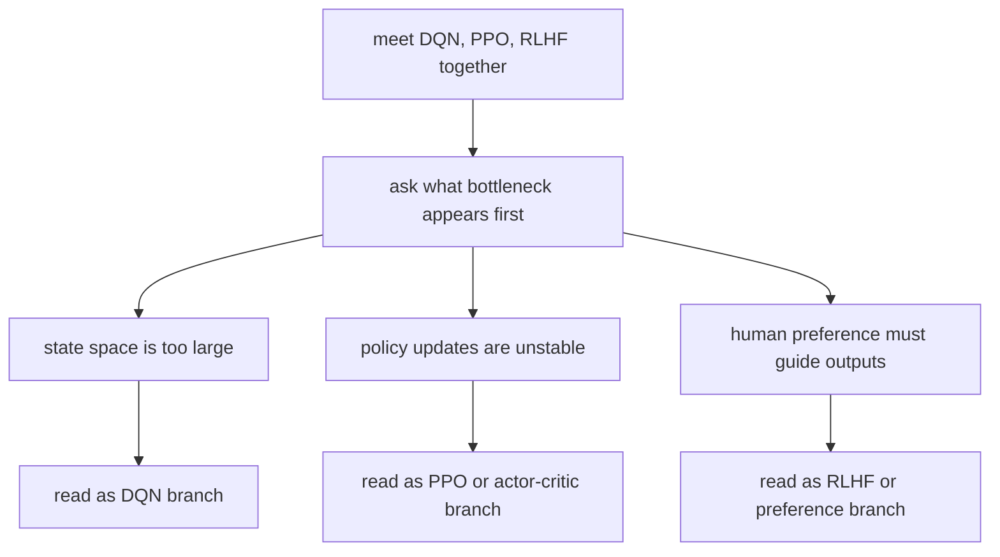

# P4-19.4 보충학습: DQN, PPO, RLHF를 강화학습 큰 흐름 안에서 읽기

> Section ID: `P4-19.4`
> Version: `v2026.07.08`

P4-19.1부터 P4-19.3까지 읽고 나면 강화학습을 더 공부할 때 곧 여러 이름을 만나게 됩니다.

- DQN
- PPO, TRPO, A2C, A3C
- safe reinforcement learning
- offline reinforcement learning
- domain randomization
- RLHF, preference optimization

이 이름들은 서로 다른 시대와 문제의식에서 나왔지만, 한꺼번에 밀려들기 쉽습니다. 이 절은 각 알고리즘 구현을 배우기보다, `왜 이런 이름들이 분기되었는가`를 큰 흐름으로 정리하는 데 집중합니다.

이 보충학습은 강화학습의 기본 정의를 다시 처음부터 설명하는 절이 아닙니다. 가치 기반 강화학습의 손잡이는 P4-19.1, 정책 기반 강화학습의 손잡이는 P4-19.2, 적용 위험의 손잡이는 P4-19.3과 [개념사전](../../../reference/concept-glossary.md)에 두고, 여기서는 그 뒤에 붙는 이름들을 계보처럼만 정리합니다.

## 이 보충학습의 범위

이 절은 다음 질문에 답합니다.

- DQN은 왜 가치 기반 강화학습의 대표 후속 사례로 자주 언급되는가?
- PPO, TRPO, A2C, A3C는 정책 기반 강화학습의 어떤 어려움을 줄이려는가?
- safe RL, offline RL은 왜 현실 적용 문맥에서 별도 주제가 되었는가?
- domain randomization은 sim-to-real 문제와 어떻게 연결되는가?
- RLHF는 왜 강화학습의 일반 문제와 LLM 정렬 문제를 이어 주는가?

이 절은 다음 내용은 깊게 다루지 않습니다.

- 개별 알고리즘의 수식 유도와 구현 코드
- 벤치마크 성능 비교표
- 실제 서비스 인프라 운영 절차

RLHF의 상세 학습 파이프라인과 정렬 실무는 Part 5에서 다시 다룹니다.

## 이 보충학습의 목표

- 강화학습 후속 알고리즘 이름들을 가치 기반, 정책 기반, 현실 적용 보강, LLM 정렬 연결이라는 네 갈래로 정리할 수 있습니다.
- DQN과 PPO가 각각 어떤 전통 위에 서 있는지 설명할 수 있습니다.
- safe RL, offline RL, domain randomization이 `현실에서 함부로 시도할 수 없음`이라는 문제와 연결된다는 점을 말할 수 있습니다.
- RLHF를 `LLM에 강화학습을 그대로 이식한 것`이 아니라 정렬 문제에 맞게 변형된 후속 흐름으로 이해할 수 있습니다.

## 먼저 큰 지도를 그리기

다음 표로 큰 지도를 잡을 수 있습니다.

| 이름 묶음 | 주로 답하려는 질문 |
| --- | --- |
| DQN | 값 기반 강화학습을 더 큰 상태 공간으로 어떻게 확장할까? |
| PPO, TRPO, A2C, A3C | 정책을 직접 배우되 너무 불안정하지 않게 만들 수 있을까? |
| safe RL, offline RL | 현실에서 위험하거나 비싼 탐험을 줄일 수 있을까? |
| domain randomization | 시뮬레이션에서 배운 정책을 현실로 더 잘 옮길 수 있을까? |
| RLHF, preference optimization | 사람 선호를 반영해 LLM 출력을 더 바람직하게 만들 수 있을까? |

즉, 후속 알고리즘 이름들은 모두 `더 똑똑한 강화학습`이 아니라, `강화학습을 더 넓은 현실 제약 아래에서 쓰기 위한 분기`로 읽는 편이 맞습니다.

이 보충학습에서도 이름만 나열하지 말고, 어떤 문제 신호가 어떤 분기를 낳았는지 같이 남겨야 합니다. 같은 강화학습 계열 이름처럼 보여도 실제로 줄이려는 실패 비용과 현실 제약은 다를 수 있으므로, 이름보다 문제 신호를 먼저 적어야 합니다.

| 이름 묶음 | 먼저 보인 문제 신호 | 왜 이 분기가 필요했는가 |
| --- | --- | --- |
| DQN | 값 표만으로는 상태 공간이 너무 커진다 | 가치 기반을 더 큰 문제로 확장하기 위해 |
| PPO, TRPO, A2C, A3C | 정책 업데이트가 쉽게 흔들린다 | 정책 조정을 더 안정적으로 만들기 위해 |
| safe RL, offline RL | 현실에서 마음대로 탐험할 수 없다 | 실패 비용과 데이터 제약을 줄이기 위해 |
| domain randomization | 시뮬레이션 성능이 현실에서 바로 깨진다 | sim-to-real gap을 줄이기 위해 |
| RLHF | 사람 선호를 정답 라벨로 바로 두기 어렵다 | 사람 피드백을 보상 신호처럼 연결하기 위해 |

## 어떤 후속 갈래를 먼저 찾아보는가

강화학습 후속 이름이 많아 보일 때는 이름보다 `지금 먼저 드러난 병목이 무엇인가`를 기준으로 갈래를 잡아야 합니다.

| 먼저 드러난 병목 | 먼저 떠올릴 갈래 | 이유 |
| --- | --- | --- |
| 상태 공간이 너무 커서 Q-table 직관이 깨진다 | DQN 계열 | 가치 기반을 함수 근사로 확장하는 문제가 중심이기 때문입니다. |
| 정책 업데이트가 자주 흔들린다 | PPO, TRPO, actor-critic 계열 | 정책을 직접 배우되 더 안정적으로 바꾸려는 흐름과 맞닿아 있습니다. |
| 현실에서 탐험을 마음대로 할 수 없다 | safe RL, offline RL | 실패 비용과 데이터 제약을 줄이는 쪽이 우선 과제이기 때문입니다. |
| 시뮬레이션 성능이 현실에서 유지되지 않는다 | domain randomization, sim-to-real 보강 | 배포 환경 차이를 줄이는 전략이 먼저 필요합니다. |
| 사람 선호를 언어 모델 출력에 반영해야 한다 | RLHF, preference optimization | 일반 RL보다 정렬과 사람 피드백 해석이 더 중심 문제가 됩니다. |

## DQN은 왜 따로 자주 등장하나

P4-19.1에서 본 Q-learning은 직관이 좋지만, 상태와 행동이 커지면 표(table)로 값을 다 적기 어려워집니다. DQN은 이 지점에서 등장합니다.

즉, DQN은 `Q-value를 표가 아니라 함수 근사기로 대신 표현해 더 큰 상태 공간을 다루려는 흐름`입니다.

그래서 DQN은 완전히 새로운 철학이라기보다, 가치 기반 강화학습을 더 큰 문제로 확장한 대표 사례입니다.

## PPO와 actor-critic 계열은 왜 널리 쓰이나

P4-19.2에서 본 정책 기반 강화학습은 행동 방식을 직접 조정한다는 장점이 있지만, 학습이 흔들리기 쉽습니다. PPO, TRPO, A2C, A3C 같은 이름은 대체로 이 문제와 연결됩니다.

- 정책을 너무 급하게 바꾸지 않게 하고 싶다
- 학습 신호의 흔들림을 줄이고 싶다
- actor와 critic의 역할 분담을 더 안정적으로 쓰고 싶다

| 계열 | 입문적 읽기 |
| --- | --- |
| TRPO, PPO | 정책을 한 번에 너무 크게 흔들지 않으려는 흐름 |
| A2C, A3C | actor-critic 구조를 더 실용적으로 운영하려는 흐름 |

즉, 이 이름들은 `정책 기반 강화학습이 실전에서 자주 흔들린다`는 문제에 대한 후속 대답입니다.

## safe RL과 offline RL은 왜 별도 주제가 되었나

P4-19.3에서 본 것처럼 현실에서는 탐험 자체가 위험하거나 비쌀 수 있습니다. 그래서 다음 두 갈래가 따로 커졌습니다.

- safe RL: 탐험과 정책 개선을 하더라도 위험 제약을 더 엄격하게 다루려는 흐름
- offline RL: 새 탐험을 많이 하지 않고, 이미 모인 데이터로 정책을 배우려는 흐름

이 둘은 모두 `마음껏 시도해 볼 수 없다`는 현실 문제에서 나왔습니다.

## domain randomization은 왜 sim-to-real과 연결되나

시뮬레이션에서 잘 배운 정책이 현실에서 실패하는 이유 중 하나는 환경 차이입니다. domain randomization은 시뮬레이션 조건을 일부러 더 다양하게 흔들어, 현실 차이에 덜 약한 정책을 만들려는 방향으로 이해할 수 있습니다.

즉, 핵심은 다음과 같습니다.

`현실을 완벽히 복사할 수 없다면, 시뮬레이션을 너무 한 가지 조건에만 맞추지 말자.`

## RLHF는 왜 여기서도 중요하고, Part 5에서도 다시 보나

RLHF(reinforcement learning from human feedback)는 이름 그대로 보면 강화학습의 한 갈래처럼 보입니다. 하지만 LLM 문맥에서는 일반 게임이나 로봇 제어와 같은 문제를 그대로 옮긴 것이 아닙니다.

- LLM은 사람 선호나 평가 기준을 바로 정답 라벨로 두기 어려운 경우가 많습니다.
- 그래서 사람 피드백을 보상 신호처럼 바꾸어 정책을 조정하려는 흐름이 등장했습니다.
- 이때 강화학습 언어와 정렬(alignment) 언어가 만납니다.

즉, RLHF는 강화학습 일반론의 일부이면서도, LLM 정렬이라는 별도 맥락 때문에 Part 5에서 다시 자세히 볼 필요가 있습니다.

| 지금 Part 4에서 잡는 것 | Part 5에서 다시 보는 것 |
| --- | --- |
| RLHF가 왜 강화학습 계보와 연결되는가 | LLM 학습 파이프라인 안에서 RLHF가 어디에 들어가는가 |
| 사람 피드백을 보상처럼 다룰 수 있다는 생각 | reward model, preference data, alignment 절차 |

## 사례로 보기

### 사례 1. DQN, PPO, RLHF가 한꺼번에 나왔을 때 무엇부터 구분해야 할까

강화학습 입문자가 자료를 찾다 보면 게임 성능을 다루는 DQN, 정책 안정화를 말하는 PPO, LLM 정렬 문맥의 RLHF를 한 자리에서 연달아 만나기 쉽습니다. 이름만 보면 모두 최신 강화학습 기법처럼 보이지만, 실제로는 `값을 더 큰 상태 공간으로 확장하려는 흐름`, `정책을 더 안정적으로 조정하려는 흐름`, `사람 선호를 반영해 언어 모델을 조정하는 흐름`으로 문제의식이 다릅니다. 이 차이를 구분하지 않으면 알고리즘 이름만 외우고 왜 분기되었는지를 놓치게 됩니다. 그래서 먼저 `무슨 문제를 해결하려고 나온 이름인가`를 묶어 읽는 것이 더 중요합니다.

이 사례를 handoff 메모처럼 줄이면 다음처럼 적을 수 있습니다.

| 만난 이름 | 바로 읽어야 할 문제의식 | 다음에 확인할 연결 |
| --- | --- | --- |
| DQN | 가치 기반을 더 큰 상태 공간으로 어떻게 확장했는가 | 함수 근사와 Part 4 신경망 연결 |
| PPO | 정책 업데이트를 어떻게 덜 흔들리게 만들었는가 | actor-critic, 정책 안정화 |
| RLHF | 사람 피드백을 어떻게 보상 신호처럼 연결했는가 | Part 5 정렬과 preference optimization |

## 이 절에서 기억할 관점

- DQN은 가치 기반 강화학습을 큰 상태 공간으로 확장한 흐름입니다.
- PPO, TRPO, A2C, A3C는 정책 기반 강화학습의 불안정성을 줄이려는 흐름입니다.
- safe RL, offline RL, domain randomization은 현실 제약과 배포 위험 때문에 나온 갈래입니다.
- RLHF는 강화학습이 LLM 정렬과 만나는 지점입니다.

| 같이 봐야 할 것 | 이 절에서 먼저 읽는 질문 | 바로 다음에 이어질 곳 |
| --- | --- | --- |
| 알고리즘 이름 뒤의 문제 신호 | 이 이름은 무엇을 해결하려고 등장했는가 | 강화학습 후속 계보 정리 |
| 현실 제약 분기 | 실패 비용, 탐험 제한, sim-to-real이 어떤 갈래를 키웠는가 | safe RL, offline RL, domain randomization |
| LLM 연결 | RLHF가 왜 일반 RL과 같지 않으면서도 이어지는가 | Part 5 정렬 파이프라인 |

## 짧은 점검

- DQN과 PPO를 같은 종류의 업그레이드 이름으로 뭉뚱그리지 않고, 각각 어떤 병목에서 나왔는지 구분할 수 있는가?
- safe RL, offline RL, domain randomization이 모두 현실 제약과 연결된 분기라는 점을 설명할 수 있는가?
- RLHF를 일반 제어 문제의 RL과 LLM 정렬 문제 사이의 연결로 읽을 수 있는가?

## 언제 이 관점을 먼저 떠올려야 하는가

- DQN, PPO, RLHF 같은 이름이 한꺼번에 나와 흐름이 섞일 때, 각 이름이 어떤 병목에서 나왔는지 먼저 정리합니다.
- safe RL, offline RL, domain randomization이 왜 분기됐는지 설명해야 할 때, 현실 제약과 탐험 제한 문제를 기준으로 다시 묶습니다.
- LLM 정렬 문맥에서 RLHF가 등장할 때, 일반 RL 흐름과 연결되지만 동일하지는 않다는 점을 먼저 떠올립니다.

## 출처와 참고 자료

- Richard S. Sutton, Andrew G. Barto, [Reinforcement Learning: An Introduction, 2nd ed.](https://mitpress.mit.edu/9780262039246/reinforcement-learning/){: target="_blank" rel="noopener noreferrer" }, 확인 날짜: 2026-07-01.
- Volodymyr Mnih et al., [Human-level control through deep reinforcement learning](https://www.nature.com/articles/nature14236){: target="_blank" rel="noopener noreferrer" }, 확인 날짜: 2026-07-01.
- John Schulman et al., [Proximal Policy Optimization Algorithms](https://arxiv.org/abs/1707.06347){: target="_blank" rel="noopener noreferrer" }, 확인 날짜: 2026-07-01.
- Long Ouyang et al., [Training language models to follow instructions with human feedback](https://arxiv.org/abs/2203.02155){: target="_blank" rel="noopener noreferrer" }, 확인 날짜: 2026-07-01.
