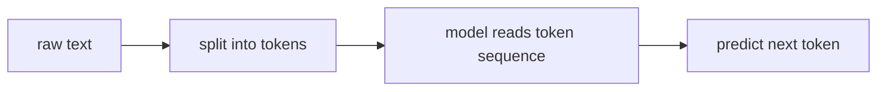

# P5-1.1 토큰(token)은 무엇인가

Part 4의 마지막에서는 생성 모델이 여러 후보 중 실제 출력을 선택하는 과정으로 샘플링(sampling)을 설명했습니다. 그러면 이제 LLM(large language model) 쪽에서는 더 구체적인 질문이 생깁니다.

그렇다면 모델은 텍스트를 정확히 무엇의 단위로 읽고, 무엇의 단위로 다음 출력을 고르는가?

이 절은 그 질문에 답합니다.

토큰(token)은 모델이 텍스트를 그대로 문장으로 읽지 않고, 내부 계산을 위해 나누어 다루는 입력과 출력의 기본 단위다.

## 이 절의 범위

이 절은 다음 질문에 답합니다.

- 토큰(token)은 글자(character), 단어(word), 문장(sentence)와 어떻게 다른가?
- 왜 LLM은 텍스트를 토큰 단위로 읽는가?
- 토큰은 입력 길이, 비용, 문맥 길이와 왜 연결되는가?
- 토큰 개념이 왜 Part 5 전체의 출발점이 되는가?

이 절에서는 다음 내용을 깊게 다루지 않습니다.

- 특정 토크나이저 알고리즘의 구현 세부
- BPE(Byte Pair Encoding)와 SentencePiece의 세부 비교
- 멀티모달 토큰 설계의 내부 구조

이 생략 항목 가운데 토크나이저 계열의 비교와 한국어를 포함한 분절 감각은 같은 장의 P5-1.3 보충학습에서 다시 회수합니다. 멀티모달 토큰의 내부 설계는 이 책의 현재 본편 범위를 넘어가므로, 여기서는 `텍스트를 계산 단위로 쪼갠다`는 공통 감각까지만 잡습니다.

이 절의 목적은 독자가 `토큰 수`, `context window`, `입력 길이`, `비용` 같은 말을 읽을 때, 그것이 무엇을 세는 단위인지 정확히 잡게 하는 데 있습니다.

## 이 절의 목표

- 토큰을 `모델이 텍스트를 계산하기 위해 쓰는 단위`로 설명할 수 있습니다.
- 단어 수와 토큰 수가 항상 같지 않다는 점을 이해할 수 있습니다.
- LLM의 입력 길이와 비용이 왜 토큰 기준으로 설명되는지 말할 수 있습니다.
- 다음 절의 토큰화(tokenization) 설명으로 자연스럽게 넘어갈 수 있습니다.

## 왜 텍스트를 그대로 넣지 않나

사람은 문장을 의미 단위로 자연스럽게 읽습니다. 하지만 모델은 텍스트를 그대로 `문장 전체`로 한 번에 이해하지 않습니다. 내부 계산을 위해서는 먼저 다룰 수 있는 작은 단위로 쪼개야 합니다.

이때 등장하는 것이 토큰(token)입니다.

다음처럼 이해하면 좋습니다.

`토큰은 사람이 읽는 자연스러운 단위와 꼭 같지 않아도 되지만, 모델이 반복 계산을 수행하기에 편한 단위다.`

## 토큰은 글자나 단어와 왜 다른가

토큰은 경우에 따라 다음과 비슷할 수 있습니다.

- 한 글자
- 한 단어
- 단어 일부
- 공백을 포함한 짧은 조각
- 구두점과 묶인 조각

예를 들어 영어에서는 흔한 단어 하나가 한 토큰처럼 처리될 수도 있지만, 드문 단어나 긴 조합은 여러 토큰으로 나뉠 수 있습니다. 한국어도 마찬가지로, 표면상 한 단어처럼 보여도 내부적으로는 여러 조각으로 쪼개질 수 있습니다.

즉, 토큰은 `언어학 수업의 단어 정의`와 같지 않습니다.

## 왜 이런 단위를 쓰는가

토큰 단위를 쓰면 모델은 다음과 같은 계산을 반복하기 쉬워집니다.

- 각 입력 조각을 숫자 ID로 바꾼다
- 그 ID를 임베딩(embedding) 벡터로 바꾼다
- 각 위치의 토큰 관계를 계산한다
- 다음 위치에 올 가능성이 큰 토큰을 고른다

즉, Part 4에서 본 Transformer와 생성 모델의 흐름은 결국 토큰 단위 반복 계산 위에서 실제로 작동합니다.

## 토큰이 비용과 길이에 왜 중요하나

LLM 서비스에서는 보통 다음 요소들이 토큰 기준으로 설명됩니다.

- 입력 길이
- 출력 길이
- 최대 문맥 길이(context window)
- API 사용 비용
- 응답 지연 시간(latency)

다음처럼 기억하면 충분합니다.

`LLM 서비스에서 텍스트의 크기를 재는 실무 단위는 글자 수보다 토큰 수인 경우가 많다.`

예를 들어 같은 길이의 두 문장이라도 토큰화 방식에 따라 토큰 수가 다를 수 있고, 그러면 비용과 문맥 사용량도 달라질 수 있습니다.

## 아주 단순하게 그리면



이 도식은 Part 5 전체의 가장 작은 출발점입니다.

## 사례로 보기

### 사례 1. 같은 문장, 다른 계산 단위

사용자는 채팅창에 `오늘 날씨가 좋다`처럼 짧은 문장을 한 번에 입력합니다. 사람은 이것을 문장 하나로 읽고 `짧다`고 느끼기 쉽지만, 모델은 먼저 여러 토큰으로 잘라 순서대로 처리합니다. 예를 들어 같은 한 문장이라도 숫자, 기호, 영어가 섞이면 사람이 느끼는 길이와 모델이 처리하는 단위 수가 달라질 수 있습니다. 그래서 눈에 보이는 문장 길이가 짧아도, 모델 내부에서는 `몇 개의 계산 단위로 쪼개졌는가`가 먼저 중요해집니다.

### 사례 2. 긴 문서 입력

사용자가 회의록 30쪽을 그대로 붙여 넣으면 사람은 `한 문서 전체를 읽어 달라`는 요청으로 이해합니다. 하지만 모델은 이 문서를 긴 토큰 시퀀스(sequence)로 받아들이므로, 앞부분과 뒷부분이 모두 한 번에 들어갈 수 있는지부터 따져야 합니다. 사람은 문서가 한 개라는 사실에 먼저 주목하기 쉽지만, 모델 쪽에서는 `문서 수`보다 `토큰 길이`가 먼저 제약이 됩니다. 예를 들어 문서가 한 파일뿐이어도 표, 숫자 목록, 부록이 많으면 토큰 수가 빠르게 늘어 핵심 본문 일부가 잘릴 수 있습니다. 토큰 한도를 넘기면 일부를 잘라 넣거나, 문서를 나누어 검색(RAG)한 뒤 필요한 부분만 다시 넣는 구조가 필요해집니다.

### 사례 3. 비용 계산

운영자는 `공지 문구 두 문장뿐이니 비용도 거의 없겠지`라고 생각하기 쉽습니다. 그런데 숫자, 기호, 영어 제품명, 긴 URL이 섞이면 눈에 보이는 문장 수보다 토큰 수가 더 빠르게 늘 수 있습니다. 예를 들어 짧은 공지 두 줄이라도 링크와 제품 코드가 길게 붙으면 체감 길이보다 처리 단위가 훨씬 많아질 수 있습니다. 실제 서비스 비용과 응답 길이 제한은 보통 토큰 기준으로 걸리므로, 실무에서는 `문장이 몇 개인가`보다 `토큰이 몇 개인가`를 먼저 확인하게 됩니다.

## 작은 Python 예제로 보기

이번 예제의 목표는 토큰을 실제 LLM 토크나이저로 구현하는 것이 아니라, `텍스트를 계산 단위로 먼저 쪼갠다`는 감각을 확인하는 것입니다.

입력:

- 짧은 한국어 문장
- 단순 공백 분리 방식

출력:

- 나뉜 조각
- 조각 개수

```python
text = "오늘 날씨가 정말 좋다"
simple_tokens = text.split()

print("simple_tokens =", simple_tokens)
print("token_count =", len(simple_tokens))
```

실행 결과 예시는 다음처럼 읽을 수 있습니다.

```text
simple_tokens = ['오늘', '날씨가', '정말', '좋다']
token_count = 4
```

이 예제는 실제 LLM 토큰화를 구현한 것은 아닙니다. 다만 다음 점을 보여 줍니다.

- 모델은 텍스트를 작은 단위로 나누어 다룬다는 점
- 어떤 규칙으로 나누느냐에 따라 개수가 달라질 수 있다는 점

실제 토큰화는 다음 절 P5-1.2에서 더 직접적으로 다룹니다.

## 역사와 커리큘럼 관점

토큰이라는 말은 LLM 시대에 갑자기 생긴 것이 아닙니다. 자연어 처리(natural language processing)에서는 오래전부터 텍스트를 어떤 단위로 나눌지, 단어(word)와 형태소(morpheme), 서브워드(subword)를 어떻게 처리할지가 중요한 문제였습니다.

다만 LLM 시대에는 이 문제가 더 실무적으로 크게 드러났습니다.

- 입력 길이 제한이 토큰으로 설명되고
- 비용이 토큰 단위로 책정되며
- 생성이 다음 토큰 예측으로 이해되기 때문입니다

커리큘럼 관점에서 이 절은 Part 5의 가장 중요한 입구입니다. 토큰을 이해하지 못하면 임베딩, context window, prompt, RAG, 비용 계산을 모두 흐릿하게 이해하게 됩니다.

## 다음 절과의 연결

여기까지 오면 다음 질문이 바로 남습니다.

- 텍스트는 실제로 어떤 규칙으로 토큰으로 나뉘는가?
- 왜 같은 문장도 토큰 수가 달라질 수 있는가?
- 한국어와 영어에서 토큰 길이 감각이 왜 다르게 느껴질 수 있는가?

이 질문은 P5-1.2 토큰화(tokenization)의 실제 영향으로 이어집니다.

## 이 절에서 기억할 관점

- 토큰은 모델이 텍스트를 계산하기 위해 사용하는 기본 단위입니다.
- 토큰은 단어와 항상 같지 않습니다.
- 입력 길이, 비용, 문맥 길이는 보통 토큰 기준으로 설명됩니다.
- 토큰 개념은 Part 5 전체의 출발점입니다.

## 체크리스트

- 토큰을 글자나 단어와 구분해 설명할 수 있는가?
- 왜 LLM이 토큰 단위를 쓰는지 말할 수 있는가?
- 비용과 문맥 길이가 왜 토큰 기준으로 설명되는지 말할 수 있는가?
- 다음 절의 토큰화 설명으로 왜 이어지는지 설명할 수 있는가?

## 출처와 참고 자료

- Daniel Jurafsky, James H. Martin, `Speech and Language Processing` draft materials, 확인 날짜: 2026-06-29.
- Christopher D. Manning, Hinrich Schutze, `Foundations of Statistical Natural Language Processing`, MIT Press, 1999, 확인 날짜: 2026-06-29.
- OpenAI API Docs, 토큰 관련 설명, 확인 날짜: 2026-06-29. [https://platform.openai.com/docs](https://platform.openai.com/docs){: target="_blank" rel="noopener noreferrer" }
