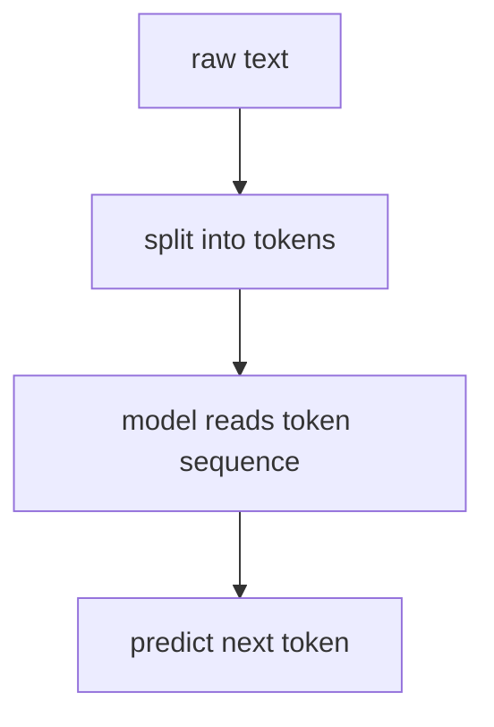
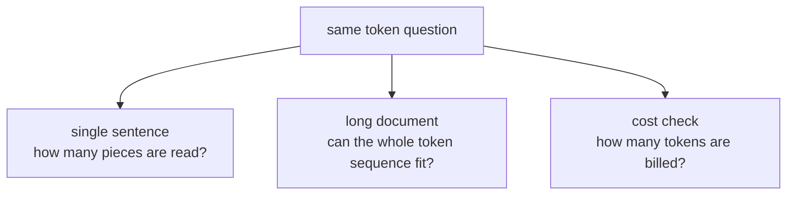

# P5-1.1 토큰(token)은 무엇인가

Part 4의 마지막에서는 생성 모델이 여러 후보 중 실제 출력을 선택하는 과정으로 샘플링(sampling)을 설명했습니다. 그러면 이제 LLM(large language model) 쪽에서는 더 구체적인 질문이 생깁니다.

그렇다면 모델은 텍스트를 정확히 무엇의 단위로 읽고, 무엇의 단위로 다음 출력을 고르는가?

이 절은 그 질문에 답합니다.

토큰(token)은 모델이 텍스트를 그대로 문장으로 읽지 않고, 내부 계산을 위해 나누어 다루는 입력과 출력의 기본 단위다.

## 이 절의 범위

이 절은 다음 질문에 답합니다.

- 토큰(token)은 글자(character), 단어(word), 문장(sentence)와 어떻게 다른가?
- 왜 LLM은 텍스트를 토큰 단위로 읽는가?
- 토큰은 입력 길이, 비용, 문맥 길이와 왜 연결되는가?
- 토큰 개념이 왜 Part 5 전체의 출발점이 되는가?

이 절에서는 다음 내용을 깊게 다루지 않습니다.

- 특정 토크나이저 알고리즘의 구현 세부
- BPE(Byte Pair Encoding)와 SentencePiece의 세부 비교
- 멀티모달 토큰 설계의 내부 구조

이 생략 항목 가운데 토크나이저 계열의 비교와 한국어를 포함한 분절 감각은 같은 장의 P5-1.3 보충학습에서 다시 회수합니다. 멀티모달 토큰의 내부 설계는 이 책의 현재 본편 범위를 넘어가므로, 여기서는 `텍스트를 계산 단위로 쪼갠다`는 공통 감각까지만 잡습니다.

이 절에서는 `토큰 수`, `context window`, `입력 길이`, `비용` 같은 말이 모두 무엇을 세는 단위인지 먼저 정확히 잡습니다.

지금 읽는 층위는 `계산 단위 층위`입니다. 앞 Part 4의 생성 구조 설명이 `다음 출력을 어떤 계산 흐름으로 고를까`를 다뤘다면, 여기서는 그 계산이 실제로 무엇을 한 조각씩 읽고 쓰는지 다룹니다. 바로 다음의 토큰화, context window, 임베딩, 프롬프트, RAG 절에서는 이 계산 단위가 실제 분절 방식, 길이 제한, 표현 학습, 검색 결합으로 어떻게 이어지는지 질문이 더 커집니다.

토큰은 Part 5 본류의 `계산 단위 손잡이`로 먼저 잡고, 그 다음에 어떤 시스템 층위가 더 붙는지까지 같이 보면 충분합니다.

| 지금 단계의 손잡이 | 바로 다음에 이어질 질문 | 뒤에서 본격적으로 다시 읽는 위치 |
| --- | --- | --- |
| 토큰(token) | 모델은 텍스트를 어떤 계산 조각으로 읽고 쓸 것인가? | P5-1.1 |
| 토큰화(tokenization) | 그 조각은 실제로 어떻게 잘리고 왜 언어마다 체감이 다른가? | P5-1.2, P5-1.3 |
| 문맥 길이와 비용 | 이 조각 수가 왜 길이 제한과 비용 판단으로 바로 이어지는가? | P5-3.2, P5-9.1, P5-10.1 |
| 임베딩과 검색 결합 | 이렇게 나뉜 조각이 어떻게 벡터 표현과 검색 입력으로 이어지는가? | P5-2.1, P5-10.1, P5-10.2 |

이 전환을 앞뒤 장과 한 번에 붙여 보면 다음처럼 읽는 편이 가장 안전합니다.

| 바로 앞 장 | 지금 장 | 바로 다음에 더 붙는 장 |
| --- | --- | --- |
| 생성 모델: 다음 출력을 어떤 계산 흐름으로 고를까 | 토큰: 그 계산이 실제로 무엇을 한 조각씩 읽고 쓸까 | 토큰화와 context window: 그 조각이 어떻게 잘리고 얼마나 유지될 수 있을까 |
| 생성 흐름 | 계산 단위 | 분절 방식과 길이 제한 |

즉, 지금 장의 핵심은 `어떻게 생성할까`에서 `무엇을 계산 단위로 삼아 생성할까`로 손잡이가 바뀐다는 점입니다.

## 이 절의 목표

- 토큰을 `모델이 텍스트를 계산하기 위해 쓰는 단위`로 설명할 수 있습니다.
- 단어 수와 토큰 수가 항상 같지 않다는 점을 이해할 수 있습니다.
- LLM의 입력 길이와 비용이 왜 토큰 기준으로 설명되는지 말할 수 있습니다.
- 다음 절의 토큰화(tokenization) 설명으로 자연스럽게 넘어갈 수 있습니다.

## 왜 텍스트를 그대로 넣지 않나

사람은 문장을 의미 단위로 자연스럽게 읽습니다. 하지만 모델은 텍스트를 그대로 `문장 전체`로 한 번에 이해하지 않습니다. 내부 계산을 위해서는 먼저 다룰 수 있는 작은 단위로 쪼개야 합니다.

이때 등장하는 것이 토큰(token)입니다.

다음처럼 이해하면 좋습니다.

`토큰은 사람이 읽는 자연스러운 단위와 꼭 같지 않아도 되지만, 모델이 반복 계산을 수행하기에 편한 단위다.`

## 토큰은 글자나 단어와 왜 다른가

토큰은 경우에 따라 다음과 비슷할 수 있습니다.

- 한 글자
- 한 단어
- 단어 일부
- 공백을 포함한 짧은 조각
- 구두점과 묶인 조각

예를 들어 영어에서는 흔한 단어 하나가 한 토큰처럼 처리될 수도 있지만, 드문 단어나 긴 조합은 여러 토큰으로 나뉠 수 있습니다. 한국어도 마찬가지로, 표면상 한 단어처럼 보여도 내부적으로는 여러 조각으로 쪼개질 수 있습니다.

즉, 토큰은 `언어학 수업의 단어 정의`와 같지 않습니다.

## 왜 이런 단위를 쓰는가

토큰 단위를 쓰면 모델은 다음과 같은 계산을 반복하기 쉬워집니다.

- 각 입력 조각을 숫자 ID로 바꾼다
- 그 ID를 임베딩(embedding) 벡터로 바꾼다
- 각 위치의 토큰 관계를 계산한다
- 다음 위치에 올 가능성이 큰 토큰을 고른다

즉, Part 4에서 본 Transformer와 생성 모델의 흐름은 결국 토큰 단위 반복 계산 위에서 실제로 작동합니다.

## 토큰이 비용과 길이에 왜 중요하나

LLM 서비스에서는 보통 다음 요소들이 토큰 기준으로 설명됩니다.

- 입력 길이
- 출력 길이
- 최대 문맥 길이(context window)
- API 사용 비용
- 응답 지연 시간(latency)

다음처럼 기억하면 충분합니다.

`LLM 서비스에서 텍스트의 크기를 재는 실무 단위는 글자 수보다 토큰 수인 경우가 많다.`

예를 들어 같은 길이의 두 문장이라도 토큰화 방식에 따라 토큰 수가 다를 수 있고, 그러면 비용과 문맥 사용량도 달라질 수 있습니다.

아주 작은 입력 예시로 줄이면 더 직관적입니다. 같은 `배송 지연 안내 답변` 작업이라도 입력이 어떻게 적히느냐에 따라 운영 감각이 먼저 달라집니다.

| 입력 장면 | 토큰 수 예시 | 바로 달라지는 판단 |
| --- | ---: | --- |
| 한 줄 질문만 있음 | 12 | 비용은 작고 응답도 빨리 끝날 가능성이 크다 |
| 질문 + 주문번호 + 규정 한 단락 | 45 | 비용이 늘지만 근거를 같이 넣을 여유가 아직 있다 |
| 질문 + 긴 대화 기록 + 규정 여러 단락 + 로그 | 180 | 비용이 커지고, 지연 시간이 늘고, 중요한 문맥을 줄여야 할 가능성이 커진다 |

이 표의 핵심은 `토큰 수가 많을수록 무조건 나쁘다`가 아닙니다. 대신 `같은 작업`이라도 토큰이 늘어나면 비용, 대기 시간, 남길 수 있는 문맥의 여유가 함께 바뀐다는 점을 먼저 잡아야 한다는 뜻입니다.

## 아주 단순하게 그리면



이 도식은 Part 5 전체의 가장 작은 출발점입니다.

## 사례로 보기

아래 도식은 이 절의 세 사례를 `문장이 몇 개인가`보다 `모델이 몇 개의 계산 조각으로 읽는가`라는 공통 질문으로 다시 묶은 것입니다.



이 도식에서 확인해야 할 점은 과업이 달라도 먼저 세는 단위가 같다는 것입니다. 모두 사람이 보는 `문장`이나 `문서 개수`보다, 모델이 실제로 읽는 `토큰 수`를 먼저 따져야 다음 판단이 가능해집니다.

### 사례 1. 같은 문장, 다른 계산 단위

사용자는 채팅창에 `오늘 날씨가 좋다`처럼 짧은 문장을 한 번에 입력합니다. 사람은 이것을 문장 하나로 읽고 `짧다`고 느끼기 쉽지만, 모델은 먼저 여러 토큰으로 잘라 순서대로 처리합니다. 예를 들어 같은 한 문장이라도 숫자, 기호, 영어가 섞이면 사람이 느끼는 길이와 모델이 처리하는 단위 수가 달라질 수 있습니다. 여기서 바뀌는 점은 `문장 하나`라는 감각보다 `몇 개의 계산 조각으로 나뉘는가`를 먼저 보게 된다는 것입니다. 그래서 화면에서는 한 줄짜리 요청처럼 보여도, 모델 입장에서는 `몇 개의 계산 조각을 차례로 읽어야 하는가`가 먼저 중요해집니다. 그래서 이 사례에서 확인해야 할 결과는 사람이 보기엔 비슷한 짧은 문장도 표기 방식에 따라 실제 계산 조각 수가 달라지는가입니다.

### 사례 2. 긴 문서 입력

사용자가 회의록 30쪽을 그대로 붙여 넣으면 사람은 `한 문서 전체를 읽어 달라`는 요청으로 이해합니다. 하지만 모델은 이 문서를 긴 토큰 시퀀스(sequence)로 받아들이므로, 앞부분과 뒷부분이 모두 한 번에 들어갈 수 있는지부터 따져야 합니다. 사람은 문서가 한 개라는 사실에 먼저 주목하기 쉽지만, 모델 쪽에서는 `문서 수`보다 `토큰 길이`가 먼저 제약이 됩니다. 예를 들어 문서가 한 파일뿐이어도 표, 숫자 목록, 부록이 많으면 토큰 수가 빠르게 늘어 마지막 결론 장이 통째로 잘릴 수 있습니다. 그러면 사용자는 `전체를 넣었는데 왜 결론을 놓쳤지?`라고 느끼게 됩니다. 토큰 한도를 넘기면 일부를 잘라 넣거나, 문서를 나누어 검색(RAG)한 뒤 필요한 부분만 다시 넣는 구조가 필요해집니다. 즉, 여기서 바뀌는 점은 `문서 한 개를 넣었다`는 감각보다 `끝까지 유지할 수 있는 토큰 길이인가`를 먼저 따지게 된다는 것입니다. 그래서 이 사례에서 확인해야 할 결과는 문서가 한 개냐 여러 개냐보다, 실제 토큰 길이 때문에 전체 입력 유지 여부와 이후 처리 방식이 달라지는가입니다.

### 사례 3. 비용 계산

운영자는 `공지 문구 두 문장뿐이니 비용도 거의 없겠지`라고 생각하기 쉽습니다. 그런데 숫자, 기호, 영어 제품명, 긴 URL이 섞이면 눈에 보이는 문장 수보다 토큰 수가 더 빠르게 늘 수 있습니다. 예를 들어 짧은 공지 두 줄이라도 링크와 제품 코드가 길게 붙으면 체감 길이보다 처리 단위가 훨씬 많아져, 같은 배너 알림을 수천 번 보내는 작업에서 비용 차이가 눈에 띄게 벌어질 수 있습니다. 여기서 바뀌는 점은 `문장이 몇 개인가`보다 `토큰이 몇 개인가`를 먼저 계산하게 된다는 것입니다. 실제 서비스 비용과 응답 길이 제한은 보통 토큰 기준으로 걸리므로, 실무에서는 `문장이 몇 개인가`보다 `토큰이 몇 개인가`를 먼저 확인하게 됩니다. 그래서 이 사례에서 확인해야 할 결과는 같은 문장 수라도 토큰 수 차이 때문에 실제 비용과 길이 제한 판단이 달라지는가입니다.

세 사례를 실제 판단 기준으로 다시 묶으면 다음과 같습니다.

| 상황 | 사람이 먼저 세기 쉬운 것 | 모델 쪽에서 먼저 보는 것 | 바로 달라지는 실무 판단 |
| --- | --- | --- | --- |
| 같은 짧은 문장 비교 | 문장 수, 글자 수 | 토큰 조각 수 | 요청이 정말 짧은지, 예상 비용이 맞는지 |
| 긴 문서 입력 | 파일 수, 페이지 수 | 전체 토큰 길이 | 통째 입력이 가능한지, 분할이나 RAG가 필요한지 |
| 비용 계산 | 메시지 개수, 화면 길이 | 입력·출력 토큰 수 | 예산 한도, 응답 길이 제한, 배치 처리 비용 |

## 실행 가능한 Python 예제로 보기

이번 예제의 목표는 `토큰은 단어 수 세기와 다르고, 모델은 결국 토큰 ID 시퀀스를 읽는다`는 점을 눈으로 확인하는 것입니다. 실제 서비스용 토크나이저 전체를 구현하지는 않지만, `긴 조각부터 찾는 간단한 longest-match` 방식으로도 핵심 감각은 잡을 수 있습니다. 여기에 아주 단순한 context budget 점검과 비용 추정까지 붙여, 토큰 수 차이가 왜 바로 운영 감각으로 이어지는지도 같이 봅니다.

입력:

- 세 개의 짧은 문장
- 미리 정한 조각 사전(vocabulary)

출력:

- 토큰 조각
- 각 조각에 대응하는 토큰 ID
- 토큰 수
- context budget 통과 여부
- 설명용 비용 추정

문제 상황:

- 토큰화는 글자를 자르는 일이 아니라 모델이 읽을 단위와 비용을 동시에 바꾸는 과정이라는 점을 직접 볼 필요가 있다

입력(input):

위에 정리한 어휘 집합 `VOCAB`, 예시 문장, context budget을 사용합니다.

확인할 개념:

- 토큰은 글자 수와 다를 수 있으며, 토큰화 방식이 context budget과 비용 추정에 직접 영향을 준다

```python
VOCAB = {
    "오늘": 101,
    "날씨": 102,
    "가": 103,
    "정말": 104,
    "좋": 105,
    "다": 106,
    "10:00": 107,
    "AM": 108,
    "회의": 109,
    "는": 110,
    "내일": 111,
    "시작": 112,
    "합니다": 113,
    ".": 114,
}


def toy_tokenize(text, vocab):
    pieces = []
    i = 0
    keys = sorted(vocab.keys(), key=len, reverse=True)

    while i < len(text):
        if text[i].isspace():
            i += 1
            continue

        matched = None
        for key in keys:
            if text.startswith(key, i):
                matched = key
                break

        if matched is None:
            matched = text[i]

        pieces.append(matched)
        i += len(matched)

    ids = [vocab.get(piece, 0) for piece in pieces]
    return pieces, ids


examples = [
    "오늘 날씨가 정말 좋다",
    "회의는 내일 시작합니다.",
    "회의는 내일 10:00 AM 시작합니다.",
    "회의는 내일 오전 10시에 시작합니다.",
]

price_per_token = 0.5  # 설명용 가상 비용
context_budget = 10    # 설명용 가상 토큰 한도

for text in examples:
    tokens, token_ids = toy_tokenize(text, VOCAB)
    estimated_cost = len(tokens) * price_per_token
    fits_budget = len(tokens) <= context_budget
    print("text      =", text)
    print("tokens    =", tokens)
    print("token_ids =", token_ids)
    print("count     =", len(tokens))
    print("fits_10   =", fits_budget)
    print("cost      =", estimated_cost)
    print("---")
```

실행 결과 예시는 다음처럼 읽을 수 있습니다.

```text
text      = 오늘 날씨가 정말 좋다
tokens    = ['오늘', '날씨', '가', '정말', '좋', '다']
token_ids = [101, 102, 103, 104, 105, 106]
count     = 6
fits_10   = True
cost      = 3.0
---
text      = 회의는 내일 시작합니다.
tokens    = ['회의', '는', '내일', '시작', '합니다', '.']
token_ids = [109, 110, 111, 112, 113, 114]
count     = 6
fits_10   = True
cost      = 3.0
---
text      = 회의는 내일 10:00 AM 시작합니다.
tokens    = ['회의', '는', '내일', '10:00', 'AM', '시작', '합니다', '.']
token_ids = [109, 110, 111, 107, 108, 112, 113, 114]
count     = 8
fits_10   = True
cost      = 4.0
---
text      = 회의는 내일 오전 10시에 시작합니다.
tokens    = ['회의', '는', '내일', '오', '전', '1', '0', '시', '에', '시작', '합니다', '.']
token_ids = [109, 110, 111, 0, 0, 0, 0, 0, 0, 112, 113, 114]
count     = 12
fits_10   = False
cost      = 6.0
---
```

이 예제에서 확인해야 할 핵심은 다음입니다.

- 사람은 `좋다`를 한 단어처럼 읽어도 모델 쪽에서는 `좋`과 `다`처럼 더 잘게 나눌 수 있습니다.
- 사람은 문장을 읽지만, 모델은 결국 `[101, 102, 103, ...]` 같은 토큰 ID 시퀀스를 계산에 넣습니다.
- 숫자와 영어가 섞인 `10:00 AM`처럼 표기 방식이 바뀌면 토큰 수가 바로 달라질 수 있습니다.
- 사람이 보기엔 둘 다 일정 안내 한 줄이어도 `10:00 AM`과 `오전 10시`는 토큰 수가 8개와 12개로 달라질 수 있습니다.
- 이 차이는 같은 뜻의 문장이라도 입력 길이, context budget 통과 여부, 비용 추정이 바로 달라질 수 있음을 보여 줍니다.

## 이 예제를 운영 판단으로 다시 읽으면

위 결과를 실무 질문으로 다시 바꾸면 더 분명해집니다.

| 문장 | 토큰 수 | 10토큰 한도 통과 | 바로 생기는 판단 |
| --- | --- | --- | --- |
| `회의는 내일 시작합니다.` | 6 | 통과 | 그대로 넣어도 된다 |
| `회의는 내일 10:00 AM 시작합니다.` | 8 | 통과 | 아직 짧지만 숫자·영문 표기 비용은 늘었다 |
| `회의는 내일 오전 10시에 시작합니다.` | 12 | 초과 | 한 줄처럼 보여도 잘라 넣거나 줄여야 할 수 있다 |

즉, 사람 눈에는 모두 `짧은 일정 안내`일 수 있지만, 모델 쪽에서는 벌써 다른 길이와 다른 예산 문제로 읽힙니다. 이 감각이 있어야 다음 절 P5-1.2에서 토큰화가 실제 비용, chunking, 문맥 유지에 어떤 영향을 주는지 더 자연스럽게 이어집니다.

## 이 예제를 계산 단위 관점으로 다시 보면

앞의 예제는 실제 서비스용 토크나이저 전체를 재현한 것이 아니라, 사람이 문장 하나로 보는 입력이 모델 쪽에서는 먼저 `조각 -> ID 시퀀스`로 바뀐다는 점을 가장 작게 보여 주는 장면입니다. 여기서 중요한 것은 특정 사전이 정답이라는 뜻이 아니라, 이후 길이 제한, 비용, 생성 단위 설명이 모두 이런 토큰 시퀀스 위에 올라간다는 점입니다.

실제 토큰화는 다음 절 P5-1.2에서 더 직접적으로 다룹니다.

토큰이라는 말은 LLM 시대에 갑자기 생긴 것이 아닙니다. 자연어 처리(natural language processing)에서는 오래전부터 텍스트를 어떤 단위로 나눌지, 단어(word)와 형태소(morpheme), 서브워드(subword)를 어떻게 처리할지가 중요한 문제였습니다.

다만 LLM 시대에는 이 문제가 더 실무적으로 크게 드러났습니다.

- 입력 길이 제한이 토큰으로 설명되고
- 비용이 토큰 단위로 책정되며
- 생성이 다음 토큰 예측으로 이해되기 때문입니다

커리큘럼 관점에서 이 절은 Part 5의 가장 중요한 입구입니다. 토큰을 이해하지 못하면 임베딩, context window, prompt, RAG, 비용 계산을 모두 흐릿하게 이해하게 됩니다.

## 다음 절과의 연결

여기까지 오면 다음 질문이 바로 남습니다.

- 텍스트는 실제로 어떤 규칙으로 토큰으로 나뉘는가?
- 왜 같은 문장도 토큰 수가 달라질 수 있는가?
- 한국어와 영어에서 토큰 길이 감각이 왜 다르게 느껴질 수 있는가?

이 질문은 P5-1.2 토큰화(tokenization)의 실제 영향으로 이어집니다.

## 이 절에서 기억할 관점

- 토큰은 모델이 텍스트를 계산하기 위해 사용하는 기본 단위입니다.
- 토큰은 단어와 항상 같지 않습니다.
- 입력 길이, 비용, 문맥 길이는 보통 토큰 기준으로 설명됩니다.
- 토큰 개념은 Part 5 전체의 출발점입니다.

## 체크리스트

- 토큰을 글자나 단어와 구분해 설명할 수 있는가?
- 왜 LLM이 토큰 단위를 쓰는지 말할 수 있는가?
- 비용과 문맥 길이가 왜 토큰 기준으로 설명되는지 말할 수 있는가?
- 다음 절의 토큰화 설명으로 왜 이어지는지 설명할 수 있는가?

## 출처와 참고 자료

- Daniel Jurafsky, James H. Martin, `Speech and Language Processing` draft materials, 확인 날짜: 2026-06-29.
- Christopher D. Manning, Hinrich Schutze, `Foundations of Statistical Natural Language Processing`, MIT Press, 1999, 확인 날짜: 2026-06-29.
- OpenAI API Docs, 토큰 관련 설명, 확인 날짜: 2026-06-29. [https://platform.openai.com/docs](https://platform.openai.com/docs){: target="_blank" rel="noopener noreferrer" }
