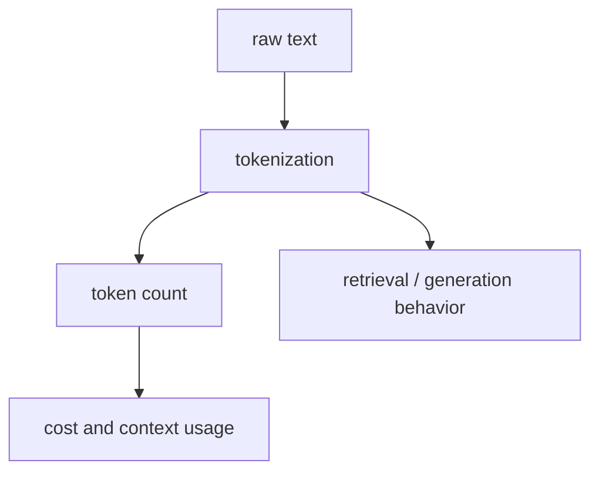

# P5-1.2 토큰화(tokenization)의 실제 영향

P5-1.1에서는 토큰(token)을 모델이 텍스트를 계산하기 위해 사용하는 기본 단위라고 설명했습니다. 이제 다음 질문이 생깁니다.

텍스트를 어떤 규칙으로 토큰으로 나누느냐가 실제로 왜 중요한가?

이 절은 그 질문에 답합니다.

토큰화(tokenization)는 텍스트를 모델 계산 단위로 바꾸는 절차이며, 이 절차가 입력 길이, 비용, 문맥 사용량, 검색 품질, 생성 결과 해석에 실제 영향을 준다.

## 이 절의 범위

이 절은 다음 질문에 답합니다.

- 토큰화는 무엇을 하는 절차인가?
- 왜 같은 문장도 토큰 수가 다르게 나올 수 있는가?
- 토큰화가 비용, 문맥 길이, 검색, 생성에 어떤 실제 영향을 주는가?
- 한국어 사용자에게 토큰 감각이 왜 더 생소할 수 있는가?

이 절에서는 다음 내용을 깊게 다루지 않습니다.

- BPE, WordPiece, SentencePiece의 세부 알고리즘 비교
- 멀티링구얼 토크나이저의 학습 절차
- tokenizer vocabulary 설계 최적화

이 항목들은 같은 장의 P5-1.3 보충학습에서 `대표 토크나이저가 무엇을 다르게 자르는가`라는 관점으로 다시 묶어 설명합니다. 다만 vocabulary 최적화의 세부 구현과 학습 절차 전부를 따라가지는 않고, 처음 읽는 독자가 토큰화 차이를 읽는 데 필요한 수준까지만 다룹니다.

이 절의 목적은 독자가 `토큰화는 내부 구현 문제`라고 넘기지 않고, 실무와 학습 경험에 직접 연결되는 주제로 읽게 하는 데 있습니다.

## 이 절의 목표

- 토큰화를 `원문 텍스트를 모델 계산 단위로 바꾸는 절차`로 설명할 수 있습니다.
- 같은 텍스트라도 토큰 수가 달라질 수 있는 이유를 말할 수 있습니다.
- 토큰화가 비용, context window, RAG 품질에 영향을 준다는 점을 설명할 수 있습니다.
- 이후 장의 임베딩, 프롬프트, RAG 설명을 더 구체적으로 읽을 수 있습니다.

## 토큰화는 무엇을 하나

토큰화(tokenization)는 원문 문자열(raw text)을 모델이 다룰 수 있는 토큰 시퀀스(sequence)로 바꾸는 절차입니다.

이 절차는 단순히 `띄어쓰기 기준으로 자르기`보다 더 복잡할 수 있습니다.

- 자주 나오는 조각은 하나로 묶일 수 있고
- 드문 표현은 더 잘게 쪼개질 수 있으며
- 숫자, 기호, 공백, 문장부호도 별도 처리될 수 있습니다

즉, 토큰화는 단순 분리 작업이 아니라 `모델이 언어를 어떤 계산 단위로 볼 것인가`를 결정하는 전처리 단계입니다.

## 왜 같은 문장도 토큰 수가 달라질 수 있나

같은 의미의 문장이라도 표기 방식이 조금만 달라져도 토큰 수가 달라질 수 있습니다.

예를 들어:

- 줄임말 사용
- 숫자 표기 방식
- 특수문자 포함 여부
- 영어와 한국어 혼용

같은 내용이어도 모델 입장에서는 다른 토큰 조합으로 읽힐 수 있습니다.

이 때문에 사용자는 `문장이 짧아 보이는데 왜 토큰 수가 많지?`라는 경험을 자주 하게 됩니다.

## 실제 영향 1. 비용과 문맥 길이

LLM 서비스에서는 토큰화가 곧 비용과 연결됩니다.

- 같은 길이처럼 보이는 두 입력도 토큰 수가 다를 수 있고
- 출력 역시 어떤 표현을 쓰느냐에 따라 토큰 수가 달라질 수 있습니다

또한 context window는 문장 수가 아니라 토큰 수 기준으로 차기 때문에, 긴 문서를 다룰 때는 토큰화 감각이 필수입니다.

다음처럼 기억하면 좋습니다.

`토큰화는 단지 텍스트를 자르는 일이 아니라, 실제로 얼마만큼의 입력 공간과 비용을 쓰는지 결정하는 절차다.`

## 실제 영향 2. 검색과 RAG

토큰화는 RAG(retrieval-augmented generation)에도 영향을 줍니다.

- 문서를 어떤 길이의 청크(chunk)로 나눌지
- 검색 결과를 얼마나 많이 넣을지
- 검색된 문맥이 잘리지 않고 핵심을 유지하는지

이 모두가 토큰 길이 감각과 연결됩니다.

즉, 토큰화는 모델 내부 문제이면서 동시에 서비스 설계 문제이기도 합니다.

## 실제 영향 3. 생성 결과 해석

생성은 보통 다음 토큰 예측(next-token prediction)으로 설명됩니다. 그러므로 토큰화 방식은 생성 과정 자체를 바꿀 수 있습니다.

예를 들어:

- 어떤 표현은 하나의 토큰처럼 잘 이어질 수 있고
- 어떤 표현은 잘게 나뉘어 더 길고 복잡한 생성 경로를 만들 수 있습니다

이 차이는 응답 길이, 반복, 문장 스타일에도 간접적으로 영향을 줄 수 있습니다.

## 한국어 사용자에게 왜 더 생소할 수 있나

영어권 예시는 종종 단어와 토큰이 어느 정도 비슷해 보이는 경우가 있습니다. 하지만 한국어는 조사, 어미, 복합어, 띄어쓰기 변형 때문에 토큰 감각이 더 낯설게 느껴질 수 있습니다.

다음 정도로 잡으면 충분합니다.

`한국어에서는 사람이 느끼는 단어 경계와 모델이 계산하는 토큰 경계가 더 어긋나 보일 수 있다.`

이 때문에 한국어 사용자는 토큰 수 예측을 더 직관적으로 하기 어려울 수 있습니다.

## 아주 단순하게 그리면



이 도식에서 확인해야 할 결과는 같은 문장이라도 토큰 경계가 달라지면 비용 계산, 청크 분할, 응답 길이 제한 같은 서비스 동작 기준도 함께 달라진다는 점입니다.

## 사례로 보기

### 사례 1. 짧은 문장인데 비용이 예상보다 큼

사용자가 `회의는 내일 10:00 AM, Zoom 링크는 mail@example.com으로 보냈어요` 같은 짧은 문장을 넣는 장면을 생각해 보겠습니다. 사람은 보통 화면에 보이는 글자 수가 적으면 `짧으니 비용도 적겠지`라고 먼저 짐작합니다. 하지만 숫자, 특수문자, 영어 표기, 이메일 주소가 섞이면 실제 토큰 수는 기대보다 더 늘 수 있습니다. 예를 들어 운영팀이 `짧은 문의 100건이면 충분히 예산 안에 들어가겠다`고 계산했는데, 이런 표기가 많은 문의가 몰리면 예상보다 빨리 비용 한도에 닿을 수 있습니다. 모델은 글자 모양이 아니라 토큰 조각 단위로 계산하므로, 짧아 보이는 문장도 내부 기준에서는 더 비쌀 수 있습니다. 그래서 독자가 확인해야 할 결과는 화면 길이보다 실제 토큰 수와 비용이 더 빨리 커지는가입니다.

### 사례 2. 문서 검색 청크 크기 조정

RAG에서 사내 규정 문서를 조각내어 넣는다고 해 봅시다. 사람이 문서를 나눌 때는 보통 `문단 두세 개면 적당하겠지`처럼 문장 수나 눈대중 길이로 먼저 판단합니다. 그런데 너무 길게 자르면 한 조각이 context window를 빨리 소모하고, 너무 짧게 자르면 `원칙` 문단과 `예외` 문단이 서로 다른 조각으로 갈라져 검색 때 따로 떨어질 수 있습니다. 예를 들어 `연차는 3일 전 신청`이라는 원칙과 `긴급 병가는 사후 보고 가능`이라는 예외가 분리되면, 검색은 원칙만 가져오고 중요한 예외를 놓칠 수 있습니다. 이때 실제 판단 기준은 단순 문장 개수보다 `한 조각이 몇 토큰을 차지하는가`, 그리고 중요한 문맥을 함께 묶어 둘 수 있는가에 더 가깝습니다. 그래서 확인 가능한 결과는 청크를 나눈 뒤 원칙과 예외가 함께 검색되는가, 아니면 따로 떨어져 누락되는가입니다.

### 사례 3. 응답 길이 제한

같은 질문이라도 답변 형식이 달라지면 토큰 사용량이 크게 달라질 수 있습니다. 사람은 짧은 문단 하나면 될 답에 표, 목록, 코드 블록까지 붙이면 더 친절해졌다고 느끼기 쉽습니다. 하지만 서비스 운영에서는 `친절한 형식`이 곧 더 긴 출력 예산을 뜻합니다. 예를 들어 배송 지연 안내 한 문단이면 끝날 답에 표와 주의사항 목록을 계속 붙이면, 마지막 환불 조건 문장이 잘린 채 응답이 끊길 수 있습니다. 그래서 운영자는 `몇 줄이 보기 좋은가`보다 `중요한 마지막 문장까지 남길 만큼 최대 몇 토큰을 허용할 것인가`를 먼저 정해야 합니다. 그래서 독자가 확인해야 할 결과는 형식을 늘렸을 때 마지막 핵심 문장이 실제로 잘리지 않고 남는가입니다.

## 작은 Python 예제로 보기

이번 예제의 목표는 실제 LLM 토크나이저 구현이 아니라, 표기 방식이 달라질 때 단순 분리 결과도 달라질 수 있다는 점을 눈으로 확인하는 것입니다.

입력:

- 비슷한 의미의 세 문장

출력:

- 공백 기준 분리 결과
- 각 문장의 조각 개수

```python
examples = [
    "회의는 내일 오전 10시에 시작합니다.",
    "회의는 내일 오전10시에 시작합니다.",
    "회의는 내일 10:00 AM에 시작합니다.",
]

for text in examples:
    pieces = text.split()
    print(text)
    print("pieces =", pieces)
    print("count =", len(pieces))
    print("---")
```

실행 결과 예시는 다음처럼 읽을 수 있습니다.

```text
회의는 내일 오전 10시에 시작합니다.
pieces = ['회의는', '내일', '오전', '10시에', '시작합니다.']
count = 5
---
회의는 내일 오전10시에 시작합니다.
pieces = ['회의는', '내일', '오전10시에', '시작합니다.']
count = 4
---
회의는 내일 10:00 AM에 시작합니다.
pieces = ['회의는', '내일', '10:00', 'AM에', '시작합니다.']
count = 5
---
```

그래서 이 예제에서 확인해야 할 결과는 같은 뜻의 문장이라도 표기 방식이 달라지면 계산 단위로 끊기는 감각 역시 달라질 수 있다는 점입니다.

## 역사와 커리큘럼 관점

자연어 처리의 역사에서는 텍스트를 어떤 단위로 나눌지가 오래된 주제였습니다. 초기에는 단어 사전 기반 접근이 강했고, 이후에는 희귀 단어 처리와 다국어 처리를 위해 subword 단위가 널리 쓰이게 되었습니다.

LLM 시대에는 이 문제가 더 실무적으로 중요해졌습니다.

- 모델 입력 길이가 토큰 기준으로 제한되고
- 비용이 토큰 기준으로 계산되며
- 다음 토큰 예측이 생성 구조의 핵심이 되었기 때문입니다

커리큘럼 관점에서 이 절은 단순 전처리 설명이 아닙니다. 뒤에서 나올 임베딩, context window, prompt, RAG, tool use를 모두 더 정확하게 이해하기 위한 기초 절입니다.

## 다음 장과의 연결

여기까지 오면 다음 질문이 생깁니다.

- 토큰으로 나뉜 입력은 모델 안에서 어떤 숫자 표현으로 바뀌는가?
- `비슷한 의미가 가까운 벡터가 된다`는 말은 어떤 직관으로 설명할 수 있는가?

이 질문은 다음 장 P5-2.1 임베딩(embedding)의 직관으로 이어집니다.

## 이 절에서 기억할 관점

- 토큰화는 원문 텍스트를 모델 계산 단위로 바꾸는 절차입니다.
- 같은 텍스트도 표기 방식에 따라 토큰 수가 달라질 수 있습니다.
- 토큰화는 비용, 문맥 길이, 검색, 생성 결과 해석에 실제 영향을 줍니다.
- 이 절은 Part 5의 임베딩, 프롬프트, RAG 설명을 위한 기초입니다.

## 체크리스트

- 토큰화가 무엇을 하는 절차인지 설명할 수 있는가?
- 왜 같은 문장도 토큰 수가 달라질 수 있는지 말할 수 있는가?
- 토큰화가 비용과 context window에 왜 중요한지 설명할 수 있는가?
- RAG와 생성 품질에도 영향이 있다는 점을 말할 수 있는가?

## 출처와 참고 자료

- Daniel Jurafsky, James H. Martin, `Speech and Language Processing` draft materials, 확인 날짜: 2026-06-29.
- Rico Sennrich, Barry Haddow, Alexandra Birch, `Neural Machine Translation of Rare Words with Subword Units`, ACL 2016, 확인 날짜: 2026-06-29.
- OpenAI API Docs, 토큰 관련 설명, 확인 날짜: 2026-06-29. [https://platform.openai.com/docs](https://platform.openai.com/docs){: target="_blank" rel="noopener noreferrer" }
