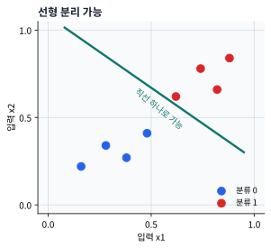
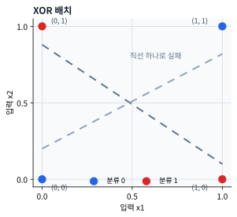

# P5-1.2 선형 결합과 활성화

Section ID: `P5-1.2`
Version: `v2026.07.17`

P5-1.1에서는 퍼셉트론(perceptron)을 `입력(input) -> 가중치(weight) -> 합(sum) -> 출력(output)` 흐름으로 보았습니다. 이제는 입력들을 가중합으로 묶는다는 것이 정확히 무엇을 뜻하는지, 그리고 왜 그 합만으로는 딥러닝이 되지 않는지를 바로 이어서 봅니다. 퍼셉트론은 먼저 입력들의 선형 결합(linear combination)을 만들고, 그 결과를 활성화(activation) 규칙에 통과시켜 판단을 만듭니다.

활성화의 기본 뜻이 뒤 절에서 다시 흐려지면 개념사전의 [활성화 함수(activation function)](../../../reference/concept-glossary.md#activation-function) 항목을 먼저 다시 봅니다.

## 이 절의 범위

이 절은 다음 질문을 정리합니다.

- 선형 결합(linear combination)은 무엇을 뜻하는가?
- 퍼셉트론이 판단 경계(decision boundary)를 만든다는 말은 무엇인가?
- 활성화(activation)는 왜 필요한가?
- 퍼셉트론 하나의 표현 한계는 어디에서 나타나는가?
- 왜 다음 장에서 다층 신경망(multilayer neural network)이 필요해지는가?

다층 구조와 퍼셉트론 하나의 한계는 P5-2.1, P5-2.2에서 이어서 다루고, sigmoid, tanh, ReLU의 비교는 P5-3.1부터 P5-3.5까지 다시 봅니다. 역전파(backpropagation)의 계산 절차는 P5-5.1, P5-5.2에서 다시 연결합니다. 즉, 이번 절은 선형 결합과 활성화가 왜 `퍼셉트론 하나의 경계`를 만들고, 왜 다음 장의 다층 구조 질문으로 이어지는지 먼저 닫습니다.

## 이 절의 목표

- 선형 결합을 `입력마다 비중을 주어 하나의 점수로 모으는 계산`으로 설명할 수 있습니다.
- 퍼셉트론이 선형 경계(linear boundary)를 만든다는 점을 말할 수 있습니다.
- 활성화가 단순한 합을 판단으로 바꾸는 단계라는 점을 이해할 수 있습니다.
- 퍼셉트론 하나만으로는 표현이 어려운 문제가 있다는 점을 설명할 수 있습니다.
- 다층 구조가 왜 필요한지 직관적으로 이어 말할 수 있습니다.

## 선형 결합은 무엇을 하고 있나

Part 4의 선형회귀(linear regression)와 로지스틱 회귀(logistic regression)에서도 보았듯, 여러 입력을 한 번에 다룰 때 가장 먼저 하는 일은 `각 입력에 비중을 주어 합치는 것`입니다.

이를 선형 결합(linear combination)이라고 부릅니다.

아주 짧게 쓰면 다음과 같습니다.

\[
z = w_1 x_1 + w_2 x_2 + w_3 x_3 + b
\]

이 식은 다음처럼 읽으면 됩니다.

- \(x_1, x_2, x_3\): 입력값
- \(w_1, w_2, w_3\): 각 입력의 중요도
- \(b\): 기준선을 옮기는 값
- \(z\): 모든 입력 신호를 모아 만든 중간 점수

즉, 퍼셉트론은 처음부터 `판단`을 만드는 것이 아니라, 먼저 `판단에 쓸 점수`를 하나 만듭니다.

## 왜 점수로 먼저 모으는가

입력이 여러 개일 때는 신호가 서로 충돌할 수 있습니다.

- 어떤 입력은 긍정 신호일 수 있습니다.
- 어떤 입력은 부정 신호일 수 있습니다.
- 어떤 입력은 매우 강한 신호일 수 있고
- 어떤 입력은 약한 보조 신호일 수 있습니다.

선형 결합은 이들을 한 줄의 점수로 압축합니다.

예를 들어 설비 정비 작업 재개 여부를 아주 단순화해 생각할 수 있습니다. 사람은 먼저 `격리 밸브 확인이 끝났는가`, `잔류 가스 경보가 남아 있는가`, `작업 허가서가 최종 승인되었는가` 같은 조건을 함께 보고 전체 인상을 만듭니다. 하지만 이 조건들은 서로 방향이 다르고 강도도 다릅니다. 사람이 머릿속으로만 판단하면 `어느 조건이 얼마나 크게 작용했는가`를 분리해 보기 어렵습니다. 선형 결합은 이런 서로 다른 신호를 하나의 점수 축으로 모아, 지금 작업이 재개 쪽에 더 가까운지 보류 쪽에 더 가까운지 읽기 시작하게 만듭니다. 여기서 바뀌는 점은 여러 조건을 따로 기억하는 것에서 `하나의 점수 축으로 압축해 비교하는 것`으로 판단 방식이 정리된다는 점입니다.

| 입력 | 의미 | 가중치 역할 |
| --- | --- | --- |
| 격리 밸브 확인 | 안전 조건이 충족될수록 유리 | 양수 가중치 |
| 잔류 가스 경보 | 남아 있을수록 불리 | 음수 가중치 |
| 작업 허가서 승인 | 완료되면 유리 | 양수 가중치 |

이처럼 퍼셉트론은 여러 입력 조건을 각각 따로 외우는 대신, 하나의 축 위로 모아 판단하기 시작합니다.

같은 장면을 다시 읽으면 차이는 절차에서 드러납니다. 먼저 조건을 각각 확인하고, 각 조건이 재개 쪽인지 보류 쪽인지 방향을 붙입니다. 그다음 가중치 크기로 영향의 세기를 조정하고, 마지막에는 모든 신호가 한 점수 축에서 경계 쪽으로 얼마나 움직였는지를 봅니다. 그래서 선형 결합 관점에서는 `조건을 몇 개 봤는가`보다 `각 조건이 점수를 어느 방향으로 얼마나 밀었는가`가 더 중요해집니다.

## 퍼셉트론은 선형 경계를 만든다

퍼셉트론이 입력을 선형 결합으로 읽는다는 말은, 결국 데이터를 한 직선(line)이나 한 평면(plane), 또는 더 일반적으로는 초평면(hyperplane)으로 나누는 판단과 연결된다는 뜻입니다.

다음 문장으로 기억합니다.

`퍼셉트론 하나는 입력 공간을 한 번에 하나의 직선 또는 평면 기준으로 나누는 판단기다.`

2차원 예시를 아주 단순하게 그리면 다음과 같습니다.

```mermaid
--8<-- "assets/part-05/chapter-01/linear-boundary-flow-ko.mmd"
```

이 도식에서 확인해야 할 결과는 퍼셉트론 하나가 여러 입력을 하나의 점수 축으로 모은 뒤, 그 점수를 기준으로 입력을 경계 양쪽으로 가르는 구조라는 점입니다.

이 도식의 핵심은 퍼셉트론이 복잡한 굴곡 경계가 아니라, 한 번에 하나의 선형 경계만 만든다는 점입니다.

점 배치로 보면 이 한계가 더 직접 보입니다. 직선 하나로 나뉘는 패턴은 퍼셉트론 하나로 설명하기 쉽지만, XOR처럼 같은 출력이 대각선에 놓인 패턴은 직선 하나로 깔끔하게 가르기 어렵습니다.





이 두 그래프는 XOR를 새로 설명하려는 그림이 아니라, `선형 경계 하나`라는 말이 실제 입력 공간에서 무엇을 뜻하는지 고정하기 위한 그림입니다. 첫 그림은 직선 하나가 실제로 어떻게 두 클래스를 가르는지 보여 주고, 둘째 그림은 규칙 문장이 짧아도 점 배치가 직선 하나로 나뉘지 않으면 퍼셉트론 하나에는 어렵다는 점을 따로 보여 줍니다.

## 활성화는 왜 필요한가

선형 결합만 보면 아직 결과는 단순한 숫자 \(z\)입니다. 하지만 우리는 보통 다음 중 하나를 원합니다.

- 0인가 1인가
- 승인인가 거절인가
- 반응하는가 반응하지 않는가

이렇게 점수를 실제 판단으로 바꾸는 단계가 활성화(activation)입니다.

초기 퍼셉트론에서는 흔히 임계값(threshold) 규칙으로 설명합니다.

- 점수가 기준보다 크면 1
- 아니면 0

즉, 활성화는 `계산된 점수를 출력 규칙으로 바꾸는 단계`입니다.

```mermaid
--8<-- "assets/part-05/chapter-01/activation-threshold-flow-ko.mmd"
```

이 도식에서 확인해야 할 결과는 점수 `z`를 만드는 단계와 그 점수를 실제 출력 0 또는 1 같은 판단으로 바꾸는 단계가 서로 다르다는 점입니다. 그래서 퍼셉트론은 단순 `합산기`가 아니라 `합산 + 결정` 단위로 이해해야 합니다.

이 구조 때문에 퍼셉트론은 단순한 합산기가 아니라, `합산 + 판단` 단위가 됩니다.

## 사례 및 예시

### 사례 1. 정비 작업 재개 점수

정비 작업 재개 판단을 아주 단순화해 생각해 보겠습니다. 사람은 먼저 `격리 밸브 확인`, `잔류 가스 경보`, `작업 허가서 승인` 같은 조건을 함께 보고 전체 인상을 만듭니다. 하지만 이 조건들은 서로 방향이 다르고 강도도 다릅니다. 격리 밸브 확인과 허가서 승인은 재개 쪽으로 밀어 주고, 잔류 가스 경보는 반대 방향으로 강하게 작용할 수 있습니다. 선형 결합은 바로 이런 서로 다른 신호를 하나의 점수 축으로 모아, 지금 작업이 재개에 더 가까운지 보류에 더 가까운지 읽기 시작하게 만듭니다. 그래서 이 사례에서 확인해야 할 결과는 조건을 따로 보는 것이 아니라, 여러 신호가 하나의 점수 축으로 모였을 때 재개 쪽과 보류 쪽이 실제로 더 잘 비교되는가입니다.

| 작업 장면 | 격리 밸브 확인 기여 | 잔류 가스 경보 기여 | 작업 허가서 기여 | 합산 점수 해석 |
| --- | --- | --- | --- | --- |
| A | `+0.9` | `0.0` | `+0.5` | 재개 쪽으로 기운다 |
| B | `+0.9` | `-1.2` | `+0.5` | 보류 쪽으로 밀린다 |

이 짧은 예시에서 중요한 것은 각 조건을 따로 결론으로 쓰지 않고, 모든 신호를 합산 점수 하나로 읽기 시작한다는 점입니다.

장면 A는 안전 확인과 허가 승인 신호가 보류 신호보다 더 크게 작용해 재개 쪽으로 기웁니다. 장면 B는 몇 항목이 괜찮아 보여도, 잔류 가스 경보의 음수 기여가 다른 승인 신호를 눌러 보류 쪽으로 이동합니다. 여기서 선형 결합이 도와주는 일은 두 장면의 인상을 나열하는 것이 아니라, 어떤 입력이 경계를 실제로 밀었는지 분리해 보는 것입니다.

### 사례 2. 자동 차단 임계값 판단

같은 점수라도 바로 작업 지시로 쓰지는 않을 수 있습니다. 예를 들어 자동 차단 시스템이 `z > 0.5`이면 즉시 차단 유지, 아니면 현장 재확인으로 넘긴다고 해 보겠습니다. 사람은 점수가 1.4이든 0.6이든 둘 다 `차단 쪽`으로 읽고, 0.2와 -0.3은 모두 `재확인 쪽`으로 읽을 수 있습니다. 이때 활성화는 연속적인 점수를 실제 판단 규칙으로 바꾸는 단계입니다. 즉, 선형 결합이 `얼마나 차단 쪽인가`를 점수로 모은다면, 활성화는 그 점수를 바탕으로 `그래서 자동 차단 유지인가 아닌가`를 닫는 역할을 합니다. 그래서 이 사례에서 확인해야 할 결과는 비슷한 방향의 점수들이 실제 운영 판단에서는 같은 쪽 결정으로 묶이는가입니다.

| 점수 `z` | 활성화 전 해석 | 임계값 적용 후 |
| --- | --- | --- |
| 1.4 | 강한 차단 유지 신호 | 차단 유지 |
| 0.6 | 약한 차단 유지 신호 | 차단 유지 |
| 0.2 | 경계 아래 재확인 신호 | 재확인 |

여기서 확인해야 할 결과는 점수의 크기 차이와 최종 결정 규칙이 같은 것이 아니라는 점입니다. 선형 결합은 방향과 강도를 만들고, 활성화는 그 점수를 실제 출력 범주로 접습니다.

활성화 관점에서는 1.4와 0.6이 모두 차단 유지로 닫히더라도 같은 신호가 아닙니다. 1.4는 강한 차단 신호이고, 0.6은 임계값을 조금 넘은 약한 차단 신호입니다. 반대로 0.2는 양수라서 차단 쪽처럼 느껴질 수 있지만, 임계값 0.5를 넘지 못하면 최종 출력에서는 재확인 쪽으로 접힙니다. 점수는 연속값이고, 결정은 그 점수를 기준에 따라 접은 결과입니다.

두 사례를 함께 놓고 보면, 퍼셉트론 하나가 실제로 바꾸는 것은 `조건 목록`을 `점수 축과 경계 판단`으로 다시 읽게 만드는 방식입니다.

정비 작업 재개 사례에서는 양수/음수 기여도의 합이 재개와 보류 사이의 위치를 만듭니다. 자동 차단 사례에서는 점수 `z`가 임계값 `0.5`를 넘는지 여부가 최종 출력을 닫습니다. 두 사례에서 독자가 먼저 붙잡아야 할 결과는, 퍼셉트론의 핵심이 `조건을 많이 본다`가 아니라 `조건을 한 점수 축으로 모은 뒤 그 점수가 경계를 넘는지 본다`는 점입니다.

## 왜 선형 결합만 반복하면 부족한가

여기서 중요한 딥러닝 직관이 하나 나옵니다.

`선형 결합만 여러 번 해도, 여전히 전체는 선형 결합으로 접힐 수 있다.`

여기서는 이것을 아주 엄밀하게 증명할 필요는 없습니다. 다만 `직선 하나로 나뉘는 문제`와 `여러 꺾인 경계가 필요한 문제`를 구분하는 감각은 먼저 잡아야 합니다.

- 직선 하나로 나눌 수 있는 문제는 퍼셉트론 하나로 비교적 잘 표현됩니다.
- 하지만 구부러진 경계, 여러 조각으로 나뉜 경계, 조건이 얽힌 문제는 퍼셉트론 하나로 어렵습니다.

즉, 딥러닝이 깊어지는 이유 중 하나는 `더 복잡한 경계와 표현`이 필요하기 때문입니다.

## XOR가 왜 자주 등장하나

퍼셉트론의 한계를 설명할 때 XOR 문제가 자주 등장합니다. 이유는 간단합니다.

XOR는 입력 두 개가 `다를 때만 1`이 되는 규칙입니다.

| x1 | x2 | XOR 출력 |
| --- | --- | --- |
| 0 | 0 | 0 |
| 0 | 1 | 1 |
| 1 | 0 | 1 |
| 1 | 1 | 0 |

사람은 이 표를 보면 `규칙이 단순하니 직선 하나로도 나뉘지 않을까`라고 먼저 생각하기 쉽습니다. 하지만 실제 배치를 점으로 놓아 보면, 1이 되어야 하는 두 점이 대각선으로 떨어져 있어 한 직선으로 깔끔하게 둘로 나누기 어렵습니다. 즉, 퍼셉트론 하나가 만드는 단일 선형 경계로는 잘 표현되지 않는 대표 사례입니다. 사람이 보던 기준은 `규칙 설명이 짧은가`였지만, 모델 입장에서 더 중요한 기준은 `한 직선으로 나눌 수 있는가`입니다. 이 차이 때문에 규칙은 단순해 보여도 표현은 어려운 문제가 생깁니다.

다음 정도로 이해합니다.

`퍼셉트론 하나는 한 번에 하나의 직선 경계만 만들 수 있기 때문에, XOR처럼 단순하지만 선형적으로 나누기 어려운 패턴에서 한계를 드러낸다.`

이를 도식으로 아주 간단히 줄이면 다음과 같습니다.

```mermaid
--8<-- "assets/part-05/chapter-01/xor-limit-flow-ko.mmd"
```

이 도식에서 확인해야 할 결과는 단일 퍼셉트론이 한 번에 하나의 선형 경계만 만들기 때문에, XOR처럼 규칙 설명은 짧아도 직선 하나로 나누기 어려운 문제에서는 바로 한계를 드러낸다는 점입니다.

## 그러면 다층 구조는 무엇을 더해 주나

바로 여기서 P5-2장의 다층 신경망(multilayer neural network)이 필요해집니다.

퍼셉트론 하나가 직선 하나를 만든다면, 여러 층을 쌓은 신경망은 단순한 선형 판단을 여러 번 조합해 더 복잡한 표현을 만들 수 있습니다.

즉, 다음 흐름으로 이해합니다.

1. 퍼셉트론 하나를 봅니다.
2. 선형 결합과 활성화를 봅니다.
3. 단순한 경계를 봅니다.
4. 여러 층을 쌓아 더 복잡한 표현을 만드는 방향으로 넘어갑니다.

이 연결이 딥러닝의 출발점입니다.

## 연습 및 예제

이번 예제의 목표는 `선형 결합이 먼저 점수를 만들고, 활성화가 그 점수를 판단으로 바꾼다`는 사실을 눈으로 확인하는 데서 끝나지 않고, `어느 값을 움직일 때 경계가 실제로 어디서 뒤집히는가`를 직접 탐색하는 것입니다. 같은 식을 한 번 계산해 보는 것보다, 입력과 편향과 임계값을 조금씩 바꾸면서 경계가 이동하는 장면을 보는 편이 이 절의 핵심과 더 직접 연결됩니다.

이번 실험에서 조작할 값은 세 가지입니다.

- `alarm_risk`: 경보 위험 신호가 커질수록 점수가 얼마나 빨리 내려가는가
- `b`: 기준선이 얼마나 엄격하거나 느슨하게 이동하는가
- `threshold`: 같은 점수라도 최종 판단 규칙이 어디서 끊기는가

관찰할 출력은 두 가지입니다.

- 선형 결합 점수 `z`
- 임계값 비교 뒤의 최종 출력

실험 전에 먼저 다음 표로 변화를 예상해 봅니다.

| 조작한 값 | 먼저 예상할 변화 | 이유 |
| --- | --- | --- |
| `alarm_risk`를 올린다 | `z`가 내려가고 경계 아래로 더 빨리 떨어질 수 있다 | 음수 가중치가 붙은 입력이므로 위험 신호가 커질수록 감점이 커진다 |
| `b`를 더 작게 만든다 | 같은 입력이어도 더 보수적인 판단이 나온다 | 편향이 전체 점수를 아래로 끌어내린다 |
| `threshold`를 올린다 | 같은 `z`라도 통과보다 보류가 늘어난다 | 활성화 규칙 자체가 더 엄격해진다 |

이제 실제로 값을 바꿔 봅니다. 아래 코드는 `stability_score`는 고정해 두고, `alarm_risk`, `b`, `threshold`를 조합해 어디서 출력이 뒤집히는지 한 줄씩 보여 줍니다.

```python
stability_score = 1.0
stability_weight = 0.8
alarm_weight = -0.6

alarm_risks = [0.2, 0.5, 0.8]
biases = [-0.1, -0.4]
thresholds = [0.0, 0.2]

for b in biases:
    print(f"\n[bias={b}]")
    for threshold in thresholds:
        print(f"  threshold={threshold}")
        for alarm_risk in alarm_risks:
            z = stability_score * stability_weight + alarm_risk * alarm_weight + b
            output = 1 if z > threshold else 0
            print(
                f"    alarm_risk={alarm_risk:.1f} -> z={z:.2f}, output={output}"
            )
```

예를 들어 다음처럼 읽힐 수 있습니다.

```text
[bias=-0.1]
  threshold=0.0
    alarm_risk=0.2 -> z=0.58, output=1
    alarm_risk=0.5 -> z=0.40, output=1
    alarm_risk=0.8 -> z=0.22, output=1
  threshold=0.2
    alarm_risk=0.2 -> z=0.58, output=1
    alarm_risk=0.5 -> z=0.40, output=1
    alarm_risk=0.8 -> z=0.22, output=1

[bias=-0.4]
  threshold=0.0
    alarm_risk=0.2 -> z=0.28, output=1
    alarm_risk=0.5 -> z=0.10, output=1
    alarm_risk=0.8 -> z=-0.08, output=0
  threshold=0.2
    alarm_risk=0.2 -> z=0.28, output=1
    alarm_risk=0.5 -> z=0.10, output=0
    alarm_risk=0.8 -> z=-0.08, output=0
```

이 예제는 수식에 의해 값이 단계적으로 바뀌는 장면입니다. 먼저 원본 입력이 있고, 그 입력이 선형 결합 점수 `z`로 바뀐 뒤, 마지막에 임계값 비교를 거쳐 출력으로 접힙니다.


첫 그래프는 실험에서 바꾼 원본 입력입니다. `alarm_risk`는 아직 위험 신호의 크기일 뿐이고, 이 값만으로는 최종 출력이 통과인지 보류인지 바로 정해지지 않습니다.


두 번째 그래프는 같은 입력이 선형 결합 점수 `z`로 바뀐 뒤의 값입니다. `alarm_risk`가 커질수록 음수 가중치가 붙어 `z`가 내려가고, `bias=-0.4`에서는 같은 입력도 더 낮은 점수로 이동합니다. 여기까지는 아직 최종 출력이 아니라, 경계와 비교할 연속적인 중간 점수입니다.


세 번째 그래프는 `z`를 임계값과 비교한 뒤의 최종 출력입니다. 같은 `z` 흐름이라도 threshold를 올리면 통과가 줄고, bias를 낮추면 더 이른 입력 구간에서 보류로 바뀝니다. 그래서 이 예제에서 확인해야 할 변화는 `입력값 자체`가 아니라 `입력값 -> 선형 결합 점수 -> 임계값 비교 결과`로 이어지는 의미 변화입니다.

이 출력에서 먼저 읽어야 할 것은 정답표가 아니라 `어느 값이 경계를 움직였는가`입니다.

- `alarm_risk`가 커질수록 `z`가 조금씩 내려갑니다.
- 같은 `alarm_risk`라도 `b`를 `-0.4`로 낮추면 경계 아래로 더 빨리 떨어집니다.
- 같은 `z`라도 `threshold`를 `0.2`로 올리면 더 이른 지점에서 출력이 `0`으로 바뀝니다.

즉, 선형 결합은 `어느 쪽으로 얼마나 밀렸는가`를 만들고, 활성화는 `그래서 어디서 자를 것인가`를 정합니다.

관찰 결과를 한 표로 다시 정리하면 다음과 같습니다.

| 실험에서 바꾼 것 | 직접 바뀐 단계 | 출력에서 확인할 결과 |
| --- | --- | --- |
| `alarm_risk` 증가 | 선형 결합 점수 `z` | 위험 신호가 커질수록 점수가 내려간다 |
| `b` 감소 | 선형 결합 점수 `z` | 같은 입력이어도 경계가 더 보수적으로 이동한다 |
| `threshold` 증가 | 활성화 규칙 | 같은 점수라도 더 늦게 통과하고 더 빨리 보류된다 |

코드를 한 번 실행한 뒤에는 값을 한 줄씩 더 바꿔 보는 편이 좋습니다. 그래야 `선형 결합`과 `활성화`가 각각 무엇을 움직였는지 더 분명해집니다.

| 다음에 직접 바꿔 볼 값 | 먼저 볼 출력 | 해석 질문 |
| --- | --- | --- |
| `alarm_risks`에 `1.0`을 추가한다 | 어떤 `bias`와 `threshold` 조합에서 가장 먼저 `output = 0`이 되는가 | 위험 신호가 커질수록 경계를 누가 더 민감하게 움직이는가 |
| `stability_score`를 `0.7`로 낮춘다 | 같은 `alarm_risk`에서도 `z`가 얼마나 빨리 내려가는가 | 위험 신호 변화와 안정 신호 약화 중 무엇이 더 크게 작용했는가 |
| `thresholds`에 `-0.1`을 추가한다 | 같은 `z`라도 통과 판정이 얼마나 늘어나는가 | 점수 자체를 바꾸지 않고도 결정 규칙만 바꿀 수 있다는 점이 보이는가 |

이 실험까지 보면, 선형 결합과 활성화의 핵심은 `수식을 한 번 계산했다`가 아니라 `입력, 편향, 판단 규칙 중 무엇을 바꾸었을 때 경계가 어디서 뒤집히는지 설명할 수 있다`는 데 있습니다.

Part 4에서 봤던 선형회귀(linear regression)와 로지스틱 회귀(logistic regression)를 떠올리면, 퍼셉트론(perceptron)은 전혀 낯선 구조가 아닙니다. 입력과 가중치를 곱해 합치고, 편향(bias)을 더한 뒤, 어떤 출력 규칙으로 연결한다는 뼈대는 이미 같은 계열의 감각입니다. Part 5에서 새로 붙는 차이는 이 구조가 `층(layer)`을 이루며 반복되고, 활성화(activation)가 비선형성(nonlinearity)을 넣어 더 복잡한 표현을 가능하게 만든다는 점입니다. 즉, 퍼셉트론은 Part 4의 선형 모델 감각을 Part 5의 신경망 감각으로 넘겨 주는 첫 징검다리로 기억하면 됩니다.

## 체크리스트

- 선형 결합을 `여러 입력 신호를 하나의 점수 축으로 모으는 계산`으로 설명할 수 있습니다.
- 가중치는 각 입력의 영향 방향과 크기를, 편향은 경계 위치를 조정한다는 점을 말할 수 있습니다.
- 활성화가 점수 `z` 자체를 출력으로 쓰는 것이 아니라, 그 점수를 판단 규칙에 통과시키는 단계라는 점을 구분할 수 있습니다.
- 퍼셉트론 하나가 입력 공간을 한 번에 하나의 선형 경계로 나누는 판단기라는 점을 설명할 수 있습니다.
- XOR처럼 규칙 설명은 짧아도 선형 경계 하나로는 잘 나뉘지 않는 패턴이 있다는 점을 말할 수 있습니다.
- 퍼셉트론 하나의 한계가 왜 다층 구조 필요성으로 이어지는지 설명할 수 있습니다.
- 입력들을 먼저 하나의 점수로 모은 뒤 판단한다는 흐름이 헷갈릴 때, 선형 결합과 활성화의 두 단계를 먼저 떠올릴 수 있습니다.
- 선형 경계 하나로 부족하다는 신호가 보일 때 다음 장의 다층 신경망으로 넘어가야 한다는 흐름을 이해하고 있습니다.

## 출처와 참고 자료

- Frank Rosenblatt, `The Perceptron: A Probabilistic Model for Information Storage and Organization in the Brain`, Psychological Review, 1958, 확인 날짜: 2026-06-28.
- Marvin Minsky, Seymour Papert, `Perceptrons: An Introduction to Computational Geometry`, MIT Press, 1969/1988, 확인 날짜: 2026-06-28.
- Ian Goodfellow, Yoshua Bengio, Aaron Courville, `Deep Learning`, MIT Press, 2016, 확인 날짜: 2026-06-28. [https://www.deeplearningbook.org/](https://www.deeplearningbook.org/){: target="_blank" rel="noopener noreferrer" }
