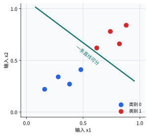
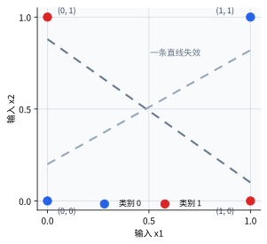

# P5-1.2 线性组合与激活

Section ID: `P5-1.2`
Version: `v2026.07.17`

在 P5-1.1 里，我们把感知机（perceptron）看成了`输入（input） -> 权重（weight） -> 求和（sum） -> 输出（output）`这条流程。现在继续往下看：把输入汇成加权和，到底准确意味着什么？为什么只靠这个和，还不能算深度学习？感知机会先形成输入的线性组合（linear combination），再把这个结果送进激活（activation）规则，从而形成判断。

如果后面的章节里激活的基本含义又开始变模糊，可以先回到[英文概念词汇表里的 activation function 条目](/AiBook/en/reference/concept-glossary/#activation-function)。

## 本节范围

本节整理以下问题。

- 线性组合（linear combination）是什么意思？
- 说感知机会形成判断边界（decision boundary），到底是什么意思？
- 为什么需要激活（activation）？
- 单个感知机的表达极限会在哪里出现？
- 为什么下一章会需要多层神经网络（multilayer neural network）？

单个感知机的局限与多层结构会在 P5-2.1 与 P5-2.2 继续。sigmoid、tanh、ReLU 的比较会在 P5-3.1 到 P5-3.5 再回来看。反向传播（backpropagation）的计算过程会在 P5-5.1 与 P5-5.2 重新连接。也就是说，这一节先要把线性组合与激活为什么会形成`单个感知机的一条边界`、以及为什么这会接到下一章的多层结构问题，先闭合起来。

## 本节目标

- 能把线性组合解释成`给每个输入不同权重后，把它们汇成一个分数的计算`。
- 能说明感知机会形成线性边界（linear boundary）。
- 能理解激活是把单纯的和转换成判断的步骤。
- 能解释为什么有些问题只靠一个感知机很难表达。
- 能直觉地接上为什么需要多层结构。

## 线性组合到底在做什么

正如 Part 4 里的线性回归（linear regression）与逻辑回归（logistic regression）那样，同时处理多个输入时，最先做的事就是`给每个输入不同的比重，再把它们合起来`。

这就叫线性组合（linear combination）。

把它写得很短，就是下面这个式子。

\[
z = w_1 x_1 + w_2 x_2 + w_3 x_3 + b
\]

这个式子可以这样读。

- \(x_1, x_2, x_3\)：输入值
- \(w_1, w_2, w_3\)：各输入的重要度
- \(b\)：移动基准线的值
- \(z\)：把所有输入信号汇总后形成的中间分数

也就是说，感知机并不是一开始就直接形成`判断`，而是会先形成一个`供判断使用的分数`。

## 为什么先把东西汇成一个分数

当输入有多个时，信号之间可能会互相冲突。

- 有些输入可能是正向信号。
- 有些输入可能是负向信号。
- 有些输入可能非常强。
- 有些输入可能只是较弱的辅助信号。

线性组合会把它们压缩到一条分数轴上。

例如，可以把设备检修作业是否恢复的判断极度简化。人会先把`隔离阀确认是否完成`、`残余气体报警是否仍在`、`作业许可单是否已最终批准`这些条件一起看，再形成整体印象。但这些条件的方向和强度并不一样。如果只在脑中凭感觉判断，很难把`究竟哪个条件起了多大的作用`拆开。线性组合会把这些不同方向的信号汇到同一条分数轴上，让我们开始读出当前作业到底更接近恢复，还是更接近保留。这里改变的，是判断方式从分别记住多个条件，变成压缩到一条分数轴上做比较。

| 输入 | 含义 | 权重扮演的角色 |
| --- | --- | --- |
| 隔离阀确认 | 安全条件越满足越有利 | 正权重 |
| 残余气体报警 | 仍然存在就越不利 | 负权重 |
| 作业许可批准 | 完成后更有利 | 正权重 |

就这样，感知机不再分别记住多个输入条件，而是开始把它们汇总到一条轴上来作判断。

如果重新读同一个场景，差别会体现在流程上。先逐个检查条件，并给每个条件贴上朝向恢复或保留的方向；然后用权重大小调整影响强度；最后再看所有信号在同一条分数轴上，总共把结果往边界推了多远。因此，从线性组合视角看，比起`一共看了多少个条件`，更重要的是`每个条件把分数往哪个方向推了多少`。

## 感知机会形成线性边界

说感知机用线性组合来读输入，最终就意味着它会连到一种用直线（line）、平面（plane），或者更一般地说用超平面（hyperplane）来把数据分开的判断。

可以用下面这句话记住。

`单个感知机，是一个一次只按一条直线或一个平面来划分输入空间的判断器。`

如果把二维例子画得非常简单，就是下面这样。

```mermaid
--8<-- "assets/part-05/chapter-01/linear-boundary-flow-zh.mmd"
```

这张图里要确认的结果是：单个感知机会把多个输入汇到一条分数轴上，再根据这条分数把输入分到边界两侧。

这张图真正的关键在于，感知机形成的不是复杂弯曲边界，而是一次只形成一条线性边界。

从点的分布来看，这个局限会更直接。能被一条直线分开的模式，用一个感知机通常比较容易表达；但像 XOR 这种相同输出落在对角位置的模式，就很难只靠一条直线干净分开。





这两张图并不是要在这里完整解释 XOR，而是为了把`一条线性边界`这句话在真实输入空间里的意思先固定下来。第一张图展示一条直线如何真正把两类点分开；第二张图则单独展示：即使规则说明很短，只要点分布不能被一条直线干净切开，单个感知机就会变得吃力。

## 为什么需要激活

如果只看线性组合，结果还只是一个数字 \(z\)。但我们真正想要的通常是下面这类东西。

- 是 0 还是 1？
- 是批准还是拒绝？
- 是反应还是不反应？

把这个分数真正变成判断的步骤，就是激活（activation）。

早期感知机的解释里，常常会用阈值（threshold）规则来讲。

- 如果分数高于标准，就输出 1
- 否则就输出 0

所以，激活就是`把算出来的分数转成输出规则的步骤`。

```mermaid
--8<-- "assets/part-05/chapter-01/activation-threshold-flow-zh.mmd"
```

这张图里要确认的结果是：形成分数 `z` 的步骤，和把这个分数转成 0 或 1 之类真实输出的步骤，是彼此不同的。因此，感知机不能只被理解成简单的`加法器`，而应该理解成`求和 + 决策`单元。

正因为有这个结构，感知机不只是简单加总器，而是`求和 + 判断`单元。

## 案例与例子

### 案例 1. 检修作业恢复分数

把检修作业恢复判断极度简化来想。人会先同时看`隔离阀确认`、`残余气体报警`、`作业许可批准`这些条件，再形成整体印象。但这些条件方向不同、强度也不同。隔离阀确认与许可批准会把判断往恢复方向推，而残余气体报警可能会强烈地把判断推向相反方向。线性组合正是把这些不同信号汇到一条分数轴上，让我们开始读出当前作业到底更靠近恢复，还是更靠近保留。所以在这个案例里，需要确认的结果是：与其分别看条件，把多个信号汇成同一条分数轴之后，恢复与保留是否反而更容易比较。

| 作业场景 | 隔离阀确认贡献 | 残余气体报警贡献 | 作业许可贡献 | 合计分数的解读 |
| --- | --- | --- | --- | --- |
| A | `+0.9` | `0.0` | `+0.5` | 倾向恢复 |
| B | `+0.9` | `-1.2` | `+0.5` | 被推向保留 |

这个短例子里重要的点是：每个条件不再被写成单独的结论，而是所有信号都开始通过一个合计分数来阅读。

场景 A 之所以更偏向恢复，是因为安全确认与许可批准信号，比保留信号作用得更强。场景 B 则说明，即便部分项目看起来没问题，残余气体报警的负贡献也会压住其他批准信号，把结果推向保留。线性组合在这里做的事，不是罗列两个场景的印象，而是把真正推动边界的输入拆开来看。

### 案例 2. 自动阻断的阈值判断

同样的分数，未必会被直接拿来下操作指令。比如说，自动阻断系统规定 `z > 0.5` 时继续保持阻断，否则就交给现场重新确认。人可能会把 1.4 与 0.6 都看成`偏向保持阻断`，而把 0.2 与 -0.3 都看成`偏向重新确认`。这时，激活就是把连续分数转成实际判断规则的步骤。换句话说，如果线性组合汇的是`当前到底有多偏向继续阻断`这个分数，那么激活闭合的就是`所以自动阻断到底要不要继续保持`。所以在这个案例里要确认的结果是：方向相近的分数，会不会在实际运行判断里被归到同一侧。

| 分数 `z` | 激活前的解读 | 应用阈值后 |
| --- | --- | --- |
| 1.4 | 强烈的继续阻断信号 | 继续阻断 |
| 0.6 | 较弱的继续阻断信号 | 继续阻断 |
| 0.2 | 低于边界的重新确认信号 | 重新确认 |

这里要确认的结果是：分数的大小，与最终决策规则，并不是同一回事。线性组合形成方向与强度，而激活则把这个分数折叠成真实输出类别。

从激活视角看，即使 1.4 和 0.6 最终都落成`继续阻断`，它们也不是同样的信号。1.4 是强烈阻断信号，0.6 则只是刚刚越过阈值的较弱信号。相反，0.2 虽然是正数，可能看起来有些偏向阻断，但只要没有超过 0.5 的阈值，最终输出仍然会折回重新确认一侧。分数是连续值，而决策则是按规则把这个分数折起来后的结果。

把这两个案例并排看，单个感知机真正改变的是一种阅读方式：它把`条件列表`重新读成`分数轴与边界判断`。

在检修作业恢复案例里，正负贡献的和形成了恢复与保留之间的位置；在自动阻断案例里，分数 `z` 是否越过阈值 `0.5` 则闭合了最终输出。两个案例里，读者首先要抓住的结论都是：感知机的重点不是`看很多条件`，而是`先把条件汇到一条分数轴上，再看这个分数有没有越过边界`。

## 为什么只重复线性组合还不够

这里会出现一个很重要的深度学习直觉。

`即使把线性组合重复很多次，整体结果仍然可能重新折叠成线性组合。`

这里暂时不需要非常严格地证明这件事。但必须先抓住这样一种感觉：`能被一条直线分开的题`，和`需要多条弯折边界的题`，是不同的。

- 能用一条直线分开的题，通常一个感知机就能相对不错地表达。
- 但边界是弯的、边界被切成多个部分、或者条件互相缠绕的问题，一个感知机就会很吃力。

换句话说，深度学习之所以会变深，其中一个原因就是它需要`更复杂的边界与更复杂的表征`。

## 为什么 XOR 总是反复出现

解释感知机局限时，XOR 问题总是反复出现，原因很简单。

XOR 是一个`只有两个输入不同，结果才为 1`的规则。

| x1 | x2 | XOR 输出 |
| --- | --- | --- |
| 0 | 0 | 0 |
| 0 | 1 | 1 |
| 1 | 0 | 1 |
| 1 | 1 | 0 |

人看到这张表时，很容易先想：`规则这么简单，也许一条直线就能分开吧。` 但只要把实际分布画成点，就会发现应该输出 1 的两个点正好落在对角线上，很难用一条直线把它们干净地分到一起。也就是说，这正是一个不能被单个感知机形成的单一线性边界很好表达的代表案例。人原本使用的标准是`规则描述短不短`，但从模型角度，更重要的标准其实是`能不能被一条直线分开`。正是因为这两个标准不同，才会出现规则看起来简单、表达却依然困难的问题。

大致这样理解就够了。

`因为单个感知机一次只能形成一条直线边界，所以在 XOR 这种规则简单、却难以线性分开的模式上，它会直接暴露出自己的局限。`

把它再压成一个极简图，就是下面这样。

```mermaid
--8<-- "assets/part-05/chapter-01/xor-limit-flow-zh.mmd"
```

这张图里要确认的结果是：单个感知机一次只能形成一条线性边界，所以一旦遇到 XOR 这类虽然规则说明短、却无法被一条直线干净切开的题目，它就会立刻显出局限。

## 那么多层结构又多了什么

这正是 P5-2 章里多层神经网络（multilayer neural network）变得必要的地方。

如果一个感知机只能形成一条直线，那么把多层堆叠起来的神经网络，就能通过多次组合简单的线性判断，构成更复杂的表达。

所以可以按下面这条流程来理解。

1. 先看一个感知机。
2. 再看线性组合与激活。
3. 接着看简单边界。
4. 最后转向用多层叠加形成更复杂表达。

这个连接，就是深度学习的起点。

## 练习与例题

这个练习的目标，不只是看见`线性组合先形成分数，激活再把分数变成判断`。更重要的是，要直接探索`当某个值被移动时，边界到底会在什么位置翻转`。比起把同一个式子只算一遍，更能直接碰到本节核心的，是一边微调输入、偏置与阈值，一边观察边界如何移动。

这次实验里会操作三个值。

- `alarm_risk`：报警风险信号变大时，分数会多快往下掉
- `b`：基准线会变得更严格还是更宽松
- `threshold`：即便分数相同，最终判断规则会在什么位置截断

要观察的输出有两个。

- 线性组合分数 `z`
- 与阈值比较后的最终输出

实验前，先用下面这张表预测变化。

| 被操作的值 | 首先预期的变化 | 原因 |
| --- | --- | --- |
| 提高 `alarm_risk` | `z` 会下降，并且更快掉到边界下方 | 这个输入带有负权重，风险信号越大，扣分越重 |
| 让 `b` 变得更小 | 相同输入会得到更保守的判断 | 偏置会把整体分数往下拉 |
| 提高 `threshold` | 同样的 `z` 下，通过会减少，保留会增加 | 激活规则本身变得更严格 |

现在实际改动这些值。下面的代码会固定 `stability_score`，并组合 `alarm_risk`、`b`、`threshold`，逐行展示输出会在什么位置翻转。

```python
stability_score = 1.0
stability_weight = 0.8
alarm_weight = -0.6

alarm_risks = [0.2, 0.5, 0.8]
biases = [-0.1, -0.4]
thresholds = [0.0, 0.2]

for b in biases:
    print(f"\n[bias={b}]")
    for threshold in thresholds:
        print(f"  threshold={threshold}")
        for alarm_risk in alarm_risks:
            z = stability_score * stability_weight + alarm_risk * alarm_weight + b
            output = 1 if z > threshold else 0
            print(
                f"    alarm_risk={alarm_risk:.1f} -> z={z:.2f}, output={output}"
            )
```

例如，可以这样读。

```text
[bias=-0.1]
  threshold=0.0
    alarm_risk=0.2 -> z=0.58, output=1
    alarm_risk=0.5 -> z=0.40, output=1
    alarm_risk=0.8 -> z=0.22, output=1
  threshold=0.2
    alarm_risk=0.2 -> z=0.58, output=1
    alarm_risk=0.5 -> z=0.40, output=1
    alarm_risk=0.8 -> z=0.22, output=1

[bias=-0.4]
  threshold=0.0
    alarm_risk=0.2 -> z=0.28, output=1
    alarm_risk=0.5 -> z=0.10, output=1
    alarm_risk=0.8 -> z=-0.08, output=0
  threshold=0.2
    alarm_risk=0.2 -> z=0.28, output=1
    alarm_risk=0.5 -> z=0.10, output=0
    alarm_risk=0.8 -> z=-0.08, output=0
```

这个例子展示的是数值如何被公式一步步改变的场景。先有原始输入，然后这个输入被转成线性组合分数 `z`，最后再经过与阈值的比较，折叠成输出。


第一张图展示的是实验中被改动的原始输入。`alarm_risk` 目前还只是风险信号的大小，仅凭这个值，还不能马上决定最终输出到底是通过还是保留。


第二张图展示的是同样的输入被转换成线性组合分数 `z` 之后的结果。随着 `alarm_risk` 增大，负权重会把 `z` 往下拉；而在 `bias=-0.4` 时，相同输入会被移动到更低的分数。到这一步为止，它还不是最终输出，而只是一个要拿去和边界比较的连续中间分数。


第三张图展示的是把 `z` 与阈值比较之后得到的最终输出。即使 `z` 的走势相同，只要把 threshold 提高，通过就会减少；只要把 bias 降低，结果就会在更早的输入区间转向保留。因此，这个例子里真正要确认的变化，不是`输入值本身`，而是`输入值 -> 线性组合分数 -> 阈值比较结果`这一整段意义变化。

在这些输出里，首先该读的不是答案表，而是`究竟哪个值推动了边界`。

- `alarm_risk` 越大，`z` 就会一点点下降。
- 同样的 `alarm_risk` 下，只要把 `b` 降到 `-0.4`，结果就会更早掉到边界下方。
- 即使 `z` 相同，只要把 `threshold` 提高到 `0.2`，输出就会更早变成 `0`。

也就是说，线性组合负责形成`往哪边推、推了多少`，激活则负责决定`所以到底在哪里切开`。

把观察结果再整理成一张表，就是下面这样。

| 实验中改动的东西 | 直接变化的阶段 | 在输出里要确认的结果 |
| --- | --- | --- |
| `alarm_risk` 增加 | 线性组合分数 `z` | 风险信号越大，分数越低 |
| `b` 减小 | 线性组合分数 `z` | 即使输入相同，边界也会更保守地移动 |
| `threshold` 增加 | 激活规则 | 即使分数相同，也会更晚通过、更早保留 |

把代码跑过一遍之后，最好再逐行多改几个值。这样更容易看清，到底是`线性组合`在改变什么，又是`激活`在改变什么。

| 下一步可以亲自改动的值 | 先看哪个输出 | 要问的解读问题 |
| --- | --- | --- |
| 在 `alarm_risks` 里加入 `1.0` | 哪个 `bias` 与 `threshold` 组合会最先出现 `output = 0` | 风险信号增大时，究竟是谁让边界更敏感地移动？ |
| 把 `stability_score` 降到 `0.7` | 同样的 `alarm_risk` 下，`z` 会多快下降 | 风险信号变化和稳定信号减弱，哪一个作用更大？ |
| 在 `thresholds` 里加入 `-0.1` | 即使 `z` 相同，通过判断会增加多少 | 不改分数本身，只改决策规则，也能改变输出，这一点是否看得出来？ |

看到这一步后，线性组合与激活的核心，就不再是`把公式算了一遍`，而是`当你改动输入、偏置或判断规则时，能不能解释边界在哪里翻转`。

回想 Part 4 里看过的线性回归（linear regression）与逻辑回归（logistic regression），就会发现感知机（perceptron）其实并不是一个完全陌生的结构。输入与权重相乘再相加，接着加上偏置（bias），然后交给某种输出规则，这个骨架本身仍属于同一类感觉。Part 5 新加上的差异在于：这个结构会形成多层（layer）并不断重复，而激活（activation）会引入非线性（nonlinearity），从而让更复杂的表达变得可能。换句话说，感知机可以记成把 Part 4 的线性模型感觉送进 Part 5 神经网络感觉的第一块踏脚石。

## 检查清单

- 能把线性组合解释成`把多个输入信号汇到同一条分数轴上的计算`。
- 能说明权重决定各输入影响的方向与大小，偏置则负责调节边界位置。
- 能区分激活不是直接把分数 `z` 当输出，而是把它送进判断规则的步骤。
- 能解释单个感知机是一个一次只按一条线性边界划分输入空间的判断器。
- 能说明为什么像 XOR 这样规则说明虽短、却无法被一条线性边界干净分开的模式会出现。
- 能解释单个感知机的局限为什么会连到多层结构的必要性。
- 当`先把输入汇成一个分数，再作判断`这条流程开始混乱时，能先想起线性组合与激活这两个步骤。
- 当看见一条线性边界已经不够时，能理解为什么要转向下一章的多层神经网络。

## 出处与参考资料

- Frank Rosenblatt, `The Perceptron: A Probabilistic Model for Information Storage and Organization in the Brain`, Psychological Review, 1958, 确认日期：2026-06-28.
- Marvin Minsky, Seymour Papert, `Perceptrons: An Introduction to Computational Geometry`, MIT Press, 1969/1988, 确认日期：2026-06-28.
- Ian Goodfellow, Yoshua Bengio, Aaron Courville, `Deep Learning`, MIT Press, 2016, 确认日期：2026-06-28. [https://www.deeplearningbook.org/](https://www.deeplearningbook.org/){: target="_blank" rel="noopener noreferrer" }
