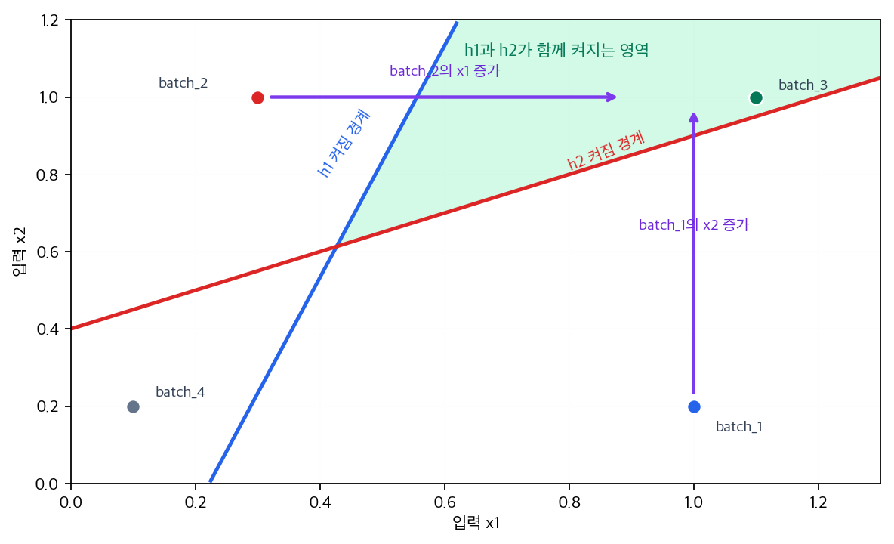

# P5-2.1 다층 신경망(multilayer neural network)

> Section ID: `P5-2.1`
> Version: `v2026.07.20`

P5-1.2에서는 퍼셉트론(perceptron) 하나가 입력의 선형 결합(linear combination)과 활성화(activation)로 판단을 만든다는 점을 보았습니다. 동시에 퍼셉트론 하나는 한 번에 하나의 선형 경계(linear boundary)만 만들기 때문에, 표현할 수 있는 패턴에 한계가 있다는 점도 보았습니다. 그다음 질문은 자연스럽게 `퍼셉트론 하나가 부족하다면, 이런 계산 단위를 여러 개 쌓으면 무엇이 달라지는가`로 이어집니다. 이 질문에서 다층 신경망(multilayer neural network)으로 들어갑니다. 다층 신경망은 퍼셉트론 같은 계산 단위를 여러 층으로 쌓아, 단순한 입력 조합을 중간 표현으로 바꾸고 그 표현을 다시 더 복잡한 판단으로 연결하는 구조입니다.

다층 구조와 중간층 구분을 다시 잡아야 할 때는 개념사전의 [다층 신경망(multilayer neural network)](../../../reference/concept-glossary.md#multilayer-neural-network)과 [은닉층(hidden layer)](../../../reference/concept-glossary.md#hidden-layer) 항목을 함께 다시 보는 편이 좋습니다.

## 층을 더 쌓을 때 생기는 질문

이 절은 다음 질문을 정리합니다.

- 왜 퍼셉트론 하나로는 부족한가?
- 층(layer)을 더 쌓는다는 말은 무엇을 뜻하는가?
- 입력층(input layer), 은닉층(hidden layer), 출력층(output layer)은 어떻게 다르게 읽어야 하는가?
- 다층 구조가 더 복잡한 표현을 만든다는 말은 무엇인가?
- 왜 다층 신경망이 딥러닝(deep learning)의 출발점처럼 취급되는가?

은닉층이 실제로 어떤 표현을 만든다고 읽을 수 있는지는 P5-2.2에서 더 이어서 다루고, 활성화 함수 비교는 P5-3.1부터 P5-3.5까지 다시 연결합니다. 역전파(backpropagation)의 계산 공식은 P5-5.1, P5-5.2에서 다시 봅니다. 즉, 이번 절은 층을 더 쌓으면 무엇이 달라지는지와 은닉층이 왜 필요한지를 먼저 붙잡는 자리입니다.

## 다층 구조와 표현력의 판단 기준

- 다층 신경망을 `퍼셉트론을 여러 층으로 쌓은 구조`로 설명할 수 있습니다.
- 은닉층(hidden layer)이 입력과 출력 사이의 중간 표현을 담당한다는 점을 말할 수 있습니다.
- 단일 퍼셉트론보다 다층 구조가 더 복잡한 경계와 패턴을 표현할 수 있다는 점을 이해할 수 있습니다.
- Part 4의 선형 모델과 Part 5의 깊은 모델이 어디서 갈라지는지 설명할 수 있습니다.

## 왜 층을 더 쌓는가

퍼셉트론 하나는 이미 유용한 계산 단위였습니다.

- 입력을 받습니다.
- 가중합을 만듭니다.
- 활성화를 거쳐 출력을 냅니다.

문제는 이 단위 하나만으로는 복잡한 패턴을 표현하기 어렵다는 점입니다.

예를 들어 현실 문제에서는 다음 같은 일이 자주 생깁니다.

- 입력 특징(feature)들이 단순히 하나의 선으로 나뉘지 않습니다.
- 중요한 조건이 여러 단계로 조합되어야 합니다.
- 낮은 수준 신호를 먼저 묶은 뒤, 그 묶음을 다시 더 큰 의미로 결합해야 합니다.

즉, 퍼셉트론 하나가 `바로 최종 판단`을 하게 두면 너무 많은 일을 한 번에 맡기게 됩니다.

다층 신경망은 이 문제를 구조적으로 나눕니다.

1. 첫 층은 작은 조합을 만듭니다.
2. 중간 층은 그 조합들을 다시 묶습니다.
3. 마지막 층은 최종 판단으로 연결합니다.

작은 생산 배치 이상 판단 장면으로 옮기면 차이가 더 선명해집니다. `x1`만 높을 때와 `x2`만 높을 때를 퍼셉트론 하나로 바로 읽으면, 둘 다 결국 `점수 하나를 어느 쪽으로 기울일까` 문제로 먼저 접히기 쉽습니다. 반면 층을 나누면 첫 층에서 `신호 A가 먼저 켜졌는가`, `신호 B가 먼저 켜졌는가`를 따로 남길 수 있고, 뒤층에서는 `두 신호가 함께 나타났는가`를 다시 묶어 최종 판단으로 연결할 수 있습니다. 즉, 다층 구조의 핵심은 입력 두 개를 곧바로 한 점수에 눌러 담지 않고, 중간에서 `따로 보아야 할 조합`과 `함께 보아야 할 조합`을 나누어 다룰 수 있게 만드는 데 있습니다.

## 다층 신경망을 한 장면으로 보기

```mermaid
--8<-- "assets/part-05/chapter-02/multilayer-network-flow-ko.mmd"
```

이 도식의 핵심은 층(layer)이 늘어날수록 단순히 계산이 많아지는 것이 아니라, `중간 표현`이 생긴다는 점입니다.

즉, 다층 신경망은 처음 입력을 그대로 최종 판단으로 보내지 않고, 중간에서 여러 번 재표현(representation)합니다.

## 입력층, 은닉층, 출력층은 어떻게 다르나

층 이름은 추상적으로 들릴 수 있으므로 역할로 나누어 봅니다.

| 층 | 영어 | 쉬운 역할 |
| --- | --- | --- |
| 입력층 | input layer | 원래 값을 받아들이는 입구 |
| 은닉층 | hidden layer | 입력을 중간 특징으로 바꾸는 계산 구간 |
| 출력층 | output layer | 최종 예측이나 점수를 내는 마지막 구간 |

여기서 특히 중요한 것은 은닉층(hidden layer)입니다.

은닉층은 `사람이 직접 이름 붙인 특징`이 아니라, 모델이 계산 과정 속에서 만들어 쓰는 중간 표현입니다. 바로 이 점 때문에 신경망은 Part 4의 전통적인 모델들과 다른 방향으로 나아갑니다.

## 은닉층은 왜 hidden인가

`hidden`이라는 이름 때문에 독자는 은닉층을 비밀 공간처럼 이해하기 쉽습니다. 하지만 여기서 hidden은 신비롭다는 뜻이 아니라, `입력도 아니고 최종 출력도 아닌 중간 계산층`이라는 뜻에 가깝습니다.

즉:

- 입력층은 우리가 직접 보는 값입니다.
- 출력층은 우리가 직접 읽는 결과입니다.
- 은닉층은 그 사이에서 모델이 내부적으로 쓰는 표현입니다.

그래서 은닉층은 사람이 바로 `이 노드는 정확히 이 의미다`라고 해석하기 어려운 경우가 많습니다. 대신 우리는 `이 층이 더 유용한 중간 표현을 만들고 있는가`를 보게 됩니다.

## 왜 더 복잡한 표현이 가능해지는가

퍼셉트론 하나는 입력을 한 번의 선형 결합으로 보고 바로 판단했습니다. 반면 다층 구조에서는 한 층의 출력이 다음 층의 입력이 됩니다.

이 말은 곧:

- 첫 번째 층이 만든 조합을
- 두 번째 층이 다시 새로운 입력처럼 받아
- 더 큰 패턴으로 묶을 수 있다는 뜻입니다.

예를 들어 이미지라면 다음처럼 비유할 수 있습니다.

- 아주 낮은 수준: 선, 모서리, 밝기 차이
- 그다음 수준: 작은 모양 조각
- 더 높은 수준: 더 큰 부분 구조
- 마지막 수준: 특정 물체와 가까운 판단

물론 이 절에서는 CNN(convolutional neural network)을 아직 다루지 않습니다. CNN의 구체 구조는 뒤의 P5-11.1 CNN이 무엇인가에서 다시 다룹니다. 하지만 `작은 조합을 더 큰 조합으로 쌓아 올린다`는 감각은 지금부터 필요합니다.

## 다층 구조를 표 형식 비유로 보기

표 형식 데이터라도 비슷한 일이 일어날 수 있습니다.

예를 들어 생산 라인 배치 데이터를 생각해 봅니다.

- 입력값: 마이크로 스톱 횟수, 온도 이탈 지속 시간, 압력 흔들림, 재작업 호출 횟수
- 첫 은닉층: 열적 부담, 운전 불안정성, 품질 위험 같은 중간 조합
- 다음 층: 더 큰 패턴 조합
- 출력층: 정상 진행 가능성, 이상 개입 필요성 같은 최종 예측

예를 들어 생산량은 아직 유지되지만 온도 이탈 시간이 길어지고 재작업 호출 횟수도 늘고 있다면, 사람은 처음에는 숫자 네 개를 따로따로 보고 판단하려 하기 쉽습니다. 하지만 실제로는 이 숫자들을 한 번에 묶어 `겉보기 생산량은 유지되지만 내부 불안정성이 커진 배치`처럼 읽습니다. 입력값만 직접 비교하면 이런 조합 신호를 놓치기 쉽고, 서로 다른 숫자 패턴이 같은 배치 상태를 뜻할 수도 있습니다. 은닉층은 바로 이런 중간 조합을 내부적으로 만드는 자리로 이해합니다. 다만 중요한 것은 은닉층이 실제로 `열적 부담`이라는 이름을 알고 있는 것은 아니라는 점입니다. 우리는 직관을 위해 그렇게 설명할 뿐이고, 실제로는 모델이 여러 가중치 조합을 통해 어떤 중간 표현을 내부적으로 만든다고 이해합니다.

여기서 사람이 먼저 하기 쉬운 읽기는 대체로 세 가지입니다. 첫째, 입력값을 따로따로 보며 `스톱 횟수가 많은가`, `재작업 호출이 늘었는가`를 각각 판단합니다. 둘째, `온도 이탈 시간이 길면 위험`처럼 규칙 하나를 바로 붙입니다. 셋째, 마지막에 `정상인가, 개입이 필요한가` 같은 최종 라벨만 먼저 봅니다.

다층 구조는 이 읽기를 바꿉니다. 입력값을 따로 보는 대신 여러 입력이 함께 만든 중간 조합을 먼저 보고, 단일 규칙 하나로 바로 판단하는 대신 앞층에서 작은 조합을 만든 뒤 뒤층에서 더 큰 상태 판단으로 다시 묶습니다. 그래서 최종 라벨만 보는 구조보다, `왜 이런 개입 판단이 나왔는가`를 중간 표현 수준에서 더 분명하게 따라갈 수 있습니다.

## 사례 및 예시

### 사례 1. 생산 배치 이상 조합 판단

생산 배치 이상 조합 판단을 생각합니다. 사람은 처음에는 `온도 이탈 시간이 길어졌는가`, `재작업 호출이 늘었는가`, `압력 흔들림이 커졌는가` 같은 규칙을 하나씩 따로 봅니다. 하지만 실제로는 이 세 조건이 함께 나타날 때만 개입 필요성이 커지는 경우가 많습니다. 예를 들어 생산량은 여전히 유지되지만 온도 이탈 시간이 길어지고 재작업 호출까지 늘었다면, 단일 규칙 하나보다 `열적 부담 + 운전 불안정성`이라는 중간 조합으로 읽습니다. 다층 구조는 바로 이런 작은 신호 조합을 한 층에서 만들고, 다음 층에서 더 큰 상태 판단으로 묶는 흐름을 설명합니다. 그래서 이 사례에서 확인해야 할 결과는 개별 규칙 하나보다, 여러 신호가 함께 나타날 때 만들어지는 중간 조합이 실제로 개입 필요 판단을 더 분명하게 가르는가입니다.

| 배치 상태 | 사람이 먼저 보기 쉬운 판단 | 중간 조합으로 다시 읽으면 | 더 안전한 다음 판단 |
| --- | --- | --- | --- |
| 생산량 유지, 온도 이탈 길어짐, 재작업 호출 증가 | 아직 생산량이 나오니 괜찮다 | 열적 부담과 운전 불안정성이 함께 보인다 | 단일 지표보다 조합 신호를 먼저 확인한다 |
| 생산량 보통, 압력 흔들림 증가, 재작업 호출 없음 | 일시적 흔들림일 뿐이다 | 불안정 조짐은 있지만 품질 위험 신호는 약하다 | 즉시 이상으로 단정하지 않고 추가 신호를 본다 |
| 생산량 감소, 온도 이탈 길어짐, 재작업 호출 증가 | 숫자가 모두 나쁘다 | 여러 위험 신호가 같은 방향으로 겹친다 | 우선 개입 대상으로 먼저 올린다 |

```mermaid
--8<-- "assets/part-05/chapter-02/production-batch-hidden-flow-ko.mmd"
```

이 도식은 같은 배치 신호라도 `지표 하나를 먼저 보는 읽기`와 `여러 신호를 함께 묶는 읽기`가 어떻게 갈라지는지 짧게 다시 압축한 것입니다. 새 이론을 추가하는 도식이 아니라, 방금 사례에서 본 판단 순서를 다시 따라 읽는 용도로 봅니다.

### 사례 2. 설비 이미지 인식의 초기 직관

설비 이미지 인식에서도 비슷한 일이 일어납니다. 사람은 처음에 사진 한 장을 보고 바로 `혼합 탱크`, `배관 모듈`, `제어함 장면`처럼 최종 라벨을 떠올리지만, 실제로는 밸브 윤곽, 경광등 위치, 금속 경계선 같은 작은 단서들이 먼저 보입니다. 단일 퍼셉트론 하나로는 이런 여러 단서를 한 번에 다루기 어렵지만, 다층 구조에서는 앞층이 작은 모양 조합을 만들고 뒤층이 그 조합을 더 큰 설비 단서로 묶을 수 있습니다. 예를 들어 밸브 손잡이와 배관 곡선 패턴이 먼저 잡히고, 그 다음에 탱크 몸체와 연결 구조 같은 더 큰 장면이 묶이는 식입니다. 그래서 이 사례에서 확인해야 할 결과는 작은 단서 조합을 거친 뒤에야 최종 라벨 구분이 더 안정적으로 드러나는가입니다.

| 먼저 보이는 단서 | 앞층에서 묶이는 작은 조합 | 뒤층에서 더 크게 읽는 단서 |
| --- | --- | --- |
| 밸브 손잡이 윤곽, 배관 곡선 | 설비 일부를 이루는 작은 패턴 | 탱크 연결부처럼 더 큰 설비 단서 |
| 경광등 경계, 제어함 모서리 | 제어 장치를 이루는 부분 구조 | 경보 장치가 포함된 설비 장면처럼 더 안정적인 라벨 후보 |
| 배관 지지대 선분, 탱크 몸체 경계 | 배관 모듈의 부분 단서 | 배관 모듈 전체 형태에 가까운 판단 |

사진 한 장을 바로 최종 라벨로 읽고 싶어지지만, 다층 구조 관점에서는 작은 단서를 먼저 만들고 그 단서를 더 큰 구조로 다시 묶는 흐름을 봅니다. 밸브, 경광등, 배관 같은 단서는 최종 라벨 자체가 아니라 앞층이 다루는 재료입니다. 최종 라벨은 그 단서 조합이 뒤층에서 어떻게 함께 켜지는지에 따라 더 안정적으로 정리됩니다.

이 두 사례를 한 줄로 묶으면 다층 신경망의 핵심은 같습니다.

`입력값을 바로 최종 판단으로 보내지 않고, 중간 조합을 거쳐 더 큰 패턴으로 묶는다.`

두 사례를 한 번에 다시 압축하면, 다층 구조를 읽는 첫 흐름은 다음과 같습니다.

```mermaid
--8<-- "assets/part-05/chapter-02/multilayer-combination-bridge-ko.mmd"
```

이 도식은 사례 1의 생산 배치 조합과 사례 2의 설비 이미지 단서를 따로 다시 설명하려는 것이 아니라, 두 사례가 공통으로 보여 준 `작은 조합을 먼저 만들고, 그 조합을 더 큰 판단으로 다시 묶는다`는 흐름을 한 번에 다시 붙잡기 위한 것입니다.

## 퍼셉트론 하나와 다층 구조 비교

```mermaid
--8<-- "assets/part-05/chapter-02/single-vs-multilayer-flow-ko.mmd"
```

왼쪽은 입력 특징을 한 번의 선형 점수와 한 번의 활성화로 바로 최종 판단에 연결합니다. 그래서 여러 신호가 있어도 결국 한 점수에 먼저 눌러 담기기 쉽습니다. 오른쪽은 입력 특징이 먼저 작은 조합으로 묶이고, 그 조합이 다시 더 큰 조합으로 바뀐 뒤 최종 판단에 도달합니다. 사람은 두 구조 모두 결국 입력을 넣어 답을 내니 비슷하다고 느끼기 쉽지만, 실제 차이는 `중간에서 어떤 조합을 새로 만들 수 있는가`에 있습니다. 딥러닝의 중요한 변화는 바로 이 `중간 표현을 여러 단계에 걸쳐 학습할 수 있다`는 점입니다.

## 다층 구조가 딥러닝의 출발점인 이유

다층 신경망이 중요하게 취급되는 이유는, 여기서부터 모델이 단순한 선형 경계를 넘어서 `표현 학습(representation learning)`으로 들어가기 시작하기 때문입니다.

Part 4의 많은 전통 모델은 사람이 정한 특징(feature)을 기반으로 학습합니다. 물론 조합과 분할은 할 수 있지만, `중간 표현을 여러 층에 걸쳐 학습한다`는 감각은 상대적으로 약합니다.

반면 다층 신경망은:

- 입력을 그대로 쓰지 않고
- 내부 표현을 여러 단계 거쳐 바꾸며
- 최종 판단에 유리한 구조를 스스로 만들어 갑니다.

이 때문에 다층 구조는 딥러닝의 출발점처럼 보입니다.

이 차이를 학습 책임 관점으로 다시 줄이면 더 간단합니다. Part 4의 전통 모델 감각에서는 사람이 어떤 특징을 넣고 어떤 규칙으로 나눌지 더 많이 정합니다. 반면 P5-2.1의 다층 구조 감각에서는 입력과 출력만 먼저 두고, 그 사이 중간 표현을 만드는 일은 모델이 더 많이 맡습니다. 그래서 지금 절에서 먼저 붙잡아야 할 차이도 `선형 경계 하나로 설명이 닫히는가`가 아니라, `중간 표현이 생기면 패턴 설명이 어디서 더 잘 닫히는가`입니다.

## 연습 및 예제

이번 예제의 목표는 여러 입력이 같은 층 구조를 지날 때 은닉층(hidden layer) 패턴이 어떻게 갈리고, 그 차이가 최종 출력에 어떻게 연결되는지 직접 확인하는 것입니다. 특히 이번에는 값을 한 번에 많이 바꾸지 않고, 한 단계씩 한 값만 바꾸며 `입력 변화 -> 은닉층 변화 -> 최종 판단 변화`를 따라갑니다.

입력:

- 두 입력 특징(feature)을 가진 생산 배치 4개

출력:

- 배치별 은닉층 노드 값
- 배치별 최종 출력

문제 상황:

- 입력 두 개가 바로 최종 판단으로 가지 않고, 은닉층을 지나며 다른 이상 조합으로 바뀌는 과정을 직접 확인할 필요가 있다
- 값을 한꺼번에 많이 바꾸면 어느 지점에서 판단이 뒤집혔는지 놓치기 쉬우므로, 한 번에 하나씩만 바꿔 본다

확인할 개념:

- 다층 퍼셉트론은 입력을 바로 출력으로 보내지 않고 중간 노드 계산을 한 번 더 거친다
- 최종 출력이 같거나 다르더라도, 그 앞의 은닉층 패턴을 함께 봐야 층의 역할이 더 분명해진다

입력(input):

먼저 아래 네 배치 가운데 어떤 배치가 `은닉층 두 노드가 모두 켜질 것 같은지`를 예상해 봅니다. 그다음 은닉층·출력층 가중치로 실제 결과를 확인합니다.

코드를 보기 전에 먼저 한 번 판단해 보면 더 좋습니다.

| 배치 | 먼저 예상해 볼 질문 | 예상되는 최종 출력 감각 |
| --- | --- | --- |
| `(1.0, 0.2)` | 첫 번째 은닉 노드만 켜질까, 두 노드가 같이 켜질까 | 열적 부담 쪽만 켜지면 아직 최종 판단은 약할 것 같다 |
| `(0.3, 1.0)` | 두 번째 은닉 노드가 더 먼저 켜질까 | 다른 은닉 패턴이지만 최종 출력은 아직 0일 수 있다 |
| `(1.1, 1.0)` | 두 신호가 모두 커서 두 은닉 노드가 함께 켜질까 | 두 조합이 함께 잡히면 최종 1로 갈 가능성이 크다 |
| `(0.1, 0.2)` | 은닉 표현이 거의 생기지 않고 끝날까 | 은닉 표현이 약하면 최종도 0에 머물 것 같다 |

먼저 기본 배치 4개를 실행한 뒤, 아래 3단계만 순서대로 따라가면 됩니다.

1. `batch_2`의 `x1`만 올려서 두 은닉 노드가 함께 켜지는지 본다.
2. `batch_1`의 `x2`만 올려서 다른 출발점에서도 같은 `(1, 1)` 조합이 만들어지는지 본다.
3. `batch_2` 입력은 그대로 두고 출력층 편향만 바꿔, 은닉층은 같은데 최종 판단만 달라질 수 있는지 본다.

```python
# 생산 배치 입력이 두 은닉 노드 조합을 거쳐 최종 출력으로 이어지는 다층 구조를 확인하는 예제입니다.
def step(z):
    return 1 if z > 0 else 0

def run_batch(x1, x2, output_bias=-0.9):
    # hidden layer
    h1 = step(x1 * 0.9 + x2 * -0.3 - 0.2)
    h2 = step(x1 * -0.5 + x2 * 1.0 - 0.4)

    # output layer
    output = step(h1 * 0.7 + h2 * 0.7 + output_bias)
    return h1, h2, output

batches = [
    ("batch_1", 1.0, 0.2),
    ("batch_2", 0.3, 1.0),
    ("batch_3", 1.1, 1.0),
    ("batch_4", 0.1, 0.2),
]

for name, x1, x2 in batches:
    h1, h2, output = run_batch(x1, x2)
    print(
        f"{name}: input=({x1}, {x2}), "
        f"hidden=({h1}, {h2}), output={output}"
    )

print("\nfollow-up experiments")
experiments = [
    ("step_1: raise batch_2 x1", 0.9, 1.0, -0.9),
    ("step_2: raise batch_1 x2", 1.0, 1.0, -0.9),
    ("step_3: loosen only output rule", 0.3, 1.0, -0.5),
]

for label, x1, x2, output_bias in experiments:
    h1, h2, output = run_batch(x1, x2, output_bias=output_bias)
    print(
        f"{label}: input=({x1}, {x2}), "
        f"output_bias={output_bias}, hidden=({h1}, {h2}), output={output}"
    )
```

출력에서는 각 `input`이 어떤 `hidden` 패턴을 거쳐 `output`으로 가는지 한 줄씩 비교해 봅니다.

```text
batch_1: input=(1.0, 0.2), hidden=(1, 0), output=0
batch_2: input=(0.3, 1.0), hidden=(0, 1), output=0
batch_3: input=(1.1, 1.0), hidden=(1, 1), output=1
batch_4: input=(0.1, 0.2), hidden=(0, 0), output=0

follow-up experiments
step_1: raise batch_2 x1: input=(0.9, 1.0), output_bias=-0.9, hidden=(1, 1), output=1
step_2: raise batch_1 x2: input=(1.0, 1.0), output_bias=-0.9, hidden=(1, 1), output=1
step_3: loosen only output rule: input=(0.3, 1.0), output_bias=-0.5, hidden=(0, 1), output=1
```

입력 변화가 은닉층 패턴을 어떻게 바꾸는지는 입력 평면에 놓고 보면 더 직접 보입니다.



이 그래프에서 초록 영역은 기본 출력층 편향 `-0.9`를 쓸 때 `h1`과 `h2`가 함께 켜져 최종 출력 `1`로 이어지는 입력 영역입니다. `batch_2`는 처음에는 `(0, 1)` 패턴에 머물지만 `x1`을 올리면 초록 영역으로 들어가고, `batch_1`도 `x2`를 올리면 같은 `(1, 1)` 조합으로 이동합니다. 반대로 3단계처럼 출력층 편향만 바꾸는 실험은 입력 좌표가 움직이지 않으므로, 그래프보다 아래 문장 해설로 따로 읽는 편이 낫습니다.

- batch_1과 batch_2는 모두 최종 출력이 `0`이지만, 은닉층 패턴은 각각 `(1, 0)`과 `(0, 1)`로 다릅니다.
- batch_3만 두 은닉 노드가 모두 켜져 최종 출력 `1`로 갑니다.
- batch_4는 은닉 표현 자체가 거의 만들어지지 않아 최종 출력도 `0`에 머뭅니다.
- 후속 실험에서는 입력 하나를 더 올리거나 출력층 편향만 바꿨을 때, `hidden`이 먼저 달라지는지 `output` 규칙이 먼저 달라지는지를 분리해서 볼 수 있습니다.

같은 최종 출력이라도 내부 계산은 다를 수 있다는 점을 다시 표로 붙잡아 두면 좋습니다.

| 배치 | hidden 패턴 | output | 지금 읽어야 할 핵심 |
| --- | --- | --- | --- |
| batch_1 | `(1, 0)` | `0` | 첫 번째 조합만으로는 아직 최종 판단이 닫히지 않는다 |
| batch_2 | `(0, 1)` | `0` | 다른 조합이 켜져도 마찬가지로 아직 부족할 수 있다 |
| batch_3 | `(1, 1)` | `1` | 두 조합이 함께 켜질 때 최종 판단이 뒤집힌다 |
| batch_4 | `(0, 0)` | `0` | 중간 표현이 거의 없으면 최종도 바뀌지 않는다 |

같은 코드를 다시 실행하면서 `batch_2`의 `x1`을 `0.3`에서 `0.9`로 바꿔 보면, `hidden=(0, 1)`이 `hidden=(1, 1)`로 바뀌고 최종 출력도 `0`에서 `1`로 달라집니다. 즉, 다층 신경망은 `입력 -> 중간 표현 -> 최종 판단` 구조를 갖고, 중간 표현이 실제 계산의 핵심 재료가 됩니다.

이제 바로 아래 3단계 후속 실험을 보면, `어느 입력 변화가 은닉층을 바꾸는가`와 `같은 은닉층이라도 출력 규칙을 바꾸면 무엇이 달라지는가`를 나눠 볼 수 있습니다.

| 단계 | 직접 바꿀 값 | 먼저 볼 출력 | 해석 질문 |
| --- | --- | --- |
| 1 | `batch_2`의 `x1`을 `0.3`에서 `0.9`로 올린다 | `hidden=(0, 1)`이 `hidden=(1, 1)`로 바뀌는가 | 첫 번째 신호를 더하면 왜 최종 출력까지 같이 뒤집히는가 |
| 2 | `batch_1`의 `x2`를 `0.2`에서 `1.0`으로 올린다 | 원래 `(1, 0)`이던 패턴이 `(1, 1)`로 확장되는가 | 다른 출발점에서도 두 번째 신호가 들어오면 같은 조합 완성이 일어나는가 |
| 3 | `batch_2` 입력은 그대로 두고 출력층 편향만 `-0.9`에서 `-0.5`로 바꾼다 | 같은 `hidden=(0, 1)`인데도 `output=1`이 되는가 | 중간 표현은 그대로여도 최종 판단 기준이 느슨해지면 결과가 바뀔 수 있는가 |

이 3단계 실험은 두 종류의 변화를 분리해서 보여 줍니다.

- 1단계와 2단계는 입력을 바꿨을 때 은닉층이 어떤 조합을 새로 만들기 시작하는지 보여 줍니다.
- 3단계는 중간 표현은 그대로인데 마지막 판단 규칙만 느슨해져도 결과가 바뀔 수 있음을 보여 줍니다.

1단계와 2단계는 출발 배치가 달라도 `두 은닉 노드가 함께 켜질 때 최종 판단이 뒤집힌다`는 공통 구조를 보여 줍니다. 반대로 3단계에서는 `hidden=(0, 1)`이 그대로인데도 출력층 기준이 완화되면서 최종 출력이 `1`로 바뀝니다. 이 차이를 보면 다층 신경망에서는 `중간 표현을 만드는 규칙`과 `그 표현으로 최종 판단을 내리는 규칙`을 구분해서 읽어야 한다는 점이 더 분명해집니다.

Part 5에서 다층 신경망을 꺼내야 하는 시점은 `퍼셉트론 하나의 계산은 이해했지만, 그 한 번의 선형 판단으로는 패턴 설명이 닫히지 않는가`가 보일 때입니다.

| 먼저 보이는 문제 장면 | 다층 구조 관점이 먼저 유용한 이유 | 바로 다음에 넘길 질문 |
| --- | --- | --- |
| 입력 신호 여러 개가 단계적으로 조합되어야 한다 | 한 번의 점수화보다 중간 조합을 여러 층에 나눠 두는 편이 자연스럽습니다. | 그 중간 조합이 실제로 어떤 표현을 만드는지 봐야 합니다. |
| 선형 경계 하나로는 패턴 구분이 약하다 | 단일 퍼셉트론의 한계를 구조 확장으로 넘기는 이유를 보여 줍니다. | 비선형성과 활성화 함수가 왜 필요한지 이어서 확인해야 합니다. |
| 표 데이터나 이미지에서 작은 단서 조합이 먼저 필요하다 | 입력을 곧바로 최종 판단으로 보내지 않고 중간 재료를 만들게 하는 흐름이 보입니다. | 은닉층이 무엇을 내부적으로 다시 적는지 더 구체적으로 봐야 합니다. |
| Part 4의 선형 모델과 Part 5의 딥러닝 구조가 어디서 갈라지는지 설명해야 한다 | `중간 표현을 학습한다`는 차이를 가장 먼저 드러낼 수 있습니다. | representation learning이라는 말을 붙일 준비가 되어야 합니다. |

이 절의 핵심은 층이 많아진다는 사실보다, 중간 표현이 생기기 시작한다는 점을 고정하는 데 있습니다. 그래서 바로 다음 절 P5-2.2에서는 `은닉층이 실제로 무엇을 배우는가`, `중간 표현은 왜 유용한가`, `층을 더 거칠수록 표현은 어떻게 달라진다고 읽어야 하는가`를 이어서 봅니다. 여기서 말하는 다음 질문은 깊이(depth)와 너비(width)의 이론 비교가 아니라, 여러 층이 중간 표현을 어떻게 바꾸는지 읽는 범위에 한정합니다.

| 지금 절에서 먼저 잡을 것 | 바로 다음에 이어질 질문 | 뒤에서 다시 붙는 학습 절차 축 |
| --- | --- | --- |
| 입력이 은닉층을 거쳐 더 큰 조합으로 바뀐다는 점 | 그 은닉층이 실제로 어떤 표현을 만든다고 볼 수 있는가 | 손실, 역전파, optimizer가 이 표현을 어떻게 바꾸는가 |

## 체크리스트

- 다층 신경망이 퍼셉트론 하나보다 더 복잡한 패턴을 다룰 수 있는 이유를 설명할 수 있는가?
- 입력층, 은닉층, 출력층이 어떤 흐름으로 이어지는지 말할 수 있는가?
- 다층 신경망이 퍼셉트론 같은 계산 단위를 여러 층으로 쌓은 구조라는 점을 설명할 수 있는가?
- 은닉층(hidden layer)이 입력과 출력 사이의 중간 표현을 담당한다는 점을 설명할 수 있는가?
- 다층 구조에서는 한 층의 출력이 다음 층의 입력이 되며, 이 구조 덕분에 단일 퍼셉트론보다 더 복잡한 패턴과 경계를 표현할 수 있다는 점을 말할 수 있는가?
- 입력층, 은닉층, 출력층의 차이를 `데이터 위치`가 아니라 `계산 역할`로 구분할 수 있는가?
- 퍼셉트론 하나로 설명이 닫히지 않고 더 복잡한 패턴 조합이 필요해 보일 때, 다층 구조 관점을 먼저 떠올릴 수 있는가?
- 다층 구조 설명만으로는 아직 활성화 함수와 비선형성의 역할이 완전히 닫히지 않고 다음 장으로 넘겨야 한다는 점을 알고 있는가?

## 출처와 참고 자료

- Ian Goodfellow, Yoshua Bengio, Aaron Courville, `Deep Learning`, MIT Press, 2016, 확인 날짜: 2026-06-28. [https://www.deeplearningbook.org/](https://www.deeplearningbook.org/){: target="_blank" rel="noopener noreferrer" }
- Yann LeCun, Yoshua Bengio, Geoffrey Hinton, `Deep learning`, Nature, 2015, 확인 날짜: 2026-06-28. [https://www.nature.com/articles/nature14539](https://www.nature.com/articles/nature14539){: target="_blank" rel="noopener noreferrer" }
- George Cybenko, `Approximation by Superpositions of a Sigmoidal Function`, Mathematics of Control, Signals, and Systems, 1989, 확인 날짜: 2026-07-19. [https://doi.org/10.1007/BF02551274](https://doi.org/10.1007/BF02551274){: target="_blank" rel="noopener noreferrer" }
