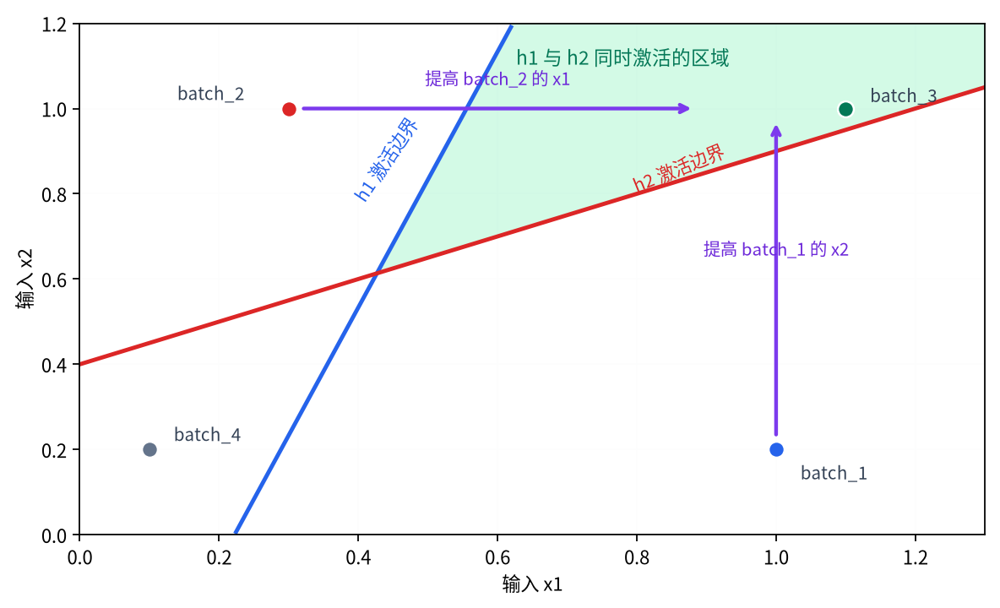

# P5-2.1 多层神经网络（multilayer neural network）

Section ID: `P5-2.1`
Version: `v2026.07.17`

在 P5-1.2 里，我们已经看到：单个感知机（perceptron）会通过输入的线性组合（linear combination）与激活（activation）来形成判断。同时也看到，单个感知机一次只能形成一条线性边界（linear boundary），因此它能表达的模式存在明显限制。接下来的问题自然会变成：`如果一个感知机不够，那么把这样的计算单元堆叠多个，会发生什么变化？` 从这个问题出发，就进入多层神经网络（multilayer neural network）。多层神经网络会把感知机这类计算单元按多层堆起来，把简单的输入组合先变成中间表征，再把这些表征连到更复杂的判断上。

如果需要重新固定多层结构与中间层的区别，更适合一起回看[英文概念词汇表里的 multilayer neural network 条目](/AiBook/en/reference/concept-glossary/#multilayer-neural-network)与[hidden layer 条目](/AiBook/en/reference/concept-glossary/#hidden-layer)。

## 本节范围

本节整理以下问题。

- 为什么单个感知机不够？
- 说“再多堆几层（layer）”到底是什么意思？
- 输入层（input layer）、隐藏层（hidden layer）、输出层（output layer）应该怎样分别来读？
- 多层结构能形成更复杂表征，这句话具体是什么意思？
- 为什么多层神经网络会被当成深度学习（deep learning）的起点？

关于隐藏层到底可以形成什么样的表征，会在 P5-2.2 里继续；激活函数的比较会在 P5-3.1 到 P5-3.5 再重新连接；反向传播（backpropagation）的计算公式则会在 P5-5.1 与 P5-5.2 里回来看。也就是说，这一节先要抓住的是：当层数增加时到底什么发生了变化，以及为什么会需要隐藏层。

## 本节目标

- 能把多层神经网络解释成`由多个感知机按层堆叠起来的结构`。
- 能说明隐藏层（hidden layer）承担的是输入与输出之间的中间表征。
- 能理解为什么多层结构比单个感知机能表达更复杂的边界与模式。
- 能解释 Part 4 的线性模型与 Part 5 的深层模型是从哪里开始分岔的。

## 为什么要继续加层

单个感知机已经是有用的计算单元。

- 它接收输入。
- 它形成加权和。
- 它经过激活后给出输出。

问题在于，只靠这样一个单元，很难表达复杂模式。

例如在真实问题里，经常会出现下面这种情况。

- 输入特征（feature）并不是简单地被一条直线分开。
- 重要条件需要经过多个阶段组合才能显现。
- 低层级信号需要先聚成一组，再被重新组合成更大的意义。

也就是说，如果让单个感知机直接承担`最终判断`，它就会被迫一次做太多事。

多层神经网络会把这个问题在结构上拆开。

1. 第一层先形成小组合。
2. 中间层把这些组合再次汇总。
3. 最后一层把它们接到最终判断。

把它换成一个小型生产批次异常判断的场景，会更容易看出差别。如果只用一个感知机直接读取 `x1` 高和 `x2` 高这两件事，它们很容易都先被压进`同一个分数该往哪一边偏`的问题里。相反，只要把层分开，前一层就可以先分别留下`信号 A 是否先亮起`与`信号 B 是否先亮起`，后一层再去判断`这两个信号是否同时出现`并把它接到最终结论。换句话说，多层结构的核心不在于输入变多，而在于它让你不必把两个输入立刻压成一个分数，而能在中间先区分`需要分开看的组合`与`需要一起看的组合`。

## 用一个场景看多层神经网络

```mermaid
--8<-- "assets/part-05/chapter-02/multilayer-network-flow-zh.mmd"
```

这张图最核心的点是：层（layer）增加时，并不是单纯计算变多了，而是开始出现`中间表征（intermediate representation）`。

也就是说，多层神经网络不会把最初输入原封不动送到最终判断，而是会在中间多次重新表达（representation）。

## 输入层、隐藏层、输出层有什么不同

层名本身容易显得抽象，所以先按角色来拆开看。

| 层 | 英文 | 简单角色 |
| --- | --- | --- |
| 输入层 | input layer | 接收原始数值的入口 |
| 隐藏层 | hidden layer | 把输入改写成中间特征的计算区间 |
| 输出层 | output layer | 产生最终预测或分数的最后区间 |

这里尤其重要的是隐藏层（hidden layer）。

隐藏层并不是`人类提前命名好的特征列表`，而是模型在计算过程中自己形成并使用的中间表征。正因为这一点，神经网络才会走上与 Part 4 传统模型不一样的方向。

## 为什么叫 hidden

因为有 `hidden` 这个名字，读者很容易把隐藏层理解成什么神秘空间。但这里的 hidden 并不表示神秘，而更接近于`既不是输入，也不是最终输出的中间计算层`。

也就是说：

- 输入层是我们直接看到的值。
- 输出层是我们最终直接读取的结果。
- 隐藏层则是模型在中间内部使用的表征。

所以，隐藏层往往很难让人直接说出`这个节点精确地对应什么意义`。与其这样理解，不如说我们真正关心的是：`这一层到底有没有形成更有用的中间表征。`

## 为什么会变得能表达更复杂的东西

单个感知机会把输入做一次线性组合后立刻判断。相反，在多层结构里，一层的输出会成为下一层的输入。

这句话意味着：

- 第一层形成的组合
- 会被第二层当作新的输入重新接收
- 并且再被组合成更大的模式

如果用图像作直觉类比，可以先这样理解。

- 很低层：线条、边缘、亮度差
- 下一层：小型形状碎片
- 更高层：更大的局部结构
- 最后一层：更接近具体物体的判断

当然，这一节还不会直接讲 CNN（convolutional neural network）。CNN 的具体结构会在后面的 P5-11.1 里重新展开。但从现在开始，`小组合继续堆成大组合`这个感觉就必须先抓住。

## 用表格型比喻来看多层结构

即使是表格型数据，也会发生类似的事情。

例如，可以想象一份生产线批次数据。

- 输入值：微停次数、温度偏离持续时间、压力波动、返工呼叫次数
- 第一隐藏层：像热负荷、运行不稳定性、质量风险这样的中间组合
- 下一层：更大的状态模式组合
- 输出层：像能否继续正常运行、是否需要异常干预这样的最终预测

比如说，产量暂时还维持住了，但温度偏离时间越来越长，返工呼叫次数也在上升。人很容易先把四个数字分别读成四件事，但实际上更常做的，是把它们一起读成`表面产量还在维持，但内部不稳定正在放大的一批`。如果只直接比较输入值，就很容易错过这种组合信号，而且完全不同的数值组合也可能指向同一种批次状态。隐藏层正好可以被理解成这样一个位置：它会在内部把这些中间组合先做出来。当然，更重要的是，隐藏层本身并不真的知道什么叫`热负荷`。那只是为了帮助直觉的说明；实际发生的是，模型通过多组权重组合在内部形成某种中间表征。

人先做的阅读通常大致有三种。第一，是逐项去看输入值，分别判断`微停次数是不是多了`、`返工呼叫是不是增加了`。第二，是立刻贴上某个单条规则，比如`温度偏离时间长就危险`。第三，是先去看最终标签，比如`正常`还是`需要干预`。

多层结构会改变这种阅读方式。它不会只分别看输入，而是先去看多个输入一起形成的中间组合；它也不会靠单条规则立刻下结论，而是让前层先形成小组合，再让后层重新把这些小组合归成更大的状态判断。因此，比起只盯着最终标签，多层结构更容易让你从中间表征的层级去追踪`为什么会出现这样的干预判断`。

## 案例与例子

### 案例 1. 生产批次异常组合判断

先想一个生产批次异常组合判断的场景。人一开始通常会分别看`温度偏离时间是不是变长了`、`返工呼叫是不是增加了`、`压力波动是不是更大了`这些单条规则。但实际上，很多时候只有当这几个条件一起出现时，干预必要性才会真正升高。比如说，产量还维持着，但温度偏离时间变长，同时返工呼叫也增加了，那么比起某一条规则本身，更关键的是把它读成`热负荷 + 运行不稳定性`这种中间组合。多层结构正是用来说明这一点：一层先形成这些小信号组合，下一层再把它们归到更大的状态判断里。所以在这个案例里，要确认的结果不是某一个规则够不够，而是多个信号一起出现时形成的中间组合，是否更清楚地把“需要干预”和“不需要干预”区分开。

| 批次状态 | 人最容易先给出的判断 | 重新按中间组合来读 | 更安全的下一步判断 |
| --- | --- | --- | --- |
| 产量维持，温度偏离变长，返工呼叫增加 | 产量还在，所以问题不大 | 热负荷与运行不稳定同时出现 | 先看组合信号，而不是只看单一指标 |
| 产量一般，压力波动增加，没有返工呼叫 | 这可能只是暂时波动 | 有不稳定迹象，但质量风险信号还弱 | 不立刻断定异常，继续看其他信号 |
| 产量下降，温度偏离变长，返工呼叫增加 | 所有数字都很差 | 多个风险信号往同一方向叠加 | 优先列入需要干预的对象 |

```mermaid
--8<-- "assets/part-05/chapter-02/production-batch-hidden-flow-zh.mmd"
```

这张图只是把刚才案例中的判断顺序再压缩一遍：同样的批次信号，到底会走向`先盯一个指标`，还是走向`先看多个信号形成的隐藏组合`。它不是为了增加新理论，而是帮助重新按刚才的阅读顺序再走一遍。

### 案例 2. 设备图像识别的初步直觉

在设备图像识别里，也会发生类似的事。人看一张照片时，脑中很快会跳出`混合罐`、`管线模块`、`控制箱画面`这类最终标签。但实际上，在此之前，像阀门轮廓、警示灯位置、金属边缘线这类小线索往往已经先被看到了。只靠一个感知机，很难把这些小线索一次性全处理干净；但在多层结构里，前层可以先形成小形状组合，后层再把这些组合拼成更大的设备线索。例如，先抓到阀门把手与管线弯曲模式，再进一步组合成罐体轮廓与连接结构。于是这一案例里需要确认的结果就是：只有先经过小线索组合，最终标签的区分才会更稳定地显出来。

| 先出现的线索 | 前层形成的小组合 | 后层重新读出的更大线索 |
| --- | --- | --- |
| 阀门把手轮廓、管线弯曲 | 构成设备局部的小模式 | 更大的设备连接结构，如罐体连接部 |
| 警示灯边界、控制箱边角 | 构成控制装置的部分结构 | 更稳定的标签候选，如带报警装置的设备场景 |
| 管线支撑线段、罐体边界 | 管线模块的局部线索 | 更接近完整管线模块的判断 |

看到一张照片时，人很容易想直接从画面跳到最终标签。但在多层结构视角下，更关键的是先形成小线索，再把这些线索重新组织成更大的结构。阀门、警示灯、管线这些东西，本身还不是最终标签，而只是前层要处理的材料。最终标签会取决于这些线索组合在后层里是怎样一起亮起来的。

把这两个案例压成一句话，多层神经网络的核心是一样的。

`它不会把输入直接送进最终判断，而是先经过中间组合，再被整理成更大的模式。`

如果把这两个案例再一起压缩一遍，那么阅读多层结构的第一条流程可以写成下面这样。

```mermaid
--8<-- "assets/part-05/chapter-02/multilayer-combination-bridge-zh.mmd"
```

这张图并不是要分别重复解释案例 1 的生产批次组合和案例 2 的设备图像线索，而是为了把它们共同展示的那条流程重新抓住：`先形成小组合，再把这些组合重新汇成更大的判断。`

## 单个感知机与多层结构的对比

```mermaid
--8<-- "assets/part-05/chapter-02/single-vs-multilayer-flow-zh.mmd"
```

左边会把输入特征直接压成一次线性分数和一次激活，然后立刻接到最终判断上。因此，就算有很多信号，它们也很容易先被压到同一个分数里。右边则不一样：输入特征会先被整理成小组合，再变成更大的组合，最后才通向最终判断。人会觉得这两种结构都只是`把输入送进去然后吐出答案`，所以看起来差不多；但真正的差别其实在于：`中间能不能形成新的组合。` 深度学习最重要的变化之一，正是它能够让这种`中间表征在多个阶段里被学习出来`。

## 为什么多层结构会被视为深度学习的起点

多层神经网络之所以如此重要，是因为从这里开始，模型不再停留在单一线性边界，而开始进入`表征学习（representation learning）`。

Part 4 的很多传统模型，主要还是基于人类先定义好的特征（feature）来学习。当然它们也可以做组合与切分，但`沿着多个层次去学习中间表征`这种感觉相对较弱。

相比之下，多层神经网络会：

- 不直接照搬原始输入，
- 而是在内部逐层改变表征，
- 并且逐步形成更利于最终判断的结构。

因此，多层结构才会看起来像深度学习真正开始的地方。

如果把这个差异再压缩到“学习责任”这个角度，会更清楚。Part 4 的传统模型更多是由人来决定：该给模型什么特征、用什么规则去切。到了 P5-2.1 的多层结构时，输入与输出先固定下来，而`中间应该形成什么表征`这件事则开始更多交给模型自己去做。所以这节里最该先固定的，也不是`一条线性边界是不是够了`，而是`一旦中间表征出现，某种模式说明会不会在中间这一层更容易闭合。`

## 练习与例题

这个例子的目标，是直接观察：当多个输入经过同一套层结构时，隐藏层（hidden layer）的模式会怎样分开，这种差异又会怎样连到最终输出。尤其这次不是一次改很多值，而是每一步只动一个值，让你能顺着`输入变化 -> 隐藏层变化 -> 最终判断变化`一路看下去。

输入：

- 四个拥有两个输入特征（feature）的生产批次

输出：

- 每个批次对应的隐藏层节点值
- 每个批次对应的最终输出

问题场景：

- 两个输入不会直接走到最终判断，而是要先经过隐藏层，再变成不同的异常组合
- 如果一次改很多值，很容易看不清到底在哪一步翻转，因此这次只允许一次改一个值

要确认的概念：

- 多层感知机不会把输入直接送到输出，而是会多经过一次中间节点计算
- 即便最终输出相同或不同，也必须连同前面的隐藏层模式一起看，层的作用才会更清楚

输入（input）：

先看下面四个批次，猜一猜：哪些批次更像是`两个隐藏节点都会一起亮起`的情况。然后再用隐藏层与输出层的权重去检查结果。

最好先不要直接看代码，而是先自己判断一遍。

| 批次 | 先试着猜的问题 | 对最终输出的直觉 |
| --- | --- | --- |
| `(1.0, 0.2)` | 只会亮起第一个隐藏节点，还是两个都会亮？ | 如果只亮起热负荷那一侧，最终判断应该还偏弱 |
| `(0.3, 1.0)` | 会不会第二个隐藏节点先亮？ | 隐藏模式不同，但最终输出可能还会是 0 |
| `(1.1, 1.0)` | 两个信号都很大，会不会两个隐藏节点一起亮？ | 如果两个组合都被抓到，最终很可能转成 1 |
| `(0.1, 0.2)` | 会不会几乎没有形成隐藏表征就结束？ | 如果隐藏表征很弱，最终大概率仍停在 0 |

先跑下面四个基础批次，然后再按顺序做下面三步。

1. 只提高 `batch_2` 的 `x1`，看看两个隐藏节点会不会同时亮起。
2. 只提高 `batch_1` 的 `x2`，看看从另一种起点出发时，是否也会形成同样的 `(1, 1)` 组合。
3. 保持 `batch_2` 的输入不变，只改输出层偏置，看看在隐藏层不变时，最终判断会不会自己改变。

```python
def step(z):
    return 1 if z > 0 else 0

def run_batch(x1, x2, output_bias=-0.9):
    # hidden layer
    h1 = step(x1 * 0.9 + x2 * -0.3 - 0.2)
    h2 = step(x1 * -0.5 + x2 * 1.0 - 0.4)

    # output layer
    output = step(h1 * 0.7 + h2 * 0.7 + output_bias)
    return h1, h2, output

batches = [
    ("batch_1", 1.0, 0.2),
    ("batch_2", 0.3, 1.0),
    ("batch_3", 1.1, 1.0),
    ("batch_4", 0.1, 0.2),
]

for name, x1, x2 in batches:
    h1, h2, output = run_batch(x1, x2)
    print(
        f"{name}: input=({x1}, {x2}), "
        f"hidden=({h1}, {h2}), output={output}"
    )

print("\nfollow-up experiments")
experiments = [
    ("step_1: raise batch_2 x1", 0.9, 1.0, -0.9),
    ("step_2: raise batch_1 x2", 1.0, 1.0, -0.9),
    ("step_3: loosen only output rule", 0.3, 1.0, -0.5),
]

for label, x1, x2, output_bias in experiments:
    h1, h2, output = run_batch(x1, x2, output_bias=output_bias)
    print(
        f"{label}: input=({x1}, {x2}), "
        f"output_bias={output_bias}, hidden=({h1}, {h2}), output={output}"
    )
```

在输出里，先逐行比较每个 `input` 是通过什么样的 `hidden` 模式走向 `output` 的。

```text
batch_1: input=(1.0, 0.2), hidden=(1, 0), output=0
batch_2: input=(0.3, 1.0), hidden=(0, 1), output=0
batch_3: input=(1.1, 1.0), hidden=(1, 1), output=1
batch_4: input=(0.1, 0.2), hidden=(0, 0), output=0

follow-up experiments
step_1: raise batch_2 x1: input=(0.9, 1.0), output_bias=-0.9, hidden=(1, 1), output=1
step_2: raise batch_1 x2: input=(1.0, 1.0), output_bias=-0.9, hidden=(1, 1), output=1
step_3: loosen only output rule: input=(0.3, 1.0), output_bias=-0.5, hidden=(0, 1), output=1
```

如果把输入变化放到输入平面上看，会更直接地看出隐藏层模式到底怎么变。



这张图里，绿色区域表示在默认输出层偏置 `-0.9` 下，`h1` 与 `h2` 同时亮起并最终得到输出 `1` 的输入区域。`batch_2` 一开始停在 `(0, 1)` 模式，但只要提高 `x1`，它就会进入绿色区域；`batch_1` 也是一样，只要把 `x2` 提高，就会移动到同样的 `(1, 1)` 组合。相反，第三步那种只改输出层偏置的实验并不会让输入坐标移动，因此更适合在图下用文字单独解释。

- `batch_1` 与 `batch_2` 的最终输出虽然都是 `0`，但隐藏层模式分别是 `(1, 0)` 与 `(0, 1)`，并不相同。
- 只有 `batch_3` 会让两个隐藏节点同时亮起，从而把最终输出推到 `1`。
- `batch_4` 几乎没有形成隐藏表征，因此最终输出也仍停在 `0`。
- 在后续实验里，可以分开看：究竟是输入变化先改写了 `hidden`，还是输出规则的变化先改写了 `output`。

如果把`即使最终输出相同，内部计算也可能不同`这件事再用表格抓一次，会更清楚。

| 批次 | hidden 模式 | output | 现在应当先抓住的点 |
| --- | --- | --- | --- |
| batch_1 | `(1, 0)` | `0` | 只出现第一种组合时，最终判断还没闭合 |
| batch_2 | `(0, 1)` | `0` | 即便另一种组合亮起，也可能仍不够形成最终翻转 |
| batch_3 | `(1, 1)` | `1` | 当两个组合一起亮起时，最终判断被翻转 |
| batch_4 | `(0, 0)` | `0` | 如果中间表征几乎没有，最终结果也不会改变 |

如果重新执行同一段代码，只把 `batch_2` 的 `x1` 从 `0.3` 提高到 `0.9`，就会看到 `hidden=(0, 1)` 变成 `hidden=(1, 1)`，最终输出也从 `0` 变成 `1`。也就是说，多层神经网络真正拥有的是`输入 -> 中间表征 -> 最终判断`这条结构，而中间表征本身就是关键计算材料。

接着立刻看下面三步后续实验，会更容易把两种变化分开：`什么输入变化会改写隐藏层`，以及`即便隐藏层不变，只改最终规则又会怎样`。

| 步骤 | 直接改动的值 | 先看哪个输出 | 要问的解读问题 |
| --- | --- | --- | --- |
| 1 | 把 `batch_2` 的 `x1` 从 `0.3` 提高到 `0.9` | `hidden=(0, 1)` 会不会变成 `hidden=(1, 1)` | 为什么只加大第一种信号，就足以连最终输出一起翻转？ |
| 2 | 把 `batch_1` 的 `x2` 从 `0.2` 提高到 `1.0` | 原本 `(1, 0)` 的模式会不会扩展成 `(1, 1)` | 换一条起点路径时，第二种信号的加入也会形成同一组合吗？ |
| 3 | 保持 `batch_2` 输入不变，只把输出层偏置从 `-0.9` 改成 `-0.5` | 在仍是 `hidden=(0, 1)` 的情况下，`output` 会不会变成 `1` | 即使中间表征不变，只要最终判断基准变松，结果也会改变吗？ |

这三步实验会把两类变化拆开。

- 第 1 步和第 2 步展示的是：当输入变化时，隐藏层会开始形成什么新组合。
- 第 3 步展示的是：即便中间表征没变，只要最后的判断规则变松，最终结果也会跟着变。

第 1 步和第 2 步说明：即使出发批次不同，只要两个隐藏节点一起被点亮，最终判断就会翻转。相反，在第 3 步里，`hidden=(0, 1)` 保持不变，却因为输出层标准放松而使最终输出转成 `1`。只要看清这件事，就会更明确地明白：在多层神经网络里，`形成中间表征的规则`与`用这个表征形成最终判断的规则`是需要分开读的。

在 Part 5 里，真正需要把多层神经网络拿出来讲的时刻，就是当你已经理解了单个感知机的计算，却发现`只靠一次线性判断，模式说明仍然闭合不了`的时候。

| 最先看到的问题场景 | 为什么先用多层结构视角更有用 | 下一步马上该接的问题 |
| --- | --- | --- |
| 多个输入信号必须分阶段组合 | 比起一次打成一个分数，把组合分散到多个层里更自然 | 接着要看这些中间组合到底形成了什么表征 |
| 一条线性边界不足以分开模式 | 它直接展示了为何要通过扩展结构越过单个感知机的限制 | 接着还得看为什么需要非线性与激活函数 |
| 在表格数据或图像里，先需要形成小线索组合 | 它说明了为什么输入不能立刻送进最终判断，而要先形成中间材料 | 接着要更具体地看隐藏层到底在内部“重写”了什么 |
| 需要解释 Part 4 的线性模型与 Part 5 的深度学习结构从哪里分开 | 它最先暴露出`中间表征可以被学习`这件事 | 这时已经可以为后面的 representation learning 做准备 |

这一节最核心的，不是层数本身，而是`中间表征开始出现`。因此紧接着的 P5-2.2，就会继续问：`隐藏层到底学到了什么？`、`为什么这种中间表征有用？`、`层加深时表征到底会怎么变化？` 这里所说的下一个问题，并不是深度（depth）与宽度（width）的理论比较，而只限于继续阅读多层结构怎样改写中间表征。

| 当前这一节先要抓住的东西 | 紧接着要继续的问题 | 后面还会再连回来的学习流程轴 |
| --- | --- | --- |
| 输入通过隐藏层被改写成更大组合 | 这些隐藏层具体可以被理解成什么样的表征 | 损失、反向传播、optimizer 会怎样改写这些表征 |

## 检查清单

- 能否解释为什么多层神经网络比单个感知机更适合处理复杂模式？
- 能否说明输入层、隐藏层、输出层是怎样连成一条流程的？
- 能否解释多层神经网络就是把感知机这类计算单元按多层堆起来的结构？
- 能否说明隐藏层（hidden layer）承担的是输入与输出之间的中间表征？
- 能否说明一层的输出会成为下一层的输入，因此多层结构能够表达比单个感知机更复杂的模式与边界？
- 能否按`计算角色`而不是按`数据位置`来区分输入层、隐藏层、输出层？
- 当只靠单个感知机无法闭合说明、看起来需要更复杂的模式组合时，能否先想到多层结构视角？
- 是否知道：只解释多层结构本身，还不足以彻底闭合激活函数与非线性的角色，这部分要交给下一章？

## 出处与参考资料

- Ian Goodfellow, Yoshua Bengio, Aaron Courville, `Deep Learning`, MIT Press, 2016, 确认日期：2026-06-28. [https://www.deeplearningbook.org/](https://www.deeplearningbook.org/){: target="_blank" rel="noopener noreferrer" }
- Yann LeCun, Yoshua Bengio, Geoffrey Hinton, `Deep learning`, Nature, 2015, 确认日期：2026-06-28. [https://www.nature.com/articles/nature14539](https://www.nature.com/articles/nature14539){: target="_blank" rel="noopener noreferrer" }
- George Cybenko, `Approximation by Superpositions of a Sigmoidal Function`, Mathematics of Control, Signals, and Systems, 1989, 确认日期：2026-06-28.
