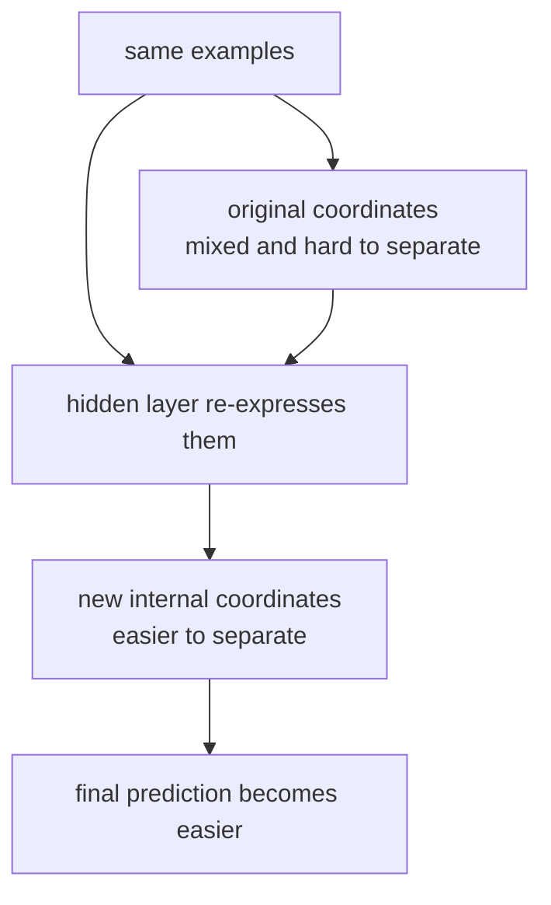

# P5-2.2 은닉층(hidden layer)과 표현

Section ID: `P5-2.2`
Version: `v2026.07.09`

P5-2.1에서는 다층 신경망(multilayer neural network)이 퍼셉트론 같은 계산 단위를 여러 층으로 쌓아, 입력을 바로 최종 판단으로 보내지 않고 중간 단계를 거치게 만든다는 점을 보았습니다. 이제 질문을 조금 더 구체적으로 바꿔 봅니다.

그 중간 단계에서는 도대체 무엇이 만들어지고 있는가?

이 질문에 답하려는 관점이 바로 표현(representation)입니다. 은닉층은 입력값을 그대로 복사하는 곳이 아니라, 이후 판단에 더 유리한 중간 표현을 내부적으로 만들어 가는 층입니다.

표현 개념을 뒤 장에서 다시 짧게 복습해야 할 때는 개념사전의 [표현(representation)](../../../reference/concept-glossary.md#representation) 항목을 기준으로 돌아옵니다.

## 이 절의 범위

이 절은 다음 질문을 정리합니다.

- 은닉층(hidden layer)은 왜 단순한 중간 계산 이상으로 중요하게 다뤄지는가?
- 표현(representation)을 학습한다는 말은 무엇인가?
- 층이 깊어질수록 더 추상적인 표현이 생긴다는 말은 어떤 뜻인가?
- 은닉층을 사람이 읽기 쉬운 이름으로 바로 해석해도 되는가?
- 왜 딥러닝을 representation learning과 연결해 설명하는가?

이 절에서는 다음 내용을 깊게 다루지 않습니다.

- attention 기반 표현의 상세 구조
- CNN에서의 필터 시각화
- 임베딩(embedding)의 수학적 성질
- 해석 가능성(interpretability) 연구의 세부 기법

표현 학습(representation learning)이라는 더 큰 흐름은 P5-10.1, P5-10.2에서 다시 확장합니다. CNN에서의 필터와 공간 표현은 P5-11.1, P5-11.2에서, attention 기반 표현은 P5-13.1, P5-13.2와 P5-14.1, P5-14.2에서 다시 연결합니다. 해석 가능성(interpretability) 연구의 세부 기법은 이 책의 현재 본편 범위 밖에 둡니다.

## 이 절의 목표

- 은닉층을 `입력과 출력 사이의 표현 변환 층`으로 설명할 수 있습니다.
- 표현(representation)을 `원래 입력을 다시 담는 내부 좌표계`처럼 이해할 수 있습니다.
- 층이 깊어질수록 더 복잡하고 추상적인 표현을 만들 수 있다는 점을 말할 수 있습니다.
- 은닉층의 각 노드에 사람식 이름을 무리하게 붙이면 오해가 생길 수 있다는 점을 이해할 수 있습니다.

## 왜 은닉층이 중요한가

Part 4의 전통적인 머신러닝에서는 사람이 직접 특징(feature)을 고르는 경우가 많았습니다.

- 고객 나이
- 구매 금액
- 최근 방문일
- 클릭 수

이런 특징을 사람이 정리해서 모델에 넣습니다. 모델은 그 위에서 회귀나 분류를 합니다.

하지만 딥러닝에서는 질문이 달라집니다.

`유용한 특징을 사람이 다 직접 써 주지 않고, 모델이 중간 표현을 내부에서 만들어 가게 할 수는 없을까?`

이 지점에서 은닉층이 중요해집니다. 은닉층은 입력을 그대로 넘기는 통로가 아니라, 이후 판단에 더 쓸모 있는 내부 표현을 형성하는 자리로 읽을 수 있습니다.

즉, 딥러닝은 `판단 함수`를 학습하는 일일 뿐 아니라, `판단에 유리한 표현`까지 함께 학습하는 일로 보이기 시작합니다.

## 표현(representation)은 무엇을 뜻하나

representation이라는 말은 독자에게 추상적으로 들릴 수 있습니다. 여기서는 먼저 다음처럼 이해합니다.

`표현은 같은 대상을 모델 내부에서 다시 적어 놓는 방식이다.`

예를 들어 고객 데이터를 원래는 네 개 숫자로 넣었다고 생각해 봅니다.

- 방문 수
- 구매 금액
- 문의 횟수
- 최근 활동일

은닉층을 지나면 모델은 이를 그대로 들고 있지 않을 수 있습니다. 대신 내부적으로는 다음과 비슷한 조합을 더 잘 쓰는 방향으로 바꿔 둘 수 있습니다.

- 활동성 비슷한 내부 축
- 이탈 위험 비슷한 내부 축
- 구매 성향 비슷한 내부 축

물론 실제로 노드 이름이 이렇게 붙는 것은 아닙니다. 하지만 독자 직관으로는 `원래 입력을 더 유용한 내부 좌표계로 다시 적는다`고 이해합니다.

## 내부 좌표계라는 말은 왜 유용한가

표현을 내부 좌표계(internal coordinate system)로 비유하면 은닉층의 역할이 더 잘 보입니다.

- 원래 입력 좌표계에서는 구분이 어려운 대상이
- 은닉층을 거친 새 좌표계에서는 더 잘 분리될 수 있습니다.

즉, 은닉층은 단순 계산이 아니라 `문제를 더 풀기 쉬운 좌표계로 바꾸는 과정`처럼 볼 수 있다.

이를 아주 간단히 줄이면 다음과 같습니다.



이 도식의 핵심은 `데이터가 바뀌는 것`이 아니라 `같은 데이터를 보는 내부 표현 방식이 바뀐다`는 점입니다. 원래 좌표계에서는 뒤섞여 보이던 예시들이, 은닉층을 지난 뒤에는 더 나누기 쉬운 좌표계로 다시 적힐 수 있기 때문에 `내부 좌표계`라는 말이 유용합니다.

## 층이 깊어질수록 무엇이 달라지나

딥러닝에서 자주 등장하는 설명은 `낮은 층은 더 단순한 특징을, 높은 층은 더 추상적인 특징을 잡는다`는 말입니다.

이 문장을 아주 조심스럽게 읽어야 합니다.

이 말은 보통 다음 뜻에 가깝습니다.

- 앞쪽 층은 작은 조합이나 지역 패턴을 먼저 포착할 수 있고
- 뒤쪽 층은 그 조합들을 다시 묶어 더 큰 패턴이나 더 문제 중심적인 표현으로 바꿀 수 있다

예를 들어 이미지에서는 흔히 다음처럼 설명합니다.

| 층 수준 | 직관적 설명 |
| --- | --- |
| 앞쪽 층 | 선, 모서리, 밝기 변화 같은 작은 패턴 |
| 중간 층 | 간단한 모양 조합 |
| 뒤쪽 층 | 더 큰 부분 구조나 분류에 가까운 표현 |

텍스트나 표 데이터도 마찬가지 감각으로 읽을 수 있습니다. 물론 실제로 어떤 층이 무엇을 잡았는지는 모델 구조와 데이터에 따라 달라집니다. 중요한 것은 `층을 거치며 점점 더 문제에 유리한 내부 표현이 구성될 수 있다`는 점입니다.

## 은닉층을 너무 쉽게 해석하면 왜 위험한가

독자는 은닉층의 각 노드에 `이건 활동성`, `이건 위험도`, `이건 얼굴의 눈`처럼 곧바로 이름을 붙이고 싶어질 수 있습니다. 하지만 이런 해석은 조심해야 합니다.

은닉층의 표현은 종종 다음 특징을 가집니다.

- 하나의 노드가 한 의미만 담당하지 않을 수 있습니다.
- 여러 노드가 함께 하나의 성질을 표현할 수 있습니다.
- 사람이 직관적으로 읽기 어려운 분산 표현(distributed representation)일 수 있습니다.

즉, 은닉층은 사람이 만든 명시적 규칙표가 아니라, 여러 값이 함께 정보를 나누어 담는 내부 공간일 수 있습니다.

이 때문에 representation learning은 강력하지만, 동시에 해석이 어려워질 수 있습니다.

## distributed representation이 왜 중요한가

딥러닝 문헌에서 representation learning이 중요하게 다뤄지는 이유 중 하나는 분산 표현(distributed representation)입니다.

다음처럼 이해합니다.

`중요한 정보가 하나의 노드에만 들어가는 것이 아니라, 여러 노드의 조합으로 나누어 표현될 수 있다.`

예를 들어 어떤 입력의 성질을 하나의 노드가 전부 대표하는 대신:

- 노드 A는 일부 경향
- 노드 B는 다른 일부 경향
- 노드 C는 둘의 조합에서만 의미가 살아나는 신호

처럼 정보를 나누어 가질 수 있습니다.

이런 구조 때문에 신경망은 표현력이 커지지만, 동시에 사람이 “이 한 칸이 정확히 무엇이다”라고 단정하기 어려워집니다.

## Part 4와 비교하면 무엇이 달라지는가

Part 4의 전통적인 모델에서도 특징 조합은 있었습니다. 하지만 대체로 사람은 다음을 더 직접 통제합니다.

- 어떤 특징을 넣을지
- 어떤 전처리를 할지
- 어떤 거리나 분할 규칙을 쓸지

반면 다층 신경망에서는 모델 내부가 유용한 중간 표현을 더 많이 떠맡습니다.

즉, 비교를 아주 단순화하면:

| 관점 | 전통적인 머신러닝 | 다층 신경망 |
| --- | --- | --- |
| 특징 설계 | 사람이 많이 정한다 | 모델이 더 많이 내부에서 만든다 |
| 중간 표현 | 상대적으로 약하다 | 은닉층이 핵심 역할을 한다 |
| 설명 초점 | 문제와 특징 설계 | 표현 학습과 층 구조 |

이 차이가 Part 5 이후 전체를 관통합니다.

## 사례 및 예시

### 사례 1. 손글씨 숫자 분류

은행 창구에서 손글씨 숫자를 읽어 금액을 입력하는 보조 모델을 떠올립니다. 사람은 처음에는 픽셀을 그대로 보지 않고 `둥근가`, `세로선이 있는가`, `윗부분이 닫혀 있는가` 같은 중간 기준을 머릿속에서 먼저 세웁니다. 간단한 손글씨 숫자 분류도 이런 장면과 닮아 있습니다.

원래 입력은 픽셀 값들의 긴 목록일 수 있습니다. 하지만 모델은 픽셀 하나하나만 보고 바로 숫자를 맞히지 않을 수 있습니다. 예를 들어 3과 8은 모두 둥근 곡선을 가져 초반에는 꽤 비슷하게 보일 수 있습니다. 은닉층을 지나며 다음과 같은 내부 표현이 점점 만들어질 수 있습니다.

- 특정 방향의 선이 있는가
- 둥근 곡선이 있는가
- 위쪽이 닫혀 있는가
- 아래로 길게 내려가는가

물론 이것도 사람이 붙인 직관적 설명일 뿐입니다. 실제 내부 표현은 더 복잡하고 분산적일 수 있습니다. 하지만 이 비유는 은닉층이 원시 입력(raw input)을 그대로 두지 않고, 더 유용한 표현으로 바꾸어 간다는 점을 잘 보여 줍니다.

즉, 다층 구조는 `픽셀을 바로 정답으로 보내는 것`보다 `중간 판단 재료를 먼저 만든 뒤 최종 판단으로 보내는 것`에 가깝습니다. 이 점이 퍼셉트론 하나와 다층 구조를 가르는 가장 중요한 차이입니다. 그래서 이 사례에서 확인해야 할 결과는 픽셀 목록을 곧바로 분류하는 관점보다, 중간 표현을 거쳐 최종 판단으로 가는 관점이 왜 필요한지 실제로 설명할 수 있는가입니다.

### 사례 2. 고객 상태 표현

표 데이터에서도 비슷한 일이 일어납니다. 예를 들어 고객 데이터에 방문 수, 구매 금액, 최근 활동일, 문의 횟수가 함께 들어 있다고 둡니다. 사람은 처음에는 숫자 네 개를 각각 따로 보고 `이 고객은 괜찮다`, `이 고객은 위험하다`처럼 판단하려 할 수 있습니다. 하지만 실제로는 방문 수는 높아도 최근 활동일이 멀고 문의 횟수까지 늘었을 때처럼, 여러 신호가 함께 나타날 때만 중요한 상태가 드러나는 경우가 많습니다. 은닉층은 이런 입력을 그대로 복사하지 않고 `활동은 있었지만 이탈 위험이 커진 상태` 같은 더 유용한 내부 표현으로 다시 적는 방향으로 작동합니다. 그래서 이 사례에서 확인해야 할 결과는 원래 숫자 열을 따로 보는 것보다, 여러 신호가 묶인 내부 표현 쪽이 고객 상태를 더 잘 가르는가입니다.

이 두 사례를 한 줄로 묶으면 다음과 같습니다.

`은닉층은 원래 입력을 바로 판단하지 않고, 더 나누기 쉬운 내부 표현으로 다시 적는 층이다.`

## 연습 및 예제

이번 예제의 목표는 서로 다른 입력이 은닉층을 지나며 어떤 내부 표현으로 바뀌는지, 그리고 그 차이가 최종 점수에 어떻게 연결되는지 비교하는 것입니다.

입력:

- 두 입력 특징(feature)을 가진 샘플 3개

출력:

- 샘플별 은닉 표현
- 샘플별 최종 점수

문제 상황:

- 연속값을 다루는 다층 퍼셉트론에서는 step 함수 대신 ReLU 같은 활성화가 중간 표현을 어떻게 바꾸는지 확인해야 한다

확인할 개념:

- 은닉층 표현은 단순 합이 아니라 활성화 함수를 거친 뒤 만들어진다
- 최종 점수는 중간 표현이 어떤 값을 남겼는지에 따라 달라진다

입력(input):

위에 정리한 세 샘플과 ReLU를 거치는 은닉층·출력층 가중치를 사용합니다.

```python
def relu(z):
    return max(0.0, z)

samples = [
    (1.0, 0.2),
    (0.3, 1.1),
    (1.2, 0.8),
]

for idx, (x1, x2) in enumerate(samples, start=1):
    h1 = relu(x1 * 0.9 + x2 * 0.1 - 0.2)
    h2 = relu(x1 * -0.3 + x2 * 1.2 + 0.1)
    score = h1 * 0.8 + h2 * 0.4 - 0.1

    print(
        f"sample_{idx}: input=({x1}, {x2}), "
        f"hidden=({round(h1, 3)}, {round(h2, 3)}), "
        f"score={round(score, 3)}"
    )
```

출력에서는 같은 input이 hidden 두 축에서 어떻게 다시 표현되고, 그 위에서 score가 어떻게 계산되는지부터 봅니다.

```text
sample_1: input=(1.0, 0.2), hidden=(0.72, 0.04), score=0.492
sample_2: input=(0.3, 1.1), hidden=(0.18, 1.33), score=0.576
sample_3: input=(1.2, 0.8), hidden=(0.96, 0.7), score=0.948
```

이 예제에서 중요한 것은 다음입니다.

- 같은 입력 두 개를 단순히 그대로 쓰는 것이 아니라, 은닉층에서 새로운 표현으로 다시 적습니다
- 입력 조합이 달라지면 `hidden`의 두 축도 다른 방식으로 반응합니다
- 최종 점수는 원본 입력보다 이 중간 표현 위에서 계산됩니다

즉, 은닉층은 입력을 더 유용한 내부 표현으로 바꾸는 단계입니다.

## representation learning이라는 말이 왜 나오는가

Yoshua Bengio의 글과 LeCun, Bengio, Hinton의 2015년 글에서는 딥러닝을 단순한 큰 신경망이 아니라, 여러 수준(level)의 표현(representation)을 학습하는 구조로 설명합니다.

다음처럼 정리합니다.

`딥러닝의 강점은 단지 파라미터가 많은 데 있지 않고, 문제에 유리한 중간 표현을 여러 층에서 학습할 수 있다는 데 있다.`

즉, 딥러닝을 이해하려면 모델의 깊이(depth) 자체보다 `깊이가 어떤 표현 변환을 가능하게 하느냐`를 보는 편이 더 중요합니다.

## 언제 표현 설명을 여기서 닫고 다음 장으로 넘기는가

은닉층과 표현을 설명하는 이 절의 책임은 `중간 계산이 왜 단순 계산이 아니라 표현 변환으로 읽혀야 하는가`를 닫는 데 있습니다. 그다음에는 `그 표현을 가능하게 하는 비선형성은 무엇인가`로 넘어가야 합니다.

| 먼저 보이는 신호 | 여기서 닫아야 하는 해석 | 바로 다음에 이어질 곳 |
| --- | --- | --- |
| 입력보다 은닉 표현이 더 분리된 축처럼 보인다 | 내부 좌표계가 바뀌며 문제를 더 풀기 쉬운 표현으로 바뀌고 있다는 뜻입니다. | P5-3장의 활성화 함수와 비선형성으로 넘어갑니다. |
| 노드마다 사람식 이름을 바로 붙이고 싶어진다 | distributed representation일 수 있으므로 해석을 과도하게 단정하면 안 됩니다. | 뒤 Part의 해석 가능성, attention, embedding 사례로 넘깁니다. |
| 모델이 특징을 직접 만들었다는 말이 추상적으로 느껴진다 | 사람이 설계한 특징 대신 모델이 중간 표현을 학습한다는 점만 여기서 고정하면 됩니다. | P5-10 표현 학습 확장으로 이어집니다. |
| 활성화 함수가 왜 필요한지 다시 묻게 된다 | 표현 설명만으로는 비선형성의 역할이 아직 닫히지 않았다는 신호입니다. | P5-3.1, P5-3.2로 바로 연결합니다. |

## 다음 장과의 연결

여기까지 오면 다음 질문이 남습니다.

- 이런 중간 표현은 어떤 활성화 함수 덕분에 생기는가?
- 층을 쌓을 때 왜 비선형성(nonlinearity)이 중요한가?

이 질문은 바로 P5-3장의 활성화 함수(activation function)로 이어집니다.

즉, Part 5 초반의 기본 줄기는 퍼셉트론, 선형 결합과 활성화, 다층 구조, 은닉층과 표현, 비선형 활성화의 역할로 이어집니다.

이 흐름이 Part 5 초반부의 기본 줄기입니다.

## 이 절에서 기억할 관점

- 은닉층(hidden layer)은 입력과 출력 사이의 중간 표현을 만드는 층입니다.
- 표현(representation)은 같은 대상을 모델 내부에서 다시 적어 놓는 방식처럼 이해할 수 있습니다.
- 층이 깊어질수록 더 문제에 유리한 내부 표현이 구성될 수 있습니다.
- 은닉층의 각 노드에 사람식 이름을 무리하게 붙이면 오해가 생길 수 있습니다.
- 딥러닝을 읽을 때는 층 수나 파라미터 수보다, 입력이 어떤 중간 표현으로 바뀌며 판단 재료가 형성되는지를 함께 봐야 합니다.

## 짧은 점검

- 은닉층을 `입력과 출력 사이의 표현 변환 층`으로 설명할 수 있는가?
- 왜 내부 표현을 사람식 단어 하나로 곧바로 고정하면 오해가 생길 수 있는지 말할 수 있는가?
- representation learning 설명 다음에는 활성화 함수와 비선형성이 이어져야 한다는 흐름을 이해했는가?

## 언제 이 관점을 먼저 떠올려야 하는가

- 은닉층을 그냥 중간 계산칸처럼만 설명하고 있을 때, 표현을 다시 적는 층이라는 관점을 먼저 떠올립니다.
- 내부 노드에 사람식 이름을 바로 붙이고 싶어질 때, 표현은 분산되어 있고 단순 번역이 아닐 수 있다는 경계를 다시 봅니다.
- 딥러닝을 층 수보다 representation learning으로 읽어야 할 때, 이 절의 내부 좌표계 비유를 다시 꺼냅니다.

## 체크리스트

- 은닉층이 단순 중간 계산이 아니라 내부 표현을 만드는 층이라는 점을 설명할 수 있는가?
- 표현(representation)과 표현 학습(representation learning)의 연결을 말할 수 있는가?

## 출처와 참고 자료

- Yoshua Bengio, Aaron Courville, Pascal Vincent, `Representation Learning: A Review and New Perspectives`, IEEE Transactions on Pattern Analysis and Machine Intelligence, 2013, 확인 날짜: 2026-06-28.
- Ian Goodfellow, Yoshua Bengio, Aaron Courville, `Deep Learning`, MIT Press, 2016, 확인 날짜: 2026-06-28. [https://www.deeplearningbook.org/](https://www.deeplearningbook.org/){: target="_blank" rel="noopener noreferrer" }
- Yann LeCun, Yoshua Bengio, Geoffrey Hinton, `Deep learning`, Nature, 2015, 확인 날짜: 2026-06-28. [https://www.nature.com/articles/nature14539](https://www.nature.com/articles/nature14539){: target="_blank" rel="noopener noreferrer" }
