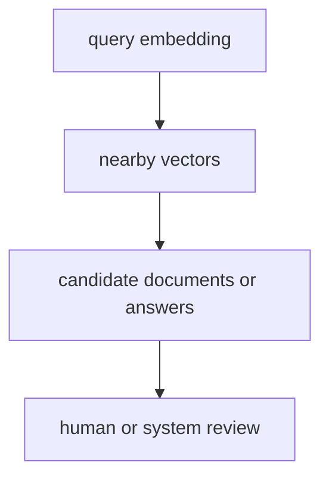
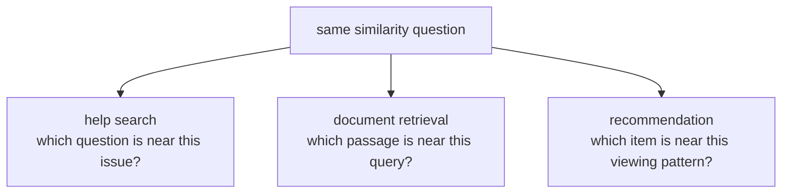

# P5-2.2 의미와 거리

P5-2.1에서는 임베딩(embedding)을 토큰이나 문장을 벡터(vector)로 바꾸는 표현 방식이라고 설명했습니다. 이제 다음 질문이 생깁니다.

임베딩 벡터가 만들어졌다면, 두 표현이 가깝다는 말은 실제로 무엇을 뜻하는가?

이 절은 그 질문에 답합니다.

의미와 거리라는 표현은, 임베딩 공간에서 비슷한 쓰임의 표현을 서로 가까운 후보로 비교하려는 계산 관점을 뜻한다.

## 이 절의 범위

이 절은 다음 질문에 답합니다.

- 벡터 공간에서 `가깝다`는 것은 어떤 뜻인가?
- 거리(distance)와 유사도(similarity)는 어떻게 다르게 읽을 수 있는가?
- 왜 가까운 벡터가 곧 정답이나 진실을 뜻하는 것은 아닌가?
- 이 관점이 검색, 추천, RAG와 어떻게 이어지는가?

이 절에서는 다음 내용을 깊게 다루지 않습니다.

- cosine similarity, dot product의 엄밀한 수식 전개
- nearest neighbor search의 구현 세부
- ANN index 구조

거리 함수의 직관과 임베딩 학습 흐름은 같은 장의 P5-2.3 보충학습에서 먼저 보강하고, 검색 시스템 안에서 이 비교가 실제로 어떻게 쓰이는지는 P5-11.1 벡터 데이터베이스와 P5-11.2 인덱스와 검색 품질에서 다시 회수합니다.

이 절에서는 수식을 외우기보다, `임베딩 공간의 거리`를 실제 비교와 검색의 언어로 읽습니다.

## 이 절의 목표

- 거리(distance)와 유사도(similarity)를 비교 기준으로 설명할 수 있습니다.
- 가까운 벡터가 `비슷한 후보일 수 있음`을 설명할 수 있습니다.
- 가까운 벡터가 곧 정답은 아니라는 점을 설명할 수 있습니다.
- 다음 장의 LLM 발전사와 이후 RAG 절을 더 정확하게 읽을 수 있습니다.

## `가깝다`는 말은 무엇을 뜻하나

임베딩 벡터는 여러 숫자로 이루어진 표현입니다. 이 벡터들 사이에는 수학적으로 거리나 유사도를 정의할 수 있습니다.

다음처럼 이해하면 충분합니다.

- 거리가 짧다 -> 벡터가 서로 가깝다
- 유사도가 높다 -> 벡터가 더 비슷한 방향이나 위치를 가진다

이때 중요한 것은, 이 비교가 `문자열 비교`가 아니라 `학습된 표현 비교`라는 점입니다.

즉:

- 같은 단어가 없어도 비슷한 표현이 가까워질 수 있고
- 같은 단어가 있어도 맥락이 다르면 멀어질 수 있습니다

## 거리와 유사도는 어떻게 다른가

입문 단계에서는 둘을 너무 엄격하게 구분할 필요는 없습니다. 다만 읽는 방향은 다를 수 있습니다.

| 표현 | 독자 직관 |
| --- | --- |
| 거리(distance) | 얼마나 떨어져 있는가 |
| 유사도(similarity) | 얼마나 비슷한가 |

둘 다 `비교 기준`이라는 점은 같습니다.

실무에서는 검색 시스템이나 임베딩 모델에 따라 어떤 비교 함수를 쓰는지가 달라질 수 있습니다. 하지만 독자가 먼저 가져가야 할 것은 수식 이름이 아니라, 질문과 문서·상품·문장이 `무엇을 기준으로 서로 가깝다고 읽히는가`를 보는 관점입니다.

## 가까운 벡터는 왜 유용한가

가까운 벡터를 찾으면 다음과 같은 일이 가능해집니다.

- 비슷한 질문 찾기
- 관련 문서 후보 찾기
- 비슷한 상품 또는 콘텐츠 찾기
- 중복되거나 거의 같은 표현 찾기

즉, 임베딩 공간의 거리 개념은 Part 5 뒤쪽의 RAG, 벡터 데이터베이스(vector database), 추천(recommendation) 같은 주제로 자연스럽게 이어집니다.

## 가까운 벡터가 곧 정답은 아닌 이유

이 점을 먼저 잡아야 `가깝다`는 판단과 `맞다` 또는 `최신이다`라는 판단을 섞지 않게 됩니다.

`가까운 벡터`는 보통 `관련 가능성이 높은 후보`를 뜻하지, 정답이나 진실을 뜻하지는 않습니다.

다음과 같은 경우를 생각할 수 있습니다.

- 표현은 비슷하지만 사실이 틀린 문서
- 질문과 표면적으로 비슷하지만 필요한 맥락은 다른 문서
- 오래되어 최신성이 없는 문서
- 전문 분야에서는 일반 임베딩이 충분히 구분하지 못하는 문서

따라서 유사도 검색이나 RAG에서는 `가까운 후보를 찾는 단계`와 `그 후보가 실제로 맞는 근거인지 확인하는 단계`를 반드시 분리해서 봐야 합니다.

## 아주 단순하게 그리면



이 도식에서 확인해야 할 결과는 `가까운 것 찾기`와 `그것을 최종 답으로 정리하기`가 서로 다른 단계이며, 검색이 맞아도 답변 정리는 별도 판단을 거친다는 점입니다.

## 사례로 보기

아래 도식은 이 절의 세 사례를 `무엇이 같은가`보다 `무엇을 먼저 가까운 후보로 올릴 것인가`라는 공통 질문으로 다시 묶은 것입니다.



이 도식에서 확인해야 할 점은 과업이 달라도 `먼저 가까운 후보를 고른다`는 단계가 공통으로 들어간다는 것입니다. 다만 그 후보가 곧 정답이라는 뜻은 아니므로, 이후 검토와 정리 단계가 따로 필요합니다.

### 사례 1. 비슷한 질문 찾기

사용자가 도움말 창에 `프롬프트만으로 거짓말을 막을 수 있나요?`라고 묻는 장면을 떠올려 보겠습니다. 사람은 보통 질문 속 단어가 문서 제목에 그대로 있어야 찾기 쉽다고 생각해 `거짓말`이나 `막다` 같은 단어를 먼저 찾습니다. 하지만 실제 지식베이스에는 `프롬프트의 한계와 사실성 보강 방법`처럼 더 기술적인 표현으로 정리된 문서만 있을 수 있습니다. 이때 키워드만 맞추면 관련 문서를 놓치고, 사용자는 `문서가 없나 보다`라고 오해할 수 있습니다. 여기서 바뀌는 점은 단어 일치 여부를 넘어서, 두 문장이 실제로 같은 문제 장면을 가리키는지까지 비교하게 된다는 것입니다. 유사도 검색은 `거짓말을 막는다`와 `사실성을 보강한다`를 꽤 가까운 문제로 보고 그 문서를 후보로 올립니다. 그래서 이 사례에서 확인해야 할 결과는 질문 단어가 그대로 없더라도 같은 문제를 다루는 문서가 실제 후보로 올라오는가입니다.

### 사례 2. 문서 검색

사내 정책 문서 수백 개 중에서 `출장비 정산 마감일이 언제인가요?`를 묻는 상황을 생각해 보겠습니다. 사람이 먼저 쓰는 기준은 대개 제목입니다. `출장비`, `정산`, `마감일`이 제목에 모두 들어 있으면 바로 답이 나올 것처럼 느껴집니다. 하지만 실제 문서 구조에서는 제목이 `출장 운영 가이드`이고, 본문 중간 표에만 `매월 5영업일 이내 제출`과 `해외 출장 예외`가 들어 있을 수 있습니다. 제목만 맞는 문서 하나를 열어도 정작 핵심 문단을 놓치면 답은 여전히 늦거나 틀릴 수 있습니다. 여기서 바뀌는 점은 문서 제목 하나를 고르는 것에서 끝나지 않고, 질문과 가장 가까운 문단 몇 개를 먼저 모으는 쪽으로 탐색 단위가 내려간다는 것입니다. 유사도 검색은 질문과 가까운 문단 몇 개를 먼저 후보로 모으고, 그다음 LLM이 그 문단을 읽어 자연어 답변을 정리하게 만듭니다. 그래서 이 사례에서 확인해야 할 결과는 제목만 맞는 문서 하나가 아니라, 실제 마감일이 적힌 핵심 문단이 후보에 포함되는가입니다.

### 사례 3. 추천 시스템

사용자가 입문용 선형대수 강의를 끝까지 봤고, 다음 강의를 추천해야 하는 상황을 생각해 보겠습니다. 사람은 보통 `입문용` 태그가 같으면 비슷한 강의일 것이라고 먼저 묶습니다. 하지만 실제로는 하나는 칠판 수식 설명 위주이고, 다른 하나는 NumPy 실습 위주라서 학습 리듬이 꽤 다를 수 있습니다. 예를 들어 수식 설명 영상을 끝까지 본 사용자가 바로 코드 실습 중심 강의로 넘어가면 중도 이탈이 늘 수 있습니다. 여기서 바뀌는 점은 태그 하나를 맞추는 것보다, 실제로 어떤 강의를 어떤 흐름으로 소비했는지를 함께 보게 된다는 것입니다. 시청 행동과 강의 특징을 함께 반영한 벡터 공간에서 가까운 항목을 찾으면, 단순 태그보다 실제 학습 흐름이 비슷한 후보를 더 자연스럽게 고를 수 있습니다. 그래서 이 사례에서 확인해야 할 결과는 같은 태그보다 실제 학습 리듬이 비슷한 후보가 더 앞쪽에 모이는가입니다.

세 사례를 후보 선정 관점으로 다시 묶으면 다음과 같습니다.

| 상황 | 사람 눈에 먼저 보이는 것 | 유사도 검색이 먼저 올리려는 후보 |
| --- | --- | --- |
| 비슷한 질문 찾기 | 같은 단어가 있는 질문 | 같은 문제를 다루는 질문 |
| 문서 검색 | 제목이 비슷한 문서 | 핵심 답이 들어 있는 문단 |
| 추천 시스템 | 같은 태그를 단 항목 | 실제 소비 흐름이 비슷한 항목 |

## 실행 가능한 Python 예제로 보기

이번 예제의 목표는 고급 라이브러리를 쓰지 않고, 아주 작은 2차원 벡터에서 `가까운 후보를 먼저 고른다`는 감각과 `가까움이 곧 정답은 아니다`라는 점을 함께 확인하는 것입니다. 후보 거리 계산 뒤에 최신성 점검을 붙여, 검색 후보 선정과 최종 답 확정이 왜 다른 단계인지도 같이 보겠습니다.

입력:

- 하나의 질의 벡터
- 세 개의 문서 벡터

출력:

- 각 문서까지의 거리
- 거리 기준으로 정렬된 후보 순서
- 거리와 별도로 확인해야 하는 최신성 정보

문제 상황:

- 벡터 거리가 가깝다고 해서 바로 최종 선택이 끝나는 것은 아니며, 최신성 같은 추가 기준도 함께 봐야 한다

입력(input):

위에 정리한 질의 벡터, 문서 벡터, 문서별 최신성 정보를 사용합니다.

확인할 개념:

- 벡터 거리는 중요한 1차 신호지만, 실제 선택에서는 최신성 같은 추가 기준을 함께 읽어야 한다

```python
def squared_distance(a, b):
    return sum((x - y) ** 2 for x, y in zip(a, b))

query = [0.9, 0.8]
docs = {
    "doc_A": [0.8, 0.7],
    "doc_B": [0.1, 0.2],
    "doc_C": [0.7, 0.9],
}
metadata = {
    "doc_A": {"updated_at": "2026-03", "note": "지난 분기 정책"},
    "doc_B": {"updated_at": "2025-12", "note": "다른 주제"},
    "doc_C": {"updated_at": "2026-06", "note": "최신 예외 조항 포함"},
}

ranked = sorted(
    ((name, squared_distance(query, vec)) for name, vec in docs.items()),
    key=lambda x: x[1],
)

for rank, (name, distance) in enumerate(ranked, start=1):
    print(
        f"rank {rank}: {name}, distance = {round(distance, 3)}, "
        f"updated_at = {metadata[name]['updated_at']}, note = {metadata[name]['note']}"
    )

best_by_distance = ranked[0][0]
best_after_review = "doc_C"
print("best_by_distance =", best_by_distance)
print("best_after_review =", best_after_review)
```

실행 결과 예시는 다음처럼 읽을 수 있습니다.

```text
rank 1: doc_A, distance = 0.02, updated_at = 2026-03, note = 지난 분기 정책
rank 2: doc_C, distance = 0.05, updated_at = 2026-06, note = 최신 예외 조항 포함
rank 3: doc_B, distance = 0.98, updated_at = 2025-12, note = 다른 주제
best_by_distance = doc_A
best_after_review = doc_C
```

이 예제에서 읽어야 할 핵심은 다음입니다.

- `doc_A`와 `doc_C`는 질의와 비교적 가까운 후보로 먼저 올라옵니다.
- `doc_B`는 훨씬 멀어서 우선순위가 뒤로 밀립니다.
- 하지만 1등으로 올라온 `doc_A`가 곧 정답이라는 뜻은 아닙니다. 실제 본문을 열어 최신성, 예외 조건, 사실 일치를 따로 확인해야 하고, 그 결과 `doc_C`가 최종 근거로 바뀔 수 있습니다.

## 이 예제를 검색 후보 판단 관점으로 다시 보면

이 장난감 예제는 `가까운 벡터를 찾는다`는 말이 실제 서비스에서는 `답을 바로 확정한다`가 아니라 `먼저 검토할 후보를 순서대로 좁힌다`는 뜻임을 다시 보여 줍니다. 예를 들어 `doc_A`가 가장 가깝게 나왔더라도, 실제 문단을 열어 보면 지난 분기 기준만 담겨 있고 `doc_C`에 최신 예외 조건이 들어 있을 수 있습니다. 그래서 이후 검색, RAG, 추천 절을 읽을 때도 핵심은 거리 계산 그 자체보다 `무엇을 후보로 올리고, 그다음 어떤 단계로 검토하는가`에 있습니다.

## 역사와 커리큘럼 관점

임베딩과 거리 개념은 통계적 언어 모델 이후의 표현 학습(representation learning) 흐름과 깊게 연결됩니다. 단어를 one-hot처럼 분리된 기호로만 다루는 대신, 벡터 공간 안에서 관계를 표현하려는 시도가 이후 검색과 생성 서비스 전반으로 확장되었습니다.

LLM 시대에는 이 관점이 더 중요해졌습니다.

- 모델 내부에서는 attention 계산으로 이어지고
- 서비스 바깥에서는 임베딩 검색과 RAG로 이어지기 때문입니다

커리큘럼 관점에서 이 절은 구조적으로 작은 절처럼 보여도, 바로 앞의 P5-2.1 임베딩을 `벡터를 만든다`에서 `벡터를 비교한다`로 확장하고, 뒤에서 나올 검색과 외부 지식 연결을 이해하는 핵심 기초입니다.

## 다음 장과의 연결

여기까지 오면 두 갈래 질문이 열립니다.

- 이런 표현이 LLM 안에서는 실제로 어떤 구조 계산으로 이어지는가?
- 토큰 표현을 바탕으로 문맥 관계를 읽는 Transformer는 무엇을 핵심으로 봐야 하는가?

가까운 본류는 P5-3.1 Transformer를 LLM 관점에서 다시 읽기입니다. 같은 장의 P5-2.3 보충학습에서는 임베딩 학습과 ANN 검색을 더 큰 그림으로 다시 볼 수 있고, 이후 P5-10.1 RAG의 필요성과 P5-10.2 검색 결과와 생성의 결합에서는 이 절의 거리와 후보 개념이 다시 직접 등장합니다.

## 이 절에서 기억할 관점

- 의미와 거리는 임베딩 공간에서 표현을 비교하는 계산 관점입니다.
- 거리와 유사도는 모두 `후보 비교 기준`입니다.
- 가까운 벡터는 관련 후보일 수 있지만, 정답을 보장하지 않습니다.
- 이 절은 이후 RAG, 벡터 데이터베이스, 추천, 검색 절로 이어집니다.

## 체크리스트

- 거리(distance)와 유사도(similarity)를 비교 기준으로 설명할 수 있는가?
- 가까운 벡터가 무엇을 뜻하는지 입문 수준에서 말할 수 있는가?
- 가까운 벡터가 곧 정답은 아니라는 점을 설명할 수 있는가?
- 이 관점이 검색, RAG, 추천과 어떻게 이어지는지 말할 수 있는가?

## 출처와 참고 자료

- Tomas Mikolov et al., `Efficient Estimation of Word Representations in Vector Space`, arXiv, 2013, 확인 날짜: 2026-06-29.
- Tomas Mikolov et al., `Distributed Representations of Words and Phrases and their Compositionality`, arXiv, 2013, 확인 날짜: 2026-06-29.
- Daniel Jurafsky, James H. Martin, `Speech and Language Processing` draft materials, 확인 날짜: 2026-06-29.
