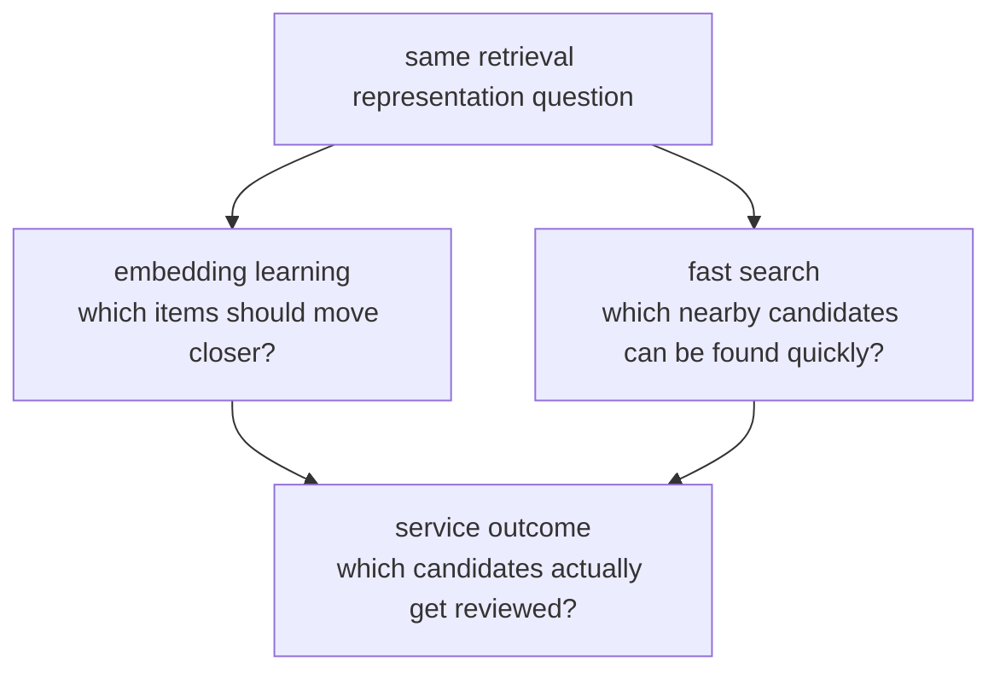

# P5-2.3 보충학습: 임베딩 학습과 ANN 검색을 큰 그림으로 읽기

P5-2.1과 P5-2.2에서는 임베딩과 거리의 직관을 잡았습니다. 여기서는 본문에서 생략한 `임베딩을 어떻게 배우는가`와 `가까운 벡터를 어떻게 빨리 찾는가`를 큰 그림으로 정리합니다.

## 이 절의 범위

- word2vec, GloVe, sentence embedding은 무엇을 다르게 강조하는가?
- contrastive learning은 어떤 학습 감각을 주는가?
- nearest neighbor와 ANN은 왜 검색 시스템에서 중요해지는가?

이 절에서는 다음 내용을 깊게 다루지 않습니다.

- 손실 함수 수식 전개
- HNSW, IVF 같은 인덱스별 구현 비교
- 대규모 벤치마크 수치 경쟁

구현 세부보다 `어떤 문제를 풀기 위해 이런 구조가 생겼는가`를 먼저 잡는 데 집중합니다. 손실 함수와 임베딩 학습 절차의 더 직접적인 사용 맥락은 P5-5.1 다음 토큰 예측과 P5-6.1 사전학습 목표에서 다시 연결하고, 검색 시스템 안에서 ANN과 인덱스가 실제로 어떻게 쓰이는지는 P5-11.1 벡터 데이터베이스와 P5-11.2 인덱스와 검색 품질에서 다시 회수합니다. HNSW, IVF의 구현 비교와 대규모 벤치마크 경쟁 자체는 현재 본편 범위 밖으로 둡니다.

## 이 절의 목표

- 대표 임베딩 계열을 목적 중심으로 구분할 수 있습니다.
- contrastive learning이 `가까워져야 할 것과 멀어져야 할 것`을 함께 배우는 흐름임을 설명할 수 있습니다.
- ANN이 정확도를 조금 희생하고 속도를 얻는 검색 구조라는 점을 말할 수 있습니다.

## 임베딩 계열은 무엇을 다르게 보나

입문 단계에서는 다음처럼 읽으면 충분합니다.

| 계열 | 입문용 직관 |
| --- | --- |
| word2vec | 단어 주변 문맥으로 단어 표현을 배운다 |
| GloVe | 단어 동시출현 통계를 더 직접 반영한다 |
| sentence embedding | 문장이나 문단 전체를 비교 가능한 벡터로 만든다 |

이 구분은 절대적인 벽이 아니라, `무엇을 대표 벡터로 만들고 싶은가`의 차이에 가깝습니다.

## contrastive learning은 어떤 감각인가

contrastive learning은 단순화하면 다음 질문을 던집니다.

- 서로 가까워져야 할 쌍은 무엇인가?
- 서로 멀어져야 할 쌍은 무엇인가?

예를 들어 같은 질문의 다른 표현은 가깝게, 전혀 다른 의미의 문장은 멀어지게 학습할 수 있습니다. 그래서 sentence embedding, 검색, 추천, 문장쌍 비교에서 자주 등장합니다.

## nearest neighbor와 ANN은 왜 따로 말하나

벡터 검색의 기본 질문은 단순합니다.

`지금 이 질의 벡터와 가장 가까운 후보 몇 개를 빨리 찾을 수 있는가?`

데이터가 아주 작다면 모든 벡터를 다 비교해도 됩니다. 하지만 문서 수가 커지면 속도가 급격히 문제 됩니다. 그래서 ANN(Approximate Nearest Neighbor)이 등장합니다.

ANN의 핵심 감각은 다음과 같습니다.

- 완전히 정확한 전수 비교 대신
- 충분히 좋은 근접 후보를 더 빠르게 찾는다

이 감각은 뒤의 P5-11.1 벡터 데이터베이스, P5-11.2 인덱스와 검색 품질로 바로 이어집니다.

## 작은 예시로 보기

고객 문의 임베딩이 있다고 가정해 봅시다.

- `환불이 가능한가요?`
- `결제 취소는 어떻게 하나요?`
- `배송 주소를 바꾸고 싶어요`

첫 두 문장은 비슷한 지원 의도로 더 가깝게 놓일 수 있습니다. 검색 시스템은 이런 벡터 공간을 이용해 관련 FAQ나 문서 후보를 먼저 찾습니다. 그래서 실제로는 비슷한 문의 몇 개를 묶어 보고, 어떤 문장이 같은 이슈로 가까워지는지 확인하는 연습이 중요합니다.

## 사례로 보기

아래 도식은 이 보충학습의 사례를 `임베딩을 어떻게 배우는가`와 `가까운 벡터를 어떻게 빨리 찾는가`라는 두 축으로 다시 묶은 것입니다.



이 도식에서 확인해야 할 점은 `좋은 벡터를 만드는 문제`와 `그 벡터들 중 가까운 후보를 빨리 찾는 문제`가 서로 다른 단계라는 것입니다. 임베딩 학습은 표현 공간을 만들고, ANN은 그 공간 안에서 실무 속도로 후보를 찾게 해 주는 장치입니다.

### 사례 1. 같은 의도 문의를 더 가깝게 두는 경우

고객센터에서 `환불이 가능한가요?`와 `결제 취소는 어떻게 하나요?`를 함께 다룬다고 해 보겠습니다. 사람은 두 문장에 쓰인 단어가 조금 달라도 같은 처리 흐름으로 보내고 싶어 합니다. 하지만 키워드 규칙만 쓰면 `환불`, `취소`, `환급`처럼 표면 단어가 조금만 달라져도 서로 다른 큐로 흩어질 수 있습니다. 예를 들어 `주문을 없애고 결제 내역도 되돌리고 싶어요` 같은 문장은 직접 `환불`이라는 단어가 없어도 실제로는 같은 업무일 수 있습니다. 여기서 바뀌는 점은 단어 겹침을 세는 것보다, 실제로 같은 해결 흐름을 요구하는 문장을 더 가까운 위치에 놓는다는 것입니다. contrastive learning이나 sentence embedding 계열은 바로 이런 문장을 가까운 벡터로 놓는 쪽에 가깝습니다. 그래서 이 사례에서 확인해야 할 결과는 `표현이 다른 문의가 검색이나 분류 단계에서 같은 후보군으로 모이는가`입니다.

### 사례 2. 전수 비교 대신 ANN이 필요한 경우

FAQ 문서가 몇십 개일 때는 모든 벡터를 다 비교해도 괜찮을 수 있습니다. 하지만 문서가 수십만 개로 커지면, 사람은 여전히 `가장 비슷한 문서를 빨리 찾고 싶다`는 같은 요구를 가집니다. 이때 모든 후보를 끝까지 비교하면 정확할 수는 있어도 속도가 급격히 느려질 수 있습니다. 여기서 바뀌는 점은 `가장 정확한 비교` 하나만 고집하는 것이 아니라, 실무에서 쓸 만큼 좋은 후보를 훨씬 빨리 찾는 쪽으로 기준이 이동한다는 것입니다. ANN은 완벽한 전수 비교 대신 충분히 좋은 근접 후보를 더 빨리 찾는 쪽으로 타협합니다. 그래서 이 사례에서 확인해야 할 결과는 `후보 품질이 크게 무너지지 않으면서 검색 시간이 실제로 줄어드는가`입니다.

두 사례를 검색 파이프라인 관점으로 다시 묶으면 다음과 같습니다.

| 상황 | 먼저 좋아져야 하는 것 | 함께 따로 봐야 하는 것 |
| --- | --- | --- |
| 같은 의도 문의를 더 가깝게 둠 | 표현 공간의 품질 | 실제로 같은 후보군으로 모이는가 |
| 전수 비교 대신 ANN 사용 | 후보 탐색 속도 | 품질 손실이 감당 가능한가 |

## 실행 가능한 Python 예제로 보기

이번 예제의 목표는 `가까운 벡터를 찾는다`는 문제와 `모든 후보를 끝까지 비교하는 일`을 가장 작게 보여 주는 것입니다. 실제 ANN 인덱스를 구현하지는 않지만, 먼저 전수 비교를 한 뒤 `먼 후보 몇 개는 아예 보지 않고도 상위 후보를 빨리 좁히는` 장난감 흐름을 비교해 볼 수 있습니다. 여기에 계산 횟수까지 함께 찍어, 왜 ANN이 실무에서 중요한지도 직접 보겠습니다.

입력:

- 하나의 질의 벡터
- 다섯 개의 FAQ 후보 벡터

출력:

- 전수 비교 결과
- 빠른 1차 후보 축소 뒤의 상위 결과
- 각 방식이 실제로 비교한 후보 수

문제 상황:

- ANN류 검색은 모든 문서를 다 비교하지 않고도 가까운 후보를 빨리 좁히려는 발상이라는 점을 직접 비교해 볼 필요가 있다

입력(input):

위에 정리한 질의 벡터와 FAQ 후보 벡터를 사용합니다.

확인할 개념:

- ANN 검색은 모든 후보를 다 보지 않고도 가까운 후보를 빠르게 좁혀 비교 비용을 줄이려는 방식이다

```python
def squared_distance(a, b):
    return sum((x - y) ** 2 for x, y in zip(a, b))


query = [0.90, 0.80]
docs = {
    "refund_policy": [0.88, 0.82],
    "cancel_payment": [0.84, 0.79],
    "change_address": [0.30, 0.20],
    "shipping_delay": [0.40, 0.35],
    "coupon_event": [0.15, 0.75],
}


full_scan = sorted(
    ((name, squared_distance(query, vec)) for name, vec in docs.items()),
    key=lambda x: x[1],
)
full_scan_ops = len(docs)

# 장난감 ANN 직관:
# x축이 너무 먼 후보는 먼저 제외하고 남은 후보만 자세히 비교한다.
coarse_candidates = {
    name: vec for name, vec in docs.items() if abs(vec[0] - query[0]) <= 0.2
}
fast_scan = sorted(
    ((name, squared_distance(query, vec)) for name, vec in coarse_candidates.items()),
    key=lambda x: x[1],
)
fast_scan_ops = len(coarse_candidates)

print("full_scan =", full_scan)
print("fast_scan =", fast_scan)
print("full_scan_ops =", full_scan_ops)
print("fast_scan_ops =", fast_scan_ops)
```

실행 결과 예시는 다음처럼 읽을 수 있습니다.

```text
full_scan = [('refund_policy', 0.001), ('cancel_payment', 0.004), ('coupon_event', 0.565), ('shipping_delay', 0.613), ('change_address', 0.85)]
fast_scan = [('refund_policy', 0.001), ('cancel_payment', 0.004)]
full_scan_ops = 5
fast_scan_ops = 2
```

이 예제에서 읽어야 할 핵심은 다음입니다.

- 전수 비교는 모든 후보를 다 보므로 가장 안전하지만 후보 수가 커질수록 느려집니다.
- 빠른 후보 축소는 일부 후보를 아예 먼저 버리는 대신, 실제로 가까울 가능성이 높은 항목을 훨씬 빨리 좁힙니다.
- ANN의 실무 감각도 이와 비슷하게 `완벽한 전수 비교`보다 `충분히 좋은 근접 후보를 빨리 찾는 구조`에 가깝습니다.
- 이 예제에서는 상위 후보를 유지하면서 비교 횟수를 5회에서 2회로 줄이는 감각을 아주 작게 보여 줍니다.

## 이 예제를 검색 구조 관점으로 다시 보면

앞의 예제는 진짜 ANN 인덱스를 구현한 것은 아닙니다. 하지만 `표현 공간을 만든다`와 `그 공간에서 가까운 후보를 빨리 찾는다`가 서로 다른 문제라는 점은 분명하게 보여 줍니다. 실제 서비스에서는 더 정교한 인덱스를 쓰지만, 독자가 먼저 잡아야 할 핵심은 `좋은 벡터가 있어도 검색이 느리면 서비스가 어렵고, 검색이 빨라도 벡터가 나쁘면 후보 품질이 무너진다`는 이중 조건입니다.

## 다음 절과의 연결

이 보충학습은 임베딩이 어떻게 학습되고 검색에서 왜 빨라져야 하는지를 큰 그림으로 묶습니다. 다음 장의 P5-3.1 Transformer 구조를 읽을 때는 `벡터 표현을 만든다`는 감각이 `벡터들 사이의 관계를 다시 계산한다`는 흐름으로 확장된다고 보면 연결이 자연스럽습니다.

## 이 절에서 기억할 관점

- 임베딩 계열의 차이는 `무엇을 벡터로 잘 표현할 것인가`의 차이입니다.
- contrastive learning은 가까운 것과 먼 것을 함께 배우는 감각입니다.
- ANN은 큰 검색 공간에서 속도를 확보하기 위한 실용적 타협입니다.

## 체크리스트

- word2vec, GloVe, sentence embedding의 큰 차이를 말할 수 있는가?
- contrastive learning의 목적을 수식 없이 설명할 수 있는가?
- ANN이 왜 벡터 검색에서 필요한지 말할 수 있는가?

## 출처와 참고 자료

- Tomas Mikolov et al., `Efficient Estimation of Word Representations in Vector Space`, arXiv, 2013, 확인 날짜: 2026-06-29.
- Jeffrey Pennington, Richard Socher, Christopher Manning, `GloVe: Global Vectors for Word Representation`, EMNLP, 2014, 확인 날짜: 2026-06-29.
- Nils Reimers, Iryna Gurevych, `Sentence-BERT: Sentence Embeddings using Siamese BERT-Networks`, EMNLP-IJCNLP, 2019, 확인 날짜: 2026-06-29.
- Pinecone, ANN/vector search 기초 문서, 확인 날짜: 2026-06-29.
