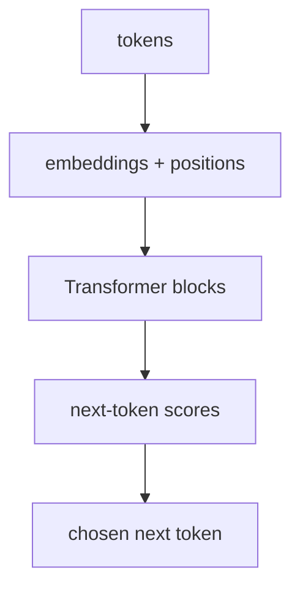
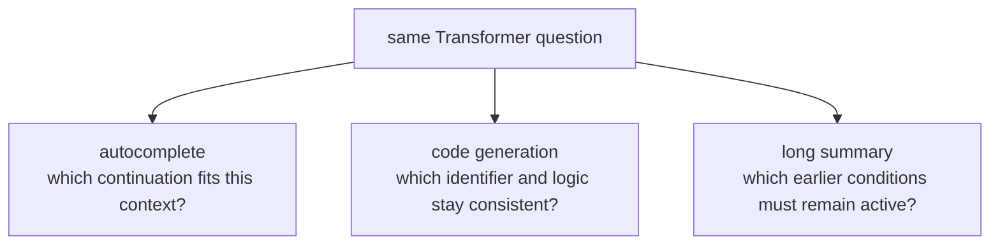

# P5-3.1 Transformer를 LLM 관점에서 다시 읽기

P5-18장에서는 LLM 발전사의 큰 흐름과 직접 계보를 배경 지도로 정리했습니다. 이제 Part 5의 본류로 다시 돌아와야 합니다.

LLM 관점에서 Transformer를 다시 보면, 무엇이 정말 핵심인가?

이 절은 그 질문에 답합니다.

LLM에서 Transformer는 토큰들을 임베딩으로 바꾸고, self-attention으로 서로의 관계를 읽고, feed-forward와 반복 블록으로 표현을 정제하며, 최종적으로 다음 토큰을 예측하는 기본 구조다.

## 이 절의 범위

이 절은 다음 질문에 답합니다.

- 이미 본 Transformer를 LLM 관점으로 다시 보면 무엇이 달라지는가?
- 토큰, 임베딩, self-attention, 다음 토큰 예측은 어떻게 이어지는가?
- 왜 Transformer는 생성형 언어 모델의 기본 구조가 되었는가?

이 절에서는 다음 내용을 깊게 다루지 않습니다.

- multi-head attention의 세부 수식
- KV cache 구현
- 추론 최적화와 서빙 엔진 구조

Transformer 블록의 큰 구조는 여기서 잡고, 구현 쪽으로 더 들어가야 하는 multi-head attention, 위치 표현, KV cache는 같은 장의 P5-3.3 보충학습에서 다시 회수합니다. 서비스 운영 관점의 지연 시간과 비용 제약은 뒤의 P5-16.1 서비스 운영 제약에서 다시 연결합니다.

이 절에서는 Transformer 공식을 다시 전개하기보다, Part 5에서 다룰 GPT, pretraining, next-token prediction, RAG, agent 설명을 모두 떠받치는 `LLM 기준의 구조 지도`를 다시 잡습니다.

## 이 절의 목표

- Transformer를 LLM 기준으로 다시 설명할 수 있습니다.
- 토큰 -> 임베딩 -> attention 블록 -> 다음 토큰 예측 흐름을 연결할 수 있습니다.
- 이전에 배운 Transformer 구조가 Part 5의 생성형 언어 모델 설명으로 어떻게 이어지는지 말할 수 있습니다.
- 다음 절의 context window 설명으로 자연스럽게 넘어갈 수 있습니다.

## 이 절을 읽는 순서

이 절은 다음 순서로 읽으면 충분합니다.

1. 먼저 같은 Transformer를 왜 LLM 관점에서 다시 읽어야 하는지 봅니다.
2. 그 다음 토큰, 임베딩, self-attention, 반복 블록이 어떤 흐름으로 이어지는지 따라갑니다.
3. 이어서 마지막 출력이 `완성 문장`이 아니라 `다음 후보 점수표`라는 점을 확인합니다.
4. 마지막에 왜 이 구조가 GPT, pretraining, prompt, context window 설명의 기반이 되는지 연결합니다.

## 같은 Transformer를 왜 다시 읽어야 하는가

Part 4에서는 Transformer를 딥러닝 구조로 설명했습니다. 즉:

- self-attention
- feed-forward
- residual connection
- layer normalization

같은 블록 요소를 중심에 두었습니다.

Part 5에서는 같은 구조를 보되 질문이 달라집니다.

- 이 구조가 텍스트를 어떻게 읽는가?
- 이 구조가 왜 다음 토큰 예측(next-token prediction)에 잘 맞는가?
- 이 구조가 왜 LLM 서비스의 기본 계산 단위가 되었는가?

즉, 구조는 같지만 `읽는 관점`이 달라집니다.

## LLM에서는 토큰이 출발점이다

LLM은 문장을 통째로 계산하지 않습니다. 먼저 토큰(token) 시퀀스로 읽습니다.

예를 들어 다음처럼 생각할 수 있습니다.

```text
raw text
-> tokens
-> token ids
-> embeddings
-> Transformer blocks
-> next-token scores
```

여기서 Transformer는 토큰을 이미 쪼갠 뒤의 계산 구조입니다. 즉, Transformer는 텍스트를 직접 해석하는 첫 단계가 아니라, `토큰 표현을 반복적으로 가공하는 중심 엔진`에 가깝습니다.

## 임베딩은 계산 가능한 출발 표현을 만든다

P5-2장에서 본 것처럼 토큰 ID는 단순 번호입니다. Transformer는 이 번호를 직접 다루지 않고, 먼저 임베딩(embedding) 벡터로 바꿉니다.

이 임베딩 벡터는 이후 모든 계산의 출발점이 됩니다.

다음처럼 이해하면 충분합니다.

`임베딩은 토큰을 Transformer가 계산할 수 있는 숫자 좌표로 바꾸는 단계다.`

즉, Transformer는 텍스트를 문자열로 읽는 것이 아니라, 임베딩된 토큰 표현 위에서 작동합니다.

## self-attention은 왜 LLM에 특히 중요했나

생성형 언어 모델은 현재 위치의 다음 토큰을 예측해야 합니다. 이때 지금까지 등장한 이전 토큰들이 모두 힌트가 될 수 있습니다.

예를 들어:

- 앞에서 등장한 주어
- 코드 블록의 함수 이름
- 문서 초반의 핵심 조건

같은 정보가 뒤쪽 생성에 영향을 줄 수 있습니다.

self-attention은 각 토큰이 다른 토큰들과의 관련도를 계산하게 합니다. 그래서 현재 토큰 표현은 주변과 멀리 있는 이전 토큰들의 정보를 함께 반영할 수 있습니다.

다음처럼 기억하면 좋습니다.

`LLM에서 self-attention은 지금까지 나온 토큰들 중 무엇이 현재 생성에 더 중요한지 계산하는 구조다.`

## feed-forward와 반복 블록은 왜 필요한가

self-attention만으로는 토큰 간 관계를 섞을 수 있지만, 그 정보가 바로 충분히 좋은 표현이 되는 것은 아닙니다.

feed-forward network는 각 위치에서 그 표현을 더 가공합니다. 그리고 이 블록이 여러 층 반복되면 표현은 더 풍부해질 수 있습니다.

즉:

- attention은 관계를 읽고
- feed-forward는 각 위치 표현을 다시 다듬고
- 여러 층 반복은 표현을 점점 더 정제합니다

이 흐름은 Part 4의 표현 학습(representation learning) 설명과 그대로 이어집니다.

## 왜 마지막에는 다음 토큰 점수가 나오는가

LLM 설명에서 중요한 차이는 마지막 출력 해석입니다.

분류 모델은 마지막에 클래스(class) 점수를 내는 경우가 많습니다. 하지만 생성형 언어 모델은 보통 `다음에 올 수 있는 토큰 후보들`에 대한 점수를 냅니다.

즉, Transformer 블록을 지나면 마지막에는 대략 이런 질문이 됩니다.

- 다음 위치에 어떤 토큰이 올 가능성이 큰가?

이 점수는 이후 softmax와 sampling 같은 절차를 거쳐 실제 출력 토큰 선택으로 이어집니다.

따라서 Part 4의 구조 설명은 Part 5에서 다음과 같이 다시 읽힙니다.

> 표현 학습 구조
> -> 다음 토큰 분포 계산 구조

## 아주 단순하게 그리면



이 도식은 Part 5에서 Transformer를 읽을 때 가장 자주 떠올려야 하는 최소 구조입니다.

## 사례로 보기

아래 도식은 이 절의 세 사례를 `다음 한 토큰을 고른다`보다 `앞 문맥 전체가 다음 후보 분포를 어떻게 바꾸는가`라는 공통 질문으로 다시 묶은 것입니다.



이 도식에서 확인해야 할 점은 과업이 달라도 마지막 단계는 비슷하다는 것입니다. 모두 `다음 토큰 하나를 찍는다`가 아니라, 앞에서 들어온 문맥 전체를 반영해 `지금 어떤 후보 분포가 만들어지는가`를 먼저 봐야 합니다.

### 사례 1. 문장 자동완성

운영자가 메신저 초안을 쓰다가 `오늘 회의는 오후`까지만 입력한 장면을 떠올려 보겠습니다. 사람은 마지막 단어 바로 뒤만 보고 `2시`, `3시`처럼 다음 말을 찍어 보려 할 수 있습니다. 하지만 실제 자동완성은 마지막 단어 하나만 보는 문제가 아닙니다. Transformer는 앞 토큰들을 보고 다음 후보 분포를 계산하면서, `회의`와 `오후`처럼 앞에 나온 단서들을 함께 반영해 다음 표현을 고르게 됩니다. 예를 들어 같은 문장이라도 앞부분에 `고객사와`가 있으면 `2시에 진행됩니다` 같은 공손한 공지형 표현이 더 자연스러울 수 있고, `팀 내부`가 앞에 있으면 `2시에 하자`처럼 더 짧은 표현이 후보로 올라올 수 있습니다. 여기서 바뀌는 점은 `마지막 단어 뒤를 찍는가`를 보던 기준에서 `앞 문맥 전체가 다음 후보를 어떻게 바꾸는가`를 보는 기준으로 이동한다는 것입니다. 자동완성은 그래서 Transformer가 문맥 전체를 바탕으로 다음 토큰을 정하는 장면을 가장 단순하게 보여 줍니다. 그래서 이 사례에서 확인해야 할 결과는 마지막 단어만 비슷한 경우보다, 앞 문맥 차이에 따라 실제 다음 후보가 달라지는가입니다.

### 사례 2. 코드 생성

함수 정의와 변수 선언이 앞에 있고, 뒤에서 구현을 이어 쓸 때, 사람도 바로 앞줄만 보면 변수 이름을 놓치기 쉽습니다. 앞부분에서 `user_id`를 선언했는데 뒤에서 갑자기 다른 이름을 쓰면 코드가 쉽게 어긋납니다. 예를 들어 함수 목적이 `총액 계산`인데 뒤에서 할인 로직이 빠지면, 앞에서 세운 의도와 구현이 어긋날 수 있습니다. 여기서 바뀌는 점은 `지금 줄 근처만 맞는가`를 보던 기준에서 `앞에서 선언한 이름과 목적이 뒤 구현까지 이어지는가`를 보는 기준으로 이동한다는 것입니다. Transformer는 앞쪽 토큰들과의 관계를 반복 블록 안에서 계속 참조하기 때문에, `지금 줄`만이 아니라 이미 나온 변수명과 함수 목적을 함께 반영하는 긴 코드 문맥 처리와 잘 맞습니다. 그래서 이 사례에서 확인해야 할 결과는 바로 앞줄만 볼 때보다, 앞에서 선언한 변수명과 함수 목적이 뒤 구현에도 실제로 더 일관되게 유지되는가입니다.

### 사례 3. 긴 문서 요약

긴 문서를 요약할 때 사람은 앞부분만 읽고 먼저 요약을 시작하거나, 반대로 마지막 결론만 보고 전체 뜻을 단정하기 쉽습니다. 앞의 정의를 놓치면 뒤 결론만 남아 요약이 뜬금없어질 수 있고, 반대로 뒤의 예외 조건을 놓치면 앞의 일반 설명만 남을 수 있습니다. 예를 들어 결론 문장은 짧지만 그 결론이 성립하는 범위가 앞 단락에 묶여 있다면, 둘을 함께 봐야 요약이 자연스러워집니다. 여기서 바뀌는 점은 `눈에 띄는 앞이나 뒤 한 부분만 붙잡는가`를 보던 기준에서 `앞의 조건과 뒤의 예외를 함께 유지하는가`를 보는 기준으로 이동한다는 것입니다. Transformer는 이런 문맥 정보를 반복 블록 안에서 계속 반영하며, 문서 전체에서 필요한 단서를 다시 끌어오는 구조와 잘 맞습니다. 그래서 이 사례에서 확인해야 할 결과는 결론 한 줄만 남는 것이 아니라, 앞의 조건과 뒤의 예외가 실제 요약 안에 함께 유지되는가입니다.

세 사례를 문맥 반영 관점으로 다시 묶으면 다음과 같습니다.

| 상황 | 바로 앞만 보면 놓치기 쉬운 것 | 앞 문맥 전체를 반영할 때 더 유지되는 것 |
| --- | --- | --- |
| 문장 자동완성 | 마지막 단어 뒤 후보만 보는 선택 | 앞 문맥에 맞는 말투와 후속 표현 |
| 코드 생성 | 현재 줄 근처의 토큰만 보는 선택 | 선언한 변수명과 함수 목적의 일관성 |
| 긴 문서 요약 | 눈에 띄는 결론 한 줄만 남기는 선택 | 앞 조건과 뒤 예외의 동시 보존 |

## 실행 가능한 Python 예제로 보기

이번 예제의 목표는 실제 Transformer 전체를 구현하는 것이 아니라, `앞 문맥에 들어 있던 단서들이 다음 토큰 후보 점수표를 어떻게 바꾸는가`를 더 실제적으로 보는 것입니다. 이번에는 두 개의 업무 문맥을 두고, 각 문맥에 들어 있는 단서가 후보 표현 점수에 얼마나 기여하는지까지 함께 출력해 보겠습니다.

입력:

- 두 개의 서로 다른 문맥
- 문맥에서 읽어 낸 단서(feature)
- 같은 후보 표현 집합
- 단서별 후보 가중치

출력:

- 문맥별 활성 단서
- 후보별 점수 기여도
- 후보 점수표와 상위 후보 순위
- 문맥별 최종 다음 토큰 선택

문제 상황:

- 다음 토큰 예측은 문맥에서 어떤 단서가 켜졌는지에 따라 후보 점수가 달라지는 과정으로 읽는 편이 직관적이다

입력(input):

위에 정리한 문맥별 특징값과 후보 점수 규칙을 사용합니다.

확인할 개념:

- 다음 토큰 선택은 문맥에서 켜진 단서들이 후보 점수에 다르게 기여한 결과로 읽을 수 있다

```python
contexts = {
    "formal_notice": {
        "text": "고객사 공지 메일입니다. 오늘 회의는 오후 2시에 진행",
        "features": {
            "formal_tone": 1.0,
            "casual_tone": 0.0,
            "notice_style": 1.0,
            "meeting_context": 0.8,
            "past_tense": 0.0,
        },
    },
    "casual_team_chat": {
        "text": "팀 내부 메모다. 오늘 회의는 오후 2시에 진행",
        "features": {
            "formal_tone": 0.0,
            "casual_tone": 1.0,
            "notice_style": 0.0,
            "meeting_context": 0.4,
            "past_tense": 0.0,
        },
    },
}

candidates = {
    "합니다": {
        "base": 0.2,
        "weights": {
            "formal_tone": 1.2,
            "casual_tone": -0.8,
            "notice_style": 0.9,
            "meeting_context": 0.2,
            "past_tense": -0.6,
        },
    },
    "이다": {
        "base": 0.3,
        "weights": {
            "formal_tone": -0.3,
            "casual_tone": 0.7,
            "notice_style": -0.2,
            "meeting_context": 0.1,
            "past_tense": -0.5,
        },
    },
    "되었습니다": {
        "base": 0.1,
        "weights": {
            "formal_tone": 0.8,
            "casual_tone": -0.4,
            "notice_style": 0.4,
            "meeting_context": -0.1,
            "past_tense": 1.3,
        },
    },
}


def score_candidates(feature_values):
    scored = []
    for token, config in candidates.items():
        contributions = {}
        total = config["base"]
        for feature_name, feature_value in feature_values.items():
            contribution = feature_value * config["weights"][feature_name]
            contributions[feature_name] = round(contribution, 2)
            total += contribution
        scored.append(
            {
                "token": token,
                "score": round(total, 2),
                "contributions": contributions,
            }
        )
    return sorted(scored, key=lambda item: item["score"], reverse=True)


for context_name, context in contexts.items():
    ranking = score_candidates(context["features"])
    print(f"[{context_name}]")
    print("text =", context["text"])
    print("active_features =", context["features"])
    for item in ranking:
        print(
            f"- candidate={item['token']}, score={item['score']}, "
            f"contributions={item['contributions']}"
        )
    print("chosen_next_token =", ranking[0]["token"])
    print("top_2 =", [item["token"] for item in ranking[:2]])
    print("---")
```

실행 결과 예시는 다음처럼 읽을 수 있습니다.

```text
[formal_notice]
text = 고객사 공지 메일입니다. 오늘 회의는 오후 2시에 진행
active_features = {'formal_tone': 1.0, 'casual_tone': 0.0, 'notice_style': 1.0, 'meeting_context': 0.8, 'past_tense': 0.0}
- candidate=합니다, score=2.46, contributions={'formal_tone': 1.2, 'casual_tone': -0.0, 'notice_style': 0.9, 'meeting_context': 0.16, 'past_tense': -0.0}
- candidate=되었습니다, score=1.22, contributions={'formal_tone': 0.8, 'casual_tone': -0.0, 'notice_style': 0.4, 'meeting_context': -0.08, 'past_tense': 0.0}
- candidate=이다, score=-0.12, contributions={'formal_tone': -0.3, 'casual_tone': 0.0, 'notice_style': -0.2, 'meeting_context': 0.08, 'past_tense': -0.0}
chosen_next_token = 합니다
top_2 = ['합니다', '되었습니다']
---
[casual_team_chat]
text = 팀 내부 메모다. 오늘 회의는 오후 2시에 진행
active_features = {'formal_tone': 0.0, 'casual_tone': 1.0, 'notice_style': 0.0, 'meeting_context': 0.4, 'past_tense': 0.0}
- candidate=이다, score=1.04, contributions={'formal_tone': -0.0, 'casual_tone': 0.7, 'notice_style': -0.0, 'meeting_context': 0.04, 'past_tense': -0.0}
- candidate=합니다, score=-0.52, contributions={'formal_tone': 0.0, 'casual_tone': -0.8, 'notice_style': 0.0, 'meeting_context': 0.08, 'past_tense': -0.0}
- candidate=되었습니다, score=-0.34, contributions={'formal_tone': 0.0, 'casual_tone': -0.4, 'notice_style': 0.0, 'meeting_context': -0.04, 'past_tense': 0.0}
chosen_next_token = 이다
top_2 = ['이다', '되었습니다']
---
```

위 출력은 `formal_notice`와 `casual_team_chat`이 같은 `오늘 회의는 오후 2시에 진행` 구간을 공유하더라도, 앞 문맥에서 읽힌 `formal_tone`, `casual_tone`, `notice_style` 같은 단서가 후보 점수표를 다르게 밀어 올린다는 점을 보여 줍니다. 즉, 문장 뒷부분이 비슷해도 앞 문맥에서 어떤 성격의 단서가 더 강하게 남았는지에 따라 최종 다음 후보가 실제로 달라질 수 있습니다.

독자는 여기서 `formal_notice`의 `notice_style`을 `0.5`로 줄이거나, `casual_team_chat`의 `meeting_context`를 `0.9`로 높여 보면서 순위가 어떻게 다시 바뀌는지 실험할 수 있습니다. 이렇게 보면 중요한 것은 `정답 토큰 하나를 외우는 것`이 아니라, `문맥에서 어떤 단서가 후보 분포를 어떻게 밀어 올리거나 끌어내리는가`입니다.

이 예제에서 확인해야 할 핵심은 다음입니다.

- 같은 후보 집합이라도 앞 문맥에서 읽은 단서가 다르면 점수표가 달라집니다.
- Transformer의 마지막 계산은 완성 문장 자체보다 `다음 후보들에 대한 점수 분포`에 가깝습니다.
- 실제 출력 토큰은 그 점수표에서 가장 높은 후보를 고르거나, sampling 같은 규칙을 거쳐 선택됩니다.
- 즉, 생성은 `한 단어를 바로 맞힌다`보다 `문맥을 반영해 후보 분포를 계속 갱신한다`는 관점으로 보는 편이 정확합니다.

## 이 예제를 다음 토큰 선택 관점으로 다시 보면

앞의 예제는 Transformer 전체를 구현하는 코드가 아니라, 긴 문맥 계산이 마지막에는 `후보 점수 비교`와 `다음 토큰 선택`으로 닫힌다는 점을 더 실제적인 점수표 형태로 보여 주는 장면입니다. 여기서 읽어야 할 핵심은 복잡한 내부 블록을 모두 외우는 것이 아니라, 그 계산이 결국 `앞 문맥에 따라 달라지는 다음 토큰 분포`를 만든다는 점입니다. 즉, Transformer를 읽을 때는 `정답 단어 하나를 바로 맞힌다`보다 `문맥 전체가 다음 후보 분포를 어떻게 바꾸는가`를 보는 편이 더 정확합니다.

Transformer가 언어 모델의 중심 구조가 된 이유는 단순히 성능이 좋았기 때문만은 아닙니다.

- 긴 문맥을 더 잘 다룰 수 있었고
- 병렬 처리와 잘 맞았으며
- 같은 기본 구조가 번역, 요약, 질의응답, 코드 생성 같은 여러 언어 작업에 넓게 재사용될 수 있었기 때문입니다

커리큘럼 관점에서 이 절에서 확인해야 할 결과는 Transformer를 `다음 토큰을 한 번 맞히는 장치`가 아니라, 문맥 전체를 반영해 다음 후보 분포를 갱신하는 중심 엔진으로 읽게 되는가입니다.

- Part 4의 딥러닝 구조를 Part 5의 생성 모델 구조로 다시 읽게 하고
- BERT와 GPT의 차이를 더 정확히 이해하게 하며
- context window, prompt, RAG 설명의 기반을 마련하기 때문입니다

## 다음 절과의 연결

여기까지 오면 다음 질문이 남습니다.

- Transformer가 모든 이전 토큰을 볼 수 있다고 해도, 실제로는 어디까지 볼 수 있는가?
- 왜 context window가 비용과 성능의 중요한 제약이 되는가?

이 질문은 P5-3.2 attention과 context window로 이어집니다.

## 이 절에서 기억할 관점

- Part 5의 Transformer는 `다음 토큰을 예측하는 언어 모델 구조`로 다시 읽어야 합니다.
- 토큰은 임베딩으로 바뀐 뒤 Transformer 블록을 통과합니다.
- self-attention은 문맥 관계를 읽고, 마지막에는 다음 토큰 점수로 이어집니다.
- 이 구조가 이후 BERT, GPT, pretraining, prompt 설명의 기반입니다.

## 체크리스트

- Transformer를 LLM 기준으로 다시 설명할 수 있는가?
- 토큰 -> 임베딩 -> Transformer 블록 -> 다음 토큰 점수 흐름을 말할 수 있는가?
- Part 4의 구조 설명과 Part 5의 생성 설명이 어떻게 이어지는지 설명할 수 있는가?
- 다음 절의 context window 문제로 왜 이어지는지 설명할 수 있는가?

## 출처와 참고 자료

- Ashish Vaswani et al., `Attention Is All You Need`, NeurIPS 2017, 확인 날짜: 2026-06-29.
- Alec Radford et al., `Language Models are Unsupervised Multitask Learners`, OpenAI, 2019, 확인 날짜: 2026-06-29.
- Tom B. Brown et al., `Language Models are Few-Shot Learners`, arXiv, 2020, 확인 날짜: 2026-06-29.
- Jay Alammar, `The Illustrated Transformer`, 확인 날짜: 2026-06-29. [https://jalammar.github.io/illustrated-transformer/](https://jalammar.github.io/illustrated-transformer/){: target="_blank" rel="noopener noreferrer" }
