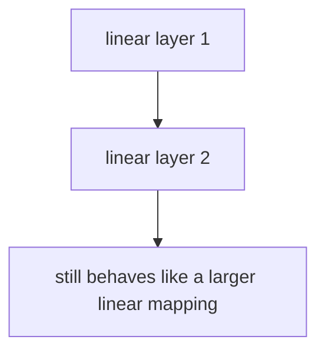
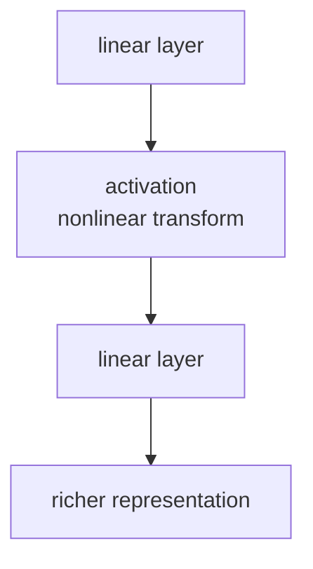

# P5-3.1 활성화 함수(activation function)

Section ID: `P5-3.1`
Version: `v2026.07.07`

P5-2.2에서는 은닉층(hidden layer)이 입력을 더 유용한 내부 표현(representation)으로 바꿀 수 있다는 점을 보았습니다. 이제 바로 다음 질문이 생깁니다.

신경망은 단순히 가중합만 반복하는 것이 아니라는데, 그 변화를 실제로 만들어 주는 것은 무엇인가?

그 역할을 하는 것이 활성화 함수(activation function)입니다.

활성화 함수는 가중합으로 만들어진 점수를 그대로 두지 않고, 비선형성(nonlinearity)을 넣어 신경망이 더 복잡한 패턴을 표현하게 만드는 변환 규칙이다.

활성화와 비선형성의 기준선을 다시 짧게 잡아야 할 때는 개념사전의 [활성화 함수(activation function)](../../../reference/concept-glossary.md#activation-function) 항목으로 돌아갑니다.

## 이 절의 범위

- 활성화 함수는 왜 필요한가?
- 선형 결합만 반복하면 왜 표현력이 제한되는가?
- 비선형성(nonlinearity)을 넣는다는 말은 무엇인가?
- 활성화 함수가 은닉층 표현과 어떤 관계가 있는가?

이 절에서는 다음 내용을 깊게 다루지 않습니다.

- ReLU, sigmoid, tanh의 세부 수식 비교
- 미분값과 gradient flow의 상세 분석
- 출력층에서 쓰는 활성화와 은닉층 활성화의 미세한 구분

대표 활성화 함수의 차이는 P5-3.2에서 이어서 다루고, 출력층 활성화와 손실 함수의 연결은 P5-3.3과 P5-4.1, P5-4.2에서 다시 봅니다. gradient flow의 더 자세한 맥락은 P5-5.1과 P5-7.1에서 다시 연결합니다.

## 이 절의 목표

- 활성화 함수를 `점수에 비선형 변환을 주는 규칙`으로 설명할 수 있습니다.
- 선형 결합만 반복하면 전체도 선형적으로 접히기 쉽다는 점을 이해할 수 있습니다.
- 활성화 함수가 다층 신경망의 표현력을 키우는 핵심 이유를 말할 수 있습니다.
- 실행 가능한 Python 예제로 활성화 전후 값 차이를 확인할 수 있습니다.

## 왜 활성화 함수가 필요한가

P5-1장과 P5-2장에서 본 신경망 계산은 기본적으로 다음 구조를 가집니다.

> 입력을 받는다
> -> 가중합(weighted sum)을 만든다
> -> 출력을 다음 층으로 넘긴다

문제는 이 중간 단계가 전부 선형(linear) 계산뿐이라면, 층을 여러 개 쌓아도 전체는 크게 복잡해지지 않을 수 있다는 점입니다.

여기서는 다음 문장으로 먼저 고정하면 됩니다.

`선형 계산만 여러 번 하는 것만으로는, 신경망이 정말로 더 복잡한 모양과 규칙을 배우기 어렵다.`

즉, 층을 쌓는 것만으로는 충분하지 않습니다. 층 사이에 `직선적인 관계를 꺾는 변환`이 필요합니다. 그 변환이 바로 활성화 함수입니다.

## 비선형성(nonlinearity)은 무엇을 뜻하나

비선형성은 독자에게 가장 추상적으로 들리는 단어 중 하나입니다. 여기서는 먼저 이렇게 이해하면 충분합니다.

`입력이 조금 바뀌었다고 해서 출력이 항상 직선처럼 비례해서만 바뀌지 않게 만드는 성질`

예를 들어:

- 어떤 값 이하에서는 거의 반응하지 않고
- 특정 구간부터 갑자기 반응이 커지거나
- 음수는 잘라내고 양수만 통과시키는 식의 규칙이 생기면

이제 모델은 단순한 직선 판단기보다 더 복잡한 패턴을 표현할 수 있습니다.

## 선형 결합만으로는 왜 부족한가

선형 결합을 여러 층에 걸쳐 반복한다고 가정해 봅시다.

- 첫 번째 층은 입력을 가중합으로 바꿉니다.
- 두 번째 층도 그 출력을 다시 가중합으로 바꿉니다.

그런데 중간에 비선형 변환이 없으면, 이 연속된 계산은 결국 하나의 더 큰 선형 변환으로 묶이기 쉽습니다.

즉:

> 선형 결합
> -> 선형 결합
> -> 선형 결합

만 반복하면, 모델 깊이는 늘었지만 표현력은 기대만큼 늘지 않을 수 있습니다.

이 때문에 딥러닝에서 활성화 함수는 부가 기능이 아니라, `깊이가 의미를 갖게 만드는 핵심 장치`입니다.

이를 아주 단순하게 그리면 다음과 같습니다.



이 도식에서 확인해야 할 결과는 선형 층을 여러 번 쌓아도 중간에 비선형 변환이 없으면 전체가 결국 더 큰 선형 계산처럼 접혀, 표현력이 자동으로 크게 늘지 않는다는 점입니다.

반대로 활성화 함수가 사이에 들어가면 흐름이 달라집니다.



이 도식에서 확인해야 할 결과는 활성화 함수가 선형 계산 사이에 비선형 변환을 넣어 줌으로써, 다음 층이 더 복잡한 표현을 만들 수 있게 하고 깊이를 실제 표현력 증가로 연결한다는 점입니다.

## 활성화 함수는 점수에 어떤 일을 하나

활성화 함수는 보통 가중합 결과 \(z\)를 받아 다른 값으로 바꿉니다.

\[
a = f(z)
\]

다음처럼 읽으면 충분합니다.

- \(z\): 선형 결합으로 만들어진 점수
- \(f\): 활성화 함수
- \(a\): 다음 층으로 넘길 새 값

즉, 활성화 함수는 `계산된 점수를 그대로 전달하지 않고, 다음 층이 더 유용하게 쓸 수 있는 형태로 바꾼다`고 이해할 수 있습니다.

## 은닉층과 활성화는 어떻게 연결되나

P5-2.2에서 은닉층이 내부 표현을 만든다고 했습니다. 활성화 함수는 바로 그 표현이 `단순한 선형 복사`에 머물지 않게 합니다.

즉:

- 가중합은 입력 신호를 조합합니다.
- 활성화는 그 조합에 비선형 변환을 줍니다.
- 그 결과 다음 층은 더 복잡한 내부 표현을 만들 수 있습니다.

이 연결 때문에 활성화 함수는 단순한 출력 규칙이 아니라, representation learning을 가능하게 하는 장치로 읽어야 합니다.

## 사례로 보기

### 사례 1. 이미지 분류

병 이미지를 분류한다고 해 봅시다. 사람은 병 라벨 경계나 손잡이 윤곽처럼 눈에 띄는 선(edge) 비슷한 신호 몇 개를 더하면 충분하다고 느끼기 쉽습니다. 하지만 모든 계산이 선형이라면, 여러 층을 쌓아도 결국 `이 특징이 조금 있으면 점수를 조금 더한다`는 큰 선형 필터 비슷한 구조에 머물 수 있습니다. 중간에 활성화가 들어가면 어떤 신호는 강하게 통과하고 어떤 신호는 약하게 잘리면서 `이 조합일 때만 반응한다` 같은 더 복잡한 조건이 가능해집니다. 그래서 병목이 있는 병과 손잡이가 있는 컵처럼 일부 선 신호가 겹치는 물체도 더 다르게 표현할 수 있습니다. 그래서 이 사례에서 확인해야 할 결과는 비슷한 선 신호를 공유하는 물체라도, 특정 조합에서만 반응하는 중간 표현이 생겨 실제로 다른 범주로 더 잘 갈라지는가입니다.

### 사례 2. 표 데이터

고객 활동 점수, 최근 구매 횟수, 장바구니 금액을 계산한다고 해 봅시다. 사람은 이 점수들을 그대로 조금씩 더하면 고객 상태를 충분히 알 수 있다고 느끼기 쉽습니다. 하지만 실제로는 `최근 구매가 거의 없고 장바구니 금액도 낮을 때만 강하게 위험 신호로 보자` 같은 꺾인 규칙이 필요할 수 있습니다. 선형 조합만 반복하면 모든 값이 조금씩 더해지는 단순 관계에 머물기 쉽지만, 활성화가 들어가면 특정 구간을 넘을 때만 반응이 커지거나 낮은 구간에서는 거의 반응하지 않는 표현이 생길 수 있습니다. 즉, 활성화 함수는 다양한 데이터 도메인에서 `복잡한 규칙을 표현하게 하는 공통 장치`로 이해할 수 있습니다. 그래서 이 사례에서 확인해야 할 결과는 값이 조금씩 더해지는 단순 점수 합이 아니라, 특정 조건 조합에서만 위험 신호가 실제로 더 크게 반응하는가입니다.

## 실행 가능한 Python 예제로 활성화 전후 값 보기

이번 예제의 목표는 활성화 함수가 `선형 결합 점수`를 `다음 층에 넘길 값`으로 바꾸는 감각을 숫자로 확인하는 것입니다. 한 입력만 보는 대신 여러 입력 사례를 한꺼번에 돌려, 어떤 경우에는 신호가 그대로 통과하고 어떤 경우에는 잘리는지도 같이 확인합니다.

입력:

- 두 개의 입력값
- 두 개의 가중치
- 편향

출력:

- 선형 결합 결과 `z`
- ReLU 활성화 후 결과
- 어떤 입력이 살아남고 어떤 입력이 잘리는지에 대한 비교

문제 상황:

- ReLU가 음수 입력을 어떻게 잘라 내고 양수 입력만 통과시키는지 직접 확인해 볼 필요가 있다

확인할 개념:

- ReLU는 선형 결합 결과를 그대로 두지 않고 음수 구간을 0으로 만든다
- 활성화 전후를 나란히 보면 어떤 신호가 다음 층으로 전달되는지 읽기 쉽다

입력(input):

위에 정리한 입력값, 가중치, 편향을 사용합니다.

```python
def relu(z):
    return max(0.0, z)


w1 = 0.7
w2 = 0.9
b = -0.1

examples = {
    "edge_like_signal": (1.0, -0.5),
    "weak_negative_signal": (0.1, -1.0),
    "strong_positive_signal": (1.2, 0.3),
}

for name, (x1, x2) in examples.items():
    z = x1 * w1 + x2 * w2 + b
    a = relu(z)
    print(f"[{name}]")
    print("inputs =", {"x1": x1, "x2": x2})
    print("linear score z =", round(z, 3))
    print("after activation =", round(a, 3))
    print("---")
```

출력에서는 각 `inputs`에 대해 `linear score z`가 먼저 계산되고, 음수 점수가 `after activation`에서 어떻게 0으로 바뀌는지 이어서 보면 됩니다.

```text
[edge_like_signal]
inputs = {'x1': 1.0, 'x2': -0.5}
linear score z = 0.15
after activation = 0.15
---
[weak_negative_signal]
inputs = {'x1': 0.1, 'x2': -1.0}
linear score z = -0.93
after activation = 0.0
---
[strong_positive_signal]
inputs = {'x1': 1.2, 'x2': 0.3}
linear score z = 1.01
after activation = 1.01
---
```

이 예제에서 중요한 것은 활성화 함수가 단순히 숫자를 복사하는 것이 아니라, 다음 층이 읽게 될 값을 바꾼다는 점입니다. `weak_negative_signal`처럼 선형 점수가 음수면 ReLU 뒤에서 0으로 잘리고, `strong_positive_signal`처럼 충분히 큰 신호는 그대로 살아남는다는 차이가 드러납니다.

## 활성화 함수가 없으면 딥러닝이 왜 약해지나

활성화 함수가 없다면:

- 층은 많아 보여도
- 중간 표현은 충분히 꺾이지 않고
- 전체는 큰 선형 계산으로 접힐 수 있습니다.

반대로 활성화 함수가 있으면:

- 어떤 신호는 살리고
- 어떤 신호는 자르고
- 다음 층이 더 복잡한 조합을 만들 수 있게 됩니다.

이 때문에 딥러닝의 깊이(depth)는 활성화 함수와 함께 읽어야 의미가 생깁니다.

딥러닝 역사에서 퍼셉트론과 다층 신경망이 다시 주목받은 이유 중 하나도 바로 이 지점과 연결됩니다. 단일 퍼셉트론의 한계는 오래전부터 알려져 있었지만, 다층 구조와 비선형 활성화, 그리고 이를 학습할 수 있는 계산 자원과 알고리즘이 다시 결합되면서 신경망이 큰 표현력을 갖기 시작했습니다.

커리큘럼 관점에서도 활성화 함수는 초반부에 꼭 등장해야 합니다. 이유는 단순합니다.

- 퍼셉트론을 보면 선형 결합이 이해됩니다.
- 다층 신경망을 보면 중간 표현이 이해됩니다.
- 활성화 함수를 보면 왜 그 중간 표현이 선형 복사가 아니게 되는지 이해됩니다.

즉, 활성화 함수는 Part 5 초반부의 핵심 연결고리입니다.

## 언제 활성화 함수 관점으로 먼저 읽는가

활성화 함수 절을 꺼내야 하는 시점은 `층을 쌓는 이유는 이해했지만, 왜 그 깊이가 단순 선형 반복이 아니게 되는가`가 아직 닫히지 않을 때입니다.

| 먼저 보이는 문제 장면 | 활성화 함수 관점이 먼저 유용한 이유 | 바로 다음에 넘길 질문 |
| --- | --- | --- |
| 선형 층을 여러 번 쌓았는데도 왜 더 복잡해지는지 설명이 약하다 | 비선형 변환이 깊이를 실제 표현력으로 바꾸는 장치라는 점을 보여 줍니다. | 어떤 대표 활성화 함수가 어떻게 다르게 반응하는지 봐야 합니다. |
| 은닉층 표현이 왜 단순 복사가 아닌지 더 분명히 해야 한다 | 가중합 뒤에 어떤 값은 살리고 어떤 값은 꺾는 규칙이 들어간다는 점을 연결할 수 있습니다. | ReLU, sigmoid, tanh의 차이로 넘어갑니다. |
| 다층 구조 설명이 구조 이름 소개에 머물 위험이 있다 | 활성화 함수를 붙여야 구조가 계산 감각으로 읽히기 시작합니다. | 출력층 해석과는 어떻게 다른지 뒤 절에서 구분해야 합니다. |
| 비선형성이라는 말이 너무 추상적으로 느껴진다 | 선형 반복만으로는 부족하다는 문제를 실제로 닫는 자리이기 때문입니다. | 구체 함수 예시를 바로 비교해야 합니다. |

## 다음 절과의 연결

여기까지 오면 다음 질문이 남습니다.

- 어떤 활성화 함수를 많이 쓰는가?
- sigmoid, tanh, ReLU는 무엇이 다른가?
- 왜 현대 신경망에서는 ReLU 계열이 자주 등장하는가?

이 질문은 바로 P5-3.2에서 이어서 다룹니다.

## 이 절에서 기억할 관점

- 활성화 함수는 가중합 점수에 비선형 변환을 주는 규칙입니다.
- 선형 결합만 반복하면 깊이가 늘어도 표현력이 충분히 늘지 않을 수 있습니다.
- 활성화 함수는 은닉층이 더 유용한 내부 표현을 만들게 하는 핵심 장치입니다.
- 딥러닝의 깊이는 활성화 함수와 함께 읽을 때 비로소 의미가 생깁니다.

이 절의 핵심은 함수 이름을 외우는 일이 아니라, 깊이가 왜 선형 반복과 달라지는지 고정하는 데 있습니다.

| 지금 절에서 먼저 잡을 것 | 바로 다음에 이어질 질문 | 뒤에서 다시 연결될 곳 |
| --- | --- | --- |
| 비선형 변환이 있어야 은닉층 표현이 더 풍부해진다는 점 | 어떤 활성화 함수가 어떤 계산 감각을 가지는가 | P5-3.2 활성화 함수 비교, 뒤의 학습 안정화 절 |

## 짧은 점검

- 왜 층을 여러 개 쌓는 것만으로는 충분하지 않고, 활성화 함수가 함께 있어야 하는지 설명할 수 있는가?
- 비선형성이 `직선적 비례만 따르지 않게 만드는 성질`이라는 정도로라도 말할 수 있는가?
- 이 절은 활성화 함수의 필요성을 닫고, 함수별 비교와 출력층 선택은 다음 절들로 넘긴다는 흐름을 알고 있는가?

## 언제 이 관점을 먼저 떠올려야 하는가

- 층을 많이 쌓았는데도 왜 표현력이 충분히 늘지 않는지 설명해야 할 때, 활성화 함수의 비선형성 관점을 먼저 떠올립니다.
- 선형 계산 반복과 딥러닝의 차이가 흐려질 때, 깊이가 의미를 가지려면 비선형 변환이 함께 있어야 한다는 점을 다시 봅니다.
- 함수 이름 비교로 바로 들어가기 전에 왜 활성화가 필요한지를 다시 묶어야 할 때, 이 절을 기준선으로 씁니다.

## 체크리스트

- 활성화 함수가 왜 비선형성(nonlinearity)을 넣는 장치인지 설명할 수 있는가?
- 활성화 함수가 없으면 깊이가 표현력으로 이어지지 않는 이유를 말할 수 있는가?

## 출처와 참고 자료

- Ian Goodfellow, Yoshua Bengio, Aaron Courville, `Deep Learning`, MIT Press, 2016, 확인 날짜: 2026-06-29. [https://www.deeplearningbook.org/](https://www.deeplearningbook.org/){: target="_blank" rel="noopener noreferrer" }
- Yann LeCun, Yoshua Bengio, Geoffrey Hinton, `Deep learning`, Nature, 2015, 확인 날짜: 2026-06-29. [https://www.nature.com/articles/nature14539](https://www.nature.com/articles/nature14539){: target="_blank" rel="noopener noreferrer" }
