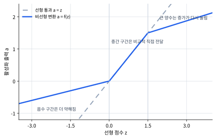

# P5-3.1 활성화 함수(activation function)

Section ID: `P5-3.1`
Version: `v2026.07.16`

P5-2.2에서는 은닉층(hidden layer)이 입력을 더 유용한 내부 표현(representation)으로 바꿀 수 있다는 점을 보았습니다. 이제 바로 다음 질문이 생깁니다.

신경망은 단순히 가중합만 반복하는 것이 아니라는데, 그 변화를 실제로 만들어 주는 것은 무엇인가?

그 역할을 하는 것이 활성화 함수(activation function)입니다.

활성화 함수는 한 노드가 만든 가중합 점수 \(z\)를 받아, 다음 층에 넘길 값 \(a\)로 바꾸는 함수입니다.

\[
a = f(z)
\]

즉, 한 노드 안에서는 보통 `입력값 -> 가중합 점수 z -> 활성화 함수 f -> 다음 층으로 넘길 값 a`의 순서가 일어납니다. 활성화 함수는 학습을 직접 수행하는 별도 모델이 아니라, 계산된 점수를 그대로 넘길지, 약하게 남길지, 강하게 남길지 바꾸는 변환 규칙입니다.

이 위치 관계만 따로 그리면 다음과 같습니다.

```mermaid
--8<-- "assets/part-05/chapter-03/node-activation-flow-ko.mmd"
```

이 변환 규칙이 단순한 비례 관계를 벗어나게 만들면 비선형성(nonlinearity)이 생기고, 신경망은 더 복잡한 패턴을 표현할 수 있습니다.

활성화와 비선형성의 기준선을 다시 짧게 잡아야 할 때는 개념사전의 [활성화 함수(activation function)](../../../reference/concept-glossary.md#activation-function) 항목으로 돌아갑니다.

## 이 절의 범위

- 활성화 함수는 왜 필요한가?
- 선형 결합만 반복하면 왜 표현력이 제한되는가?
- 비선형성(nonlinearity)을 넣는다는 말은 무엇인가?
- 활성화 함수가 은닉층 표현과 어떤 관계가 있는가?

이 절에서는 다음 내용을 깊게 다루지 않습니다.

- 대표 활성화 함수들의 세부 수식 비교
- 미분값과 gradient flow의 상세 분석
- 출력층에서 쓰는 활성화와 은닉층 활성화의 미세한 구분

대표 활성화 함수의 차이는 P5-3.2부터 P5-3.5까지 이어서 다루고, 출력층 활성화와 손실 함수의 연결은 P5-3.6과 P5-4.1, P5-4.2에서 다시 봅니다. gradient flow의 더 자세한 맥락은 P5-5.1과 P5-7.1에서 다시 연결합니다.

## 이 절의 목표

- 활성화 함수를 `점수에 비선형 변환을 주는 규칙`으로 설명할 수 있습니다.
- 선형 결합만 반복하면 전체도 선형적으로 접히기 쉽다는 점을 이해할 수 있습니다.
- 활성화 함수가 다층 신경망의 표현력을 키우는 핵심 이유를 말할 수 있습니다.
- 활성화 전후 값을 비교해 어떤 신호가 끊기고 살아남는지 설명할 수 있습니다.

## 왜 활성화 함수가 필요한가

P5-1장과 P5-2장에서 본 신경망 계산은 기본적으로 다음 구조를 가집니다.

> 입력을 받는다
> -> 가중합(weighted sum)을 만든다
> -> 출력을 다음 층으로 넘긴다

문제는 이 중간 단계가 전부 선형(linear) 계산뿐이라면, 층을 여러 개 쌓아도 전체는 크게 복잡해지지 않을 수 있다는 점입니다.

여기서는 다음 문장으로 먼저 고정하면 됩니다.

`선형 계산만 여러 번 하는 것만으로는, 신경망이 정말로 더 복잡한 모양과 규칙을 배우기 어렵다.`

즉, 층을 쌓는 것만으로는 충분하지 않습니다. 층 사이에 `직선적인 관계를 꺾는 변환`이 필요합니다. 그 변환이 바로 활성화 함수입니다.

## 비선형성(nonlinearity)은 무엇을 뜻하나

비선형성은 독자에게 가장 추상적으로 들리는 단어 중 하나입니다. 여기서는 먼저 이렇게 이해하면 충분합니다.

`입력이 조금 바뀌었다고 해서 출력이 항상 직선처럼 비례해서만 바뀌지 않게 만드는 성질`

예를 들어:

- 어떤 값 이하에서는 거의 반응하지 않고
- 특정 구간부터 갑자기 반응이 커지거나
- 기준 아래 신호는 거의 전달하지 않고 기준 위 신호만 더 크게 남기는 식의 규칙이 생기면

이제 모델은 단순한 직선 판단기보다 더 복잡한 패턴을 표현할 수 있습니다.

## 선형 결합만으로는 왜 부족한가

선형 결합을 여러 층에 걸쳐 반복한다고 가정해 봅시다.

- 첫 번째 층은 입력을 가중합으로 바꿉니다.
- 두 번째 층도 그 출력을 다시 가중합으로 바꿉니다.

그런데 중간에 비선형 변환이 없으면, 이 연속된 계산은 결국 하나의 더 큰 선형 변환으로 묶이기 쉽습니다.

즉:

> 선형 결합
> -> 선형 결합
> -> 선형 결합

만 반복하면, 모델 깊이는 늘었지만 표현력은 기대만큼 늘지 않을 수 있습니다.

이 때문에 딥러닝에서 활성화 함수는 부가 기능이 아니라, `깊이가 의미를 갖게 만드는 핵심 장치`입니다.

이를 아주 단순하게 그리면 다음과 같습니다.

```mermaid
--8<-- "assets/part-05/chapter-03/stacked-linear-layers-ko.mmd"
```

이 도식에서 확인해야 할 결과는 선형 층을 여러 번 쌓아도 중간에 비선형 변환이 없으면 전체가 결국 더 큰 선형 계산처럼 접혀, 표현력이 자동으로 크게 늘지 않는다는 점입니다.

반대로 활성화 함수가 사이에 들어가면 흐름이 달라집니다.

```mermaid
--8<-- "assets/part-05/chapter-03/linear-activation-linear-ko.mmd"
```

이 도식에서 확인해야 할 결과는 활성화 함수가 선형 계산 사이에 비선형 변환을 넣어 줌으로써, 다음 층이 더 복잡한 표현을 만들 수 있게 하고 깊이를 실제 표현력 증가로 연결한다는 점입니다.

## 활성화 함수는 점수에 어떤 일을 하나

앞에서 본 식을 다시 읽어 봅시다.

- \(z\): 선형 결합으로 만들어진 점수
- \(f\): 활성화 함수
- \(a\): 다음 층으로 넘길 새 값

이 절에서 중요한 것은 특정 함수 이름을 외우는 것이 아닙니다. 활성화 함수는 `계산된 점수를 그대로 전달하지 않고, 다음 층이 더 유용하게 쓸 수 있는 형태로 바꾼다`고 이해하면 됩니다.

비선형 변환이라는 말은 `z가 1만큼 늘면 a도 항상 같은 비율로 1만큼 는다`는 직선 규칙에서 벗어난다는 뜻입니다. 예를 들어 다음과 같은 교육용 규칙을 생각해 볼 수 있습니다.

\[
f(z)=
\begin{cases}
0.2z & z < 0 \\
z & 0 \le z \le 1.5 \\
1.5 + 0.25(z - 1.5) & z > 1.5
\end{cases}
\]

이 식은 대표 활성화 함수의 이름을 외우기 위한 식이 아닙니다. 같은 점수 \(z\)라도 구간에 따라 \(a\)로 바뀌는 정도가 달라질 수 있다는 점을 보여 주는 예시입니다. 음수 구간에서는 신호가 약해지고, 중간 구간에서는 비교적 직접 전달되며, 높은 구간에서는 증가가 다시 눌립니다. 그래서 전체 그래프는 하나의 직선이 아니라 중간에서 꺾인 모양이 됩니다.



위 그래프에서 회색 점선은 `a = z`처럼 점수를 그대로 넘기는 선형 통과입니다. 파란 선은 구간마다 반응이 달라지는 비선형 변환입니다. 활성화 함수가 비선형 변환을 준다는 말은, 다음 층이 받는 값 \(a\)가 단순히 \(z\)의 복사본이 아니라 이런 식으로 구간별 의미가 바뀐 값이 될 수 있다는 뜻입니다.

## 은닉층과 활성화는 어떻게 연결되나

P5-2.2에서 은닉층이 내부 표현을 만든다고 했습니다. 활성화 함수는 바로 그 표현이 `단순한 선형 복사`에 머물지 않게 합니다.

즉:

- 가중합은 입력 신호를 조합합니다.
- 활성화는 그 조합에 비선형 변환을 줍니다.
- 그 결과 다음 층은 더 복잡한 내부 표현을 만들 수 있습니다.

이 연결 때문에 활성화 함수는 단순한 출력 규칙이 아니라, representation learning을 가능하게 하는 장치로 읽어야 합니다.

## 사례 및 예시

### 사례 1. 설비 시각 신호 분류

설비 카메라 프레임에서 `정상 배관 구간`, `경고등이 켜진 밸브 구간`, `압력계 바늘이 위험 구간에 들어간 패널`을 구분한다고 해 봅시다. 사람은 경광등 윤곽, 배관 선, 계기판 테두리처럼 눈에 띄는 선(edge) 비슷한 신호 몇 개를 더하면 충분하다고 느끼기 쉽습니다.

여기서 먼저 봐야 할 것은 `활성화 함수가 어디에 들어가는가`입니다. 한 중간 노드가 경광등 윤곽, 바늘 위치, 원형 계기판 테두리 같은 시각 단서를 받아 선형 점수 \(z\)를 만든 뒤, 활성화 함수가 그 \(z\)를 다음 층에 넘길 값 \(a\)로 바꾼다고 생각하면 됩니다.

\[
z = w_1 x_1 + w_2 x_2 + w_3 x_3 + b,\qquad a = f(z)
\]

즉, 이 사례에서 활성화 함수는 `이미지를 직접 읽는 장치`가 아니라, `중간 노드가 만든 선형 점수 z를 다음 층이 읽을 값 a로 바꾸는 규칙`입니다.

예를 들어 이 사례는 다음 순서로 읽으면 됩니다.

1. 배관 선은 보이지만 경고등과 위험 바늘 조합이 약한 장면에서는, 선형 점수 \(z\)가 기준 아래에 가까운 값으로 남기 쉽습니다.
2. 이 값을 활성화 뒤까지 보면, 기준 아래 구간은 거의 사라져 다음 층에서 큰 위험 신호로 읽히지 않을 수 있습니다.
3. 반대로 경고등 윤곽과 위험 바늘 위치가 함께 강하게 보이는 장면에서는, 선형 점수 \(z\)가 더 크게 올라갑니다.
4. 이 장면은 활성화 뒤에도 큰 값으로 살아남아, 다음 층이 `위험 조합`으로 더 강하게 읽기 쉬워집니다.

모든 계산이 선형이라면, 여러 층을 쌓아도 결국 `이 특징이 조금 있으면 점수를 조금 더한다`는 큰 선형 필터 비슷한 구조에 머물 수 있습니다. 하지만 중간에 활성화가 들어가면 어떤 점수는 거의 끊기고 어떤 점수는 살아남으면서 `경광등과 바늘 위치가 함께 보일 때만 크게 반응한다` 같은 더 복잡한 조건이 가능해집니다. 그래서 배관 곡선과 원형 계기판처럼 일부 시각 단서가 겹치는 장면도 더 다르게 표현할 수 있습니다.

그래서 이 사례에서 확인해야 할 결과는, 비슷한 선 신호를 공유하는 장면이라도 활성화 함수가 선형 점수 \(z\)를 그대로 복사하지 않고 걸러 주어, 특정 조합에서만 반응하는 중간 표현이 생겨 실제로 다른 운영 상태로 더 잘 갈라지는가입니다.

사람은 여기서 선 신호가 몇 개 보이면 점수를 조금 더한다고만 생각하기 쉽습니다. 하지만 활성화 관점으로 다시 읽으면, 핵심은 단서의 양 자체보다 `어떤 조합이 기준을 넘느냐`, `어떤 조합이 중간에서 거의 끊기느냐`에 있습니다. 그래서 배관 곡선과 계기판 테두리처럼 비슷한 선 신호가 있어도, 특정 조합일 때만 더 크게 살아나는 표현이 가능해집니다.

이 사례의 핵심은 `약함 -> 경계 -> 강함`에 따라 시각 단서 조합이 서로 다른 \(z\)와 활성화 결과로 갈라진다는 점입니다. 아래 공통 도식에서 이 흐름을 운영 표 데이터 사례와 함께 다시 묶어 봅니다.

### 사례 2. 운영 표 데이터

설비 상태 표에서 `최근 경보 수`, `압력 복귀 지연 시간`, `재기동 실패 횟수`를 함께 본다고 해 봅시다. 사람은 이 수치들을 그대로 조금씩 더하면 현재 위험 상태를 충분히 읽을 수 있다고 느끼기 쉽습니다.

하지만 이 장면에서도 활성화 함수는 단순한 필요성 설명이 아니라, `선형 점수 z를 다음 층에 넘길 값 a로 바꾸는 규칙`으로 읽어야 합니다. 한 중간 노드가 경보 수, 복귀 지연, 실패 횟수를 받아 먼저 선형 점수 \(z\)를 만들고, 활성화 함수가 그 값을 다시 \(a\)로 바꿉니다.

\[
z = w_1 x_1 + w_2 x_2 + w_3 x_3 + b,\qquad a = f(z)
\]

즉, 운영 표 데이터에서 활성화 함수는 `표를 직접 읽는 규칙`이 아니라, `합쳐진 위험 점수가 다음 층에서 무시될지, 약하게 남을지, 강하게 살아남을지`를 정하는 규칙입니다.

예를 들어 이 사례도 같은 순서로 읽을 수 있습니다.

1. `경보 1회, 복귀 지연 짧음, 실패 0회` 같은 상태는 선형 점수 \(z\)만 보면 기준 아래에 가까운 값으로 남기 쉽습니다.
2. 이 값을 활성화 뒤까지 보면, 기준 아래 구간은 거의 사라져 다음 층에서 큰 위험 표현으로 이어지지 않을 수 있습니다.
3. `경보 2회, 복귀 지연 보통, 실패 1회` 같은 상태는 선형 점수만 보면 단지 조금 더 높은 연속 점수처럼 보입니다.
4. 하지만 활성화 뒤까지 보면, 이 상태는 경계 바로 위의 약한 신호라 간신히 살아남는 흐름으로 읽힐 수 있습니다.
5. `경보 4회, 복귀 지연 김, 실패 2회`처럼 신호가 많이 겹친 상태는 선형 점수도 크게 올라가고, 활성화 뒤에도 큰 값으로 남아 다음 층이 계속 주목해야 할 위험 조합 신호가 됩니다.

실제로는 `경보 수가 많고 압력 복귀도 늦을 때만 강하게 위험 신호로 보자` 같은 꺾인 규칙이 필요할 수 있습니다. 선형 조합만 반복하면 모든 값이 조금씩 더해지는 단순 관계에 머물기 쉽지만, 활성화가 들어가면 특정 구간을 넘을 때만 반응이 커지거나 낮은 구간에서는 거의 반응하지 않는 표현이 생길 수 있습니다.

같은 설비라도 상태를 세 구간으로 나눠 읽으면, 왜 `조금씩 더한 총합`보다 `어느 구간에서 실제로 표현이 살아나는가`가 더 중요한지 빨리 보입니다. 약한 이상 신호만 있는 상태는 기준 아래라면 거의 약해져 다음 층까지 크게 이어지지 않을 수 있습니다. 애매하지만 조금 더 위험해 보이는 상태는 경계 바로 위의 약한 신호라 간신히 살아남는 신호가 됩니다. 반대로 누가 봐도 위험이 큰 상태는 강한 신호로 살아남아 다음 층이 계속 주목해야 할 조합 신호가 됩니다.

같은 입력을 `선형 점수만 볼 때`와 `활성화 뒤 값까지 볼 때`로 나눠 읽으면 차이가 더 잘 보입니다. 선형 점수만 보면 경보 수, 복귀 지연, 실패 횟수가 조금씩 더해진 합처럼 보입니다. 그래서 모든 신호가 계속 조금씩만 반영된 연속 점수라고 느끼기 쉽습니다. 하지만 활성화 뒤 값까지 보면, 기준 이하 구간은 실제로 거의 약해지고 특정 조합만 살아남습니다. 이때 비로소 `이 조건 조합일 때만 위험 표현이 켜진다`는 규칙이 더 직접적으로 보입니다.

이 사례에서도 `약함 -> 경계 -> 강함`에 따라 운영 신호 조합이 서로 다른 \(z\)와 활성화 결과로 갈라집니다. 사례별 흐름은 본문 문장으로 읽고, 도식은 두 사례에 공통으로 남는 신호 생존 흐름만 압축합니다.

즉, 활성화 함수는 다양한 데이터 도메인에서 `복잡한 규칙을 표현하게 하는 공통 장치`로 이해할 수 있습니다. 그래서 이 사례에서 확인해야 할 결과는 값이 조금씩 더해지는 단순 점수 합이 아니라, 특정 조건 조합에서만 위험 신호가 실제로 더 크게 반응하는가입니다.

두 사례를 한 장면으로 다시 압축하면, 독자가 붙잡아야 할 흐름은 다음과 같습니다.

```mermaid
--8<-- "assets/part-05/chapter-03/activation-signal-survival-flow-ko.mmd"
```

이 도식은 사례 1의 시각 신호와 사례 2의 운영 표 데이터를 따로 다시 그리려는 목적이 아니라, 두 사례가 공통으로 보여 준 `약함 -> 거의 잘림`, `경계 -> 약하게 남음`, `강함 -> 크게 살아남음`의 활성화 흐름을 한 번에 다시 읽게 하려는 목적입니다.

두 사례를 나란히 놓고 보면, 활성화 함수의 역할은 `기준 아래 신호를 약하게 만든다` 수준에서 끝나지 않습니다. 설비 시각 신호 분류에서는 선 신호가 조금씩 더해진 하나의 큰 점수처럼 보이던 장면이, 활성화 뒤에는 `경광등 + 계기판 바늘`처럼 특정 윤곽 조합일 때만 더 강하게 반응하는 중간 표현으로 바뀔 수 있습니다. 운영 표 데이터에서도 경보 수, 복귀 지연, 실패 횟수가 모두 조금씩 더해진 합처럼 보이던 입력이, 활성화 뒤에는 기준 아래 신호는 거의 약해지고 `경보 반복 + 복귀 지연` 같은 특정 조건 조합만 더 강하게 남는 흐름으로 바뀝니다.

독자가 여기서 먼저 붙잡아야 할 결과는, 활성화 함수가 단순히 숫자를 바꾸는 장치가 아니라 `다음 층이 무엇을 중요한 신호로 다시 보게 할지`를 바꾸는 장치라는 점입니다.

## 연습 및 예제

이번 연습의 목표는 활성화 함수가 `선형 결합 점수`를 `다음 층에 넘길 값`으로 바꾸는 감각을 사례 비교로 확인하는 것입니다. 한 입력만 보는 대신 여러 운영 상태를 나란히 놓고, 어떤 경우에는 신호가 살아남고 어떤 경우에는 거의 사라지는지 함께 읽습니다.

입력:

- 최근 경보 수
- 압력 복귀 지연 점수
- 재기동 실패 횟수
- 세 신호에 대응하는 가중치
- 편향
- 네 가지 다른 운영 상태 케이스

출력:

- 선형 결합 결과 `z`
- 활성화 뒤 결과 `a`
- 어떤 입력이 살아남고 어떤 입력이 거의 사라지는지에 대한 비교
- 경계 근처의 약한 신호와 크게 살아남는 신호를 구분하는 비교

문제 상황:

- 활성화 함수가 선형 점수를 그대로 복사하지 않고, 다음 층에 남길 신호를 어떻게 바꾸는지 직접 확인해 볼 필요가 있다

확인할 개념:

- 활성화 함수는 선형 결합 결과를 그대로 두지 않고 다음 층에 넘길 값을 바꾼다
- 활성화 전후를 나란히 보면 어떤 신호가 다음 층으로 전달되는지 읽기 쉽다

입력(input):

운영 표 사례와 같은 흐름으로, 중간 노드 하나가 `최근 경보 수`, `압력 복귀 지연 점수`, `재기동 실패 횟수`를 받아 선형 점수 \(z\)를 만든다고 가정합니다. 여기서 `압력 복귀 지연 점수`는 실제 분 단위를 그대로 쓴 값이 아니라, 복귀가 늦을수록 커지도록 0에서 3 안팎으로 단순화한 연습용 입력입니다.

이 연습에서는 다음 계산 기준을 사용합니다.

\[
z = 0.5 \times \text{최근 경보 수} + 0.4 \times \text{압력 복귀 지연 점수} + 1.2 \times \text{재기동 실패 횟수} - 1.5
\]

그리고 활성화 뒤 값 \(a\)는 다음처럼 읽습니다.

\[
a =
\begin{cases}
0 & z \le 0 \\
z & z > 0
\end{cases}
\]

이 규칙은 대표 활성화 함수 비교를 시작하려는 것이 아니라, `문턱 아래 신호는 다음 층에 거의 남지 않고, 문턱 위 신호는 크기 차이를 가진 채 남는다`는 감각을 실험하기 위한 단순 규칙입니다.

먼저 입력값을 봅니다.

| 케이스 | 최근 경보 수 | 압력 복귀 지연 점수 | 재기동 실패 횟수 | 사람이 먼저 읽기 쉬운 상태 |
| --- | ---: | ---: | ---: | --- |
| `brief_alarm_recovered` | `1` | `0.5` | `0` | 경보가 잠깐 있었지만 빠르게 복귀한 상태 |
| `recovery_dominant_signal` | `0` | `0.5` | `0` | 복귀 흐름이 우세해 위험 신호가 약한 상태 |
| `borderline_warning_signal` | `2` | `2.3` | `0` | 경보와 지연이 겹쳐 경계 근처에 걸린 상태 |
| `strong_warning_signal` | `4` | `3.0` | `2` | 경보 반복, 복귀 지연, 재기동 실패가 함께 겹친 상태 |

표를 보기 전에 먼저 각 입력이 활성화 뒤에 어떻게 보일지 예상해 보면 좋습니다.

| 케이스 | 먼저 예상해 볼 결과 | 예상 이유 |
| --- | --- | --- |
| `brief_alarm_recovered` | `z`는 기준 아래, `a`는 거의 남지 않음 | 경보가 잠깐 있었어도 복귀가 빠르고 실패가 없으면 기준 아래에 머물 가능성이 큽니다. |
| `recovery_dominant_signal` | `z`는 기준 아래, `a`는 거의 남지 않음 | 복귀 지연 점수가 낮고 실패도 없으면 다음 층에 거의 안 남을 수 있습니다. |
| `borderline_warning_signal` | `z`와 `a`가 모두 기준 바로 위의 약한 신호 | 경보와 지연이 조금 겹쳐 경계 바로 위에 걸릴 가능성이 있습니다. |
| `strong_warning_signal` | `z`와 `a`가 모두 큰 신호 | 경보 반복, 복귀 지연, 재기동 실패가 함께 겹쳐 기준을 충분히 넘길 가능성이 큽니다. |

이 표의 목적은 정확한 소수점 값을 맞히는 것이 아니라, `활성화 함수가 선형 점수를 그대로 복사하지 않을 것`, `경계 바로 위의 약한 신호와 충분히 큰 신호를 다르게 읽어야 한다`는 점을 먼저 예상해 보는 데 있습니다.

같은 네 상태를 간단한 활성화 관점으로 정리하면 다음처럼 읽을 수 있습니다. 여기서 쓰는 값은 앞에서 본 교육용 구간 함수의 계산값을 그대로 재현하려는 것이 아니라, 문턱 아래 신호가 거의 사라지고 문턱 위 신호가 남는 단순 관찰용 규칙으로 읽습니다. 목표는 특정 함수 이름을 외우는 것이 아니라, 활성화 전 점수 `z`와 다음 층에 실제로 남는 값 `a`가 같은 역할을 하지 않는다는 점을 보는 것입니다.

| 케이스 | z 계산 | z | 활성화 뒤 값 | 다음 층 입장에서 읽히는 상태 |
| --- | --- | --- | --- | --- |
| `brief_alarm_recovered` | `0.5*1 + 0.4*0.5 + 1.2*0 - 1.5` | `-0.8` | `0.0` | 잠깐 흔들렸지만 다음 층까지는 거의 안 가는 신호 |
| `recovery_dominant_signal` | `0.5*0 + 0.4*0.5 + 1.2*0 - 1.5` | `-1.3` | `0.0` | 거의 전달되지 않는 신호 |
| `borderline_warning_signal` | `0.5*2 + 0.4*2.3 + 1.2*0 - 1.5` | `0.42` | `0.42` | 간신히 살아남는 약한 신호 |
| `strong_warning_signal` | `0.5*4 + 0.4*3.0 + 1.2*2 - 1.5` | `4.1` | `4.1` | 다음 층이 계속 활용하기 쉬운 강한 신호 |

이 표를 `선형 점수만 볼 때`와 다시 연결하면 차이가 더 분명해집니다.

선형 점수만 보면 기준 아래 값도 단지 작은 점수처럼 보이지만, 활성화 뒤에는 `brief_alarm_recovered`와 `recovery_dominant_signal`이 실제로 `0`에 가까워져 다음 층에 거의 전달되지 않습니다. 반대로 `borderline_warning_signal`과 `strong_warning_signal`은 둘 다 기준 위에 있지만 같은 의미가 아닙니다. 하나는 경계 바로 위에서 간신히 살아남는 약한 신호이고, 다른 하나는 다음 층이 계속 활용하기 쉬운 강한 신호입니다. 활성화가 깊이를 의미 있게 만드는 이유도 여기에 있습니다. 선형 점수의 크기를 비교하는 데서 끝나는 것이 아니라, 다음 층의 입력 구성을 실제로 바꾸기 때문입니다.

출력 해석을 실제 운영 판단까지 다시 묶어 보면, `기준 위면 다 같은 경고`라고 읽는 오해가 왜 위험한지도 보입니다.

`borderline_warning_signal`과 `strong_warning_signal`을 모두 강한 경고로 읽으면 약한 추적 신호까지 과잉 차단으로 이어질 수 있습니다. 둘 다 살아남았지만 하나는 약한 추적 신호이고, 다른 하나는 강한 경고 신호입니다. 반대로 `brief_alarm_recovered`와 `borderline_warning_signal`을 둘 다 애매한 신호로 묶어 버리면, 하나는 완전히 잘렸고 다른 하나는 간신히 살아남아 추적 가치가 남았다는 차이를 놓칩니다. 경계 바로 위 신호까지 0과 같은 뜻으로 읽으면 약한 이상 징후를 놓칠 수 있습니다.

즉, 이 절에서 봐야 하는 것은 특정 대표 함수의 이름이 아니라, 활성화가 `어디서 거의 사라지고 어디서 약하게 살아나며 어디서 강하게 남는가`를 바꾸는 규칙이라는 점입니다.

여기서 한 번 더 학습 관점으로 정리하면, 이 연습의 핵심은 정답표를 외우는 것이 아니라 `경계가 어디에 있는가`, `경계 바로 위 신호와 충분히 큰 신호를 왜 다르게 읽어야 하는가`, `거의 사라진 신호를 왜 다음 층이 사실상 못 보는가`를 스스로 설명하는 데 있습니다.

마지막으로 값을 직접 바꿔 봅니다. 아래 표는 손으로 다시 계산해 볼 수 있는 작은 실험입니다.

| 바꿔 볼 값 | 다시 계산할 케이스 | 달라지는 z | 활성화 뒤 변화 | 지금 떠올릴 질문 |
| --- | --- | --- | --- | --- |
| 편향을 `-1.5`에서 `-2.0`으로 낮춘다 | `borderline_warning_signal` | `0.42 -> -0.08` | `0.42 -> 0.0` | 경계가 뒤로 밀리면 약한 이상 신호를 얼마나 놓치게 되는가 |
| `재기동 실패 횟수` 가중치를 `1.2`에서 `1.6`으로 키운다 | `strong_warning_signal` | `4.1 -> 4.9` | `4.1 -> 4.9` | 실패 신호에 더 민감한 중간 표현이 되면 어떤 케이스가 더 강해지는가 |
| `borderline_warning_signal`의 복귀 지연 점수를 `2.3`에서 `1.0`으로 낮춘다 | `borderline_warning_signal` | `0.42 -> -0.1` | `0.42 -> 0.0` | 회복이 빨라지면 약한 경고와 정상 회복을 어디서 갈라 읽을 것인가 |

이 실험을 마치면 같은 입력이라도 가중치와 편향이 바뀌면 경계가 움직이고, 경계가 움직이면 다음 층에 남는 신호 자체가 달라진다는 점을 확인할 수 있습니다.

## 활성화 함수가 없으면 딥러닝이 왜 약해지나

활성화 함수가 없다면:

- 층은 많아 보여도
- 중간 표현은 충분히 꺾이지 않고
- 전체는 큰 선형 계산으로 접힐 수 있습니다.

반대로 활성화 함수가 있으면:

- 어떤 신호는 살리고
- 어떤 신호는 자르고
- 다음 층이 더 복잡한 조합을 만들 수 있게 됩니다.

이 때문에 딥러닝의 깊이(depth)는 활성화 함수와 함께 읽어야 의미가 생깁니다.

딥러닝 역사에서 퍼셉트론과 다층 신경망이 다시 주목받은 이유 중 하나도 바로 이 지점과 연결됩니다. 단일 퍼셉트론의 한계는 오래전부터 알려져 있었지만, 다층 구조와 비선형 활성화, 그리고 이를 학습할 수 있는 계산 자원과 알고리즘이 다시 결합되면서 신경망이 큰 표현력을 갖기 시작했습니다.

커리큘럼 관점에서도 활성화 함수는 초반부에 꼭 등장해야 합니다. 이유는 단순합니다.

- 퍼셉트론을 보면 선형 결합이 이해됩니다.
- 다층 신경망을 보면 중간 표현이 이해됩니다.
- 활성화 함수를 보면 왜 그 중간 표현이 선형 복사가 아니게 되는지 이해됩니다.

즉, 활성화 함수는 Part 5 초반부의 핵심 연결고리입니다.

## 언제 활성화 함수 관점으로 먼저 읽는가

활성화 함수 절을 꺼내야 하는 시점은 `층을 쌓는 이유는 이해했지만, 왜 그 깊이가 단순 선형 반복이 아니게 되는가`가 아직 닫히지 않을 때입니다.

| 먼저 보이는 문제 장면 | 활성화 함수 관점이 먼저 유용한 이유 | 바로 다음에 넘길 질문 |
| --- | --- | --- |
| 선형 층을 여러 번 쌓았는데도 왜 더 복잡해지는지 설명이 약하다 | 비선형 변환이 깊이를 실제 표현력으로 바꾸는 장치라는 점을 보여 줍니다. | 어떤 대표 활성화 함수가 어떻게 다르게 반응하는지 봐야 합니다. |
| 은닉층 표현이 왜 단순 복사가 아닌지 더 분명히 해야 한다 | 가중합 뒤에 어떤 값은 살리고 어떤 값은 꺾는 규칙이 들어간다는 점을 연결할 수 있습니다. | 대표 활성화 함수들의 차이로 넘어갑니다. |
| 다층 구조 설명이 구조 이름 소개에 머물 위험이 있다 | 활성화 함수를 붙여야 구조가 계산 감각으로 읽히기 시작합니다. | 출력층 해석과는 어떻게 다른지 뒤 절에서 구분해야 합니다. |
| 비선형성이라는 말이 너무 추상적으로 느껴진다 | 선형 반복만으로는 부족하다는 문제를 실제로 닫는 자리이기 때문입니다. | 구체 함수 예시를 바로 비교해야 합니다. |

## 체크리스트

- 활성화 함수가 왜 비선형성(nonlinearity)을 넣는 장치인지 설명할 수 있는가?
- 활성화 함수가 없으면 깊이가 표현력으로 이어지지 않는 이유를 말할 수 있는가?
- 활성화 함수가 가중합 점수에 비선형 변환을 주는 규칙이라는 점을 설명할 수 있는가?
- 선형 결합만 반복하면 깊이가 늘어도 표현력이 충분히 늘지 않을 수 있다는 점을 설명할 수 있는가?
- 활성화 함수가 은닉층이 더 유용한 내부 표현을 만들게 하는 핵심 장치라는 점을 말할 수 있는가?
- 왜 층을 여러 개 쌓는 것만으로는 충분하지 않고 활성화 함수가 함께 있어야 하는지 설명할 수 있는가?
- 비선형성이 `직선적 비례만 따르지 않게 만드는 성질`이라는 정도로라도 말할 수 있는가?
- 함수 이름 비교로 바로 들어가기 전에 왜 활성화가 필요한지를 다시 묶어야 할 때, 이 절을 기준선으로 쓸 수 있는가?

## 출처와 참고 자료

- Ian Goodfellow, Yoshua Bengio, Aaron Courville, `Deep Learning`, MIT Press, 2016, 확인 날짜: 2026-06-29. [https://www.deeplearningbook.org/](https://www.deeplearningbook.org/){: target="_blank" rel="noopener noreferrer" }
- Yann LeCun, Yoshua Bengio, Geoffrey Hinton, `Deep learning`, Nature, 2015, 확인 날짜: 2026-06-29. [https://www.nature.com/articles/nature14539](https://www.nature.com/articles/nature14539){: target="_blank" rel="noopener noreferrer" }
