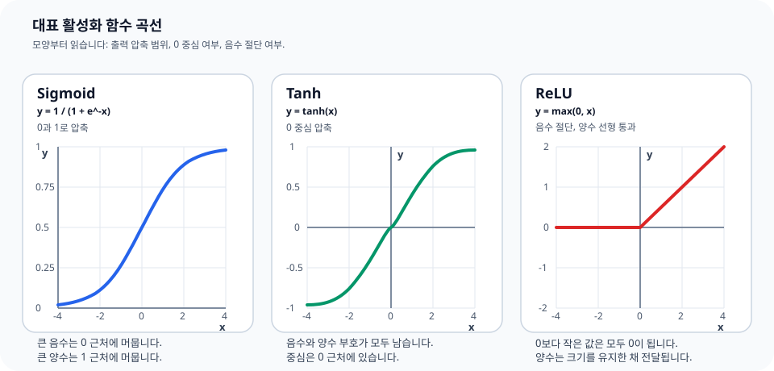

# P5-3.2 ReLU, sigmoid, tanh

Section ID: `P5-3.2`
Version: `v2026.07.12`

P5-3.1에서는 활성화 함수(activation function)가 왜 필요한지, 그리고 비선형성(nonlinearity)이 딥러닝의 깊이를 실제 표현력으로 바꾸는 핵심 장치라는 점을 보았습니다. 이제 다음 질문이 자연스럽게 이어집니다.

그렇다면 실제로는 어떤 활성화 함수를 많이 쓰며, 서로 무엇이 다른가?

ReLU, sigmoid, tanh는 모두 점수를 비선형적으로 바꾸는 함수이지만, 반응 구간과 출력 범위가 다르기 때문에 쓰임새와 학습 감각도 달라진다.

대표 활성화 함수의 차이가 다시 섞일 때는 개념사전의 [활성화 함수(activation function)](../../../reference/concept-glossary.md#activation-function) 항목을 기준선으로 다시 봅니다.

## 이 절의 범위

- sigmoid, tanh, ReLU는 각각 어떤 모양과 출력을 가지는가?
- 왜 서로 다른 활성화 함수가 필요한가?
- 현대 신경망에서 ReLU 계열이 자주 쓰이는 이유는 무엇인가?
- sigmoid와 tanh는 어떤 맥락에서 여전히 중요하게 등장하는가?

이 절에서는 다음 내용을 깊게 다루지 않습니다.

- 미분값의 엄밀한 수식 유도
- vanishing gradient의 상세 수학
- GELU, Swish, Leaky ReLU 같은 후속 함수 비교
- 출력층 activation 설계의 세부 규칙

미분값의 엄밀한 수식 유도와 vanishing gradient의 상세 수학은 여기서 전개하지 않습니다. 이 절에서는 세 함수를 `암기`하기보다, `어떤 성질 때문에 다르게 읽히는가`를 설명합니다. 출력층 activation 설계는 P5-3.3에서 바로 이어서 보고, gradient와 학습 안정성의 더 넓은 맥락은 P5-5.1, P5-7.1에서 다시 회수합니다. GELU, Swish, Leaky ReLU 같은 후속 함수 비교는 이 책의 현재 본편 범위 밖에 둡니다.

## 이 절의 목표

- sigmoid, tanh, ReLU의 출력 범위와 직관적 차이를 설명할 수 있습니다.
- 활성화 함수의 선택이 학습 흐름과 표현 방식에 영향을 준다는 점을 이해할 수 있습니다.
- 왜 ReLU 계열이 현대 딥러닝에서 자주 등장하는지 말할 수 있습니다.
- sigmoid와 tanh가 초창기 신경망과 특정 출력 설계에서 왜 중요했는지 설명할 수 있습니다.

## 먼저 큰 차이부터 보기

세 함수의 차이는 먼저 `출력을 어떻게 자르는가`로 읽으면 좋습니다.

| 함수 | 출력 범위 | 직관적 반응 |
| --- | --- | --- |
| sigmoid | 0 ~ 1 | 큰 음수는 0에 가깝게, 큰 양수는 1에 가깝게 눌러 줍니다. |
| tanh | -1 ~ 1 | 0을 중심으로 음수와 양수를 대칭적으로 눌러 줍니다. |
| ReLU | 0 이상 | 음수는 0으로 자르고, 양수는 거의 그대로 통과시킵니다. |

이 표를 먼저 고정해 두면 세 함수의 차이가 빠르게 잡힙니다.

- sigmoid: `확률처럼 보이는 값`
- tanh: `0 중심의 눌린 값`
- ReLU: `음수 차단, 양수 통과`

여기서 한 번 더 비교해 두면 이후 사례와 예제가 더 잘 읽힙니다.

| 입력 구간 | sigmoid | tanh | ReLU |
| --- | --- | --- | --- |
| 큰 음수 | 0에 가까워지며 눌립니다 | -1에 가까워지며 눌립니다 | 0으로 잘립니다 |
| 0 근처 | 0.5 근처로 모입니다 | 0 근처에서 부호를 살려 반응합니다 | 음수면 0, 양수면 거의 그대로 나갑니다 |
| 큰 양수 | 1에 가까워지며 더 이상 크게 늘지 않습니다 | 1에 가까워지며 더 이상 크게 늘지 않습니다 | 값이 계속 커집니다 |

즉, sigmoid와 tanh는 `압축형`, ReLU는 `절단 후 통과형`으로 기억하면 큰 방향을 먼저 잡을 수 있습니다.

## sigmoid는 어떤 함수인가

sigmoid는 초기 신경망과 로지스틱 회귀(logistic regression) 설명에서 매우 자주 등장하는 함수입니다. 입력이 커질수록 1에 가까워지고, 작아질수록 0에 가까워집니다.

즉, sigmoid는 다음처럼 읽을 수 있습니다.

- 아주 작은 점수는 거의 0처럼 본다
- 아주 큰 점수는 거의 1처럼 본다
- 중간 점수는 0과 1 사이의 연속값으로 바꾼다

이 때문에 sigmoid는 특히 `어떤 사건이 일어날 가능성처럼 보이는 출력`을 만들 때 직관적입니다.

Part 4의 로지스틱 회귀를 떠올리면 이해가 더 쉽습니다. 로지스틱 회귀도 선형 결합 결과를 sigmoid에 통과시켜 0과 1 사이 값으로 바꾸었습니다.

즉, sigmoid는 딥러닝 이전의 확률적 분류 감각과도 이어지는 함수입니다.

## tanh는 sigmoid와 어떻게 다른가

tanh는 모양 자체는 sigmoid와 비슷하게 가운데는 기울고 양끝은 눌리는 함수입니다. 하지만 중요한 차이는 출력 범위가 `-1 ~ 1`이라는 점입니다.

여기서는 다음 차이로 읽으면 됩니다.

- sigmoid는 0과 1 사이만 냅니다
- tanh는 음수와 양수를 모두 유지하면서 0을 중심으로 표현합니다

이 특성 때문에 tanh는 은닉층에서 `양의 신호와 음의 신호를 모두 표현하고 싶을 때` 더 자연스럽게 읽히는 경우가 있습니다.

즉, tanh는 sigmoid보다 더 `0 중심(zero-centered)`인 표현을 만들어 준다고 이해할 수 있습니다.

## ReLU는 왜 다르게 보이나

ReLU(rectified linear unit)는 모양과 직관이 훨씬 단순합니다.

- 입력이 0보다 작으면 0
- 입력이 0보다 크면 거의 그대로 통과

즉, ReLU는 `음수 신호는 끊고, 양수 신호만 살리는 문`처럼 읽을 수 있습니다.

이 단순함 때문에 ReLU는 현대 딥러닝에서 매우 널리 쓰입니다.

다음처럼 기억하면 충분합니다.

`ReLU는 계산이 단순하고, 양수 구간에서는 신호를 강하게 남겨 두기 때문에 깊은 신경망에서 자주 쓰인다.`

## 세 함수를 그림 감각으로 비교하기

함수의 이름을 외우기보다, 입력이 어느 구간에서 눌리고 어느 구간에서 그대로 통과하는지 모양으로 먼저 구분하는 편이 더 유용합니다.



위 차트에서 먼저 확인할 결과는 세 함수가 모두 `비선형 변환`이지만, 값을 눌러 두는 방식이 서로 다르다는 점입니다. sigmoid는 양끝에서 0과 1 쪽으로 포화되고, tanh는 0을 중심으로 음수와 양수를 함께 압축하며, ReLU는 0 아래를 잘라 내고 0 위에서는 직선처럼 증가합니다.

```mermaid
--8<-- "assets/part-05/chapter-03/activation-family-flow-ko.mmd"
```

이 Mermaid 도식은 좌표 그래프 자체를 다시 그리는 대신, 방금 본 곡선을 `어떤 해석 규칙으로 읽는가`만 압축합니다.

- sigmoid: 확률형 압축
- tanh: 대칭형 압축
- ReLU: 절단형 통과

## 왜 sigmoid와 tanh만으로는 부족했나

초기 신경망 역사에서는 sigmoid와 tanh가 널리 쓰였습니다. 이유는 명확합니다.

- 부드럽고 미분 가능했습니다.
- 임계값 함수보다 학습에 더 적합해 보였습니다.
- 확률적 출력이나 대칭적 은닉 표현을 만들기에 자연스러웠습니다.

하지만 깊은 네트워크로 갈수록 문제가 드러났습니다. 아주 큰 양수나 음수 영역에서는 출력이 포화(saturation)되어, 층을 많이 거치며 신호 변화가 둔해질 수 있습니다.

이를 아주 단순하게 다음처럼 이해하면 충분합니다.

`sigmoid와 tanh는 너무 큰 입력이 들어오면, 더 커져도 출력이 거의 안 바뀌는 구간이 생길 수 있다.`

이 현상은 학습을 어렵게 만들 수 있습니다. 바로 이 배경이 ReLU가 주목받은 이유 중 하나입니다.

## 왜 ReLU가 현대 딥러닝에서 자주 쓰이나

ReLU가 널리 퍼진 이유는 여러 가지가 있지만, 입문 수준에서는 세 가지로 요약하면 충분합니다.

1. 계산이 단순합니다.
2. 양수 구간에서는 신호를 비교적 직접 전달합니다.
3. 깊은 네트워크에서 sigmoid, tanh보다 학습이 더 안정적으로 느껴지는 경우가 많았습니다.

즉, ReLU는 복잡한 아이디어보다 `단순한 규칙으로 깊은 네트워크를 다루기 쉽게 만든 함수`로 기억하면 좋습니다.

이 역사적 흐름은 딥러닝의 확산과도 연결됩니다. 큰 네트워크, 큰 데이터, GPU, 더 나은 초기화와 최적화 기법이 함께 발전하던 시기에 ReLU 계열이 널리 채택되면서 깊은 학습이 더 실용적인 방향으로 굳어졌습니다.

## 그래도 sigmoid와 tanh는 왜 계속 배우나

독자는 `ReLU가 좋다면 sigmoid와 tanh는 이제 필요 없는가?`라는 질문을 자주 합니다. 그렇지는 않습니다.

sigmoid와 tanh를 계속 보는 이유는, 각각이 어떤 출력 범위와 표현 중심을 만들고 어떤 구조 설명에 쓰이는지 비교 기준을 제공하기 때문입니다.

- sigmoid는 이진 분류 출력의 직관과 연결됩니다.
- tanh는 0 중심 출력과 순환 구조 설명에서 자주 등장합니다.
- 두 함수를 함께 보면 활성화 함수 선택이 왜 역사적으로 바뀌었는지와, 각 함수가 어떤 계산 감각을 남겼는지 비교할 수 있습니다.

즉, ReLU가 현대 실무에서 흔하다고 해서 sigmoid와 tanh가 사라진 개념은 아닙니다. 오히려 이 셋을 함께 비교해야 딥러닝이 `무작정 최신 함수만 쓰는 분야`가 아니라는 점이 보입니다.

## 사례 및 예시

### 사례 1. 같은 점수, 다른 전달 방식

예를 들어 공장 설비 점검 모델에서 어떤 은닉층 노드가 `이상 진동 신호가 얼마나 강한가`를 나타내는 점수 `z`를 만들었다고 생각해 봅니다.

- `z = -2`
- `z = -0.5`
- `z = 0.1`
- `z = 0.5`
- `z = 3`

사람은 보통 같은 점수표를 보면 `숫자가 크면 위험, 작으면 안전`처럼 하나의 기준으로 읽고 싶어 합니다. 하지만 같은 점수라도 활성화 함수에 따라 다음 층에 전달되는 값의 해석이 달라집니다.

예를 들어 작은 흔들림은 무시하고 큰 이상만 통과시키고 싶을 수도 있고, 반대로 약한 신호도 완전히 버리지 않고 부드럽게 넘기고 싶을 수도 있습니다. 사람이 이 점수를 읽을 때도 `음수면 거의 꺼진 상태로 볼 것인가`, `중간값도 조금은 살려 둘 것인가`, `양수는 그대로 강하게 통과시킬 것인가` 같은 기준이 달라지는 셈입니다. 즉, 활성화 함수는 같은 점수에 서로 다른 반응 규칙을 붙이는 장치라고 볼 수 있습니다.

| z | sigmoid 직관 | tanh 직관 | ReLU 직관 |
| --- | --- | --- | --- |
| -2 | 0에 가까운 약한 반응 | -1 쪽 음수 반응 | 0으로 차단 |
| 0.1 | 0.5를 조금 넘는 약한 양수 반응 | 0 근처의 작은 양수 반응 | 작은 양수 그대로 통과 |
| 0.5 | 중간 정도 양의 반응 | 약한 양수 반응 | 그대로 통과 |
| 3 | 1에 가까운 강한 반응 | 1 쪽 강한 양수 반응 | 큰 양수 그대로 통과 |

예를 들어 이 노드가 `위험 신호를 강하게 보이면 다음 층으로 넘기는 역할`을 한다고 해 보면, ReLU는 음수 신호를 바로 끊고 양수만 강하게 넘깁니다. 반면 sigmoid는 음수와 양수 모두 0과 1 사이로 눌러 `확률처럼` 전달하고, tanh는 음수와 양수를 모두 살리되 범위를 압축합니다. 그 결과 같은 센서 점수라도 어떤 함수는 `이번 신호는 사실상 꺼진 것으로 보자`고 읽고, 어떤 함수는 `약한 경고이지만 남겨 두자`고 읽게 됩니다. 그래서 같은 점수라도 다음 층이 받는 표현의 성격이 달라지고, 결국 학습 감각과 표현 방식도 달라집니다. 즉, 활성화 함수는 단순히 “모양이 다른 수학 함수”가 아니라, `같은 점수를 어떤 방식으로 해석하고 전달할지 정하는 규칙`입니다.

| 사람이 먼저 보기 쉬운 기준 | 함수 비교로 다시 읽는 기준 |
| --- | --- |
| 점수 `z`가 크면 그냥 더 위험하다고 본다 | 같은 `z`라도 출력 범위와 부호 해석이 함수마다 달라진다 |
| 음수 점수는 모두 비슷하게 약한 신호라고 본다 | sigmoid, tanh, ReLU는 음수 신호를 서로 다르게 처리한다 |
| 중간값은 비슷하게 전달될 것이라 느끼기 쉽다 | 어떤 함수는 압축하고, 어떤 함수는 거의 그대로 통과시킨다 |

같은 `0.1`과 `3`을 비교해 보면 차이가 더 분명합니다. sigmoid와 tanh는 둘 다 큰 양수에서 점점 포화되어 `더 커져도 출력 차이가 압축`되지만, ReLU는 `0.1`과 `3`의 차이를 그대로 더 크게 벌려 전달합니다. 그래서 어떤 함수는 `강한 양수끼리의 차이`를 줄여 읽고, 어떤 함수는 그 차이를 계속 살려 둡니다.

그래서 이 사례에서 확인해야 할 결과는 같은 점수 `z`라도, 다음 층에 전달되는 값의 범위와 부호 해석이 함수마다 실제로 달라지는가입니다.

이 사례를 한 줄로 묶으면 다음과 같습니다.

`활성화 함수는 같은 점수라도 다음 층에 어떤 성격의 신호로 넘길지 바꾸는 장치다.`

이 사례를 `언제 어떤 함수를 먼저 떠올릴 것인가`까지 묶어 보면 차이가 더 또렷해집니다.

| 계산 감각 | sigmoid를 먼저 떠올릴 장면 | tanh를 먼저 떠올릴 장면 | ReLU를 먼저 떠올릴 장면 |
| --- | --- | --- | --- |
| 다음 층에 남기고 싶은 해석 | 0과 1 사이의 확률형 강도 | 0 중심의 양/음 신호 | 음수는 끊고 양수는 살리는 문 역할 |
| 같은 `z`를 읽는 방식 | 약한 신호도 완전히 버리기보다 부드럽게 눌러 남긴다 | 부호를 살리면서도 범위를 압축한다 | 음수는 버리고 양수 차이는 비교적 그대로 유지한다 |
| 이 절에서 먼저 붙잡아야 할 장면 | 이진 분류나 확률형 출력 감각 | 은닉층의 대칭적 표현 감각 | 깊은 신경망에서 강한 양수 신호를 계속 살리는 감각 |

이 표에서 독자가 먼저 붙잡아야 할 결과는, 대표 활성화 함수 비교가 `셋 중 누가 더 최신인가`를 묻는 일이 아니라 `다음 층에 어떤 성격의 신호를 남기고 싶은가`를 묻는 일이라는 점입니다.

운영 신호 해석으로 다시 말하면 더 분명합니다. sigmoid 쪽 읽기는 `경고 강도를 0~1 사이 위험도처럼 눌러 보자`에 가깝고, tanh 쪽 읽기는 `안정 쪽 음수와 경고 쪽 양수를 둘 다 남겨 보자`에 가깝습니다. ReLU 쪽 읽기는 `음수 쪽 안정 신호는 끊고, 실제 경고로 볼 양수만 다음 층에 남기자`에 가깝습니다. 즉, 함수 비교는 곡선 모양보다 `운영 신호를 어떤 성격으로 다음 층에 전달할 것인가`를 고르는 문제입니다.

## 연습 및 예제

이번 예제의 목적은 설비 경고 해석 모델이 만든 같은 pre-activation score도 sigmoid, tanh, ReLU를 지나며 어떻게 서로 다른 반응 규칙으로 바뀌는지 비교하는 것입니다.

입력:

- 설비 장면 5개에서 나온 pre-activation score
- `quiet_frame -> z = -2`
- `stable_recovery_frame -> z = -0.5`
- `borderline_alarm_frame -> z = 0.1`
- `confirmed_warning_frame -> z = 0.5`
- `critical_shutdown_frame -> z = 3`

출력:

- 각 함수의 변환 결과
- 같은 score라도 함수마다 다음 층에 어떤 성격의 신호로 남는지에 대한 비교

문제 상황:

- 설비 점검 모델이 만든 같은 pre-activation score라도, 이를 `0~1 위험도`처럼 읽을지, `양/음 부호가 있는 내부 신호`로 읽을지, `양수 경고만 살릴지`에 따라 다음 층 해석이 달라진다. sigmoid, tanh, ReLU가 같은 점수를 어떻게 다르게 바꾸는지 직접 비교할 필요가 있다

확인할 개념:

- 활성화 함수는 입력 범위와 출력 형태가 다르다
- 같은 `z` 값에 대한 결과를 나란히 보면 함수별 성격 차이가 더 빨리 보인다
- 같은 score라도 함수가 달라지면 운영 신호 해석 방식이 달라진다

입력(input):

위에 정리한 다섯 장면의 pre-activation score `z`를 사용합니다.

코드를 보기 전에 먼저 각 함수가 어떤 값을 내놓을지 큰 방향부터 예상해 보면 좋습니다.

| 장면 | z | 먼저 예상해 볼 비교 | 예상 이유 |
| --- | --- | --- | --- |
| `quiet_frame` | `-2` | `ReLU = 0`, `tanh`는 강한 음수, `sigmoid`는 0에 가까움 | 뚜렷한 안정 장면이라 세 함수가 모두 약한 경고 쪽으로 몰리되 방식은 다를 가능성이 큽니다. |
| `borderline_alarm_frame` | `0.1` | `sigmoid`는 0.5를 조금 넘고, `tanh`와 `ReLU`는 작은 양수 | 경계 바로 위 장면에서는 세 함수가 모두 살아 있지만 전달 강도 해석은 다를 가능성이 큽니다. |
| `confirmed_warning_frame` | `0.5` | 세 함수 모두 양수지만 크기는 다름 | 경고 확인 쪽 장면이라 `sigmoid`는 압축값, `tanh`는 0 근처 양수, `ReLU`는 거의 그대로를 줄 가능성이 큽니다. |
| `critical_shutdown_frame` | `3` | `sigmoid`, `tanh`는 포화 쪽, `ReLU`는 계속 커짐 | 즉시 정지 검토 수준의 큰 양수에서 압축형 함수와 절단형 함수 차이가 가장 뚜렷해집니다. |

이 표의 목적은 정확한 소수점 값을 외우는 것이 아니라, `같은 z라도 함수별로 눌리는 방식과 통과 방식이 달라진다`는 점을 먼저 붙잡는 데 있습니다.

```python
import math

def sigmoid(z):
    return 1 / (1 + math.exp(-z))

def tanh(z):
    return math.tanh(z)

def relu(z):
    return max(0.0, z)

frames = {
    "quiet_frame": -2.0,
    "stable_recovery_frame": -0.5,
    "borderline_alarm_frame": 0.1,
    "confirmed_warning_frame": 0.5,
    "critical_shutdown_frame": 3.0,
}

for name, z in frames.items():
    print(
        f"{name:>24} | z={z:>4}: "
        f"sigmoid={sigmoid(z):.3f}, "
        f"tanh={tanh(z):.3f}, "
        f"relu={relu(z):.3f}"
    )
```

출력에서는 같은 z에서 sigmoid, tanh, relu가 각각 어떤 범위와 반응을 보이는지부터 비교하면 됩니다.

```text
             quiet_frame | z=-2.0: sigmoid=0.119, tanh=-0.964, relu=0.000
   stable_recovery_frame | z=-0.5: sigmoid=0.378, tanh=-0.462, relu=0.000
  borderline_alarm_frame | z= 0.1: sigmoid=0.525, tanh=0.100, relu=0.100
 confirmed_warning_frame | z= 0.5: sigmoid=0.622, tanh=0.462, relu=0.500
   critical_shutdown_frame | z= 3.0: sigmoid=0.953, tanh=0.995, relu=3.000
```

이 예제에서 중요한 것은 숫자 자체보다 경향입니다.

- sigmoid는 항상 0과 1 사이로 눌립니다
- tanh는 -1과 1 사이로 눌리면서 부호를 유지합니다
- ReLU는 음수를 0으로 자르고 양수는 그대로 보냅니다

출력을 읽을 때는 `차이가 어디에서 눌리고 어디에서 유지되는가`를 같이 봐야 합니다.

| 장면 비교 | 지금 읽어야 할 핵심 |
| --- | --- |
| `quiet_frame` 과 `stable_recovery_frame` | 둘 다 음수지만 sigmoid는 둘을 0 쪽 확률형 값으로, tanh는 음수 강도의 차이로, ReLU는 둘 다 0으로 처리합니다. |
| `borderline_alarm_frame` 과 `confirmed_warning_frame` | 둘 다 경계 바로 위 양수지만 sigmoid는 0.5 근처에서 완만하게, tanh는 작은 양수로, ReLU는 입력 차이를 그대로 유지합니다. |
| `confirmed_warning_frame` 과 `critical_shutdown_frame` | sigmoid와 tanh는 큰 양수에서 점점 포화되지만, ReLU는 큰 양수 차이를 계속 벌려 전달합니다. |

즉, 같은 활성화 함수 비교에서 독자가 실제로 붙잡아야 하는 질문은 `이 함수가 약한 양수와 강한 양수의 차이를 끝까지 살려 두는가, 아니면 어느 시점부터 압축하는가`입니다.

같은 `z`라도 함수가 달라지면 다음 층이 받는 신호의 범위와 해석이 달라진다는 점이 핵심입니다.

| 운영 신호 해석 기준 | sigmoid를 먼저 읽으면 남는 판단 | tanh를 먼저 읽으면 남는 판단 | ReLU를 먼저 읽으면 남는 판단 |
| --- | --- | --- | --- |
| `quiet_frame`, `stable_recovery_frame` 같은 음수 장면 | 거의 0에 가까운 약한 위험도로 눌러 본다 | 강한 안정/음수 신호로 남겨 본다 | 다음 층에 넘기지 않을 신호로 끊어 본다 |
| `borderline_alarm_frame` 같은 경계 장면 | 약한 경고지만 아직 0.5 근처의 완만한 증가로 본다 | 작은 양의 경고 신호로 본다 | 간신히 살아남는 경고 신호로 본다 |
| `critical_shutdown_frame` 같은 큰 양수 장면 | 강한 경고지만 1 근처에서 압축해 본다 | 강한 양의 신호지만 1 근처에서 압축해 본다 | 강한 경고 차이를 계속 살려 다음 층으로 보낸다고 본다 |

즉, 이 출력 차이는 `숫자가 다르다`보다 `경고를 눌러서 볼지, 부호를 살려 볼지, 강한 양수만 계속 살릴지`의 차이로 읽어야 합니다.

출력을 다 읽은 뒤에는 `이번 계산이라면 어느 함수를 먼저 떠올릴까`를 한 번 더 바로 연결해 보는 편이 좋습니다.

| 출력에서 보인 차이 | 더 자연스럽게 떠올릴 함수 | 이유 |
| --- | --- | --- |
| `borderline_alarm_frame`도 완전히 버리지 않고 0~1 사이 위험도로 남긴다 | sigmoid | 약한 경고를 확률형 강도로 계속 읽고 싶을 때 맞기 때문입니다. |
| `quiet_frame`와 `stable_recovery_frame`의 음수 차이도 부호를 살려 남긴다 | tanh | 안정 쪽 신호와 경고 쪽 신호를 한 축에서 함께 읽는 감각과 맞기 때문입니다. |
| `critical_shutdown_frame`의 큰 양수 차이를 끝까지 살리고 음수는 끊는다 | ReLU | 다음 층에 강한 양수 신호를 직접 전달하는 감각과 맞기 때문입니다. |

이 표까지 읽고 나면, 함수 비교의 핵심이 `곡선 모양 암기`가 아니라 `어떤 반응 규칙을 다음 층에 넘길 것인가`라는 점이 더 분명해집니다.

Part 5 초반부는 다음 흐름으로 쌓여야 합니다.

> 퍼셉트론
> -> 선형 결합과 활성화
> -> 다층 구조
> -> 은닉층과 표현
> -> 대표 활성화 함수 비교

이 흐름이 잡혀야 다음에 손실 함수(loss function), 역전파(backpropagation), 옵티마이저(optimizer)를 배울 때 각 층의 값이 왜 그렇게 바뀌는지 읽을 수 있습니다.

즉, 활성화 함수는 단지 함수 목록이 아니라, 이후 학습 계산 전체를 읽기 위한 입구입니다.

## 언제 어떤 대표 활성화 함수를 먼저 떠올리는가

이 절의 목적은 최신 함수 목록을 늘리는 것이 아니라, `지금 어떤 반응 성격이 필요한가`를 먼저 구분하게 하는 데 있습니다.

| 먼저 보이는 계산 감각 | 먼저 떠올릴 함수 | 이유 |
| --- | --- | --- |
| 0과 1 사이 값으로 눌러 확률처럼 읽고 싶다 | sigmoid | 출력 범위가 0~1이라 이진 분류 감각과 잘 맞습니다. |
| 음수와 양수를 모두 살리되 0 중심으로 표현하고 싶다 | tanh | -1~1 범위를 유지하며 대칭적인 반응을 보여 줍니다. |
| 음수는 끊고 양수는 비교적 직접 통과시키고 싶다 | ReLU | 계산이 단순하고 깊은 신경망에서 자주 쓰이는 기본 감각과 맞습니다. |
| 역사적 비교 기준이 필요하다 | sigmoid, tanh, ReLU를 함께 본다 | 왜 현대 신경망에서 ReLU 계열이 널리 쓰이는지 비교가 분명해집니다. |

## 체크리스트

- sigmoid, tanh, ReLU의 출력 범위와 반응 방식 차이를 구분할 수 있는가?
- 왜 현대 신경망에서 ReLU 계열이 자주 쓰이는지 설명할 수 있는가?
- sigmoid, tanh, ReLU를 함수 이름이 아니라 `반응 방식` 차이로 설명할 수 있는가?
- sigmoid는 0~1, tanh는 -1~1, ReLU는 음수 차단과 양수 통과라는 직관으로 먼저 읽을 수 있는가?
- ReLU가 자주 쓰인다고 해서 sigmoid와 tanh 비교가 불필요해지는 것은 아니라는 점을 말할 수 있는가?
- 활성화 함수의 차이가 표현 방식과 학습 감각의 차이로 이어진다는 점을 설명할 수 있는가?
- sigmoid, tanh, ReLU가 모두 비슷한 이름처럼만 들릴 때, 출력 범위와 반응 방식 차이부터 다시 떠올릴 수 있는가?
- 함수 비교를 마친 뒤에는 출력층 해석과 손실 함수 연결로 넘어가야 한다는 흐름을 이해했는가?

## 출처와 참고 자료

- Ian Goodfellow, Yoshua Bengio, Aaron Courville, `Deep Learning`, MIT Press, 2016, 확인 날짜: 2026-06-29. [https://www.deeplearningbook.org/](https://www.deeplearningbook.org/){: target="_blank" rel="noopener noreferrer" }
- Yann LeCun, Yoshua Bengio, Geoffrey Hinton, `Deep learning`, Nature, 2015, 확인 날짜: 2026-06-29. [https://www.nature.com/articles/nature14539](https://www.nature.com/articles/nature14539){: target="_blank" rel="noopener noreferrer" }
- Xavier Glorot, Antoine Bordes, Yoshua Bengio, `Deep Sparse Rectifier Neural Networks`, AISTATS, 2011, 확인 날짜: 2026-06-29.
