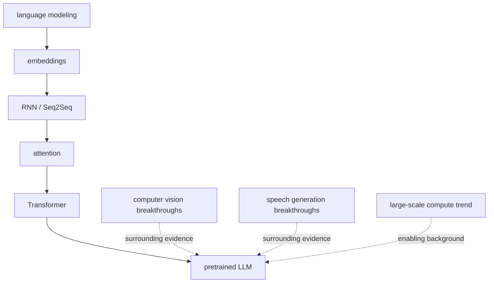

# P5-3.2 직접 계보와 주변 근거

P5-3.1에서는 LLM 발전사를 큰 흐름으로 정리했습니다. 하지만 여기서 한 가지 구분이 더 필요합니다.

모든 딥러닝 발전사가 곧바로 LLM의 직접 계보인 것은 아니다.

이 절은 그 구분을 다룹니다.

직접 계보(direct lineage)는 현재 LLM 구조와 학습 방식으로 직접 이어지는 흐름이고, 주변 근거(surrounding evidence)는 딥러닝 확산과 계산 패러다임 변화를 설명하지만 LLM 구조 자체의 조상이라고 단정하기 어려운 흐름이다.

## 이 절의 범위

이 절은 다음 질문에 답합니다.

- 무엇을 LLM의 직접 계보라고 부를 수 있는가?
- 무엇은 딥러닝 확산의 중요한 사례이지만 직접 계보라고 하기는 어려운가?
- 이런 구분이 왜 학습자에게 중요한가?

이 절은 다음 내용은 깊게 다루지 않습니다.

- 모든 주변 분야 논문 열거
- 음성, 비전, 추천 모델의 상세 발전사
- 멀티모달 모델의 최신 계보

이 절의 직접 계보 구분은 곧이어 P5-4.1, P5-5.1, P5-6.1에서 Transformer, BERT, GPT를 나누어 읽을 때 다시 쓰입니다. 반면 음성, 비전, 멀티모달 계보 전체를 따로 따라가는 일은 이 책의 현재 본편 범위 밖으로 둡니다.

이 절의 목적은 `모든 AI 발전을 LLM 역사로 한 줄에 늘어놓는 오해`를 줄이는 데 있습니다. 동시에 이 절은 Part 5 본류를 잠시 멈추고 보는 `배경 구분 장`이라는 점을 분명히 해 둘 필요가 있습니다.

## 이 절의 목표

- 직접 계보와 주변 근거를 구분할 수 있습니다.
- LLM 발전사를 과장 없이 설명할 수 있습니다.
- 딥러닝 확산 사례가 왜 중요하지만 직접 조상은 아닐 수 있는지 설명할 수 있습니다.
- 다음 장의 Transformer 구조 복습을 더 분명한 위치에서 읽을 수 있습니다.

## 왜 이런 구분이 필요한가

이 절은 새로운 구조를 배우는 장이라기보다, 뒤의 GPT·RAG·에이전트 설명을 과장 없이 읽기 위한 경계선 정리 장입니다.

최근에는 AI를 곧바로 LLM과 연결해 이해하는 경향이 강합니다. 이때 다음과 같은 혼동이 생기기 쉽습니다.

- 딥러닝이 유명해진 모든 사건이 곧바로 LLM 계보다
- 음성 모델, 객체 검출 모델, 강화학습 모델이 모두 같은 직선 위에 있다
- `신경망이니까 다 같은 역사다`

이렇게 설명하면 큰 분위기는 잡히지만, 구조적 이해는 흐려집니다.

더 안전한 설명은 다음입니다.

- 어떤 흐름은 LLM 구조와 학습 목표로 직접 이어진다
- 어떤 흐름은 딥러닝 패러다임의 확산과 계산 자원의 중요성을 보여 주는 배경 증거다

## 직접 계보는 무엇인가

이 책에서는 다음 흐름을 LLM의 직접 계보로 봅니다.

1. 언어 모델(language model)
2. 임베딩과 분산 표현(distributed representation)
3. RNN, LSTM, Seq2Seq
4. Attention
5. Transformer
6. 사전학습(pretraining)
7. GPT, BERT 같은 Transformer 계열 언어 모델

이 흐름의 공통점은 분명합니다.

- 언어를 입력으로 다루고
- 토큰이나 단어의 순서와 문맥을 계산하며
- 다음 토큰 예측 또는 언어 표현 학습으로 이어지고
- 현재 LLM 구조와 직접 연결됩니다

즉, 이들은 `LLM 내부 구조와 학습 방식`의 조상으로 설명할 수 있습니다.

## 주변 근거는 무엇인가

반면 다음과 같은 사례는 매우 중요하지만, 직접 계보라고 단정하는 데는 주의가 필요합니다.

- AlexNet과 이미지 인식 혁신
- YOLO 같은 객체 검출(object detection) 계열
- WaveNet, Deep Voice 같은 음성 생성(speech generation) 계열
- AlphaGo, AlphaZero 같은 탐색과 강화학습의 대표 사례

이 사례들은 다음 점에서 중요합니다.

- 딥러닝이 실제 성능 전환을 만들 수 있음을 사회적으로 보여 주었고
- GPU와 대규모 계산 자원의 중요성을 강화했으며
- 학습 기반 접근이 다양한 도메인으로 확산되는 흐름을 만들었습니다

하지만 이들을 곧바로 `LLM의 직접 조상`이라고 쓰면 경계가 흐려집니다.

## Deep Voice나 YOLO는 왜 직접 계보가 아닌가

예를 들어 Deep Voice는 음성 생성(speech synthesis) 분야에서 중요한 사례입니다. YOLO는 실시간 객체 검출에서 대표적인 전환점입니다.

이 둘은 모두 딥러닝 패러다임의 확산을 보여 주지만, 현재 LLM의 직접 구조를 형성한 핵심 언어 모델 계보와는 다릅니다.

더 안전한 설명은 다음입니다.

- Deep Voice, YOLO는 `딥러닝이 다양한 입력과 출력 도메인에서 강해졌다`는 주변 근거다
- Transformer 기반 LLM의 직접 구조사는 `언어 모델링과 Attention 계열`에서 더 직접적으로 찾아야 한다

즉, 관련은 있지만 같은 선 위에 그대로 놓으면 안 됩니다.

## 왜 주변 근거도 여전히 중요한가

그렇다고 주변 근거를 빼 버리면 또 다른 문제가 생깁니다. LLM은 언어 모델만 조용히 발전해서 갑자기 등장한 것이 아니기 때문입니다.

주변 근거는 다음 질문에 답해 줍니다.

- 왜 딥러닝이 사회적으로 신뢰와 투자를 받게 되었는가?
- 왜 병렬 처리와 GPU가 중요해졌는가?
- 왜 데이터 규모, 모델 규모, 계산 규모가 함께 커졌는가?

즉, 주변 근거는 `구조적 조상`은 아니지만 `역사적 분위기와 인프라 조건`을 설명합니다.

## 직접 계보와 주변 근거를 나눠 그리면



이 도식의 목적은 한 가지입니다.

`한 줄 역사`와 `배경 조건`을 구분해서 읽게 하는 것.

## 사례로 보기

### 사례 1. Transformer 설명

Transformer를 설명할 때는 Attention과 Seq2Seq 병목 문제를 먼저 말하는 편이 직접 계보에 맞습니다.

### 사례 2. GPU 설명

GPU와 대규모 계산 자원의 중요성을 설명할 때는 AlexNet, 비전 모델 확산, 대규모 병렬 처리 전환을 함께 드는 것이 유익합니다. 다만 이것은 구조적 조상 설명이 아니라 배경 설명입니다.

### 사례 3. 생성형 AI 붐

텍스트 생성, 이미지 생성, 음성 생성이 함께 주목받으며 `생성형 AI`라는 인식이 강해졌습니다. 하지만 그 안에서도 각 모델 계보는 서로 다를 수 있습니다.

## 작은 Python 예제로 보기

이번 예제의 목표는 모델 계보를 계산하는 것이 아니라, 항목을 `direct_lineage`와 `surrounding_evidence`로 나누는 사고를 보여 주는 것입니다.

입력:

- 몇 개의 대표 항목

출력:

- 직접 계보 목록
- 주변 근거 목록

```python
items = {
    "language_modeling": "direct_lineage",
    "embeddings": "direct_lineage",
    "attention": "direct_lineage",
    "transformer": "direct_lineage",
    "YOLO": "surrounding_evidence",
    "Deep Voice": "surrounding_evidence",
    "GPU scaling": "surrounding_evidence",
}

for name, group in items.items():
    print(name, "->", group)
```

실행 결과 예시는 다음처럼 읽을 수 있습니다.

```text
language_modeling -> direct_lineage
embeddings -> direct_lineage
attention -> direct_lineage
transformer -> direct_lineage
YOLO -> surrounding_evidence
Deep Voice -> surrounding_evidence
GPU scaling -> surrounding_evidence
```

이 예제는 분류 그 자체보다 `어떤 질문으로 역사를 정리할 것인가`를 보여 주는 데 목적이 있습니다.

## 역사와 커리큘럼 관점

이 절은 역사 설명을 더 보수적으로 정리하기 위한 절입니다. 독자는 모든 딥러닝 성과를 하나의 직선 위에 놓기 쉽고, 재학습자는 과거에 본 다양한 키워드를 한 줄 역사로 묶고 싶어질 수 있습니다.

하지만 커리큘럼 관점에서는 다음 구분이 더 중요합니다.

- `직접 구조사`: 현재 LLM을 만든 핵심 계보
- `주변 확산사`: 딥러닝이 왜 강해졌고 왜 널리 받아들여졌는지 보여 주는 사례

이 구분이 있어야 뒤에서 BERT, GPT, pretraining, prompt, RAG, agent를 설명할 때 구조와 분위기를 섞지 않게 됩니다.

## 다음 장과의 연결

여기까지 구분이 잡히면 다음 질문은 더 좁아집니다.

- 그렇다면 LLM 관점에서 Transformer 구조를 다시 보면 무엇이 핵심인가?
- 토큰, context window, causal generation과 연결되는 지점은 어디인가?

이 질문은 P5-4.1 Transformer 구조 복습으로 이어집니다.

## 이 절에서 기억할 관점

- 직접 계보는 현재 LLM 구조와 학습 방식으로 직접 이어지는 흐름입니다.
- 주변 근거는 딥러닝 확산과 계산 환경 변화를 설명하지만, 곧바로 구조적 조상이라고 단정하기는 어렵습니다.
- 이 구분은 LLM 역사를 과장 없이 설명하게 해 줍니다.
- 다음 장에서 Transformer를 다시 읽을 때 구조적 위치를 더 정확히 잡을 수 있습니다.

## 체크리스트

- 직접 계보와 주변 근거를 구분해 설명할 수 있는가?
- YOLO, Deep Voice 같은 사례를 왜 주변 근거로 두는지 말할 수 있는가?
- 왜 Transformer, Attention, language modeling은 직접 계보라고 할 수 있는지 설명할 수 있는가?
- 이 구분이 Part 5 전체 이해에 왜 중요한지 말할 수 있는가?

## 출처와 참고 자료

- Ashish Vaswani et al., `Attention Is All You Need`, NeurIPS 2017, 확인 날짜: 2026-06-29.
- Alec Radford et al., `Improving Language Understanding by Generative Pre-Training`, OpenAI, 2018, 확인 날짜: 2026-06-29.
- Jacob Devlin et al., `BERT: Pre-training of Deep Bidirectional Transformers for Language Understanding`, arXiv, 2018, 확인 날짜: 2026-06-29.
- Alex Krizhevsky, Ilya Sutskever, Geoffrey E. Hinton, `ImageNet Classification with Deep Convolutional Neural Networks`, NeurIPS 2012, 확인 날짜: 2026-06-29.
- Joseph Redmon et al., `You Only Look Once: Unified, Real-Time Object Detection`, CVPR 2016, 확인 날짜: 2026-06-29.
- Sercan O. Arik et al., `Deep Voice: Real-time Neural Text-to-Speech`, ICML 2017, 확인 날짜: 2026-06-29.
