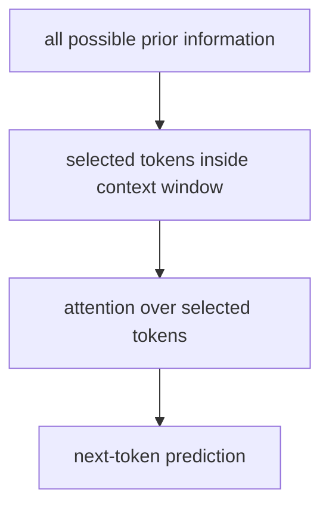

# P5-3.2 attention과 context window

P5-3.1에서는 Transformer를 LLM 기준으로 다시 읽으며, 토큰이 임베딩을 거쳐 Transformer 블록을 통과한 뒤 다음 토큰 점수로 이어지는 흐름을 보았습니다. 이제 바로 다음 제약을 봐야 합니다.

Transformer가 이전 토큰을 참고할 수 있다면, 실제로는 어디까지 참고할 수 있는가?

이 절은 그 질문에 답합니다.

context window는 모델이 한 번의 계산 안에서 참고할 수 있는 토큰 범위이며, attention은 그 범위 안에서 어떤 토큰이 더 중요한지 계산하는 구조다.

## 이 절의 범위

이 절은 다음 질문에 답합니다.

- attention과 context window는 어떤 관계인가?
- 왜 `모든 이전 토큰을 본다`는 말에도 실제 한계가 붙는가?
- context window는 왜 비용, 품질, 서비스 구조에 영향을 주는가?

이 절에서는 다음 내용을 깊게 다루지 않습니다.

- RoPE, ALiBi 같은 위치 표현 세부 비교
- KV cache 최적화
- 장문맥 전용 아키텍처의 세부 구현

이 항목들은 같은 장의 P5-3.3 보충학습에서 `왜 긴 문맥을 다루기 어렵고 어떤 보강 장치가 붙는가`라는 수준으로 다시 설명합니다. 긴 문맥이 실제 서비스 구조와 RAG 설계에 미치는 영향은 P5-10.1, P5-10.2, P5-16.1에서도 다시 이어집니다.

이 절에서는 `문맥을 다 본다`는 표현을 너무 크게 해석하지 않고, 실제 서비스에서 왜 문맥 길이 관리가 중요한지 설명합니다.

## 이 절의 목표

- context window를 `모델이 한 번에 참고할 수 있는 토큰 범위`로 설명할 수 있습니다.
- attention이 그 범위 안에서 관련도를 계산한다는 점을 설명할 수 있습니다.
- context window가 길이 제한, 비용, 지연 시간과 왜 연결되는지 말할 수 있습니다.
- 이후 RAG와 긴 문서 처리 설명으로 자연스럽게 넘어갈 수 있습니다.

## attention은 범위 안의 관련도를 계산한다

attention은 토큰 간 관련도를 계산하는 구조입니다. 하지만 이 계산은 무한한 과거 전체를 보는 것이 아니라, 현재 입력에 들어와 있는 토큰 범위 안에서 이루어집니다.

즉:

- attention은 `무엇을 더 볼 것인가`를 계산하고
- context window는 `무엇까지 볼 수 있는가`를 제한합니다

이 둘을 섞으면 안 됩니다.

더 안전한 설명은 다음과 같습니다.

`attention은 선택 규칙에 가깝고, context window는 입력 범위 제한에 가깝다.`

## context window는 무엇을 뜻하나

context window는 모델이 한 번의 입력으로 받을 수 있는 토큰 길이 범위입니다.

예를 들어 어떤 모델이 8k tokens를 지원한다면, 시스템 메시지, 사용자 입력, 대화 기록, 검색 결과, 도구 출력까지 합쳐 그 범위 안에 들어와야 합니다.

다음처럼 이해하면 좋습니다.

`문맥을 많이 넣을수록 좋을 것 같지만, 실제로는 토큰 길이 제한 안에서 무엇을 남기고 무엇을 줄일지 결정해야 한다.`

## 왜 길이 제한이 중요한가

context window는 단순 숫자 제한이 아닙니다. 실제로 다음 문제를 만듭니다.

- 긴 문서를 그대로 다 넣지 못할 수 있다
- 오래된 대화 기록을 계속 누적하면 앞부분이 밀릴 수 있다
- 검색 결과를 너무 많이 넣으면 비용이 커지고 핵심이 흐려질 수 있다
- 도구 출력이 길면 정작 중요한 사용자 질문이 뒤로 밀릴 수 있다

즉, context window는 모델 성능뿐 아니라 `서비스 설계`의 문제이기도 합니다.

## 긴 문맥이 항상 더 좋은가

긴 context window는 분명 유리한 점이 있습니다.

- 더 많은 배경 문서를 넣을 수 있고
- 긴 코드 파일이나 긴 계약서를 한 번에 다루기 쉬워지며
- 대화 맥락을 오래 유지하기 쉬워집니다

하지만 항상 무조건 더 좋은 것은 아닙니다.

- 불필요한 문맥도 함께 늘어날 수 있고
- 관련 없는 정보가 attention을 분산시킬 수 있으며
- 비용과 지연 시간(latency)이 커질 수 있습니다

따라서 실무에서는 단순히 `길면 좋다`보다 `중요한 문맥을 어떻게 잘 고를 것인가`가 더 중요해집니다.

## 왜 RAG와 연결되는가

RAG(retrieval-augmented generation)는 바로 이 문제와 연결됩니다.

긴 문서 전체를 넣는 대신:

- 관련 문서 조각만 검색하고
- 필요한 부분만 잘라 넣어
- 제한된 context window 안에서 근거를 더 효율적으로 사용하려는 구조이기 때문입니다

즉, context window의 존재는 RAG가 왜 필요한지 설명하는 중요한 배경입니다.

## 아주 단순하게 그리면



이 도식의 핵심은 다음입니다.

- 전체 정보가 다 들어오는 것이 아니라
- 먼저 윈도우 안에 들어온 정보가 있고
- attention은 그 안에서 계산된다는 점입니다

## 사례로 보기

### 사례 1. 긴 문서 요약

사용자가 100페이지 보고서를 한 번에 넣고 `핵심만 다섯 줄로 정리해 달라`고 요청할 수 있습니다. 사람은 처음에 `긴 문서를 다 넣으면 더 정확하겠지`라고 생각하기 쉽습니다. 하지만 문맥 윈도우가 한정되어 있으면 모델은 문서 전체를 그대로 다 넣어 읽지 못합니다. 예를 들어 앞부분의 배경 설명과 뒤쪽의 결론을 모두 남기고 싶어도, 중간 표와 부록까지 전부 넣으면 정작 `최종 권고안`이 적힌 마지막 절이 잘려 나갈 수 있습니다. 그러면 요약은 그럴듯해 보여도 가장 중요한 결론 한 줄이 빠질 수 있습니다. 그래서 중요한 절을 먼저 고르거나, 장별로 나누어 요약한 뒤 다시 합치는 설계가 필요해집니다. 그래서 이 사례에서 확인해야 할 결과는 문서를 많이 넣는 것보다 핵심 절을 고른 쪽이 실제 결론 보존에 더 유리한가입니다.

### 사례 2. 코드 도우미

큰 코드베이스에서 버그를 고칠 때 사용자는 `저장소 전체를 보고 원인을 찾아 달라`고 기대할 수 있습니다. 사람도 처음에는 전체를 다 보여 주면 더 잘 고칠 것 같다고 느낄 수 있습니다. 하지만 실제로는 모든 파일을 한 번에 넣기 어렵기 때문에, 현재 파일, 관련 함수, 최근 에러 로그, 실패한 테스트 결과를 우선 선택해야 합니다. 예를 들어 로그인 오류를 고치는데 디자인 자산 파일과 오래된 문서까지 함께 넣는다면, 정작 인증 미들웨어와 세션 설정 파일이 잘리고 핵심 원인 후보를 놓칠 수 있습니다. 즉, 문맥 관리란 단순 길이 제한이 아니라 `무엇을 먼저 보여 줄지`를 정하는 선택 문제이기도 합니다. 그래서 이 사례에서 확인해야 할 결과는 정보량을 늘리는 것보다 현재 질문과 직접 연결된 파일을 남긴 쪽이 실제 원인 후보를 더 잘 보존하는가입니다.

### 사례 3. 대화형 챗봇

고객 지원 챗봇에서 대화가 길어지면 초반의 주문번호, 정책 설명, 사용자의 추가 질문이 계속 쌓입니다. 사람은 일단 다 남겨 두면 가장 안전하다고 느끼기 쉽지만, 이 기록을 전부 그대로 유지하면 문맥이 금방 길어지고 반대로 너무 많이 지우면 중요한 조건을 잃어버릴 수 있습니다. 예를 들어 초반에 나온 주문번호와 환불 예외 조건은 끝까지 중요하지만, 중간의 반복 인사나 이미 해결된 질문은 그대로 유지할 필요가 적을 수 있습니다. 반대로 주문번호까지 요약 과정에서 빠뜨리면, 뒤 답변이 맞는 정책을 말해도 다른 주문 건을 기준으로 설명하는 오류가 생길 수 있습니다. 그래서 어떤 메시지는 그대로 남기고, 어떤 메시지는 짧게 요약해 보존할지 결정하는 일이 실제 설계의 핵심이 됩니다. 그래서 이 사례에서 확인해야 할 결과는 반복 인사보다 주문번호와 예외 조건 같은 핵심 상태가 실제로 더 오래 보존되는가입니다.

## 작은 Python 예제로 보기

이번 예제의 목표는 실제 토크나이저 길이 계산이 아니라, 제한된 문맥 안에 일부 항목만 남긴다는 감각을 확인하는 것입니다.

입력:

- 여러 개의 문맥 항목
- 최대 개수 제한

출력:

- 윈도우 안에 남은 항목

```python
context_items = [
    "system instruction",
    "user question",
    "document chunk 1",
    "document chunk 2",
    "tool output",
    "older chat history",
]

max_items = 4
selected = context_items[:max_items]

print("selected_context =")
for item in selected:
    print("-", item)
```

실행 결과 예시는 다음처럼 읽을 수 있습니다.

```text
selected_context =
- system instruction
- user question
- document chunk 1
- document chunk 2
```

그래서 이 예제에서 확인해야 할 결과는 모든 항목을 동시에 담지 못할 때 어떤 항목을 남길지 선택이 실제로 필요하다는 점입니다.

## 이 예제를 입력 선택 관점으로 다시 보면

앞의 예제는 긴 문맥 처리를 구현하는 코드가 아니라, `무엇을 더 넣을 수 있는가`보다 `무엇을 남기고 무엇을 덜어낼 것인가`가 실제 설계 문제라는 점을 가장 짧게 보여 주는 장면입니다. 여기서 읽어야 할 핵심은 context window가 단순 길이 숫자가 아니라, 입력 우선순위를 정하게 만드는 제약이라는 점입니다.

## 역사와 커리큘럼 관점

초기 언어 모델에서는 이렇게 긴 문맥 관리 문제가 지금처럼 실무 전면에 드러나지 않았습니다. 하지만 Transformer와 LLM이 긴 입력을 다루는 범용 구조가 되면서, 이제 문맥 길이 관리 자체가 중요한 설계 주제가 되었습니다.

커리큘럼 관점에서 이 절에서 확인해야 할 결과는 Transformer 구조를 실제 사용 제약과 연결해, 이후 RAG, prompt 설계, tool use, agent loop에서 왜 입력 선택이 중요해지는지 설명할 수 있게 되는가입니다.

- Transformer 구조를 실제 사용 제약과 연결하고
- 이후 RAG, prompt 설계, tool use, agent loop에서 왜 입력 선택이 중요한지 설명하며
- `모델이 다 기억한다`는 오해를 줄이기 때문입니다

## 다음 장과의 연결

여기까지 오면 이제 Transformer 구조 위에서 갈라지는 두 흐름을 봐야 합니다.

- 이전 토큰을 바탕으로 다음 토큰을 생성하는 GPT 계열
- 그 생성 구조가 왜 사용자 경험을 크게 바꾸었는가

가까운 본류는 P5-4.1 GPT 계열의 위치입니다. BERT 계열 비교는 P5-19.1 BERT 계열의 위치와 P5-19.2 이해 중심 태스크에서 다시 읽습니다.

## 이 절에서 기억할 관점

- context window는 모델이 한 번에 참고할 수 있는 토큰 범위입니다.
- attention은 그 범위 안에서 무엇이 중요한지 계산합니다.
- 길이가 길어질수록 항상 좋은 것이 아니라, 선택과 압축이 더 중요해질 수 있습니다.
- 이 절은 이후 RAG와 서비스 설계 설명의 기초입니다.

## 체크리스트

- context window를 입문 수준에서 설명할 수 있는가?
- attention과 context window의 역할 차이를 구분할 수 있는가?
- 왜 문맥 길이가 비용과 서비스 설계에 영향을 주는지 설명할 수 있는가?
- 왜 이 절이 RAG와 연결되는지 말할 수 있는가?

## 출처와 참고 자료

- Ashish Vaswani et al., `Attention Is All You Need`, NeurIPS 2017, 확인 날짜: 2026-06-29.
- Colin Raffel et al., `Exploring the Limits of Transfer Learning with a Unified Text-to-Text Transformer`, JMLR, 2020, 확인 날짜: 2026-06-29.
- OpenAI API Docs, context window와 입력 길이 관련 설명, 확인 날짜: 2026-06-29. [https://platform.openai.com/docs](https://platform.openai.com/docs){: target="_blank" rel="noopener noreferrer" }
