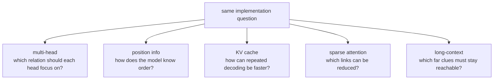

# P5-3.3 보충학습: 위치 표현, multi-head attention, KV cache, sparse attention, long-context를 처음 읽는 법

P5-3.1과 P5-3.2에서는 Transformer와 context window의 큰 구조를 보았습니다. 여기서는 본문에서 잠시 넘긴 구현 쪽 핵심 이름들을 입문 기준으로 정리합니다.

## 이 절의 범위

- multi-head attention은 왜 head를 여러 개 두는가?
- 위치 표현(position encoding)은 왜 필요한가?
- KV cache는 왜 대화형 생성 속도와 연결되는가?
- sparse attention은 무엇을 줄이려는 아이디어인가?
- long-context는 왜 별도 이름으로 자주 언급되는가?

이 절에서는 다음 내용을 깊게 다루지 않습니다.

- 각 위치 표현 방식의 수식 증명
- 서빙 엔진별 구현 비교
- 장문맥 전용 아키텍처 벤치마크 경쟁

각 위치 표현 방식의 수식 증명과 서빙 엔진별 구현 비교는 여기서 다루지 않습니다. 대신 context window와 실제 사용 제약은 본류인 P5-3.2에서 이미 연결했고, KV cache가 운영 지연 시간과 비용에 미치는 영향은 P5-16.1 서비스 운영 제약에서 다시 회수합니다. 장문맥 전용 아키텍처의 벤치마크 경쟁은 현재 본편 범위 밖에 둡니다.

이 절에서는 구현 최적화 자체를 익히기보다, 관련 문서를 읽을 때 이름 때문에 멈추지 않게 하는 데 집중합니다.

## 이 절의 목표

- multi-head attention을 `여러 관점의 관련도 계산` 정도로 설명할 수 있습니다.
- 위치 표현이 없으면 순서 정보를 잃는다는 점을 말할 수 있습니다.
- KV cache가 반복 생성 속도와 연결된다는 점을 설명할 수 있습니다.
- sparse attention이 `모든 위치를 똑같이 보지 않고 일부 연결만 남겨 계산 부담을 줄이려는 방향`임을 설명할 수 있습니다.
- long-context가 `더 긴 입력을 실제로 유지하고 다시 참고하려는 설계 문제`라는 점을 설명할 수 있습니다.

## 이 보충학습을 읽는 순서

이 보충학습은 다음 순서로 읽으면 충분합니다.

1. 먼저 다섯 이름이 모두 같은 층위의 개념이 아니라는 점을 구분합니다.
2. 그 다음 `관계를 여러 시선으로 보는 문제`, `순서를 알려 주는 문제`, `반복 계산을 줄이는 문제`, `연결 수를 줄이는 문제`, `긴 입력을 유지하는 문제`를 각각 읽습니다.
3. 이어서 KV cache 예제로 `같은 결과를 유지하면서 무엇을 덜 다시 계산하는가`를 확인합니다.
4. 마지막에 사례 표와 도식으로 `각 이름이 실제로 어떤 작업 장면에서 필요한가`를 다시 묶습니다.

## 이 다섯 이름을 먼저 어떻게 구분하면 좋은가

처음 읽는 독자는 `multi-head attention`, `위치 표현`, `KV cache`, `sparse attention`, `long-context`가 모두 Transformer의 같은 부품 이름처럼 느껴질 수 있습니다. 하지만 입문 단계에서는 이들을 먼저 역할별로 나누어 보는 편이 안전합니다.

- multi-head attention은 `관계를 여러 시선으로 읽는가`에 가깝습니다.
- 위치 표현은 `순서를 어떻게 알려 주는가`에 가깝습니다.
- KV cache는 `반복 생성에서 무엇을 다시 계산하지 않을 것인가`에 가깝습니다.
- sparse attention은 `모든 연결을 정말 다 유지해야 하는가`에 가깝습니다.
- long-context는 `긴 입력 전체를 실제로 유지하고 다시 참고할 수 있는가`에 가깝습니다.

즉, 이 다섯 이름은 모두 Transformer 주변에서 자주 등장하지만, 어떤 것은 표현 구조에 가깝고, 어떤 것은 계산 절약 장치에 가깝고, 어떤 것은 더 큰 설계 문제 전체를 가리킵니다.

## 왜 head를 여러 개 두나

attention 하나만 있다고 생각하면, 모델은 모든 관계를 한 가지 비교 규칙으로만 보게 됩니다. multi-head attention은 매우 단순화하면 `여러 종류의 비교 시선`을 병렬로 둔다고 이해할 수 있습니다.

입문 단계에서는 다음 정도로 받아들이면 충분합니다.

- 어떤 head는 가까운 문맥 관계를 더 잘 볼 수 있고
- 어떤 head는 더 긴 거리 의존성을 더 잘 볼 수 있으며
- 여러 시선을 합쳐 더 풍부한 표현을 만든다

## 위치 표현은 왜 필요한가

토큰을 벡터로만 두면, 모델은 `이 토큰이 앞에 있었는지 뒤에 있었는지`를 잃기 쉽습니다. 그래서 위치 표현(position encoding 또는 positional information)이 붙습니다.

RoPE, ALiBi 같은 이름은 이 위치 정보를 다루는 서로 다른 설계입니다. 지금 단계에서는 `Transformer가 순서를 저절로 아는 것이 아니라, 순서 정보를 따로 공급해야 한다`는 사실이 핵심입니다.

## KV cache는 왜 중요한가

대화형 생성에서는 한 토큰을 만들고 다시 다음 토큰을 만듭니다. 이때 이전 계산을 매번 처음부터 다 다시 하면 매우 비효율적입니다.

KV cache는 앞에서 계산한 일부 attention 관련 값을 재사용해, 다음 토큰 생성 때 속도를 높이는 장치로 이해하면 됩니다.

즉:

- context window가 길수록 계산 부담이 커지고
- KV cache는 그 반복 부담을 줄이는 쪽으로 작동합니다

이 감각은 서비스 제약을 다루는 P5-16.1에서도 다시 중요해집니다.

## sparse attention은 무엇을 줄이려 하나

기본 self-attention을 아주 단순하게 읽으면, 각 토큰이 다른 많은 토큰과 관련도를 계산합니다. 문맥이 길어질수록 이 비교 수가 빠르게 늘어나기 때문에, `정말 모든 위치를 매번 똑같이 자세히 봐야 하나?`라는 질문이 자연스럽게 나옵니다.

sparse attention은 이 질문에 대한 한 가지 방향입니다. 입문 단계에서는 다음처럼 이해하면 충분합니다.

- 가까운 이웃은 더 촘촘히 보고
- 멀리 떨어진 위치는 일부만 골라 보거나
- 정해진 규칙으로 연결을 줄여 계산 부담을 낮추려는 시도입니다

즉, sparse attention은 `attention을 버린다`가 아니라, `모든 연결을 같은 밀도로 유지하지 않는다`에 가깝습니다.

## long-context는 왜 별도 이름으로 불리나

long-context는 단순히 `입력이 길다`는 말보다 조금 더 넓은 뜻으로 자주 쓰입니다. 핵심은 모델이 더 긴 문서를 넣을 수 있는가뿐 아니라, 그 긴 입력 안에서 앞쪽 단서와 뒤쪽 단서를 함께 유지하고 다시 참고할 수 있는가입니다.

입문 단계에서는 다음처럼 받아들이면 충분합니다.

- context window 숫자가 커지는 문제
- 긴 입력에서 중요한 단서를 덜 잃는 문제
- 그 과정에서 비용, 지연 시간, 메모리 부담이 함께 커지는 문제

즉, long-context는 `길이 자랑`이 아니라 `긴 문맥을 실제로 다루는 설계 전체`를 가리키는 말에 더 가깝습니다.

## 여기까지를 한 줄로 묶으면

여기까지의 이름들을 한 번에 외우려 하기보다, 먼저 다음처럼 묶어 두면 읽기가 쉬워집니다.

- multi-head attention, 위치 표현: `모델이 문맥을 어떻게 읽는가`
- KV cache, sparse attention: `계산을 어떻게 덜 반복하거나 줄일 것인가`
- long-context: `긴 입력을 실제로 다루는 전체 문제를 어떻게 설명할 것인가`

이 기준이 있어야 뒤의 예제를 볼 때도 `KV cache는 모델 뜻을 바꾸는 장치인가`, `sparse attention은 attention을 없애는가`, `long-context는 단순 길이 숫자인가` 같은 오해를 덜 하게 됩니다.

## 실행 가능한 Python 예제로 보기

이번 예제의 목표는 `KV cache가 실제로 무엇을 저장하고, 턴이 길어질수록 얼마나 많은 재계산을 막는가`를 보이는 것입니다. 이번에는 토큰 ID를 작은 임베딩과 query/key/value 투영에 실제로 통과시켜, 마지막 토큰의 attention 결과가 캐시 유무와 상관없이 같게 나오면서도 재투영량은 어떻게 줄어드는지 함께 확인합니다.

핵심 비교는 다음입니다.

- 캐시가 없으면 새 토큰을 만들 때마다 지금까지의 모든 토큰을 다시 K/V로 바꿉니다.
- 캐시가 있으면 이전 토큰의 K/V는 저장해 두고, 새 토큰의 K/V만 추가합니다.
- 두 방식의 마지막 attention 출력은 같아야 합니다. 달라지는 것은 `얼마나 다시 계산했는가`입니다.

입력:

- 이미 본 prefix 토큰
- 새로 이어서 생성할 토큰

출력:

- 캐시 없이 각 step에서 다시 계산한 K/V 행렬 shape와 마지막 토큰 attention 결과
- 캐시를 쓸 때 유지되는 K/V cache shape와 마지막 토큰 attention 결과
- 두 방식의 step별 projection 대상 토큰 수
- 두 방식의 총 projection 대상 토큰 수와 절감 비율

문제 상황:

- KV cache는 이전 토큰 계산을 재사용해 생성 비용을 줄인다는 점을 step별로 직접 비교해 보는 편이 이해에 도움이 된다

입력(input):

위에 정리한 토큰 사전과 입력 시퀀스를 사용합니다.

```python
import numpy as np

token_to_id = {
    "사용자": 0,
    "로그인": 1,
    "오류": 2,
    "재현": 3,
    "완료": 4,
}

embedding_table = np.array(
    [
        [1.0, 0.2, 0.0],
        [0.5, 1.0, 0.1],
        [1.2, 0.8, 0.4],
        [0.3, 1.1, 0.9],
        [0.7, 0.4, 1.3],
    ]
)

W_k = np.array(
    [
        [0.8, 0.1],
        [0.2, 0.7],
        [0.5, 0.6],
    ]
)

W_v = np.array(
    [
        [0.3, 0.9],
        [0.6, 0.2],
        [0.4, 0.8],
    ]
)

W_q = np.array(
    [
        [0.7, 0.2],
        [0.1, 0.8],
        [0.6, 0.5],
    ]
)

prefix_token_ids = [token_to_id["사용자"], token_to_id["로그인"], token_to_id["오류"]]
generated_token_ids = [token_to_id["재현"], token_to_id["완료"]]


def project_to_kv(token_ids):
    embeddings = embedding_table[token_ids]
    keys = embeddings @ W_k
    values = embeddings @ W_v
    return keys, values


def project_query(token_id):
    embedding = embedding_table[[token_id]]
    return embedding @ W_q


def attention_for_last_token(query, keys, values):
    scores = (query @ keys.T) / np.sqrt(keys.shape[1])
    shifted = scores - np.max(scores)
    weights = np.exp(shifted) / np.sum(np.exp(shifted))
    context = weights @ values
    return weights, context


def decode_without_cache(prefix_ids, new_ids):
    seen_ids = prefix_ids[:]
    projected_token_count = 0
    step_logs = []

    for new_id in new_ids:
        seen_ids.append(new_id)
        keys, values = project_to_kv(seen_ids)
        query = project_query(new_id)
        weights, context = attention_for_last_token(query, keys, values)
        projected_token_count += len(seen_ids)
        step_logs.append((new_id, len(seen_ids), keys, values, weights, context))

    return step_logs, projected_token_count


def decode_with_cache(prefix_ids, new_ids):
    cached_keys, cached_values = project_to_kv(prefix_ids)
    projected_token_count = len(prefix_ids)
    step_logs = [("prefix_loaded", len(prefix_ids), cached_keys.copy(), cached_values.copy())]

    for new_id in new_ids:
        new_keys, new_values = project_to_kv([new_id])
        cached_keys = np.vstack([cached_keys, new_keys])
        cached_values = np.vstack([cached_values, new_values])
        query = project_query(new_id)
        weights, context = attention_for_last_token(query, cached_keys, cached_values)
        projected_token_count += 1
        step_logs.append((new_id, 1, cached_keys.copy(), cached_values.copy(), weights, context))

    return step_logs, projected_token_count


no_cache_logs, no_cache_count = decode_without_cache(prefix_token_ids, generated_token_ids)
with_cache_logs, with_cache_count = decode_with_cache(prefix_token_ids, generated_token_ids)
saved_ratio = round(1 - (with_cache_count / no_cache_count), 3)

print("[without cache]")
for token_id, projected_now, keys, values, weights, context in no_cache_logs:
    print("new_token_id =", token_id)
    print("projected_now =", projected_now)
    print("keys_shape =", keys.shape, "values_shape =", values.shape)
    print("attention_weights =", np.round(weights, 3))
    print("context =", np.round(context, 3))
    print("last_key_row =", np.round(keys[-1], 2))
    print("last_value_row =", np.round(values[-1], 2))

print("[with cache]")
for token_id, projected_now, keys, values, weights, context in with_cache_logs:
    print("step =", token_id)
    print("projected_now =", projected_now)
    print("keys_shape =", keys.shape, "values_shape =", values.shape)
    if token_id != "prefix_loaded":
        print("attention_weights =", np.round(weights, 3))
        print("context =", np.round(context, 3))
        print("last_key_row =", np.round(keys[-1], 2))
        print("last_value_row =", np.round(values[-1], 2))

print("step_output_match_1 =", np.allclose(no_cache_logs[0][5], with_cache_logs[1][5]))
print("step_output_match_2 =", np.allclose(no_cache_logs[1][5], with_cache_logs[2][5]))

print("no_cache_projected_token_count =", no_cache_count)
print("with_cache_projected_token_count =", with_cache_count)
print("saved_ratio =", saved_ratio)
```

실행 결과 예시는 다음처럼 읽을 수 있습니다.

```text
[without cache]
new_token_id = 3
projected_now = 4
keys_shape = (4, 2) values_shape = (4, 2)
attention_weights = [[0.121 0.189 0.317 0.373]]
context = [[0.931 1.197]]
last_key_row = [0.91 1.34]
last_value_row = [1.11 1.21]
new_token_id = 4
projected_now = 5
keys_shape = (5, 2) values_shape = (5, 2)
attention_weights = [[0.095 0.124 0.252 0.24  0.289]]
context = [[0.937 1.369]]
last_key_row = [1.29 1.13]
last_value_row = [0.97 1.75]
[with cache]
step = prefix_loaded
projected_now = 3
keys_shape = (3, 2) values_shape = (3, 2)
step = 3
projected_now = 1
keys_shape = (4, 2) values_shape = (4, 2)
attention_weights = [[0.121 0.189 0.317 0.373]]
context = [[0.931 1.197]]
last_key_row = [0.91 1.34]
last_value_row = [1.11 1.21]
step = 4
projected_now = 1
keys_shape = (5, 2) values_shape = (5, 2)
attention_weights = [[0.095 0.124 0.252 0.24  0.289]]
context = [[0.937 1.369]]
last_key_row = [1.29 1.13]
last_value_row = [0.97 1.75]
step_output_match_1 = True
step_output_match_2 = True
no_cache_projected_token_count = 9
with_cache_projected_token_count = 5
saved_ratio = 0.444
```

이 예제에서 읽어야 할 핵심은 다음입니다.

- 두 방식 모두 같은 step의 `attention_weights`와 `context`가 일치합니다.
- 즉, KV cache는 모델의 마지막 attention 결과를 바꾸려는 장치가 아니라 `같은 결과를 더 적은 재계산으로 만들려는 장치`입니다.
- 차이는 `앞에서 본 prefix 토큰의 K/V를 다시 투영했는가`에 있습니다.
- KV cache는 `이전 토큰의 key/value 행렬을 저장해 두고, 새 토큰 행만 아래에 이어 붙인다`는 점이 핵심입니다.
- 캐시가 없으면 첫 새 토큰에서는 4개, 다음 토큰에서는 5개를 다시 투영하지만, 캐시가 있으면 새 토큰마다 1개만 추가 투영합니다.
- 그래서 prefix가 길어질수록 `projected_token_count` 차이가 빠르게 커지고, 이 작은 예제에서도 재투영량이 약 44.4% 줄어듭니다.

이 예제에서는 `embedding_table`, `W_q`, `W_k`, `W_v`, `generated_token_ids`를 직접 바꿔 볼 수 있습니다. 예를 들어 새 토큰을 2개에서 5개로 늘리거나 prefix를 더 길게 만들면, 캐시 유무에 따라 다시 투영하는 토큰 수 차이가 더 크게 벌어집니다. 즉, 독자는 단순히 `캐시가 빠르다`는 말을 외우는 대신, `같은 attention 결과를 유지한 채 어느 step에서 무엇을 다시 계산하지 않는가`를 직접 실험해 볼 수 있습니다.

## 이름들을 한 표로 다시 묶으면

| 이름 | 초심자용 한 문장 | 처음 떠올릴 질문 |
| --- | --- | --- |
| multi-head attention | 관계를 한 시선으로만 보지 않게 하는 장치 | `무슨 관계를 여러 각도에서 보려는가?` |
| 위치 표현 | 순서 정보를 따로 공급하는 장치 | `이 토큰이 앞인지 뒤인지 어떻게 아는가?` |
| KV cache | 반복 생성 때 이전 계산 일부를 다시 쓰는 장치 | `왜 긴 대화일수록 응답 속도가 중요해지는가?` |
| sparse attention | 모든 위치를 같은 밀도로 보지 않으려는 계산 절약 방향 | `정말 모든 토큰 쌍을 다 자세히 봐야 하는가?` |
| long-context | 긴 입력을 유지하고 다시 참고하려는 전체 문제 | `앞쪽 단서를 뒤에서도 놓치지 않을 수 있는가?` |

## 사례로 보기

아래 도식은 이 보충학습의 사례를 `Transformer 내부 이름이 무엇인가`보다 `어떤 문제를 해결하려고 이 장치가 붙는가`라는 공통 질문으로 다시 묶은 것입니다.



이 도식에서 확인해야 할 점은 다섯 이름이 서로 다른 문제를 다룬다는 것입니다. multi-head는 `관계를 여러 시선으로 본다`, 위치 표현은 `순서를 알려 준다`, KV cache는 `반복 생성을 더 빠르게 만든다`, sparse attention은 `연결 수를 줄여 계산 부담을 낮추려 한다`, long-context는 `긴 입력에서도 중요한 단서를 유지하려 한다`는 식으로 역할을 나누어 읽는 편이 입문 단계에서 안전합니다.

### 사례 1. 여러 head가 필요한 문장

긴 문장에서 `그는 보고서를 읽고, 수정한 뒤, 팀장에게 다시 보냈다` 같은 표현을 생각해 보겠습니다. 사람은 이 문장을 읽을 때 `누가 읽었는가`, `무엇을 수정했는가`, `누구에게 보냈는가`를 한 가지 기준만으로 보지 않습니다. 하지만 문장 전체를 한 덩어리로만 보면 `그`가 한 행동과 `보고서`에 일어난 변화, `팀장`과의 전달 관계가 서로 섞여 읽힐 수 있습니다. 예를 들어 `수정한 뒤`가 `보고서`를 꾸미는 말인지, `그`의 행동 순서를 말하는지 동시에 따라가야 문장이 자연스럽게 풀립니다. 여기서 필요한 변화는 한 문장을 한 번에 한 기준으로만 읽는 것이 아니라, 여러 관계 축을 나누어 보는 것입니다. multi-head attention은 이런 관계를 매우 단순화하면 여러 시선으로 나누어 보는 장치처럼 이해할 수 있습니다. 그래서 이 사례에서 확인해야 할 결과는 `한 문장 안에서도 가까운 관계와 먼 관계를 서로 다른 시선으로 구분해 읽어야 할 필요가 보이는가`입니다.

### 사례 2. KV cache가 체감 속도로 보이는 경우

사용자가 긴 코드 파일을 기반으로 채팅형 코딩 도우미와 여러 턴을 주고받는다고 해 보겠습니다. 사람은 같은 파일을 계속 보고 있으니 다음 답도 빨리 이어지길 기대합니다. 하지만 이전 토큰 관계를 매번 처음부터 다시 계산하면, 턴이 길어질수록 응답 지연이 눈에 띄게 커질 수 있습니다. 예를 들어 처음 두세 턴은 괜찮아 보여도, 에러 로그와 수정 기록이 계속 쌓이면 같은 길이의 답을 만드는 데도 대기 시간이 점점 늘 수 있습니다. 여기서 바뀌는 점은 앞에서 이미 계산한 일부 관계를 다시 처음부터 풀지 않는다는 것입니다. KV cache는 앞에서 계산한 일부 attention 관련 값을 재사용해 이 반복 부담을 줄입니다. 그래서 이 사례에서 확인해야 할 결과는 `대화가 길어질수록 캐시 재사용 여부가 체감 지연 시간 차이로 드러나는가`입니다.

### 사례 3. sparse attention이 필요한 긴 로그 분석

수천 줄짜리 시스템 로그를 읽으며 장애 원인을 찾는 장면을 떠올려 보겠습니다. 사람은 처음에는 `모든 줄을 전부 서로 비교하면 가장 안전하겠다`고 느낄 수 있습니다. 하지만 실제로는 인접한 시간대 로그는 촘촘히 보고, 몇몇 핵심 에러 코드나 세션 전환 지점만 멀리 다시 참조해도 충분한 경우가 많습니다. 예를 들어 대부분의 정상 heartbeat 메시지까지 모두 같은 밀도로 비교하면 계산은 크게 늘지만, 정작 중요한 것은 `에러 직전 상태`, `재시도 구간`, `최종 실패 코드`일 수 있습니다. 여기서 바뀌는 점은 `모든 줄을 다 같은 비중으로 본다`에서 `핵심 연결은 남기되 불필요한 비교는 줄인다`로 기준이 이동한다는 것입니다. sparse attention은 이런 방향을 매우 단순화한 이름으로 이해할 수 있습니다. 그래서 이 사례에서 확인해야 할 결과는 `모든 연결을 유지하지 않아도 핵심 장애 단서가 실제로 남는가`입니다.

### 사례 4. long-context가 필요한 계약서 읽기

긴 계약서를 검토할 때 초반 정의 조항과 뒤쪽 예외 조항을 함께 놓치지 않아야 하는 장면을 떠올려 보겠습니다. 사람은 문서가 길어질수록 처음 정의가 뒤까지 유지되는지 먼저 걱정하게 됩니다. 예를 들어 앞쪽에서 `서비스 중단`의 의미를 좁게 정의해 두었는데, 뒤쪽 면책 조항을 읽을 때 그 정의를 잊으면 최종 해석이 달라질 수 있습니다. 여기서 중요한 것은 문서를 많이 넣었다는 사실 자체가 아니라, 앞 정의와 뒤 예외가 같은 작업 안에서 다시 연결되는가입니다. long-context는 이런 문제를 다루는 이름입니다. 그래서 이 사례에서 확인해야 할 결과는 `문서 길이가 길어져도 초반 정의와 뒤 예외가 실제로 함께 살아남는가`입니다.

네 사례를 내부 장치 역할 관점으로 다시 묶으면 다음과 같습니다.

| 장치 또는 방향 | 먼저 풀려는 문제 | 사례에서 드러나는 체감 변화 |
| --- | --- | --- |
| multi-head attention | 한 문장 안의 여러 관계 축 분리 | 주어, 대상, 전달 관계를 덜 섞음 |
| KV cache | 긴 대화에서 반복 계산 부담 감소 | 턴이 길어져도 응답 지연 증가를 줄임 |
| sparse attention | 모든 연결을 다 유지하는 계산 부담 완화 | 긴 로그에서 핵심 연결만 남겨도 분석 가능 |
| long-context | 앞 정의와 뒤 예외의 장거리 연결 유지 | 긴 계약서에서도 초반 조건을 뒤에서 다시 참조 |

## 다음 절과의 연결

이 보충학습은 Transformer 내부 이름을 읽는 데 필요한 최소 감각을 정리합니다. 다음 장의 P5-4.1 GPT 계열을 읽을 때는 여기서 본 attention, 위치 표현, 캐시, 긴 문맥 관련 개념이 `왜 생성형 구조가 실제 서비스 경험을 바꾸었는가`로 이어진다고 연결하면 됩니다.

## 이 절에서 기억할 관점

- multi-head attention은 관련도 계산을 한 시선으로만 하지 않기 위한 장치입니다.
- 위치 표현은 순서 정보를 공급합니다.
- KV cache는 긴 생성에서 반복 계산 비용을 줄이기 위한 실용 장치입니다.
- sparse attention은 모든 연결을 같은 밀도로 유지하지 않아 계산 부담을 줄이려는 방향입니다.
- long-context는 긴 입력을 실제로 유지하고 다시 참고하려는 문제 전체를 가리킵니다.

## 체크리스트

- multi-head attention의 필요성을 수식 없이 설명할 수 있는가?
- 위치 표현이 왜 필요한지 말할 수 있는가?
- KV cache가 대화형 생성 속도와 왜 연결되는지 설명할 수 있는가?
- sparse attention이 왜 등장하는지 입문 수준에서 설명할 수 있는가?
- long-context가 왜 별도 과제로 불리는지 말할 수 있는가?

## 출처와 참고 자료

- Ashish Vaswani et al., `Attention Is All You Need`, NeurIPS, 2017, 확인 날짜: 2026-06-29.
- Tri Dao et al., attention/serving 최적화 관련 공개 자료, 확인 날짜: 2026-06-29.
- Hugging Face, KV cache와 generation 관련 문서, 확인 날짜: 2026-06-29.
