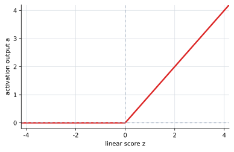

# P5-3.4 ReLU

Section ID: `P5-3.4`
Version: `v2026.07.17`

In P5-3.2 and P5-3.3, we looked at functions such as the sigmoid and tanh that compress values into a fixed range. ReLU (rectified linear unit) is much simpler. It turns negative values into 0 and passes positive values through almost as they are.

Because of this simplicity, ReLU appears very often in modern deep learning.

## Scope Of This Section

- What formula and graph shape does ReLU have?
- Why can it be read as blocking negatives and passing positives?
- Why is ReLU used so often in deep neural networks?
- Why is it not enough to remember only ReLU?

The formula comparison with the sigmoid and tanh is organized in P5-3.5. In other words, this section is the place to first hold onto the most basic intuition of ReLU: `block negatives, pass positives`.

## Goals Of This Section

- You can explain the ReLU formula \(f(z)=\max(0,z)\).
- You can describe the intuition that negative values are cut to 0 while positive values pass through unchanged.
- You can distinguish ReLU from the sigmoid and tanh by the fact that it does not saturate in the positive range.
- You can understand that ReLU is used often, but is not the automatic right answer for every problem.

## The Formula Of ReLU

ReLU is written as follows.

\[
f(z)=\max(0,z)
\]

If the same expression is written by range, it becomes more intuitive.

\[
f(z)=
\begin{cases}
0 & z < 0 \\
z & z \ge 0
\end{cases}
\]

That is, if \(z\) is negative, the output is 0, and if \(z\) is 0 or greater, the output is \(z\) itself.

## How Should The Graph Be Read

The ReLU graph sticks to the floor when the value is below 0, and after 0 it rises as a straight line.

| Input range | Feel of the output | What the reader should read first |
| --- | --- | --- |
| Negative values | 0 | They are cut off as signals that will not be passed to the next layer. |
| Small positive values near 0 | Small positive values | Weak signals survive as they are. |
| Large positive values | Large positive values | Strong signal differences keep being preserved. |

The sigmoid and tanh are compressed near 1 in the large-positive range, but ReLU can keep growing in the positive range. Because of this difference, ReLU feels intuitive when you want to preserve the difference among large positive signals all the way through.

## Cases And Examples

Suppose that in an equipment-warning model, one hidden node leaves only `combination signals that really deserve to be treated as warning` for the next layer. Let us say that if it is negative, it is read as `this is not yet a combination that should count as warning`, and if it is positive, it is read as `a warning-side combination has been detected`.

| Scene | \(z\) | Intuition of the ReLU output | Judgment that remains first |
| --- | --- | --- | --- |
| Stable or irrelevant scene | \(-1.5\) | It is cut to 0 and not passed to the next layer. | It is read as `this node is not reacting yet`. |
| Scene almost on the boundary | \(-0.1\) | Even a weak negative value is cut to 0. | In this node, `slightly insufficient` and `strongly insufficient` are not distinguished. |
| Weak warning scene | \(0.2\) | A small positive signal remains as it is. | It is read as `the warning-side signal has just started to come alive`. |
| Strong warning scene | \(3.0\) | A large positive signal is passed through strongly as it is. | It is read as `a strong warning combination has been detected`. |

What should be read first in this case is that ReLU leaves behind `whether a positive signal is alive` before it leaves behind `how strong the negative value was`. \(-1.5\) and \(-0.1\) were originally different scores, but after ReLU they both become 0. By contrast, \(0.2\) and \(3.0\) are both positive, so their difference remains intact.

In other words, ReLU is closer to a function that decides first `will the positive signal be kept or cut` rather than, more broadly, `is the direction negative or positive`. Because of this, the next layer can continue its calculation not by comparing negative-side scenes in detail, but by centering on the positive activation values that survived.

The result to confirm in this case is that ReLU folds the differences in the negative range into 0, while keeping the differences in the positive range as they are, making it a function that more directly selects `which signals to keep`.

## Practice And Exercise

Suppose the following values are passed through ReLU.

| \(z\) | ReLU output | Question to check first |
| --- | --- | --- |
| \(-3\) | 0 | How does a large negative value remain? |
| \(-0.2\) | 0 | How is a weak negative value different from a large negative value? |
| \(0\) | 0 | What happens at the boundary point? |
| \(0.2\) | 0.2 | From what point do positive values begin to survive? |
| \(4\) | 4 | Is the difference among large positive values preserved? |
| \(8\) | 8 | Can large positive values keep growing? |

When reading this table, the following two questions must be closed directly.

1. \(-3\) and \(-0.2\) originally have different magnitudes, so why do they appear as the same value after ReLU?
2. If \(4\) is raised to \(8\), why can the difference continue to grow unchanged, rather than being compressed as in the sigmoid or tanh?

The direction of the answer is clear. ReLU folds all values in the negative range into 0, so the difference `how negative was it?` disappears. By contrast, in the positive range it passes the value through unchanged, so the differences among \(0.2\), \(4\), and \(8\) keep being preserved. Therefore, when reading ReLU, you have to look together at `the negative range is cut off`, `positive values come alive starting from 0`, and `large positive values can keep growing without saturation`.

## Checklist

- Can you state the ReLU formula \(f(z)=\max(0,z)\)?
- Can you distinguish negative blocking from positive pass-through?
- Can you explain that ReLU does not saturate in the large-positive range?
- Can you say together that negative information can disappear as 0?
- Can you anticipate how ReLU differs from the sigmoid and tanh in the formula comparison of P5-3.5?

## Sources And References

- Ian Goodfellow, Yoshua Bengio, Aaron Courville, `Deep Learning`, MIT Press, 2016, date checked: 2026-06-29. [https://www.deeplearningbook.org/](https://www.deeplearningbook.org/){: target="_blank" rel="noopener noreferrer" }
- Xavier Glorot, Antoine Bordes, Yoshua Bengio, `Deep Sparse Rectifier Neural Networks`, AISTATS, 2011, date checked: 2026-06-29.
