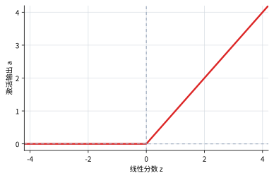

# P5-3.4 ReLU

Section ID: `P5-3.4`
Version: `v2026.07.17`

在 P5-3.2 与 P5-3.3 里，我们已经看过像 sigmoid 与 tanh 这样会把值压进固定范围里的函数。ReLU（rectified linear unit）要简单得多。它会把负值直接变成 0，而把正值几乎原样放过去。

也正因为这种简单性，ReLU 在现代深度学习里非常常见。

## 本节范围

- ReLU 的公式与图像长什么样？
- 为什么它会被读成“截断负值、放行正值”？
- 为什么 ReLU 在深层神经网络里会如此常用？
- 为什么不能只记住 ReLU 就算结束？

与 sigmoid、tanh 的公式比较会在 P5-3.5 统一整理。也就是说，这一节首先要抓住的是 ReLU 最基础的直觉：`截断负值，放行正值。`

## 本节目标

- 能解释 ReLU 的公式 \(f(z)=\max(0,z)\)。
- 能说明“负值被切成 0，而正值几乎原样通过”这条直觉。
- 能把 ReLU 与 sigmoid、tanh 区分开来，知道它在正值区间不会饱和。
- 能理解 ReLU 虽然常用，但并不是所有问题的自动正确答案。

## ReLU 的公式

ReLU 的公式写成下面这样。

\[
f(z)=\max(0,z)
\]

如果换成分区间的写法，会更直观。

\[
f(z)=
\begin{cases}
0 & z < 0 \\
z & z \ge 0
\end{cases}
\]

也就是说，当 \(z\) 是负数时，输出就是 0；而当 \(z\) 大于等于 0 时，输出就是 \(z\) 本身。

## 该怎样读这条图

ReLU 的图像在 0 以下会贴着底线走，而在 0 之后会沿着直线不断上升。

| 输入区间 | 输出直觉 | 读者首先该看的点 |
| --- | --- | --- |
| 负值 | 0 | 它会被切断，作为不会传给下一层的信号。 |
| 0 附近的小正值 | 小正值 | 较弱信号会原样活下来。 |
| 很大的正值 | 很大的正值 | 强信号之间的差异会持续保留下来。 |

sigmoid 与 tanh 在较大的正数区间都会被压向 1，而 ReLU 在正值区间里却可以继续增长。正因为有这个差别，当你希望较大正值之间的差异也一直保留下来时，ReLU 会显得很直观。

## 案例与例子

假设在一个设备警告模型里，某个隐藏节点只会把`真正值得看成警告的组合信号`留给下一层。可以约定：如果分数是负的，就读作`这还不是一个足以算作警告的组合`；如果分数是正的，就读作`已经抓到了偏向警告一侧的组合`。

| 场景 | \(z\) | ReLU 输出的直觉 | 首先留下来的判断 |
| --- | --- | --- | --- |
| 稳定或无关场景 | \(-1.5\) | 它会被切成 0，不再传给下一层。 | 可以读成`这个节点此刻还没有反应`。 |
| 几乎卡在边界上的场景 | \(-0.1\) | 即使只是很弱的负值，也会被切成 0。 | 在这个节点里，`稍微不够`与`远远不够`不会继续被细分。 |
| 较弱的警告场景 | \(0.2\) | 小正值会原样留下。 | 可以读成`警告侧信号刚刚开始活起来了`。 |
| 强警告场景 | \(3.0\) | 很大的正值会强烈地原样传下去。 | 可以读成`已经抓到了强烈的警告组合`。 |

这个案例里首先要看的，是 ReLU 更先保留下来的不是`负值到底有多强`，而是`正值信号有没有真正活着`。 \(-1.5\) 与 \(-0.1\) 原本分数不同，但在 ReLU 之后都会变成 0。相反，\(0.2\) 与 \(3.0\) 都是正值，因此它们之间的差异会被完整保留下来。

也就是说，比起更宽泛地判断“它到底是正方向还是负方向”，ReLU 更像是在优先做一件更窄的事：`这个正信号要不要留下，还是直接切掉？` 正因为这样，下一层并不会继续细致比较负侧场景之间的差异，而更可能围绕那些真正活下来的正向激活值继续计算。

所以这个案例真正要确认的结果是：ReLU 会把负值区间里的差异全部折叠成 0，却会把正值区间里的差异原样保留下来，因此它是一种更直接地筛选`哪些信号值得继续留下`的函数。

## 练习与例题

现在假设把下面这些值送进 ReLU。

| \(z\) | ReLU 输出 | 首先要确认的问题 |
| --- | --- | --- |
| \(-3\) | 0 | 很大的负值最后会留下什么？ |
| \(-0.2\) | 0 | 较弱的负值与很大的负值会怎样不同？ |
| \(0\) | 0 | 在边界点上究竟会发生什么？ |
| \(0.2\) | 0.2 | 正值会从什么时候开始真正活下来？ |
| \(4\) | 4 | 很大的正值之间的差异会保留下来吗？ |
| \(8\) | 8 | 很大的正值能否继续增长？ |

阅读这张表时，必须自己把下面两个问题真正闭合。

1. \(-3\) 与 \(-0.2\) 原本大小不同，为什么在经过 ReLU 后却看起来完全一样？
2. 如果把 \(4\) 提高到 \(8\)，为什么它不会像 sigmoid 或 tanh 那样被重新压缩，而是能让差异继续原样扩大？

答案方向是明确的。ReLU 会把负值区间全部折叠成 0，因此`到底负了多少`这个差异会完全消失。相反，在正值区间里，它会把值原样放行，所以 \(0.2\)、\(4\)、\(8\) 之间的差异都会继续保留下来。因此在阅读 ReLU 时，必须一起看清：`负值区间会被切掉`、`从 0 开始正值会活起来`、`很大的正值不会像 sigmoid 或 tanh 那样在正侧饱和。`

## 检查清单

- 能否说出 ReLU 的公式 \(f(z)=\max(0,z)\)？
- 能否区分“截断负值”与“放行正值”？
- 能否解释 ReLU 在较大正值区间不会饱和？
- 能否同时说明：负值信息会被压成 0，从而直接消失？
- 能否预先判断：在 P5-3.5 的公式比较里，ReLU 会怎样与 sigmoid、tanh 形成差异？

## 出处与参考资料

- Ian Goodfellow, Yoshua Bengio, Aaron Courville, `Deep Learning`, MIT Press, 2016, 确认日期：2026-06-29. [https://www.deeplearningbook.org/](https://www.deeplearningbook.org/){: target="_blank" rel="noopener noreferrer" }
- Xavier Glorot, Antoine Bordes, Yoshua Bengio, `Deep Sparse Rectifier Neural Networks`, AISTATS, 2011, 确认日期：2026-06-29.
