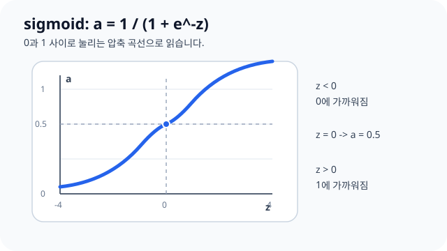
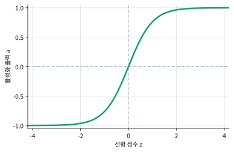
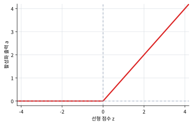

# P5-3.5 대표 활성화 함수 수식 비교

> Section ID: `P5-3.5`
> Version: `v2026.07.26`

P5-3.2부터 P5-3.4까지 sigmoid, tanh, ReLU를 각각 따로 보았습니다. 이제 세 함수를 한 번에 놓고 비교합니다. 여기서 목적은 이름 암기가 아니라, 같은 점수 \(z\)가 어떤 수식과 출력 범위로 달라지는지 확인하는 것입니다.

대표 활성화 함수 비교가 다시 흐려지면 개념사전의 [활성화 함수(activation function)](../../../reference/concept-glossary-parts/14-hieut.md#activation-function)와 [sigmoid](../../../reference/concept-glossary-parts/07-siot.md#sigmoid) 항목을 기준선으로 삼고, tanh와 ReLU는 같은 활성화 함수 비교 안에서 다시 봅니다.

## 대표 활성화 함수를 비교하는 질문

- sigmoid, tanh, ReLU의 수식을 한 표에서 비교합니다.
- 출력 범위와 포화 여부를 비교합니다.
- 같은 입력값이 함수별로 어떻게 달라지는지 확인합니다.
- 비교 결과를 다음 출력층 Section으로 연결합니다.

이 절에서는 각 함수의 역사와 세부 사용 맥락을 길게 반복하지 않습니다. 개별 직관은 P5-3.2, P5-3.3, P5-3.4에서 이미 다뤘고, 출력층에서 어떤 값을 써야 하는지는 P5-3.6에서 이어집니다.

## 그래프 모양과 출력 범위의 판단 기준

- 세 대표 활성화 함수의 수식을 나란히 비교할 수 있습니다.
- 출력 범위와 포화 여부를 기준으로 함수 차이를 설명할 수 있습니다.
- 같은 \(z\)라도 다음 층에 전달되는 값이 달라진다는 점을 수치로 확인할 수 있습니다.
- 함수 비교를 출력층 해석과 손실 함수로 연결할 수 있습니다.

## 수식 비교

| 함수 | 수식 | 출력 범위 | 핵심 반응 |
| --- | --- | --- | --- |
| sigmoid | \(\sigma(z)=\frac{1}{1+e^{-z}}\) | \(0 < \sigma(z) < 1\) | 0과 1 사이로 압축 |
| tanh | \(\tanh(z)=\frac{e^z-e^{-z}}{e^z+e^{-z}}\) | \(-1 < \tanh(z) < 1\) | 0 중심으로 음수와 양수 압축 |
| ReLU | \(f(z)=\max(0,z)\) | \(0 \le f(z)\) | 음수 차단, 양수 통과 |

이 표에서 먼저 봐야 할 축은 세 가지입니다.

1. 출력이 어느 범위에 갇히는가?
2. 음수 입력이 다음 층에 남는가?
3. 큰 양수 입력이 계속 커질 수 있는가?

## 그래프로 비교하기

함수의 이름보다 곡선 모양을 먼저 보면 차이가 빠르게 잡힙니다.







이 세 그래프를 나란히 보면 sigmoid와 tanh는 양끝에서 포화됩니다. 입력이 더 커져도 출력이 1 또는 -1 근처에서 크게 변하지 않습니다. 반면 ReLU는 음수 구간을 0으로 자르지만, 양수 구간에서는 계속 직선으로 증가합니다.

## 같은 점수를 넣어 비교하기

설비 경고 모델의 은닉 노드가 다음 다섯 점수를 만들었다고 해 봅니다.

| 장면 | \(z\) | sigmoid | tanh | ReLU |
| --- | --- | --- | --- | --- |
| 조용한 장면 | \(-2\) | 0.119 | -0.964 | 0 |
| 안정 복구 장면 | \(-0.5\) | 0.378 | -0.462 | 0 |
| 경계 경보 장면 | \(0.1\) | 0.525 | 0.100 | 0.1 |
| 확인된 경고 장면 | \(0.5\) | 0.622 | 0.462 | 0.5 |
| 즉시 정지 검토 장면 | \(3\) | 0.953 | 0.995 | 3 |

숫자를 외울 필요는 없습니다. 읽어야 할 결과는 다음입니다.

- sigmoid는 항상 0과 1 사이로 눌러 위험도처럼 읽기 쉬운 값을 만듭니다.
- tanh는 음수와 양수 부호를 모두 남기면서 -1과 1 사이로 압축합니다.
- ReLU는 음수를 모두 0으로 만들고, 양수 차이는 그대로 남깁니다.

## 비교를 어떻게 써먹나

| 먼저 필요한 계산 감각 | 더 먼저 떠올릴 함수 | 이유 |
| --- | --- | --- |
| 0과 1 사이 값으로 읽고 싶다 | sigmoid | 출력 범위가 0~1이라 이진 분류 감각과 연결됩니다. |
| 음수와 양수 방향을 모두 남기고 싶다 | tanh | 0을 중심으로 양쪽 부호가 유지됩니다. |
| 음수는 끊고 양수 신호만 살리고 싶다 | ReLU | 양수 구간의 차이가 계속 살아납니다. |

이 비교가 끝나면 다음 질문은 `마지막 출력층에서는 어떤 활성화를 써야 하는가`입니다. 은닉층의 활성화는 내부 표현을 만드는 문제이고, 출력층의 활성화는 마지막 숫자를 어떤 의미로 읽을지 정하는 문제입니다. 이 구분은 P5-3.6에서 이어집니다.

## 연습 및 예제

이번 예제의 목표는 함수 이름을 고르는 것이 아니라, 같은 선형 점수 \(z\)가 세 활성화 함수를 지나며 어떤 출력 범위와 신호 형태로 바뀌는지 직접 확인하는 것입니다.

코드를 보기 전에 아래 세 값을 먼저 예상해 봅니다.

| 먼저 볼 값 | 왜 먼저 보아야 하는가 |
| --- | --- |
| `z = -3.0` | 음수 입력이 세 함수에서 어떻게 다르게 남거나 사라지는지 보이기 때문입니다. |
| `z = 0.0` | sigmoid는 0.5, tanh와 ReLU는 0으로 갈라지는 기준점이기 때문입니다. |
| `z = 2.5` | sigmoid와 tanh는 1 근처로 눌리고, ReLU는 2.5를 그대로 남기는 차이가 보이기 때문입니다. |

입력:

- 여러 장면에서 나온 선형 점수 \(z\)
- sigmoid, tanh, ReLU 함수

출력:

- 같은 \(z\)에 대한 세 함수의 출력값
- 음수 처리, 0 근처 반응, 큰 양수 처리의 차이

문제 상황:

- 은닉층에서 같은 점수 \(z\)를 만들더라도 어떤 활성화 함수를 통과시키느냐에 따라 다음 층으로 넘어가는 신호의 의미가 달라진다

확인할 개념:

- sigmoid는 0과 1 사이로 압축한다
- tanh는 음수와 양수 방향을 모두 남긴다
- ReLU는 음수 신호를 0으로 자르고 양수 차이를 그대로 남긴다

입력(input):

```python
# 같은 선형 점수 z를 sigmoid, tanh, ReLU에 통과시켜 음수와 양수 신호가 어떻게 달라지는지 비교하는 예제입니다.
import math

z_values = [-3.0, -1.0, 0.0, 0.5, 2.5]

def sigmoid(z):
    return 1 / (1 + math.exp(-z))

def relu(z):
    return max(0, z)

print("z | sigmoid | tanh | relu")
for z in z_values:
    print(
        f"{z:>4.1f} | "
        f"{sigmoid(z):>7.3f} | "
        f"{math.tanh(z):>5.3f} | "
        f"{relu(z):>4.1f}"
    )
```

출력에서는 같은 행을 가로로 읽어야 합니다. `z=-3.0` 행은 음수 신호가 어떻게 처리되는지, `z=2.5` 행은 큰 양수 신호가 어떻게 남는지를 보여 줍니다.

```text
z | sigmoid | tanh | relu
-3.0 |   0.047 | -0.995 |  0.0
-1.0 |   0.269 | -0.762 |  0.0
 0.0 |   0.500 | 0.000 |  0.0
 0.5 |   0.622 | 0.462 |  0.5
 2.5 |   0.924 | 0.987 |  2.5
```

| 비교할 행 | 먼저 보이는 차이 | 지금 읽어야 할 의미 |
| --- | --- | --- |
| `z=-3.0` | sigmoid는 0에 가까워지고, tanh는 -1에 가까워지고, ReLU는 0이 됩니다. | 음수 신호를 작게 남길지, 부호까지 남길지, 완전히 자를지가 함수별로 달라집니다. |
| `z=0.0` | sigmoid만 0.5이고 tanh와 ReLU는 0입니다. | 같은 기준점도 함수에 따라 중립값의 의미가 달라집니다. |
| `z=2.5` | sigmoid와 tanh는 1 근처로 눌리고 ReLU는 2.5를 유지합니다. | 큰 양수 차이를 계속 남길지, 제한된 범위로 압축할지가 달라집니다. |

이 예제에서 바로 바꿔 볼 값은 `z_values`입니다. `5.0`처럼 더 큰 양수를 추가하면 sigmoid와 tanh는 1 근처에서 더 천천히 변하고, ReLU는 값 차이를 그대로 키웁니다. `-5.0`처럼 더 작은 음수를 추가하면 tanh는 -1 근처로 가지만 ReLU는 여전히 0으로 잘립니다.

| 지금 바로 해 볼 변화 | 더 선명해지는 차이 | 아직 이 예제만으로 서두르지 않을 결론 |
| --- | --- | --- |
| `z_values`에 `5.0`을 추가한다 | sigmoid/tanh의 포화와 ReLU의 양수 통과 차이 | 큰 양수에서 ReLU가 항상 더 좋다고 단정하지 않습니다. |
| `z_values`에 `-5.0`을 추가한다 | tanh의 음수 부호 보존과 ReLU의 음수 차단 차이 | 음수 신호를 자르는 것이 항상 안전하다고 단정하지 않습니다. |
| `z_values`를 `[-0.2, 0.0, 0.2]`처럼 0 근처로 좁힌다 | 기준점 주변에서 세 함수가 얼마나 다르게 움직이는지 | 0 근처 숫자만 보고 전체 함수 성질을 판단하지 않습니다. |

답을 정리할 때는 함수 이름보다 `출력 범위`, `음수 처리`, `큰 양수 처리` 세 축을 먼저 말해야 합니다. 이 세 축으로 설명할 수 있어야 다음 절에서 은닉층 활성화와 출력층 활성화를 구분할 준비가 됩니다.

## 체크리스트

- sigmoid, tanh, ReLU의 수식을 나란히 비교할 수 있는가?
- 세 함수의 출력 범위를 구분할 수 있는가?
- 큰 양수에서 sigmoid/tanh는 포화되고 ReLU는 계속 증가한다는 점을 설명할 수 있는가?
- 음수 입력에서 sigmoid, tanh, ReLU가 각각 다르게 반응한다는 점을 말할 수 있는가?
- 은닉층 활성화 비교를 출력층 선택 문제와 구분할 수 있는가?

## 출처와 참고 자료

- Ian Goodfellow, Yoshua Bengio, Aaron Courville, `Deep Learning`, MIT Press, 2016, 확인 날짜: 2026-06-29. [https://www.deeplearningbook.org/](https://www.deeplearningbook.org/){: target="_blank" rel="noopener noreferrer" }
- Yann LeCun, Yoshua Bengio, Geoffrey Hinton, `Deep learning`, Nature, 2015, 확인 날짜: 2026-06-29. [https://www.nature.com/articles/nature14539](https://www.nature.com/articles/nature14539){: target="_blank" rel="noopener noreferrer" }
- Xavier Glorot, Antoine Bordes, Yoshua Bengio, `Deep Sparse Rectifier Neural Networks`, AISTATS, 2011, 확인 날짜: 2026-07-19. [https://proceedings.mlr.press/v15/glorot11a.html](https://proceedings.mlr.press/v15/glorot11a.html){: target="_blank" rel="noopener noreferrer" }
