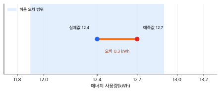
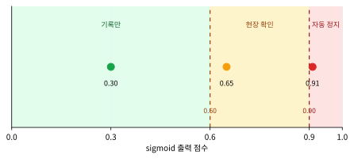
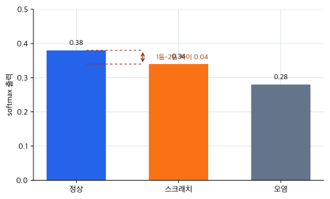

# P5-3.6 출력층(output layer)과 활성화의 선택

> Section ID: `P5-3.6`
> Version: `v2026.07.20`

P5-3.1에서는 활성화 함수(activation function)가 왜 필요한지 보았고, P5-3.2부터 P5-3.5까지는 sigmoid, tanh, ReLU와 대표 함수 수식 비교를 따로 보았습니다. 여기까지 오면 다음 질문이 자연스럽게 생깁니다.

은닉층에서는 ReLU 같은 함수를 많이 쓴다고 했는데, 마지막 출력층에서는 어떤 활성화를 써야 하는가?

이 질문은 곧바로 손실 함수(loss function)와 연결됩니다. 따라서 이 절은 활성화 함수 장의 마무리이면서, 다음 장으로 넘어가기 위한 다리 역할을 합니다.

출력층의 활성화는 모델이 무엇을 예측하는지에 따라 달라지며, 출력값이 어떤 의미를 가져야 하는지에 맞추어 선택한다.

출력 해석과 활성화 선택의 기준이 다시 흐려지면 개념사전의 [출력(output)](../../../reference/concept-glossary-parts/11-chieut.md#output)과 [활성화 함수(activation function)](../../../reference/concept-glossary-parts/14-hieut.md#activation-function) 항목을 함께 다시 봅니다.

## 출력층 활성화를 고르는 질문

- 은닉층 활성화와 출력층 활성화는 왜 같은 문제로 다루지 않는가?
- 회귀(regression), 이진 분류(binary classification), 다중 분류(multiclass classification)에서는 출력층을 어떻게 읽는가?
- 출력층 활성화와 손실 함수는 왜 함께 생각해야 하는가?
- `확률처럼 보이는 출력`과 `점수(score)`를 어떻게 구분해야 하는가?

손실 함수 자체의 설계는 P5-4.1과 P5-4.2에서 이어서 다루고, calibration의 기초 읽기와 확률 출력 해석은 P4-6.4에서 다시 연결합니다. 즉, 이번 절은 출력층 활성화가 `마지막 숫자를 어떤 단위로 읽게 만드는가`를 먼저 닫는 자리입니다.

## 예측 대상과 손실 연결의 판단 기준

- 출력층 활성화의 선택이 `모델이 무엇을 예측하는가`와 연결된다는 점을 설명할 수 있습니다.
- 회귀, 이진 분류, 다중 분류에서 출력층을 다르게 읽을 수 있습니다.
- 출력층 활성화와 손실 함수가 따로 놀지 않는다는 점을 이해할 수 있습니다.
- 출력 형태에 따라 마지막 숫자를 어떤 단위로 읽어야 하는지 구분할 수 있습니다.

## 은닉층과 출력층은 왜 다르게 보아야 하나

은닉층(hidden layer)의 활성화는 주로 `표현을 더 풍부하게 만들기 위한 비선형성`과 관련됩니다. 반면 출력층(output layer)의 활성화는 `마지막 값이 어떤 의미를 가져야 하는가`와 더 직접적으로 연결됩니다.

즉:

- 은닉층 활성화는 내부 표현(representation)을 만드는 문제에 가깝고
- 출력층 활성화는 최종 출력의 해석(interpretation)을 정하는 문제에 가깝습니다

여기서는 다음 구분으로 이해하면 됩니다.

`은닉층은 복잡한 패턴을 만들기 위해 값을 바꾸고, 출력층은 그 값이 예측 결과로 어떤 뜻을 가져야 하는지 맞춘다.`

이 구분이 중요한 이유는 같은 활성화 함수라는 이름 아래에 역할이 섞이기 쉽기 때문입니다. 은닉층에서는 `더 복잡한 표현을 만들 수 있는가`가 중심 질문이지만, 출력층에서는 `이 숫자를 정답 후보로 어떻게 읽을 것인가`가 중심 질문이 됩니다. 따라서 출력층 선택은 내부 계산의 편의보다 예측 대상의 의미와 손실 해석에 더 직접적으로 묶여 있습니다.

## 출력층은 예측 대상에 맞추어 선택한다

모델이 예측하려는 대상이 다르면, 마지막에 필요한 출력 형식도 달라집니다.

예를 들어:

- 혼합 배치의 총 에너지 사용량처럼 연속값을 예측하면 숫자 하나를 그대로 내보내면 됩니다
- 새 경보를 즉시 정지할지 모니터링 유지할지 판단하면 0과 1 사이 값처럼 읽히는 출력이 필요할 수 있습니다
- 표면 검사 프레임이 정상, 미세 스크래치, 오염 중 무엇인지 고르면 여러 후보 중 하나를 비교하는 출력이 필요합니다

즉, 출력층은 단순히 `마지막 노드`가 아니라, `문제 정의가 출력값의 모양을 결정하는 자리`입니다.

## 회귀(regression)에서는 어떻게 읽나

회귀 문제에서는 예측값이 연속적인 수치입니다. 예를 들어:

- 다음 배치의 예상 에너지 사용량
- 압력 안정화 완료 시간
- 시간대별 냉각수 수요량

같은 값을 예측합니다.

이 경우에는 출력층에서 특별한 비선형 활성화를 쓰지 않고, 선형 출력(linear output)으로 두는 경우가 많습니다. 이유는 간단합니다. 예측해야 할 숫자를 불필요하게 0과 1 사이, 혹은 -1과 1 사이로 눌러 버리면 표현 범위가 오히려 제한되기 때문입니다.

`연속값을 그대로 예측해야 하면, 출력도 가능한 한 그대로 내보내는 편이 자연스럽다.`

## 이진 분류(binary classification)에서는 어떻게 읽나

이진 분류는 두 가지 중 하나를 고르는 문제입니다.

- 즉시 정지 / 모니터링 유지
- 재측정 필요 / 자동 통과
- 과열 위험 / 정상 상태

이 경우에는 sigmoid가 자주 등장합니다. sigmoid는 출력을 0과 1 사이로 눌러 주기 때문에, 독자 입장에서는 `확률처럼 읽히는 값`이라는 직관을 주기 쉽습니다.

하지만 여기서 주의할 점이 있습니다.

`sigmoid 출력은 확률처럼 해석되기 쉬운 값이지, 모든 맥락에서 완전한 확률 보장을 자동으로 뜻하는 것은 아니다.`

실무에서는 threshold(임계값) 정책이 뒤에 따라붙습니다. 예를 들어:

- 0.5 이상이면 양성
- 0.9 이상이면 차단
- 0.6 이상 0.9 미만이면 검토

처럼 서비스 정책이 함께 붙을 수 있습니다.

즉, 출력층의 숫자와 서비스의 최종 결정은 구분해야 합니다.

## 다중 분류(multiclass classification)에서는 어떻게 읽나

다중 분류는 후보가 셋 이상인 문제입니다.

- 정상 / 미세 스크래치 / 오염
- 압력 회복 / 냉각 불안정 / 센서 이상
- 초기 경고 / 현장 점검 / 생산 중단

이 경우에는 각 클래스(class)에 대한 점수(logit)를 만든 뒤, softmax를 통해 서로 비교 가능한 비율 형태로 바꾸는 구성이 자주 등장합니다.

여기서는 다음 감각으로 먼저 이해하면 됩니다.

- 각 클래스는 먼저 자기 점수를 가집니다
- softmax는 그 점수들을 함께 비교해 `어느 쪽이 상대적으로 더 큰가`를 드러냅니다

즉, 다중 분류는 각 출력이 서로 독립적으로만 해석되는 것이 아니라, `후보들 사이의 경쟁 구조`로 읽어야 합니다.

이를 아주 단순하게 그리면 다음과 같습니다.

```mermaid
--8<-- "assets/part-05/chapter-03/softmax-output-flow-ko.mmd"
```

이 도식은 다중 분류 출력층을 `점수를 만든 뒤 비교하는 구조`로 읽게 해 줍니다. softmax는 단순히 숫자를 예쁘게 바꾸는 것이 아니라, 여러 클래스 후보 사이에서 어느 쪽이 상대적으로 더 강한지를 드러내는 단계입니다.

## 점수(score), 로짓(logit), 확률처럼 보이는 값은 같은가

여기서 독자가 많이 헷갈리는 표현이 세 가지입니다.

- 점수(score)
- 로짓(logit)
- 확률처럼 보이는 출력

이 절에서는 다음 정도로 구분하면 충분합니다.

| 표현 | 독자용 설명 |
| --- | --- |
| 점수(score) | 모델 내부에서 비교를 위해 만든 값 |
| 로짓(logit) | softmax나 sigmoid에 넣기 전의 마지막 점수 |
| 확률처럼 보이는 출력 | sigmoid나 softmax를 거쳐 해석이 쉬워진 값 |

이 구분이 중요한 이유는 다음 장의 손실 함수와 직접 연결되기 때문입니다. 어떤 손실 함수는 로짓을 직접 받도록 설계되고, 어떤 손실 함수는 활성화된 출력을 가정하기도 합니다.

여기서는 `로짓은 아직 해석 전 점수`, `활성화 뒤 값은 사람이 읽기 쉬운 형태` 정도로 먼저 고정하면 됩니다. 이 구분이 없으면 같은 숫자라도 모델 내부 비교용 값인지, 확률처럼 읽어도 되는 값인지 섞어서 이해하기 쉽습니다.

## 출력층 활성화와 손실 함수는 왜 함께 보아야 하나

출력층 활성화만 따로 선택하면 설명이 반쯤 비게 됩니다. 손실 함수는 그 출력값이 `정답과 얼마나 어긋났는지`를 읽는 장치이기 때문입니다.

예를 들어:

- 회귀에서는 연속값 출력과 평균제곱오차(mean squared error)가 자연스럽게 연결되기 쉽고
- 이진 분류에서는 sigmoid와 binary cross-entropy가 자주 함께 언급되며
- 다중 분류에서는 softmax와 cross-entropy가 자주 함께 등장합니다

`출력층 활성화는 출력의 의미를 맞추고, 손실 함수는 그 의미를 기준으로 정답과의 차이를 읽는다.`

즉, 출력층과 손실 함수는 따로따로 외우기보다 `한 쌍의 설계`처럼 보는 편이 안전합니다.

## 사례 및 예시

### 사례 1. 가격 예측

혼합 배치의 최종 에너지 사용량을 예측한다고 생각해 봅시다. 이 장면에서 사람이 먼저 궁금해하는 것은 `이번 배치가 몇 kWh를 쓸 것인가`이지, 어느 사용량 구간에 속할 확률이 아닙니다. 즉, 출력은 12.5kWh 같은 연속값으로 남아 있어야 하고, 예측이 실제 사용량에서 얼마나 떨어졌는지를 바로 비교할 수 있어야 합니다.

사람은 이런 문제에서 보통 `얼마인가`를 바로 알고 싶어 하지, 먼저 확률 범주를 고르게 하지는 않습니다. 그래서 0과 1 사이 값으로 눌러 놓는 출력보다 사용량 숫자를 그대로 내보내는 쪽이 자연스럽습니다. 예를 들어 12.0kWh와 15.0kWh 중 어디에 더 가까운지가 중요하지, `고사용량 배치일 확률 0.8`처럼 우회된 값은 바로 쓰기 어렵습니다. 여기서 중요한 기준은 `어느 범주인가`가 아니라 `정답 숫자에서 얼마나 떨어졌는가`입니다. 이 경우에는 회귀 출력이 자연스럽습니다. 그래서 이 사례에서 확인해야 할 결과는 출력이 확률처럼 눌린 값이 아니라, 실제 사용량 차이를 바로 비교할 수 있는 연속값으로 유지되는가입니다.

| 사람이 먼저 하기 쉬운 오독 | 왜 덜 좋은가 | 더 나은 읽기 |
| --- | --- | --- |
| `12.7`을 보고 그냥 사용량이 큰 편인지 작은 편인지만 본다 | 회귀 출력의 핵심인 `정답과의 거리`를 놓친다 | 실제 정답이 `12.4`인지 `16.0`인지와 비교해 오차 크기를 먼저 본다 |
| `12.7`을 어떤 구간의 확률처럼 읽는다 | 연속값 예측 문제를 범주 문제로 잘못 바꿔 읽게 된다 | 숫자 자체를 예측값으로 읽고 허용 오차와 함께 판단한다 |

### 사례 2. 경보 차단 필터

라인 제어 시스템이 새 경보를 `즉시 정지`할지 `모니터링 유지`할지 가르는 장면을 떠올려 보겠습니다. 이때 운영자가 먼저 보는 기준은 `정확한 숫자`보다 `막아야 하나 통과시켜야 하나`입니다. 그래서 출력 0.91은 단순 소수값이 아니라 `즉시 정지 쪽 가능성이 높다`는 쪽으로 읽히는 점수입니다. 즉, 이 문제는 연속값 하나를 그대로 예측하는 문제보다 `두 선택지 사이에서 얼마나 강하게 기우는가`를 읽는 쪽에 가깝습니다. 예를 들어 0.91이면 바로 정지하고 0.55면 현장 검토로 보내는 식으로, 출력값 뒤에 운영 정책이 곧바로 붙기 쉽습니다. 여기서 중요한 점은 sigmoid 출력이 곧바로 최종 정책이 아니라는 것입니다.

하지만 실제 운영은 여기서 끝나지 않습니다. 예를 들어 0.91이면 자동 정지하고, 0.65면 현장 확인으로 보내고, 0.30이면 기록만 남기는 식으로 점수 뒤에 정책(policy)이 붙습니다. 그래서 이 사례에서 확인해야 할 결과는 같은 sigmoid 출력이라도 점수 해석과 실제 제어 처리 규칙이 서로 다른 단계로 운영되는가입니다.

0.91을 곧바로 `정지 결정`이라고 읽으면 모델 출력과 운영 정책을 한 덩어리로 묶게 됩니다. 출력층 해석에서는 0.91을 먼저 모델 출력으로 보고, 정지 여부는 그 뒤 정책 단계에서 정한다고 분리합니다. 같은 소수값이라도 설비마다 threshold가 다를 수 있으므로, sigmoid 점수 해석과 임계값 정책을 따로 보아야 합니다.

같은 sigmoid 출력이라도 어떤 오독은 비교적 덜 나쁘고, 어떤 오독은 더 위험합니다.

| 출력 장면 | 덜 나쁜 오독 | 더 위험한 오독 | 더 나은 읽기 |
| --- | --- | --- | --- |
| `0.55` | 양성 쪽이긴 하지만 아직 애매하다고 읽는다 | 곧바로 `자동 정지`라고 확정한다 | 모델 출력과 운영 threshold를 분리해 `현장 확인` 같은 중간 정책을 먼저 본다 |
| `0.91` | 강한 경고라고만 읽고 세부 정책은 나중에 본다 | `0.91` 자체가 정책이라고 생각해 설비별 기준 차이를 무시한다 | 강한 양성 점수이되, 자동 정지 기준이 실제로 어디에 놓였는지 같이 본다 |

### 사례 3. 품질 상태 분류

표면 검사 프레임을 `정상`, `미세 스크래치`, `오염`으로 자동 분류하는 모델을 생각해 봅시다. 사람은 먼저 `무슨 상태냐`처럼 하나의 이름만 보고 싶어 하지만, 모델은 `normal`, `scratch`, `contamination`처럼 여러 후보가 경쟁한 점수 묶음을 먼저 만듭니다. 여기서 중요한 것은 1등 이름 하나만이 아니라, 어떤 후보가 얼마나 앞서는가입니다.

예를 들어 `normal 0.70, scratch 0.20, contamination 0.10`처럼 나오면 사람은 `정상 쪽으로 가장 강하게 기울었다`고 읽을 수 있습니다. 반대로 `normal 0.38, scratch 0.34, contamination 0.28`처럼 비슷하게 나오면 정답을 하나 고르더라도 모델 확신이 높지 않다고 볼 수 있습니다. 사람은 처음에 1등 클래스 이름만 보면 충분하다고 느끼기 쉽지만, 실제로는 `다른 후보와 얼마나 차이가 나는가`도 함께 중요합니다. 예를 들어 자동 분류를 바로 확정할지 사람 검토로 넘길지 같은 운영 판단은 이 차이에 크게 의존할 수 있습니다. 이 경우에는 여러 클래스 점수를 함께 읽는 다중 분류 구조가 자연스럽습니다. 그래서 이 사례에서 확인해야 할 결과는 1등 클래스 이름만이 아니라, 다른 후보들과의 점수 차이까지 함께 남아 실제 자동 처리와 사람 검토 기준을 가를 수 있는가입니다.

| 출력 장면 | 사람이 먼저 하기 쉬운 판단 | 왜 부족한가 | 더 나은 읽기 |
| --- | --- | --- | --- |
| `normal 0.70, scratch 0.20, contamination 0.10` | `정상` 1등이니 바로 확정한다 | 이 경우는 크게 문제 없을 수 있지만, 왜 자동 확정이 가능한지 기준이 남지 않는다 | 1등 후보와 나머지 후보의 점수 차이가 충분히 크다는 점까지 함께 본다 |
| `normal 0.38, scratch 0.34, contamination 0.28` | `normal`이 1등이니 역시 정상으로 끝낸다 | 후보 간 차이가 좁아 모델 확신이 낮은데도 자동 확정해 버릴 수 있다 | 1등 이름보다 점수 차이 부족을 먼저 보고 사람 재검토 분기로 넘긴다 |

세 사례를 나란히 놓고 보면, 출력층 선택은 `마지막에 어떤 함수를 붙일까`보다 먼저 `마지막 숫자를 무엇으로 읽어야 하는가`를 정하는 문제입니다.

사례의 숫자를 그래프로 다시 고정하면 차이가 더 분명해집니다. 회귀에서는 예측값이 실제값에서 얼마나 떨어졌는지가 먼저 보입니다.



이진 분류에서는 `0.91` 같은 점수가 곧바로 정책 자체가 아니라, threshold 구간에 놓이는 모델 출력이라는 점이 드러납니다.



다중 분류에서는 1등 후보 이름만 보는 대신, 1등과 2등의 점수 차이가 얼마나 좁은지도 같이 보아야 합니다.



따라서 그래프에서 먼저 볼 것은 곡선 모양이나 막대의 장식이 아니라, `회귀는 거리`, `이진 분류는 threshold 위치`, `다중 분류는 후보 간 간격`이라는 해석 단위입니다.

| 문제 유형 | 사람이 먼저 보기 쉬운 결과 | 출력층이 실제로 남겨야 하는 해석 | 손실과 자연스럽게 연결될 출력 감각 |
| --- | --- | --- | --- |
| 회귀 | 얼마인가 같은 연속 숫자 | 실제 크기를 바로 비교할 수 있는 연속값 | 정답 숫자와의 거리 |
| 이진 분류 | 막을까 통과시킬까 같은 두 선택지 | 0~1 사이 점수와 그 뒤 정책 분리 | 양성 클래스 쪽 확신도 |
| 다중 분류 | 어떤 이름이 1등인가 | 후보들 사이의 상대 비교와 점수 차이 | 여러 후보 사이에서 정답 클래스가 얼마나 앞서는가 |

이 표에서 독자가 먼저 붙잡아야 할 결과는, 출력층 활성화 선택이 함수 이름 선택이 아니라 `정답과 비교할 마지막 출력의 뜻`을 먼저 고정하는 일이라는 점입니다.

## 연습 및 예제

같은 숫자처럼 보여도 출력층은 문제 유형마다 다르게 읽어야 합니다. 아래 세 장면을 한 번에 놓고 보면 그 차이가 더 분명해집니다.

| 문제 유형 | 모델의 마지막 출력 | 먼저 읽어야 할 단위 | 손실이 먼저 비교할 것 |
| --- | --- | --- | --- |
| 회귀 | `예측 사용량 = 12.7kWh`, 정답 `12.4kWh` | 정답 숫자와의 거리 | 예측값과 정답값의 오차 |
| 이진 분류 | `sigmoid output = 0.881`, 정답 `양성` | threshold 구간과 정책 분리 | 양성 정답에 얼마나 강하게 기우는가 |
| 다중 분류 | `normal 0.214, scratch 0.713, contamination 0.072`, 정답 `scratch` | 1등 후보와 나머지 후보의 점수 차이 | 정답 클래스가 다른 후보보다 얼마나 앞서는가 |

이 표에서 먼저 봐야 할 것은 `출력값 모양`과 `정답 비교 방식`이 같이 정해진다는 점입니다. 회귀는 숫자를 그대로 두고 정답과의 거리를 봅니다. 이진 분류는 0과 1 사이 점수로 읽고, 그 점수가 정답 클래스 쪽으로 얼마나 기우는지 봅니다. 다중 분류는 1등 이름만이 아니라 정답 클래스가 다른 후보보다 얼마나 앞서는지까지 함께 봅니다.

같은 장면을 조금씩 바꾸면 무엇을 먼저 다시 읽어야 하는지도 드러납니다.

| 바뀐 출력 장면 | 다시 먼저 읽어야 할 기준 | 바로 떠올릴 질문 |
| --- | --- | --- |
| 회귀 출력이 `12.7`에서 `13.2`로 바뀐다 | 숫자의 절대 크기보다 정답과의 거리 | 정답 `12.4`에서 더 멀어졌는가 |
| 이진 분류 출력이 `0.881`에서 `0.61`로 내려온다 | 정책 threshold와 점수 기울기 | 자동 차단에서 현장 확인 구간으로 내려오는가 |
| 다중 분류 출력이 `0.38, 0.34, 0.28`처럼 가까워진다 | 1등 이름보다 후보 간 간격 | 자동 확정보다 재검토가 더 안전한가 |

이 연습에서는 다음 세 질문을 직접 닫아야 합니다.

1. 왜 회귀 출력 `12.7`은 sigmoid나 softmax처럼 눌러 읽지 않고, 정답 `12.4`와의 거리로 먼저 읽어야 하는가?
2. 왜 이진 분류 출력 `0.881`은 곧바로 정책 자체가 아니라, threshold 위에 놓인 모델 출력으로 먼저 읽어야 하는가?
3. 왜 다중 분류에서 `scratch`가 1등이라는 사실만으로 끝내지 않고, 다른 후보와 얼마나 벌어졌는지까지 같이 봐야 하는가?

정답 방향은 분명합니다. 회귀에서는 마지막 숫자 자체가 예측값이므로 손실도 그 숫자가 정답에서 얼마나 벗어났는지를 먼저 봅니다. 이진 분류에서는 sigmoid 출력이 양성 클래스 쪽 기울기를 보여 주므로, 손실도 정답이 양성인지 음성인지에 따라 그 점수를 읽습니다. 다중 분류에서는 후보들이 함께 경쟁하므로, 손실도 정답 클래스가 다른 후보보다 충분히 앞서는지와 연결됩니다.

따라서 이 절의 연습에서 독자가 먼저 남겨야 할 결과는 `어떤 활성화를 썼는가`보다 `마지막 숫자를 어떤 단위로 읽고, 손실은 그 숫자의 무엇을 비교하게 되는가`입니다.

초기 신경망과 통계적 분류 모델의 교육 흐름에서는 `마지막 출력을 어떻게 읽을 것인가`가 오래전부터 중요한 주제였습니다. 로지스틱 회귀(logistic regression)와 sigmoid의 연결, 다중 클래스 확률 해석, 손실 함수와의 결합은 딥러닝 이전부터 이어져 온 질문입니다.

딥러닝 커리큘럼에서 이 절이 필요한 이유도 여기에 있습니다.

- 활성화 함수를 은닉층의 비선형성으로만 보면
- 왜 마지막 출력이 문제에 따라 달라져야 하는지 놓치기 쉽고
- 손실 함수 장으로 넘어갈 때 갑자기 수식만 남게 됩니다

따라서 이 절은 다음 장의 손실 함수가 `갑자기 등장하는 규칙`이 아니라, `출력 해석과 연결된 설계`라는 점을 보여 주는 준비 절입니다.

## 언제 출력층 해석을 먼저 분리해서 보는가

은닉층 활성화 설명을 마친 뒤에는 `마지막 숫자가 무엇을 뜻해야 하는가`를 따로 분리해서 봐야 합니다. 이 절은 바로 그 전환 지점을 맡습니다.

먼저 문제 유형을 묻습니다. 연속값이면 마지막 숫자를 그대로 예측값으로 읽고, 둘 중 하나를 고르는 문제라면 0~1 사이 점수와 threshold 정책을 함께 봅니다. 여러 클래스가 경쟁한다면 1등 이름만 보지 말고 후보 점수와 점수 차이를 같이 읽습니다. 이 해석이 정해진 뒤에야 손실 함수가 `정답과 얼마나 어긋났는가`를 읽을 기준도 정해집니다.

```mermaid
--8<-- "assets/part-05/chapter-03/output-activation-decision-flow-ko.mmd"
```

이 흐름에서 특히 조심할 지점은 서비스 정책과 모델 점수를 섞어 읽는 경우입니다. 모델 출력은 `정답과 비교할 마지막 값`이고, 자동 차단, 현장 확인, 사람 재검토 같은 운영 결정은 그 다음 단계입니다. 출력층 해석을 먼저 분리해야 P5-4장의 손실 함수와 평가 기준도 같은 단위로 이어집니다.

## 체크리스트

- 출력층 활성화 선택이 예측 대상 의미와 연결된다는 점을 설명할 수 있는가?
- 은닉층 활성화와 출력층 활성화가 왜 같은 문제로 다뤄지지 않는지 말할 수 있는가?
- 은닉층 활성화와 출력층 활성화는 역할이 다르다는 점을 설명할 수 있는가?
- 출력층 활성화는 문제 유형과 출력 해석에 맞추어 선택해야 한다는 점을 말할 수 있는가?
- 회귀, 이진 분류, 다중 분류에서 출력값을 각각 어떻게 해석해야 하는지 말할 수 있는가?
- 출력층 활성화와 손실 함수는 함께 설계해야 자연스럽다는 점을 설명할 수 있는가?
- 같은 활성화 함수라는 이유로 은닉층과 출력층을 같은 방식으로 설명하고 있을 때, 출력 해석 문제를 따로 분리해 떠올릴 수 있는가?
- sigmoid나 softmax 출력이 곧바로 서비스 정책이라고 오해하기 쉬울 때, 모델 점수와 운영 결정을 분리하는 관점을 꺼낼 수 있는가?

## 출처와 참고 자료

- Ian Goodfellow, Yoshua Bengio, Aaron Courville, `Deep Learning`, MIT Press, 2016, 확인 날짜: 2026-06-29. [https://www.deeplearningbook.org/](https://www.deeplearningbook.org/){: target="_blank" rel="noopener noreferrer" }
- Christopher M. Bishop, `Pattern Recognition and Machine Learning`, Springer, 2006, 확인 날짜: 2026-07-19. [https://link.springer.com/book/9780387310732](https://link.springer.com/book/9780387310732){: target="_blank" rel="noopener noreferrer" }
- Kevin P. Murphy, `Probabilistic Machine Learning: An Introduction`, MIT Press, 2022, 확인 날짜: 2026-07-19. [https://probml.github.io/pml-book/book1.html](https://probml.github.io/pml-book/book1.html){: target="_blank" rel="noopener noreferrer" }
