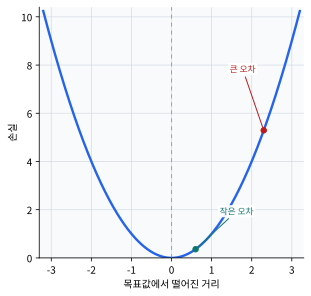
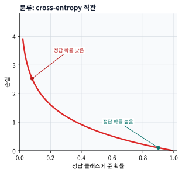
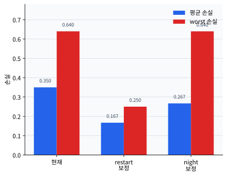

# P5-4.1 손실 함수(loss function)

> Section ID: `P5-4.1`
> Version: `v2026.07.31`

P5-3장에서는 활성화 함수(activation function)가 신경망에 비선형성(nonlinearity)을 넣어 표현력을 키운다는 점을 보았습니다. 이제 다음 질문이 바로 이어집니다.

그렇다면 신경망은 현재 출력이 얼마나 틀렸는지 무엇으로 판단하는가?

이 질문에 답하는 기준이 손실 함수(loss function)입니다.

손실 함수는 모델의 현재 출력이 목표와 얼마나 어긋나는지를 하나의 숫자로 만드는 규칙이다.

다만 교재나 프레임워크 문서에서는 `loss`와 `objective` 또는 `cost`를 조금 더 나누어 부르기도 합니다. 흔히 `loss`는 샘플별 어긋남이나 그 평균을 가리키고, 실제로 최소화하는 전체 대상은 배치 평균과 정규화(regularization)를 함께 포함한 `objective/cost`로 설명합니다. 이 절에서는 초심자 흐름을 위해 우선 `손실`이라는 이름으로 묶어 설명하되, 뒤 절에서 gradient와 optimizer를 연결할 때는 `실제로 무엇을 최소화하는가`를 다시 짚습니다.

손실의 역할을 뒤 절에서 다시 짧게 확인해야 할 때는 개념사전의 [손실 함수(loss function)](../../../reference/concept-glossary-parts/07-siot.md#loss-function), [평가 지표(metric)](../../../reference/concept-glossary-parts/13-pieup.md#evaluation-design), [제곱 오차(squared error)](../../../reference/concept-glossary-parts/07-siot.md#loss-function), [교차 엔트로피(cross-entropy)](../../../reference/concept-glossary-parts/01-giyeok.md#cross-entropy) 항목으로 돌아옵니다.

여기서는 다음 세 문장을 먼저 고정하면 됩니다.

- 출력만 보고서는 아직 학습이 시작되지 않습니다.
- 틀림을 숫자로 바꿔야 다음 계산이 이어집니다.
- 그 숫자가 바로 손실(loss)입니다.

## 손실 함수가 필요한 질문

- 손실(loss)은 무엇을 숫자로 만들고 있는가?
- 왜 딥러닝에서 손실 함수가 중심 기준이 되는가?
- 손실 함수와 평가 지표(metric)는 어떻게 다른가?
- 손실 값이 작아진다는 것은 학습에서 어떤 뜻인가?

구체적인 손실 함수 종류와 문제별 차이는 P5-4.2에서 이어서 다루고, 미분과 gradient 계산이 실제로 어떻게 역전파로 이어지는지는 P5-5.1, P5-5.2에서 다시 봅니다. 즉, 이번 절은 손실이 `예측과 목표의 어긋남을 학습 가능한 숫자`로 바꾸는 역할을 먼저 붙잡는 자리입니다.

## 오차를 숫자로 읽는 판단 기준

- 손실 함수를 `현재 예측의 틀림을 숫자로 만드는 기준`으로 설명할 수 있습니다.
- 손실 함수와 평가 지표를 구분할 수 있습니다.
- 학습에서 손실을 줄인다는 말이 무엇을 뜻하는지 설명할 수 있습니다.
- 예측값과 목표값의 차이가 어떤 오답을 먼저 크게 고치게 만드는지 설명할 수 있습니다.

## 왜 손실 함수가 필요한가

신경망은 출력을 만듭니다. 하지만 출력만으로는 아직 학습이 일어나지 않습니다. 모델이 스스로 물을 수 있어야 합니다.

`지금 결과가 얼마나 나쁜가?`

이 질문을 숫자로 바꾸지 않으면 다음 단계가 불가능합니다.

- 가중치를 어느 방향으로 바꿔야 하는지 모릅니다.
- 현재 모델이 이전보다 나아졌는지 모릅니다.
- 여러 출력 후보 중 무엇이 더 나쁜지도 비교하기 어렵습니다.

즉, 손실 함수는 신경망이 자기 결과를 점검하는 기준점입니다.

여기서는 이 장면을 다음처럼 바꾸어 말할 수 있습니다.

`손실이 없으면 모델은 지금이 나아졌는지 나빠졌는지 스스로 비교할 수 없다.`

## 손실(loss)은 무엇을 재나

손실(loss)은 보통 다음 두 대상을 비교합니다.

- 모델이 만든 현재 출력(prediction)
- 우리가 기대하는 목표(target)

다음처럼 이해하면 충분합니다.

`손실은 예측과 목표 사이의 어긋남을 하나의 숫자로 압축한 것이다.`

예를 들어:

- 정답이 10인데 예측이 9면 손실은 비교적 작을 수 있습니다.
- 정답이 10인데 예측이 2면 손실은 더 클 수 있습니다.

즉, 손실은 단순히 맞았다/틀렸다가 아니라 `얼마나 어긋났는가`를 더 연속적인 숫자로 읽게 해 줍니다.

여기서 독자가 자주 얻는 중요한 감각은 다음입니다.

- 분류든 회귀든 손실은 `틀림의 정도`를 다룹니다.
- 손실은 보통 `0 아니면 1`처럼 끊긴 판정보다 더 부드러운 숫자를 제공합니다.
- 바로 그 점 때문에 뒤에서 gradient를 계산할 수 있습니다.

이 흐름을 아주 짧게 압축하면 다음과 같습니다.

```mermaid
--8<-- "assets/part-05/chapter-04/loss-role-flow-ko.mmd"
```

이 도식에서 먼저 확인할 결과는, 손실이 단순히 `나쁜 점수`가 아니라 `예측과 목표의 차이를 다음 업데이트로 넘기는 연결 지점`이라는 점입니다.

## Part 4의 metric과는 어떻게 다른가

Part 4에서 우리는 accuracy, precision, recall, F1, RMSE 같은 평가 지표(metric)를 보았습니다. 여기서 손실 함수와 평가 지표를 같은 것으로 이해하기 쉽습니다.

하지만 두 개는 역할이 다릅니다.

| 구분 | 손실 함수(loss function) | 평가 지표(metric) |
| --- | --- | --- |
| 주 역할 | 학습을 위한 내부 기준 | 평가와 선택을 위한 기준 |
| 사용 시점 | 학습 과정에서 계속 사용 | 학습 중간 점검, early stopping, 최종 평가 |
| 질문 | 지금 얼마나 틀렸는가? | 실제로 얼마나 잘했는가? |

즉, 손실 함수는 모델이 배우는 기준이고, metric은 모델을 평가하고 선택하는 기준이라고 먼저 구분하면 좋습니다.

물론 둘이 완전히 분리된 것은 아닙니다. 좋은 손실 설계는 보통 우리가 관심 있는 성능 방향과 어느 정도 연결되어야 합니다. 하지만 둘은 역할이 같지 않습니다.

## 왜 손실은 하나의 숫자로 모이나

신경망은 수많은 파라미터(parameter)를 가집니다. 그 파라미터를 바꾸려면 현재 상태를 하나의 비교 가능한 기준으로 모아야 합니다.

예를 들어 샘플 여러 개에 대해:

- 어떤 예측은 조금 틀리고
- 어떤 예측은 많이 틀리고
- 어떤 예측은 거의 맞을 수 있습니다

이 상태를 그대로 두면 업데이트 방향을 정하기 어렵습니다. 그래서 손실 함수는 여러 어긋남을 하나의 숫자처럼 모읍니다. 실제 학습 코드에서는 이 숫자를 배치(batch) 평균이나 합으로 줄이고, 때로는 정규화 항까지 더해 전체 목적함수(objective/cost)로 만든 뒤 최적화합니다.

즉, 손실 함수는 학습 과정의 `나침반 숫자` 역할을 합니다.

독자용 한 문장으로 더 줄이면 다음처럼 기억할 수 있습니다.

`손실은 지금 모델이 어느 방향으로 잘못 가고 있는지를 한 숫자로 압축한 신호다.`

## 손실이 줄어든다는 것은 무엇을 뜻하나

여기서는 다음 문장으로 설명할 수 있습니다.

`손실이 줄어든다는 것은, 현재 모델이 학습 데이터 기준으로 목표와의 어긋남을 덜 만들고 있다는 뜻이다.`

하지만 여기서도 조심할 점이 있습니다.

- 학습 손실(training loss)이 줄었다고 해서
- 바로 일반화(generalization)가 좋아졌다고 단정할 수는 없습니다.

이 점은 Part 4의 과적합(overfitting)과 일반화 설명과 그대로 이어집니다. 즉, 손실은 매우 중요하지만, 손실 하나만으로 모델 전체를 판정할 수는 없습니다.

## 손실 함수: 확인할 판단 기준

이 사례를 읽을 때는 다음 두 가지를 먼저 확인한다.

- 손실 함수가 무엇을 더 크게 고쳐야 하는지 알려 주는 신호라는 점을 설명하는지 확인한다.
- 이어지는 사례에서 입력, 비교 기준, 출력, 한계가 제목의 판단 기준과 어떻게 연결되는지 확인한다.

### 사례 1. 배치 에너지 사용량 예측

혼합 배치 하나의 총 에너지 사용량을 예측한다고 생각해 봅니다. 실제 사용량이 5.0kWh인데 모델 예측 A가 4.8kWh, 모델 예측 B가 2.0kWh라면, 사람은 먼저 `어느 쪽이 실제 사용량에 더 가까운가`를 봅니다. 이 기준만으로도 예측 A가 예측 B보다 덜 틀렸다는 점은 바로 알 수 있습니다. 하지만 학습은 이런 판단을 모든 샘플에서 같은 규칙으로 반복해야 하므로, `조금 빗나감`과 `많이 빗나감`을 일관된 숫자로 바꿔야 합니다. 손실 함수는 바로 그 차이를 학습에 쓰기 좋은 숫자로 바꾸어, 어떤 예측이 더 나쁘고 어떤 예측이 덜 나쁜지 비교 가능하게 만듭니다. 즉, 회귀 문제에서는 `틀렸는가`보다 `얼마나 멀리 빗나갔는가`를 숫자로 만드는 일이 먼저입니다.

| 비교 항목 | 예측 A | 예측 B | 지금 읽어야 할 핵심 |
| --- | --- | --- | --- |
| 실제 사용량과의 차이 | `5.0 - 4.8 = 0.2` | `5.0 - 2.0 = 3.0` | 둘 다 오답이지만 빗나간 정도는 전혀 같지 않습니다. |
| 사람이 먼저 보기 쉬운 판단 | 거의 맞음 | 많이 틀림 | 직관적으로는 구분되지만, 학습에는 이 차이를 반복 가능한 숫자로 남겨야 합니다. |
| 손실 관점 | 작은 벌점 | 큰 벌점 | 손실 함수는 `덜 나쁜 오답`과 `훨씬 더 나쁜 오답`을 숫자로 벌려 줍니다. |

같은 차이를 제곱 오차(squared error)처럼 가장 단순한 규칙으로 읽어 보면 손실이 왜 벌어지는지도 바로 확인할 수 있습니다.

| 손실 계산 예시 | 예측 A | 예측 B | 지금 확인할 결과 |
| --- | --- | --- | --- |
| 오차(error) | `4.8 - 5.0 = -0.2` | `2.0 - 5.0 = -3.0` | 방향은 둘 다 `실제보다 낮게 예측`이지만 크기가 크게 다릅니다. |
| 제곱 오차 | `(-0.2)^2 = 0.04` | `(-3.0)^2 = 9.0` | B의 손실은 A보다 훨씬 크게 벌어집니다. |
| 업데이트 신호 해석 | 조금만 조정하면 되는 상태 | 크게 수정해야 하는 상태 | 손실 숫자가 커질수록 `어느 예측을 더 강하게 고쳐야 하는가`가 분명해집니다. |

| 사람이 먼저 보기 쉬운 기준 | 손실 관점으로 다시 읽는 기준 |
| --- | --- |
| 둘 다 정답은 아니라고만 본다 | 같은 오답이라도 얼마나 멀리 빗나갔는지 숫자로 더 벌려 봐야 한다 |
| A가 B보다 낫다는 감각만 갖는다 | 그 감각을 모든 샘플에 반복 적용할 수 있는 손실 숫자로 바꿔야 한다 |
| 회귀에서는 맞음/틀림보다 근사치면 충분하다고 느끼기 쉽다 | 학습은 `얼마나 가까운가`를 연속값으로 읽어야 업데이트 방향이 생긴다 |

이 사례에서 최종적으로 확인해야 할 결과는 명확합니다. 두 예측이 모두 오답이어도 손실은 `둘 다 틀림`에서 멈추지 않고, B처럼 더 멀리 빗나간 예측에 훨씬 큰 숫자를 주어 먼저 더 강하게 고치게 만듭니다.

### 사례 2. 검사 상태 분류

분류 문제도 비슷합니다. 정답이 `미세 스크래치`인데 모델 출력 A가 `정상 0.51, 미세 스크래치 0.49`, 모델 출력 B가 `정상 0.99, 미세 스크래치 0.01`이라고 해 봅시다.

사람은 둘 다 `틀렸다`고 말하고 넘어가기 쉽습니다. 하지만 학습 관점에서는 두 오답이 같은 무게일 수 없습니다. A는 거의 맞힐 뻔했고, B는 매우 자신 있게 반대로 판단했습니다. 그래서 손실 함수는 `얼마나 자신 있게 틀렸는가`까지 반영해, 같은 오답이라도 더 강하게 수정해야 할 경우를 구분합니다. 즉, 분류 문제에서는 단순 오답 여부보다 `모델이 어떤 확신으로 틀렸는가`도 함께 중요해집니다. 그래서 이 사례에서 확인해야 할 결과는 둘 다 오답이어도, 자신 있게 반대로 예측한 B 쪽이 손실에서 더 크게 벌점을 받는가입니다.

| 비교 항목 | 출력 A | 출력 B | 지금 읽어야 할 핵심 |
| --- | --- | --- | --- |
| 예측 라벨 | `정상` | `정상` | 둘 다 최종 라벨만 보면 같은 오답입니다. |
| 정답 `미세 스크래치` 확률 | `0.49` | `0.01` | A는 거의 맞힐 뻔했지만, B는 정답 가능성을 거의 주지 않았습니다. |
| 사람이 먼저 보기 쉬운 판단 | 틀림 | 틀림 | 맞다/틀리다만 보면 둘의 차이가 사라집니다. |
| 손실 관점 | 작은 벌점에 가까운 오답 | 훨씬 큰 벌점의 오답 | 손실은 `같은 오답` 안에서도 정답 확률 차이를 더 크게 벌려 읽습니다. |

cross-entropy를 자세히 유도하지 않더라도, `정답에 준 확률이 낮을수록 손실이 커진다`는 예시는 바로 확인할 수 있습니다.

| 손실 계산 예시 | 출력 A | 출력 B | 지금 확인할 결과 |
| --- | --- | --- | --- |
| 정답 `미세 스크래치` 확률 | `0.49` | `0.01` | 손실은 정답 클래스에 얼마나 확률을 주었는지를 직접 봅니다. |
| cross-entropy 손실 예시 `-log(p)` | `-log(0.49) ≈ 0.713` | `-log(0.01) ≈ 4.605` | B의 손실이 A보다 훨씬 큽니다. |
| 업데이트 신호 해석 | 경계만 조금 조정하면 될 수 있는 상태 | 정답 방향으로 크게 수정해야 하는 상태 | `자신 있게 틀림`일수록 더 강한 수정 신호가 생깁니다. |

두 사례를 그래프 모양으로 다시 보면, 회귀 손실은 목표값에서 멀어질수록 커지고, 분류 손실은 정답 클래스에 준 확률이 낮을수록 커집니다.





이 두 그래프의 목적은 공식을 외우는 것이 아니라, `어떤 축에서 멀어질 때 손실이 커지는가`를 보는 데 있습니다. 회귀에서는 목표값과의 거리, 분류에서는 정답 클래스에 준 확률이 핵심 축입니다.

| 사람이 먼저 보기 쉬운 기준 | 손실 관점으로 다시 읽는 기준 |
| --- | --- |
| 둘 다 틀렸으니 같은 오답이라고 본다 | 정답에서 얼마나 멀고, 얼마나 자신 있게 틀렸는지를 함께 본다 |
| 0.51과 0.99는 둘 다 `정상` 예측이라고만 읽는다 | A는 거의 맞힐 뻔한 오답, B는 강하게 잘못 확신한 오답으로 구분한다 |
| 맞다/틀리다 두 단계면 충분하다고 느끼기 쉽다 | 손실은 오답의 `정도`를 숫자로 더 세밀하게 구분한다 |

이 사례에서 최종적으로 확인해야 할 결과도 분명합니다. 분류에서는 같은 오답이어도, B처럼 정답 클래스에 거의 확률을 주지 않은 예측이 훨씬 큰 손실을 받아 먼저 더 강하게 수정됩니다.

이 두 사례가 함께 보여 주는 핵심은 같습니다. 회귀에서는 `얼마나 멀리 빗나갔는가`, 분류에서는 `얼마나 자신 있게 틀렸는가`가 손실 숫자에서 더 크게 반영되어야 다음 업데이트가 더 정확해집니다.

이 두 사례를 한 줄로 묶으면 손실 함수의 공통 역할은 같습니다.

`모델의 현재 어긋남을 학습 가능한 숫자로 만드는 일`

그리고 이 절에서는 여기서 한 걸음 더 나가, `왜 손실이 metric과 별개로 필요하다고 말하는가`까지 사례 수준에서 닫아야 합니다.

| 문제 유형 | 사람이 먼저 보기 쉬운 결과 | metric 또는 단순 판정만 보면 | 손실이 추가로 드러내는 것 | 더 먼저 고쳐야 하는 예측 |
| --- | --- | --- | --- | --- |
| 배치 에너지 사용량 예측 | A가 B보다 실제 사용량에 더 가깝습니다. | 둘 다 오답이라는 사실만으로는 수정 우선순위가 충분히 보이지 않습니다. | B가 A보다 훨씬 멀리 빗나가 손실이 크게 벌어집니다. | 예측 B |
| 검사 상태 분류 | A와 B 모두 `정상`이라고 예측해 틀렸습니다. | accuracy만 보면 둘 다 `0`으로 같아 보일 수 있습니다. | B는 정답 `미세 스크래치`에 거의 확률을 주지 않아 손실이 훨씬 큽니다. | 출력 B |

이 표가 보여 주는 핵심은 단순합니다. metric이나 최종 정답 여부만 보면 같은 오답처럼 보이는 경우에도, 손실은 `어느 오답이 더 위험하고 먼저 크게 수정되어야 하는가`를 더 세밀하게 구분합니다.

```mermaid
--8<-- "assets/part-05/chapter-04/loss-vs-metric-case-flow-ko.mmd"
```

이 흐름에서 독자가 최종적으로 붙잡아야 할 결과는, 손실이 `정답/오답` 뒤에 붙는 보조 점수가 아니라 `업데이트 우선순위`를 정하는 숫자라는 점입니다.

머신러닝과 딥러닝 교육에서 손실 함수가 초반부에 반드시 나오는 이유는, 학습이 단순한 규칙 반복이 아니라 `최적화(optimization)` 문제이기 때문입니다.

딥러닝의 핵심 흐름은 보통 다음처럼 이어집니다.

> 입력을 넣는다
> -> 출력을 만든다
> -> 손실을 계산한다
> -> 손실을 줄이는 방향으로 파라미터를 바꾼다

즉, 손실 함수는 출력 뒤에 붙는 부가 옵션이 아니라, 학습 계산 전체를 시작시키는 기준입니다.

커리큘럼 관점에서도 손실 함수를 먼저 이해해야:

- 역전파(backpropagation)가 왜 필요한지
- 옵티마이저(optimizer)가 무엇을 줄이려 하는지
- 학습률(learning rate)이 어떤 숫자를 따라 움직이는지

를 자연스럽게 읽을 수 있습니다.

## 연습 및 예제

이번 연습의 목표는 예측값과 목표값의 차이가 손실 숫자로 바뀌는 가장 단순한 과정을 읽는 것입니다. 평균 손실만 보는 대신, 샘플별 오차가 어느 항목에서 크게 났는지도 함께 확인합니다.

입력:

- 목표값 3개
- 예측값 3개

출력:

- 각 샘플의 제곱 오차
- 가장 크게 틀린 샘플
- 평균 손실

문제 상황:

- 손실 함수는 최종 평균값만 보지 말고 샘플별 오차가 어떻게 쌓이는지도 같이 확인해야 한다

확인할 개념:

- 평균 손실은 각 샘플 오차를 모아 만든 숫자다
- 가장 크게 틀린 샘플을 찾으면 손실이 왜 커졌는지 더 쉽게 해석할 수 있다

입력(input):

위에 정리한 샘플별 목표값과 예측값을 사용합니다.

표를 보기 전에 먼저 어떤 샘플이 평균 손실을 가장 크게 끌어올릴지 예상해 보면 좋습니다.

| 샘플 | 먼저 예상해 볼 손실 크기 | 예상 이유 |
| --- | --- | --- |
| `night_shift_batch` | 중간 | 목표 3.0과 예측 2.5 차이가 0.5라서 완전히 작지는 않습니다. |
| `stabilized_batch` | 가장 작음 | 목표 1.0과 예측 1.4 차이가 0.4로 세 샘플 중 가장 작습니다. |
| `restart_delay_batch` | 가장 큼 | 목표 2.0과 예측 1.2 차이가 0.8로 가장 크게 벌어져 있습니다. |

이 표의 목적은 정확한 제곱 오차를 미리 계산하는 것보다, `평균 손실은 샘플별 오차가 똑같이 생기는 것이 아니라 더 크게 틀린 항목에 더 많이 끌린다`는 점을 먼저 붙잡는 데 있습니다.

같은 세 배치를 손실 관점으로 정리하면 다음처럼 읽을 수 있습니다.

| 샘플 | target | prediction | squared error | 지금 읽어야 할 결과 |
| --- | --- | --- | --- | --- |
| `night_shift_batch` | `3.0` | `2.5` | `0.25` | 경미한 수정이 필요하지만 최우선 worst case는 아닙니다. |
| `stabilized_batch` | `1.0` | `1.4` | `0.16` | 세 배치 중 가장 덜 틀려 손실 기여가 가장 작습니다. |
| `restart_delay_batch` | `2.0` | `1.2` | `0.64` | 평균 손실을 가장 크게 끌어올리는 핵심 오답입니다. |

이 세 값을 평균으로 모으면 `mean_loss = 0.35`가 되고, 가장 크게 빗나간 배치는 `restart_delay_batch`로 읽힙니다.

이 연습에서 중요한 것은 `0.35`라는 평균 손실 숫자가 어떻게 만들어졌는가입니다.

- 첫 번째 샘플은 조금 틀렸고
- 두 번째 샘플도 조금 틀렸고
- 세 번째 샘플은 더 많이 틀렸습니다

손실 함수는 이런 어긋남들을 하나의 숫자로 모아, 모델이 지금 얼마나 나쁜 상태인지 읽게 해 줍니다. 동시에 샘플별 오차를 보면 어떤 사례가 평균 손실을 가장 크게 끌어올리는지도 확인할 수 있습니다.

이 예제에서 독자가 꼭 읽어야 할 것은 다음입니다.

- 샘플마다 틀린 정도가 다릅니다.
- 손실 함수는 그 차이를 버리지 않고 숫자로 반영합니다.
- 여러 샘플의 틀림을 모아 하나의 평균 기준으로 만들 수 있습니다.

하지만 여기서 멈추면 아직 `평균 손실 숫자를 봤다` 수준에 머뭅니다. 손실 예제는 `어느 샘플을 먼저 더 크게 고쳐야 하는가`까지 바로 읽혀야 합니다.

| 출력 신호 | 덜 나쁜 읽기 | 더 위험한 읽기 | 지금 더 나은 다음 판단 |
| --- | --- | --- | --- |
| `mean_loss = 0.35` | 현재 세 샘플의 어긋남이 평균적으로 이 정도라고 본다 | `0.35`만 보고 어느 샘플을 고쳐야 하는지 판단이 끝났다고 본다 | 평균값은 전체 상태 요약일 뿐이고, 샘플별 오차 분해를 같이 봐야 업데이트 우선순위가 보인다고 읽는다 |
| `worst_sample = restart_delay_batch` | 세 샘플 중 `restart_delay_batch`가 평균 손실을 가장 크게 끌어올린다고 본다 | `restart_delay_batch` 하나만 이상치처럼 버리면 된다고 본다 | `restart_delay_batch`가 왜 크게 빗나갔는지 입력 특성과 출력 경향을 다시 확인해, 우선 수정해야 할 예측 유형으로 읽는다 |
| `night_shift_batch=0.25`, `stabilized_batch=0.16`, `restart_delay_batch=0.64` 비교 | 셋 다 오차가 있지만 크기가 다르다고 본다 | 셋 다 오답이니 비슷한 비중으로 고치면 된다고 본다 | 같은 오답이라도 `restart_delay_batch`처럼 더 크게 틀린 항목이 평균 손실과 다음 업데이트를 더 강하게 끌어간다고 읽는다 |

이 표까지 읽고 나면, 손실 함수가 `평균 숫자 하나를 계산하는 절차`가 아니라 `더 먼저 크게 수정해야 할 오답을 가려내는 기준`이라는 점이 더 분명해집니다.

학습 관점에서는 여기서 한 단계 더 나가야 합니다. 독자가 직접 말할 수 있어야 하는 문장은 `평균 손실이 줄어드는가`만이 아니라 `어느 배치가 계속 worst case로 남는가`, `그 배치가 어떤 입력 구간의 약점을 대표하는가`입니다. 손실 함수는 숫자를 요약하는 규칙이면서 동시에 수정 우선순위를 붙이는 규칙이기 때문입니다.

| 바꿔 보며 다시 읽을 축 | 같이 달라질 손실 해석 | 지금 떠올릴 질문 |
| --- | --- | --- |
| `restart_delay_batch`의 prediction을 `1.2`에서 `1.7`로 올린다 | worst case가 완화되며 평균 손실도 함께 내려갑니다. | 현재 모델의 가장 큰 약점이 실제로 줄어들었는가 |
| `night_shift_batch`와 `stabilized_batch` 오차만 줄인다 | 평균은 조금 내려가도 worst case가 그대로 남을 수 있습니다. | 평균 개선이 핵심 오류 구간 개선까지 뜻하는가 |
| 샘플 수가 더 많아진다 | 평균 손실 하나만으로는 어떤 입력 구간이 계속 문제인지 더 흐려질 수 있습니다. | 평균과 샘플별 분해를 언제 함께 봐야 하는가 |

같은 상황을 Python으로 짧게 실험하면, `어느 예측을 고칠 때 평균 손실과 worst case가 함께 줄어드는가`를 직접 바꿔 볼 수 있습니다. 아래 예제에서는 `restart_delay_batch`를 크게 보정하는 경우와, 이미 비교적 작은 오차였던 `night_shift_batch`만 보정하는 경우를 나눠 봅니다.

```python
# 배치별 squared error를 비교해 평균 손실과 worst case가 어떤 예측 수정 우선순위를 만드는지 보는 예제입니다.
samples = [
    {"name": "night_shift_batch", "target": 3.0, "prediction": 2.5},
    {"name": "stabilized_batch", "target": 1.0, "prediction": 1.4},
    {"name": "restart_delay_batch", "target": 2.0, "prediction": 1.2},
]


def squared_error(sample):
    error = sample["prediction"] - sample["target"]
    return error * error


def replace_prediction(samples, name, new_prediction):
    updated = [sample.copy() for sample in samples]
    for sample in updated:
        if sample["name"] == name:
            sample["prediction"] = new_prediction
    return updated


def summarize(label, samples):
    rows = [(sample["name"], squared_error(sample)) for sample in samples]
    mean_loss = sum(loss for _, loss in rows) / len(rows)
    worst_name, worst_loss = max(rows, key=lambda row: row[1])

    print(f"[{label}]")
    for name, loss in rows:
        print(f"{name}: squared_error={loss:.3f}")
    print(f"mean_loss={mean_loss:.3f}")
    print(f"worst_sample={worst_name} ({worst_loss:.3f})")
    print()


summarize("current", samples)

summarize(
    "fix_restart_delay_batch",
    replace_prediction(samples, "restart_delay_batch", 1.7),
)

summarize(
    "fix_night_shift_batch",
    replace_prediction(samples, "night_shift_batch", 3.0),
)
```

실행하면 다음처럼 읽을 수 있습니다.

```text
[current]
night_shift_batch: squared_error=0.250
stabilized_batch: squared_error=0.160
restart_delay_batch: squared_error=0.640
mean_loss=0.350
worst_sample=restart_delay_batch (0.640)

[fix_restart_delay_batch]
night_shift_batch: squared_error=0.250
stabilized_batch: squared_error=0.160
restart_delay_batch: squared_error=0.090
mean_loss=0.167
worst_sample=night_shift_batch (0.250)

[fix_night_shift_batch]
night_shift_batch: squared_error=0.000
stabilized_batch: squared_error=0.160
restart_delay_batch: squared_error=0.640
mean_loss=0.267
worst_sample=restart_delay_batch (0.640)
```

여기서 조작할 값은 `replace_prediction(...)`의 마지막 숫자입니다. `restart_delay_batch`를 고치면 평균 손실이 크게 내려가고 worst case도 바뀌지만, `night_shift_batch`만 맞히면 평균은 조금 내려가도 가장 큰 약점은 그대로 남습니다. 따라서 이 코드는 손실이 단순 평균값이 아니라 `무엇을 먼저 크게 고칠지`를 드러내는 신호라는 점을 확인하게 해 줍니다.



그래프로 보면 `restart_delay_batch`를 보정한 경우에 평균 손실과 worst 손실이 함께 내려갑니다. 반대로 `night_shift_batch`만 맞히면 평균 손실은 줄지만 빨간 막대, 즉 가장 큰 손실은 그대로 남습니다. 그래서 이 예제에서 그래프가 보강하는 핵심은 `평균이 줄었는가`와 `가장 큰 약점이 줄었는가`를 분리해서 보는 것입니다.

같은 출력을 운영 판단으로 바꾸면 더 직접 보입니다.

| 예제 장면 | 결과만 빨리 보면 하기 쉬운 해석 | 더 나은 해석 |
| --- | --- | --- |
| `night_shift_batch`와 `stabilized_batch` | 둘 다 조금 틀렸으니 우선순위 차이가 크지 않다고 본다 | 둘 다 경미한 수정 후보지만, `night_shift_batch`가 `stabilized_batch`보다 먼저 손봐야 할 수 있다고 읽는다 |
| `restart_delay_batch` | 어차피 평균 안에 포함됐으니 전체 조정이 알아서 해결할 것이라고 본다 | `restart_delay_batch`가 손실을 가장 크게 끌어올리므로, 현재 모델이 특히 약한 입력 구간을 대표하는 신호로 본다 |
| `mean_loss` 하나만 볼 때 | 전체 손실이 줄기만 하면 충분하다고 느끼기 쉽다 | 평균이 줄더라도 어떤 샘플이 계속 worst case로 남는지 함께 봐야 실제 수정 방향이 선명해진다고 읽는다 |

## 손실이 작다고 항상 좋은 모델인가

독자는 손실 숫자가 작아지면 모든 것이 해결된 것처럼 느끼기 쉽습니다. 하지만 다음을 함께 기억해야 합니다.

- 손실을 볼 때는 숫자 자체가 작아졌는지뿐 아니라, 그 숫자가 학습 데이터에서만 줄었는지 검증 데이터에서도 유지되는지 함께 봐야 합니다.
- 같은 작은 손실이라도 어떤 데이터 구간에서 나온 값인지 구분하지 않으면 과적합을 놓치기 쉽습니다.
- 학습 손실만 보고 모델을 믿으면 과적합을 놓칠 수 있습니다.

즉, 손실은 학습의 핵심 기준이지만, Part 4에서 본 validation, test, metric과 함께 읽어야 합니다.

이 점 때문에 딥러닝도 Part 4의 머신러닝 공통 원칙을 그대로 이어받습니다.

## 언제 손실 함수 관점으로 먼저 읽는가

손실 함수 절을 꺼내야 하는 시점은 `모델이 출력을 만들었다`는 설명만으로는 아직 학습이 시작되지 않는다는 점을 분명히 해야 할 때입니다.

| 먼저 보이는 문제 장면 | 손실 함수 관점이 먼저 유용한 이유 | 바로 다음에 넘길 질문 |
| --- | --- | --- |
| 출력은 나왔지만 무엇이 잘못인지 숫자로 비교되지 않는다 | 예측과 목표의 어긋남을 학습 가능한 신호로 바꾸는 기준을 잡을 수 있습니다. | 문제 유형마다 왜 손실이 달라지는지 봐야 합니다. |
| metric과 학습 기준이 섞여 보인다 | 사람이 읽는 지표와 모델이 배우는 내부 기준을 분리할 수 있습니다. | 회귀와 분류에서 어떤 손실이 자연스러운지 이어서 확인해야 합니다. |
| 역전파나 optimizer 설명이 갑자기 뜬금없어 보인다 | 손실이 있어야 무엇을 줄이려 하는지 설명이 닫히기 때문입니다. | 이 손실이 각 층으로 어떻게 전달되는지 다음 장에서 봐야 합니다. |
| 같은 오답이라도 정도 차이가 중요하다 | 맞다/틀리다보다 얼마나 어긋났는지를 숫자로 남기는 이유를 드러낼 수 있습니다. | 손실 종류별 어긋남 해석 차이를 이어서 봐야 합니다. |

## 체크리스트

- 손실 함수(loss function)가 무엇을 숫자로 만드는 기준인지 설명할 수 있는가?
- 손실과 평가 지표(metric)의 역할 차이를 구분할 수 있는가?
- 손실 함수가 예측과 목표의 어긋남을 하나의 숫자로 만드는 규칙이라는 점을 설명할 수 있는가?
- 왜 출력만으로는 아직 학습이 시작되지 않고 손실 숫자가 추가로 필요하다고 말할 수 있는가?
- 손실은 모델이 배우는 내부 기준이고, metric은 사람이 읽는 외부 기준이라는 점을 설명할 수 있는가?
- 학습이 손실을 줄이는 방향으로 파라미터를 바꾸는 과정과 연결된다는 점을 설명할 수 있는가?
- 손실이 줄어든다고 해서 일반화가 자동으로 보장되는 것은 아니라는 점을 말할 수 있는가?
- 출력은 나왔지만 모델이 무엇을 기준으로 배우는지 설명이 비어 있을 때, 손실 함수 관점을 먼저 떠올릴 수 있는가?
- 문제 유형별 손실 차이와 역전파는 다음 절과 다음 장으로 넘긴다는 흐름을 알고 있는가?

## 출처와 참고 자료

- Ian Goodfellow, Yoshua Bengio, Aaron Courville, `Deep Learning`, MIT Press, 2016, 확인 날짜: 2026-06-29. [https://www.deeplearningbook.org/](https://www.deeplearningbook.org/){: target="_blank" rel="noopener noreferrer" }
- Christopher M. Bishop, `Pattern Recognition and Machine Learning`, Springer, 2006, 확인 날짜: 2026-07-19. [https://link.springer.com/book/9780387310732](https://link.springer.com/book/9780387310732){: target="_blank" rel="noopener noreferrer" }
